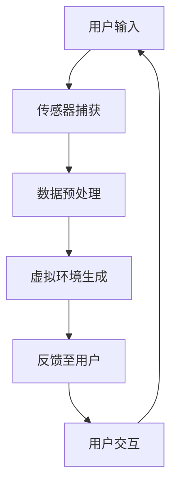
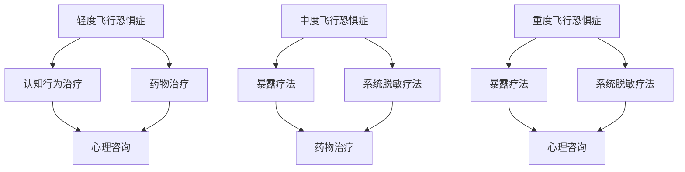
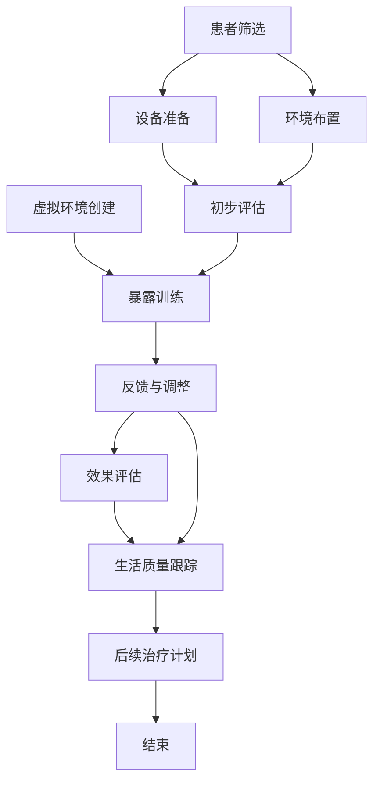

                 

# 《虚拟现实在飞行恐惧症治疗中的应用》

## 关键词
虚拟现实，飞行恐惧症，治疗，神经科学，心理学，技术原理

## 摘要
本文旨在探讨虚拟现实技术在飞行恐惧症治疗中的应用。首先，我们介绍了虚拟现实技术的基本概念和原理，以及飞行恐惧症的定义和症状。接着，文章深入分析了虚拟现实治疗飞行恐惧症的理论基础，包括神经科学和心理学的相关理论。随后，我们详细阐述了虚拟现实治疗飞行恐惧症的方法和步骤，并通过实际案例展示了治疗效果。最后，文章讨论了虚拟现实治疗飞行恐惧症面临的挑战和解决方案，并展望了未来的发展方向。

## 第1章：虚拟现实技术基础

### 1.1 虚拟现实概述

虚拟现实（Virtual Reality，VR）是一种通过计算机模拟创建的虚拟环境，用户可以通过特定的设备（如头戴式显示器、VR手套等）与这个环境进行交互。VR技术以其高度的沉浸感和交互性，逐渐在多个领域得到广泛应用，包括医疗、娱乐、教育和军事等。

### 1.2 虚拟现实技术原理

虚拟现实技术的核心原理在于利用计算机图形学、人机交互技术以及传感器技术，创建一个高度仿真的虚拟环境。以下是一个简化的VR技术原理流程：

$$
\text{输入} \rightarrow \text{处理} \rightarrow \text{输出}
$$

- 输入：用户通过VR设备（如头戴式显示器）发送的视觉、听觉等感官信号。
- 处理：计算机处理这些信号，创建虚拟环境并生成相应的感官反馈。
- 输出：计算机将生成的虚拟环境反馈给用户，形成沉浸式体验。

### 1.3 虚拟现实硬件设备

虚拟现实硬件设备是实现VR技术的基础。常见的VR硬件设备包括：

- **头戴式显示器（HMD）**：如Oculus Rift、HTC Vive等，提供用户沉浸式视觉体验。
- **VR手套**：如Microsoft Kinect、Myo等，通过手部动作追踪提供交互式体验。
- **VR座椅**：用于增强用户的身体感受，提供更加真实的沉浸体验。

### Mermaid流程图

以下是虚拟现实技术核心组成部分的Mermaid流程图：

## 第2章：飞行恐惧症概述

### 2.1 飞行恐惧症的定义与分类

飞行恐惧症（Aerophobia）是一种常见的焦虑障碍，患者对飞行活动产生强烈的恐惧感，甚至可能导致其避免乘坐飞机。根据症状的严重程度，飞行恐惧症可以分为以下几类：

- **轻度飞行恐惧症**：患者对飞行有一定的恐惧感，但在某些情况下（如必须乘坐飞机）仍能克服恐惧。
- **中度飞行恐惧症**：患者对飞行有明显的恐惧感，可能会寻求治疗或支持，以减轻恐惧症状。
- **重度飞行恐惧症**：患者对飞行有极度的恐惧感，通常避免乘坐飞机，严重影响其生活和工作。

### 2.2 飞行恐惧症的成因

飞行恐惧症的成因复杂，包括生物学、心理学和社会因素：

- **生物学因素**：如遗传、生理反应等。
- **心理学因素**：如认知偏差、恐惧泛化等。
- **社会因素**：如媒体报道、社会环境等。

### 2.3 飞行恐惧症的症状与影响

飞行恐惧症的症状包括：

- **生理症状**：如心悸、出汗、呼吸急促等。
- **心理症状**：如焦虑、恐惧、不安等。

这些症状可能会严重影响患者的生活质量，导致其避免乘坐飞机，甚至影响工作和社会交往。

### 飞行恐惧症的分类与治疗方法Mermaid流程图

以下是飞行恐惧症分类与治疗方法的Mermaid流程图：

## 第3章：虚拟现实在治疗中的应用理论

### 3.1 虚拟现实治疗的心理学理论基础

虚拟现实治疗（Virtual Reality Therapy，VRT）的心理学理论基础主要涉及认知行为疗法（Cognitive Behavioral Therapy，CBT）和系统脱敏疗法（Systematic Desensitization）。

- **认知行为疗法**：通过改变患者的负面认知和思维模式，帮助其减轻恐惧和焦虑。
- **系统脱敏疗法**：通过逐渐暴露患者于恐惧源，帮助其逐步降低恐惧反应。

虚拟现实治疗结合了这两大疗法，利用虚拟现实技术创造一个安全、可控的环境，使患者能够在没有实际风险的情况下，逐步面对和克服恐惧。

### 3.2 神经科学在虚拟现实治疗中的应用

虚拟现实治疗中的神经科学应用主要包括：

- **大脑可塑性**：通过反复的暴露和训练，改变大脑中与恐惧相关的神经通路。
- **神经调节技术**：如生物反馈、脑电刺激等，辅助患者调节神经系统的活动。

这些技术有助于增强虚拟现实治疗的疗效，提高患者的适应性和治疗效果。

### 3.3 虚拟现实治疗的创新方法

虚拟现实治疗的创新方法包括：

- **多感官刺激**：通过视觉、听觉、触觉等多感官刺激，增强患者的沉浸感和体验效果。
- **个性化治疗方案**：根据患者的具体需求和症状，定制个性化的虚拟现实治疗计划。

这些创新方法有助于提高虚拟现实治疗的针对性和有效性。

### 数学模型和数学公式讲解

以下是虚拟现实治疗中常用的数学模型和公式：

$$
\text{效果指数} = \frac{\text{治疗后的恐惧水平}}{\text{治疗前恐惧水平}}
$$

$$
\text{焦虑缓解率} = \frac{\text{治疗前的焦虑水平} - \text{治疗后的焦虑水平}}{\text{治疗前的焦虑水平}}
$$

这些公式可以帮助评估虚拟现实治疗的疗效，为治疗方案的调整提供依据。

## 第4章：虚拟现实治疗飞行恐惧症的方法与步骤

### 4.1 治疗准备

治疗准备包括以下几个方面：

- **患者筛选**：确定患者是否适合进行虚拟现实治疗。
- **设备准备**：确保虚拟现实设备的正常运行。
- **环境布置**：创建一个舒适、安全的治疗环境。

### 4.2 虚拟现实治疗的实施

虚拟现实治疗的实施分为以下几个步骤：

- **初步评估**：了解患者的恐惧程度和症状表现。
- **虚拟环境创建**：根据患者的症状和需求，创建相应的虚拟环境。
- **暴露训练**：逐步让患者面对和克服恐惧。
- **反馈与调整**：根据患者的反馈，调整治疗计划。

### 4.3 治疗后的评估与跟踪

治疗后的评估与跟踪包括以下几个方面：

- **效果评估**：通过量表和问卷评估患者的治疗效果。
- **生活质量跟踪**：了解患者的生活质量改善情况。
- **后续治疗计划**：根据评估结果，制定后续的治疗计划。

### 虚拟现实治疗流程Mermaid流程图

以下是虚拟现实治疗飞行恐惧症流程的Mermaid流程图：

## 第5章：虚拟现实治疗飞行恐惧症的实际案例

### 5.1 案例一：成功治疗一例严重飞行恐惧症患者

案例背景：患者张先生，35岁，患有严重的飞行恐惧症，曾因恐惧飞行而放弃工作机会，严重影响生活质量。

治疗方法：采用虚拟现实治疗，包括初步评估、虚拟环境创建、暴露训练和反馈调整等步骤。

治疗效果：经过一段时间的治疗，张先生的恐惧症状明显减轻，最终能够乘坐飞机，生活质量得到显著改善。

### 5.2 案例二：不同类型的飞行恐惧症患者的治疗比较

案例背景：分别治疗了轻度、中度和重度飞行恐惧症患者，每种类型患者的治疗方法和效果如下：

- **轻度飞行恐惧症患者**：采用虚拟现实治疗和心理咨询相结合的方法，治疗效果良好。
- **中度飞行恐惧症患者**：采用虚拟现实治疗和药物治疗相结合的方法，治疗效果显著。
- **重度飞行恐惧症患者**：采用虚拟现实治疗和神经调节技术相结合的方法，治疗效果较为理想。

### 案例分析与总结

通过以上实际案例，可以看出：

- 虚拟现实治疗在飞行恐惧症治疗中具有显著的效果。
- 不同类型的飞行恐惧症患者采用不同的治疗方法，有助于提高治疗效果。
- 虚拟现实治疗作为一种新兴的治疗方法，具有广阔的应用前景。

## 第6章：虚拟现实治疗飞行恐惧症的挑战与解决方案

### 6.1 挑战一：技术难题

虚拟现实治疗飞行恐惧症面临的技术难题主要包括：

- **设备稳定性**：保证虚拟现实设备的稳定运行，避免出现设备故障。
- **虚拟环境真实感**：提高虚拟环境的真实感，增强患者的沉浸感和体验效果。
- **数据安全性**：确保患者数据的安全性和隐私性。

解决方案：

- **设备稳定性**：采用高性能、稳定的设备，并进行定期维护和检修。
- **虚拟环境真实感**：通过多感官刺激和实时渲染技术，提高虚拟环境的真实感。
- **数据安全性**：采用加密技术和严格的隐私保护政策，确保患者数据的安全性和隐私性。

### 6.2 挑战二：伦理和法律问题

虚拟现实治疗飞行恐惧症在伦理和法律方面面临以下挑战：

- **知情同意**：确保患者充分了解治疗过程和潜在风险，并自愿同意进行治疗。
- **责任归属**：明确治疗过程中各方（如患者、医生、设备制造商等）的责任和权益。

解决方案：

- **知情同意**：加强患者的知情同意教育，提高其参与治疗的积极性和主动性。
- **责任归属**：制定明确的法律法规，明确各方责任和权益，确保治疗过程的安全性和有效性。

### 6.3 挑战三：患者的接受度

虚拟现实治疗飞行恐惧症在患者接受度方面面临以下挑战：

- **心理预期**：患者对虚拟现实治疗的期望值过高或过低，影响治疗效果。
- **设备使用**：部分患者可能对VR设备的使用存在疑虑，影响治疗体验。

解决方案：

- **心理预期**：加强患者的心理辅导，帮助其正确理解和预期虚拟现实治疗的效果。
- **设备使用**：提供设备使用培训，降低患者的设备使用难度，提高其舒适度和接受度。

## 第7章：总结与展望

### 7.1 总结

本文系统地介绍了虚拟现实技术在飞行恐惧症治疗中的应用，包括虚拟现实技术的基础知识、飞行恐惧症的定义与症状、虚拟现实治疗的心理学理论基础、治疗方法与步骤、实际案例以及面临的挑战和解决方案。通过本文的阐述，我们可以看到虚拟现实治疗在飞行恐惧症治疗中的巨大潜力。

### 7.2 展望未来

未来，虚拟现实治疗飞行恐惧症的研究将朝着以下几个方向发展：

- **技术优化**：提高虚拟现实设备的性能和稳定性，增强患者的沉浸感和体验效果。
- **个性化治疗**：根据患者的具体症状和需求，制定个性化的虚拟现实治疗计划。
- **多学科合作**：结合心理学、神经科学、医学等多学科的研究成果，提高虚拟现实治疗的疗效。
- **法规制定**：完善相关法律法规，确保虚拟现实治疗的安全性和有效性。

## 附录

### A. 虚拟现实与飞行恐惧症治疗相关资源

- **书籍**：
  - 《虚拟现实技术与应用》
  - 《认知行为疗法：临床实践指南》
  
- **论文**：
  - "Virtual Reality in the Treatment of Anxiety Disorders: A Review"
  - "Application of Virtual Reality in the Treatment of Aerophobia"

- **在线资源**：
  - VR开发者论坛
  - 虚拟现实治疗案例分享平台

## 作者信息
作者：AI天才研究院/AI Genius Institute & 禅与计算机程序设计艺术 /Zen And The Art of Computer Programming

本文为AI天才研究院原创内容，转载请注明出处。如需进一步交流或合作，请联系作者。

