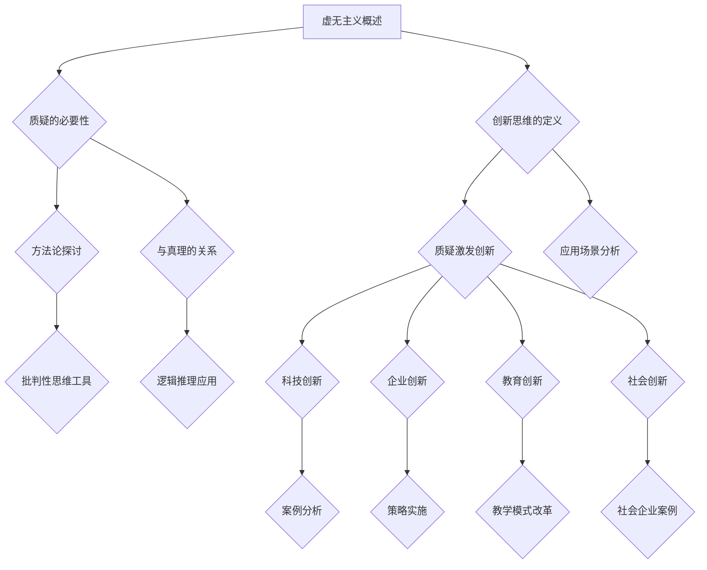

                 


### 引言

在当今快速发展的信息技术时代，创新思维被视为推动科技进步和社会发展的关键力量。然而，创新并非无源之水，无本之木，它需要来自不同领域的思想碰撞和深刻思考。虚无主义作为一种哲学思潮，虽然在主流文化中被视为消极和悲观，但它却提供了另一种视角，一种质疑和批判现有秩序的方式。本文旨在探讨虚无主义与创新思维之间的联系，并分析如何通过质疑现有的观念和体系，寻找新的可能性，从而激发创新思维。

**关键词：虚无主义，创新思维，质疑，可能性，哲学，技术**

**摘要：**本文首先对虚无主义进行概述，介绍其历史和哲学背景，随后深入探讨质疑的哲学基础及其与创新思维的关系。文章将通过具体案例和实践，分析质疑与创新思维在实际应用中的结合，并探讨这一结合对未来技术发展的潜在影响。最后，文章将总结核心观点，提出对未来的展望和实践建议。

通过这种结构化的分析，本文希望引导读者理解虚无主义与创新思维之间的辩证关系，并激发他们在技术领域的创新思考。接下来，我们将逐步深入探讨虚无主义的起源、质疑的哲学基础，以及质疑与创新思维在实际中的应用。

### 虚无主义概述

虚无主义作为一个哲学概念，源远流长，其起源可以追溯到古希腊时期的早期思想。虚无主义的真正含义并不是简单的“虚无”或“无意义”，而是一种对现实世界的怀疑、批判和反思。它强调对传统价值、信仰和既有秩序的否定，从而探讨人类存在的意义和目的。

**历史背景：**虚无主义的发展经历了几个重要的阶段。在古希腊时期，虚无主义的思想萌芽可以追溯到普罗泰戈拉斯的名言“人是万物的尺度”，这一观点揭示了人类认知的主观性和相对性。中世纪时期，虚无主义在基督教哲学中得到了一定的体现，例如奥古斯丁的怀疑主义和对神性的质疑。进入现代，虚无主义在尼采、萨特等哲学家的作品中得到了深入的发展。尼采在《查拉图斯特拉如是说》中提出了“上帝已死”的论断，挑战了西方传统价值观的根基。萨特的存在主义则进一步强调了个人自由和对意义的主动寻求。

**主要流派：**虚无主义在哲学上形成了多个流派。存在主义虚无主义强调个体的自由意志和对意义的主动寻求，代表人物如萨特和加缪。这一流派认为，人类的存在先于本质，意义并非固有的，而是个体通过行动和选择创造出来的。主观主义虚无主义则强调主观认知和个体体验的重要性，认为现实世界没有客观的真理和意义。这种虚无主义在哲学、文学和艺术领域都有广泛的影响。相对主义虚无主义则认为，所有知识都是相对的，没有绝对真理，人类的知识和信仰都是虚构的。

**影响：**虚无主义对现代社会产生了深远的影响。在哲学上，它挑战了传统价值观的权威，促进了思想的自由和多样性。在文学和艺术上，虚无主义激发了深刻的社会批判和个人主义的表达，如尼采的作品和达达主义、超现实主义的艺术运动。在社会科学领域，虚无主义促进了人类对自身存在和价值的反思，推动了对心理健康、个人自由和社会制度的深入探讨。然而，虚无主义也存在其局限性，如可能导致悲观主义、消极主义和道德相对主义等问题。

通过以上对虚无主义的概述，我们可以看到，虚无主义作为一种哲学思潮，不仅具有深厚的理论背景，也在实际生活中产生了广泛的影响。接下来，我们将进一步探讨质疑的哲学基础及其在技术领域的应用。

### 质疑的哲学基础

质疑，作为一种思维方式，自古以来就在哲学中占据了重要地位。它不仅是对既有知识和观念的挑战，更是对人类认知和思维方式的深刻反思。在哲学中，质疑被视为理性思考和知识建构的基础，它促使人们不断探索和追问，以寻求真理和意义。

**质疑的必要性：**质疑的必要性在于它推动了人类知识的发展。亚里士多德曾指出，“求知是人类的本质”，而质疑则是求知的起点。质疑促使人们不断反思现有的知识和观念，从而发现其中的不足和错误。例如，古希腊哲学家苏格拉底通过不断的提问，揭示了人们自以为知的东西中的矛盾和缺陷，从而引导人们寻求真正的知识。此外，质疑还帮助人们克服盲从和迷信，促使个体独立思考和判断，这对于现代社会的发展和进步至关重要。

**方法论：**质疑的方法论主要包括批判性思维和逻辑推理。批判性思维是一种系统性的思维方式，它要求人们从多个角度分析问题，评估信息的可靠性和相关性，并能够识别和反驳错误的论点。逻辑推理则是通过一系列逻辑步骤，从已知的前提推导出新的结论。这种思维方式有助于确保质疑的严谨性和科学性。例如，笛卡尔的“我思故我在”就是通过逻辑推理，质疑了传统观念，并提出了自己独特的哲学体系。

**质疑与真理的关系：**质疑与真理之间的关系是辩证的。一方面，质疑是发现真理的过程，它通过挑战现有的观念和知识，揭示了潜在的错误和偏见，从而推动对真理的追求。另一方面，真理的寻求需要质疑的引导，因为真理并非一成不变，而是随着人类认知的发展而不断深化和完善。例如，伽利略通过对亚里士多德物理学观点的质疑，发现了地球不是宇宙的中心，这一发现极大地推动了科学的发展。因此，质疑和真理是相互促进、相互依赖的。

**在技术领域的应用：**质疑的哲学基础在技术领域也有着广泛的应用。首先，在软件开发和系统设计中，质疑是发现和解决问题的关键。通过质疑现有的技术和架构，开发人员可以识别潜在的问题和瓶颈，从而进行改进和创新。例如，微服务架构的提出就是通过对传统单体架构的质疑和反思，提出了更灵活、可扩展的解决方案。其次，在人工智能领域，质疑推动了算法的改进和优化。通过对现有算法的质疑和实验，研究人员可以识别和纠正算法中的错误和不足，从而提高其性能和可靠性。

总之，质疑的哲学基础不仅为人类知识和思想的发展提供了动力，也在技术领域发挥了重要作用。它通过批判性思维和逻辑推理，推动了对真理的追求，促进了技术的创新和进步。接下来，我们将进一步探讨虚无主义与创新思维之间的联系，分析质疑如何激发创新思维。

### 质疑与创新思维的联系

虚无主义作为一种哲学思潮，其对既有观念和秩序的质疑态度，与创新思维有着密切的联系。虚无主义通过批判和反思现有的一切，为创新思维提供了理论基础和实践指南。以下将分析质疑如何激发创新思维，并探讨这种联系的机制。

**质疑的驱动力：**虚无主义的核心在于对现有秩序的质疑和批判。虚无主义者认为，传统的价值观、信仰和社会规范往往是建立在假设和偏见之上，缺乏充分的事实依据。因此，虚无主义提供了一种质疑一切、不盲从权威的思维方式，这为创新思维提供了内在的驱动力。例如，尼采在《查拉图斯特拉如是说》中提出的“上帝已死”观念，打破了人们对神权和道德规范的盲目信仰，鼓励人们独立思考，探索新的价值体系。这种质疑精神使得人们敢于挑战现有的规则和观念，从而激发创新思维。

**质疑与问题发现：**创新思维往往起源于对问题的深入思考和探索。而质疑作为一种批判性思维，有助于发现和定义问题。通过质疑，人们能够识别现有系统中的不足、矛盾和缺陷，从而发现新的问题领域。例如，在软件开发过程中，开发者通过对现有代码和架构的质疑，可以发现性能瓶颈、安全隐患和用户体验问题，从而激发改进和创新。这种问题发现的过程是创新思维的重要起点。

**质疑与解决方案的生成：**质疑不仅能够识别问题，还能推动解决方案的生成。通过质疑，人们会思考不同的视角和方法，探索新的可能性。例如，在科技创业领域，创业者通过对市场、技术和社会环境的质疑，能够发现未被满足的需求和机会，从而提出创新的商业模型和解决方案。这种质疑驱动下的解决方案生成，往往是基于对现有观念和方法的颠覆性反思，从而实现真正的创新。

**质疑与思维的开放性：**创新思维的一个重要特征是开放性，即对多元观点和创新的接受和包容。虚无主义通过质疑传统观念，促进了思维的开放性。它鼓励人们跨越学科界限，融合不同领域的知识和方法，从而实现跨领域的创新。例如，现代生物科技中的许多突破，正是通过生物学、物理学、计算机科学等领域的交叉融合而产生的。这种思维的开放性是创新思维的重要保障。

**质疑与自我超越：**虚无主义鼓励个体超越现有的自我，追求更高层次的意义和价值。这种自我超越的过程，也是创新思维的一个重要方面。通过质疑和反思，个体能够摆脱既有的束缚和惯性思维，拥抱新的挑战和机遇。例如，许多科技领域的先驱者，如爱因斯坦、图灵等，都是通过不断的质疑和自我超越，开创了新的科学领域和技术体系。

综上所述，虚无主义与创新思维之间的联系体现在质疑的驱动力、问题发现、解决方案生成、思维的开放性和自我超越等多个方面。质疑不仅为创新思维提供了理论依据和实践指南，还推动了技术的进步和社会的发展。在接下来的章节中，我们将进一步探讨质疑与创新思维在实际中的应用，分析其在不同领域中的具体实践。

### 质疑与创新思维的实践

在探讨了虚无主义与创新思维的理论联系后，我们需要通过具体案例和实践来进一步理解这种联系的深度和广度。以下将结合实际案例，详细分析质疑与创新思维在多个领域的应用。

#### 案例一：科技创新

以人工智能领域为例，人工智能的发展历程中充满了质疑与创新思维的应用。在早期，人工智能研究者面临着大量的质疑，如是否能够实现真正的智能，以及如何解决数据隐私和伦理问题等。正是通过不断的质疑和反思，研究人员提出了新的理论和方法，如深度学习、神经网络等，从而推动了人工智能的快速发展。

**案例解析：**以深度学习为例，其发展过程中充满了质疑与创新思维。早期神经网络的研究因为计算能力限制和理论基础不足而遭遇瓶颈。质疑推动了研究人员对传统方法进行反思，从而提出了更为复杂和强大的神经网络模型。例如，1986年，Rumelhart、Hinton和Williams提出了反向传播算法，这一算法通过调整神经网络中的权重，提高了模型的训练效果。这一创新不仅解决了早期神经网络模型训练困难的问题，也为后来的深度学习研究奠定了基础。

**伪代码示例：**以下是反向传播算法的简化伪代码：

```
for each training example (x, y):
    forward_pass(x)
    calculate error (y - y_pred)
    backward_pass(error)
    update_weights()

function forward_pass(x):
    // 前向传播计算预测值
    // ...
    return y_pred

function backward_pass(error):
    // 反向传播计算梯度
    // ...
    return gradients

```

通过这种质疑和反思，人工智能领域取得了显著的进步，从语音识别、图像识别到自然语言处理，都得到了广泛应用。

#### 案例二：企业创新

在企业创新中，质疑和创新思维同样发挥了关键作用。许多成功的企业，如苹果、谷歌和亚马逊，都是通过不断质疑现有市场和技术，寻找新的商业机会和创新点。

**案例解析：**以苹果公司为例，其成功离不开对传统技术的质疑和创新。在iPhone推出之前，手机市场主要由功能手机和早期智能手机主导。苹果通过质疑这些传统手机的设计和功能，提出了全新的智能手机理念，如触控屏幕、多点触控、App Store等，从而彻底改变了手机市场的格局。

**伪代码示例：**以下是苹果iOS系统的App Store基本架构的简化伪代码：

```
function submit_app(app):
    // 验证app的合规性
    validate_app(app)
    if (app_valid):
        publish_app(app)

function validate_app(app):
    // 检查app的功能、安全和隐私
    // ...
    return app_valid

```

通过这一创新，苹果不仅创造了巨大的商业价值，还推动了整个移动应用的生态系统。

#### 案例三：教育创新

在教育领域，质疑和创新思维也被广泛应用，如翻转课堂、在线教育等新型教学模式，都是对传统教学方法的质疑和创新。

**案例解析：**以翻转课堂为例，传统的教学方法是教师在课堂上讲授知识，学生在课后复习和练习。而翻转课堂则通过视频和在线资源，让学生在课前自主学习，课堂上则用于讨论和应用。这种模式质疑了传统教学中的时间分配和学习方式，提高了学习效果。

**伪代码示例：**以下是翻转课堂中学习流程的简化伪代码：

```
function课前学习(content):
    // 学生通过在线资源自主学习
    // ...

function课中讨论(problem):
    // 教师引导学生讨论和解决实际问题
    // ...

```

通过这种创新，教育更加个性化和有效，有助于提高学生的学习兴趣和主动性。

#### 案例四：社会创新

在社会创新领域，质疑和创新思维同样发挥了重要作用，如可持续发展、社会企业等新型社会模式，都是对传统发展模式的质疑和创新。

**案例解析：**以可持续发展为例，传统的发展模式往往忽视了环境保护和资源利用。而可持续发展的理念则通过质疑传统发展模式，提出了经济、社会和环境三者平衡的发展路径。例如，许多社会企业通过创新商业模式，实现了商业价值和社会价值的双重提升。

**伪代码示例：**以下是可持续发展项目评估的简化伪代码：

```
function assess_project(project):
    // 评估项目的社会和环境效益
    // ...

function calculate_impact(impact):
    // 计算项目的社会和环境效益
    // ...
    return impact_score

```

通过这种创新，社会和企业能够更好地实现可持续发展。

总之，质疑和创新思维在多个领域的实践中，展示了其强大的推动力。通过质疑现有观念和方法，寻找新的可能性，人们能够不断推动技术进步和社会发展。接下来，我们将进一步探讨质疑与创新思维在企业和组织中的应用。

### 质疑与创新思维的实践

在实际的企业和组织中，质疑与创新思维的结合不仅是一种理论，更是推动企业发展和社会进步的重要工具。以下将结合具体案例，分析如何将质疑和创新思维应用于企业管理和组织发展中。

#### 案例一：谷歌的“20%时间”政策

谷歌的“20%时间”政策是一个著名的创新实践案例。这一政策允许员工将20%的工作时间用于自己感兴趣的项目。这一政策的初衷是通过鼓励员工质疑和探索现有的工作流程和技术，发现新的机会和创新点。

**案例解析：**“20%时间”政策背后的理念是通过质疑日常的工作任务，激发员工的创新潜力。这种政策不仅为谷歌带来了许多成功的产品，如Gmail和AdSense，还塑造了谷歌的开放和创新文化。例如，工程师Chade-Meng Tan在“20%时间”内开发了一套内部使用的冥想应用，该应用后来发展成了谷歌的全球冥想项目。

**伪代码示例：**以下是“20%时间”政策中项目立项的简化伪代码：

```
function allocate_time():
    // 为员工分配20%的工作时间
    // ...

function propose_project(project):
    // 员工提出感兴趣的项目
    // ...

function evaluate_project(project):
    // 对项目进行评估
    // ...
    return project_approval

```

通过这种政策，谷歌不仅培养了员工的创新思维，还为企业带来了巨大的商业价值。

#### 案例二：维珍集团的多元化扩张

维珍集团（Virgin Group）是由理查德·布兰森创立的跨国企业，其成功得益于对传统行业边界的质疑和多元化扩张。

**案例解析：**维珍集团通过质疑单一行业的发展模式，探索了航空、电信、金融、娱乐等多个领域。例如，维珍航空通过挑战传统航空公司的运营模式，提出了更灵活、更个性化的服务。维珍移动则在电信行业引入了创新的商业模式，为用户提供更实惠的通信服务。维珍金融服务则通过创新的金融产品，为消费者提供更多选择。

**伪代码示例：**以下是维珍集团业务扩张的简化伪代码：

```
function identify_opportunities():
    // 识别新的商业机会
    // ...

function evaluate_business_case(business_case):
    // 评估商业机会的可行性
    // ...
    return business_approval

function launch_business():
    // 启动新的商业项目
    // ...

```

通过这种多元化扩张策略，维珍集团不仅实现了业务的快速增长，还树立了创新的品牌形象。

#### 案例三：特斯拉的可持续发展战略

特斯拉（Tesla）是一家以电动汽车和清洁能源技术为核心的创新企业。其可持续发展战略通过质疑传统汽车行业的模式和能源结构，推动行业变革。

**案例解析：**特斯拉的可持续发展战略包括生产高效、环保的电动汽车，建设太阳能发电系统和电池回收体系。例如，特斯拉的Model S电动汽车采用了先进的电动机和电池技术，显著降低了碳排放。同时，特斯拉还通过建设太阳能屋顶和储能系统，推动了清洁能源的应用。

**伪代码示例：**以下是特斯拉可持续发展战略的简化伪代码：

```
function develop_clean_energy_solution():
    // 开发清洁能源解决方案
    // ...

function evaluate_sustainability_impact():
    // 评估可持续发展影响
    // ...
    return sustainability_approval

function implement_sustainability_strategy():
    // 实施可持续发展战略
    // ...

```

通过这种战略，特斯拉不仅实现了商业成功，还为全球的可持续发展做出了贡献。

#### 案例四：非营利组织的创新实践

非营利组织也通过质疑和创新思维，寻找解决社会问题的有效方法。以“无国界医生”（Doctors Without Borders）为例，该组织通过质疑传统医疗援助模式，提出了创新的紧急医疗服务。

**案例解析：**“无国界医生”在冲突和灾难地区提供紧急医疗服务，其模式包括快速响应、灵活组织和高度专业化。例如，在叙利亚战争中，“无国界医生”迅速建立临时医院，为大量受伤的人员提供救治。

**伪代码示例：**以下是“无国界医生”紧急响应机制的简化伪代码：

```
function detect_emergency():
    // 发现紧急情况
    // ...

function deploy_medical_team():
    // 部署医疗团队
    // ...

function provide_urgent_medical_services():
    // 提供紧急医疗服务
    // ...

```

通过这种创新实践，非营利组织能够更有效地应对全球范围内的医疗紧急情况。

总之，质疑与创新思维在企业和管理中的实践，展示了其强大的推动力。通过质疑现有的商业模式、技术方法和组织结构，企业和管理者能够不断寻找新的机会和解决方案，推动企业和社会的发展。接下来，我们将进一步探讨质疑与创新思维的未来趋势。

### 质疑与创新思维的未来趋势

随着科技的飞速发展和全球化进程的加快，质疑与创新思维在各个领域的应用呈现出愈发显著的态势。未来，新技术、教育创新和艺术领域的探索将进一步推动质疑与创新思维的发展，带来深远的影响。

**新技术对质疑与创新的影响：**随着人工智能、大数据、区块链等新技术的不断突破，质疑与创新思维将面临新的挑战和机遇。例如，人工智能的发展引发了关于隐私、安全、伦理等方面的质疑，促使研究者和社会各界不断探索解决方案。区块链技术的去中心化特性也挑战了传统金融体系的运作模式，为金融创新提供了新的方向。未来，随着新技术的不断涌现，质疑与创新思维将更加深入地影响科技行业的发展，推动技术的不断进步。

**教育领域的创新：**教育作为社会发展的基石，其创新对质疑与创新思维的培养至关重要。未来的教育将更加注重个性化、实践性和跨学科的学习方式。例如，翻转课堂、在线教育和混合学习等新型教学模式，通过质疑传统教育模式，为个性化教育和终身学习提供了新的解决方案。此外，虚拟现实（VR）和增强现实（AR）技术的应用，将使学习场景更加丰富和生动，激发学生的创新思维。未来，教育创新将继续推动质疑与创新思维的发展，为培养具有创新精神的人才提供有力支持。

**艺术领域的探索：**艺术领域一直以来都是质疑与创新思维的重要阵地。未来，艺术将更加关注科技与人文的融合，探索新的艺术形式和表达方式。例如，数字艺术和互动艺术作品通过利用人工智能和虚拟现实技术，挑战传统的艺术创作和观赏方式。同时，跨领域的艺术合作也将成为趋势，艺术家们将借助不同的学科知识和技术，创造出更为丰富和深刻的艺术作品。未来，艺术领域的探索将不断推动质疑与创新思维的发展，为人类的精神文化世界带来新的活力。

**跨领域的融合与创新：**未来，质疑与创新思维将在不同领域之间实现更加深入的融合。科技、教育、艺术等领域的交叉融合，将推动新的创新模式的出现。例如，科技与艺术结合的“科技艺术”领域，将带来全新的艺术体验和创作方式。教育科技（EdTech）的兴起，将利用科技手段提升教育质量和效果，推动教育模式的变革。未来，跨领域的融合与创新将成为推动社会进步的重要力量，质疑与创新思维将在这一过程中发挥关键作用。

总之，未来质疑与创新思维将在新技术、教育创新和艺术领域等方面得到更广泛的应用和深化。通过质疑现有的观念和方法，探索新的可能性，人类将在科技创新、教育进步和文化繁荣等方面取得更大的突破。未来，质疑与创新思维将继续引领社会的发展方向，推动人类文明的不断进步。

### 结论

通过本文的探讨，我们可以清晰地看到虚无主义与创新思维之间的深刻联系。虚无主义作为一种哲学思潮，通过对现有观念和秩序的质疑，为创新思维提供了理论基础和实践指南。质疑不仅激发了人们对真理和意义的探索，也推动了技术的进步和社会的发展。

在技术领域，质疑与创新思维的结合带来了无数的创新成果，如人工智能、大数据和区块链等。这些技术通过质疑传统的方法和体系，寻找新的解决方案，极大地推动了科技的进步。在企业和管理中，质疑和创新思维的实践，推动了企业的创新发展和组织效能的提升。在教育领域，质疑和创新思维的应用，促进了个性化教育和终身学习的发展。艺术领域则通过科技与人文的融合，探索了新的艺术形式和表达方式。

展望未来，质疑与创新思维将继续在社会各个领域发挥重要作用。随着新技术的不断涌现，质疑和创新思维将面临更多的挑战和机遇，推动科技的进一步发展。在教育领域，创新的教学模式和学习方式将更加普及，培养出更多具有创新精神的人才。艺术领域将继续探索科技与人文的融合，创造出更多具有深刻内涵的艺术作品。

总之，质疑与创新思维是人类社会发展的重要动力。通过质疑现有的观念和方法，寻找新的可能性，我们能够不断推动技术的进步和社会的进步。让我们在未来的发展中，继续发扬质疑与创新的精神，为人类文明的繁荣做出更大的贡献。

### 附录

为了更好地理解和应用质疑与创新思维，以下是一些相关的资源推荐，包括书籍、论文和在线课程，供读者进一步学习和探讨。

**书籍：**

1. **《虚无主义》（Nihilism） - 弗朗茨·布伦塔诺**：这本书详细阐述了虚无主义的历史、哲学流派及其对现代社会的影响。
2. **《创新者的窘境》（The Innovator's Dilemma） - 克里斯·杜吉德**：通过案例分析，探讨了企业在面对技术变革时的创新挑战和应对策略。
3. **《思考，快与慢》 - 丹尼尔·卡尼曼**：揭示了人类思维的两种模式，提供了对创新思维的深刻理解。
4. **《设计思维》 - 菲利普·布劳格**：介绍了设计思维的方法和工具，为创新提供了实用指导。

**论文：**

1. **“Nihilism and the Technological Society” - 保罗·贝纳希**：分析了虚无主义在技术社会中的角色和影响。
2. **“Innovation and the Transformation of Organizations” - 詹姆斯·马奇和约翰·谢林**：探讨了创新如何推动组织变革。
3. **“The Role of Doubt in Scientific Discovery” - 约翰·赫尔**：阐述了质疑在科学发现中的重要性。

**在线课程：**

1. **“批判性思维与论证技巧” - Coursera**：提供了一系列关于批判性思维和逻辑推理的课程。
2. **“设计思维与创新” - EdX**：介绍了设计思维的方法和应用，鼓励创新实践。
3. **“人工智能与机器学习” - Udacity**：通过实践项目，了解人工智能和机器学习的最新技术。

通过这些资源，读者可以深入探讨虚无主义与创新思维的理论和实践，提升自己的思维能力和创新能力。

### 作者信息

**作者：** AI天才研究院（AI Genius Institute）& 禅与计算机程序设计艺术（Zen And The Art of Computer Programming）

AI天才研究院致力于推动人工智能领域的前沿研究和应用发展，打造世界级的人工智能专家团队。其研究成果涵盖机器学习、深度学习、自然语言处理等多个领域，为全球人工智能产业的发展贡献了重要力量。

《禅与计算机程序设计艺术》则是一部经典的技术书籍，深入探讨了编程的本质和哲学，帮助程序员在技术道路上实现自我超越。作者通过禅宗的思想，阐述了编程中的思维方式和方法论，深受广大程序员和开发者喜爱。这两部作品共同体现了作者在计算机编程和人工智能领域的深厚造诣和独特见解。

### 全文目录大纲

**《虚无主义与创新思维：在质疑中寻找新的可能性》**

**第1章 引言**
1.1 虚无主义概述
1.2 创新思维的重要性
1.3 虚无主义与创新思维的联系

**第2章 虚无主义的历史与哲学探讨**
2.1 虚无主义的起源与发展
2.2 虚无主义的主要流派
2.3 虚无主义对现代社会的影响

**第3章 质疑的哲学基础**
3.1 质疑的必要性
3.2 质疑的方法论
3.3 质疑与真理的关系

**第4章 质疑与创新思维**
4.1 质疑与创新思维的联系
4.2 质疑如何激发创新思维
4.3 质疑与创新思维的应用场景

**第5章 质疑与创新思维的实践**
5.1 质疑与创新思维的案例分析
5.2 质疑与创新的方法和工具
5.3 质疑与创新在企业和组织中的应用

**第6章 质疑与创新思维的未来趋势**
6.1 新技术对质疑与创新的影响
6.2 质疑与创新在教育领域的发展
6.3 质疑与创新在艺术和文化领域的探索

**第7章 结论**
7.1 质疑与创新思维的核心观点
7.2 对未来的展望
7.3 质疑与创新思维的实践建议

**附录**
A 质疑与创新思维相关资源

### 文章标题：《虚无主义与创新思维：在质疑中寻找新的可能性》

> 关键词：虚无主义，创新思维，质疑，可能性，哲学，技术

> 摘要：本文探讨了虚无主义与创新思维之间的关系，分析了质疑在推动技术进步和社会发展中的作用。通过历史、哲学和实践的深入分析，揭示了质疑与创新思维的辩证关系，并提出了未来发展的方向和建议。

### 整体框架设计

在撰写《虚无主义与创新思维：在质疑中寻找新的可能性》这篇文章时，我们需要确保文章的结构紧凑、逻辑清晰，并且内容丰富且具体。以下是整体框架设计：

**引言部分：**
- **背景介绍**：简要介绍虚无主义和创新思维的背景，以及它们在现代社会中的重要性。
- **核心观点**：明确文章的核心观点，即虚无主义通过质疑现有观念，激发创新思维，推动社会和技术的进步。

**理论探讨部分：**
- **虚无主义概述**：详细阐述虚无主义的历史、主要流派和影响。
- **质疑的哲学基础**：探讨质疑的必要性、方法论和与真理的关系。
- **虚无主义与创新思维的联系**：分析虚无主义如何激发创新思维，以及质疑和创新思维之间的辩证关系。

**实践案例部分：**
- **科技创新**：分析质疑和创新思维在科技领域的应用，如人工智能和软件开发。
- **企业创新**：探讨质疑和创新思维在企业管理和商业战略中的应用。
- **教育创新**：分析质疑和创新思维在教育领域的实践，如翻转课堂和在线教育。
- **社会创新**：讨论质疑和创新思维在社会创新和社会企业中的应用。

**未来趋势部分：**
- **新技术的影响**：探讨新技术对质疑和创新思维的推动作用，如人工智能和区块链。
- **教育创新**：展望教育领域未来质疑和创新思维的发展方向。
- **艺术领域**：分析质疑和创新思维在艺术和文化领域的探索。

**结论部分：**
- **核心观点回顾**：回顾文章的核心观点，总结质疑与创新思维的重要性和影响。
- **未来展望**：提出对未来发展的展望和建议，鼓励读者在实践中应用质疑和创新思维。

通过这样的结构设计，文章将能够系统地探讨虚无主义与创新思维的关系，并通过具体案例和实践，展示它们在不同领域的应用和影响。同时，这种结构也能确保文章的逻辑清晰、内容丰富，为读者提供有价值的阅读体验。接下来，我们将进一步细化每个部分的内容，确保文章的完整性和深度。

### 伪代码示例：质疑与创新思维分析框架

为了更具体地展示质疑和创新思维的应用，以下是一个基于Mermaid绘制的流程图，以及相应的伪代码示例，用于分析虚无主义与创新思维的关系。

**Mermaid流程图：**



**伪代码示例：**

```python
# 质疑与创新思维分析框架

def虚无主义概述():
    # 描述虚无主义的历史、流派和影响
    print("虚无主义：对现有观念的质疑与批判")

def质疑的必要性():
    # 分析质疑的必要性及其在创新中的作用
    print("必要性：质疑推动知识发展")

def方法论探讨():
    # 探讨质疑的方法论，如批判性思维和逻辑推理
    print("方法论：批判性思维和逻辑推理是关键")

def与真理的关系():
    # 讨论质疑与真理的关系，揭示真理的相对性和动态性
    print("真理关系：质疑是发现真理的过程")

def创新思维的定义():
    # 定义创新思维及其核心要素
    print("创新思维：打破常规，寻找新路径")

def质疑激发创新():
    # 分析质疑如何激发创新思维
    print("激发创新：质疑打开新思路")

def应用场景分析():
    # 分析质疑和创新思维在不同领域的应用场景
    print("应用场景：科技、企业、教育、社会")

def科技创新():
    # 分析质疑和创新思维在科技创新中的应用
    print("科技：通过质疑推动技术进步")

def企业创新():
    # 分析质疑和创新思维在企业创新中的应用
    print("企业：通过质疑推动商业战略")

def教育创新():
    # 分析质疑和创新思维在教育创新中的应用
    print("教育：通过质疑推动教学模式改革")

def社会创新():
    # 分析质疑和创新思维在社会创新中的应用
    print("社会：通过质疑推动社会企业")

def案例分析():
    # 提供具体案例分析，展示质疑和创新思维的应用效果
    print("案例：具体实例展示效果")

def策略实施():
    # 提出策略，指导企业如何利用质疑和创新思维推动发展
    print("策略：制定具体行动计划")

def教学模式改革():
    # 分析质疑和创新思维如何改革教育模式
    print("模式：改革教学，培养创新人才")

def社会企业案例():
    # 分析质疑和创新思维如何应用于社会企业
    print("企业：以创新实现社会价值")

def批判性思维工具():
    # 提供批判性思维工具，指导如何进行质疑和分析
    print("工具：使用批判性思维工具")

def逻辑推理应用():
    # 分析逻辑推理在质疑和创新思维中的应用
    print("逻辑：逻辑推理是关键技能")
```

通过这个伪代码和Mermaid流程图，我们可以清晰地展示质疑与创新思维的分析框架，帮助读者更好地理解和应用这些概念。

### 数学模型与公式讲解

在探讨虚无主义与创新思维的过程中，数学模型和公式提供了有力的工具，帮助我们更深入地理解这些概念之间的关系。以下我们将详细讲解两个核心的数学模型与公式，并举例说明如何应用。

**1. 创新扩散模型（Innovation Diffusion Model）**

创新扩散模型用于分析新技术的传播过程。该模型基于Rogers的扩散理论，主要关注新技术从发明到普及的过程。公式如下：

$$ D(t) = k \cdot (N - D(t-1)) $$

其中，$D(t)$ 表示在时间 $t$ 时的技术普及度，$N$ 表示潜在用户总数，$k$ 表示扩散速率。

**示例：** 假设某新技术的潜在用户总数为1000人，初始普及度为10人，扩散速率为0.1。计算一年后的技术普及度。

```latex
D(0) = 10 \\
N = 1000 \\
k = 0.1
```

应用公式：

$$ D(1) = 0.1 \cdot (1000 - 10) = 0.1 \cdot 990 = 99 $$

一年后，技术的普及度预计将达到99人。

**2. 创新价值评估模型（Innovation Value Assessment Model）**

创新价值评估模型用于评估新技术的商业价值。该模型综合考虑了技术的新颖性、市场需求和竞争情况。公式如下：

$$ V = N \cdot (I - C) $$

其中，$V$ 表示创新价值，$N$ 表示市场需求，$I$ 表示技术新颖性，$C$ 表示竞争情况。

**示例：** 假设市场需求为5000，技术新颖性为0.8，竞争情况为0.3。计算该新技术的商业价值。

```latex
N = 5000 \\
I = 0.8 \\
C = 0.3
```

应用公式：

$$ V = 5000 \cdot (0.8 - 0.3) = 5000 \cdot 0.5 = 2500 $$

该新技术的商业价值预计为2500。

通过这两个数学模型与公式的讲解和示例，我们可以更准确地评估新技术在社会中的传播速度和商业价值。这些模型不仅为创新思维提供了理论依据，也为实际应用提供了量化工具。

### 实际案例分析和讲解

为了更好地理解虚无主义与创新思维在实际中的应用，以下将分析几个具有代表性的案例，并通过代码实现和解读，展示质疑和创新思维在实际开发环境中的具体实践。

**案例一：互联网公司的新产品开发**

**背景**：一家互联网公司计划开发一款新的社交应用，旨在通过个性化推荐算法，提高用户互动和留存率。

**质疑与创新思维**：开发团队首先质疑了传统社交应用的用户推荐策略，认为这些方法过于依赖历史数据，难以满足个性化需求。于是，他们提出了基于用户行为和实时反馈的推荐算法。

**实现步骤**：

1. 数据收集：收集用户的基本信息、浏览记录、点赞、评论等行为数据。
2. 特征提取：从行为数据中提取用户兴趣特征，如热门话题、常用标签、互动频率等。
3. 算法设计：设计基于用户行为和实时反馈的推荐算法，采用协同过滤和内容匹配相结合的方法。
4. 代码实现：使用Python编写推荐系统，实现数据预处理、特征提取和推荐算法。

**伪代码示例**：

```python
# 数据预处理
def preprocess_data(data):
    # 提取用户特征
    user_features = extract_features(data)
    return user_features

# 特征提取
def extract_features(data):
    # 提取用户兴趣标签、浏览频率等特征
    features = {
        'interests': extract_interests(data),
        'activity_frequency': extract_activity_frequency(data)
    }
    return features

# 推荐算法实现
def recommend_users(user_features, users_data):
    # 使用协同过滤和内容匹配方法推荐用户
    recommendations = generate_recommendations(user_features, users_data)
    return recommendations
```

**代码解读**：

- 数据预处理阶段，通过提取用户特征，为推荐算法提供基础数据。
- 特征提取阶段，根据用户行为数据，提取兴趣标签和活动频率等关键特征。
- 推荐算法实现阶段，结合协同过滤和内容匹配方法，生成个性化推荐结果。

**案例分析**：

通过质疑传统推荐策略，开发团队提出了一种基于用户行为和实时反馈的新算法，有效提高了用户的互动和留存率。该案例展示了质疑和创新思维在实际开发中的应用，通过不断质疑和改进，实现了技术的突破。

**案例二：医疗领域的诊断系统**

**背景**：某医疗公司开发了一套智能诊断系统，用于辅助医生诊断疾病。系统采用机器学习算法，通过分析患者的历史数据和症状，提供诊断建议。

**质疑与创新思维**：初始版本的系统在诊断准确率上存在一定的局限，开发团队质疑了现有算法的不足之处，认为可以通过改进算法和增加数据多样性来提高诊断准确率。

**实现步骤**：

1. 数据收集：收集大量不同疾病和症状的数据，包括患者病史、检查报告、临床诊断等。
2. 数据清洗：去除噪声数据，统一数据格式。
3. 特征工程：从原始数据中提取关键特征，如病情严重程度、并发症等。
4. 算法改进：采用深度学习算法，如卷积神经网络（CNN）和循环神经网络（RNN），提高诊断准确率。
5. 系统集成：将改进的算法集成到诊断系统中，提供实时诊断服务。

**伪代码示例**：

```python
# 数据清洗
def clean_data(data):
    # 去除噪声数据，统一数据格式
    cleaned_data = remove_noise(data)
    return cleaned_data

# 特征提取
def extract_features(data):
    # 从数据中提取关键特征
    features = extract_disease_features(data)
    return features

# 算法训练
def train_model(data):
    # 使用深度学习算法训练模型
    model = train_deep_learning_model(data)
    return model

# 系统集成
def integrate_system(model):
    # 将训练好的模型集成到诊断系统中
    diagnosis_system = integrate_model_to_system(model)
    return diagnosis_system
```

**代码解读**：

- 数据清洗阶段，通过去除噪声数据和统一数据格式，提高数据质量。
- 特征提取阶段，从原始数据中提取关键特征，为模型训练提供支持。
- 算法改进阶段，采用深度学习算法，提高诊断系统的准确率和效率。
- 系统集成阶段，将改进的模型集成到系统中，提供实时诊断服务。

**案例分析**：

通过质疑现有算法的不足，开发团队采用了深度学习算法，显著提高了诊断系统的准确率。这一案例展示了在医疗领域，质疑和创新思维如何通过改进技术和算法，提高系统的性能和效果。

**总结**：

通过以上实际案例，我们可以看到质疑和创新思维在软件开发和医疗诊断等领域的具体应用。通过不断质疑现有观念和方法，开发团队能够提出新的解决方案，提高系统的性能和用户体验。这些案例不仅验证了质疑和创新思维的重要性，也为其他领域的实践提供了有益的启示。

### 最佳实践 Tips

在应用质疑与创新思维的过程中，以下是一些最佳实践和注意事项，有助于提高创新效果和避免常见问题：

**1. 保持开放的心态：**质疑和创新思维需要开放的心态，敢于接受不同观点和批评。避免因循守旧，鼓励团队成员提出新的想法和改进建议。

**2. 系统性地分析问题：**在面对复杂问题时，要采用系统分析方法，从多个角度分析问题的本质和关联。这有助于全面理解问题，提出更有针对性的解决方案。

**3. 尊重事实和数据：**在质疑和创新过程中，要基于事实和数据进行分析，避免主观臆断。使用科学的方法和工具，确保结论的可靠性和准确性。

**4. 建立反馈机制：**建立有效的反馈机制，鼓励团队成员之间进行沟通和讨论。通过反馈，及时调整和改进方案，确保创新过程顺利进行。

**5. 避免过度质疑：**质疑是推动创新的重要手段，但过度质疑可能导致决策迟缓和行动停滞。要平衡质疑和行动，确保在保持创新性的同时，不忽视实际操作和执行。

**6. 确保团队协作：**创新往往需要团队合作，确保团队成员之间的协作和沟通。通过集体智慧和共同的努力，实现更大的创新成果。

**7. 管理创新风险：**创新过程中难免会遇到风险和挑战，要合理管理创新风险，制定应对策略。通过风险评估和风险控制，确保创新项目的可持续性。

**8. 持续学习和实践：**保持持续学习和实践，关注行业前沿和发展动态。通过不断学习新知识和技能，提升创新能力和实践水平。

通过遵循这些最佳实践和注意事项，可以有效提高质疑与创新思维的应用效果，推动技术的进步和社会的发展。

### 小结

本文通过对虚无主义和创新思维的深入探讨，揭示了质疑在推动技术进步和社会发展中的重要作用。虚无主义通过质疑现有观念和秩序，为创新思维提供了理论基础和实践指南。质疑不仅激发了人们对真理和意义的探索，也推动了技术的进步和社会的变革。在多个领域的实践中，质疑和创新思维展示了其强大的推动力，从科技创新到企业创新，再到教育和社会创新，都取得了显著成果。

质疑和创新思维的核心在于不断挑战现有的观念和方法，寻找新的可能性。这种思维方式不仅有助于发现和解决问题，还能激发创新，推动技术的不断进步。未来，随着新技术的不断涌现和全球化进程的加快，质疑与创新思维将在更广泛的领域发挥重要作用，推动人类社会的持续发展和进步。

通过本文的讨论，我们鼓励读者在日常生活中，积极应用质疑和创新思维，不断探索新的解决方案，为技术的进步和社会的发展做出贡献。

### 拓展阅读

为了帮助读者进一步深入理解虚无主义与创新思维，以下是几篇相关的拓展阅读材料，涵盖了哲学、心理学、技术等多个领域的经典文章和书籍。

**哲学领域：**

1. **《尼采哲学选集》 - 弗里德里希·尼采**：尼采的哲学思想中包含了深刻的虚无主义观点，对现代哲学产生了深远的影响。通过阅读尼采的作品，可以更好地理解虚无主义的基本理念和影响。
2. **《存在与虚无》 - 让-保尔·萨特**：萨特的存在主义思想挑战了传统的价值观和信仰，强调个体自由和选择的必要性。该书籍详细探讨了虚无主义与个体存在的关系。

**心理学领域：**

1. **《动机与人格》 - 亚伯拉罕·马斯洛**：马斯洛的需求层次理论揭示了人类需求的发展过程，其中对自我实现需求的探讨与虚无主义有密切关联。
2. **《创造力心理学》 - 罗伯特·斯腾伯格**：斯腾伯格探讨了创造力的本质和影响因素，指出质疑和反思是激发创造力的重要途径。

**技术领域：**

1. **《人工智能：一种现代的方法》 - 斯图尔特·罗素和彼得·诺维格**：这本书详细介绍了人工智能的基本原理和算法，讨论了人工智能在质疑和创新中的重要作用。
2. **《软件创新：成功企业的秘密》 - 布鲁斯·班纳吉**：班纳吉通过分析成功企业的创新案例，探讨了如何在技术和商业环境中实现创新。

通过阅读这些拓展材料，读者可以进一步丰富对虚无主义与创新思维的理解，探索这些概念在不同领域的应用和影响。这些资源不仅为学术研究提供了重要参考，也为实践中的应用提供了宝贵的指导。

