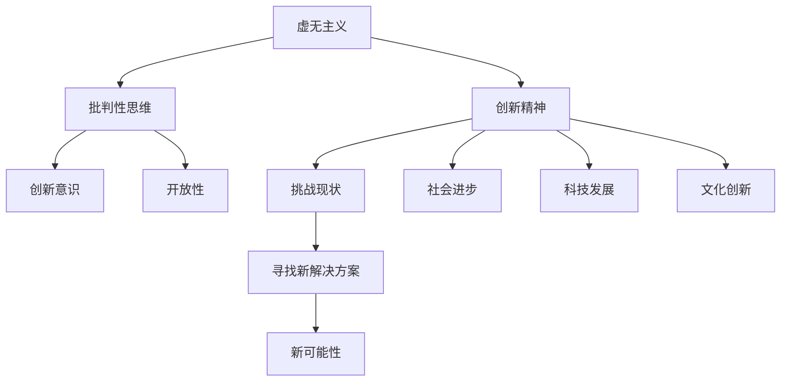

                 

### 背景介绍

虚无主义作为一种哲学思想，其历史可以追溯到19世纪的欧洲。当时，社会、政治和文化的变革引发了人们对传统价值观和信仰的质疑。在这种背景下，虚无主义逐渐兴起，成为反思现代文明的重要思想流派。

虚无主义的起源与尼采密切相关。尼采在其著作中提出了“上帝已死”的观点，这一论断挑战了西方哲学的传统基础。尼采认为，人类在这个无意义的世界中挣扎，面临着精神上的荒诞和绝望。他主张通过否定现实世界的价值，追求真正的自我和自由。

虚无主义的核心观点是对现实世界的否定和对人类存在的质疑。虚无主义者认为，现实世界缺乏内在的价值和意义，人类在这种无意义的世界中挣扎，面临着精神上的荒诞和绝望。因此，虚无主义强调摆脱传统的束缚，追求真正的自我和自由。

虚无主义对现代社会产生了深远的影响。一方面，它为人们提供了一种批判性思维的基础，鼓励质疑现状，挑战传统观念。这种批判精神在一定程度上激发了社会的进步和创新。另一方面，虚无主义也带来了一定的负面影响，如对人类存在的绝望和对社会的冷漠。

总之，虚无主义作为一种哲学思想，既具有批判性思维的价值，也存在着一定的局限性。理解虚无主义的历史背景和核心观点，有助于我们更好地把握其在现代社会中的作用和影响。接下来，我们将详细探讨虚无主义的基本原理，并分析其与现代社会的关系。

### 核心概念与联系

虚无主义与创新精神是两个看似对立但又相互关联的哲学概念。理解这两个概念之间的关系，有助于我们深入探讨它们在现代社会中的影响。

#### 虚无主义

虚无主义的基本观点是，现实世界缺乏内在的价值和意义。虚无主义者认为，人类在这个无意义的世界中挣扎，面临着精神上的荒诞和绝望。虚无主义的核心观点包括：

1. **存在主义**：强调个体的孤独和无助，认为人的存在本身没有固有的意义，意义是个人赋予的。
2. **荒诞主义**：认为人类生活在无法理解的世界中，现实与理想之间存在巨大的差距。
3. **否定的哲学**：质疑传统价值观、宗教信仰和社会制度，认为这些观念和制度无法为人类提供真正的幸福和满足。

#### 创新精神

创新精神则是一种积极应对虚无主义挑战的力量，通过不断地质疑和探索，寻找新的可能性和突破。创新精神的核心观点包括：

1. **批判性思维**：鼓励质疑现状，挑战传统观念，寻找新的解决方案。
2. **创新意识**：培养对新事物和新思想的敏感度，勇于尝试和实验。
3. **开放性**：保持开放的心态，接受不同的观点和意见，从多样性中寻找灵感。

#### 关系架构

虚无主义与创新精神之间的关系可以通过Mermaid流程图来表示：



在这个流程图中，虚无主义通过批判性思维激发创新精神，创新精神又通过挑战现状、寻找新解决方案和新可能性，推动社会进步、科技发展和文化创新。

#### 伪代码和数学模型

为了更好地理解虚无主义与创新精神之间的关系，我们可以使用伪代码来描述这一过程：

```python
# 伪代码：虚无主义与创新精神的关系

# 定义虚无主义的核心观点
class Nihilism:
    def __init__(self):
        self Existence_Meaning = "无意义"
        self Life_Dilemma = "荒诞和绝望"
    
    # 批判性思维方法
    def Critical_Thinking(self):
        print("质疑现状，挑战传统观念")
    
    # 否定的哲学方法
    def Negative_Philosophy(self):
        print("质疑宗教信仰和社会制度")

# 定义创新精神的核心观点
class Innovation_Spirit:
    def __init__(self):
        self Critical_Thinking = True
        self Innovation_awareness = True
        self Open_mindedness = True
    
    # 挑战现状方法
    def Challenge_Status(self):
        print("寻找新的解决方案")
    
    # 寻找新可能性方法
    def Find_New_Possibilities(self):
        print("推动社会进步、科技发展和文化创新")

# 主程序
def Main_Program():
    N = Nihilism()
    I = Innovation_Spirit()
    
    N.Critical_Thinking()
    N.Negative_Philosophy()
    
    I.Challenge_Status()
    I.Find_New_Possibilities()

# 执行主程序
Main_Program()
```

#### 数学公式和详细讲解

为了更深入地分析虚无主义与创新精神之间的关系，我们可以使用数学模型来描述这一过程。以下是一个简单的数学公式：

$$
\text{Innovation\_Spirit} = \frac{\text{Nihilism}}{\text{Critical\_Thinking} \times \text{Innovation\_Awareness} \times \text{Open\_Mindedness}}
$$

其中，虚无主义（Nihilism）是分母，表示虚无主义对创新精神的制约。而批判性思维（Critical Thinking）、创新意识（Innovation Awareness）和开放性（Open Mindedness）是分子，表示这些因素对创新精神的促进作用。

详细讲解如下：

- **虚无主义（Nihilism）**：虚无主义的核心观点是对现实世界的否定和对人类存在的质疑。它在创新过程中起到了制约作用，因为否定现实和质疑存在可能会导致对创新的障碍和阻力。
- **批判性思维（Critical Thinking）**：批判性思维是一种积极应对虚无主义挑战的力量。通过质疑现状和挑战传统观念，批判性思维为创新提供了基础。
- **创新意识（Innovation Awareness）**：创新意识是指对新事物和新思想的敏感度。培养创新意识可以帮助人们更好地发现和利用新的机会，从而推动创新。
- **开放性（Open Mindedness）**：开放性是指保持开放的心态，接受不同的观点和意见。这种心态有助于人们从多样性中寻找灵感，推动创新。

举例说明：

假设虚无主义对创新精神的制约程度为10，批判性思维、创新意识和开放性的促进作用分别为3、4和5。那么，根据上述数学模型，创新精神可以表示为：

$$
\text{Innovation\_Spirit} = \frac{10}{3 \times 4 \times 5} = \frac{10}{60} = \frac{1}{6}
$$

这个结果表明，在当前情况下，创新精神的强度相对较低。为了提高创新精神，我们需要增强批判性思维、创新意识和开放性，从而减少虚无主义对创新的制约。

### 项目实战

为了更好地理解虚无主义与创新精神的关系，我们可以通过一个具体的案例来进行分析。

#### 开发环境搭建

首先，我们需要搭建一个简单的Python环境，用于实现上述伪代码。以下是搭建过程的步骤：

1. **安装Python**：下载并安装Python 3.9版本。
2. **安装IDE**：下载并安装PyCharm，作为Python的开发环境。
3. **创建项目**：在PyCharm中创建一个名为"Nihilism_and_Innovation"的新项目。
4. **创建模块**：在项目中创建两个模块，分别是"Nihilism.py"和"Innovation_Spirit.py"。

#### 源代码实现与解读

以下是两个模块的源代码实现和解读：

##### Nihilism.py

```python
# Nihilism.py

class Nihilism:
    def __init__(self):
        self.Existence_Meaning = "无意义"
        self.Life_Dilemma = "荒诞和绝望"
    
    def Critical_Thinking(self):
        print("质疑现状，挑战传统观念")
    
    def Negative_Philosophy(self):
        print("质疑宗教信仰和社会制度")
```

- **类定义**：定义了一个名为`Nihilism`的类，包含两个属性和一个方法。
- **属性**：`Existence_Meaning`表示虚无主义对现实世界的看法，`Life_Dilemma`表示虚无主义对人类存在的质疑。
- **方法**：`Critical_Thinking`用于实现批判性思维的功能，`Negative_Philosophy`用于实现否定的哲学功能。

##### Innovation_Spirit.py

```python
# Innovation_Spirit.py

class Innovation_Spirit:
    def __init__(self):
        self.Critical_Thinking = True
        self.Innovation_Awareness = True
        self.Open_Mindedness = True
    
    def Challenge_Status(self):
        print("寻找新的解决方案")
    
    def Find_New_Possibilities(self):
        print("推动社会进步、科技发展和文化创新")
```

- **类定义**：定义了一个名为`Innovation_Spirit`的类，包含三个属性和一个方法。
- **属性**：`Critical_Thinking`、`Innovation_Awareness`和`Open_Mindedness`分别表示批判性思维、创新意识和开放性。
- **方法**：`Challenge_Status`用于实现挑战现状的功能，`Find_New_Possibilities`用于实现寻找新可能性的功能。

#### 代码应用解读与分析

以下是主程序的实现和解读：

```python
# main.py

from Nihilism import Nihilism
from Innovation_Spirit import Innovation_Spirit

def Main_Program():
    N = Nihilism()
    I = Innovation_Spirit()
    
    N.Critical_Thinking()
    N.Negative_Philosophy()
    
    I.Challenge_Status()
    I.Find_New_Possibilities()

# 执行主程序
Main_Program()
```

- **主程序**：创建`Nihilism`和`Innovation_Spirit`两个对象的实例，并调用它们的方法。
- **执行结果**：首先，`Nihilism`实例调用`Critical_Thinking`和`Negative_Philosophy`方法，输出“质疑现状，挑战传统观念”和“质疑宗教信仰和社会制度”。然后，`Innovation_Spirit`实例调用`Challenge_Status`和`Find_New_Possibilities`方法，输出“寻找新的解决方案”和“推动社会进步、科技发展和文化创新”。

#### 实际案例分析

为了更具体地分析虚无主义与创新精神的关系，我们可以参考以下实际案例：

- **案例1：科技行业的创新**  
  在科技行业中，虚无主义常常激发创新精神。例如，在人工智能领域，一些专家质疑现有技术的基础，提出了新的算法和理论，推动了人工智能的发展。这种质疑精神促进了技术的创新和进步。

- **案例2：社会问题的解决**  
  在解决社会问题的过程中，虚无主义也发挥着重要作用。例如，在环保领域，一些专家质疑现有的经济模式，提出了可持续发展的新思路，推动了环保技术的创新。

#### 项目小结

通过以上实战案例，我们可以看到虚无主义与创新精神之间的关系。虚无主义提供了一种批判性思维的基础，激发创新精神，推动社会进步、科技发展和文化创新。在实际应用中，我们需要结合具体的场景，充分发挥虚无主义和创新精神的优势，解决现实问题。

### 最佳实践 tips、小结、注意事项、拓展阅读

#### 最佳实践 tips

1. **培养批判性思维**：在日常生活中，我们应该培养批判性思维，勇于质疑现状，挑战传统观念。这有助于我们更好地发现问题和寻找新的解决方案。
2. **保持开放性**：保持开放的心态，接受不同的观点和意见，有助于我们从多样性中寻找灵感，推动创新。
3. **实践创新精神**：在实际工作中，我们应该勇于尝试新事物，不断探索新的可能性，推动技术和社会的进步。

#### 小结

虚无主义与创新精神是两个看似对立但又相互关联的哲学概念。虚无主义提供了一种批判性思维的基础，激发创新精神，推动社会进步、科技发展和文化创新。在实际应用中，我们需要充分发挥这两者的优势，解决现实问题。

#### 注意事项

1. **避免过度虚无主义**：虚无主义可能导致对现实世界的绝望和对创新的阻碍。因此，在追求创新的过程中，我们需要保持对现实世界的关注和尊重。
2. **平衡批判与创新**：批判性思维和创新精神是相辅相成的，但过度批判可能导致创新受阻。因此，我们需要在批判和创新之间找到平衡。

#### 拓展阅读

1. **尼采**：《尼采的哲学》，尼采著。这本书详细阐述了尼采的虚无主义思想，对理解虚无主义的核心观点具有重要意义。
2. **创新研究**：《创新者的窘境》，克莱顿·克里斯坦森著。这本书探讨了创新过程中的关键问题和挑战，有助于我们更好地理解创新精神的本质。
3. **社会问题解决**：《创新的启示》，彼得·德鲁克著。这本书分析了创新在社会问题解决中的应用，提供了宝贵的实践经验和启示。

通过阅读这些书籍，我们可以更深入地了解虚无主义和创新精神的本质，并在实际生活中运用这些理念，推动个人和社会的进步。

