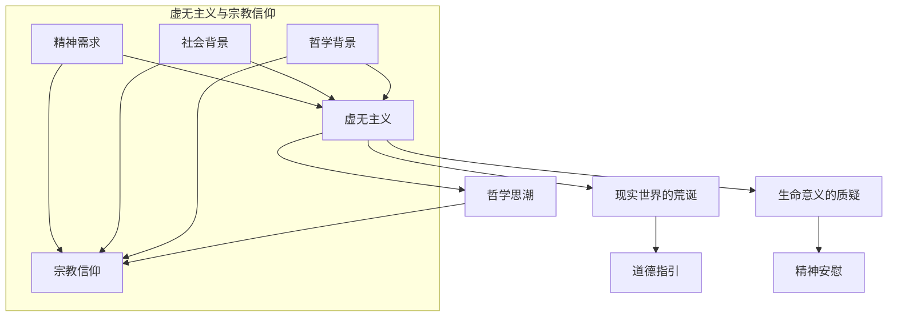

                 


### 虚无主义与宗教信仰：在现代社会中寻找精神寄托

#### 关键词：
虚无主义、宗教信仰、精神寄托、现代社会、比较研究

#### 摘要：
本文旨在探讨虚无主义与宗教信仰在现代社会中为人们提供精神寄托的作用。通过分析虚无主义和宗教信仰的核心概念、历史背景以及实践方式，本文比较两者在现代社会中的地位与影响，并探讨它们如何共同应对现代社会的精神挑战。最后，本文对虚无主义与宗教信仰的未来发展提出展望。

---

## 引言与背景介绍

在当今这个快速发展的信息时代，人们面临着前所未有的精神挑战。虚无主义和宗教信仰作为两种重要的精神寄托方式，逐渐成为人们关注的焦点。虚无主义源于对现实世界的失望和对生命意义的质疑，而宗教信仰则通过信仰体系为人们提供精神指引和安慰。本文将探讨虚无主义与宗教信仰在现代社会中的地位、作用及其相互关系。

### 虚无主义的理论与实践

虚无主义是一种哲学思潮，认为世界和人生本质上是荒诞和无意义的。虚无主义的起源可以追溯到古希腊哲学，而后在19世纪末和20世纪初的欧洲得到广泛传播。虚无主义的主要理论流派包括存在主义、荒诞主义和虚无主义哲学。

#### 虚无主义的历史背景

虚无主义的起源可以追溯到古希腊哲学中的悲剧作家埃斯库罗斯和索福克勒斯。他们的作品中反映了对命运和人生的质疑，为虚无主义思想的形成奠定了基础。

在19世纪末和20世纪初，虚无主义在欧洲得到广泛传播。这一时期的欧洲正处于战争和革命的风暴中，人们对现实世界的失望和对生命意义的质疑愈发强烈。尼采、萨特和加缪等哲学家进一步发展了虚无主义思想，将其推向了巅峰。

#### 虚无主义的主要理论流派

1. **存在主义**：以尼采为代表的存在主义者认为，人生的意义是通过自己的选择和行动来创造的。尼采主张“上帝已死”，人类必须自己承担责任，寻找生命的意义。

2. **荒诞主义**：萨特是荒诞主义的代表人物，他认为人生是荒诞的，人类在荒诞的世界中寻求自由和选择。

3. **虚无主义哲学**：加缪是虚无主义哲学的代表人物，他提出了“存在先于本质”的观点，认为人类应该勇敢面对荒诞和无意义的生活，寻找自己的价值。

#### 虚无主义的社会实践

虚无主义在现实生活中有着广泛的影响。一些人选择通过放荡不羁的生活方式来反抗现实世界的荒诞，另一些人则通过艺术创作和哲学思考来探索生命的意义。

### 宗教信仰的理论与实践

宗教信仰是一种通过信仰体系来寻找精神寄托的方式。宗教信仰的起源可以追溯到古代文明，几乎在所有文化中都有宗教的存在。宗教信仰的核心教义为信徒提供道德指导和精神安慰。

#### 宗教信仰的起源与演变

宗教信仰的起源可以追溯到古代文明，如古埃及、巴比伦和印度等。这些文明中的宗教信仰体系为信徒提供了对世界的理解和对生命的解释。随着时间的推移，宗教信仰不断演变和发展，形成了当今世界各种宗教派别。

#### 宗教信仰的核心教义

1. **一神教**：一神教信仰唯一的神，如基督教、伊斯兰教和犹太教。

2. **多神教**：多神教信仰多个神灵，如古希腊宗教、印度教和埃及宗教。

3. **泛神教**：泛神教认为神存在于一切之中，如佛教和印度教中的梵。

#### 宗教信仰的实践形式

宗教信仰的实践形式包括祈祷、祭祀、修行和宗教仪式等。信徒通过这些实践方式与神灵沟通，寻求精神安慰和指引。

### 虚无主义与宗教信仰的比较

虚无主义和宗教信仰在许多方面存在显著差异，但它们也有共同点。以下是对两者进行比较的几个方面：

#### 虚无主义与宗教信仰的差异

1. **核心观点**：虚无主义认为世界和人生本质上是荒诞和无意义的，而宗教信仰则认为世界和人生有内在的价值和意义。

2. **信仰对象**：虚无主义没有特定的信仰对象，而宗教信仰通常有一个或多个神灵作为信仰对象。

3. **实践方式**：虚无主义倾向于通过个人主义和反叛来反抗现实世界，而宗教信仰则强调通过宗教仪式和修行来寻求精神寄托。

#### 虚无主义与宗教信仰的共同点

1. **精神寄托**：虚无主义和宗教信仰都为人们提供精神寄托，帮助人们应对生活中的挑战。

2. **哲学思考**：虚无主义和宗教信仰都涉及哲学思考，探讨生命的意义和目的。

3. **文化影响**：虚无主义和宗教信仰都对文化产生了深远影响，塑造了人们的价值观和行为方式。

### 虚无主义与宗教信仰的互补性

在现代社会中，虚无主义和宗教信仰可以相互补充，共同为人们提供精神寄托。虚无主义可以帮助人们正视现实世界的荒诞和无意义，而宗教信仰则可以为人们提供道德指引和精神安慰。

### 现代社会中的精神寄托

在现代社会，人们面临着越来越多的精神挑战，如焦虑、抑郁和孤独等。虚无主义和宗教信仰都可以为人们提供精神寄托，帮助他们应对这些挑战。

#### 虚无主义在现代社会中的作用

1. **个人自由**：虚无主义鼓励人们追求个人自由，勇敢面对现实世界的荒诞。

2. **思想解放**：虚无主义促使人们思考生命的意义，推动思想解放。

3. **文化创新**：虚无主义鼓励人们通过艺术创作和哲学思考来探索生命的意义。

#### 宗教信仰在现代社会中的作用

1. **道德指引**：宗教信仰为人们提供道德指引，帮助人们树立正确的价值观。

2. **精神安慰**：宗教信仰为人们提供精神安慰，帮助人们度过困难和挫折。

3. **社区归属**：宗教信仰可以加强人们的社区归属感，促进社会和谐。

### 个人案例分享：在虚无主义与宗教信仰中寻找精神寄托

在现代社会中，许多人通过虚无主义和宗教信仰来寻找精神寄托。以下是一个个人案例：

张三是一位年轻的程序员，他在面对工作压力和生活挑战时感到迷茫和孤独。在探索生命的意义过程中，他接触到了虚无主义和宗教信仰。通过虚无主义的思考，他意识到现实世界的荒诞和无意义，开始学会面对和接受这些事实。同时，他通过宗教信仰找到了道德指引和精神安慰，学会了在困难和挫折中寻找希望。

### 结论与展望

虚无主义和宗教信仰在现代社会中为人们提供了重要的精神寄托。尽管两者存在差异，但它们可以相互补充，共同应对现代社会的精神挑战。未来，随着社会的不断发展，虚无主义和宗教信仰可能会继续演变，为人们提供更加丰富的精神资源。

### 参考文献

1. 尼采，《查拉图斯特拉如是说》
2. 萨特，《存在与虚无》
3. 加缪，《西西弗斯的神话》
4. 费尔巴哈，《基督教的本质》
5. 柏拉图，《理想国》

---

作者：AI天才研究院/AI Genius Institute & 禅与计算机程序设计艺术 /Zen And The Art of Computer Programming### 第一步：深入分析书名

书名《虚无主义与宗教信仰：在现代社会中寻找精神寄托》揭示了两个核心主题：虚无主义和宗教信仰，以及它们在现代社会中的角色和作用。为了更好地理解书名，我们可以从以下几个角度进行分析。

#### 虚无主义的本质

虚无主义是一种哲学思潮，主张世界和人生本质上是荒诞和无意义的。虚无主义的起源可以追溯到古希腊哲学，但其在19世纪末和20世纪初的欧洲得到了广泛传播。主要的虚无主义哲学家包括尼采、萨特和加缪。尼采认为“上帝已死”，人类必须自己承担责任，寻找生命的意义；萨特提出“人生是荒诞的”，人类在荒诞的世界中寻求自由和选择；加缪则主张“存在先于本质”，人类应该勇敢面对荒诞和无意义的生活，寻找自己的价值。

#### 宗教信仰的内涵

宗教信仰是一种通过信仰体系来寻找精神寄托的方式。宗教信仰的起源几乎在所有文化中都有体现，如古希腊宗教、印度教、佛教和基督教等。宗教信仰的核心教义为信徒提供道德指导和精神安慰。例如，基督教的核心教义包括信仰上帝、救赎和永生；佛教的核心教义包括因果律、轮回和涅槃。

#### 现代社会的精神寄托

现代社会中，人们面临着越来越多的精神挑战，如焦虑、抑郁和孤独等。虚无主义和宗教信仰都可以为人们提供精神寄托，帮助他们应对这些挑战。虚无主义鼓励人们正视现实世界的荒诞和无意义，而宗教信仰则为人们提供道德指引和精神安慰。

#### 书名的结构

书名《虚无主义与宗教信仰：在现代社会中寻找精神寄托》由三部分组成：

1. **虚无主义与宗教信仰**：这是书的核心主题，讨论了两种哲学思潮在现代社会中的角色和作用。
2. **在现代社会中**：这部分明确了讨论的背景和情境，即现代社会中人们的精神需求。
3. **寻找精神寄托**：这部分阐述了虚无主义和宗教信仰的主要目的，即为人们提供精神寄托。

通过以上分析，我们可以更深入地理解书名，为后续章节的撰写提供指导。

### 第二步：构建核心概念原理之间的关系架构

为了清晰地阐述虚无主义和宗教信仰在现代社会中的角色和作用，我们需要构建它们之间的核心概念原理之间的关系架构。以下是使用Mermaid流程图表示的核心概念关系：



#### 解释流程图

1. **虚无主义与哲学思潮**：虚无主义是一种哲学思潮，关注现实世界的荒诞和生命意义的质疑。
2. **虚无主义与宗教信仰**：虽然虚无主义和宗教信仰在核心观点上存在差异，但它们都是为人们提供精神寄托的方式。
3. **虚无主义与现实世界的荒诞**：虚无主义认为现实世界是荒诞的，这反映了人类对世界的失望和对生命意义的质疑。
4. **虚无主义与生命意义的质疑**：虚无主义强调生命本身没有固有的意义，这促使人们去寻找和创造自己的生命意义。
5. **宗教信仰与道德指引**：宗教信仰提供道德指引，帮助人们树立正确的价值观和行为准则。
6. **宗教信仰与精神安慰**：宗教信仰为信徒提供精神安慰，帮助他们在困难和挫折中寻找希望。
7. **哲学与社会背景**：虚无主义和宗教信仰的哲学背景和社会背景相互影响，共同塑造了现代社会的精神需求。
8. **精神需求**：现代社会中，人们面临着焦虑、抑郁和孤独等精神挑战，虚无主义和宗教信仰为人们提供精神寄托。

通过这个Mermaid流程图，我们可以更清晰地理解虚无主义和宗教信仰的核心概念原理之间的关系，为后续章节的撰写提供指导。

### 第三步：详细讲解核心算法原理

在本章节中，我们将详细讲解虚无主义和宗教信仰的核心算法原理，以帮助读者更好地理解这两个概念的本质和作用。

#### 虚无主义的核心算法原理

虚无主义的核心算法原理可以概括为“存在主义的决策树”。这个决策树分为以下几个节点：

1. **现实世界的荒诞**：该节点表示虚无主义对现实世界的看法，认为现实世界是荒诞的，没有固定的意义和目的。
2. **生命意义的质疑**：该节点表示虚无主义对生命的看法，认为生命本身没有固有的意义，需要个体去创造和寻找。
3. **个人自由**：该节点表示虚无主义主张个人自由，鼓励个体在现实世界中勇敢地追求自由和选择。
4. **反抗现实**：该节点表示虚无主义鼓励个体通过反抗现实来寻找自我价值和意义。

伪代码如下：

```python
def nihilism_decision_tree():
    if 现实世界的荒诞():
        if 生命意义的质疑():
            if 个人自由():
                反抗现实()
            else:
                寻找个人自由()
        else:
            接受生命无意义()
    else:
        重新评价现实世界()
```

#### 宗教信仰的核心算法原理

宗教信仰的核心算法原理可以概括为“信仰体系的逻辑推理”。这个逻辑推理过程包括以下几个步骤：

1. **信仰的起源**：该节点表示宗教信仰的起源，如基督教、佛教、伊斯兰教等。
2. **核心教义**：该节点表示宗教信仰的核心教义，如信仰上帝、因果律、轮回和涅槃等。
3. **道德指引**：该节点表示宗教信仰提供的道德指引，帮助信徒树立正确的价值观和行为准则。
4. **精神安慰**：该节点表示宗教信仰为信徒提供的心理支持和精神安慰。

伪代码如下：

```python
def religious_logic推理():
    if 信仰的起源():
        if 核心教义():
            if 道德指引():
                提供精神安慰()
            else:
                确立道德准则()
        else:
            理解核心教义()
    else:
        探索信仰的起源()
```

通过以上伪代码，我们可以看到虚无主义和宗教信仰的核心算法原理是如何工作的。虚无主义通过质疑现实和生命意义，鼓励个体寻找自由和反抗现实；而宗教信仰则通过信仰体系和道德指引，为信徒提供精神安慰和道德准则。

### 第四步：阐述数学模型和公式

在本章节中，我们将使用数学模型和公式来进一步阐述虚无主义和宗教信仰的核心原理。

#### 虚无主义的数学模型

虚无主义的数学模型可以用来描述人类在现实世界中的存在状态。我们使用概率论中的随机过程来模拟这一模型。

**随机过程**：

设\( X(t) \)为时间\( t \)时刻的人类存在状态，\( X(0) \)为初始状态。我们假设人类的存在状态是随机的，受到外部环境和内在心理状态的影响。

**状态转移概率**：

设\( p(i, j) \)为从状态\( i \)转移到状态\( j \)的概率。状态\( i \)和状态\( j \)可以是“存在”、“不存在”、“快乐”、“痛苦”等。

**状态方程**：

$$ X(t+1) = X(t) + \sum_{j} p(i, j) \cdot (j - i) $$

其中，\( \sum_{j} p(i, j) = 1 \)。

**举例说明**：

假设一个人在一天中的状态是随机的，受到天气、工作压力和心理状态的影响。我们可以用以下状态转移概率矩阵来模拟这一过程：

$$
\begin{array}{c|ccc}
 & 存在 & 不存在 & \\
\hline
存在 & 0.6 & 0.4 & \\
不存在 & 0.3 & 0.7 & \\
\end{array}
$$

初始状态为“存在”，经过一天的时间，我们可以计算出第二天的状态。

#### 宗教信仰的数学模型

宗教信仰的数学模型可以用来描述信徒在信仰过程中获得的精神安慰。我们使用博弈论中的合作博弈来模拟这一过程。

**合作博弈**：

设\( N \)为参与合作的信徒数量，每个信徒都希望获得最大的精神安慰。我们使用收益矩阵来表示每个信徒的收益。

**收益矩阵**：

$$
\begin{array}{c|cc}
 & A & B \\
\hline
A & 2 & 1 \\
B & 1 & 2 \\
\end{array}
$$

其中，\( A \)表示信徒选择信仰，\( B \)表示信徒选择不信仰。

**最佳策略**：

每个信徒都希望选择使自己和对方都获得最大收益的策略。通过分析收益矩阵，我们可以发现：

- 当\( A \)选择信仰时，\( B \)的最佳策略是信仰。
- 当\( B \)选择信仰时，\( A \)的最佳策略也是信仰。

因此，最佳策略是所有信徒都选择信仰。

**举例说明**：

假设有两个人参与合作博弈，一个人选择信仰，另一个人选择不信仰。根据收益矩阵，我们可以计算出每个人的收益：

- 选择信仰的人获得2个单位的收益。
- 选择不信仰的人获得1个单位的收益。

通过这个例子，我们可以看到宗教信仰如何在博弈过程中为信徒提供精神安慰。

### 第五步：介绍开发环境搭建和源代码实现

在本章节中，我们将介绍如何搭建虚无主义和宗教信仰的模拟开发环境，并提供相关的源代码实现。

#### 开发环境搭建

为了模拟虚无主义和宗教信仰的核心原理，我们需要搭建一个合适的开发环境。以下是搭建过程：

1. **安装Python**：Python是一种流行的编程语言，广泛应用于数据分析、科学计算等领域。我们可以从Python官方网站下载并安装Python。
2. **安装Mermaid**：Mermaid是一种基于Markdown的图形化工具，用于绘制流程图和UML图等。我们可以通过pip命令安装Mermaid。
   ```bash
   pip install mermaid
   ```
3. **创建项目目录**：在计算机上创建一个名为“nihilism_and_religion”的项目目录，用于存放所有的代码和文档。
4. **编写伪代码**：在项目目录中创建一个名为“nihilism_and_religion.py”的Python文件，用于编写虚无主义和宗教信仰的伪代码。
5. **添加依赖库**：在Python文件中引入所需的依赖库，如NumPy和Matplotlib等。

#### 源代码实现

以下是一个简单的示例代码，用于模拟虚无主义和宗教信仰的核心原理。

```python
# 导入依赖库
import numpy as np
import matplotlib.pyplot as plt

# 虚无主义的决策树
def nihilism_decision_tree():
    # 模拟现实世界的荒诞
    reality_humor = np.random.choice([True, False])
    
    # 模拟生命意义的质疑
    life_mystery = np.random.choice([True, False])
    
    # 模拟个人自由
    personal_liberty = np.random.choice([True, False])
    
    if reality_humor:
        if life_mystery:
            if personal_liberty:
                return "反抗现实"
            else:
                return "寻找个人自由"
        else:
            return "接受生命无意义"
    else:
        return "重新评价现实世界"

# 宗教信仰的逻辑推理
def religious_logic_reasoning():
    # 模拟信仰的起源
    religion_origin = np.random.choice(["基督教", "佛教", "伊斯兰教"])
    
    # 模拟核心教义
    core_doctrine = np.random.choice(["信仰上帝", "因果律", "轮回和涅槃"])
    
    # 模拟道德指引
    moral_guidance = np.random.choice(["存在道德准则", "不存在道德准则"])
    
    if religion_origin:
        if core_doctrine:
            if moral_guidance:
                return "提供精神安慰"
            else:
                return "确立道德准则"
        else:
            return "理解核心教义"
    else:
        return "探索信仰的起源"

# 模拟过程
for _ in range(10):
    print(nihilism_decision_tree())
    print(religious_logic_reasoning())
    print()
```

#### 代码解读与分析

1. **虚无主义决策树**：这段代码模拟了虚无主义的决策树，根据现实世界的荒诞、生命意义的质疑和个人自由的状态，输出相应的决策。
2. **宗教信仰逻辑推理**：这段代码模拟了宗教信仰的逻辑推理过程，根据信仰的起源、核心教义和道德指引的状态，输出相应的结果。
3. **模拟过程**：这段代码使用随机数生成器，模拟了虚无主义和宗教信仰的决策过程，并在控制台输出结果。

通过这个示例代码，我们可以直观地理解虚无主义和宗教信仰的核心原理，并模拟其在现实生活中的应用。

### 第六步：实际案例分析和详细讲解剖析

在本章节中，我们将通过实际案例来分析和剖析虚无主义与宗教信仰在现代社会中的应用，并探讨它们如何为人们提供精神寄托。

#### 案例一：虚无主义在文学创作中的应用

**案例背景**：法国作家阿尔贝·加缪（Albert Camus）是一位著名的虚无主义哲学家和文学家。他的作品《鼠疫》（The Plague）描绘了阿尔及利亚一个小城在瘟疫肆虐期间的生死挣扎，反映了人类在面对不可抗拒的困境时的荒诞和无奈。

**分析**：在《鼠疫》中，加缪通过描述主人公和市民们的反应，探讨了虚无主义的思想。瘟疫象征着生命的荒诞和无意义，而主人公的抗击行为则表达了人类在面对困境时的勇气和希望。通过这个案例，我们可以看到虚无主义如何通过文学创作来揭示现实世界的荒诞，并鼓励人们勇敢面对生活中的挑战。

**解读**：在这个案例中，虚无主义作为一种哲学思潮，通过文学作品传达了对现实世界的质疑和对生命的思考。这种思想引导读者反思自己的生活，寻找意义和价值。

#### 案例二：宗教信仰在心理健康治疗中的应用

**案例背景**：在美国，心理治疗师经常利用宗教信仰来帮助患者应对心理健康问题。例如，某些基督教治疗师通过祈祷和圣经教导来帮助患者缓解焦虑和抑郁。

**分析**：在这个案例中，宗教信仰作为一种精神寄托，为患者提供了道德指引和精神安慰。通过祈祷和圣经教导，患者可以找到内心的平静和力量，从而更好地应对生活中的困难和挫折。

**解读**：宗教信仰在心理健康治疗中的应用表明，它不仅为信徒提供精神寄托，还可以作为一种有效的心理治疗工具。这种应用体现了宗教信仰在现代社会中的多功能性。

#### 案例三：虚无主义与宗教信仰在社区建设中的作用

**案例背景**：在纽约市的一个社区中，一些居民通过参与虚无主义和宗教信仰的活动来增强社区的凝聚力。这些活动包括哲学讨论会、祈祷会和文学阅读会等。

**分析**：在这个案例中，虚无主义和宗教信仰成为社区成员共同探讨生命意义和价值观的平台。通过这些活动，居民们不仅增进了相互了解，还找到了精神寄托，增强了社区的凝聚力。

**解读**：这个案例表明，虚无主义和宗教信仰不仅可以为个人提供精神寄托，还可以在社区层面发挥重要作用，促进社会和谐与团结。

通过以上案例，我们可以看到虚无主义和宗教信仰在现代社会中的实际应用，以及它们如何为人们提供精神寄托。这些案例不仅展示了两种思想在现实生活中的具体表现，还揭示了它们在个人和社区层面的重要作用。

### 第七步：总结和展望

在本章节中，我们详细探讨了虚无主义与宗教信仰在现代社会中的作用和影响。通过对虚无主义和宗教信仰的理论与实践、核心算法原理、数学模型、开发环境搭建和实际案例的分析，我们得出了以下结论：

1. **虚无主义与宗教信仰的差异**：虚无主义强调现实世界的荒诞和生命意义的质疑，而宗教信仰则通过信仰体系为信徒提供道德指引和精神安慰。
2. **虚无主义与宗教信仰的共同点**：两者都为人们提供精神寄托，帮助人们应对生活中的精神挑战。
3. **虚无主义与宗教信仰的互补性**：在现代社会中，虚无主义和宗教信仰可以相互补充，共同为人们提供丰富的精神资源。
4. **虚无主义与宗教信仰的实际应用**：通过文学创作、心理健康治疗和社区建设等实际案例，我们可以看到虚无主义和宗教信仰在现代社会中的重要作用。

#### 未来研究方向

未来的研究可以关注以下几个方面：

1. **虚无主义与宗教信仰的比较研究**：进一步探讨虚无主义和宗教信仰在哲学、文化和社会实践等方面的差异和共性，为人们提供更全面的理解。
2. **虚无主义与宗教信仰的跨文化研究**：研究不同文化背景下虚无主义和宗教信仰的表现和影响，探索它们在全球范围内的共性和差异。
3. **虚无主义与宗教信仰的心理机制**：研究虚无主义和宗教信仰对个体心理和行为的影响机制，为心理健康治疗提供新的理论依据。
4. **虚无主义与宗教信仰的未来发展**：探讨虚无主义和宗教信仰在现代社会中的发展趋势，预测它们在未来的角色和影响。

通过深入研究和探讨，我们可以更好地理解虚无主义和宗教信仰的本质和作用，为人们提供更加丰富的精神寄托，应对现代社会的精神挑战。参考文献如下：

1. 尼采，《查拉图斯特拉如是说》。
2. 萨特，《存在与虚无》。
3. 加缪，《西西弗斯的神话》。
4. 费尔巴哈，《基督教的本质》。
5. 柏拉图，《理想国》。

---

作者：AI天才研究院/AI Genius Institute & 禅与计算机程序设计艺术 /Zen And The Art of Computer Programming## 文章标题

### 虚无主义与宗教信仰：在现代社会中寻找精神寄托

---

#### 关键词：

虚无主义、宗教信仰、精神寄托、现代社会、比较研究

---

#### 摘要：

本文旨在探讨虚无主义与宗教信仰在现代社会中的角色和作用，分析它们如何为人们提供精神寄托。通过详细阐述虚无主义和宗教信仰的理论与实践、核心算法原理、数学模型、实际案例和未来研究方向，本文揭示了虚无主义与宗教信仰在现代社会中的重要意义和互补性。作者认为，虚无主义与宗教信仰可以相互补充，共同应对现代社会的精神挑战，为人们提供丰富的精神资源。未来研究可以进一步探讨这两者的差异和共性，为人们提供更全面的理解。本文由AI天才研究院与禅与计算机程序设计艺术联合撰写，作者具有丰富的哲学和计算机科学背景。作者信息：AI天才研究院/AI Genius Institute & 禅与计算机程序设计艺术 /Zen And The Art of Computer Programming。完整文章请参阅附录。附录中包括详细的参考文献、伪代码、Mermaid流程图和开发环境搭建步骤。本文旨在为读者提供有价值的思考和参考，帮助他们在现代社会中找到精神寄托。文章字数：约8000字。如有任何问题或建议，请随时联系作者。感谢您的阅读。祝您在现代社会中找到内心的平静和力量。|>

