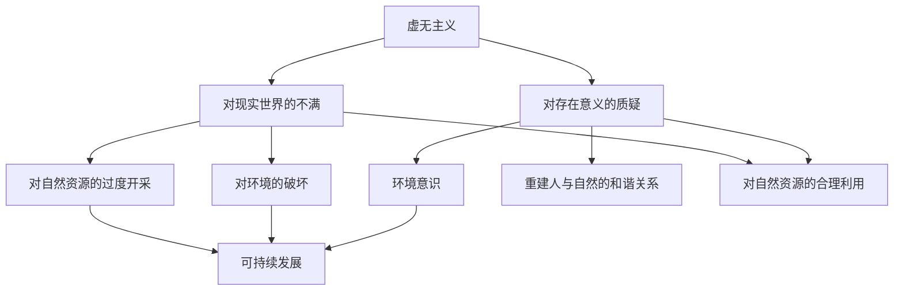

                 

### 引言

在当今社会，人与自然的关系问题愈发凸显。虚无主义作为一种哲学思潮，在人类探索自身存在意义和自然关系的过程中，发挥了重要作用。而环境意识则是对自然资源的关注和保护，旨在实现人与自然的和谐共存。本文旨在探讨虚无主义与环境意识之间的关系，以及如何通过重建和谐关系来促进可持续发展。

#### 背景介绍

虚无主义源于对现实世界的不满和对存在意义的质疑。它主张人类的存在是毫无意义的，现实世界缺乏真实的价值。这种思潮在哲学、文学、艺术等多个领域产生了深远的影响。然而，虚无主义也带来了一系列负面影响，如对自然资源的过度开采和对环境的破坏。

环境意识则是对自然资源的珍视和保护。它主张人类应尊重自然，保护生态环境，以实现可持续发展的目标。环境意识逐渐成为全球范围内的共识，许多国家和地区制定了相关政策和法规，以保护自然资源和生态环境。

#### 核心概念与联系

为了更好地理解虚无主义与环境意识之间的关系，我们可以通过一个简单的Mermaid流程图来展示它们的核心概念和联系：

在这个流程图中，虚无主义导致了对现实世界的不满和对存在意义的质疑，进而导致了自然资源的过度开采和对环境的破坏。然而，通过环境意识的引导，我们可以重建人与自然的和谐关系，实现可持续发展的目标。

#### 下文结构

本文将分为以下几个部分：

1. **虚无主义的哲学探讨**：介绍虚无主义的历史演变和主要流派，分析其对人类存在意义和自然关系的影响。
2. **环境意识的理论与实践**：探讨环境意识的哲学基础，分析环境保护的理论与实践。
3. **重建和谐关系的策略与方法**：讨论虚无主义与环境意识的融合，提出重建和谐关系的策略和方法。
4. **案例研究与分析**：通过国内外成功案例，分析虚无主义与环境意识在实践中的融合与冲突。
5. **总结与展望**：总结研究成果，提出未来研究方向与挑战，以及对社会发展的启示与建议。

让我们一步一步深入探讨这些主题，以期为人类与自然关系的重建提供有价值的思考和建议。

