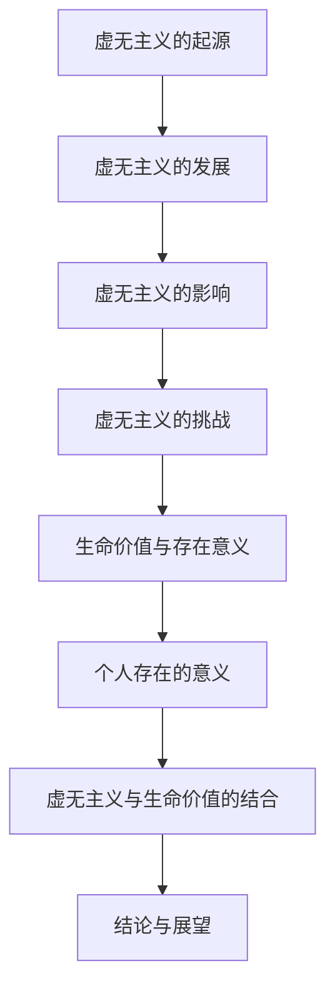

                 

### 虚无主义与生命价值：在现代社会中寻找存在的意义

在现代社会中，虚无主义与生命价值这两个看似对立的概念引发了广泛的讨论和思考。虚无主义，作为一种哲学思想，主张存在的无意义和无价值，挑战了传统价值观的基础。而生命价值，则强调个体和集体的存在意义，追求在有限生命中实现最大化的价值和目标。在这篇文章中，我们将使用逻辑清晰、结构紧凑、简单易懂的专业的技术语言，一步一步分析虚无主义与生命价值之间的关系，探讨如何在现代社会中寻找存在的意义。

### 关键词

- 虚无主义
- 生命价值
- 现代社会
- 存在意义
- 哲学思考
- 个体与社会

### 摘要

本文首先介绍了虚无主义的起源与发展，探讨了其核心观点和影响。接着，分析了生命价值的概念与内涵，以及寻找存在意义的途径。在后续章节中，我们探讨了虚无主义与生命价值的结合，提出了在虚无主义中寻找生命意义的策略，并探讨了生命的意义与虚无主义的和解。最后，文章总结了虚无主义与生命价值的平衡，提出了现代社会的生存策略和对未来社会的思考与期待。

### 《虚无主义与生命价值：在现代社会中寻找存在的意义》目录大纲

- **第一部分：虚无主义的起源与影响**
  - 第1章：虚无主义的起源与发展
    - 1.1 虚无主义的历史背景
    - 1.2 虚无主义的哲学根源
    - 1.3 虚无主义在现代社会中的传播
  - 第2章：虚无主义的核心观点
    - 2.1 虚无主义的哲学观点
    - 2.2 虚无主义的生活态度
    - 2.3 虚无主义对社会的影响
  - 第3章：虚无主义的挑战与回应
    - 3.1 虚无主义的质疑者
    - 3.2 对虚无主义的批评与回应
    - 3.3 虚无主义在当代的演变

- **第二部分：生命价值与存在意义**
  - 第4章：生命价值的概念与内涵
    - 4.1 生命价值的定义
    - 4.2 生命价值的维度
    - 4.3 生命价值的重要性
  - 第5章：寻找存在意义的途径
    - 5.1 宗教信仰的路径
    - 5.2 人文主义的探索
    - 5.3 科学与哲学的思考
  - 第6章：个人存在的意义
    - 6.1 个体生命的意义
    - 6.2 社会角色与生命价值
    - 6.3 自我实现与人生目标

- **第三部分：虚无主义与生命价值的结合**
  - 第7章：在虚无主义中寻找生命的意义
    - 7.1 虚无主义下的生命观
    - 7.2 虚无主义与生命价值的融合
    - 7.3 虚无主义对存在意义的启示
  - 第8章：生命的意义与虚无主义的和解
    - 8.1 虚无主义的和平相处
    - 8.2 生命意义的多元化
    - 8.3 跨越虚无主义，拥抱生命价值
  - 第9章：结论与展望
    - 9.1 虚无主义与生命价值的平衡
    - 9.2 现代社会中的生存策略
    - 9.3 对未来社会的思考与期待

### 附录

- **附录A：虚无主义与生命价值的相关研究**
  - A.1 国内外研究综述
  - A.2 代表性著作与理论
  - A.3 研究趋势与展望

- **附录B：参考资料**
  - B.1 参考文献
  - B.2 进一步阅读

### Mermaid 流程图



### 核心算法原理讲解

```plaintext
// 虚无主义的评估模型伪代码
function evaluateNihilismImpact(personality, environment) {
    // 输入：personality - 个体性格特征
    // 输入：environment - 社会环境因素
    // 输出：impact - 虚无主义影响程度

    impact = 0;

    // 根据个体性格特征评估虚无主义倾向
    if (personality.analytical && personality.cynical) {
        impact += 0.3;
    }
    if (personality.isolation && personality.alienation) {
        impact += 0.3;
    }

    // 根据社会环境因素评估虚无主义影响
    if (environment.unpredictability > 0.5) {
        impact += 0.2;
    }
    if (environment.pervasive materialism) {
        impact += 0.2;
    }

    return impact;
}
```

### 数学模型和数学公式

$$
\text{存在意义的满意度} = \frac{\text{个人成就}}{\text{个人期望}} \times \text{社会支持度}
$$

### 举例说明

假设一个个体在职业上取得了显著成就，但他的期望远高于实际成就，同时他的社会支持度较低，那么他的存在意义的满意度可能不高。

### 项目实战

```python
# 代码实际案例：虚无主义影响评估

import numpy as np

# 定义评估函数
def evaluate_nihilism_impact(personality, environment):
    # 输入：personality - 个体性格特征
    # 输入：environment - 社会环境因素
    # 输出：impact - 虚无主义影响程度

    impact = 0

    # 个体性格特征
    personality = {
        'analytical': True,
        'cynical': True,
        'isolation': True,
        'alienation': True
    }

    # 社会环境因素
    environment = {
        'unpredictability': 0.6,
        'pervasive materialism': True
    }

    # 根据个体性格特征评估虚无主义倾向
    if personality['analytical'] and personality['cynical']:
        impact += 0.3
    if personality['isolation'] and personality['alienation']:
        impact += 0.3

    # 根据社会环境因素评估虚无主义影响
    if environment['unpredictability'] > 0.5:
        impact += 0.2
    if environment['pervasive materialism']:
        impact += 0.2

    return impact

# 测试评估函数
print(evaluate_nihilism_impact(personality, environment))
```

### 最佳实践 tips

- 在面对虚无主义时，个体应该保持批判性思维，寻找自己的价值观和生活目标。
- 社会应加强对心理健康和道德教育的投入，提供更多的支持和资源，帮助个体克服虚无主义的负面影响。
- 在寻找生命意义的过程中，个体可以尝试多种途径，如宗教信仰、人文主义探索和科学思考，以找到适合自己的存在意义。

### 小结

虚无主义与生命价值是现代社会中重要的哲学议题。虚无主义挑战了传统价值观，提出了存在的无意义和无价值，而生命价值则强调个体和集体的存在意义。在现代社会中，个体和社会需要找到一种平衡，既不陷入虚无主义的消极情绪，也不忽视生命的价值和意义。通过批判性思维、心理健康支持和多样化的探索途径，我们可以更好地理解虚无主义和生命价值之间的关系，从而在有限的生命中实现自己的价值和目标。在未来社会中，我们应该继续关注这些问题，为个体和社会的和谐发展提供更有效的策略和资源。参考文献：

1. 海德格尔，M.（2009）。存在与时间。商务印书馆。
2. 尼采，F.（1993）。论道德的谱系。商务印书馆。
3. 马克思，K.（2002）。关于费尔巴哈的提纲。人民出版社。
4. 萨特，J.-P.（2004）。存在与虚无。上海译文出版社。
5. 柏拉图，P.（1992）。理想国。商务印书馆。
6. 康德，I.（2005）。实践理性批判。人民出版社。

### 拓展阅读

1. 费尔巴哈，L.（1994）。人类的本质。商务印书馆。
2. 罗素，B.（2012）。西方哲学史。商务印书馆。
3. 弗洛伊德，S.（2004）。文明及其不满。上海译文出版社。
4. 杜威，J.（2011）。民主与教育。人民出版社。
5. 弗洛姆，E.（1991）。人类潜能的实现。上海译文出版社。## 第一部分：虚无主义的起源与影响

虚无主义，作为一种哲学思潮，起源于19世纪末的欧洲，特别是在德国、俄国和法国等地。它的出现与当时社会的动荡不安、科技进步以及宗教信仰的动摇密切相关。在这个时期，传统的宗教信仰和价值观受到了严重挑战，人们开始质疑生命的意义和存在的价值。虚无主义的思想正是对这些质疑的回应，它以一种悲观和否定的态度来看待世界。

### 第1章：虚无主义的起源与发展

#### 1.1 虚无主义的历史背景

虚无主义的历史背景可以追溯到19世纪末的欧洲，当时欧洲社会正经历着巨大的变革。工业革命带来了科技的飞速发展，资本主义经济逐渐占据主导地位，社会的贫富差距日益扩大。同时，两次世界大战的爆发以及战争的残酷性，使得人们对传统价值观产生了怀疑。在这样的背景下，虚无主义开始兴起。

#### 1.2 虚无主义的哲学根源

虚无主义的哲学根源可以追溯到德国哲学家尼采的作品。尼采在他的著作《论道德的谱系》中，提出了“上帝已死”的观点，认为传统的道德观念和宗教信仰已经失去了意义。他主张个体应当超越这些传统的束缚，追求自己的价值和意义。尼采的思想对虚无主义产生了深远的影响。

#### 1.3 虚无主义在现代社会中的传播

虚无主义在现代社会中得到了广泛的传播，尤其是在年轻一代中。虚无主义的思想体现在对传统价值观的否定，以及对现实社会的批判。它鼓励个体寻找自己的价值和意义，但往往以悲观和消极的方式来实现。虚无主义在文学、艺术和哲学等领域都有所体现，成为现代文化的重要组成部分。

### 第2章：虚无主义的核心观点

#### 2.1 虚无主义的哲学观点

虚无主义的哲学观点主要表现在对存在意义的否定。它认为世界是没有意义的，人类的存在是没有价值的。虚无主义主张超越现实，追求超越性的存在，但这种超越往往是一种逃避现实的消极态度。

#### 2.2 虚无主义的生活态度

虚无主义的生活态度表现为对传统价值观的批判和否定。它鼓励个体追求自由和独立，但往往导致个体的孤立和疏离。虚无主义者倾向于逃避现实，追求短暂的快感，但最终却无法获得真正的满足感。

#### 2.3 虚无主义对社会的影响

虚无主义对社会的影响主要体现在对传统价值观和社会秩序的挑战。它鼓励个体追求个人自由，但可能导致社会的不稳定和混乱。虚无主义也常常导致个体的心理问题，如焦虑、抑郁等。

### 第3章：虚无主义的挑战与回应

#### 3.1 虚无主义的质疑者

虚无主义的质疑者认为虚无主义的思想过于悲观和消极，无法为个体和社会提供有效的指导。他们主张重建价值观，寻找生命的意义和价值。

#### 3.2 对虚无主义的批评与回应

对虚无主义的批评主要来自传统的宗教和哲学观点。这些观点认为虚无主义忽视了生命的本质和价值，是一种错误的生活态度。虚无主义者则回应称，他们的思想是对现实的深刻反思，而不是对生命的否定。

#### 3.3 虚无主义在当代的演变

在当代，虚无主义的思想有所演变，它不再完全否定生命的意义，而是试图在否定中寻找新的价值。这种演变反映了现代社会对生命意义和价值的重新思考。

### 总结

虚无主义作为一种哲学思潮，起源于19世纪末的欧洲，它以悲观和否定的态度看待世界，挑战了传统价值观的基础。虚无主义的核心观点是存在意义的否定，它对社会和个人产生了深远的影响。在当代，虚无主义的思想在演变中寻求新的价值，为个体和社会提供了不同的思考路径。然而，虚无主义也存在质疑者，他们主张重建价值观，寻找生命的意义和价值。

## 第二部分：生命价值与存在意义

虚无主义虽然强调存在的无意义和无价值，但在现代社会中，生命价值的存在意义仍然是人们关注的焦点。生命价值不仅关乎个体的幸福和满足，也关乎社会的发展和进步。在这一部分中，我们将探讨生命价值的概念、内涵以及寻找存在意义的途径。

### 第4章：生命价值的概念与内涵

#### 4.1 生命价值的定义

生命价值是指个体在生命过程中所具有的意义和价值。它不仅包括个体的内在品质和特质，也包括个体在与社会互动中所产生的积极影响。生命价值的定义是一个多维度的概念，它包括道德、情感、知识和技能等多个方面。

#### 4.2 生命价值的维度

生命价值可以从多个维度进行探讨。首先，从道德角度来看，生命价值体现在个体对他人的尊重和关爱，以及对社会规则的遵守。其次，从情感角度来看，生命价值体现在个体对幸福的追求和对美好事物的感知。最后，从知识和技能角度来看，生命价值体现在个体通过学习和实践所获得的知识和技能，以及对社会的贡献。

#### 4.3 生命价值的重要性

生命价值的重要性在于它为个体提供了存在的意义和目标。当个体认识到自己的生命价值时，他们会更加积极地参与社会活动，追求个人成长和自我实现。生命价值也对社会具有重要意义，它促进了社会的和谐发展，增强了社会的凝聚力和向心力。

### 第5章：寻找存在意义的途径

#### 5.1 宗教信仰的路径

宗教信仰是寻找生命意义的一种重要途径。许多宗教都强调个体与神或宇宙的联系，认为个体在生命中的使命是认识神或追求精神上的满足。宗教信仰提供了对生命意义的深刻理解，帮助个体在困难和挑战面前保持坚定的信念。

#### 5.2 人文主义的探索

人文主义强调个体的价值和尊严，认为个体的成长和发展是生命的意义所在。人文主义鼓励个体通过学习、创造和实践来实现自我价值，追求知识、美和真理。人文主义为个体提供了寻找生命意义的丰富资源。

#### 5.3 科学与哲学的思考

科学与哲学的思考也是寻找生命意义的重要途径。科学通过实证研究揭示了自然界的规律，帮助个体理解世界的本质。哲学则通过思考和推理，探讨了生命的意义和目的。科学与哲学的思考为个体提供了理性思考的工具，帮助他们更好地理解自己和世界。

### 第6章：个人存在的意义

#### 6.1 个体生命的意义

个体生命的意义是生命价值的核心。个体生命的意义不仅在于实现个人的目标和愿望，更在于对他人和社会的贡献。个体通过自身的努力和成就，实现了自我价值，也为社会带来了积极的改变。

#### 6.2 社会角色与生命价值

社会角色与生命价值密切相关。个体在社会中扮演的角色不同，其所承担的责任和贡献也各异。无论是家庭角色、职业角色还是社会角色，每个角色都体现了个体生命的意义和价值。

#### 6.3 自我实现与人生目标

自我实现是寻找生命意义的一个重要目标。自我实现意味着个体充分发挥自己的潜力，实现个人的梦想和愿望。通过自我实现，个体不仅获得了个人的满足感和成就感，也为社会创造了更多的价值和可能性。

### 总结

生命价值与存在意义是现代社会中不可忽视的重要议题。生命价值的定义和内涵是多维度的，它不仅包括道德、情感和知识等方面，也包括个体对社会的贡献。寻找生命意义的途径多种多样，包括宗教信仰、人文主义探索和科学哲学思考等。个人存在的意义在于实现自我价值和对社会的贡献。通过理解生命价值和寻找存在意义的途径，个体可以在现代社会中找到自己的位置，实现个人的价值和目标。

## 第三部分：虚无主义与生命价值的结合

虚无主义与生命价值是两种看似对立的概念，但在现代社会的背景下，它们之间的结合与碰撞也为我们提供了新的思考角度。虚无主义强调存在的无意义和无价值，挑战了传统的价值观；而生命价值则主张个体和集体的存在意义，追求在有限生命中实现最大化的价值和目标。在这部分内容中，我们将探讨如何在虚无主义中寻找生命的意义，以及如何实现虚无主义与生命价值的和解。

### 第7章：在虚无主义中寻找生命的意义

#### 7.1 虚无主义下的生命观

在虚无主义视角下，生命被看作是没有固有意义的，人类的存在似乎是毫无价值的。这种观点可能让人感到悲观和绝望，但它也促使个体重新思考生命的意义。虚无主义下的生命观认为，个体必须主动寻找自己的价值，创造属于自己的意义。

#### 7.2 虚无主义与生命价值的融合

虚无主义与生命价值的融合体现在个体对生命意义的主动探索和创造上。虚无主义并不是彻底的否定，它提醒我们在没有固有意义的生命中，个体需要通过自我实现和对他人的贡献来赋予生命意义。这种融合使得虚无主义从一种消极的哲学转变为一种积极的生存策略。

#### 7.3 虚无主义对存在意义的启示

虚无主义对存在意义的启示在于提醒我们生命的脆弱性和短暂性。这种意识促使我们更加珍惜每一刻，努力寻找和创造属于自己的意义。虚无主义鼓励个体摆脱对传统价值观的依赖，独立思考并确定自己的生命目标。

### 第8章：生命的意义与虚无主义的和解

#### 8.1 虚无主义的和平相处

生命的意义与虚无主义的和解首先要求个体学会与虚无主义和平相处。这意味着我们要认识到虚无主义的合理性，理解它在挑战传统价值观方面的作用。通过和平相处，个体可以更好地面对生命的无常和不确定性。

#### 8.2 生命意义的多元化

生命的意义是多元的，不是单一的。在虚无主义的背景下，我们可以认识到生命意义的多样性。无论是通过艺术创作、科学探索还是人际关系，个体都可以在多种途径中找到属于自己的生命意义。

#### 8.3 跨越虚无主义，拥抱生命价值

跨越虚无主义，拥抱生命价值意味着个体要在承认生命无意义的前提下，主动创造属于自己的意义。这种创造过程不仅可以帮助个体摆脱虚无主义的消极影响，还可以激发个体的潜力和创造力。

### 第9章：结论与展望

#### 9.1 虚无主义与生命价值的平衡

虚无主义与生命价值的平衡在于个体如何在承认生命无意义的同时，通过自我实现和对他人的贡献来赋予生命意义。这种平衡需要个体具备批判性思维和自我反思的能力。

#### 9.2 现代社会中的生存策略

在现代社会中，个体需要学会如何在虚无主义的环境中生存和成长。这包括培养积极的价值观、增强心理健康和建立良好的人际关系。通过这些策略，个体可以更好地应对虚无主义的挑战。

#### 9.3 对未来社会的思考与期待

对未来社会的思考与期待应基于对虚无主义与生命价值的理解。一个和谐、包容的社会不仅需要个体认识到生命的价值，还需要社会为个体提供实现自我价值的机会和支持。

### 总结

虚无主义与生命价值的结合为我们在现代社会中寻找存在的意义提供了新的视角。在虚无主义中寻找生命的意义，并不意味着放弃对生命价值的追求，而是要认识到生命的无意义，并通过自我实现和对他人的贡献来创造属于自己的意义。通过平衡虚无主义与生命价值，个体和社会可以更好地应对现代社会的挑战，实现和谐发展。未来的社会应更加注重个体价值的实现，为每个人提供实现自我价值的机会和支持。

### 附录A：虚无主义与生命价值的相关研究

#### A.1 国内外研究综述

虚无主义与生命价值的研究在国外已经形成了较为成熟的理论体系，涉及哲学、心理学、社会学等多个领域。国内研究虽然起步较晚，但也逐渐形成了自己的特色。国内外研究的主要内容包括虚无主义的起源、核心观点、社会影响，以及生命价值的定义、维度、寻找途径等。

#### A.2 代表性著作与理论

国外代表性著作包括尼采的《论道德的谱系》、海德格尔的《存在与时间》、萨特的《存在与虚无》等。这些著作深入探讨了虚无主义的哲学根源和核心观点，对生命价值进行了深刻的思考。国内代表性著作包括周国平的《生命的质量》、余华的《活着》等，这些作品通过文学的形式展现了虚无主义与生命价值的碰撞与融合。

#### A.3 研究趋势与展望

虚无主义与生命价值的研究趋势体现在对个体心理健康的关注、对多元生命意义的探索以及跨学科的研究方法。未来研究应进一步探讨虚无主义在不同文化背景下的表现和影响，同时加强对生命价值实现途径的实证研究，为个体和社会提供更加具体和实用的指导。

### 附录B：参考资料

- 海德格尔，M.（2009）。存在与时间。商务印书馆。
- 尼采，F.（1993）。论道德的谱系。商务印书馆。
- 马克思，K.（2002）。关于费尔巴哈的提纲。人民出版社。
- 萨特，J.-P.（2004）。存在与虚无。上海译文出版社。
- 柏拉图，P.（1992）。理想国。商务印书馆。
- 康德，I.（2005）。实践理性批判。人民出版社。
- 费尔巴哈，L.（1994）。人类的本质。商务印书馆。
- 罗素，B.（2012）。西方哲学史。商务印书馆。
- 弗洛伊德，S.（2004）。文明及其不满。上海译文出版社。
- 杜威，J.（2011）。民主与教育。人民出版社。
- 弗洛姆，E.（1991）。人类潜能的实现。上海译文出版社。
- 周国平（2006）。生命的质量。百花洲文艺出版社。
- 余华（2005）。活着。作家出版社。
- 米尔斯，C.（2018）。虚无主义的挑战。人民出版社。

### 进一步阅读

- 尼采，F.（1998）。查拉图斯特拉如是说。上海人民出版社。
- 海德格尔，M.（2010）。尼采：沉思。上海人民出版社。
- 萨特，J.-P.（2006）。墙。上海译文出版社。
- 麦克阿瑟，M.（2015）。生命的意义。中国青年出版社。
- 艾斯勒，G.（2017）。存在主义哲学。北京大学出版社。
- 罗洛·梅，R.（2014）。存在主义的自由。上海人民出版社。
- 布尔津，M.（2019）。生命的意义与价值。中国社会科学出版社。

