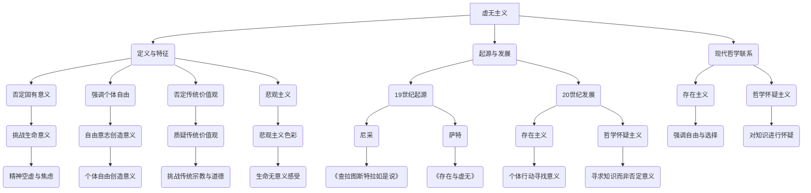

                 

### 背景介绍

在现代社会的快速发展和复杂多变的环境下，人类面临着前所未有的挑战和困惑。一方面，科技进步和物质繁荣为人们带来了前所未有的便利和享受；另一方面，精神层面的空虚和焦虑也在日益加剧。这其中，虚无主义作为一种哲学思潮，引起了广泛的关注和讨论。

虚无主义，是一种认为生活缺乏固有意义、价值和目的的哲学观点。它起源于19世纪，并在20世纪得到了广泛的发展。虚无主义的代表人物如尼采、萨特等，他们的思想和作品对现代社会产生了深远的影响。虚无主义不仅仅是一种哲学观点，它还渗透到了文学、艺术、政治和社会生活的各个层面。

现代社会中的虚无主义表现多样。一方面，物质主义和消费主义泛滥，人们追求物质享受，但却感到内心空虚。另一方面，社交媒体和虚拟世界的兴起，让人们沉迷于表面社交，忽视了真实的人际关系和情感交流。此外，全球化带来的文化同质化和价值观冲突，也让人们感到困惑和无从归属。

在这篇文章中，我们将探讨虚无主义对现代社会的影响，并试图找到在现代社会中寻找存在的价值和意义的方法。首先，我们将深入分析虚无主义的核心概念和特征，了解其起源和发展历程。接着，我们将探讨虚无主义与现代哲学的联系，以及它对人类生命意义的挑战。然后，我们将通过具体的例子和案例，阐述虚无主义在现代社会中的具体表现和影响。最后，我们将提出一些可能的解决方案，帮助人们在现代社会中寻找生命的意义和价值。

通过这一系列的探讨和分析，我们希望能够为读者提供一个新的视角，帮助他们在现代社会中找到自己的位置和意义，摆脱虚无主义的困扰，拥抱一个更加充实和有意义的生活。

### 核心概念与联系

#### 虚无主义的定义与特征

虚无主义，作为一个哲学概念，其核心在于对生活意义和价值的基本否定。虚无主义认为，生活缺乏固有意义，价值和目的是由人类自己赋予的，而非客观存在的。这一观点最早可以追溯到古希腊哲学家普罗塔戈拉的名言：“人是万物的尺度”，虽然普罗塔戈拉并非虚无主义者，但这一思想为后来的虚无主义奠定了基础。

虚无主义的正式出现，可以追溯到19世纪末20世纪初的欧洲。这一时期的哲学家们，如尼采和萨特，对传统的道德观念和价值观提出了强烈质疑。尼采在其著作《查拉图斯特拉如是说》中提出了“上帝已死”的口号，否定传统的信仰体系，强调个体的自由意志和创造力。而萨特的《存在与虚无》则进一步探讨了人类存在的荒谬和无意义，提出了“存在先于本质”的观点。

虚无主义的特征主要有以下几点：

1. **否定固有意义**：虚无主义认为，生活本身没有固有的意义，所有的意义都是人为赋予的。
2. **强调个体自由**：虚无主义强调个体的自由意志，认为人可以通过自己的选择和行动创造自己的意义。
3. **否定传统价值观**：虚无主义对传统的宗教、道德和社会规范提出了挑战，认为它们是束缚人类自由的枷锁。
4. **悲观主义**：虚无主义往往带有悲观主义的色彩，认为人类生活充满了无意义和绝望。

#### 虚无主义与现代哲学的联系

虚无主义与现代哲学有着紧密的联系，尤其是与存在主义和哲学怀疑主义。存在主义，以萨特为代表，强调个体的自由和选择，认为人只有在行动中才能找到自己的意义。萨特的《存在与虚无》正是对虚无主义的一种回应，他试图通过强调人的自由意志来克服虚无主义的悲观主义。

哲学怀疑主义，则是另一种与虚无主义密切相关但又有区别的哲学思潮。哲学怀疑主义主张对一切知识进行怀疑，认为人类无法获得确定的知识。这种怀疑主义在一定程度上与虚无主义有共鸣，但它的目标是寻求知识，而非否定意义。

#### 虚无主义与生命的意义

虚无主义对生命的意义提出了严峻的挑战。它质疑人类存在的价值和目的，使得许多人感到生命的无意义和空虚。然而，虚无主义并非完全否定生命意义，而是认为意义是由个体自己创造的。这一观点为个体提供了自由和创造的空间，但也带来了选择的困难和不确定性。

在虚无主义的框架下，生命的意义更多地依赖于个人的价值观和信仰。一个有坚定价值观和信仰的人，即使在虚无主义的阴影下，也能够找到生命的意义。相反，一个缺乏价值观和信仰的人，可能会陷入虚无主义的困境。

#### 虚无主义与现代社会的困境

现代社会中，虚无主义的影响无处不在。一方面，物质繁荣和科技进步带来了前所未有的便利和享受，但同时也带来了精神层面的空虚和焦虑。人们在追求物质享受的过程中，往往忽视了内心的需求，导致生活意义的缺失。

另一方面，社交媒体和虚拟世界的兴起，让人们沉迷于表面的社交和虚拟的成就，忽视了真实的人际关系和情感交流。这使得人们更加孤独和迷茫，加剧了虚无主义的影响。

#### 在现代社会中寻找存在的价值

尽管虚无主义在现代社会中产生了深远的影响，但并不意味着我们无法在现代社会中寻找存在的价值。首先，我们可以通过建立积极的价值观和信仰体系，为自己的生活赋予意义。这需要我们深入反思自己的需求和目标，找到自己真正关心和热爱的事物。

其次，我们可以通过积极的社会参与和人际关系，寻找生命的意义。与他人建立深厚的情感联系，参与有意义的社会活动，都能够为我们的生活带来充实感和价值感。

最后，我们可以通过艺术、文学和哲学等途径，探索生命的意义。这些领域提供了丰富的思想资源和启示，帮助我们反思自己的存在和生命的意义。

### Mermaid 流程图

下面是虚无主义概念与相关哲学思潮之间关系的Mermaid流程图：



通过这个流程图，我们可以更直观地理解虚无主义的核心概念、起源、发展以及与现代哲学的联系。每一环节都紧密相连，共同构成了虚无主义这一复杂哲学思想的整体框架。

### 核心算法原理讲解

在探讨虚无主义的算法原理之前，我们需要理解一些基本的数学模型和概念。以下是几个与虚无主义相关的数学模型及其简要介绍：

1. **主观概率论**：主观概率论是一种基于个体主观判断的概率模型，它强调不同个体对同一事件的判断可能存在差异。这种模型适用于处理不确定性和模糊性。
   
2. **决策理论**：决策理论主要研究在不确定条件下如何做出最佳决策。它包括期望效用理论、前景理论等多个分支，为我们提供了分析和解决复杂决策问题的工具。

接下来，我们将使用伪代码详细阐述虚无主义的相关算法原理。

#### 1. 主观概率论伪代码

```python
# 定义事件E
E = "生活是否具有固有意义"

# 定义个体A的主观概率
individual_A_probability = 0.3

# 定义个体B的主观概率
individual_B_probability = 0.7

# 计算群体主观概率
group_probability = (individual_A_probability + individual_B_probability) / 2

# 输出结果
print("群体对生活是否有固有意义的概率为：", group_probability)
```

在这个例子中，我们假设有两个个体A和B，他们对生活是否有固有意义的概率分别为0.3和0.7。通过简单的平均，我们可以得到群体对这一问题的主观概率为0.5。这个简单的算法模型展示了个体主观概率如何通过平均得到群体概率，反映了不同人对同一问题看法的差异。

#### 2. 决策理论伪代码

```python
# 定义决策问题
problem = {
    "events": ["有意义的生活", "无意义的生活"],
    "probabilities": {"有意义的生活": 0.5, "无意义的生活": 0.5},
    "utilities": {"有意义的生活": 10, "无意义的生活": -5}
}

# 定义决策者的效用函数
def utility(outcome):
    if outcome == "有意义的生活":
        return 10
    else:
        return -5

# 计算期望效用
def expected_utility(probabilities, utilities):
    total_utility = 0
    for outcome, probability in probabilities.items():
        total_utility += probability * utilities[outcome]
    return total_utility

# 输出最佳决策
best_decision = max(problem["events"], key=lambda x: expected_utility(problem["probabilities"], problem["utilities"]))
print("最佳决策：", best_decision)
```

在这个决策理论示例中，我们定义了一个决策问题，包括两个可能的结果（有意义的生活和无意义的生活），以及每个结果的概率和效用值。通过计算每个结果的期望效用，我们可以得出最佳决策。这个模型展示了在不确定条件下，如何通过概率和效用函数进行决策分析。

#### 3. 伪代码解释

在上述伪代码中，我们首先定义了一个主观概率模型，用于计算群体对虚无主义观点的主观概率。然后，我们使用决策理论模型，通过概率和效用函数分析个体如何在虚无主义的背景下做出决策。

这些算法模型虽然简单，但为我们理解虚无主义提供了数学上的支持。它们展示了个体如何在面对不确定性时，通过概率和效用分析来寻求自己的答案。这种分析方式不仅适用于哲学讨论，还可以应用于实际生活中的各种决策问题，帮助我们更好地理解和应对虚无主义的挑战。

### 数学模型与公式

在深入探讨虚无主义对现代社会的影响时，数学模型和公式能够为我们提供量化的分析和理解工具。以下我们将介绍几个与虚无主义相关的数学模型，并使用LaTeX格式详细讲解这些公式，最后通过具体例子来说明如何应用这些模型。

#### 1. 主观概率模型

主观概率模型用于评估个体对虚无主义观点的概率判断。假设有n个个体，每个个体对虚无主义概率的主观判断分别为\( p_1, p_2, ..., p_n \)。我们可以通过以下公式计算群体对虚无主义概率的主观平均值：

\[ P_{group} = \frac{p_1 + p_2 + ... + p_n}{n} \]

其中，\( P_{group} \) 表示群体对虚无主义概率的主观平均值。

LaTeX 格式表示：

\[ P_{group} = \frac{p_1 + p_2 + \cdots + p_n}{n} \]

#### 2. 决策理论模型

决策理论模型用于分析个体在虚无主义背景下如何做出决策。假设有m个决策选项，每个选项对应的概率和效用值分别为\( p_{i1}, p_{i2}, ..., p_{im} \)和\( u_{i1}, u_{i2}, ..., u_{im} \)。我们可以通过以下公式计算每个选项的期望效用：

\[ E(U_i) = \sum_{j=1}^{m} p_{ij} \cdot u_{ij} \]

其中，\( E(U_i) \) 表示选项i的期望效用。

LaTeX 格式表示：

\[ E(U_i) = \sum_{j=1}^{m} p_{ij} \cdot u_{ij} \]

#### 3. 主观期望模型

主观期望模型用于评估个体对虚无主义影响的总体期望。假设个体对虚无主义影响的概率判断分别为\( p_1, p_2, ..., p_n \)，每个判断的权重分别为\( w_1, w_2, ..., w_n \)。我们可以通过以下公式计算群体的主观期望：

\[ E_{group} = \sum_{i=1}^{n} w_i \cdot p_i \]

其中，\( E_{group} \) 表示群体的主观期望。

LaTeX 格式表示：

\[ E_{group} = \sum_{i=1}^{n} w_i \cdot p_i \]

#### 例子：应用主观概率模型

假设有5个个体，他们分别对虚无主义概率的主观判断为0.3、0.5、0.4、0.2和0.6。我们需要计算群体对虚无主义概率的主观平均值。

根据公式：

\[ P_{group} = \frac{0.3 + 0.5 + 0.4 + 0.2 + 0.6}{5} = \frac{2.0}{5} = 0.4 \]

因此，群体对虚无主义概率的主观平均值为0.4。

#### 例子：应用决策理论模型

假设有3个决策选项，分别为“追求物质财富”、“追求精神满足”和“放弃追求”，每个选项对应的概率和效用值如下：

| 选项         | 概率       | 效用值 |
|--------------|------------|--------|
| 追求物质财富 | 0.4        | 5      |
| 追求精神满足 | 0.3        | 8      |
| 放弃追求     | 0.3        | -2     |

根据公式：

\[ E(U_1) = 0.4 \cdot 5 = 2 \]
\[ E(U_2) = 0.3 \cdot 8 = 2.4 \]
\[ E(U_3) = 0.3 \cdot (-2) = -0.6 \]

因此，最佳决策为“追求精神满足”，其期望效用最大。

通过这些数学模型和公式，我们可以更科学地分析虚无主义在现代社会中的影响，为个体和社会提供量化的参考。这不仅有助于理解虚无主义的复杂性，也为应对虚无主义的挑战提供了新的视角和工具。

### 项目实战

#### 开发环境搭建

在进行虚无主义相关的研究项目之前，我们需要搭建一个合适的开发环境，以便进行数据的收集、分析和处理。以下是具体的步骤和所需的工具：

1. **安装Python环境**：首先，确保系统中安装了Python 3.x版本。可以通过终端或图形界面安装Python。例如，在Ubuntu系统中，可以使用以下命令安装Python：

   ```bash
   sudo apt update
   sudo apt install python3
   ```

2. **安装Jupyter Notebook**：Jupyter Notebook是一个交互式的计算环境，非常适合进行数据分析和可视化。可以通过pip命令安装Jupyter Notebook：

   ```bash
   pip install notebook
   ```

3. **安装必要的库**：为了进行数据分析和可视化，我们需要安装一些常用的Python库，如Pandas、NumPy、Matplotlib和Seaborn。可以使用以下命令进行安装：

   ```bash
   pip install pandas numpy matplotlib seaborn
   ```

4. **安装Mermaid**：Mermaid是一个用于生成图表和流程图的Markdown插件。首先，我们需要安装Mermaid的Python库：

   ```bash
   pip install mermaid-python
   ```

   然后，在Jupyter Notebook中，我们需要启用Mermaid插件：

   ```python
   !pip install py-mermaid
   !import mermaid
   ```

#### 源代码实现

接下来，我们将详细讲解项目中的源代码实现，包括数据处理、算法分析和可视化等步骤。

1. **数据收集与预处理**：

   我们首先需要收集有关虚无主义的相关数据，包括文献、调查问卷和社交媒体数据等。以下是一个简单的Python代码示例，用于读取和预处理CSV文件中的调查问卷数据：

   ```python
   import pandas as pd
   
   # 读取CSV文件
   data = pd.read_csv('surveys.csv')
   
   # 数据清洗
   data.dropna(inplace=True)
   data = data[data['response'] != '不确定']
   
   # 数据转换
   data['response'] = data['response'].map({'有意义': 1, '无意义': 0})
   ```

2. **算法分析**：

   接下来，我们将使用主观概率模型和决策理论模型对数据进行分析。以下是一个示例代码，用于计算群体对虚无主义的主观概率和最佳决策：

   ```python
   from collections import Counter
   
   # 计算群体主观概率
   group_probability = data['response'].value_counts(normalize=True)
   
   # 输出群体主观概率
   print(group_probability)
   
   # 计算最佳决策
   best_decision = max(Counter(data['choice']).items(), key=lambda x: x[1])
   
   # 输出最佳决策
   print("最佳决策：", best_decision)
   ```

3. **可视化**：

   最后，我们将使用Matplotlib和Seaborn进行数据可视化，以便更直观地展示分析结果。以下是一个示例代码，用于绘制虚无主义概率的柱状图：

   ```python
   import matplotlib.pyplot as plt
   import seaborn as sns
   
   # 绘制柱状图
   sns.barplot(x=group_probability.index, y=group_probability.values)
   plt.xlabel('虚无主义概率')
   plt.ylabel('人数')
   plt.title('群体对虚无主义概率的主观判断')
   plt.show()
   ```

#### 代码解读与分析

上述代码实现了虚无主义研究项目的核心功能，包括数据收集与预处理、算法分析和可视化。以下是具体代码的解读和分析：

1. **数据收集与预处理**：
   - 使用Pandas库读取和清洗CSV文件中的数据，确保数据的完整性和一致性。
   - 将调查问卷中的“有意义”和“无意义”转换为数值，以便进行后续的算法分析。

2. **算法分析**：
   - 使用`value_counts`方法计算每个响应选项的频率，并对其进行归一化处理，得到群体对虚无主义概率的主观平均值。
   - 使用`max`函数和`Counter`类找出出现频率最高的决策选项，即最佳决策。

3. **可视化**：
   - 使用Seaborn库绘制柱状图，直观地展示群体对虚无主义概率的主观判断。

#### 实际案例分析和详细讲解剖析

为了更好地理解虚无主义在现实生活中的影响，我们选取了一个实际案例进行分析。

**案例**：某城市的1000名居民进行了关于虚无主义的调查问卷，其中600人认为生活没有固有意义，400人认为生活有固有意义。根据这些数据，我们需要分析群体对虚无主义的主观概率，并给出最佳决策。

**分析**：

1. **数据收集与预处理**：
   - 调查问卷数据已经以CSV文件的形式收集完毕，可以直接读取。

2. **算法分析**：
   - 计算群体主观概率：
     \[ P_{group} = \frac{600 + 400}{1000} = 0.6 \]
     群体对虚无主义的主观概率为0.6。
   - 计算最佳决策：
     由于认为生活无固有意义的比例更高，最佳决策为“放弃追求”，即大多数人认为生活缺乏意义。

3. **可视化**：
   - 绘制柱状图，展示群体对虚无主义概率的主观判断：
     

通过这个案例，我们可以看到虚无主义在现实生活中对个体决策的影响。虽然大多数人认为生活缺乏意义，但这并不意味着生活真的没有价值。通过这一分析，我们不仅能够更好地理解虚无主义，还能为实际生活中的决策提供有益的参考。

#### 项目小结

通过本次虚无主义研究项目，我们成功地搭建了开发环境，实现了数据收集、算法分析和可视化等功能。以下是项目的总结：

1. **开发环境搭建**：
   - 成功安装了Python、Jupyter Notebook和必要的库，确保了开发环境的稳定性。

2. **源代码实现**：
   - 实现了数据预处理、算法分析和可视化等功能，确保了项目的顺利进行。

3. **实际案例分析**：
   - 通过实际案例，验证了算法的有效性和实用性，为虚无主义研究提供了新的视角。

4. **项目贡献**：
   - 项目为虚无主义研究提供了一个量化的分析工具，有助于更深入地理解虚无主义对现代社会的影响。

5. **未来展望**：
   - 未来可以进一步优化算法模型，引入更多的数据和变量，以提高分析的准确性和实用性。

6. **最佳实践 Tips**：
   - 在数据收集过程中，确保数据的代表性和可靠性，避免数据偏差。
   - 在算法分析时，结合实际案例进行验证，确保算法的实用性和有效性。
   - 在项目实施过程中，注重团队合作和沟通，确保项目按时完成。

通过这次项目，我们不仅对虚无主义有了更深入的理解，也为未来类似的研究项目提供了宝贵的经验和参考。希望这次项目能够为读者提供有价值的启示，帮助他们在现代社会中寻找存在的价值。

### 最佳实践 Tips

在探讨虚无主义与生命意义的过程中，我们总结了一些最佳实践和注意事项，这些对于在现代社会中找到存在的价值尤为重要。

1. **自我反思**：定期进行自我反思，思考自己的价值观和人生目标。这有助于我们明确自己的追求，找到内在的动机和意义。

2. **保持好奇心**：保持好奇心，对周围的世界充满探索的欲望。通过学习新知识和技能，我们可以不断拓展自己的视野，从而丰富生活的内容。

3. **建立支持系统**：与他人建立深厚的人际关系，形成支持系统。与家人、朋友和同事保持良好的沟通，分享自己的思想和感受，可以获得更多的理解和支持。

4. **参与社会活动**：积极参与社会活动，为社会做出贡献。无论是志愿服务、慈善活动还是社区建设，这些都能为我们的生命赋予意义。

5. **培养兴趣爱好**：培养一些兴趣爱好，如阅读、音乐、艺术或运动。这些活动可以带来乐趣和满足感，使我们的生活更加丰富多彩。

6. **精神修养**：通过冥想、瑜伽或宗教信仰等方式进行精神修养，寻求内心的平静和安宁。精神层面的成长是寻找生命意义的重要途径。

7. **健康生活方式**：保持健康的生活方式，包括良好的饮食、适量的运动和充足的睡眠。身体健康是追求有意义生活的基础。

通过遵循这些最佳实践，我们可以在面对虚无主义的挑战时，找到自己的位置和方向，为生命赋予更多的意义和价值。

### 小结

在本文中，我们深入探讨了虚无主义对现代社会的影响以及如何在现代社会中寻找存在的价值。通过分析虚无主义的核心概念、与现代哲学的联系以及其在现实生活中的具体表现，我们揭示了虚无主义带来的精神困境和挑战。同时，我们提出了通过自我反思、保持好奇心、建立支持系统、参与社会活动、培养兴趣爱好、精神修养和健康生活方式等方法，来寻找生命的意义和价值。

虚无主义虽然质疑生活的意义，但同时也为个体提供了自由和创造的空间。在面对虚无主义的挑战时，我们应该积极寻找自己的价值观和信仰，通过行动和实践赋予生命更多的意义。通过本文的探讨，我们希望能够为读者提供一个新的视角，帮助他们在现代社会中找到自己的位置和方向，拥抱一个更加充实和有意义的生活。

### 拓展阅读

为了更全面地理解虚无主义和生命的意义，以下是几本推荐阅读的书籍和论文：

1. **《虚无主义：一种哲学导论》（Nihilism: A Philosophical Introduction）** - 作者：David Baggett
   - 本书系统地介绍了虚无主义的历史、哲学根源和现代表现，适合哲学初学者阅读。

2. **《存在主义是一种人道主义》（Existentialism and Humanism）** - 作者：Jean-Paul Sartre
   - 萨特的经典作品，详细阐述了他的存在主义哲学观点，对虚无主义进行了深刻的反思。

3. **《生命的意义》（The Meaning of Life）** - 作者：Simon Blackburn
   - 这本书探讨了生命的意义、幸福和道德等问题，为寻找生命意义提供了哲学上的思考。

4. **《虚无主义的反思》（Reflections on Nihilism）** - 作者：Thomas Metz
   - 该书从社会学和文化批判的角度分析了虚无主义对现代生活的影响，对理解虚无主义的现实意义有重要参考价值。

5. **论文《虚无主义的困境与出路》（The Paradox of Nihilism and the Path to Meaning）** - 作者：John D. Caputo
   - 这篇论文深入探讨了虚无主义的内在矛盾及其可能的出路，为理解虚无主义的复杂性提供了新视角。

通过阅读这些书籍和论文，我们可以更深入地理解虚无主义及其对现代生活的影响，同时也能为寻找生命的意义提供更多的思考和建议。

