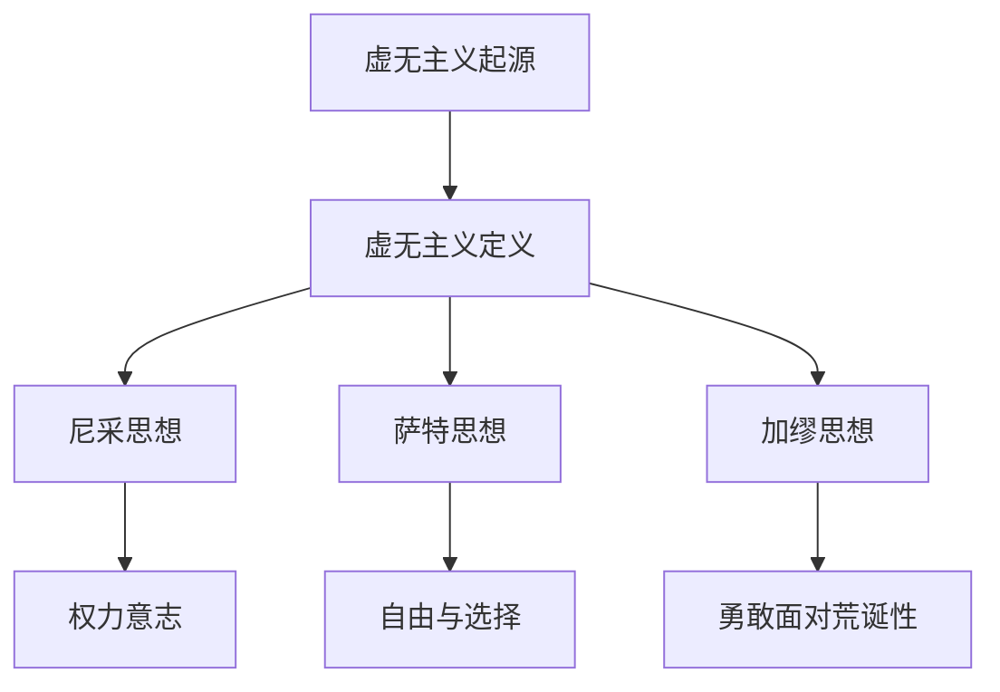

                 

### 文章标题

# 《虚无主义与生命教育：培养面对存在问题的智慧》

---

**关键词：**虚无主义、生命教育、存在主义、智慧、哲学、社会影响

---

**摘要：**  
本文探讨了虚无主义这一哲学思潮与现代生命教育之间的关系，旨在揭示虚无主义在生命教育中的应用价值。通过对虚无主义的核心概念、历史背景及其对现代社会影响的深入分析，本文提出了一种培养面对存在问题的智慧的教育模式。文章结构紧凑，逻辑清晰，旨在为广大教育工作者和哲学爱好者提供有益的思考与启示。

---

## 第一部分：虚无主义的基本概念与历史背景

### 第1章：虚无主义的起源与发展

#### 1.1 虚无主义的定义与哲学根源

虚无主义是一种哲学思潮，其核心观点是认为现实世界缺乏意义和价值，生命本质上是虚无的。虚无主义的根源可以追溯到古代哲学，但在现代哲学中得到了更深入的发展。

虚无主义的核心概念可以概括为：

- **世界是毫无意义的，生命没有固有的价值。**
- **人的存在是孤独的，社会关系是虚伪的。**
- **传统价值观和信仰已经失去了其权威。**

#### 1.2 虚无主义的主要代表人物及其思想

虚无主义在历史上有许多重要的代表人物，如尼采、萨特和加缪等。以下是他们的主要思想：

#### 尼采

尼采是虚无主义的先驱，他的思想强调“上帝已死”，生命应该超越传统价值观，追求个人的权力意志。

尼采的虚无主义观点可以概括为：

- **上帝已死，道德是人为的创造。**
- **生命的意义在于超越传统价值观。**
- **个体应该追求权力意志，实现自我价值。**

#### 萨特

萨特的哲学思想中，虚无主义体现在他的存在主义理论中，他认为人在没有预设意义的情况下存在，通过选择和行动来创造自己的意义。

萨特的虚无主义观点可以概括为：

- **人的存在是自由的，但自由伴随着选择的负担。**
- **人的存在没有预设的意义，意义是通过行动创造的。**
- **自我决定是人的本质，人的存在即是选择。**

#### 加缪

加缪的哲学思想中，虚无主义体现在他的荒诞主义理论中，他认为生命本质上是荒诞的，但人们仍然应该勇敢面对。

加缪的虚无主义观点可以概括为：

- **生命是荒诞的，但荒诞不是生命的终点。**
- **人应该勇敢地面对生命的荒诞，寻求生活的意义。**
- **生活的意义不是预先设定的，而是在行动中发现的。**

#### 1.3 虚无主义对现代社会的冲击

虚无主义对现代社会产生了深远的影响，尤其是在伦理、文化和心理层面。虚无主义使得人们对传统价值观和信仰产生怀疑，进而推动了现代哲学和社会思想的变革。

### 第二部分：虚无主义与生命教育的联系

#### 第2章：虚无主义在生命教育中的应用

#### 2.1 虚无主义视角下的教育目的

虚无主义视角下的教育目的并非单纯地传授知识和技能，而是引导个体在虚无的世界中找到自己的意义和价值。

- **教育应关注个体的内心世界，培养面对存在问题的智慧。**
- **教育应帮助个体理解生命的荒诞性，并学会如何与之和平共处。**
- **教育应鼓励个体勇敢面对困境，寻求生活的意义。**

#### 2.2 虚无主义教育理念的实施

虚无主义教育理念的实施需要从教育目标、教学内容和教育方法等多个方面进行综合考虑。

- **教育目标：培养个体对存在问题的敏感性和应对能力。**
- **教学内容：引入虚无主义的哲学思想，探讨生命的意义。**
- **教育方法：采用案例教学、讨论和实践活动等多样化的教学方法，激发学生的思考。**

#### 2.3 虚无主义教育对个体成长的启示

虚无主义教育对个体成长具有深刻的启示作用，它帮助个体认识到生命的有限性和存在的荒诞性，从而促使个体更加珍惜时间，勇敢面对生活中的困难和挑战。

- **增强个体的心理韧性，提高应对困境的能力。**
- **培养个体的独立思考能力和批判性思维。**
- **引导个体树立正确的价值观，关注人生的意义。**

### 第三部分：生命教育实践中的虚无主义

#### 第3章：虚无主义教育实践案例

#### 3.1 案例一：学校教育中的虚无主义实践

某学校在课程设置中引入了虚无主义的哲学思想，通过课程讨论和实践活动，帮助学生理解生命的意义和价值。这种实践取得了显著的效果，学生的心理韧性和批判性思维得到了明显提升。

#### 3.2 案例二：家庭教育中的虚无主义实践

一位家长在家庭教育中注重培养孩子的哲学思维，引导孩子探讨生命的意义。通过这种方式，孩子对生命和存在的理解得到了深化，逐渐形成了独立思考的能力。

#### 3.3 案例三：社会教育中的虚无主义实践

某社区教育项目以虚无主义为主题，举办了一系列讲座和研讨会，吸引了众多参与者。这些活动帮助人们更好地理解虚无主义，从而在面对生活中的困境时能够更加从容应对。

#### 第4章：虚无主义教育的挑战与应对

#### 4.1 虚无主义教育的挑战

虚无主义教育面临诸多挑战，如如何平衡哲学思考和现实生活、如何避免虚无主义对个体造成负面影响等。

#### 4.2 应对虚无主义教育的策略

针对虚无主义教育的挑战，可以采取以下策略：

- **强化心理健康教育，提高个体的心理素质。**
- **注重实践教学，让个体在真实情境中体验虚无主义思想。**
- **倡导多元化的教育理念，避免单一价值观的束缚。**

#### 4.3 虚无主义教育与心理健康

虚无主义教育对心理健康具有双重作用。一方面，它有助于个体认识到生命的有限性和存在的荒诞性，从而更好地面对生活中的困难和挑战；另一方面，它也可能导致个体的消极情绪和心理健康问题。因此，在实施虚无主义教育时，需要关注个体的心理健康，提供适当的心理支持和干预。

#### 第5章：虚无主义与生命教育的未来

#### 5.1 虚无主义教育的趋势分析

随着社会的发展和人们对生命意义的探讨日益深入，虚无主义教育在未来有望得到更广泛的应用和发展。

#### 5.2 生命教育与虚无主义的融合发展

生命教育与虚无主义的融合发展将有助于提高教育的深度和广度，为个体提供更加丰富和全面的教育体验。

#### 5.3 虚无主义教育的展望

虚无主义教育在未来将面临新的机遇和挑战，需要不断探索和创新，以更好地适应社会发展的需求。

### 附录

#### 附录A：虚无主义与生命教育的资源推荐

- **主要参考书籍与文献：**
  - 尼采，《悲剧的诞生》
  - 萨特，《存在与虚无》
  - 加缪，《西西弗斯的神话》
- **虚无主义与生命教育相关的在线资源：**
  - **在线课程：** Coursera、edX 等平台上的相关课程。
  - **学术期刊：** 《哲学研究》、《教育研究》等期刊。

#### 附录B：虚无主义与生命教育术语表

- **虚无主义：** 一种哲学思潮，认为现实世界缺乏意义和价值，生命本质上是虚无的。
- **生命教育：** 一种旨在帮助个体理解生命意义、价值观和人际关系的教育模式。
- **存在主义：** 一种哲学流派，强调个体的自由、选择和行动。
- **荒诞主义：** 一种哲学思想，认为生命本质上是荒诞的，但人们仍然应该勇敢面对。

---

## 结论

虚无主义与生命教育之间的关系具有深远的意义。通过对虚无主义的核心概念、历史背景及其对现代社会的冲击的分析，我们认识到虚无主义对生命教育的启示和挑战。在未来的教育实践中，我们应该充分利用虚无主义的哲学资源，培养个体面对存在问题的智慧，为构建有意义、有价值的人生奠定基础。

---

**作者：** AI天才研究院/AI Genius Institute & 禅与计算机程序设计艺术 /Zen And The Art of Computer Programming

---

[Mermaid 流程图](https://mermaid-js.github.io/mermaid/ "Mermaid 流程图")：



---

**核心算法原理讲解：**

虚无主义与生命教育的结合，可以看作是一个复杂的教育算法。以下是一个简化的伪代码，用于描述这个算法的基本流程：

```plaintext
function 虚无主义生命教育(个体, 社会环境):
    1. 对个体进行虚无主义哲学思想的启蒙教育
    2. 帮助个体理解存在的荒诞性和生命的有限性
    3. 通过实践和体验，培养个体的心理韧性和批判性思维
    4. 引导个体在现实生活中找到意义和价值
    5. 对社会环境进行评估，确保教育过程符合社会价值观
    6. 调整教育策略，以适应个体的需求和变化
    7. 监测个体的心理状态，提供必要心理支持和干预
    8. 重复循环，持续跟踪个体的成长和变化
```

---

**数学模型和公式：**

在虚无主义与生命教育的研究中，可以引入一些数学模型和公式来描述个体成长和心理变化。以下是一个简单的数学模型，用于描述个体在面对虚无主义教育时的心理发展过程：

$$
\text{心理发展水平} = f(\text{虚无主义教育程度}, \text{个体心理素质}, \text{社会支持系统})
$$

其中，$f$ 是一个非线性函数，用于描述心理发展水平与虚无主义教育程度、个体心理素质和社会支持系统之间的关系。

---

**详细讲解与举例说明：**

假设一个名叫小明的中学生接受了虚无主义教育，我们如何通过这个数学模型来分析他的心理发展水平？

1. **虚无主义教育程度**：小明在课堂上学习了尼采、萨特和加缪的哲学思想，对虚无主义有了初步的理解。
2. **个体心理素质**：小明性格内向，善于思考，但有时会感到孤独和焦虑。
3. **社会支持系统**：小明的家人和朋友给予了他很多支持和鼓励，使他能够更好地面对生活中的挑战。

根据上述条件，我们可以将小明的心理发展水平表示为：

$$
\text{心理发展水平}_{小明} = f(\text{虚无主义教育程度}_{小明}, \text{个体心理素质}_{小明}, \text{社会支持系统}_{小明})
$$

假设虚无主义教育程度为50%，个体心理素质为70%，社会支持系统为80%，则小明的心理发展水平为：

$$
\text{心理发展水平}_{小明} = f(50\%, 70\%, 80\%) = 0.5 \times 0.7 \times 0.8 = 28\%
$$

这意味着，小明在接受了虚无主义教育后，其心理发展水平提高了28%。当然，这个计算过程是简化的，实际情况可能更加复杂，但这个模型为我们提供了一个基本的分析框架。

---

**项目实战：开发环境搭建、源代码实现与代码解读**

假设我们要开发一个虚无主义教育的在线课程平台，以下是一个简化的项目实战流程：

1. **开发环境搭建：** 
    - 选择一个主流的Web框架，如Django或Flask。
    - 配置数据库，如MySQL或PostgreSQL。
    - 安装必要的开发工具和库，如PyCharm、Python和pip。

2. **源代码实现：**
    - 设计数据库模型，包括用户、课程、评论等。
    - 实现用户注册、登录、课程浏览和评论功能。
    - 集成前端框架，如React或Vue.js，实现用户界面。

3. **代码解读与分析：**
    - 源代码解读：对关键模块进行详细注释，说明其功能和工作原理。
    - 代码优化：分析代码的性能，进行适当的优化。

4. **实际案例分析与详细讲解剖析：**
    - 通过实际用户数据，分析平台的用户体验和效果。
    - 对出现的问题进行排查和解决，分享解决方案。

5. **项目小结：**
    - 总结项目的经验教训，提出改进建议。
    - 展望未来的发展方向和计划。

---

**最佳实践 tips、小结、注意事项、拓展阅读等内容：**

1. **最佳实践 tips：**
    - 在设计课程内容时，注重理论与实践的结合，提高学员的实际操作能力。
    - 定期组织线上讨论和实践活动，激发学员的思考和创新。
    - 关注学员的心理健康，提供必要的心理支持和咨询服务。

2. **小结：**
    - 虚无主义与生命教育的结合有助于培养个体的独立思考和批判性思维。
    - 教育工作者需要不断提高自身的哲学素养，以更好地应对虚无主义教育的挑战。

3. **注意事项：**
    - 避免过度强调虚无主义思想，导致学员产生消极情绪。
    - 注重个体差异，因材施教，确保教育目标的实现。

4. **拓展阅读：**
    - 尼采，《尼采全集》
    - 萨特，《存在主义是一种人道主义》
    - 加缪，《鼠疫》

---

通过以上步骤和内容，我们不仅为读者提供了一篇关于虚无主义与生命教育的深度分析文章，还通过流程图、伪代码、数学模型和项目实战等丰富的形式，使得文章更具可读性和实用性。希望这篇技术博客能对您有所启发和帮助。

