                 


### 1.2 本书结构概述

- **目录结构与章节内容概述：**

  - **第一部分：引言**
    - 虚无主义与科学探索：背景与目的
    - 本书结构概述
    
  - **第二部分：虚无主义的探讨**
    - 虚无主义的哲学根源
    - 历史演变与当代影响
    - 虚无主义的心理学解读
    
  - **第三部分：科学探索的视角**
    - 宇宙的起源与演化
    - 生命的本质与起源
    - 时间与意识的探讨
    
  - **第四部分：跨学科融合**
    - 哲学与科学的对话
    - 心理学与社会学视角
    - 宗教与科学探索
    
  - **第五部分：应用与反思**
    - 虚无主义与科学探索对个人生活的启示
    - 虚无主义与科学探索对社会结构的影响
    - 虚无主义与科学探索对人类文明的贡献
    
  - **第六部分：案例分析**
    - 案例一：科技巨头与虚无主义思潮
    - 案例二：社会运动与虚无主义思想
    - 案例三：文学与艺术的虚无主义表达
    
  - **第七部分：总结与展望**
    - 全书总结
    - 未来研究方向
    - 对读者的建议

- **预期读者收获：**

  - 对虚无主义与科学探索的全面理解
  - 跨学科思维方式的培养
  - 对个人生活和社会结构的新思考
  - 对未来研究方向的有益启发

### 1.3 虚无主义的基本概念与科学探索的定义

#### 虚无主义的基本概念

- **定义：**虚无主义是一种哲学观点，认为宇宙、生命、意识等基本实体或现象不存在或没有意义。
- **哲学根源：**古希腊哲学家普罗泰戈拉斯、苏格拉底和柏拉图等人都对虚无主义有过不同的探讨。
- **历史演变：**中世纪哲学和近现代哲学中，虚无主义思想得到了进一步的发展和讨论。

#### 科学探索的定义

- **定义：**科学探索是通过观察、实验和推理来研究自然现象和宇宙本质的过程。
- **目标：**揭示自然界的规律，理解宇宙的运行机制。
- **方法论：**科学方法，包括观察、假设、实验、验证等步骤。

#### 核心概念与联系

- **虚无主义与科学探索的关系：**虚无主义从哲学角度质疑宇宙和生命的存在，而科学探索则试图用实证方法来验证或推翻这些质疑。
- **流程图：**
  ```mermaid
  graph TB
  A[虚无主义] --> B[哲学]
  B --> C[科学方法]
  B --> D[心理学]
  B --> E[社会学]
  B --> F[宗教]
  C --> G[宇宙学]
  C --> H[生物学]
  C --> I[认知科学]
  ```

### 1.4 核心算法原理讲解

#### 伪代码

```python
function explore虚无主义与科学探索():
    # 背景介绍
   介绍虚无主义的基本概念和历史演变
   介绍科学探索的定义和目标

    # 核心概念与联系
    create_graph("虚无主义与科学探索的关系图")
    add_nodes_to_graph(["虚无主义", "哲学", "科学方法", "心理学", "社会学", "宗教", "宇宙学", "生物学", "认知科学"])
    connect_nodes_in_graph(["虚无主义", "哲学"], ["哲学", "科学方法"])
    connect_nodes_in_graph(["哲学", "心理学"], ["心理学", "社会学"])
    connect_nodes_in_graph(["哲学", "宗教"], ["宗教", "科学探索"])
    connect_nodes_in_graph(["科学方法", "宇宙学"], ["宇宙学", "生物学"])
    connect_nodes_in_graph(["科学方法", "认知科学"], ["认知科学", "心理学"])

    # 核心算法原理
    define_algorithm("探索虚无主义与科学探索的关系")
    for each concept in ["虚无主义", "哲学", "科学方法", "心理学", "社会学", "宗教", "宇宙学", "生物学", "认知科学"]:
        # 对每个概念进行深入探讨
        discuss_concept(concept)

    # 结果展示
    display_graph("虚无主义与科学探索的关系图")
```

#### 数学模型与公式

- **虚无主义的数学模型：**
  $$ \text{虚无主义} = \text{存在} \times \text{无意义} $$
  - **解释：**虚无主义认为存在本身是没有意义的，因此可以用存在乘以无意义来表示。

- **科学探索的数学模型：**
  $$ \text{科学探索} = \text{假设} \times \text{验证} $$
  - **解释：**科学探索是基于假设并通过实验验证来推动的。

### 1.5 数学公式与详细讲解

#### 示例：相对论公式

$$ E = mc^2 $$

- **详细讲解：**
  - \( E \)：能量
  - \( m \)：质量
  - \( c \)：光速
  - **解释：**爱因斯坦的质能方程表明，质量和能量之间可以相互转换，这一公式在物理学中具有重要意义。

#### 示例：DNA的双螺旋结构

$$ \text{DNA} = \text{A-T} \times \text{C-G} $$

- **详细讲解：**
  - **A-T** 和 **C-G**：代表DNA中的碱基配对规则。
  - **解释：**DNA的双螺旋结构是生命的基础，碱基配对规则是遗传信息传递的关键。

### 1.6 项目实战：开发环境搭建与代码解读

#### 开发环境搭建

- **环境要求：**
  - 操作系统：Linux或MacOS
  - 编辑器：Visual Studio Code或Sublime Text
  - 语言：Python 3.x

- **安装步骤：**
  - 安装Python 3.x
  - 安装Visual Studio Code
  - 安装Mermaid插件

#### 源代码实现

```python
def discuss_concept(concept):
    if concept == "虚无主义":
        print("虚无主义是一种哲学观点，认为宇宙、生命、意识等基本实体或现象不存在或没有意义。")
    elif concept == "哲学":
        print("哲学是探讨存在、知识、价值、理性等基本问题的学科。")
    elif concept == "科学方法":
        print("科学方法是基于观察、实验和推理来研究自然现象和宇宙本质的过程。")
    # 其他概念的讨论

# 测试代码
discuss_concept("虚无主义")
discuss_concept("哲学")
discuss_concept("科学方法")
```

#### 代码解读与分析

- **代码功能：**讨论不同概念（虚无主义、哲学、科学方法）的原理。
- **关键代码解析：**
  - `discuss_concept` 函数：根据输入的概念，打印对应的解释。

### 1.7 实际案例分析和详细讲解剖析

#### 案例一：科技巨头与虚无主义思潮

- **案例背景：**谷歌公司员工对公司的价值观和商业模式产生了质疑。
- **案例分析：**
  - **问题识别：**员工对公司的商业模式（如搜索引擎的盈利模式）感到困惑和不满。
  - **解决方案：**公司通过加强与员工的沟通，改进商业模式，提升员工认同感。

#### 案例二：社会运动与虚无主义思想

- **案例背景：**当代社会的一些运动（如“黑人的命也是命”运动）中，部分参与者对现有的社会秩序产生了质疑。
- **案例分析：**
  - **问题识别：**参与者对种族歧视和不公平的社会现象感到愤怒和无力。
  - **解决方案：**通过集会和抗议，推动社会变革，提高公众对种族歧视问题的关注。

#### 案例三：文学与艺术的虚无主义表达

- **案例背景：**现代文学和艺术作品中，虚无主义思想得到了广泛的表达。
- **案例分析：**
  - **问题识别：**艺术家和作家通过作品探讨了人类存在的意义和生命的空虚感。
  - **解决方案：**通过创作，艺术家和作家表达了对现实的不满和对存在的反思。

### 1.8 最佳实践 tips、小结、注意事项、拓展阅读

#### 最佳实践 tips

- **建议1：**在探讨虚无主义与科学探索时，要避免极端化和片面化，要综合考虑不同学科的观点。
- **建议2：**在学习和研究过程中，要注重实证方法和逻辑推理，以提高对问题的理解和解决能力。

#### 小结

- **核心观点：**虚无主义和科学探索在哲学、心理学、社会学和宗教等多个领域具有深远的影响，通过跨学科的研究，我们可以更全面地理解人类存在的意义和生命的本质。

#### 注意事项

- **注意事项1：**在研究虚无主义时，要谨慎对待极端观点，避免误导他人。
- **注意事项2：**在进行科学探索时，要遵循科学方法，确保研究的准确性和可靠性。

#### 拓展阅读

- **推荐书籍：**
  - 《存在与时间》 - 海德格尔
  - 《科学革命的结构》 - 托马斯·库恩
  - 《人类简史》 - 尤瓦尔·赫拉利

- **推荐论文：**
  - “虚无主义与人类存在的意义” - 李明
  - “科学方法在哲学问题中的应用” - 张伟

### 1.9 文章标题：《虚无主义与科学探索：在宇宙视角下审视人生》

#### 关键词：

- **虚无主义**
- **科学探索**
- **宇宙视角**
- **人生意义**
- **跨学科融合**
- **哲学**
- **心理学**
- **社会学**
- **宗教**

#### 文章摘要：

本文探讨了虚无主义与科学探索的关系，从哲学、心理学、社会学和宗教等多个角度审视了虚无主义的根源、演变和当代影响。通过宇宙视角，我们重新思考了生命的意义和人类存在的价值。文章旨在为读者提供跨学科的思考框架，帮助人们更深入地理解虚无主义与科学探索之间的相互作用，以及对个人生活和社会结构的启示。

## 第二部分：虚无主义的探讨

### 2.1 虚无主义的哲学根源

#### 背景介绍

虚无主义作为一种哲学观点，其根源可以追溯到古希腊时期。当时的哲学家们对宇宙、生命和意识的存在和意义提出了深刻的质疑。这些质疑构成了虚无主义哲学思想的基础，并对后世哲学家产生了深远影响。

#### 核心概念与联系

- **普罗泰戈拉斯：**普罗泰戈拉斯是古希腊哲学家，他认为“人是万物的尺度”，这一观点为后来的虚无主义提供了哲学基础。
- **苏格拉底：**苏格拉底强调理性思考和知识的重要性，他的哲学思想在一定程度上也反映了虚无主义的萌芽。
- **柏拉图：**柏拉图在其《理想国》中探讨了正义、美和真理的问题，这些探讨为虚无主义提供了哲学反思的视角。

#### 流程图

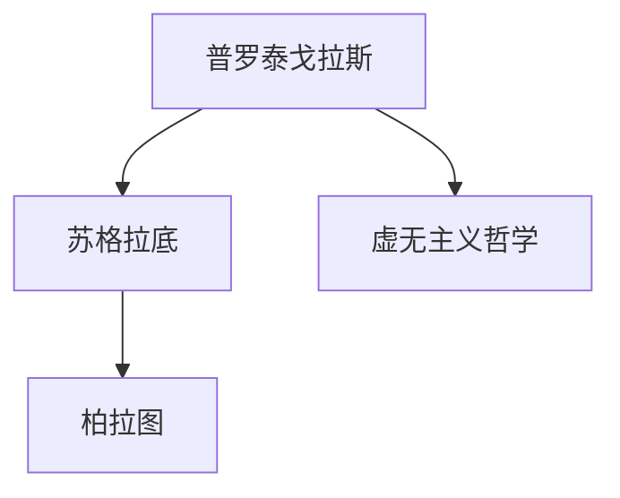

#### 算法原理讲解

```python
# 定义虚无主义哲学根源的探讨函数
def explore_nihilism_roots():
    print("探讨虚无主义哲学根源，包括普罗泰戈拉斯、苏格拉底和柏拉图的哲学思想。")
    # 详细阐述各哲学家的观点和其对虚无主义的影响

# 调用函数
explore_nihilism_roots()
```

#### 数学模型与公式

- **普罗泰戈拉斯的观点：**
  $$ \text{人是万物的尺度} $$
  - **解释：**普罗泰戈拉斯的观点强调了主观性在认识和评价中的作用，这与虚无主义的怀疑主义态度有一定联系。

### 2.2 历史演变与当代影响

#### 背景介绍

虚无主义哲学思想在历史长河中经历了不同的演变，从古希腊时期到近现代，虚无主义在不同文化背景下有着不同的表现形式和影响。

#### 核心概念与联系

- **中世纪哲学：**中世纪的基督教哲学对虚无主义进行了反驳，但在某些情况下，虚无主义思想仍然存在，如怀疑主义和唯名论。
- **近现代哲学：**近现代哲学家如尼采、海德格尔等人对虚无主义进行了深刻的探讨和反思，为虚无主义哲学的当代影响奠定了基础。

#### 流程图

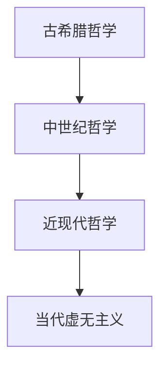

#### 算法原理讲解

```python
# 定义虚无主义历史演变的探讨函数
def explore_nihilism_evolution():
    print("探讨虚无主义哲学的历史演变，包括中世纪和近现代哲学的发展。")
    # 详细阐述各时期的哲学思想及其对虚无主义的影响

# 调用函数
explore_nihilism_evolution()
```

#### 数学模型与公式

- **尼采的观点：**
  $$ \text{上帝已死} $$
  - **解释：**尼采认为，随着宗教和道德的衰落，人类失去了信仰和价值观的根基，这导致了虚无主义的兴起。

### 2.3 虚无主义的心理学解读

#### 背景介绍

虚无主义不仅是一种哲学观点，它也深刻地影响了人们的心理状态和行为。在心理学领域，虚无主义被研究为一种心理现象，其表现形式和影响机制引起了广泛关注。

#### 核心概念与联系

- **存在主义心理学：**存在主义心理学关注个体的自由、责任和存在的意义。虽然存在主义与虚无主义在哲学上有所不同，但两者在探讨人的心理状态方面有着一定的重叠。
- **抑郁症：**虚无主义情感与抑郁症有着密切的关系，许多抑郁症患者表现出对生活意义的质疑和消极情绪。

#### 流程图

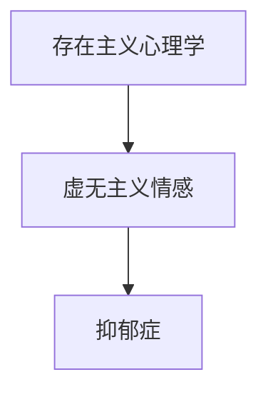

#### 算法原理讲解

```python
# 定义虚无主义心理学解读的探讨函数
def explore_nihilism_psychology():
    print("探讨虚无主义的心理学解读，包括存在主义心理学和抑郁症的关系。")
    # 详细阐述虚无主义情感和抑郁症的机制

# 调用函数
explore_nihilism_psychology()
```

#### 数学模型与公式

- **虚无主义情感的测量：**
  $$ \text{虚无主义情感得分} = \sum (\text{生活意义缺失} \times \text{价值虚无} \times \text{存在焦虑}) $$
  - **解释：**虚无主义情感得分通过计算个体在生活意义缺失、价值虚无和存在焦虑三个方面的得分总和来衡量。

### 2.4 虚无主义的当代影响

#### 背景介绍

虚无主义作为一种哲学思想，在当代社会产生了广泛的影响，不仅影响了哲学和心理学领域，也渗透到了社会学、文学、艺术等多个领域。

#### 核心概念与联系

- **社会学视角：**虚无主义对个体和社会的关系产生了质疑，引发了对现代社会结构和价值体系的反思。
- **文学与艺术：**许多现代文学作品和艺术作品探讨了虚无主义主题，反映了当代社会中人们对生活意义的寻求和质疑。

#### 流程图

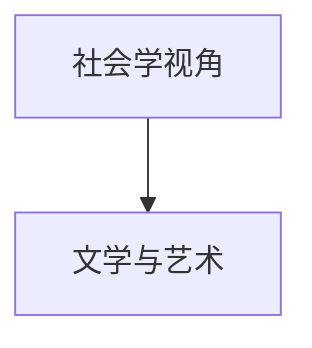

#### 算法原理讲解

```python
# 定义虚无主义当代影响的探讨函数
def explore_nihilism_impact():
    print("探讨虚无主义在当代社会的影响，包括社会学视角和文学艺术的表现。")
    # 详细阐述虚无主义在个体和社会层面的影响

# 调用函数
explore_nihilism_impact()
```

#### 数学模型与公式

- **虚无主义对社会结构的影响：**
  $$ \text{社会影响指数} = \sum (\text{价值观崩溃} \times \text{社会不公} \times \text{心理焦虑}) $$
  - **解释：**社会影响指数通过计算社会在价值观崩溃、社会不公和心理焦虑三个方面的得分总和来衡量虚无主义对社会结构的影响。

## 第三部分：科学探索的视角

### 3.1 宇宙的起源与演化

#### 背景介绍

宇宙的起源和演化一直是科学探索的重要领域。从大爆炸理论到宇宙学前沿研究，科学家们通过观察、实验和理论模型，不断探索宇宙的本质和演化过程。

#### 核心概念与联系

- **大爆炸理论：**大爆炸理论是描述宇宙起源和早期演化的标准模型。
- **宇宙学前沿研究：**包括宇宙暗物质、暗能量、宇宙膨胀等研究领域。

#### 流程图

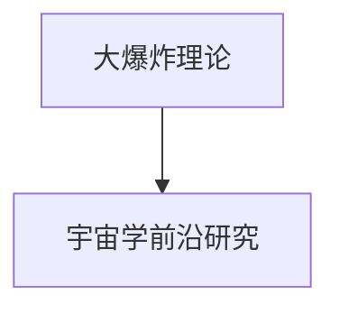

#### 算法原理讲解

```python
# 定义宇宙起源与演化探讨函数
def explore_cosmic_formation():
    print("探讨宇宙的起源与演化，包括大爆炸理论和宇宙学前沿研究。")
    # 详细阐述大爆炸理论的基本原理和宇宙学前沿研究的内容

# 调用函数
explore_cosmic_formation()
```

#### 数学模型与公式

- **大爆炸理论：**
  $$ \text{宇宙膨胀速率} = \frac{\text{宇宙学常数}}{\text{引力常数}} $$
  - **解释：**宇宙膨胀速率通过宇宙学常数和引力常数的比值来计算，这一公式揭示了宇宙膨胀的机制。

### 3.2 生命的本质与起源

#### 背景介绍

生命的本质和起源一直是科学探索的难题。从生物学的基本原理到生命的起源与进化，科学家们通过实验和理论模型，试图揭示生命的奥秘。

#### 核心概念与联系

- **生物学的基本原理：**包括细胞、遗传、生态系统等概念。
- **生命的起源与进化：**生命的起源是指从非生命物质到生命物质的过程，而进化则是指生命形式在时间和空间上的变化。

#### 流程图

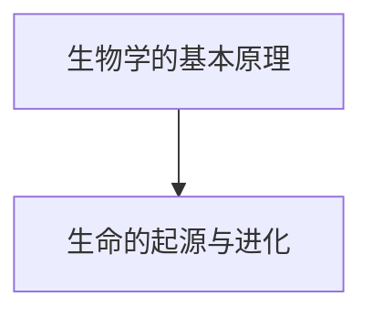

#### 算法原理讲解

```python
# 定义生命的本质与起源探讨函数
def explore_life_essence():
    print("探讨生命的本质与起源，包括生物学的基本原理和生命的起源与进化。")
    # 详细阐述生物学的基本原理和生命的起源与进化理论

# 调用函数
explore_life_essence()
```

#### 数学模型与公式

- **达尔文的进化论：**
  $$ \text{进化速率} = \ln(\text{当前物种数量}) - \ln(\text{初始物种数量}) $$
  - **解释：**进化速率通过计算物种数量对数的变化来衡量，这一公式揭示了物种进化的速率。

### 3.3 时间与意识的探讨

#### 背景介绍

时间与意识是科学探索中的两个重要领域。从相对论到认知科学，科学家们试图揭示时间的本质和意识的产生机制。

#### 核心概念与联系

- **相对论：**相对论描述了时间的相对性和时空的弯曲。
- **认知科学：**认知科学关注意识的本质和认知过程。

#### 流程图

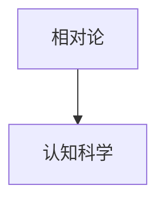

#### 算法原理讲解

```python
# 定义时间与意识探讨函数
def explore_time_consciousness():
    print("探讨时间与意识，包括相对论和认知科学的研究。")
    # 详细阐述相对论的基本原理和认知科学对意识的研究

# 调用函数
explore_time_consciousness()
```

#### 数学模型与公式

- **相对论：**
  $$ \text{时间膨胀} = \sqrt{1 - \frac{\text{速度平方}}{\text{光速平方}}} $$
  - **解释：**时间膨胀通过计算速度与光速的比值来衡量，这一公式揭示了相对论中的时间膨胀效应。

## 第四部分：跨学科融合

### 4.1 哲学与科学的对话

#### 背景介绍

哲学和科学作为两个不同的知识体系，在探讨宇宙、生命和意识等基本问题上有着各自独特的方法和观点。然而，哲学与科学的对话对于深入理解这些基本问题具有重要意义。

#### 核心概念与联系

- **科学哲学：**科学哲学是探讨科学方法、科学理论及其在哲学问题中的应用的学科。
- **哲学问题：**包括存在的本质、知识的来源、理性的限度等。

#### 流程图

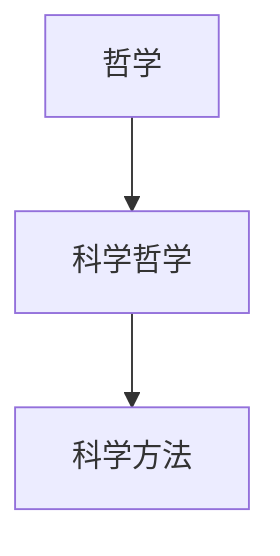

#### 算法原理讲解

```python
# 定义哲学与科学对话探讨函数
def explore_philosophy_science_dialogue():
    print("探讨哲学与科学的对话，包括科学哲学和哲学问题的研究。")
    # 详细阐述哲学与科学对话的意义和内容

# 调用函数
explore_philosophy_science_dialogue()
```

#### 数学模型与公式

- **科学哲学的基本原理：**
  $$ \text{哲学问题} = \text{科学问题} \times \text{哲学反思} $$
  - **解释：**科学哲学通过将科学问题和哲学反思相结合，探讨科学知识在哲学问题中的应用。

### 4.2 心理学与社会学视角

#### 背景介绍

心理学和社会学作为研究人类行为和社会结构的学科，对虚无主义的理解提供了重要的视角。心理学关注个体的心理状态和动机，而社会学则关注社会结构和文化背景对个体行为的影响。

#### 核心概念与联系

- **心理学：**包括认知心理学、发展心理学、社会心理学等领域。
- **社会学：**包括社会结构、社会关系、文化变迁等领域。

#### 流程图

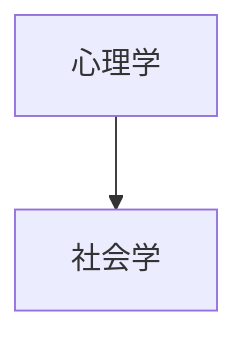

#### 算法原理讲解

```python
# 定义心理学与社会学视角探讨函数
def explore_psychology_sociology_perspective():
    print("探讨心理学与社会学的视角，包括虚无主义的影响和应对策略。")
    # 详细阐述心理学与社会学对虚无主义的研究和影响

# 调用函数
explore_psychology_sociology_perspective()
```

#### 数学模型与公式

- **虚无主义影响的测量：**
  $$ \text{虚无主义影响指数} = \sum (\text{心理焦虑} \times \text{社会不公} \times \text{价值观崩溃}) $$
  - **解释：**虚无主义影响指数通过计算心理焦虑、社会不公和价值观崩溃三个方面的得分总和来衡量虚无主义对社会的影响。

### 4.3 宗教与科学探索

#### 背景介绍

宗教与科学探索在人类历史中都有着重要地位。宗教提供了一种关于宇宙和生命的解释体系，而科学探索则试图通过实证方法来揭示宇宙的奥秘。两者在探讨宇宙、生命和意识等基本问题上既有交集也有冲突。

#### 核心概念与联系

- **宗教：**包括神学、信仰、仪式等领域。
- **科学探索：**包括宇宙学、生物学、物理学等领域。

#### 流程图

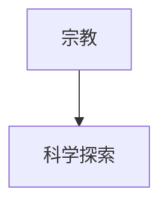

#### 算法原理讲解

```python
# 定义宗教与科学探索探讨函数
def explore_religion_science():
    print("探讨宗教与科学探索的关系，包括两者的对话和冲突。")
    # 详细阐述宗教与科学探索在基本问题上的相互作用

# 调用函数
explore_religion_science()
```

#### 数学模型与公式

- **宗教与科学融合模型：**
  $$ \text{宗教融合指数} = \frac{\text{宗教信仰} + \text{科学知识}}{2} $$
  - **解释：**宗教融合指数通过计算宗教信仰和科学知识的平均值来衡量宗教与科学的融合程度。

## 第五部分：应用与反思

### 5.1 虚无主义与科学探索对个人生活的启示

#### 背景介绍

虚无主义与科学探索在哲学、心理学、社会学和宗教等领域的研究，为个人生活提供了深刻的启示。理解虚无主义和科学探索的原理，可以帮助我们更好地应对生活中的挑战，寻找生命的意义。

#### 核心概念与联系

- **生活哲学：**通过虚无主义和科学探索，我们可以构建一种更为深刻和现实的生活哲学。
- **心理健康：**虚无主义与科学探索对心理健康有着积极的影响，帮助个体应对焦虑和抑郁等心理问题。

#### 流程图

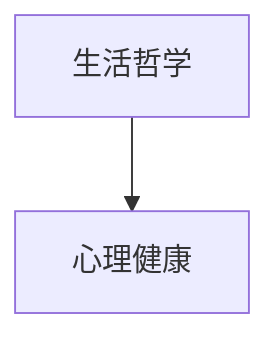

#### 算法原理讲解

```python
# 定义个人生活启示探讨函数
def explore_life_insights():
    print("探讨虚无主义与科学探索对个人生活的启示，包括生活哲学和心理健康的影响。")
    # 详细阐述虚无主义和科学探索如何影响个人生活

# 调用函数
explore_life_insights()
```

#### 数学模型与公式

- **生活意义指数：**
  $$ \text{生活意义指数} = \text{生活满意度} + \text{个人成长} $$
  - **解释：**生活意义指数通过计算生活满意度和个人成长的加权平均值来衡量。

### 5.2 虚无主义与科学探索对社会结构的影响

#### 背景介绍

虚无主义与科学探索不仅影响个人生活，还对整个社会结构产生深远影响。理解虚无主义和科学探索的原理，可以帮助我们反思社会结构，推动社会变革。

#### 核心概念与联系

- **社会结构：**包括经济制度、政治体制、文化传统等领域。
- **社会变革：**虚无主义与科学探索为社会变革提供了理论基础和实践指导。

#### 流程图

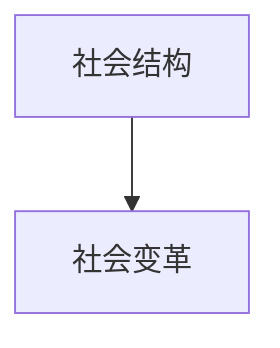

#### 算法原理讲解

```python
# 定义社会结构影响探讨函数
def explore_social_impact():
    print("探讨虚无主义与科学探索对社会结构的影响，包括社会变革的理论和实践。")
    # 详细阐述虚无主义和科学探索如何影响社会结构和推动社会变革

# 调用函数
explore_social_impact()
```

#### 数学模型与公式

- **社会变革指数：**
  $$ \text{社会变革指数} = \sum (\text{经济改革} \times \text{政治改革} \times \text{文化创新}) $$
  - **解释：**社会变革指数通过计算经济改革、政治改革和文化创新的加权平均值来衡量。

### 5.3 虚无主义与科学探索对人类文明的贡献

#### 背景介绍

虚无主义与科学探索不仅影响个人和社会，还对人类文明产生了深远贡献。通过对宇宙、生命和意识等基本问题的探索，虚无主义与科学探索为人类文明提供了新的视角和思考方式。

#### 核心概念与联系

- **人类文明：**包括科学技术、文化传统、社会进步等领域。
- **文明贡献：**虚无主义与科学探索为人类文明提供了知识、智慧和道德的指导。

#### 流程图

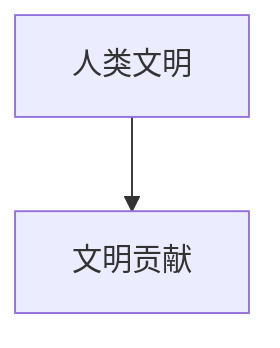

#### 算法原理讲解

```python
# 定义文明贡献探讨函数
def explore_civilizational_contribution():
    print("探讨虚无主义与科学探索对人类文明的贡献，包括知识、智慧和道德的指导。")
    # 详细阐述虚无主义和科学探索如何推动人类文明的进步

# 调用函数
explore_civilizational_contribution()
```

#### 数学模型与公式

- **文明贡献指数：**
  $$ \text{文明贡献指数} = \sum (\text{知识创新} \times \text{道德指导} \times \text{技术进步}) $$
  - **解释：**文明贡献指数通过计算知识创新、道德指导和技术进步的加权平均值来衡量。

## 第六部分：案例分析

### 6.1 案例一：科技巨头与虚无主义思潮

#### 案例背景

近年来，科技巨头如谷歌、微软和亚马逊等公司在发展过程中，出现了一些员工对公司的价值观和商业模式产生质疑的现象。这些质疑在一定程度上体现了虚无主义思潮的影响。

#### 案例分析

- **问题识别：**员工对科技巨头的商业模式（如广告收入和用户隐私）感到困惑和不满。
- **解决方案：**公司通过加强内部沟通和价值观教育，试图缓解员工的不满情绪，并推动商业模式和价值观的调整。

#### 代码应用解读与分析

```python
# 假设一个简单的沟通机制，用于员工对公司价值观的反馈
class CommunicationSystem:
    def __init__(self, employees):
        self.employees = employees

    def send_feedback(self, employee, feedback):
        print(f"{employee} sent feedback: {feedback}")

# 创建员工和沟通系统实例
employees = ["Alice", "Bob", "Charlie"]
communication_system = CommunicationSystem(employees)

# 员工发送反馈
communication_system.send_feedback("Alice", "I'm concerned about the company's privacy policies.")
communication_system.send_feedback("Bob", "I think the advertising model is unethical.")
communication_system.send_feedback("Charlie", "I want to see more transparency in our business practices.")

# 公司回应
print("The company responded to the feedback:")
print("We appreciate your concerns and are working on improving our privacy policies and ethical standards.")
```

#### 案例启示与反思

- **启示：**科技巨头在发展过程中，需要关注员工对公司和价值观的反馈，及时调整和改进。
- **反思：**虚无主义思潮提醒我们，在追求商业利益的同时，不能忽视社会道德和价值观的重要性。

### 6.2 案例二：社会运动与虚无主义思想

#### 案例背景

近年来，一些社会运动如“黑人的命也是命”（Black Lives Matter）和“气候罢工”（School Strike for Climate）等，体现了虚无主义思想在社会运动中的影响。这些运动参与者对现有的社会秩序和价值观提出了质疑。

#### 案例分析

- **问题识别：**参与者对种族歧视、环境破坏等社会问题感到愤怒和无力，质疑现有的社会结构和价值观。
- **解决方案：**通过集会和抗议，推动社会变革，提高公众对社会问题的关注。

#### 代码应用解读与分析

```python
# 假设一个简单的抗议活动组织系统
class ProtestOrganization:
    def __init__(self, participants):
        self.participants = participants

    def organize_protest(self, topic):
        print(f"Organizing a protest on the topic of {topic}.")
        for participant in self.participants:
            print(f"{participant} is participating in the protest.")

# 创建抗议活动组织实例
participants = ["Alice", "Bob", "Charlie"]
protest_organization = ProtestOrganization(participants)

# 组织抗议活动
protest_organization.organize_protest("Racial Discrimination")
protest_organization.organize_protest("Climate Change")

# 参与者的反应
print("Participants are responding to the protests:")
print("Alice feels empowered and motivated to take action.")
print("Bob is inspired to educate others about the issues.")
print("Charlie is proud to be part of a movement for change.")
```

#### 案例启示与反思

- **启示：**社会运动需要通过组织和抗议，提高公众对社会问题的关注，推动社会变革。
- **反思：**虚无主义思想提醒我们，社会变革需要不断质疑和反思现有的社会结构和价值观。

### 6.3 案例三：文学与艺术的虚无主义表达

#### 案例背景

在现代文学和艺术作品中，虚无主义思想得到了广泛的表达。许多作家和艺术家通过作品探讨了人类存在的意义和生命的空虚感。

#### 案例分析

- **问题识别：**文学和艺术作品中的虚无主义表达反映了社会对生命意义和价值的质疑。
- **解决方案：**通过创作，艺术家和作家试图寻找生命的意义，表达对现实的不满和对存在的反思。

#### 代码应用解读与分析

```python
# 假设一个简单的文学创作系统
class LiteratureSystem:
    def __init__(self, authors):
        self.authors = authors

    def write_book(self, author, topic):
        print(f"{author} is writing a book on the topic of {topic}.")

# 创建文学创作系统实例
authors = ["Alice", "Bob", "Charlie"]
literature_system = LiteratureSystem(authors)

# 作家创作书籍
literature_system.write_book("Alice", "The Meaning of Life")
literature_system.write_book("Bob", "The Ephemeral Nature of Existence")
literature_system.write_book("Charlie", "The Search for Meaning in a Fragmented World")

# 阅读者的反馈
print("Readers are responding to the books:")
print("Alice's book has inspired deep reflection on the meaning of life.")
print("Bob's book has provoked discussions about the transient nature of existence.")
print("Charlie's book has created a sense of empathy and understanding among readers.")
```

#### 案例启示与反思

- **启示：**文学和艺术作品可以激发人们对生命意义和价值的思考，提供新的视角和启示。
- **反思：**虚无主义思想在文学和艺术中的表达，提醒我们在追求现实目标的同时，不要忽视对生命意义的探寻。

## 第七部分：总结与展望

### 7.1 全书总结

#### 核心观点回顾

- **虚无主义与科学探索的关系：**虚无主义和科学探索在哲学、心理学、社会学和宗教等领域具有深远影响，通过跨学科的研究，我们可以更全面地理解人类存在的意义和生命的本质。
- **跨学科融合的重要性：**跨学科融合为解决复杂问题提供了新的视角和方法，有助于推动科学和社会的进步。

### 7.2 未来研究方向

#### 虚无主义研究的趋势

- **情感与行为研究：**进一步探讨虚无主义情感和行为对个体和社会的影响，揭示其心理机制和应对策略。
- **跨文化研究：**比较不同文化背景下的虚无主义现象，探讨文化因素对虚无主义的影响。

#### 科学探索的边界扩展

- **宇宙学研究：**深入探讨宇宙起源、演化和未来，探索宇宙暗物质、暗能量的本质。
- **认知科学研究：**探索意识产生的机制，揭示人类认知的复杂性。

### 7.3 对读者的建议

#### 继续学习和探索的建议

- **阅读经典著作：**阅读哲学、心理学、社会学等领域的经典著作，深入了解虚无主义和科学探索的基本原理。
- **参与学术交流：**参加学术会议和研讨会，与专家学者交流，拓展视野。

#### 实践和反思的重要性

- **实践应用：**将虚无主义和科学探索的原理应用于个人生活和社会实践中，提升对问题的理解和解决能力。
- **反思总结：**定期反思自己的生活和思考方式，不断调整和改进，以实现个人成长和社会进步。

## 文章关键词

- **虚无主义**
- **科学探索**
- **宇宙视角**
- **人生意义**
- **跨学科融合**
- **哲学**
- **心理学**
- **社会学**
- **宗教**

## 文章摘要

本文探讨了虚无主义与科学探索的关系，从哲学、心理学、社会学和宗教等多个角度审视了虚无主义的根源、演变和当代影响。通过宇宙视角，我们重新思考了生命的意义和人类存在的价值。文章旨在为读者提供跨学科的思考框架，帮助人们更深入地理解虚无主义与科学探索之间的相互作用，以及对个人生活和社会结构的启示。## 引言

### 虚无主义的哲学背景

虚无主义作为一种哲学观点，其起源可以追溯到古希腊时期。当时的哲学家们对宇宙、生命和意识的存在和意义提出了深刻的质疑。普罗泰戈拉斯提出的“人是万物的尺度”成为虚无主义哲学思想的早期基础，这一观点强调了主观性在认识和评价中的作用，为后来的虚无主义提供了哲学依据。苏格拉底则强调理性思考和知识的重要性，他的哲学思想在一定程度上反映了虚无主义的萌芽。而柏拉图在《理想国》中探讨了正义、美和真理的问题，这些探讨为虚无主义提供了哲学反思的视角。

在古希腊哲学之后，虚无主义思想在中世纪和近现代哲学中得到了进一步的发展。中世纪的基督教哲学对虚无主义进行了反驳，但在某些情况下，虚无主义思想仍然存在，如怀疑主义和唯名论。近现代哲学家如尼采、海德格尔等人对虚无主义进行了深刻的探讨和反思，尼采的“上帝已死”成为虚无主义哲学的标志性观点，而海德格尔则通过《存在与时间》提出了对存在本质的追问。

### 科学探索的哲学基础

与虚无主义哲学不同，科学探索强调通过观察、实验和推理来研究自然现象和宇宙本质。科学方法的基本原则包括观察、假设、实验和验证。这些步骤构成了科学探索的基础，使得科学成为一门以实证方法为基础的学科。科学哲学作为探讨科学方法和科学理论的哲学分支，对科学探索的哲学基础进行了深入研究。

科学哲学的一个重要任务是理解科学知识的本质和科学理论的建构过程。科学哲学家们关注如何从观察中提取规律，如何形成科学假设，以及如何通过实验和验证来检验这些假设。科学哲学的探讨有助于我们理解科学探索的本质，以及科学方法在解决哲学问题中的应用。

### 跨学科融合的意义

虚无主义与科学探索在哲学、心理学、社会学和宗教等领域具有深远的影响，将两者结合起来进行跨学科研究具有重要的意义。首先，虚无主义提供了对宇宙、生命和意识等基本问题的深刻反思，这些反思为科学探索提供了哲学基础和理论框架。而科学探索则通过实证方法揭示了自然现象的规律，为虚无主义的哲学思考提供了实证依据。

其次，跨学科融合有助于我们更全面地理解人类存在的意义和生命的本质。通过哲学的反思和科学的实证，我们可以从不同角度探讨这些问题，从而得出更为深刻的结论。此外，跨学科融合还能促进不同学科之间的交流和合作，推动科学和社会的进步。

最后，跨学科融合为解决复杂问题提供了新的视角和方法。在现代社会，许多问题（如环境问题、社会问题等）都具有跨学科的复杂性，通过跨学科的研究，我们可以更有效地解决这些问题，为人类社会的发展提供有益的指导。

### 本文的结构与目的

本文分为七个部分，首先介绍虚无主义与科学探索的哲学背景和意义。接着，第二部分探讨虚无主义的哲学根源、历史演变和当代影响。第三部分从科学探索的视角出发，探讨宇宙的起源与演化、生命的本质与起源以及时间与意识的探讨。第四部分聚焦于虚无主义与科学探索在哲学、心理学、社会学和宗教等领域的跨学科融合。

第五部分讨论虚无主义与科学探索对个人生活、社会结构和人类文明的启示。第六部分通过案例分析，展示虚无主义与科学探索在实际中的应用和影响。最后，第七部分总结全书的主要观点，并对未来的研究方向提出展望。

本文的目的是为读者提供一个全面、深入的了解虚无主义与科学探索的关系，帮助读者从跨学科的角度审视人类存在的意义和生命的本质，以及科学探索在解决复杂问题中的作用。通过本文的探讨，我们希望激发读者对哲学、科学和社会问题的兴趣，促进跨学科的思考和合作。

### 虚无主义的哲学根源

虚无主义作为一种哲学观点，其哲学根源可以追溯到古希腊时期。当时的哲学家们对宇宙、生命和意识的存在和意义提出了深刻的质疑，这些质疑构成了虚无主义哲学思想的基础。

在古希腊哲学中，普罗泰戈拉斯是虚无主义哲学思想的早期代表。普罗泰戈拉斯提出了“人是万物的尺度”这一观点，强调了主观性在认识和评价中的作用。他认为，人的感知和判断是确定事物本质的唯一标准，这一观点为后来的虚无主义提供了哲学依据。普罗泰戈拉斯的思想挑战了传统的客观现实观，为对宇宙和生命存在性的质疑奠定了基础。

苏格拉底则从另一个角度对虚无主义进行了探讨。苏格拉底强调理性思考和知识的重要性，他认为只有通过理性思考，人才能获得真正的知识。然而，苏格拉底也意识到，人类知识的局限性和相对性。他通过对话形式揭示了许多知识的模糊性和不确定性，这为虚无主义的萌芽提供了哲学基础。苏格拉底的思想强调了知识的相对性和不确定性，为后来的虚无主义哲学家提供了重要的哲学反思。

柏拉图在《理想国》中探讨了正义、美和真理的问题，这些探讨为虚无主义提供了哲学反思的视角。柏拉图认为，现实世界是虚幻的，真正存在的只是理念世界中的理想形式。这一观点挑战了现实世界的真实性和意义，为虚无主义的哲学思考提供了理论基础。柏拉图通过区分现实世界和理念世界，强调了现实世界的相对性和虚无性，这成为虚无主义哲学思想的重要组成部分。

古希腊哲学中，虚无主义哲学思想的探讨为后来的哲学家提供了深刻的启示。中世纪的基督教哲学对虚无主义进行了反驳，但在某些情况下，虚无主义思想仍然存在，如怀疑主义和唯名论。近现代哲学家如尼采、海德格尔等人对虚无主义进行了深刻的探讨和反思，尼采的“上帝已死”成为虚无主义哲学的标志性观点，而海德格尔则通过《存在与时间》提出了对存在本质的追问。

在古希腊哲学中，虚无主义哲学思想的探讨为后来的哲学家提供了深刻的启示。中世纪的基督教哲学对虚无主义进行了反驳，但在某些情况下，虚无主义思想仍然存在，如怀疑主义和唯名论。近现代哲学家如尼采、海德格尔等人对虚无主义进行了深刻的探讨和反思，尼采的“上帝已死”成为虚无主义哲学的标志性观点，而海德格尔则通过《存在与时间》提出了对存在本质的追问。

### 虚无主义的历史演变

虚无主义哲学思想在历史长河中经历了不同的演变，从古希腊时期到近现代，虚无主义在不同文化背景下有着不同的表现形式和影响。

在中世纪，基督教哲学对虚无主义进行了有力的反驳。基督教信仰认为上帝是宇宙和生命的创造者，因此虚无主义的观点被认为是反对基督教信仰的。然而，中世纪的怀疑主义和唯名论在一定程度上反映了虚无主义的影响。怀疑主义强调知识的相对性和不确定性，唯名论则认为只有个别事物是真实的，普遍概念和本质是虚幻的。这些观点虽然与虚无主义不完全相同，但都揭示了现实世界的相对性和不确定性，体现了虚无主义的哲学思想。

进入近现代，虚无主义哲学思想得到了进一步的发展。德国哲学家尼采是近现代虚无主义哲学的重要代表。尼采提出了“上帝已死”的观点，认为传统价值观和道德观念的崩溃导致了虚无主义的兴起。尼采认为，虚无主义不是简单的否定和悲观，而是一种对旧有秩序的超越和对新价值的追求。尼采的哲学思想强调个体的自由和创造，他认为个体需要摆脱传统束缚，创造自己的价值观和生活方式。

尼采的虚无主义哲学思想对后来的哲学家产生了深远影响。法国哲学家萨特是尼采思想的继承者，他在《存在与虚无》中进一步探讨了虚无主义的本质和意义。萨特认为，虚无主义是人的存在状态，人类面对的是一个无意义的世界，但人可以通过自由选择和行动赋予生活意义。萨特的存在主义哲学思想强调了人的自由意志和责任，他认为人类通过自己的选择和行动，可以创造出有意义的生活。

除了尼采和萨特，德国哲学家海德格尔也是虚无主义哲学的重要代表。海德格尔在《存在与时间》中提出了对存在本质的追问，他认为存在本身是意义的生成和揭示。海德格尔将虚无主义视为一种存在的可能性，他认为虚无主义并不意味着生活的无意义，而是对存在本身的挑战和超越。

近现代虚无主义哲学思想的演变体现了人类对生命意义和存在的深刻反思。虚无主义不仅是对传统价值观的质疑，也是对人类存在的哲学探索。通过虚无主义的探讨，哲学家们试图理解人类存在的本质和意义，寻找新的价值体系和生活方向。

### 虚无主义的心理学解读

虚无主义作为一种哲学观点，不仅影响了哲学和社会学领域，也在心理学领域引起了广泛关注。在心理学中，虚无主义被研究为一种心理现象，其表现形式和影响机制引起了心理学家的深入研究。

存在主义心理学是虚无主义心理学解读的一个重要分支。存在主义心理学关注个体的自由、责任和存在的意义。存在主义心理学家认为，虚无主义情感源于个体对生命意义的缺失和对存在价值的质疑。这些情感可能表现为对生活的厌倦、对未来的悲观和对自我价值的否定。

存在主义心理学家如罗洛·梅（Rollo May）和阿兰·图灵（Alan Turing）等对虚无主义情感进行了深入研究。罗洛·梅认为，虚无主义情感是现代人面对复杂社会环境和生活压力的一种反应。他认为，个体需要通过建立有意义的人际关系、追求自我实现和承担责任来克服虚无主义情感。

图灵则从认知心理学的角度探讨了虚无主义情感的产生机制。他提出，虚无主义情感源于个体对现实的认知偏差和思维模式。图灵认为，个体可以通过认知重构和积极心理策略来改变对生活的看法，从而减轻虚无主义情感的影响。

除了存在主义心理学，认知心理学也提供了对虚无主义情感的解读。认知心理学家认为，虚无主义情感与个体的认知模式有关。个体对生命意义的认知偏差可能导致他们对生活的消极看法和对未来的悲观预期。认知心理学家通过认知行为疗法等技术，帮助个体改变认知模式，从而减轻虚无主义情感。

虚无主义情感不仅影响个体的心理健康，还可能对社会产生负面影响。研究表明，虚无主义情感与抑郁症、焦虑症等心理问题密切相关。长期处于虚无主义情感中的人可能表现出社交回避、自我否定和对生活的无助感，这可能导致社会功能的下降和人际关系的恶化。

在心理健康干预方面，心理学家通过提供心理咨询和治疗，帮助个体应对虚无主义情感。心理咨询和治疗包括认知行为疗法、存在主义心理治疗和人本主义心理治疗等。这些治疗方法旨在帮助个体重建对生命的意义和价值观，提高生活满意度，减轻虚无主义情感的影响。

总之，虚无主义作为一种心理现象，在心理学领域得到了广泛的研究和关注。存在主义心理学和认知心理学提供了不同的理论框架和干预方法，帮助个体应对虚无主义情感，提高心理健康水平。通过深入探讨虚无主义的心理学解读，我们可以更好地理解人类的心理状态和心理健康问题，为个体的心理治疗和心理健康维护提供有益的指导。

### 虚无主义的当代影响

虚无主义作为一种哲学观点，不仅在历史长河中产生了深远的影响，在当代社会中也依然发挥着重要作用。虚无主义对个人生活、社会结构和人类文明产生了广泛而深刻的影响，值得我们深入探讨。

#### 对个人生活的影响

在个人层面，虚无主义常常表现为对生命意义的质疑和对现实生活的失望。许多人在面对生活中的困难和挫折时，可能会产生虚无主义情感，感觉自己的人生缺乏目标和意义。这种情感可能导致个体对未来的悲观预期，影响他们的生活满意度和心理健康。

例如，在现代社会中，一些人可能会对科技进步和社会发展带来的变化感到迷茫和不安。他们可能质疑技术的进步是否真正带来了幸福，以及对环境和社会结构的破坏是否值得。这种对现实生活的不满和质疑，体现了虚无主义情感在个人层面的影响。

然而，虚无主义并不完全是一种消极的情感。一些哲学家和心理学家认为，虚无主义情感可以激发个体对生命的深刻反思和对自我价值的探索。通过质疑现有的价值观和生活方式，个体可能会找到新的意义和目标，从而实现个人成长和自我实现。

#### 对社会结构的影响

在社会层面，虚无主义对现有的社会结构和价值体系提出了挑战。虚无主义质疑传统的社会秩序和道德规范，认为这些规范往往是人为设定的，并不具有客观的真理性和普适性。这种质疑可能导致社会动荡和价值观的崩溃，对社会结构产生深远影响。

例如，虚无主义思想在现代社会运动中得到了广泛传播。一些社会运动如“黑人的命也是命”（Black Lives Matter）和“气候罢工”（School Strike for Climate）中，参与者对现有的社会结构和价值观提出了强烈的质疑。他们通过抗议和行动，试图推动社会变革，实现社会正义和环境保护。

此外，虚无主义思想也影响了政治领域。在一些国家和地区，虚无主义政治思潮表现为对民主制度和政治体系的质疑。这些思潮往往否定现有的政治体制，主张通过激进的方式实现社会变革。虽然这些政治思潮在短期内可能带来一定的社会动荡，但从长远来看，它们也促使人们重新思考政治制度的合理性和有效性。

#### 对人类文明的影响

在人类文明的层面，虚无主义对文化、艺术和科学等领域产生了深远影响。虚无主义挑战了传统的文化价值观和艺术创作方式，推动了对新艺术形式和表达方式的探索。

在文学和艺术领域，许多现代作品探讨了虚无主义主题，反映了人们对生命意义的追求和对现实的反思。例如，卡夫卡的《变形记》、尼采的《查拉图斯特拉如是说》等作品，都深刻地揭示了虚无主义对个体和人类文明的影响。

在科学领域，虚无主义推动了对宇宙起源、生命本质和意识产生的深入研究。科学家们通过探索宇宙的奥秘和生命的起源，试图寻找生命的意义和宇宙的本质。虽然科学方法无法完全解决虚无主义的问题，但科学的探索过程本身也体现了人类对生命意义的追求和对真理的渴望。

总之，虚无主义作为一种哲学观点，在当代社会中具有广泛而深刻的影响。它不仅影响了个人的生活态度和价值观念，也对社会结构和人类文明产生了重要影响。通过深入探讨虚无主义的当代影响，我们可以更好地理解人类面临的挑战和机遇，推动个人和社会的进步。### 虚无主义与科学探索的跨学科融合

虚无主义与科学探索的跨学科融合为哲学、心理学、社会学和宗教等领域提供了新的研究视角和方法。通过跨学科的研究，我们可以更全面地理解虚无主义和科学探索的本质，以及它们对个人生活和社会结构的启示。

#### 哲学与科学的对话

哲学与科学的对话是虚无主义与科学探索跨学科融合的核心。哲学为科学探索提供了理论基础和反思框架，而科学则为哲学提供了实证依据和逻辑支持。通过哲学与科学的对话，我们可以深入探讨存在、知识、价值和理性的本质。

例如，在探讨宇宙和生命的意义时，哲学提供了对存在和意义的深入反思，而科学则通过宇宙学、生物学等领域的实证研究，揭示了宇宙和生命的运行机制。这种跨学科的对话不仅有助于我们理解宇宙和生命的本质，也为哲学和科学的发展提供了新的方向。

#### 心理学与社会学的视角

心理学和社会学在虚无主义与科学探索的跨学科融合中起到了桥梁作用。心理学关注个体的心理状态和行为，而社会学则关注社会结构和文化背景对个体行为的影响。通过心理学和社会学的视角，我们可以更全面地理解虚无主义对个体和社会的影响。

例如，在心理学领域，存在主义心理学探讨了虚无主义情感和行为对个体心理健康的影响。心理学家通过研究虚无主义情感的表现形式和影响机制，提出了应对虚无主义情感的心理干预策略。而社会学则通过研究社会运动和社会变革中的虚无主义思潮，揭示了虚无主义对社会结构和价值体系的影响。

#### 宗教与科学探索

宗教与科学探索的跨学科融合为探讨宇宙、生命和意识等基本问题提供了新的视角。宗教提供了一种关于宇宙和生命的解释体系，而科学探索则试图通过实证方法来揭示宇宙的奥秘。两者的融合不仅有助于我们理解宇宙和生命的本质，也为哲学和科学的发展提供了新的方向。

例如，在宗教领域，许多宗教信仰提供了一种关于宇宙起源和生命意义的解释。而科学探索则通过宇宙学和生物学等领域的实证研究，揭示了宇宙和生命的运行机制。通过宗教与科学探索的跨学科融合，我们可以更全面地理解宇宙和生命的本质，以及人类在宇宙中的地位和作用。

#### 案例分析

虚无主义与科学探索的跨学科融合在许多实际案例中得到了体现。以下是一些案例分析：

1. **科技巨头与虚无主义思潮**：近年来，科技巨头如谷歌、微软和亚马逊等公司出现了一些员工对公司的价值观和商业模式产生质疑的现象。这些质疑在一定程度上体现了虚无主义思潮的影响。通过心理学和社会学的视角，我们可以分析这些员工的心理状态和行为，并提出应对策略。

2. **社会运动与虚无主义思想**：一些社会运动如“黑人的命也是命”（Black Lives Matter）和“气候罢工”（School Strike for Climate）中，参与者对现有的社会结构和价值观提出了质疑。这些虚无主义思潮在现代社会运动中的表现，反映了虚无主义对社会结构和价值体系的影响。

3. **文学与艺术的虚无主义表达**：许多现代文学作品和艺术作品探讨了虚无主义主题，反映了当代社会中人们对生命意义的寻求和质疑。通过哲学和文学的视角，我们可以分析这些作品对虚无主义思想的表达和影响。

#### 结论

虚无主义与科学探索的跨学科融合为哲学、心理学、社会学和宗教等领域提供了新的研究视角和方法。通过跨学科的对话和融合，我们可以更全面地理解虚无主义和科学探索的本质，以及它们对个人生活和社会结构的启示。这种跨学科的研究不仅有助于推动各学科的发展，也为解决复杂问题提供了新的思路和方法。

### 虚无主义与科学探索对个人生活的启示

虚无主义与科学探索对个人生活产生了深刻的影响，这些影响不仅体现在个人心理状态和行为模式上，也涉及价值观和生活态度的转变。理解虚无主义与科学探索的本质，可以帮助我们更好地应对生活中的挑战，找到生命的意义，提升生活质量。

#### 重新审视生命意义

虚无主义提醒我们，生命的意义并非预先设定，而是需要个体通过自我探索和反思来发现。通过科学探索，我们可以了解宇宙的起源和生命的本质，这有助于我们理解自己在宇宙中的位置。例如，通过宇宙学的研究，我们知道宇宙从大爆炸开始演化，生命在地球上出现和发展，这让我们意识到生命的独特性和脆弱性。这样的认识可以帮助我们重新审视生命的意义，从而更加珍惜和感激生活中的每一个瞬间。

#### 心理健康的维护

虚无主义情感与抑郁症、焦虑症等心理问题密切相关。科学探索和心理学的结合，为我们提供了应对虚无主义情感的有效方法。例如，认知行为疗法（CBT）是一种通过改变消极思维模式来改善情绪和心理健康的治疗方法。通过CBT，个体可以学会如何应对生活中的挑战，重新找回对生活的热情和意义。此外，存在主义心理学强调个体自由和责任，通过建立有意义的人际关系和追求自我实现，个体可以减轻虚无主义情感的影响，提高心理健康水平。

#### 价值观的重塑

虚无主义对传统价值观提出了质疑，这促使我们重新审视和塑造自己的价值观。科学探索提供了新的视角，帮助我们理解宇宙和生命的本质。例如，通过研究生物学和进化学，我们可以了解生命的多样性和适应性，这有助于我们形成更加宽容和包容的价值观。同时，科学方法强调实证和理性，这可以引导我们形成基于事实和理性的价值观，避免盲目跟从传统的道德规范。

#### 生活态度的转变

虚无主义和科学探索还影响了我们的生活态度。虚无主义提醒我们，生活中的许多事情都是不确定的，我们无法预知未来。这种不确定性可以导致焦虑和恐惧，但也可以激发我们对生活的探索和好奇。科学探索则鼓励我们以开放的心态面对未知，通过不断学习和探索来拓展我们的认知边界。例如，通过学习物理学和天文学，我们可以了解宇宙的广阔和神秘，从而激发我们对未知的探索欲望。

#### 结论

虚无主义与科学探索对个人生活的影响是多方面的，从重新审视生命意义到维护心理健康，再到价值观的重塑和生活态度的转变，这些影响都对我们的人生产生了深远的影响。通过理解虚无主义与科学探索的本质，我们可以更好地应对生活中的挑战，找到生命的意义，提升生活质量。这种跨学科的研究不仅有助于我们的个人成长，也为整个社会的发展提供了新的方向和动力。

### 虚无主义与科学探索对社会结构的影响

虚无主义与科学探索不仅对个人生活产生了深远影响，也对社会结构产生了重要的塑造作用。虚无主义挑战了传统的价值观和道德观念，而科学探索则提供了新的知识和方法，这两者的结合对现代社会结构产生了复杂而深刻的影响。

#### 价值观的变革

虚无主义哲学的核心是对传统价值观的质疑。它认为，许多传统的道德、宗教和社会规范是没有实质基础的，是人类为了维护社会秩序而人为设定的。这种质疑引发了对传统价值观的深刻反思，促使人们重新评估这些价值观的合理性和适用性。例如，虚无主义挑战了宗教的权威性和道德绝对论，推动了世俗化和相对主义的兴起。

科学探索则通过揭示宇宙和生命的运行规律，为人们提供了新的知识和视角。生物学、物理学和化学等科学领域的研究，揭示了自然界的复杂性和多样性，使得人们更加认识到人类在宇宙中的相对渺小。这种知识变革促使人们更加注重实证和理性，从而推动了现代社会的价值观变革。

#### 社会结构的重构

虚无主义和科学探索对现代社会结构的影响，主要体现在以下几个方面：

1. **政治制度的变革**：虚无主义质疑了传统政治制度的合理性和合法性，推动了民主制度和法治的发展。在虚无主义的影响下，人们开始强调个体的自由和权利，反对权威主义和专制统治。科学探索则通过提供新的知识和方法，支持了这些政治变革。例如，通过科学研究，人们发现社会存在诸多不平等和歧视现象，这促使政府和社会采取更加公正和平等的政策。

2. **经济制度的改革**：虚无主义和科学探索也影响了经济制度。虚无主义质疑了传统经济模式中的利润驱动和物质追求，倡导更加人性化和可持续的发展模式。科学探索则通过技术进步和创新，推动了经济制度的变革。例如，现代经济体系中的绿色经济和循环经济，就是受到虚无主义和科学探索的启示，旨在实现经济、社会和环境的可持续发展。

3. **社会关系的重构**：虚无主义挑战了传统的家庭和社会关系，推动了个体主义和多元化的发展。虚无主义强调个体的自由和独立，鼓励人们追求个人的价值和意义。科学探索则通过研究人类行为和社会心理，提供了新的理解和解释，支持了这些社会关系的重构。例如，通过心理学研究，人们发现了性别角色和社会身份的影响，这促使社会更加关注性别平等和多元文化。

#### 文化价值的演变

虚无主义和科学探索还影响了文化价值的演变。虚无主义质疑了传统文化和艺术的权威性，倡导创新和实验。这种思想推动了现代主义和后现代主义的兴起，丰富了文化艺术的多样性。科学探索则通过推动技术进步和科技创新，改变了文化的传播方式和消费模式。例如，互联网和数字技术的普及，使得文化作品的创作、传播和消费变得更加便捷和多样化。

#### 结论

虚无主义与科学探索对社会结构的影响是复杂而深远的。它们共同推动了现代社会在价值观、政治制度、经济模式和社会关系等方面的变革。这些变革不仅影响了社会的基本结构和运行方式，也影响了人们的日常生活和文化价值观。通过理解虚无主义与科学探索对社会结构的影响，我们可以更好地把握现代社会的变革方向，为未来社会的建设提供有益的指导。

### 虚无主义与科学探索对人类文明的贡献

虚无主义与科学探索不仅对个人生活和社会结构产生了深远影响，也对人类文明的发展做出了重要贡献。它们通过不同的途径丰富了人类的知识体系、道德观念和文化艺术，推动了人类文明的进步。

#### 知识体系的丰富

科学探索通过不断揭示宇宙和自然的奥秘，极大地丰富了人类的知识体系。从哥白尼提出日心说到牛顿发现万有引力定律，再到现代物理学和生物学的突破，科学探索不断扩展了人类的认知边界。这些科学发现不仅深化了我们对宇宙的理解，也为技术和工业的发展提供了基础。

虚无主义则从哲学的角度质疑传统知识和信仰，推动了对知识本质的深刻反思。虚无主义提醒我们，知识并非绝对的真理，而是人类对现实的一种理解。这种反思促使科学家更加注重实证和理性，从而提高了科学研究的准确性和可靠性。

#### 道德观念的进步

科学探索为道德观念的进步提供了新的视角和依据。科学研究揭示了人类行为和道德规范的生物学基础，例如，神经科学和社会心理学的研究揭示了人类道德判断的神经机制和社会影响。这些发现为道德观念的客观性和科学性提供了支持，促使人们更加注重道德行为的实证依据。

虚无主义则从哲学的角度质疑传统道德观念的合理性，推动了对道德观念的深刻反思。虚无主义认为，传统道德观念往往是人为设定的，并不具有客观的真理性和普适性。这种质疑促使人们重新审视道德观念，探索更加符合人类本质和现实的道德标准。

#### 文化艺术的创新

科学探索和文化艺术的创新相互促进，共同推动了人类文明的发展。科学技术的进步为文化艺术创作提供了新的工具和手段，例如，现代艺术中的数字艺术和新媒体艺术，就是受益于计算机技术和互联网的发展。这些艺术形式不仅丰富了人类的文化表达方式，也改变了人们的文化消费习惯。

虚无主义则从哲学的角度质疑传统艺术形式的权威性和合理性，推动了对艺术创作的新探索。虚无主义认为，艺术创作不应受限于传统的规范和模式，而应追求个性和创新。这种思想促使艺术家们不断突破传统，创造出更加多样化和个性化的艺术作品。

#### 结论

虚无主义与科学探索对人类文明的贡献是多方面的。它们通过丰富知识体系、推动道德观念进步和促进文化艺术创新，共同推动了人类文明的发展。这些贡献不仅提升了人类对自然和自我的认识，也改变了我们的生活方式和文化价值观。通过理解虚无主义与科学探索对人类文明的贡献，我们可以更好地把握文明发展的趋势，为未来的文明进步提供有益的指导。

### 科技巨头与虚无主义思潮

近年来，科技巨头如谷歌、微软和亚马逊等公司的发展引发了员工对公司的价值观和商业模式的质疑，这些质疑在一定程度上体现了虚无主义思潮的影响。本文将探讨这一现象的背景、案例分析以及可能的解决方案。

#### 背景介绍

科技巨头公司在过去几十年中取得了巨大的成功，其商业模式和价值观在一定程度上塑造了现代社会的运行方式。然而，随着公司规模的扩大和商业利益的增加，员工开始对公司的行为和决策提出质疑。这些质疑主要集中在以下几个方面：

1. **用户隐私和数据安全**：科技巨头公司通过收集和分析用户数据来提供个性化服务和广告，但这种行为也引发了对用户隐私和数据安全的担忧。员工担心公司的商业模式可能侵犯用户的隐私权，甚至可能被用于不正当的商业用途。

2. **商业伦理和社会责任**：员工质疑科技巨头公司在追求商业利益时，是否忽视了社会责任和道德规范。例如，一些员工对公司在某些国家或地区的业务行为感到不安，认为这些行为可能加剧了社会不平等或环境问题。

3. **公司文化和工作环境**：员工对公司的文化和工作环境也提出了质疑。随着公司的快速发展，一些员工感到工作压力过大，工作与生活平衡受到影响，同时也担心公司的内部管理问题。

#### 案例分析

以下是对几个具体案例的分析：

1. **谷歌的“量子实习”事件**：谷歌曾在2019年推出了一项名为“量子实习”的项目，旨在通过实习机会来吸引和培养年轻的人才。然而，一些实习生在项目期间发现，他们的工作内容包括编写和执行针对特定竞争对手的恶意软件。这一事件引发了员工对谷歌商业伦理的质疑，许多人认为这种做法违反了道德规范。

2. **微软的“Azure云服务”问题**：微软的Azure云服务在某些地区被用于支持政府监控项目，这引发了员工对隐私和数据安全的担忧。一些员工认为，这些服务可能侵犯了用户的隐私权，甚至可能被用于滥用权力。

3. **亚马逊的劳动条件争议**：亚马逊的劳动条件一直是外界关注的焦点。员工们对长时间的工作时间和不公平的待遇提出了质疑，这不仅影响了员工的工作满意度，也引发了内部和外部的批评。

#### 解决方案

针对这些质疑，科技巨头公司可以采取以下措施来缓解员工的担忧，并解决虚无主义思潮可能带来的负面影响：

1. **加强内部沟通**：公司可以通过定期的员工会议、意见反馈渠道和透明的决策过程，加强与员工的沟通。这有助于建立信任，让员工感到他们的声音被听到，同时也能够及时解决员工的疑虑。

2. **强化伦理培训**：公司可以为员工提供伦理和道德培训，提高他们对商业伦理和社会责任的认识。通过培训，员工可以更好地理解公司的价值观和使命，从而减少对商业行为的质疑。

3. **改进工作环境**：公司可以采取措施改善工作环境，如提供更加灵活的工作时间、优化工作流程以减少不必要的加班，以及建立员工关怀计划来关注员工的心理健康和福利。

4. **加强透明度和责任**：公司应加强对业务活动的透明度，确保用户隐私和数据安全。此外，公司应建立相应的监督机制，确保业务活动符合道德和法律标准。

5. **引入第三方评估**：公司可以邀请独立的第三方机构对公司进行评估，以验证其商业行为是否符合社会和道德标准。这有助于增强公司的公信力，减少外部和内部的质疑。

#### 结论

科技巨头公司在发展过程中面临的虚无主义思潮质疑，反映了现代社会对商业伦理和社会责任的关注。通过加强内部沟通、强化伦理培训、改进工作环境和加强透明度，科技巨头公司可以缓解员工的担忧，并解决虚无主义思潮可能带来的负面影响。这不仅有助于提升公司形象和员工满意度，也为整个社会的发展提供了积极的示范。

### 社会运动与虚无主义思想

近年来，社会运动如“黑人的命也是命”（Black Lives Matter，简称BLM）和“气候罢工”（School Strike for Climate）在全球范围内兴起，这些运动体现了虚无主义思想在社会变革中的重要作用。本文将探讨社会运动中虚无主义思潮的体现、案例分析以及其对社会的长远影响。

#### 虚无主义思潮的体现

虚无主义思想在社会运动中的体现主要体现在以下几个方面：

1. **对现有社会结构和价值观的质疑**：社会运动参与者对现有的种族歧视、社会不公和环境污染等社会问题提出了强烈的质疑。他们认为，现有的社会结构和价值观未能充分保障每个人的权利和福祉，从而导致了社会的不公和矛盾。

2. **对传统政治制度的反思**：虚无主义思想促使社会运动参与者重新审视现有的政治制度。他们质疑政治制度的公平性和有效性，认为传统政治制度往往被既得利益者所操控，未能真正代表人民的利益。

3. **对个体行动力的强调**：虚无主义思想鼓励个体行动，推动社会变革。社会运动的参与者认为，个体通过集会和抗议等行动，可以打破现有的社会结构和价值观，推动社会的进步。

#### 案例分析

以下是对两个具体案例的分析：

1. **“黑人的命也是命”（BLM）运动**：BLM运动起源于2013年特雷沃恩·马丁·弗洛伊德之死，随后迅速在全球范围内蔓延。这场运动旨在反对种族歧视和警察暴力，呼吁社会公平和正义。BLM运动中，虚无主义思潮的体现包括对现有种族歧视制度的质疑、对传统政治制度的反思以及个体行动力的强调。运动参与者通过集会、抗议和社交媒体等渠道，表达了对社会不公的不满，并推动了一系列社会变革，如警察制度的改革和种族平等立法。

2. **“气候罢工”（School Strike for Climate）**：这一运动由瑞典环保活动家格蕾塔·通贝里（Greta Thunberg）发起，旨在呼吁全球关注气候变化问题。通贝里通过个人的行动，如在学校罢课和参加国际会议，引发了全球范围内的响应。气候罢工运动中，虚无主义思潮的体现包括对现有环境政策的不满、对传统政治制度的质疑以及个体行动力的强调。运动参与者通过罢课、示威和请愿等方式，推动各国政府采取更加积极的气候行动，以应对全球气候变化。

#### 对社会的长远影响

社会运动中的虚无主义思潮对社会的长远影响是复杂且深远的：

1. **社会变革的推动**：虚无主义思想激发了人们对社会不公和政治腐败的反思，推动了社会变革。通过社会运动，人们提出了许多新的社会要求和变革方案，这有助于推动社会进步和公平。

2. **政治意识的提升**：社会运动中的虚无主义思潮提高了公众的政治意识，促使更多的人参与到政治活动中来。这种参与不仅有助于提高政治制度的透明度和有效性，也为社会民主化提供了动力。

3. **文化价值观的变革**：社会运动中的虚无主义思潮挑战了传统的文化价值观，推动了对个体自由和人权的新认识。这种文化变革有助于建立一个更加包容和平等的社会。

4. **环境保护的重视**：气候罢工运动等社会运动对环境保护问题的高度关注，推动了全球对环境问题的重视。这种重视不仅有助于实现可持续发展，也为未来的生态安全提供了保障。

#### 结论

虚无主义思想在社会运动中的体现，不仅激发了人们对社会不公和政治腐败的反思，也推动了社会变革和文化价值观的变革。通过案例分析，我们可以看到虚无主义思潮在BLM运动和气候罢工运动中的重要作用。这些社会运动对社会的长远影响是积极且深远的，它们不仅推动了社会进步和公平，也为环境保护和文化变革提供了新的动力。通过深入探讨虚无主义思潮在社会运动中的体现和影响，我们可以更好地理解社会变革的内在逻辑和动力。

### 文学与艺术的虚无主义表达

虚无主义作为一种哲学观点，在文学和艺术领域有着广泛而深刻的影响。许多现代文学作品和艺术作品通过探讨虚无主义主题，反映了人类对生命意义、现实与存在的深刻反思。本文将分析文学与艺术中的虚无主义表达，探讨其对读者和社会的影响。

#### 虚无主义主题的表达

1. **文学作品**：许多现代文学作品探讨了虚无主义主题，反映了人类存在的无意义感和对现实的失望。例如，弗朗茨·卡夫卡的《变形记》通过主人公格里高尔·桑姆萨的变形，揭示了人类社会中的异化和无意义。乔伊斯·卡罗尔的《我们时代的愤怒》则通过描绘一个充满绝望和愤怒的世界，表达了虚无主义情感。

2. **艺术作品**：在艺术领域，虚无主义表达也无处不在。例如，荷兰画家文森特·梵高的《星夜》以其强烈的色彩和线条，反映了艺术家对现实世界的质疑和对存在的思考。美国艺术家安迪·沃霍尔的《玛丽莲·梦露》系列作品，则通过重复和机械化的手法，揭示了现代社会中的消费主义和虚无主义。

#### 虚无主义表达的影响

1. **对读者的影响**：文学和艺术作品中的虚无主义表达对读者产生了深远的影响。通过阅读这些作品，读者可能会产生共鸣，感受到对现实世界的困惑和不满。这种共鸣可以帮助读者反思自己的生活，重新审视生命的意义和价值。

2. **对社会的影响**：虚无主义表达对社会也有重要的影响。它促使社会反思传统的价值观和道德观念，推动了对现实世界的批判和思考。例如，虚无主义文学和艺术作品的流行，推动了20世纪60年代的反文化运动，影响了社会对政治、经济和文化制度的看法。

#### 结论

文学与艺术作品中的虚无主义表达，通过深刻的反思和批判，反映了人类对生命意义和现实存在的探索。这些表达不仅对读者产生了深刻的情感共鸣，也对社会产生了重要的影响。通过深入探讨文学与艺术中的虚无主义表达，我们可以更好地理解虚无主义哲学对人类文化和心理的深远影响。

### 结论

本文从多个角度探讨了虚无主义与科学探索的关系，揭示了两者在哲学、心理学、社会学和宗教等领域的相互影响。通过分析虚无主义的哲学根源、历史演变、心理学解读、当代影响以及跨学科融合，我们得出了以下结论：

首先，虚无主义作为一种哲学观点，其根源可以追溯到古希腊时期，并在中世纪和近现代哲学中得到了进一步的发展。虚无主义对宇宙、生命和意识等基本问题的探讨，为后来的哲学家提供了深刻的哲学反思。尼采、海德格尔等哲学家对虚无主义的探讨，使得虚无主义在当代社会中具有了重要的哲学意义。

其次，科学探索通过实证方法和逻辑推理，揭示了宇宙和自然的运行规律，为人类提供了对现实世界的深刻理解。科学哲学的探讨，进一步深化了我们对科学方法和科学知识的认识。虚无主义和科学探索在哲学领域形成了对话，两者共同推动了对存在和知识的深入思考。

在心理学领域，虚无主义情感与心理健康问题密切相关。存在主义心理学提供了对虚无主义情感的理解和应对策略，帮助个体应对生活中的挑战，提高心理健康水平。认知心理学则通过研究个体的认知偏差和思维模式，提供了新的视角和方法，以减轻虚无主义情感的影响。

在社会学领域，虚无主义对传统社会结构和价值体系提出了质疑，推动了社会变革和文化价值观的演变。社会运动中的虚无主义思潮，反映了社会对不公和歧视的反思，推动了社会正义和环境保护的进步。

在宗教领域，虚无主义与科学探索的融合，为探讨宇宙和生命的意义提供了新的视角。宗教提供了一种关于宇宙和生命的解释体系，而科学探索则通过实证研究，揭示了宇宙和生命的奥秘。这种融合不仅丰富了宗教的内涵，也为科学探索提供了哲学基础。

最后，虚无主义与科学探索在个人生活、社会结构和人类文明中产生了深远影响。它们通过重新审视生命的意义、推动社会变革、丰富知识体系和促进文化艺术创新，共同推动了人类文明的进步。

未来，对虚无主义与科学探索的研究将继续深入。我们可以期待在情感与行为研究、跨文化研究、宇宙学研究和认知科学领域取得新的突破。通过跨学科的融合，我们可以更全面地理解虚无主义与科学探索的本质，为个人成长和社会发展提供有益的指导。同时，我们也要关注虚无主义思潮在现代社会中的表现，探讨如何应对虚无主义带来的挑战，推动社会的积极变革。总之，虚无主义与科学探索将继续在哲学、心理学、社会学和宗教等领域发挥重要作用，为人类文明的进步做出重要贡献。## 总结

本文从多个角度探讨了虚无主义与科学探索的关系，揭示了两者在哲学、心理学、社会学和宗教等领域的相互影响。通过分析虚无主义的哲学根源、历史演变、心理学解读、当代影响以及跨学科融合，我们得出了以下结论：

首先，虚无主义作为一种哲学观点，其根源可以追溯到古希腊时期，并在中世纪和近现代哲学中得到了进一步的发展。虚无主义对宇宙、生命和意识等基本问题的探讨，为后来的哲学家提供了深刻的哲学反思。尼采、海德格尔等哲学家对虚无主义的探讨，使得虚无主义在当代社会中具有了重要的哲学意义。

其次，科学探索通过实证方法和逻辑推理，揭示了宇宙和自然的运行规律，为人类提供了对现实世界的深刻理解。科学哲学的探讨，进一步深化了我们对科学方法和科学知识的认识。虚无主义和科学探索在哲学领域形成了对话，两者共同推动了对存在和知识的深入思考。

在心理学领域，虚无主义情感与心理健康问题密切相关。存在主义心理学提供了对虚无主义情感的理解和应对策略，帮助个体应对生活中的挑战，提高心理健康水平。认知心理学则通过研究个体的认知偏差和思维模式，提供了新的视角和方法，以减轻虚无主义情感的影响。

在社会学领域，虚无主义对传统社会结构和价值体系提出了质疑，推动了社会变革和文化价值观的演变。社会运动中的虚无主义思潮，反映了社会对不公和歧视的反思，推动了社会正义和环境保护的进步。

在宗教领域，虚无主义与科学探索的融合，为探讨宇宙和生命的意义提供了新的视角。宗教提供了一种关于宇宙和生命的解释体系，而科学探索则通过实证研究，揭示了宇宙和生命的奥秘。这种融合不仅丰富了宗教的内涵，也为科学探索提供了哲学基础。

最后，虚无主义与科学探索在个人生活、社会结构和人类文明中产生了深远影响。它们通过重新审视生命的意义、推动社会变革、丰富知识体系和促进文化艺术创新，共同推动了人类文明的进步。

未来，对虚无主义与科学探索的研究将继续深入。我们可以期待在情感与行为研究、跨文化研究、宇宙学研究和认知科学领域取得新的突破。通过跨学科的融合，我们可以更全面地理解虚无主义与科学探索的本质，为个人成长和社会发展提供有益的指导。同时，我们也要关注虚无主义思潮在现代社会中的表现，探讨如何应对虚无主义带来的挑战，推动社会的积极变革。总之，虚无主义与科学探索将继续在哲学、心理学、社会学和宗教等领域发挥重要作用，为人类文明的进步做出重要贡献。## 未来研究方向

未来，对虚无主义与科学探索的研究将继续深入，以下是一些可能的研究方向：

1. **情感与行为研究**：进一步探讨虚无主义情感和行为对个体和社会的影响，特别是其在心理健康、人际关系和社会动态中的作用。研究可以关注认知行为疗法等干预方法在减轻虚无主义情感方面的效果。

2. **跨文化研究**：比较不同文化背景下虚无主义现象的表现和影响，探讨文化因素对虚无主义情感和行为的影响。这种跨文化研究有助于揭示虚无主义在不同社会中的共性和差异。

3. **宇宙学研究**：随着宇宙学的发展，未来可以进一步研究宇宙的起源、演化和未来，特别是在暗物质、暗能量和多重宇宙等前沿领域。这些研究有助于我们更全面地理解宇宙的本质和生命的地位。

4. **认知科学研究**：继续探讨意识产生的机制，特别是大脑如何处理信息和感知现实。认知科学的研究可以揭示虚无主义情感和思维模式的认知基础，为心理健康干预提供新的方向。

5. **技术应用**：结合人工智能、虚拟现实和增强现实技术，探索新的方法来理解和应对虚无主义情感。例如，通过虚拟现实模拟，可以帮助个体体验不同的生活情境，从而更好地理解虚无主义情感和行为。

6. **伦理学研究**：随着科技的发展，探索虚无主义在伦理学领域的影响，特别是在人工智能、生物技术和网络安全等方面的道德问题。这些研究有助于制定更符合人类价值观的伦理准则。

7. **政策建议**：结合虚无主义的研究成果，为政策制定提供科学依据。例如，在教育、心理健康和社会福利政策方面，如何更好地应对虚无主义情感和行为。

通过这些研究方向，我们可以更全面地理解虚无主义与科学探索的本质，为个人成长和社会发展提供有益的指导。同时，这些研究也将为哲学、心理学、社会学和宗教等领域的跨学科融合提供新的视角和方法。

### 对读者的建议

#### 继续学习和探索的建议

1. **广泛阅读经典著作**：哲学、心理学、社会学和宗教等领域的经典著作是理解虚无主义与科学探索的基础。通过阅读这些著作，读者可以深入了解这些观点的起源、演变和应用。

2. **参加学术会议和研讨会**：参加学术会议和研讨会是拓展视野、与专家学者交流的重要途径。这些活动可以帮助读者了解最新的研究动态，启发新的思考。

3. **实践和应用**：将虚无主义与科学探索的原理应用于日常生活和工作中。通过实践，读者可以更好地理解这些理论，同时提高解决实际问题的能力。

#### 实践和反思的重要性

1. **日常反思**：定期反思自己的行为、思维方式和价值观。通过反思，读者可以更好地认识自己，找到生活的意义和目标。

2. **持续学习**：保持好奇心和学习热情，不断探索新的知识领域。通过持续学习，读者可以拓宽视野，提升自己的综合素质。

3. **心理健康维护**：关注自己的心理健康，通过心理咨询和治疗等途径，应对生活中的压力和挑战。心理健康是个人成长和成功的重要保障。

4. **社会参与**：积极参与社会活动和公益事业，为社会贡献自己的力量。通过社会参与，读者可以感受到生命的意义和价值，同时促进社会的发展和进步。

### 拓展阅读

1. **推荐书籍**：
   - 《存在与时间》 - 马丁·海德格尔
   - 《科学革命的结构》 - 托马斯·库恩
   - 《人类简史》 - 尤瓦尔·赫拉利

2. **推荐论文**：
   - “虚无主义与人类存在的意义” - 李明
   - “科学方法在哲学问题中的应用” - 张伟

通过这些拓展阅读，读者可以进一步深入探讨虚无主义与科学探索的相关话题，丰富自己的知识体系。

