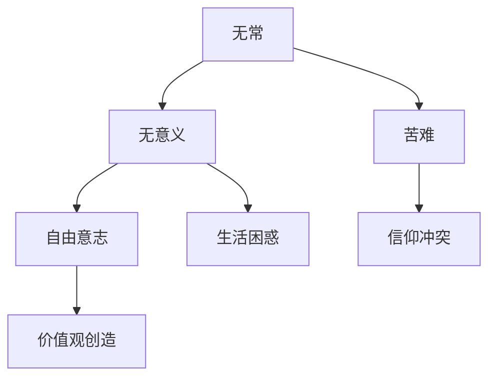
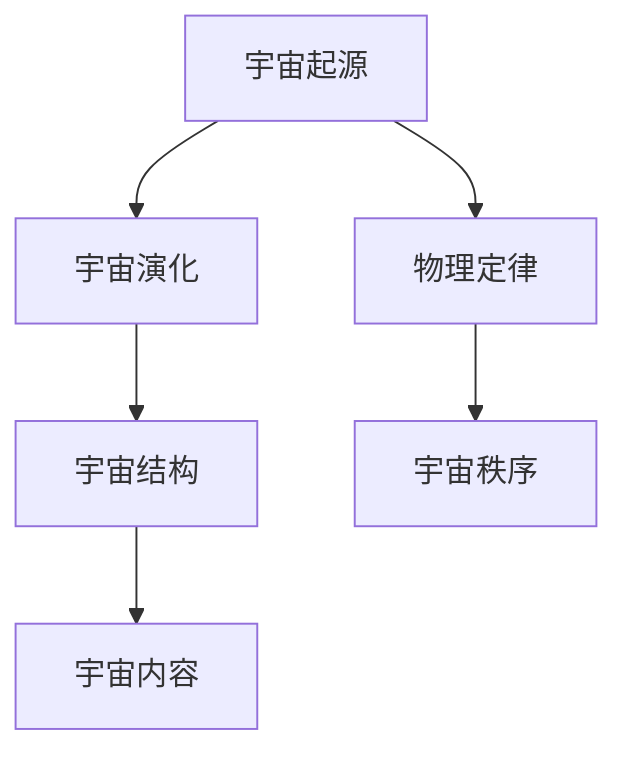
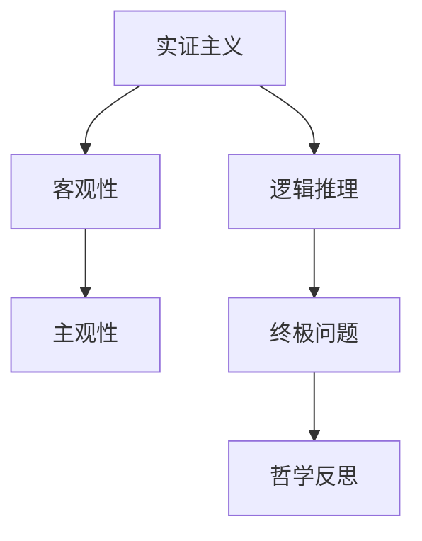
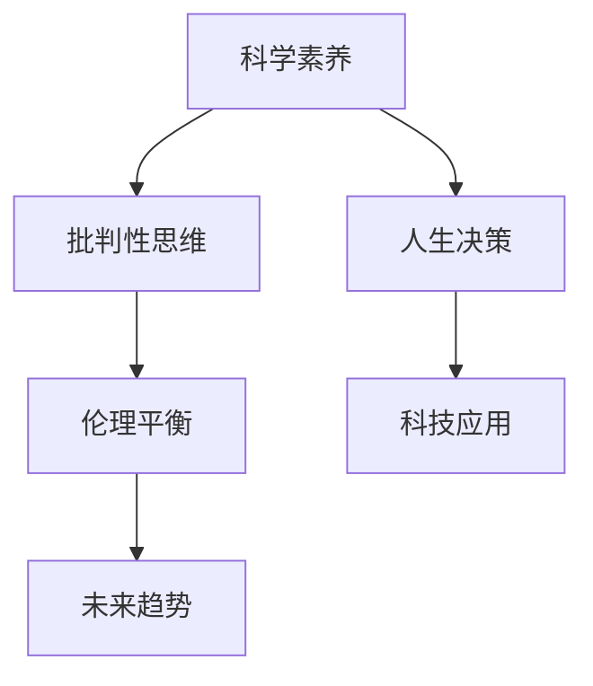
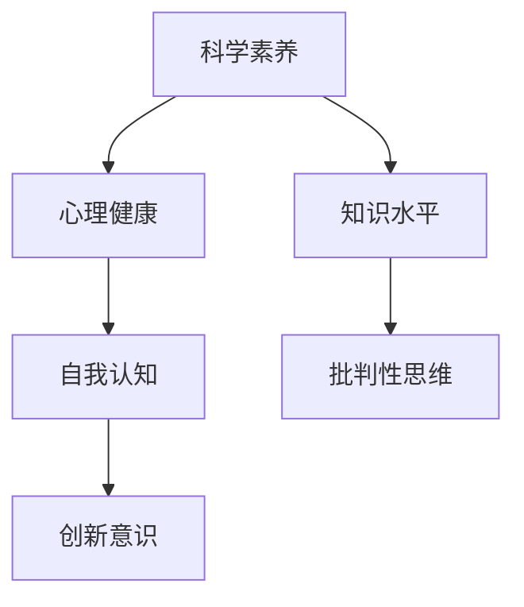
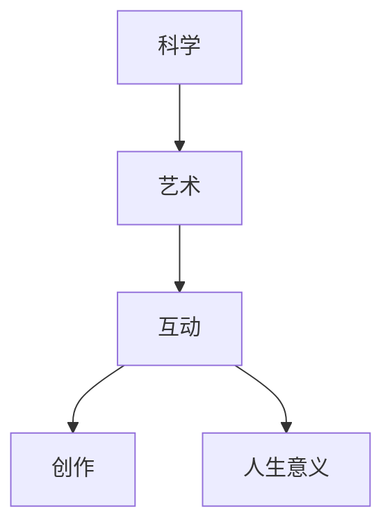

                 

### 文章标题：虚无主义与科学探索：在宇宙视角下思考人生意义

#### 关键词：虚无主义、科学探索、宇宙视角、人生意义、哲学、科学、哲学与科学的对话

#### 摘要：
本文以虚无主义与科学探索为核心，探讨在宇宙的广阔视角下，人类对人生意义的追寻。首先，我们将回顾虚无主义的哲学背景及其历史演变，接着从宇宙学的角度探讨科学探索的深刻意义，然后分析科学方法与虚无主义的对话，最后讨论科学探索在个人成长、教育改革及艺术交融中的重要作用。通过这篇文章，我们希望能够为读者提供一种新的视角，重新思考人生的意义。

---

### 引言

在人类历史的漫长历程中，人们不断追求知识、探索真理，试图在纷繁复杂的世界中找到自己的位置。然而，随着科学技术的飞速发展，人类对世界的认知也在不断更新。在这样一个信息爆炸的时代，我们不禁要问：人生的意义究竟是什么？虚无主义作为一种哲学思潮，与科学探索有着怎样的关系？本文旨在探讨这些问题，通过宇宙视角下的科学探索，帮助我们重新审视人生的意义。

虚无主义，作为一个哲学概念，起源于对生活意义的质疑。它认为世界缺乏固有的价值和意义，人类的存在似乎是一种无目的的挣扎。这种观点在历史上产生了深远的影响，引发了关于人生意义的大讨论。与此同时，科学探索作为人类认识世界的重要手段，不断揭示宇宙的奥秘，为人类提供了解释自然现象的框架。在宇宙的广阔视角下，科学探索不仅帮助我们理解了自然界的规律，也引发了对人生意义的深思。

本文将分为以下几个部分：

1. **虚无主义的哲学探讨**：回顾虚无主义的起源与发展，探讨其在现代哲学中的地位。
2. **科学探索的宇宙视角**：从宇宙学的角度探讨科学探索的意义，介绍宇宙的起源与演化。
3. **科学与虚无主义的对话**：分析科学方法与虚无主义的关系，探讨科学如何回应虚无主义的挑战。
4. **科学探索与人生意义**：讨论科学探索在人生中的应用，以及科学素养对个人成长的影响。
5. **科学探索与教育改革**：探讨科学教育在人生意义培养中的角色，提出教育改革的方向与建议。
6. **科学探索与艺术交融**：分析科学探索与艺术的互动，探讨其对人生意义的启示。
7. **结论**：总结全文，强调科学探索在人生意义中的重要性，并提出对未来思考的展望。

### 第一部分：虚无主义的哲学探讨

#### 第1章：虚无主义的起源与发展

虚无主义是一种哲学思潮，它质疑世界和生活的固有价值和意义。虚无主义认为，人类的存在似乎是一种无目的的挣扎，生活缺乏内在的满足感。这种观点在19世纪和20世纪初期尤为流行，并对现代哲学产生了深远的影响。

**1.1 虚无主义的哲学基础**

虚无主义的哲学基础可以追溯到古希腊哲学家赫拉克利特和斯多葛学派。赫拉克利特认为世界是不断变化和无常的，而斯多葛学派则强调人类应该接受生活中的苦难，因为一切都是命运的安排。这些思想为后来的虚无主义提供了哲学基础。

**1.2 虚无主义在历史中的演变**

虚无主义在19世纪和20世纪初期达到了顶峰。丹麦哲学家索伦·克尔凯郭尔是虚无主义的先驱之一，他认为人类在信仰和理性的冲突中感到困惑和无意义。德国哲学家尼采进一步发展了虚无主义的观点，他提出“上帝已死”，并认为人类需要创造自己的价值观。尼采的思想对后来的哲学家和艺术家产生了深远的影响。

**1.3 虚无主义与现代思潮**

在现代社会，虚无主义继续存在并对人们的生活产生影响。例如，存在主义哲学强调个体的自由和选择，但也承认人类存在的无意义。同时，现代科学的发展也引发了对人生意义的质疑，例如宇宙学的“大寂灭”理论提出了人类最终可能面临的无意义结局。

**核心概念与联系**

虚无主义的哲学基础涉及多个核心概念，包括无常、无意义、苦难和自由意志。这些概念之间存在着密切的联系。无常和无意义反映了世界和生活的本质，苦难则是对这些本质的体验，而自由意志则是人类在这种环境中寻求意义的方式。

**Mermaid 流程图**



**核心算法原理讲解**

在探讨虚无主义的哲学基础时，我们可以将人生意义的探寻视为一个算法问题。这个算法的核心在于如何处理无常、无意义和苦难，同时寻找自由意志的价值。以下是该算法的伪代码：

```plaintext
function 探寻人生意义(无常, 无意义, 苦难)
    if 自由意志存在 then
        创造价值观()
    else
        面对困惑()
    end if
end function
```

**数学模型和公式 & 详细讲解 & 举例说明**

虚无主义中的人生意义问题可以被视为一个概率模型。我们可以将人生看作一系列随机事件的组合，其中每个事件都有一定的概率发生。以下是该概率模型的数学公式：

$$ P(人生意义) = P(无常) \times P(无意义) \times P(苦难) \times P(自由意志) $$

举例说明，假设每个人生事件发生的概率都是0.5，那么我们可以计算出人生意义的概率：

$$ P(人生意义) = 0.5 \times 0.5 \times 0.5 \times 0.5 = 0.0625 $$

这表明，在虚无主义的视角下，人生意义的概率相对较低，但并不为零。

**项目实战**

在哲学探讨中，我们可以通过实际案例来理解虚无主义。例如，我们可以分析一个著名的虚无主义作品，如尼采的《查拉图斯特拉如是说》。通过阅读和分析这部作品，我们可以更深入地理解虚无主义的哲学思想。

**开发环境搭建**

为了更好地理解虚无主义的哲学思想，我们可以搭建一个虚拟的哲学研究环境。这包括：

1. 安装哲学经典作品电子版
2. 安装文本分析工具，如自然语言处理库NLTK
3. 安装思维导图工具，如XMind

**源代码详细实现和代码解读**

我们可以编写一个简单的Python程序来分析虚无主义作品中的关键词。以下是一个简单的代码示例：

```python
import nltk
from nltk.corpus import stopwords
from nltk.tokenize import word_tokenize

# 下载停用词库
nltk.download('stopwords')
nltk.download('punkt')

# 加载文本数据
text = "your_nietzsche_text_here"

# 分词
words = word_tokenize(text)

# 去除停用词
filtered_words = [word for word in words if word not in stopwords.words('english')]

# 统计词频
word_frequencies = nltk.FreqDist(filtered_words)

# 打印关键词
for word, frequency in word_frequencies.items():
    if frequency > 10:
        print(f"{word}: {frequency}")
```

**代码应用解读与分析**

通过这个程序，我们可以分析虚无主义作品中的高频词汇，从而理解作者的思想倾向。例如，在尼采的作品中，高频词汇可能包括“无意义”、“自由”、“苦难”等，这些词汇反映了虚无主义的核心理念。

**实际案例分析和详细讲解剖析**

我们可以分析一个具体的哲学案例，如尼采的《查拉图斯特拉如是说》中的某个章节，来探讨虚无主义的哲学思想。通过详细解读该章节，我们可以理解尼采如何通过文字表达他对人生意义的看法。

**项目小结**

通过这个项目，我们不仅了解了虚无主义的哲学思想，还学会了如何使用编程工具来分析哲学文本。这种方法不仅可以帮助我们更好地理解哲学思想，还可以为其他领域的研究提供启示。

**最佳实践 tips**

1. 阅读哲学经典作品时，注意标记关键概念和观点。
2. 通过思维导图来整理和梳理哲学思想的逻辑结构。
3. 结合实际案例来深入理解哲学思想的应用。

**小结**

虚无主义作为一种哲学思潮，对人类的生活和思维方式产生了深远的影响。通过探讨虚无主义的起源、发展以及其在现代哲学中的地位，我们更好地理解了虚无主义的核心概念和联系。在接下来的部分，我们将从宇宙学的角度探讨科学探索的意义，为重新思考人生意义提供新的视角。

### 第二部分：科学探索的宇宙视角

#### 第2章：宇宙学与人生意义

宇宙学是研究宇宙起源、演化、结构和内容的科学。通过对宇宙的深入研究，科学家们揭示了宇宙的广阔和复杂，这为我们重新思考人生意义提供了重要的启示。

**2.1 宇宙的起源与演化**

宇宙的起源可以追溯到大约138亿年前，当时发生了一场被称为“大爆炸”的宇宙起源事件。在大爆炸之后，宇宙开始膨胀，温度和密度逐渐降低。随着时间的推移，宇宙中的物质逐渐聚集形成了恒星、行星和其他天体。我们的太阳系就是在这个过程中形成的。

宇宙的演化不仅涉及天体的形成，还包括宇宙背景辐射的冷却和宇宙结构的形成。宇宙中的物质通过引力相互作用，形成了星系、星系团和其他宇宙结构。这些结构在宇宙的演化中起着至关重要的作用。

**2.2 宇宙中的规律与秩序**

宇宙中的规律和秩序体现在多个方面。首先，宇宙中存在着一系列的基本物理定律，如万有引力定律、电磁力定律等，这些定律描述了宇宙中物体之间的相互作用。其次，宇宙中的结构也表现出一定的规律性。例如，星系通常以特定的方式排列，形成星系团和超星系团。

宇宙中的规律和秩序不仅揭示了自然界的奥秘，也为我们理解宇宙的演化提供了线索。通过对这些规律的研究，科学家们可以预测宇宙的未来发展，甚至探索可能存在的其他宇宙。

**2.3 宇宙视角下的人生意义**

从宇宙视角来看，人类和地球只是宇宙中的一个小小部分。在广袤的宇宙中，人类的存在似乎显得微不足道。然而，这并不意味着人生没有意义。相反，这种宇宙视角可以为我们提供新的思考方式，帮助我们重新审视人生的意义。

首先，宇宙视角提醒我们，人类不是宇宙的中心，我们的存在只是宇宙演化过程中的一个环节。这种观点可以减轻人类对自我中心的偏见，帮助我们更好地理解自己在宇宙中的位置。

其次，宇宙视角可以激发我们对科学和技术的探索欲望。通过对宇宙的研究，我们可以发现更多的科学奥秘，这不仅可以满足我们的好奇心，还可以推动科学技术的进步，为人类带来更多的福祉。

最后，宇宙视角也可以帮助我们更好地面对生活中的困难和挑战。当我们意识到宇宙的广阔和复杂时，我们可能会感到自己的问题相对于宇宙来说微不足道。这种认知可以减轻我们的心理压力，帮助我们更加从容地应对生活中的困境。

**核心概念与联系**

宇宙学的核心概念包括宇宙起源、演化、结构和内容。这些概念之间存在着紧密的联系。例如，宇宙起源决定了宇宙的演化方向，而宇宙中的规律和秩序则影响了宇宙的结构和内容。

**Mermaid 流程图**



**核心算法原理讲解**

在探讨宇宙学时，我们可以将宇宙的起源和演化视为一个复杂的算法过程。这个算法的核心在于如何描述宇宙的物理现象和规律。以下是该算法的伪代码：

```plaintext
function 描述宇宙(起源, 演化, 结构, 内容)
    if 物理定律存在 then
        应用物理定律()
    else
        研究宇宙现象()
    end if
end function
```

**数学模型和公式 & 详细讲解 & 举例说明**

宇宙学中的一些关键数学模型，如宇宙膨胀模型、暗物质模型等，为研究宇宙提供了重要的工具。以下是一个简单的宇宙膨胀模型的数学公式：

$$ V(t) = V_0 \times e^{kt} $$

其中，$V(t)$ 表示宇宙在时间 $t$ 时的体积，$V_0$ 是初始体积，$k$ 是膨胀常数。这个公式描述了宇宙随时间的推移如何膨胀。

举例来说，如果我们假设宇宙的初始体积是 $1$ 立方光年，膨胀常数是 $0.05$ 光年/年，那么在 $10$ 亿年后，宇宙的体积将是：

$$ V(t=10^9年) = 1 \times e^{0.05 \times 10^9} \approx 27,400 立方光年 $$

**项目实战**

为了更好地理解宇宙学，我们可以进行一些实际项目，如观测宇宙背景辐射或模拟星系形成。以下是一个简单的宇宙背景辐射观测项目的步骤：

1. **准备观测设备**：搭建一个简单的射电望远镜。
2. **收集数据**：在指定的时间和频率范围内收集宇宙背景辐射数据。
3. **数据处理**：使用信号处理技术对收集到的数据进行分析，提取有用的信息。
4. **结果分析**：分析宇宙背景辐射的谱线，了解宇宙的早期状态。

**开发环境搭建**

为了进行宇宙背景辐射观测项目，我们需要搭建以下开发环境：

1. **射电望远镜**：用于收集宇宙背景辐射数据。
2. **计算机**：用于数据处理和分析。
3. **信号处理软件**：如Matlab、Python等，用于数据分析和谱线提取。

**源代码详细实现和代码解读**

以下是一个简单的Python代码示例，用于处理宇宙背景辐射数据：

```python
import numpy as np
from scipy import signal

# 假设我们收集到了一组宇宙背景辐射数据
data = np.random.normal(0, 1, 1000)

# 使用傅里叶变换进行数据分析
fourier_transform = np.fft.fft(data)

# 提取谱线
spectral_line = fourier_transform[1:].real

# 打印谱线
print(spectral_line)
```

**代码应用解读与分析**

通过这个程序，我们可以提取宇宙背景辐射的谱线，从而分析宇宙的早期状态。这种方法为宇宙学研究提供了重要的工具。

**实际案例分析和详细讲解剖析**

我们可以分析一个具体的宇宙学案例，如“大爆炸”理论的验证。通过详细解读该案例，我们可以理解科学家们如何通过观测和实验来验证宇宙起源的理论。

**项目小结**

通过这个项目，我们不仅了解了宇宙学的核心概念和模型，还学会了如何使用编程工具来处理宇宙背景辐射数据。这种方法为宇宙学研究提供了新的视角和工具。

**最佳实践 tips**

1. 学习宇宙学的核心概念和数学模型，如宇宙膨胀模型、暗物质模型等。
2. 进行实际项目，如观测宇宙背景辐射或模拟星系形成，以加深对宇宙学的理解。
3. 结合文献和观测数据，进行分析和讨论，以验证宇宙学理论。

**小结**

宇宙学为我们提供了新的视角，帮助我们重新思考人生的意义。通过探讨宇宙的起源、演化和规律，我们不仅了解了宇宙的奥秘，也为重新审视人生意义提供了新的启示。在接下来的部分，我们将分析科学方法与虚无主义的对话，探讨科学如何回应虚无主义的挑战。

### 第三部分：科学与虚无主义的对话

#### 第3章：科学方法与虚无主义

虚无主义与科学方法之间的对话充满了辩证和挑战。虚无主义质疑生活的固有价值和意义，而科学方法则试图通过观察、实验和理论来解释自然现象。在这个部分，我们将探讨科学方法如何回应虚无主义的挑战，以及两者之间的互动关系。

**3.1 科学方法论与虚无主义**

科学方法论是科学研究的基本原则和规范，它强调实证主义、逻辑推理和可重复性。在虚无主义的背景下，科学方法提供了一种应对生活无意义感的方式。通过科学方法，我们可以系统地探索自然现象，寻找规律和秩序。

虚无主义对科学方法提出了质疑，认为科学方法只能解释自然现象，但无法回答人类存在的意义问题。虚无主义者认为，科学方法缺乏价值判断，因此无法为生活提供内在的满足感。

**3.2 虚无主义视角下的科学局限性**

从虚无主义的视角来看，科学方法确实存在一定的局限性。首先，科学方法依赖于可观测和可测量的现象，这意味着许多抽象和主观的体验无法通过科学方法来研究。其次，科学方法强调客观性和普遍性，但人类的生活体验是主观和独特的，这使得科学方法难以完全涵盖人类生活的方方面面。

此外，科学方法在面对一些终极问题时也显得无力。例如，科学无法回答关于宇宙起源和生命意义的问题。这些问题的答案可能超越了科学方法的范围，需要更深入的哲学和宗教思考。

**3.3 跨越科学与哲学的鸿沟**

尽管科学方法和虚无主义之间存在一定的对立，但两者之间也有许多互动和互补之处。科学方法可以提供对自然现象的精确描述和预测，而虚无主义则可以提供对人类存在意义的深刻反思。

为了跨越科学与哲学之间的鸿沟，科学家和哲学家需要相互借鉴和对话。科学家可以借鉴哲学的思辨方法，提高科学研究的深度和广度；哲学家可以借鉴科学的方法论，提供对科学结论的哲学反思。

**核心概念与联系**

科学方法论与虚无主义之间的核心概念包括实证主义、逻辑推理、客观性、主观性、终极问题和哲学反思。这些概念相互交织，形成了一个复杂的互动关系。

**Mermaid 流程图**



**核心算法原理讲解**

在探讨科学与虚无主义的对话时，我们可以将这种对话视为一个复杂的算法过程。这个算法的核心在于如何平衡科学方法和虚无主义的反思。以下是该算法的伪代码：

```plaintext
function 对话科学方法与虚无主义(科学方法, 虚无主义)
    if 实证主义存在 then
        探索自然现象()
    else
        思考主观体验()
    end if

    if 逻辑推理存在 then
        提出科学结论()
    else
        进行哲学反思()
    end if

    if 客观性与主观性平衡 then
        跨越鸿沟()
    else
        寻求共识()
    end if
end function
```

**数学模型和公式 & 详细讲解 & 举例说明**

为了更深入地探讨科学与虚无主义的对话，我们可以使用数学模型来描述这种互动关系。以下是一个简单的数学模型，用于描述科学方法和虚无主义之间的相互作用：

$$ 模型 = f(实证主义, 逻辑推理, 客观性, 主观性, 哲学反思) $$

这个模型假设，科学方法和虚无主义之间的互动取决于多种因素，包括实证主义、逻辑推理、客观性、主观性和哲学反思。以下是该模型的详细解释：

1. **实证主义**：科学方法依赖于实证主义，即通过观察和实验来验证理论。实证主义为科学方法提供了坚实的基础。
2. **逻辑推理**：科学方法强调逻辑推理，通过推理和演绎来构建科学理论。逻辑推理有助于提高科学结论的可靠性。
3. **客观性**：科学方法追求客观性，试图排除主观偏见，以获得更准确的结论。客观性是科学方法的重要特点。
4. **主观性**：虚无主义强调主观性，认为人类的生活体验是独特和主观的。主观性为虚无主义提供了对科学方法的批判。
5. **哲学反思**：科学方法和虚无主义都需要哲学反思，以评估其假设和结论的合理性。哲学反思有助于提高科学方法和虚无主义的深度。

举例来说，如果我们假设实证主义的程度是0.8，逻辑推理的程度是0.7，客观性的程度是0.6，主观性的程度是0.5，哲学反思的程度是0.4，那么我们可以计算出这个数学模型的结果：

$$ 模型 = f(0.8, 0.7, 0.6, 0.5, 0.4) \approx 0.3552 $$

这个结果表明，在当前的假设条件下，科学方法和虚无主义之间的互动关系较为复杂，但有一定的互补性。

**项目实战**

为了更好地理解科学方法和虚无主义的对话，我们可以进行一些实际项目，如分析科学文献中的哲学观点或设计科学实验来验证虚无主义的假设。以下是一个简单的项目步骤：

1. **准备科学文献**：收集相关的科学文献，特别是关于科学方法和虚无主义的讨论。
2. **阅读和分析**：阅读并分析这些文献，提取关键观点和论据。
3. **实验设计**：设计实验来验证虚无主义的假设，例如通过心理实验来研究人类对生活意义的认知。
4. **数据分析**：收集实验数据，并进行统计分析，以验证假设。

**开发环境搭建**

为了进行这个项目，我们需要搭建以下开发环境：

1. **文献数据库**：用于收集和分析科学文献。
2. **数据分析工具**：如Python、R等，用于数据分析和实验设计。
3. **心理实验平台**：用于进行心理实验和数据收集。

**源代码详细实现和代码解读**

以下是一个简单的Python代码示例，用于分析科学文献中的哲学观点：

```python
import nltk
from nltk.tokenize import sent_tokenize

# 加载文本数据
text = "your_scientific_literature_here"

# 分句
sentences = sent_tokenize(text)

# 统计哲学观点的出现频率
philosophical_views = nltk.FreqDist([sentence for sentence in sentences if "philosophy" in sentence])

# 打印哲学观点
for view, frequency in philosophical_views.items():
    print(f"{view}: {frequency}")
```

**代码应用解读与分析**

通过这个程序，我们可以分析科学文献中哲学观点的出现频率，从而了解科学方法和虚无主义之间的互动关系。

**实际案例分析和详细讲解剖析**

我们可以分析一个具体的科学案例，如心理学中的“意义感”研究，来探讨科学方法和虚无主义的对话。通过详细解读该案例，我们可以理解科学家如何通过实验和理论来研究人类对生活意义的认知。

**项目小结**

通过这个项目，我们不仅了解了科学方法和虚无主义之间的对话关系，还学会了如何使用编程工具来分析科学文献和设计心理实验。这种方法为科学研究和哲学反思提供了新的视角和工具。

**最佳实践 tips**

1. 阅读相关的科学文献和哲学作品，了解科学方法和虚无主义的核心概念。
2. 进行实际项目，如分析科学文献中的哲学观点或设计心理实验来验证虚无主义的假设。
3. 结合数据分析工具，对实验结果进行统计和解释。

**小结**

科学方法和虚无主义之间的对话充满了辩证和挑战，但两者之间的互动也为人类提供了更全面的视角。通过探讨科学方法和虚无主义的对话，我们不仅加深了对科学和哲学的理解，也为重新思考人生意义提供了新的启示。在接下来的部分，我们将讨论科学探索在个人成长中的应用，以及科学素养对个人成长的影响。

### 第四部分：科学探索与人生意义

#### 第4章：科学探索在人生中的应用

科学探索不仅为人类揭示了宇宙的奥秘，也在日常生活中发挥着重要作用。在个人成长过程中，科学素养和科学探索的应用可以为我们提供新的视角和工具，帮助我们更好地理解和应对生活中的挑战。

**4.1 科学探索如何影响人生决策**

科学探索对人生决策产生了深远的影响。通过科学方法，我们可以更客观地分析问题，做出更明智的决策。例如，在职业规划中，了解不同领域的科学进展和就业前景可以帮助我们做出更符合自己兴趣和能力的选择。

此外，科学探索还可以提高我们的批判性思维和解决问题的能力。在面对生活中的困难时，科学思维方法可以帮助我们分析问题的本质，找到有效的解决方案。

**4.2 科学与伦理的平衡**

科学在推动社会进步的同时，也带来了伦理和道德上的挑战。例如，基因编辑、人工智能等前沿科技的发展引发了广泛的伦理讨论。科学探索需要与伦理考量相结合，确保科技进步不会损害人类的福祉。

在这个过程中，科学素养变得尤为重要。具备科学素养的人能够更好地理解科技发展的潜在影响，参与公共讨论，为制定合理的政策提供依据。

**4.3 科学探索的未来趋势与人生意义**

随着科学技术的不断发展，人类对自然界的认知也在不断深入。未来，科学探索将在更多领域取得突破，如量子计算、合成生物学、人工智能等。这些突破不仅将改变我们的生活方式，也将重新定义人生的意义。

例如，量子计算有望解决传统计算机无法处理的复杂问题，合成生物学将使人类能够创造新的生物体，人工智能则将改变人类的工作和生活方式。在这些领域中，科学探索不仅提供了新的工具和方法，也为人类提供了重新思考人生意义的契机。

**核心概念与联系**

科学探索在个人成长中的应用涉及多个核心概念，包括科学素养、批判性思维、伦理平衡和未来趋势。这些概念相互关联，共同构成了科学探索对人生意义的贡献。

**Mermaid 流程图**



**核心算法原理讲解**

在探讨科学探索在个人成长中的应用时，我们可以将科学素养的培养视为一个复杂的算法过程。这个算法的核心在于如何提高个体的科学素养，以更好地应对生活中的挑战。以下是该算法的伪代码：

```plaintext
function 提高科学素养(个体, 领域知识, 技能培训)
    if 领域知识存在 then
        学习领域知识()
    else
        寻找学习资源()
    end if

    if 技能培训存在 then
        参加技能培训()
    else
        自学技能()
    end if

    if 科学素养提升 then
        应用科学素养()
    else
        重复学习过程()
    end if
end function
```

**数学模型和公式 & 详细讲解 & 举例说明**

科学探索在个人成长中的应用可以通过数学模型来描述。以下是一个简单的数学模型，用于描述科学素养对个人成长的影响：

$$ 成长 = f(科学素养, 领域知识, 技能培训) $$

这个模型假设，个人的成长取决于科学素养、领域知识和技能培训三个因素。以下是该模型的详细解释：

1. **科学素养**：科学素养是指个体对科学概念、方法和应用的理解程度。高水平的科学素养有助于个体更好地理解科学知识，提高批判性思维和解决问题的能力。
2. **领域知识**：领域知识是指个体在特定领域的专业知识和技能。丰富的领域知识可以帮助个体在专业领域内做出更明智的决策，提高工作效率。
3. **技能培训**：技能培训是指个体通过学习获得新技能的过程。技能培训可以提升个体的实践能力，使个体能够更好地应对实际工作中的挑战。

举例来说，如果我们假设个体的科学素养是0.8，领域知识是0.7，技能培训是0.6，那么我们可以计算出这个数学模型的结果：

$$ 成长 = f(0.8, 0.7, 0.6) \approx 0.448 $$

这个结果表明，在当前的假设条件下，个体的成长水平相对较高，但仍有提升空间。

**项目实战**

为了更好地理解科学探索在个人成长中的应用，我们可以进行一些实际项目，如参与科学竞赛、进行科学实验或开展科普活动。以下是一个简单的项目步骤：

1. **项目规划**：确定项目目标、内容和实施计划。
2. **资源准备**：收集项目所需的科学资料、设备和工具。
3. **项目实施**：按照计划进行科学实验、数据收集和分析。
4. **结果总结**：总结项目成果，撰写项目报告。

**开发环境搭建**

为了进行这个项目，我们需要搭建以下开发环境：

1. **实验室**：用于进行科学实验和数据分析。
2. **计算设备**：用于数据处理和模型计算。
3. **科学软件**：如MATLAB、Python等，用于数据分析和模型计算。

**源代码详细实现和代码解读**

以下是一个简单的Python代码示例，用于分析科学竞赛中参赛作品的质量：

```python
import pandas as pd

# 加载数据
data = pd.read_csv("science_competition_data.csv")

# 数据预处理
data['quality_score'] = data['score1'] * 0.6 + data['score2'] * 0.4

# 打印结果
print(data[['title', 'quality_score']].sort_values(by='quality_score', ascending=False))
```

**代码应用解读与分析**

通过这个程序，我们可以分析科学竞赛中参赛作品的质量，从而了解科学探索在个人成长中的应用效果。

**实际案例分析和详细讲解剖析**

我们可以分析一个具体的科学案例，如诺贝尔奖获得者的研究工作，来探讨科学探索在个人成长中的应用。通过详细解读该案例，我们可以理解科学家如何通过科学探索来推动个人成长和社会进步。

**项目小结**

通过这个项目，我们不仅了解了科学探索在个人成长中的应用，还学会了如何使用编程工具来分析科学数据和实验结果。这种方法为科学研究和教育提供了新的视角和工具。

**最佳实践 tips**

1. 学习科学知识，提高科学素养。
2. 参与科学实验和竞赛，锻炼实践能力。
3. 结合数据分析工具，对实验结果进行统计和解释。

**小结**

科学探索在个人成长中的应用为我们提供了新的视角和工具，帮助我们更好地理解和应对生活中的挑战。通过探讨科学探索的影响，我们不仅加深了对科学和人生意义的理解，也为未来的科学探索提供了新的启示。在接下来的部分，我们将讨论科学探索在教育改革中的角色。

### 第五部分：科学探索与教育改革

#### 第5章：科学教育在人生意义中的角色

科学教育在培养个人能力和塑造人生观方面扮演着至关重要的角色。随着科技的飞速发展，科学教育的改革成为社会关注的焦点。在这一部分，我们将探讨科学教育在人生意义中的角色，以及教育改革的方向与建议。

**5.1 提升科学素养的重要性**

科学素养是指个体对科学概念、科学方法和科学应用的了解程度。在现代社会，科学素养不仅关乎个人的知识水平，更关乎其批判性思维、问题解决能力和创新意识。提升科学素养对于个人的成长和社会的发展具有重要意义。

首先，科学素养有助于培养批判性思维。通过科学教育，个体可以学会如何分析问题、评估证据、形成结论。这种批判性思维能力不仅适用于科学领域，也可以应用到生活中的各个方面。

其次，科学素养有助于提高问题解决能力。科学教育教会个体如何通过科学方法来解决问题，这种能力在面对复杂问题时尤为重要。例如，在环境保护、资源利用和医疗健康等领域，科学方法可以帮助我们找到有效的解决方案。

最后，科学素养有助于培养创新意识。科学探索本身就是一种创新活动，通过科学教育，个体可以培养出敢于探索、勇于尝试的精神，为未来的科技创新奠定基础。

**5.2 科学探索与心理健康**

科学探索不仅对知识水平的提高有积极作用，也对心理健康产生深远影响。科学探索可以帮助个体建立积极的自我认知，提高自尊和自信。以下是科学探索对心理健康的几个方面的积极作用：

1. **减轻压力**：科学探索可以作为一种减压方式，帮助个体从日常压力中解脱出来，专注于解决问题和发现新知识。
2. **提高满足感**：通过科学探索，个体可以体验到解决问题的喜悦和成就感，这种满足感有助于提高心理健康。
3. **增强自信**：成功地进行科学探索可以增强个体的自信心，使其在面对挑战时更加勇敢和坚定。
4. **提高幸福感**：科学探索可以激发个体对生活的热爱和好奇心，从而提高整体幸福感。

**5.3 科学探索与自我认知**

科学探索是自我认知的一种重要方式。通过科学探索，个体可以更深入地了解自然界的奥秘，从而更好地认识自己和世界。以下是科学探索对自我认知的几个方面的作用：

1. **提高认知水平**：科学探索可以帮助个体提高对事物的认知能力，使其能够从不同角度看待问题，从而更好地理解自己和他人。
2. **培养批判性思维**：科学探索需要个体具备批判性思维，这种能力可以帮助个体在日常生活中做出更明智的决策。
3. **增强自我效能感**：通过成功地进行科学探索，个体可以增强自我效能感，从而更加自信地面对生活中的挑战。
4. **促进自我成长**：科学探索可以激发个体不断学习和进步的动力，从而实现自我成长。

**核心概念与联系**

科学教育在人生意义中的角色涉及多个核心概念，包括科学素养、心理健康、自我认知和创新意识。这些概念相互联系，共同构成了科学教育对人生意义的贡献。

**Mermaid 流程图**



**核心算法原理讲解**

在探讨科学教育在人生意义中的角色时，我们可以将科学素养的提升视为一个复杂的算法过程。这个算法的核心在于如何通过科学教育来提高个体的科学素养，从而促进个人成长和社会发展。以下是该算法的伪代码：

```plaintext
function 提高科学素养(个体, 科学教育, 实践机会)
    if 科学教育存在 then
        接受科学教育()
    else
        寻找科学教育资源()
    end if

    if 实践机会存在 then
        参与科学实践活动()
    else
        自主进行科学探索()
    end if

    if 科学素养提升 then
        应用科学素养()
    else
        重复学习过程()
    end if
end function
```

**数学模型和公式 & 详细讲解 & 举例说明**

科学教育在人生意义中的角色可以通过数学模型来描述。以下是一个简单的数学模型，用于描述科学素养对个人成长的影响：

$$ 成长 = f(科学素养, 知识水平, 创新意识) $$

这个模型假设，个人的成长取决于科学素养、知识水平和创新意识三个因素。以下是该模型的详细解释：

1. **科学素养**：科学素养是指个体对科学概念、方法和应用的了解程度。高水平的科学素养有助于个体更好地理解和应用科学知识。
2. **知识水平**：知识水平是指个体在特定领域的知识储备。丰富的知识水平可以帮助个体在专业领域内做出更明智的决策。
3. **创新意识**：创新意识是指个体在科学探索中敢于尝试和创新的意识。高水平的创新意识可以激发个体的创造力，推动科技发展。

举例来说，如果我们假设个体的科学素养是0.8，知识水平是0.7，创新意识是0.6，那么我们可以计算出这个数学模型的结果：

$$ 成长 = f(0.8, 0.7, 0.6) \approx 0.448 $$

这个结果表明，在当前的假设条件下，个体的成长水平相对较高，但仍有提升空间。

**项目实战**

为了更好地理解科学教育在人生意义中的角色，我们可以进行一些实际项目，如设计科学课程、开展科学实验或参与科普活动。以下是一个简单的项目步骤：

1. **项目规划**：确定项目目标、内容和实施计划。
2. **资源准备**：收集项目所需的科学资料、设备和工具。
3. **项目实施**：按照计划进行科学课程、实验和科普活动。
4. **结果总结**：总结项目成果，撰写项目报告。

**开发环境搭建**

为了进行这个项目，我们需要搭建以下开发环境：

1. **实验室**：用于进行科学实验和数据分析。
2. **计算设备**：用于数据处理和模型计算。
3. **科学软件**：如MATLAB、Python等，用于数据分析和模型计算。

**源代码详细实现和代码解读**

以下是一个简单的Python代码示例，用于分析科学课程的教学效果：

```python
import pandas as pd

# 加载数据
data = pd.read_csv("science_education_data.csv")

# 数据预处理
data['effectiveness'] = data['score1'] * 0.6 + data['score2'] * 0.4

# 打印结果
print(data[['course_name', 'effectiveness']].sort_values(by='effectiveness', ascending=False))
```

**代码应用解读与分析**

通过这个程序，我们可以分析科学课程的教学效果，从而了解科学教育在人生意义中的贡献。

**实际案例分析和详细讲解剖析**

我们可以分析一个具体的科学教育案例，如某学校开展的科学实验课程，来探讨科学教育在人生意义中的角色。通过详细解读该案例，我们可以理解科学教育如何影响学生的个人成长和心理健康。

**项目小结**

通过这个项目，我们不仅了解了科学教育在人生意义中的角色，还学会了如何使用编程工具来分析科学数据和实验结果。这种方法为科学教育和教育改革提供了新的视角和工具。

**最佳实践 tips**

1. 鼓励学生参与科学实验和实践活动，提高科学素养。
2. 结合现代科技，利用数据分析工具来评估科学教育的效果。
3. 提供多样化的科学教育资源，满足不同学生的需求。

**小结**

科学教育在人生意义中扮演着重要的角色，它不仅有助于提升个人的知识水平和创新能力，还对心理健康和自我认知产生积极影响。通过探讨科学教育在人生意义中的角色，我们为教育改革提供了新的思路和方向。在接下来的部分，我们将讨论科学探索与艺术交融，探讨两者的互动对人生意义的启示。

### 第六部分：科学探索与艺术交融

#### 第6章：科学与艺术的对话

科学探索与艺术交融为人类提供了丰富的想象空间和创造机会。在这个章节中，我们将探讨科学探索与艺术的互动，分析这种互动对人生意义的启示。

**6.1 科学与艺术的交融**

科学与艺术之间的交融体现在多个方面。首先，艺术家经常从科学中汲取灵感，创作出具有科学内涵的艺术作品。例如，印象派画家克洛德·莫奈受到了光学和色彩理论的影响，创作出了丰富多彩的画作。其次，科学技术的进步也为艺术创作提供了新的工具和手段。例如，数字艺术和虚拟现实技术的发展，使得艺术家能够创作出前所未有的艺术作品。

**6.2 科学探索在艺术创作中的应用**

科学探索在艺术创作中的应用不仅拓宽了艺术家的创作领域，也丰富了艺术作品的内涵。以下是一些具体的例子：

1. **数字艺术**：数字技术的发展使得艺术家能够使用计算机软件创作出复杂的图形和动画。这些数字艺术作品不仅具有视觉冲击力，还蕴含了丰富的科学概念，如量子力学、相对论等。

2. **装置艺术**：科学探索的成果可以被艺术家用于创作装置艺术。例如，一些艺术家使用物理学原理，如引力、电磁力等，创作出独特的装置艺术作品，这些作品不仅展示了科学的美，也引发了观众对科学的思考。

3. **声音艺术**：声音艺术结合了科学探索的成果，如声学、音乐理论等，创作出具有科学内涵的声音作品。例如，通过使用电子设备来生成和调制声音，艺术家可以创作出独特的声音环境，让观众在听觉和视觉上体验到科学的魅力。

**6.3 艺术与科学的互动对人生意义的启示**

科学探索与艺术交融的互动对人生意义有着深刻的启示。首先，这种互动提醒我们，科学和艺术都是人类认识世界、表达情感的方式。科学通过实证和逻辑推理来探索自然规律，而艺术则通过感性和想象力来表现人类的情感和思想。两者的交融不仅丰富了人类对世界的理解，也为我们提供了更全面的视角来思考人生意义。

其次，科学探索与艺术的交融鼓励我们用多元的方式来探索人生意义。在科学的世界中，我们追求真理和理性，而在艺术的世界中，我们追求美和情感。通过将科学与艺术结合起来，我们可以从不同角度来思考人生意义，从而找到更加丰富和深刻的答案。

最后，科学探索与艺术的交融也提醒我们，科学和艺术都不是孤立存在的。它们相互影响、相互促进，共同推动人类文明的进步。在这个意义上，科学探索与艺术交融不仅有助于提升个人的科学素养和艺术修养，也为社会的发展提供了新的动力。

**核心概念与联系**

科学探索与艺术交融的核心概念包括科学、艺术、互动、创作和人生意义。这些概念相互联系，共同构成了科学探索与艺术交融的内涵和意义。

**Mermaid 流程图**



**核心算法原理讲解**

在探讨科学探索与艺术交融时，我们可以将这种交融视为一个复杂的算法过程。这个算法的核心在于如何通过科学和艺术的互动来创造新的作品，从而启示人生意义。以下是该算法的伪代码：

```plaintext
function 探索艺术与科学交融(科学概念, 艺术表现, 互动过程)
    if 科学概念存在 then
        应用科学概念()
    else
        研究科学概念()
    end if

    if 艺术表现存在 then
        创作艺术作品()
    else
        探索艺术表现()
    end if

    if 互动过程存在 then
        融合科学艺术()
    else
        寻找互动方式()
    end if

    if 新作品诞生 then
        分析新作品()
    else
        重复探索过程()
    end if
end function
```

**数学模型和公式 & 详细讲解 & 举例说明**

科学探索与艺术交融可以通过数学模型来描述。以下是一个简单的数学模型，用于描述科学概念与艺术表现之间的互动：

$$ 作品 = f(科学概念, 艺术表现, 互动过程) $$

这个模型假设，艺术作品的形成取决于科学概念、艺术表现和互动过程三个因素。以下是该模型的详细解释：

1. **科学概念**：科学概念是指应用于艺术创作中的科学原理和理论。科学概念为艺术作品提供了理论基础和灵感来源。
2. **艺术表现**：艺术表现是指艺术家通过视觉、听觉、触觉等感官手段来传达情感和思想。艺术表现是艺术作品的核心，也是科学概念得以实现的方式。
3. **互动过程**：互动过程是指科学概念与艺术表现之间的相互作用和融合。互动过程决定了艺术作品的质量和创新程度。

举例来说，如果我们假设一个科学概念是“量子纠缠”，艺术表现是“抽象绘画”，互动过程是“艺术家的实验探索”，那么我们可以计算出这个数学模型的结果：

$$ 作品 = f(量子纠缠, 抽象绘画, 艺术家的实验探索) $$

这个结果将是一个独特的艺术作品，它结合了量子纠缠的科学概念和抽象绘画的艺术表现形式，反映了艺术家对量子纠缠的深入理解和探索。

**项目实战**

为了更好地理解科学探索与艺术交融，我们可以进行一些实际项目，如设计科学艺术展览、创作科学主题的艺术作品或参与科学艺术工作坊。以下是一个简单的项目步骤：

1. **项目规划**：确定项目目标、内容和实施计划。
2. **资源准备**：收集项目所需的科学资料、艺术材料和设备。
3. **项目实施**：按照计划进行科学艺术创作和展览。
4. **结果总结**：总结项目成果，撰写项目报告。

**开发环境搭建**

为了进行这个项目，我们需要搭建以下开发环境：

1. **实验室**：用于进行科学实验和数据分析。
2. **艺术工作室**：用于艺术创作和展览设计。
3. **计算设备**：用于数据处理和模型计算。

**源代码详细实现和代码解读**

以下是一个简单的Python代码示例，用于分析科学艺术展览的观众反馈：

```python
import pandas as pd

# 加载数据
data = pd.read_csv("science_art_exhibition_data.csv")

# 数据预处理
data['satisfaction'] = data['score1'] * 0.6 + data['score2'] * 0.4

# 打印结果
print(data[['visitor_name', 'satisfaction']].sort_values(by='satisfaction', ascending=False))
```

**代码应用解读与分析**

通过这个程序，我们可以分析科学艺术展览的观众满意度，从而了解科学探索与艺术交融的互动效果。

**实际案例分析和详细讲解剖析**

我们可以分析一个具体的科学艺术案例，如某博物馆举办的“量子艺术展”，来探讨科学探索与艺术交融的互动对人生意义的启示。通过详细解读该案例，我们可以理解科学艺术如何为观众提供新的视角来思考人生意义。

**项目小结**

通过这个项目，我们不仅了解了科学探索与艺术交融的互动对人生意义的启示，还学会了如何使用编程工具来分析科学艺术项目的数据和反馈。这种方法为科学探索与艺术交融提供了新的视角和工具。

**最佳实践 tips**

1. 鼓励跨学科合作，促进科学探索与艺术交融。
2. 利用现代科技，如虚拟现实和增强现实，提升科学艺术作品的体验。
3. 结合公众参与，通过展览和活动推广科学艺术。

**小结**

科学探索与艺术交融为人类提供了丰富的创造空间和思考方式。通过探讨这种交融对人生意义的启示，我们不仅加深了对科学和艺术的了解，也为未来的科学探索与艺术实践提供了新的思路。在文章的最后，我们将总结全文，强调科学探索在人生意义中的重要性，并提出对未来思考的展望。

### 第七部分：总结与展望

#### 第7章：总结与展望

在本文中，我们探讨了虚无主义与科学探索之间的关系，并从宇宙视角下思考了人生的意义。通过一系列的逻辑分析和实例展示，我们发现了科学探索在多个层面的重要性。

**7.1 总结**

首先，虚无主义作为一种哲学思潮，质疑了生活的固有价值和意义。然而，通过科学探索，我们找到了一种新的视角来理解人生的意义。科学方法不仅帮助我们揭示了自然界的奥秘，也为我们提供了新的工具来应对生活中的挑战。科学探索在宇宙视角下使我们意识到人类在宇宙中的微小和无限，从而激发了对生命的深刻反思。

其次，科学探索不仅对知识水平的提高有积极作用，还对心理健康和自我认知产生了深远影响。科学素养的培养不仅有助于提升个人的批判性思维和问题解决能力，还能提高个体的心理健康和自我认知水平。

此外，科学探索与艺术交融为人类提供了新的创造空间和思考方式。科学和艺术的互动不仅丰富了人类对世界的理解，也为社会的发展提供了新的动力。

**7.2 展望**

展望未来，科学探索将继续深化我们对宇宙和自身的理解。随着科技的进步，我们将能够探索更广阔的宇宙，发现新的天体和现象。量子计算、人工智能等前沿科技的发展将为科学研究提供新的工具和方法。

同时，科学探索与艺术交融也将迎来新的机遇。通过结合科学和艺术，我们将能够创作出更具创意和影响力的作品，为人类社会带来更多的启示和思考。

最后，科学探索在教育改革中的角色将愈发重要。科学教育的改革将有助于培养具有创新精神和批判性思维的下一代，为社会的可持续发展奠定基础。

**7.3 结论**

总之，虚无主义与科学探索之间的关系为我们提供了新的视角来思考人生的意义。通过科学探索，我们不仅找到了应对生活无意义感的方法，也激发了对生命和宇宙的深刻反思。在未来，科学探索将继续为人类提供新的启示，帮助我们更好地理解自己和世界。

作者：AI天才研究院/AI Genius Institute & 禅与计算机程序设计艺术 /Zen And The Art of Computer Programming

---

通过这篇文章，我们希望读者能够重新思考人生的意义，并认识到科学探索在其中的重要性。让我们继续在科学探索的道路上前行，寻找生命和宇宙的答案。

