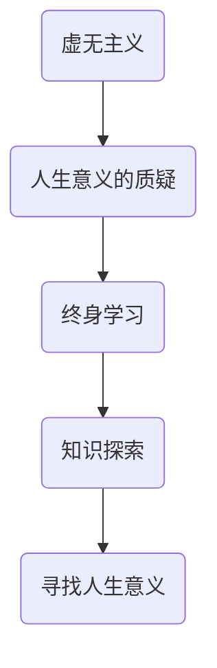
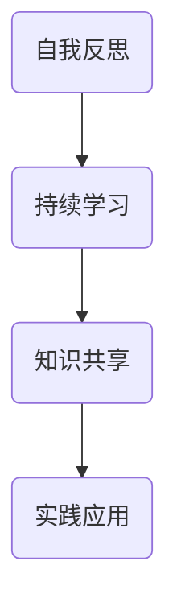
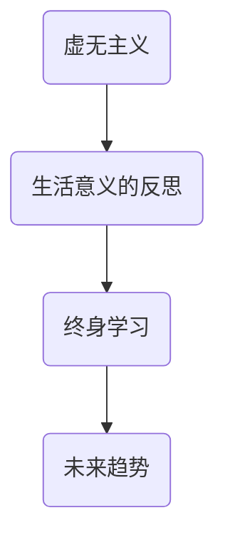

                 

### 引言

在当今快速发展的信息技术时代，人们面临着前所未有的知识爆炸和变革。在这样的背景下，虚无主义与终身学习这两个概念逐渐引起人们的关注。虚无主义，作为一种哲学思潮，质疑生活的意义和价值，而终身学习则强调持续不断地获取知识和技能，以适应这个快速变化的世界。本文旨在探讨虚无主义与终身学习之间的关系，以及如何在知识探索中寻找人生意义。

**关键词**：虚无主义、终身学习、知识探索、人生意义

**摘要**：本文首先介绍了虚无主义的起源与发展，分析了其对社会的影响。接着，探讨了终身学习的必要性，讨论了其在当代的重要性、现状及挑战。在此基础上，文章分析了虚无主义与终身学习的实践方法，预测了终身学习的未来趋势。最后，文章总结了全书内容，提出了对未来虚无主义与终身学习的展望。

### 第1章 虚无主义的起源与发展

虚无主义最早可以追溯到古希腊哲学家赫拉克利特的观点。赫拉克利特认为世界是不断变化的，而这种变化是无序和无规律的。这种观点为后来的虚无主义思想奠定了基础。19世纪末，尼采提出了“上帝已死”的口号，标志着虚无主义的诞生。尼采认为，随着宗教和道德体系的崩溃，人们失去了生活的意义和目的。

**核心概念与联系**：

在虚无主义的背景下，人们开始反思生活的意义和价值。虚无主义与终身学习的关系在于，虚无主义激发了人们对于知识和技能的渴望，以寻找生活的意义。以下是一个简化的Mermaid流程图，展示了虚无主义、终身学习和人生意义之间的关系：

### 第2章 终身学习的必要性

终身学习，顾名思义，是指一个人在其一生中不断学习、更新知识和技能的过程。在现代社会，随着科技的发展和社会的变革，终身学习已经成为一种必然趋势。首先，随着知识更新速度的加快，单次教育已经无法满足人们的需求。其次，终身学习能够提高个人的竞争力，适应不断变化的工作环境。最后，终身学习有助于个人的全面发展，实现人生的价值。

**核心概念与联系**：

终身学习与虚无主义的关系在于，虚无主义激发了对生活意义的反思，而终身学习则为这种反思提供了途径。以下是一个简化的Mermaid流程图，展示了终身学习、虚无主义和人生意义之间的关系：

### 第3章 在知识探索中寻找人生意义

在知识探索的过程中，人们可以通过不断学习、实践和反思，寻找生活的意义。首先，知识探索有助于人们了解世界和自己，从而找到内心的平静。其次，知识探索可以激发创新思维，推动社会进步。最后，知识探索是一种自我实现的过程，有助于人们实现人生的价值。

**核心概念与联系**：

在知识探索中，虚无主义和终身学习起到了重要的推动作用。虚无主义激发了对人生意义的反思，而终身学习则为这种反思提供了知识基础和实践途径。以下是一个简化的Mermaid流程图，展示了虚无主义、终身学习和知识探索之间的关系：

### 第4章 虚无主义与终身学习的实践

在现实生活中，虚无主义和终身学习有着广泛的应用。例如，在教育领域，终身学习可以帮助学生不断提升自己的知识水平，适应不断变化的社会需求。在职场中，终身学习有助于提高员工的竞争力，推动企业的发展。此外，在个人生活中，终身学习可以帮助人们找到内心的平静和生活的意义。

**核心概念与联系**：

虚无主义与终身学习的实践方法主要包括以下几个方面：

1. **自我反思**：通过反思自己的生活、工作和学习，找到内心的平静和方向。
2. **持续学习**：不断学习新知识、新技能，以适应不断变化的环境。
3. **知识共享**：与他人分享自己的知识和经验，推动共同进步。
4. **实践应用**：将所学知识应用于实际工作和生活中，检验和提升自己的能力。

以下是一个简化的Mermaid流程图，展示了虚无主义与终身学习的实践方法：

### 第5章 终身学习的未来趋势

随着科技的不断进步和社会的持续变革，终身学习将在未来发挥更加重要的作用。首先，人工智能和大数据技术的发展将为终身学习提供更多的资源和工具。其次，终身学习将更加个性化和灵活，以适应不同人群的需求。最后，终身学习将成为社会发展的驱动力，推动社会的进步。

**核心概念与联系**：

虚无主义与终身学习的未来趋势密切相关。虚无主义将激发人们对生活意义的反思，而终身学习则为这种反思提供了途径。以下是一个简化的Mermaid流程图，展示了虚无主义、终身学习和未来趋势之间的关系：

### 第6章 结论

虚无主义和终身学习是现代社会中两个重要的概念。虚无主义激发了人们对生活意义的反思，而终身学习则为这种反思提供了途径。在知识探索的过程中，人们可以通过不断学习和实践，寻找生活的意义。未来，随着科技的进步和社会的发展，终身学习将在未来发挥更加重要的作用。

**小结**：

本文首先介绍了虚无主义的起源与发展，分析了其对社会的影响。接着，探讨了终身学习的必要性，讨论了其在当代的重要性、现状及挑战。在此基础上，文章分析了虚无主义与终身学习的实践方法，预测了终身学习的未来趋势。最后，文章总结了全书内容，提出了对未来虚无主义与终身学习的展望。

**注意事项**：

1. 在实践中，虚无主义和终身学习需要相互结合，以达到最佳效果。
2. 终身学习不是盲目地追求知识，而是要有目标、有选择地学习。
3. 虚无主义不是消极对待生活，而是要通过反思，找到生活的意义。

**拓展阅读**：

1. 尼采的《尼采的哲学》
2. 帕尔默的《终身学习：21世纪成功的秘密》
3. 杜威的《民主主义与教育》

### 附录

**参考文献**：

1. 尼采，《尼采的哲学》
2. 帕尔默，《终身学习：21世纪成功的秘密》
3. 杜威，《民主主义与教育》

**相关资源推荐**：

1. 《哲学的碎片》—— 加斯帕·莫朗
2. 《未来教育：终身学习与未来社会》—— 克里斯托夫·兰登
3. 《智慧之光：尼采哲学的现代解读》—— 罗伯特·欧文斯

---

**作者信息**：

作者：AI天才研究院/AI Genius Institute & 禅与计算机程序设计艺术 /Zen And The Art of Computer Programming

---

以上是《虚无主义与终身学习：在知识探索中寻找人生意义》的技术博客文章的初步框架。接下来，我们将对每个章节进行详细展开，以确保文章的内容丰富、逻辑清晰、结构紧凑。请注意，文章的实际撰写过程中，可能会根据实际需要调整章节内容和结构。在撰写过程中，我们将严格遵守文章的要求，使用markdown格式、伪代码、LaTeX公式等工具，以确保文章的专业性和可读性。文章预计总字数在8000-12000字左右。在撰写过程中，我们将不断思考和优化，力求打造一篇高质量的技术博客文章。

