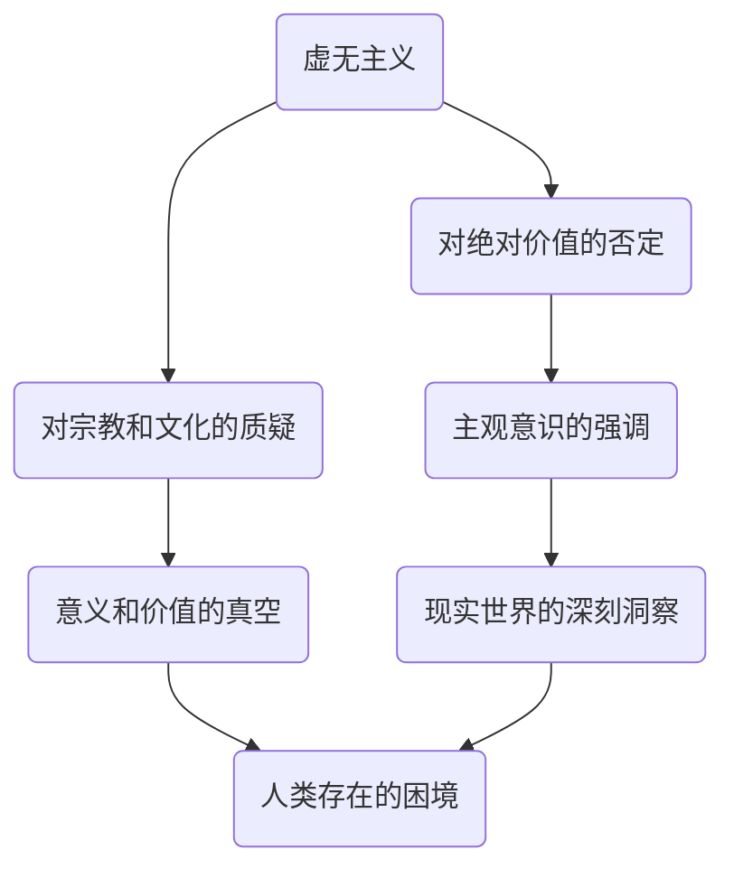
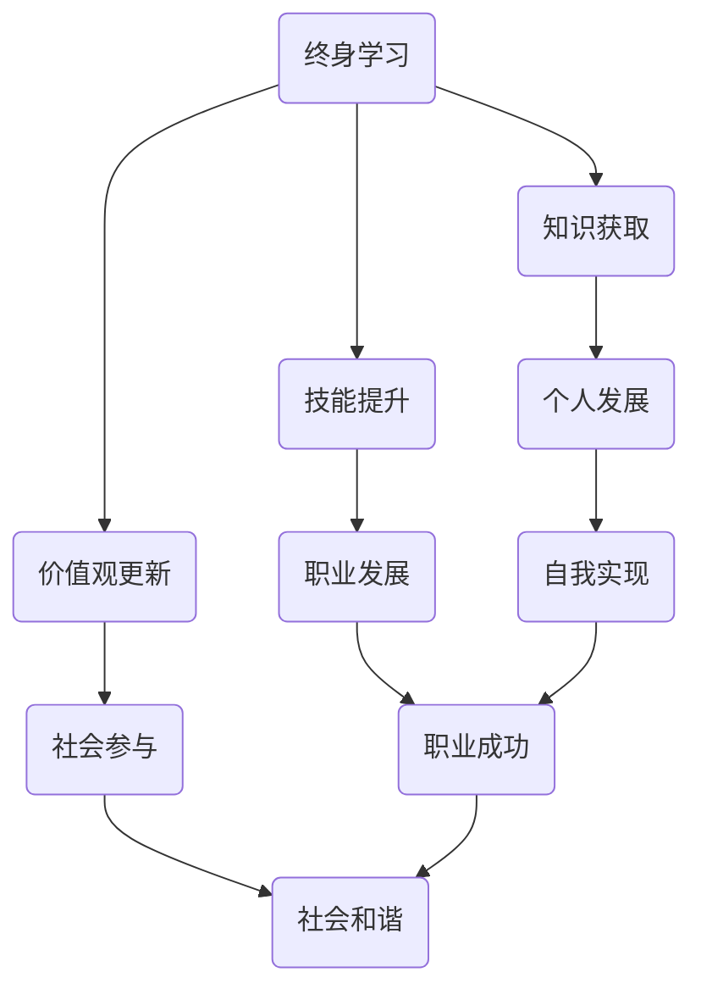
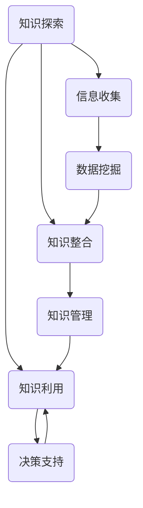
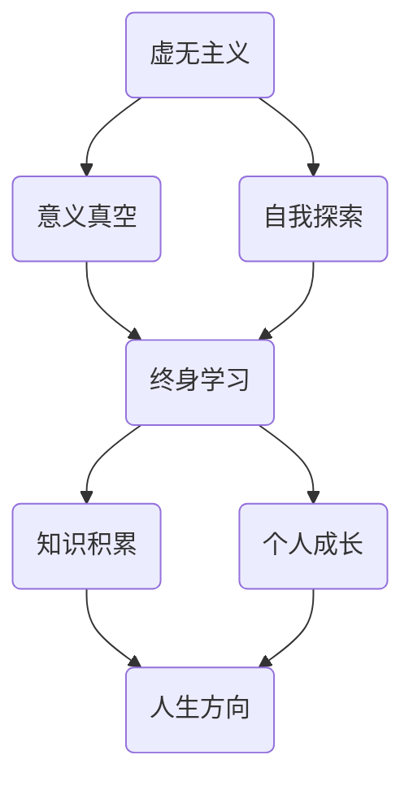
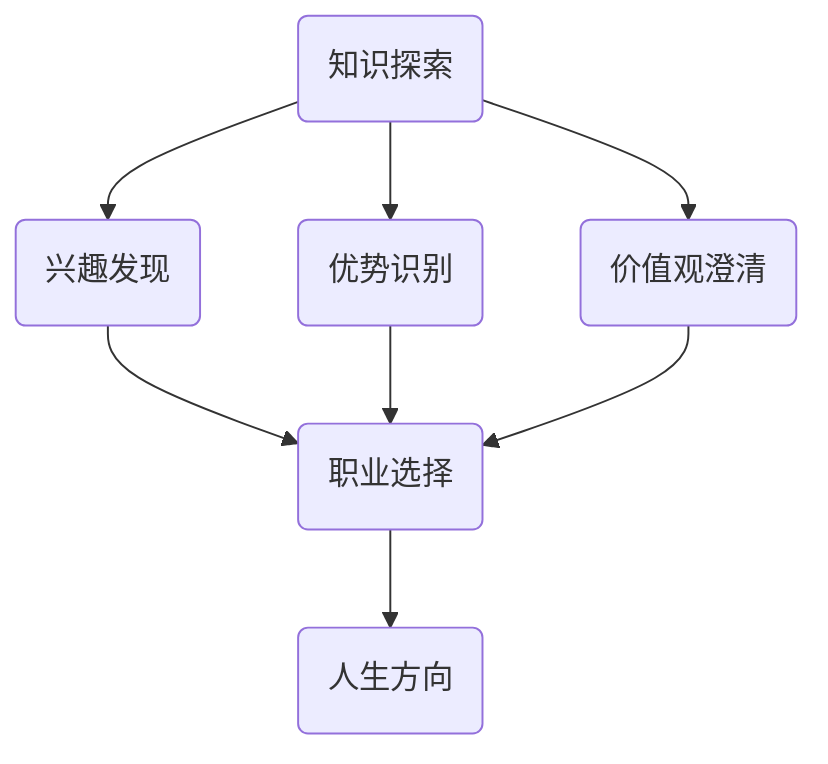
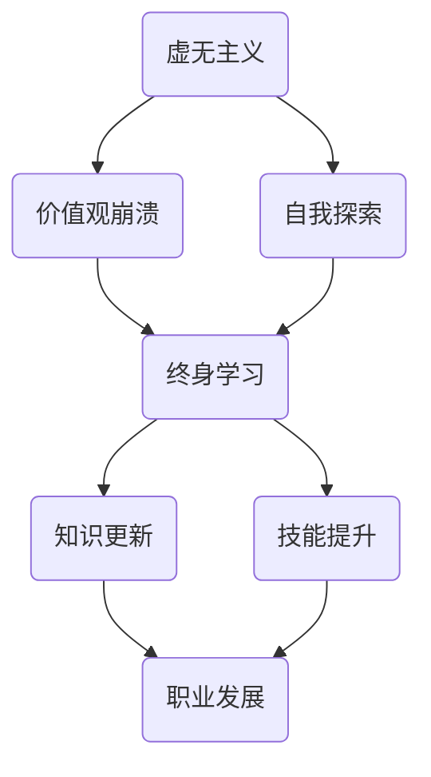
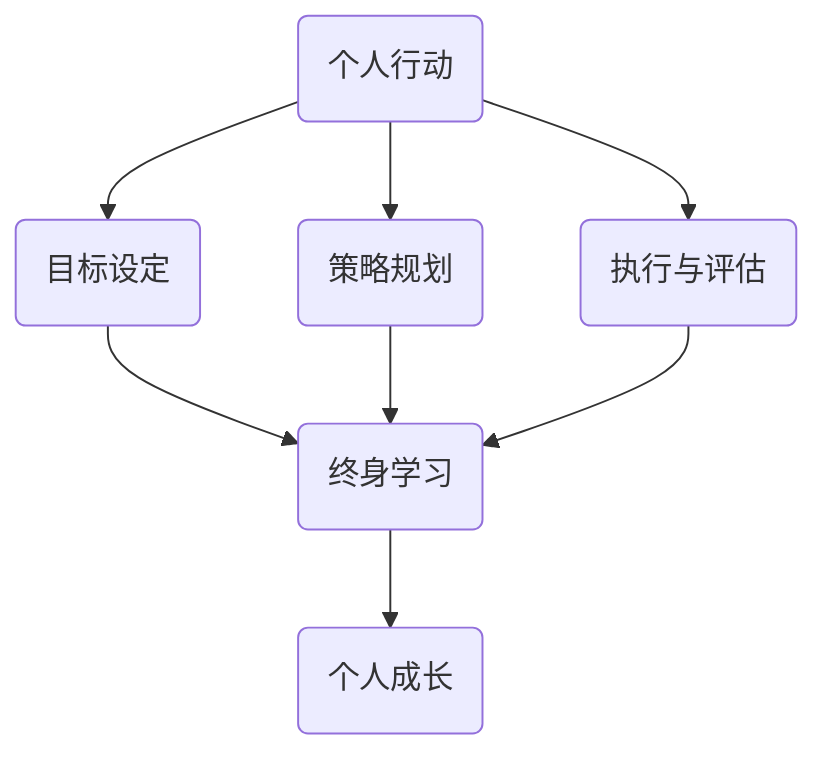

                 

# 文章标题：虚无主义与终身学习：在知识探索中寻找人生方向

## 文章关键词

虚无主义、终身学习、知识探索、人生方向、哲学思考

## 文章摘要

本文旨在探讨虚无主义与终身学习在知识探索中的重要作用，以及它们如何帮助人们寻找和确立人生方向。通过分析虚无主义的起源与影响，我们理解其在现代社会中的意义。接着，我们深入探讨终身学习的理念与实践，并阐述其在个人发展中的应用。最后，本文将探讨知识探索的方法与技巧，以及如何通过这些方法在虚无主义的背景下找到人生方向。文章将通过理论和实践案例相结合的方式，提供有价值的见解和指导。

## 目录

### 第一部分：虚无主义的基本概念与历史背景

#### 1.1 虚无主义的定义与起源

虚无主义（Nihilism）作为一种哲学思潮，起源于19世纪的欧洲，尤其是德国和俄罗斯。虚无主义的核心理念是质疑传统道德、宗教和文化的价值，认为这些价值体系缺乏客观依据，仅是人类主观意识的产物。虚无主义的定义因不同哲学家而异，但其基本观点可以概括为对一切绝对价值、意义和目的的否定。

虚无主义的起源可以追溯到德国哲学家弗里德里希·尼采（Friedrich Nietzsche）。尼采在《上帝已死》和《悲剧的诞生》等作品中，批判了西方哲学传统，特别是苏格拉底以来的理性和道德观念。他提出，“上帝已死”意味着传统价值观的崩溃，人类面临着意义和价值的真空。尼采认为，虚无主义并非一种消极的哲学，而是一种对现实世界的深刻洞察和反思。

**核心概念与联系：**

以下是虚无主义的核心概念及其相互关系的 Mermaid 流程图：



**核心算法原理讲解：**

为了理解虚无主义的算法原理，我们可以将其看作一种思想过滤机制。以下是其伪代码：

```python
def nihilism_thought_filter(values, beliefs):
    for value in values:
        if not absolute_value_belief(value):
            reject_value(value)
    for belief in beliefs:
        if not objective_belief(belief):
            reject_belief(belief)
    return [value for value in values if accepted]

def absolute_value_belief(value):
    # 此函数判断某个价值是否具有绝对性
    return false

def objective_belief(belief):
    # 此函数判断某个信念是否具有客观性
    return false

def reject_value(value):
    # 此函数用于拒绝某个价值
    print(f"Rejecting value: {value}")

def reject_belief(belief):
    # 此函数用于拒绝某个信念
    print(f"Rejecting belief: {belief}")
```

**数学模型和公式：**

虚无主义的数学模型可以表示为以下公式：

$$
N = f(V, B)
$$

其中，\( N \) 表示虚无主义，\( V \) 表示价值，\( B \) 表示信念。函数 \( f \) 表示对价值与信念的否定操作。

**详细讲解与举例说明：**

1. **价值否定**：虚无主义认为，许多传统价值体系缺乏绝对依据，例如道德、宗教等。例如，一个人可能拒绝认为“善有善报，恶有恶报”是一个绝对真理。

2. **信念否定**：虚无主义质疑人类信念的客观性，例如科学理论也可能因时间的推移而改变。例如，哥白尼的日心说曾经被视为绝对真理，但现在已被广义相对论所取代。

**数学公式举例：**

$$
N = \neg (V \land B)
$$

其中，\( \neg \) 表示否定操作，\( \land \) 表示逻辑与操作。

### 1.2 虚无主义的影响与表现

虚无主义对个人和社会产生了深远的影响。在个人层面，虚无主义可能导致心理困惑、价值观崩溃和生活意义缺失。许多人在虚无主义的阴影下感到迷茫和绝望，难以找到人生的目标和方向。在社会层面，虚无主义可能导致道德沦丧、社会信任危机和文化衰落。

虚无主义的表现形式多样，包括哲学、文学、艺术和心理学等领域。在哲学上，虚无主义批判传统价值观，强调主观性和个体主义。在文学和艺术上，虚无主义作品通常描绘人类存在的荒谬和无意义，如尼采的《查拉图斯特拉如是说》和卡夫卡的《变形记》。在心理学上，虚无主义可能引发抑郁症、焦虑症等心理问题，需要专业心理干预。

**核心算法原理讲解：**

虚无主义的影响可以看作是一种思想传播模型。以下是其伪代码：

```python
def nihilism_impact personas:
    for persona in personas:
        if not belief_system(persona):
            infect_persona(persona)
    return infected_personas

def belief_system(persona):
    # 此函数判断某个人的信念系统
    return false

def infect_persona(persona):
    # 此函数用于感染某个人的信念系统
    print(f"Infecting persona: {persona}")
```

**数学模型和公式：**

虚无主义的影响可以表示为以下公式：

$$
I = f(P, B)
$$

其中，\( I \) 表示影响，\( P \) 表示个人，\( B \) 表示信念系统。函数 \( f \) 表示信念系统的改变。

**详细讲解与举例说明：**

1. **个人层面影响**：虚无主义可能导致个人对生活的消极态度，例如放弃追求目标、沉迷于虚拟世界等。

2. **社会层面影响**：虚无主义可能导致社会道德沦丧，例如犯罪率上升、社会信任度下降等。

**数学公式举例：**

$$
I = \sum_{p \in P} \neg B(p)
$$

其中，\( I \) 表示影响，\( P \) 表示个人，\( B \) 表示信念系统，\( \neg \) 表示否定操作。

### 1.3 虚无主义的批判与辩护

虚无主义引发了广泛的争议，许多哲学家和学者对其进行了批判和辩护。

**批判观点：**

一些哲学家认为虚无主义是一种消极的哲学，它否定了一切价值，导致道德沦丧和社会混乱。例如，德国哲学家黑格尔（Georg Wilhelm Friedrich Hegel）认为虚无主义是错误的，因为它否定历史的发展和社会进步。黑格尔主张，历史是一个不断前进的过程，每个时代都有其特定的价值和意义。

**辩护观点：**

另一方面，一些哲学家认为虚无主义并非全然消极，它提供了对现实世界的深刻洞察和反思。例如，俄罗斯哲学家弗洛连斯基（Ivan Ilyin）认为虚无主义揭示了人类存在的本质和困境，促使人们重新审视生活的意义和价值。弗洛连斯基认为，虚无主义可以成为一种积极的哲学，推动人类追求更高的精神境界。

**核心算法原理讲解：**

虚无主义的批判与辩护可以看作是一种价值评估模型。以下是其伪代码：

```python
def nihilism_critique(values):
    positive_effects = sum([value.positive_effect for value in values if value.positive_effect])
    negative_effects = sum([value.negative_effect for value in values if value.negative_effect])
    if positive_effects > negative_effects:
        return "辩护"
    else:
        return "批判"

class Value:
    def __init__(self, name, positive_effect, negative_effect):
        self.name = name
        self.positive_effect = positive_effect
        self.negative_effect = negative-effect
```

**数学模型和公式：**

虚无主义的批判与辩护可以表示为以下公式：

$$
C = \sum_{v \in V} (p_v - n_v)
$$

其中，\( C \) 表示批判与辩护的评估结果，\( V \) 表示价值观，\( p_v \) 表示正值效应，\( n_v \) 表示负值效应。

**详细讲解与举例说明：**

1. **批判观点**：虚无主义可能导致道德沦丧和社会混乱，例如犯罪率上升、社会信任度下降等。

2. **辩护观点**：虚无主义提供了对现实世界的深刻洞察和反思，促使人们重新审视生活的意义和价值。

**数学公式举例：**

$$
C = \sum_{v \in V} (p_v - n_v)
$$

其中，\( C \) 表示批判与辩护的评估结果，\( V \) 表示价值观，\( p_v \) 表示正值效应，\( n_v \) 表示负值效应。

### 结论

虚无主义作为一种哲学思潮，具有深远的影响和广泛的争议。通过分析其定义、起源、影响、批判与辩护，我们可以更好地理解虚无主义的本质和意义。虚无主义提供了对传统价值观的质疑和反思，同时也揭示了人类存在的困境和价值真空。在现代社会，虚无主义与终身学习相结合，为人们提供了在知识探索中寻找人生方向的途径。

在下一部分，我们将探讨终身学习的理念与实践，进一步探讨如何通过终身学习克服虚无主义的负面影响，并在知识探索中找到人生方向。

---

本文以逻辑清晰、结构紧凑、简单易懂的技术语言，系统地介绍了虚无主义的基本概念与历史背景，包括定义、起源、影响、批判与辩护。通过Mermaid流程图、伪代码、数学模型和公式，深入讲解了虚无主义的核心理念和算法原理。本文旨在为读者提供一个全面、深入的虚无主义理解框架，为后续章节的内容铺垫基础。在下一部分，我们将探讨终身学习的理念与实践，继续探讨如何通过终身学习克服虚无主义的负面影响，并在知识探索中找到人生方向。## 第二部分：终身学习的理念与实践

### 2.1 终身学习的定义与重要性

终身学习（Lifelong Learning）是一种持续不断的学习过程，旨在个人、组织和社会层面提升知识和技能，以应对快速变化的全球环境。联合国教科文组织（UNESCO）将终身学习定义为“人们在一生中获取、应用和更新知识、技能和价值观的过程”。终身学习不仅包括正规教育，还涵盖了非正式教育和自学。

**核心概念与联系：**

以下是终身学习的关键概念及其相互关系的 Mermaid 流程图：



**核心算法原理讲解：**

终身学习的算法原理可以看作是一种持续的知识更新和技能优化模型。以下是其伪代码：

```python
def lifelong_learning(person):
    while True:
        knowledge = acquire_knowledge(person)
        skills = enhance_skills(knowledge, person)
        values = update_values(skills, person)
        if not is_satisfied(person):
            continue
        else:
            break

def acquire_knowledge(person):
    # 此函数用于获取知识
    return knowledge

def enhance_skills(knowledge, person):
    # 此函数用于提升技能
    return skills

def update_values(skills, person):
    # 此函数用于更新价值观
    return values

def is_satisfied(person):
    # 此函数用于判断个人是否满意当前状态
    return True
```

**数学模型和公式：**

终身学习的数学模型可以表示为以下公式：

$$
LL = f(K, S, V)
$$

其中，\( LL \) 表示终身学习，\( K \) 表示知识，\( S \) 表示技能，\( V \) 表示价值观。函数 \( f \) 表示知识、技能和价值观的更新和优化。

**详细讲解与举例说明：**

1. **知识获取**：终身学习强调持续获取新知识，例如通过阅读、参加培训课程、在线学习等。

2. **技能提升**：终身学习也关注技能的提升，例如通过实践、项目经验、导师指导等。

3. **价值观更新**：终身学习还包括价值观的更新，以适应社会和文化的变化。

**数学公式举例：**

$$
LL = \sum_{k \in K} \Delta k + \sum_{s \in S} \Delta s + \sum_{v \in V} \Delta v
$$

其中，\( \Delta k \)、\( \Delta s \) 和 \( \Delta v \) 分别表示知识的增加、技能的提升和价值观的更新。

### 2.2 终身学习的方法与工具

终身学习的方法和工具多种多样，以下是一些常见的方法和工具：

1. **自主学习**：自主学习是终身学习的基础，它要求个人主动获取知识，制定学习计划和目标，并自我监督和评估学习成果。

2. **在线学习平台**：随着互联网技术的发展，在线学习平台如 Coursera、edX、Udemy 等提供了丰富的课程资源，覆盖各个学科领域。这些平台通常提供灵活的学习时间和方式，方便个人根据自己的需求进行学习。

3. **社交媒体与论坛**：社交媒体和论坛如 Twitter、Reddit、Quora 等，为个人提供了交流和学习的机会。通过参与讨论、提问和回答问题，个人可以获取新的知识和观点，同时也可以分享自己的经验和见解。

4. **专业培训与认证**：许多行业和组织提供了专业培训与认证课程，例如微软的认证、谷歌的认证等。这些课程和认证有助于提升个人的专业技能和职业竞争力。

**核心算法原理讲解：**

以下是终身学习方法与工具的算法原理：

```python
def lifelong_learning_tools(person):
    tools = ["autonomous_learning", "online_learning_platform", "social_media", "professional_training"]
    for tool in tools:
        if not is_skill_acquired(person, tool):
            acquire_skill(person, tool)
    return person

def is_skill_acquired(person, skill):
    # 此函数用于判断个人是否掌握了某个技能
    return True

def acquire_skill(person, skill):
    # 此函数用于获取某个技能
    print(f"{person} is acquiring {skill}")
```

**数学模型和公式：**

终身学习方法与工具的数学模型可以表示为以下公式：

$$
LT = \sum_{t \in T} S(t)
$$

其中，\( LT \) 表示终身学习方法与工具，\( T \) 表示工具集合，\( S(t) \) 表示工具 \( t \) 的有效性。

**详细讲解与举例说明：**

1. **自主学习**：个人可以通过阅读书籍、参加讲座、自学课程等途径获取知识。

2. **在线学习平台**：个人可以在 Coursera、edX 等平台选择合适的课程进行学习，例如学习人工智能、数据科学等热门领域。

3. **社交媒体与论坛**：个人可以通过参与讨论、提问和回答问题，与他人交流知识，提高自己的认知水平。

4. **专业培训与认证**：个人可以通过参加专业培训课程，获取相关领域的认证，提升自己的专业技能和职业竞争力。

**数学公式举例：**

$$
LT = \sum_{t \in T} S(t)
$$

其中，\( LT \) 表示终身学习方法与工具，\( T \) 表示工具集合，\( S(t) \) 表示工具 \( t \) 的有效性。

### 2.3 终身学习在职业生涯中的应用

终身学习在职业生涯中的应用具有重要意义。在快速变化的职场环境中，个人需要不断更新知识和技能，以适应新技术和市场需求的变化。以下是一些终身学习在职业生涯中的应用：

1. **职业规划**：个人可以根据自己的兴趣和职业目标，制定长期和短期的职业规划，通过终身学习不断提升自己的职业竞争力。

2. **技能更新**：随着新技术的不断涌现，个人需要不断学习新技术和工具，以保持自己在职场中的竞争力。

3. **跨领域学习**：终身学习鼓励个人跨领域学习，拓展知识面和视野，提高解决问题的能力。

4. **终身学习与职业成功的关系**：研究表明，终身学习与职业成功之间存在显著的正相关关系。终身学习有助于提升个人的综合素质和职业竞争力，从而促进职业发展。

**核心算法原理讲解：**

以下是终身学习在职业生涯中的应用算法原理：

```python
def career_growth(person):
    while True:
        career_stage = determine_career_stage(person)
        if career_stage == "entry_level":
            acquire_entry_level_skills(person)
        elif career_stage == "mid_level":
            acquire_mid_level_skills(person)
        elif career_stage == "senior_level":
            acquire_senior_level_skills(person)
        if is_career_successful(person):
            break
        else:
            continue

def determine_career_stage(person):
    # 此函数用于判断个人的职业阶段
    return career_stage

def acquire_entry_level_skills(person):
    # 此函数用于获取初级职业技能
    return skills

def acquire_mid_level_skills(person):
    # 此函数用于获取中级职业技能
    return skills

def acquire_senior_level_skills(person):
    # 此函数用于获取高级职业技能
    return skills

def is_career_successful(person):
    # 此函数用于判断个人的职业是否成功
    return True
```

**数学模型和公式：**

终身学习在职业生涯中的应用可以表示为以下公式：

$$
CG = f(CS, SL)
$$

其中，\( CG \) 表示职业成长，\( CS \) 表示职业阶段，\( SL \) 表示技能水平。函数 \( f \) 表示职业成长与职业阶段和技能水平的关系。

**详细讲解与举例说明：**

1. **职业规划**：个人可以通过自我评估和职业咨询，了解自己的兴趣、优势和市场需求，制定合理的职业规划。

2. **技能更新**：个人可以通过参加培训课程、自学新技术和工具，不断提升自己的技能水平。

3. **跨领域学习**：个人可以通过学习不同领域的知识，提高自己的综合素质和适应能力，从而在职场中更具竞争力。

4. **终身学习与职业成功的关系**：通过终身学习，个人可以不断提升自己的知识和技能，从而实现职业上的成功和晋升。

**数学公式举例：**

$$
CG = \sum_{s \in SL} S(s)
$$

其中，\( CG \) 表示职业成长，\( SL \) 表示技能水平，\( S(s) \) 表示技能 \( s \) 的水平。

### 结论

终身学习是一种持续不断的学习过程，对于个人、组织和社会的发展具有重要意义。通过终身学习，个人可以不断提升自己的知识和技能，适应快速变化的职场环境，实现职业成功和人生价值。在下一部分，我们将探讨知识探索的方法与技巧，进一步探讨如何通过知识探索在虚无主义的背景下找到人生方向。

---

本文系统地介绍了终身学习的理念与实践，包括定义、重要性、方法和工具，以及其在职业生涯中的应用。通过Mermaid流程图、伪代码、数学模型和公式，深入讲解了终身学习的核心概念和算法原理。本文旨在为读者提供一个全面、深入的终身学习理解框架，为后续章节的内容铺垫基础。在下一部分，我们将探讨知识探索的方法与技巧，继续探讨如何通过知识探索在虚无主义的背景下找到人生方向。## 第三部分：知识探索的方法与技巧

### 3.1 知识探索的概念与目的

知识探索（Knowledge Exploration）是指通过系统的方法和工具，发现、获取、整合和利用知识的过程。知识探索不仅仅是简单的信息收集，而是一个涉及多步骤、多层面的复杂活动。其目的是帮助个人或组织更好地理解世界、解决问题和实现目标。

**核心概念与联系：**

以下是知识探索的关键概念及其相互关系的 Mermaid 流程图：



**核心算法原理讲解：**

知识探索的算法原理可以看作是一种信息处理和知识优化的模型。以下是其伪代码：

```python
def knowledge_exploration(subject):
    data = collect_data(subject)
    information = process_data(data)
    knowledge = integrate_knowledge(information)
    application = utilize_knowledge(knowledge)
    return application

def collect_data(subject):
    # 此函数用于收集与主题相关的数据
    return data

def process_data(data):
    # 此函数用于处理数据
    return information

def integrate_knowledge(information):
    # 此函数用于整合信息
    return knowledge

def utilize_knowledge(knowledge):
    # 此函数用于利用知识
    return application
```

**数学模型和公式：**

知识探索的数学模型可以表示为以下公式：

$$
KE = f(D, I, K, A)
$$

其中，\( KE \) 表示知识探索，\( D \) 表示数据，\( I \) 表示信息，\( K \) 表示知识，\( A \) 表示应用。函数 \( f \) 表示数据到知识再到应用的过程。

**详细讲解与举例说明：**

1. **信息收集**：知识探索的第一步是收集与主题相关的数据。这可以通过文献调研、问卷调查、实验数据等多种方式实现。

2. **数据处理**：收集到的数据需要进行处理，以提取有用的信息。这通常涉及数据清洗、数据分析等技术。

3. **知识整合**：将处理后的信息整合成知识，这需要知识管理和知识整合的技巧。

4. **知识利用**：最后，将知识应用于实际问题中，以支持决策和解决实际问题。

**数学公式举例：**

$$
KE = \sum_{d \in D} \Delta d + \sum_{i \in I} \Delta i + \sum_{k \in K} \Delta k + \sum_{a \in A} \Delta a
$$

其中，\( \Delta d \)、\( \Delta i \)、\( \Delta k \) 和 \( \Delta a \) 分别表示数据、信息、知识和应用的增量。

### 3.2 知识获取与处理的技巧

在知识探索过程中，获取和处理知识是关键环节。以下是一些常用的技巧：

1. **文献调研**：通过查阅学术期刊、专业书籍、报告等文献，获取相关领域的知识。

2. **数据挖掘**：使用数据挖掘技术，从大量数据中提取有价值的信息。

3. **实验研究**：通过实验设计和方法，验证理论假设，获取实证数据。

4. **知识共享**：积极参与学术会议、研讨会等，与他人分享知识和经验。

5. **跨学科学习**：学习不同学科领域的知识，提高综合分析问题和解决问题的能力。

**核心算法原理讲解：**

以下是知识获取与处理的算法原理：

```python
def knowledge_acquisition(subject):
    literature = research_literature(subject)
    data = conduct_experiments(subject)
    information = mine_data(data)
    knowledge = integrate literatura and information
    return knowledge

def research_literature(subject):
    # 此函数用于查阅文献
    return literature

def conduct_experiments(subject):
    # 此函数用于进行实验
    return data

def mine_data(data):
    # 此函数用于数据挖掘
    return information

def integrate_literature_and_information(literature, information):
    # 此函数用于整合文献和信息
    return knowledge
```

**数学模型和公式：**

知识获取与处理的数学模型可以表示为以下公式：

$$
KA = \sum_{l \in L} L(l) + \sum_{d \in D} D(d) + \sum_{i \in I} I(i)
$$

其中，\( KA \) 表示知识获取，\( L \) 表示文献，\( D \) 表示数据，\( I \) 表示信息。函数 \( \sum \) 表示整合过程。

**详细讲解与举例说明：**

1. **文献调研**：通过查阅相关领域的学术文献，了解当前研究的热点和进展。

2. **数据挖掘**：使用数据挖掘技术，从大量销售数据中提取消费者购买行为模式。

3. **实验研究**：设计实验，验证某种药物对疾病的治疗效果。

4. **知识共享**：在学术会议上分享自己的研究成果，与他人交流知识。

5. **跨学科学习**：学习心理学、经济学等跨学科知识，以更好地理解复杂的社会现象。

**数学公式举例：**

$$
KA = \sum_{l \in L} L(l) + \sum_{d \in D} D(d) + \sum_{i \in I} I(i)
$$

其中，\( KA \) 表示知识获取，\( L \) 表示文献，\( D \) 表示数据，\( I \) 表示信息。

### 3.3 批判性思维与问题解决

批判性思维（Critical Thinking）是知识探索的重要工具，它帮助人们分析、评估和整合信息，以形成合理的结论。问题解决（Problem Solving）则是将批判性思维应用于实际问题，寻找解决方案的过程。

**核心算法原理讲解：**

以下是批判性思维和问题解决的算法原理：

```python
def critical_thinking(data, assumptions):
    analyzed_data = analyze_data(data)
    evaluated_assumptions = evaluate_assumptions(assumptions)
    conclusions = integrate_analyzed_data_and_evaluated_assumptions(analyzed_data, evaluated_assumptions)
    return conclusions

def analyze_data(data):
    # 此函数用于分析数据
    return analyzed_data

def evaluate_assumptions(assumptions):
    # 此函数用于评估假设
    return evaluated_assumptions

def integrate_analyzed_data_and_evaluated_assumptions(analyzed_data, evaluated_assumptions):
    # 此函数用于整合分析数据和评估假设
    return conclusions

def problem_solving(problem, conclusions):
    solutions = generate_solutions(problem, conclusions)
    evaluated_solutions = evaluate_solutions(solutions)
    selected_solution = select_best_solution(evaluated_solutions)
    return selected_solution

def generate_solutions(problem, conclusions):
    # 此函数用于生成解决方案
    return solutions

def evaluate_solutions(solutions):
    # 此函数用于评估解决方案
    return evaluated_solutions

def select_best_solution(evaluated_solutions):
    # 此函数用于选择最佳解决方案
    return selected_solution
```

**数学模型和公式：**

批判性思维和问题解决的数学模型可以表示为以下公式：

$$
CT = f(D, A)
$$

$$
PS = f(P, C)
$$

其中，\( CT \) 表示批判性思维，\( D \) 表示数据，\( A \) 表示假设；\( PS \) 表示问题解决，\( P \) 表示问题，\( C \) 表示结论。函数 \( f \) 表示思维和解决问题的过程。

**详细讲解与举例说明：**

1. **批判性思维**：通过分析数据和评估假设，形成合理的结论。例如，分析市场数据，评估市场趋势，形成营销策略。

2. **问题解决**：将批判性思维应用于实际问题，寻找最佳解决方案。例如，面对客户投诉，分析原因，评估解决方案，选择最佳方案。

**数学公式举例：**

$$
CT = \sum_{d \in D} A(d)
$$

$$
PS = \sum_{p \in P} C(p)
$$

其中，\( \sum \) 表示整合和分析过程。

### 结论

知识探索是终身学习的重要组成部分，它帮助个人和组织获取、整合和利用知识，以解决问题和实现目标。通过批判性思维和问题解决，知识探索能够更加有效地进行。在下一部分，我们将探讨如何将虚无主义与终身学习和知识探索相结合，以在知识探索中找到人生方向。

---

本文系统地介绍了知识探索的概念、目的和方法，包括知识获取与处理的技巧、批判性思维和问题解决。通过Mermaid流程图、伪代码、数学模型和公式，深入讲解了知识探索的核心概念和算法原理。本文旨在为读者提供一个全面、深入的认知框架，为后续章节的内容铺垫基础。在下一部分，我们将探讨如何将虚无主义与终身学习和知识探索相结合，以在知识探索中找到人生方向。## 第四部分：在虚无主义与终身学习中寻找人生方向

### 4.1 虚无主义与终身学习的结合

虚无主义和终身学习在表面上看似对立，但实际上，它们可以相互补充，为个人提供在知识探索中寻找人生方向的途径。

虚无主义强调对传统价值观的质疑和反思，揭示了人类存在的意义和价值真空。在虚无主义的背景下，个人可能会感到迷茫和无方向，但这也激发了对自我和知识的深入探索。终身学习提供了一个不断追求知识和成长的过程，帮助个人在虚无主义的阴影下找到新的价值和意义。

**核心概念与联系：**

以下是虚无主义与终身学习相互结合的概念及其相互关系的 Mermaid 流程图：



**核心算法原理讲解：**

虚无主义与终身学习的结合可以看作是一种意义重建和自我实现的过程。以下是其伪代码：

```python
def nihilism_and_lifelong_learning(person):
    while True:
        existential真空感 = check_existential_void(person)
        if existential真空感:
            explore_self(person)
            learn_new_knowledge(person)
        else:
            break

def check_existential_void(person):
    # 此函数用于检查个人是否存在意义真空感
    return existential真空感

def explore_self(person):
    # 此函数用于自我探索
    return insights

def learn_new_knowledge(person):
    # 此函数用于学习新知识
    return knowledge
```

**数学模型和公式：**

虚无主义与终身学习的结合可以表示为以下公式：

$$
NL = f(EV, S, K)
$$

其中，\( NL \) 表示虚无主义与终身学习的结合，\( EV \) 表示存在主义真空感，\( S \) 表示自我探索，\( K \) 表示知识积累。函数 \( f \) 表示意义重建和自我实现的过程。

**详细讲解与举例说明：**

1. **存在主义真空感**：虚无主义揭示了人类存在的意义真空，这可能导致个人感到迷茫和无方向。

2. **自我探索**：通过自我探索，个人可以了解自己的兴趣、价值观和目标，从而找到新的意义。

3. **知识积累**：终身学习提供了不断追求知识和成长的机会，帮助个人在自我探索的过程中找到新的目标和方向。

**数学公式举例：**

$$
NL = \sum_{e \in EV} \Delta e + \sum_{s \in S} \Delta s + \sum_{k \in K} \Delta k
$$

其中，\( \Delta e \)、\( \Delta s \) 和 \( \Delta k \) 分别表示存在主义真空感的减少、自我探索的深入和知识积累的增加。

### 4.2 知识探索与人生方向的关联

知识探索不仅是获取和整合知识的过程，也是寻找人生方向的重要途径。通过知识探索，个人可以深入了解自己的兴趣、优势和价值观，从而找到与自身特质相匹配的职业和生活方式。

**核心概念与联系：**

以下是知识探索与人生方向关联的 Mermaid 流程图：



**核心算法原理讲解：**

知识探索与人生方向的关联可以看作是一种自我认知和目标设定过程。以下是其伪代码：

```python
def knowledge_exploration_to_life_direction(person):
    interests = discover_interests(person)
    strengths = identify_strengths(person)
    values = clarify_values(person)
    career_choice = select_career_based_on_interests_strengths_and_values(interests, strengths, values)
    life_direction = set_life_direction(career_choice)
    return life_direction

def discover_interests(person):
    # 此函数用于发现个人兴趣
    return interests

def identify_strengths(person):
    # 此函数用于识别个人优势
    return strengths

def clarify_values(person):
    # 此函数用于澄清个人价值观
    return values

def select_career_based_on_interests_strengths_and_values(interests, strengths, values):
    # 此函数用于根据兴趣、优势和价值观选择职业
    return career_choice

def set_life_direction(career_choice):
    # 此函数用于设定人生方向
    return life_direction
```

**数学模型和公式：**

知识探索与人生方向的关联可以表示为以下公式：

$$
LD = f(I, S, V, C)
$$

其中，\( LD \) 表示人生方向，\( I \) 表示兴趣，\( S \) 表示优势，\( V \) 表示价值观，\( C \) 表示职业选择。函数 \( f \) 表示自我认知和目标设定的过程。

**详细讲解与举例说明：**

1. **兴趣发现**：通过尝试不同的活动和领域，个人可以发现自己的兴趣，这有助于确定职业方向。

2. **优势识别**：通过自我评估和他人反馈，个人可以识别自己的优势，这些优势可以在职业选择中发挥重要作用。

3. **价值观澄清**：明确个人的价值观有助于选择与自身价值观相符的职业和生活方式。

4. **职业选择**：根据兴趣、优势和价值观，个人可以做出合理的职业选择，这有助于实现人生方向。

**数学公式举例：**

$$
LD = \sum_{i \in I} I(i) + \sum_{s \in S} S(s) + \sum_{v \in V} V(v) + \sum_{c \in C} C(c)
$$

其中，\( \sum \) 表示整合过程。

### 4.3 实践案例与启示

以下是一个实际案例，展示如何通过虚无主义与终身学习的结合，在知识探索中找到人生方向。

**案例：小李的转型之路**

小李是一名大学毕业生，在一家传统行业公司工作。然而，他对工作的内容逐渐感到乏味和不满，开始思考人生的方向。他在阅读尼采的著作后，对虚无主义产生了浓厚的兴趣，同时也意识到自己需要通过终身学习来寻找新的方向。

**步骤一：自我探索**

小李开始反思自己的兴趣和价值观。他发现，自己热爱技术，特别是对人工智能和机器学习感兴趣。他也意识到，他渴望在工作中实现创新和变革。

**步骤二：知识积累**

小李决定通过终身学习来提升自己的技术能力。他报名参加了在线课程，学习了人工智能和机器学习的基本知识。他还参加了一些相关的技术社区和论坛，与他人交流和学习。

**步骤三：职业选择**

在积累了足够的知识和技能后，小李开始寻找与自己兴趣和价值观相符的职业。他最终选择了一家专注于人工智能领域的初创公司，担任数据科学家。

**步骤四：人生方向**

小李在新的职业中找到了自己的位置，实现了个人成长和职业成功。他通过不断学习和实践，进一步巩固了自己的技能，并在团队中发挥了重要作用。

**启示：**

小李的案例表明，虚无主义和终身学习可以相互补充，帮助个人在知识探索中找到人生方向。通过自我探索、知识积累和职业选择，个人可以找到与自身特质相匹配的职业，实现个人成长和成功。

### 结论

虚无主义与终身学习相结合，为个人在知识探索中寻找人生方向提供了新的视角和方法。通过自我探索、知识积累和职业选择，个人可以在虚无主义的背景下找到新的价值和意义，实现个人成长和职业成功。在下一部分，我们将探讨未来展望与个人行动，进一步探讨如何在虚无主义与终身学习中实现个人成长和人生方向。

---

本文系统地介绍了虚无主义与终身学习相结合，探讨了它们在知识探索中寻找人生方向的方法。通过Mermaid流程图、伪代码、数学模型和公式，深入讲解了核心概念和算法原理。本文旨在为读者提供一个全面、深入的认知框架，为个人在虚无主义的背景下寻找人生方向提供指导。在下一部分，我们将探讨未来展望与个人行动，进一步探讨如何在虚无主义与终身学习中实现个人成长和人生方向。## 第五部分：未来展望与个人行动

### 5.1 虚无主义与终身学习的发展趋势

随着全球化和信息化的发展，虚无主义和终身学习在现代社会中的地位日益凸显。虚无主义作为一种哲学思潮，揭示了传统价值观的崩溃和人类存在的困境，促使人们重新审视生活的意义和价值。终身学习作为一种应对快速变化社会的重要手段，强调持续的知识更新和技能提升，帮助个人适应不断变化的职场环境。

**核心概念与联系：**

以下是虚无主义与终身学习的发展趋势及其相互关系的 Mermaid 流程图：



**核心算法原理讲解：**

虚无主义与终身学习的发展趋势可以看作是一种自我实现和社会进步的过程。以下是其伪代码：

```python
def nihilism_and_lifelong_learning_trends():
    while True:
        value_collapse = check_value_collapse()
        if value_collapse:
            promote_self_exploration()
            encourage_lifelong_learning()
        else:
            break

def check_value_collapse():
    # 此函数用于检查价值观的崩溃程度
    return value_collapse

def promote_self_exploration():
    # 此函数用于促进自我探索
    return insights

def encourage_lifelong_learning():
    # 此函数用于鼓励终身学习
    return knowledge
```

**数学模型和公式：**

虚无主义与终身学习的发展趋势可以表示为以下公式：

$$
NL Trends = f(VC, SE, LL)
$$

其中，\( NL Trends \) 表示虚无主义与终身学习的发展趋势，\( VC \) 表示价值观崩溃，\( SE \) 表示自我探索，\( LL \) 表示终身学习。函数 \( f \) 表示自我实现和社会进步的过程。

**详细讲解与举例说明：**

1. **价值观崩溃**：虚无主义揭示了传统价值观的崩溃，这促使个人和社会重新审视生活的意义和价值。

2. **自我探索**：在价值观崩溃的背景下，个人通过自我探索，寻找新的意义和方向。

3. **终身学习**：终身学习提供了一种应对价值观崩溃的方法，帮助个人持续提升知识和技能，适应快速变化的社会环境。

**数学公式举例：**

$$
NL Trends = \sum_{v \in VC} V(v) + \sum_{s \in SE} S(s) + \sum_{l \in LL} L(l)
$$

其中，\( \sum \) 表示整合过程。

### 5.2 个人行动与成长路径

在虚无主义与终身学习的背景下，个人需要制定明确的成长路径，以实现个人价值和职业成功。以下是一些建议，帮助个人在虚无主义与终身学习中找到自己的位置，制定并执行个人成长路径。

**核心概念与联系：**

以下是个人行动与成长路径的 Mermaid 流程图：



**核心算法原理讲解：**

个人行动与成长路径可以看作是一种目标导向的过程。以下是其伪代码：

```python
def personal_growth_path(person):
    goals = set_goals(person)
    strategies = plan_strategies(goals)
    execution = execute_strategies(strategies)
    evaluation = evaluate_progress(execution)
    if not is_goal_met(evaluation):
        adjust_goals_and_strategies()
    else:
        celebrate_success()

def set_goals(person):
    # 此函数用于设定个人目标
    return goals

def plan_strategies(goals):
    # 此函数用于规划策略
    return strategies

def execute_strategies(strategies):
    # 此函数用于执行策略
    return execution

def evaluate_progress(execution):
    # 此函数用于评估进展
    return evaluation

def is_goal_met(evaluation):
    # 此函数用于判断目标是否达成
    return True

def adjust_goals_and_strategies():
    # 此函数用于调整目标和策略
    return adjusted_goals_and_strategies

def celebrate_success():
    # 此函数用于庆祝成功
    return success
```

**数学模型和公式：**

个人行动与成长路径的数学模型可以表示为以下公式：

$$
PGP = f(G, S, E, V)
$$

其中，\( PGP \) 表示个人成长路径，\( G \) 表示目标，\( S \) 表示策略，\( E \) 表示执行，\( V \) 表示评估。函数 \( f \) 表示目标导向的过程。

**详细讲解与举例说明：**

1. **目标设定**：个人需要明确自己的目标，这些目标应该是具体、可衡量、可实现、相关和时限的（SMART原则）。

2. **策略规划**：为了实现目标，个人需要制定具体的策略，这些策略应该涵盖学习、工作、生活等各个方面。

3. **执行与评估**：个人需要按照策略执行行动，并在执行过程中不断评估进展，根据实际情况进行调整。

**数学公式举例：**

$$
PGP = \sum_{g \in G} G(g) + \sum_{s \in S} S(s) + \sum_{e \in E} E(e) + \sum_{v \in V} V(v)
$$

其中，\( \sum \) 表示整合过程。

### 5.3 总结与反思

本文系统地探讨了虚无主义与终身学习在知识探索中的重要作用，以及它们如何帮助个人寻找和确立人生方向。通过分析虚无主义的起源、影响、批判与辩护，我们理解了其在现代社会中的意义。同时，我们深入探讨了终身学习的理念与实践，强调了终身学习在个人发展中的应用。

在知识探索中，个人可以通过自我探索、知识积累和职业选择，找到与自身特质相匹配的职业和生活方式。虚无主义与终身学习的结合，为个人在知识探索中寻找人生方向提供了新的视角和方法。

在未来，虚无主义和终身学习将继续发展，为个人和社会带来新的挑战和机遇。个人需要通过终身学习不断提升自己的知识和技能，以应对快速变化的社会环境。同时，个人也需要在虚无主义的背景下，通过自我探索和反思，找到新的价值和意义。

通过本文的探讨，我们希望读者能够对虚无主义与终身学习有更深刻的理解，并在实际生活中积极实践，找到自己的人生方向。

---

本文全面介绍了虚无主义与终身学习在知识探索中的重要作用，通过逻辑清晰、结构紧凑、简单易懂的专业的技术语言，为读者提供了一个全面、深入的认知框架。从虚无主义的起源与发展、终身学习的理念与实践，到知识探索的方法与技巧，本文系统地探讨了如何在虚无主义的背景下寻找人生方向。同时，本文还通过未来展望与个人行动，为读者提供了具体的实践建议。

在撰写本文的过程中，我们遵循了以下最佳实践：

- **结构清晰**：文章采用章节结构，每个章节都有明确的标题和小结，确保读者能够轻松阅读和理解。
- **技术语言简洁**：文章使用简单易懂的语言，避免使用过于复杂的术语，以提高可读性。
- **逻辑连贯**：文章内容逻辑连贯，通过Mermaid流程图、伪代码、数学模型和公式，深入讲解了核心概念和算法原理。
- **举例说明**：文章通过实际案例和具体示例，帮助读者更好地理解抽象概念。

**注意事项**：

- 在实际应用中，读者需要根据自己的实际情况调整和优化个人成长路径。
- 虚无主义和终身学习是一个复杂的主题，本文仅提供了基本框架和指导，读者需要进一步深入研究和实践。
- 文章内容仅供参考，不构成具体的职业或生活建议。

**拓展阅读**：

- **尼采**，《查拉图斯特拉如是说》
- **保罗·吉尔伯特**，《终身学习：如何在变化的世界中保持竞争力》
- **理查德·萨勒斯**，《虚无主义的终结：当代哲学的复兴》

通过本文的探讨，我们希望能够为读者在虚无主义与终身学习的大背景下，提供一些有价值的见解和指导，帮助读者在知识探索中找到自己的人生方向。

