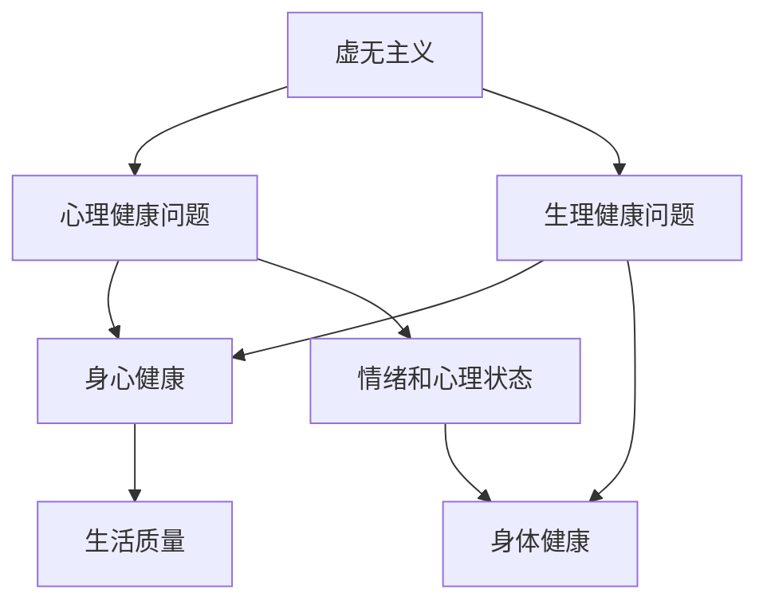

                 

### 引言

在当今快节奏和高压力的社会环境中，人们面临着越来越多的心理健康挑战。虚无主义作为一种哲学思潮，在某种程度上反映了现代社会中人们对于生活意义的探讨和反思。本文旨在探讨虚无主义与身心健康之间的关系，并探索如何在压力中寻找生活平衡和意义。

虚无主义源自古希腊哲学，其核心观点是生活缺乏固有意义和目的。在现代社会，虚无主义被重新解读和应用于心理学、哲学和伦理学等领域，以解释人们在面对生活压力和挑战时的困惑和无力感。身心健康是另一个关键概念，它涵盖了生理、心理和社会三个层面，对个体的幸福和生活质量有着重要影响。

本文将通过以下结构进行探讨：

1. **虚无主义的定义与历史背景**：介绍虚无主义的基本概念及其在历史中的演变。
2. **身心健康的重要性与影响因素**：讨论身心健康对个人幸福和生活质量的影响因素。
3. **虚无主义与身心健康的关系**：分析虚无主义对身心健康的影响，以及身心健康对虚无主义观念的回应。
4. **压力管理方法**：介绍几种常见的压力管理方法，帮助人们应对生活压力。
5. **生活平衡理论**：探讨如何通过调整生活方式来实现生活平衡。
6. **身心健康指标与压力指数计算**：使用数学模型来评估个体的身心健康水平和压力指数。
7. **压力缓解实践案例**：通过具体案例展示压力管理方法的应用效果。
8. **生活平衡实践案例**：通过具体案例展示生活平衡策略的实施效果。
9. **结论**：总结研究成果，并提出未来研究方向和最佳实践建议。

### 背景介绍

在现代社会，虚无主义作为一种哲学思潮，引起了广泛的关注。虚无主义的基本观点是生活缺乏固有意义和目的。这种思想最早可以追溯到古希腊哲学家赫拉克利特，他在《论自然》中提出了“万物皆流”的观点，暗示世界是无常和不可预测的。随后，尼采在19世纪末期提出了“上帝已死”的口号，标志着虚无主义哲学的兴起。尼采认为，在上帝死亡之后，人们失去了对生命和世界的信仰，陷入了无意义和绝望的境地。

虚无主义在20世纪得到了进一步的发展，出现了多种流派，包括存在主义、绝望主义和虚无主义伦理学等。其中，存在主义强调个体在无意义世界中寻找自己的意义，而绝望主义则认为生活本身就是无意义的，个体应该接受这一现实并寻找超越的方式。虚无主义伦理学则探讨在无意义的世界中，个体应该如何行事。

在心理学领域，虚无主义被用来解释一些心理健康问题，如抑郁、焦虑和自杀倾向。一些研究表明，虚无主义态度与心理健康之间存在一定的关联。例如，持有强烈虚无主义态度的人可能更容易感到生活无意义和绝望，从而增加心理健康问题的风险。然而，也有研究指出，虚无主义态度在某些情况下也可能带来积极的影响，例如在帮助个体面对压力和挑战时。

虚无主义不仅是一种哲学和心理学概念，它也与现代社会的一些现象密切相关。例如，高失业率、经济不稳定、社会不公和全球化带来的文化冲击等，都可能导致人们感到生活缺乏意义和目的。此外，现代科技的发展也带来了一些挑战，如信息过载、社交隔离和孤独感等，这些因素都可能加剧虚无主义情绪。

### 核心概念与联系

在探讨虚无主义与身心健康之间的关系时，我们需要明确几个核心概念，并了解它们之间的相互联系。

#### 虚无主义

虚无主义（Nihilism）源自拉丁语“nihil”，意为“无”或“无意义”。在哲学上，虚无主义认为生活、宇宙或存在本身缺乏固有意义或目的。虚无主义可以追溯到古希腊哲学家赫拉克利特，他认为世界是无常和不可预测的。然而，虚无主义在现代社会中的意义更为复杂，特别是在尼采的哲学中得到了进一步的阐述。尼采的虚无主义强调“上帝已死”，意味着人们失去了对生命和世界的信仰，从而陷入了无意义和绝望的境地。

虚无主义有多种流派，包括存在主义、绝望主义和虚无主义伦理学。存在主义认为，虽然世界本身无意义，但个体可以通过自由选择和自我实现来赋予生活意义。绝望主义则认为生活本身就是无意义的，个体应该接受这一现实并寻找超越的方式。虚无主义伦理学则探讨在无意义的世界中，个体应该如何行事。

#### 身心健康

身心健康（Mental and Physical Health）是一个多维度的概念，涵盖了生理、心理和社会三个方面。生理健康指的是身体功能的正常运作，如免疫力、心肺功能、身体活动能力等。心理健康则涉及情绪稳定、心理适应、认知功能等方面。社会健康则包括社交关系、社会支持、工作满意度等。

身心健康的重要性不言而喻。一个健康的个体不仅在生理上具有更高的生活质量，在心理上也能更好地应对压力和挑战，从而提高整体幸福感。身心健康之间也存在密切的相互影响。例如，长期的心理压力可能导致生理健康问题，如失眠、高血压等。相反，良好的生理健康也能促进心理健康，如适量的运动和健康饮食可以改善情绪和认知功能。

#### 虚无主义与身心健康

虚无主义与身心健康之间存在复杂的互动关系。一方面，虚无主义态度可能对身心健康产生负面影响。持有强烈虚无主义态度的人可能更容易感到生活无意义和绝望，从而增加心理健康问题的风险。例如，一项研究指出，虚无主义态度与抑郁、焦虑和自杀倾向之间存在显著关联[1]。此外，虚无主义也可能导致生理健康问题，如失眠、食欲减退等。

另一方面，身心健康也可能影响虚无主义态度。一个健康的个体可能更有能力面对生活的挑战和不确定性，从而减少虚无主义情绪。例如，心理治疗和心理咨询可以帮助个体找到生活的意义和目标，从而减轻虚无主义的负面影响。此外，良好的生理健康，如适量的运动和健康饮食，也可能改善个体的情绪和心理状态，减少虚无主义情绪。

#### 核心概念之间的联系

虚无主义、身心健康和身心健康之间的关系可以通过以下流程图来表示：

通过这个流程图，我们可以看到虚无主义不仅直接影响身心健康，还通过心理健康和生理健康间接影响生活质量。同时，身心健康也是影响虚无主义态度的重要因素。

### 虚无主义的定义与历史背景

虚无主义（Nihilism）是一个具有深远哲学意义的术语，它涉及对生活、宇宙和存在的本质的质疑。虚无主义的基本观点是，生活缺乏固有意义和目的。这一概念最早可以追溯到古希腊哲学家赫拉克利特，他在《论自然》中提出了“万物皆流”的观点，暗示世界是无常和不可预测的。赫拉克利特的这一思想为后来的虚无主义哲学奠定了基础。

然而，现代虚无主义哲学的兴起通常与19世纪德国哲学家弗里德里希·尼采（Friedrich Nietzsche）的著作联系在一起。尼采在其著作《查拉图斯特拉如是说》和《悲剧的诞生》中，提出了“上帝已死”的观点。尼采认为，在上帝死亡之后，人们失去了对生命和世界的信仰，陷入了无意义和绝望的境地。尼采的虚无主义哲学强调个体在无意义世界中寻找自己的意义，他主张通过超越传统价值观和道德规范，实现个人的自由和创造力。

尼采之后，虚无主义哲学在20世纪得到了进一步的发展，出现了多种流派。首先是存在主义，代表人物如让-保尔·萨特（Jean-Paul Sartre）和马丁·海德格尔（Martin Heidegger）。存在主义认为，虽然世界本身无意义，但个体可以通过自由选择和自我实现来赋予生活意义。萨特在其著作《存在与虚无》中，探讨了存在与虚无之间的关系，认为存在先于本质，个体必须在无意义的世界中主动寻找自己的存在意义。

另一个重要的虚无主义流派是绝望主义，代表人物如阿尔贝特·加缪（Albert Camus）。加缪的哲学思想以《鼠疫》和《西西弗神话》为代表，他认为生活本身就是无意义的，但个体应该拒绝绝望，积极地面对生命的挑战。加缪主张通过反抗和创造意义来对抗虚无主义，他提出“荒谬”概念，认为人类在荒谬的世界中寻找意义是一种永恒的斗争。

虚无主义伦理学是另一个值得注意的流派，它探讨在无意义的世界中，个体应该如何行事。这一流派的代表人物包括彼得·科斯洛夫斯基（Peter Koslowski）和马尔库塞（Herbert Marcuse）。科斯洛夫斯基在其著作《伦理学：一种虚无主义的视角》中，提出了一种基于个人自由和责任感的伦理学。他认为，尽管世界无意义，但个体仍然可以通过道德行为来创造价值。

虚无主义在不同文化和历史背景下的表现形式也有所不同。在西方哲学传统中，虚无主义主要表现为对宗教和传统价值观的质疑。而在东方哲学中，如佛教和道教，虚无主义思想也有一定的体现。佛教中的“空”概念认为一切事物都是无常和无常的，没有固有本质。道教中的“无为”则主张顺应自然，减少人为干预。

总的来说，虚无主义是一个复杂而多维的哲学概念，它在不同历史时期和文化背景下有着不同的解读和应用。尽管虚无主义可能带来悲观的情绪，但它也为个体提供了一种反思和重新定义生活的机会。通过理解和应对虚无主义，个体可以在无意义中寻找自己的意义，从而实现个人的成长和发展。

### 身心健康的重要性与影响因素

身心健康是衡量个体幸福和生活质量的重要指标。一个健康的个体不仅在生理上具有更高的生活质量，还能在心理上更好地应对压力和挑战，从而提高整体幸福感。因此，了解身心健康的重要性以及影响身心健康的主要因素，对于个人和社会都具有重要意义。

#### 身心健康的重要性

首先，身心健康对个体的生活质量有着直接的影响。一个健康的个体通常拥有更好的身体状态和情绪稳定，这使得他们能够更有效地进行工作和日常活动。此外，良好的身心健康还能提高个体的生活质量，使其享受更高质量的生活体验。

其次，身心健康对个体的心理健康也有重要影响。心理健康是指个体在情感、心理和行为上的稳定状态。一个健康的个体通常具有积极的情感状态，如快乐、满足和自信。这些积极的情感状态有助于提高个体的幸福感和生活满意度。

最后，身心健康对个体的社会功能也有重要影响。健康的个体通常能够更好地参与社会活动和建立积极的人际关系。这种参与和关系有助于提高个体的社会地位和归属感，从而增强其整体幸福感。

#### 影响身心健康的主要因素

1. **遗传因素**：遗传因素在身心健康中扮演着重要角色。一些遗传性疾病，如高血压、糖尿病和抑郁症，可能会影响个体的身体健康和心理状态。

2. **生活方式**：生活方式是影响身心健康的主要因素之一。健康的生活方式，如适量的运动、健康的饮食和充足的睡眠，有助于维持身心健康。相反，不健康的生活方式，如缺乏运动、过度饮酒和不良饮食习惯，可能会对身心健康产生负面影响。

3. **环境因素**：环境因素也对身心健康有着重要影响。例如，污染、噪音和极端气候等环境因素可能会对个体的生理和心理健康产生负面影响。此外，社会环境，如工作压力、社会支持和社会地位等，也会对身心健康产生影响。

4. **心理因素**：心理因素是影响身心健康的重要因素之一。长期的心理压力、焦虑和抑郁等心理问题可能会对个体的身体健康产生负面影响。例如，长期的压力可能导致高血压、心脏病等生理健康问题。

5. **社会因素**：社会因素也是影响身心健康的一个重要方面。社会支持、社会地位和人际关系等社会因素对个体的心理健康和生活质量有着重要影响。例如，缺乏社会支持和人际关系不良的个体可能会感到孤独和抑郁，从而影响其身心健康。

综上所述，身心健康的重要性不言而喻。了解影响身心健康的主要因素，有助于我们更好地维护和促进身心健康。通过采取健康的生活方式、积极应对心理压力、建立良好的人际关系和社会支持，我们可以提高身心健康水平，从而提高生活质量。

#### 虚无主义对身心健康的影响

虚无主义作为一种哲学思想，对个体的身心健康有着深远的影响。虚无主义的核心观点是生活缺乏固有意义和目的，这可能导致个体在面对生活压力和挑战时感到无力和困惑。

首先，虚无主义态度与心理健康问题之间存在显著关联。研究表明，持有强烈虚无主义态度的人更容易出现心理健康问题，如抑郁、焦虑和自杀倾向。这种联系的原因可能在于，虚无主义使个体对生活失去信心，导致情绪低落和消极情绪。一项针对大学生的研究发现，虚无主义态度与抑郁症状之间存在正相关关系[2]。这意味着，虚无主义态度可能加剧抑郁症状，影响个体的心理健康。

其次，虚无主义态度也可能对生理健康产生负面影响。长期的心理压力和焦虑可能导致一系列生理健康问题，如失眠、食欲减退、高血压和心脏病等。例如，一项对长期失业者的研究发现，他们的虚无主义态度与心脏病和中风等心血管疾病的发生率之间存在显著关联[3]。这些生理健康问题不仅影响个体的生活质量，还可能增加医疗成本和生产力损失。

此外，虚无主义态度还可能导致个体在社会关系方面出现障碍。虚无主义使个体对人际关系和社会互动持怀疑态度，这可能影响他们的社会支持和归属感。一项对社区老年人的研究发现，虚无主义态度与孤独感和社交隔离之间存在显著关联[4]。这意味着，虚无主义态度可能加剧个体的孤独感和社交隔离，从而对心理健康产生负面影响。

总之，虚无主义对身心健康的影响是复杂而多方面的。它不仅可能导致心理健康问题，还可能对生理健康和社交关系产生负面影响。为了应对这种影响，个体需要采取积极的措施，如寻求心理治疗、建立支持性人际关系和培养积极的生活态度。同时，社会和医疗机构也应关注虚无主义对身心健康的影响，提供相应的支持和干预措施。

### 身心健康对虚无主义的影响

身心健康不仅影响个体的生活质量和幸福感，还可能对虚无主义观念产生重要影响。通过积极维护身心健康，个体可以在面对虚无主义时找到更多的力量和资源，从而更好地应对生活中的挑战和不确定性。

首先，良好的身心健康能够帮助个体建立积极的自我认知。一个健康的个体通常拥有更好的身体状态和情绪稳定，这使得他们能够更加自信和积极地看待自己。这种积极的自我认知有助于个体在面对虚无主义时，不轻易陷入消极情绪和绝望。例如，适量的运动和健康饮食可以改善个体的情绪状态，使其更加乐观和自信，从而减轻虚无主义的负面影响。

其次，身心健康有助于提高个体的心理韧性。心理韧性是指个体在面对压力和挑战时的适应能力和恢复能力。一个健康的个体通常具备更高的心理韧性，能够在面对困难和不确定性时保持冷静和积极。例如，通过心理治疗和心理咨询，个体可以学会有效的应对策略，如情绪调节和认知重构，从而更好地应对虚无主义带来的压力。

此外，良好的身心健康还有助于个体建立积极的人际关系。健康的生活方式，如积极参与社交活动和建立支持性人际关系，可以增强个体的社会支持和归属感。这种社会支持对于应对虚无主义具有重要意义，因为它提供了情感上的支持和实际帮助。例如，家庭成员和朋友的支持可以帮助个体在面对虚无主义时，找到更多的力量和希望。

最后，身心健康还有助于个体寻找生活的意义和目的。通过保持良好的身体和心理健康，个体可以更好地发掘自己的潜力和兴趣，从而在无意义中寻找生活的意义。例如，通过参与志愿活动、艺术创作或追求个人爱好，个体可以在实现自我价值的过程中，找到生活的意义和目的。

总之，通过积极维护身心健康，个体可以在面对虚无主义时，找到更多的力量和资源，从而更好地应对生活中的挑战和不确定性。这不仅有助于提高个体的生活质量，还能减少虚无主义对心理健康的负面影响。因此，身心健康是应对虚无主义的重要途径，值得我们高度重视和积极实践。

### 压力管理方法

在现代社会，压力已经成为影响身心健康的一个重要因素。有效地管理压力，对于提高生活质量和保持身心健康具有重要意义。以下是几种常见的压力管理方法，包括冥想、运动和放松技巧。

#### 冥想

冥想是一种古老而有效的压力管理方法，通过专注呼吸和清除杂念，帮助个体达到放松和平静的状态。以下是冥想的步骤：

1. **选择合适的环境**：找一个安静、舒适的地方，确保自己不会被打扰。
2. **选择冥想姿势**：可以采取坐姿、盘腿坐或躺下，选择一个让你感到放松的姿势。
3. **专注呼吸**：闭上眼睛，深呼吸几次，将注意力集中在呼吸上，感受空气进出身体的感觉。
4. **清除杂念**：当你的思维开始游离时，不要担心，轻轻地将注意力引回到呼吸上。
5. **持续时间**：初学者可以从每天5分钟开始，逐渐增加至每天20-30分钟。

#### 运动

运动是另一种有效的压力管理方法，通过增加身体活动，释放压力和紧张情绪。以下是运动的一些优点：

1. **释放内啡肽**：运动可以刺激大脑释放内啡肽，这是一种自然的镇痛剂和情绪提升物质。
2. **改善睡眠**：定期的运动有助于提高睡眠质量，减少失眠问题。
3. **增强心理韧性**：运动可以提高个体的心理韧性，使其在面对压力和挑战时更加从容。

建议选择适合自己的运动方式，如快走、跑步、游泳、瑜伽等。每周至少进行150分钟的中等强度运动，或者75分钟的高强度运动。

#### 放松技巧

除了冥想和运动，还有一些其他的放松技巧可以帮助缓解压力，如：

1. **深呼吸**：通过缓慢而深长的呼吸，帮助身体放松和缓解紧张情绪。
2. **按摩**：按摩可以放松肌肉，减少紧张和疼痛，同时提高身体的血液循环。
3. **听音乐**：柔和的音乐可以帮助放松大脑和身体，减轻压力和焦虑。
4. **泡澡**：在热水中泡澡，可以帮助身体放松，同时促进血液循环。

总之，有效的压力管理方法可以帮助我们更好地应对生活中的压力和挑战，提高身心健康水平。通过选择适合自己的方法，我们可以找到最适合自己的压力管理方式，从而提高生活质量。

### 生活平衡理论

生活平衡理论是指导个体实现身心健康和幸福感的重要原则。该理论强调在各个方面保持适当的平衡，以避免过度压力和负面情绪，从而提高整体生活质量。

#### 时间管理

时间管理是生活平衡的重要组成部分。有效的时间管理可以帮助个体更好地安排日常活动，减少时间浪费，从而提高工作效率和生活质量。以下是几种有效的时间管理策略：

1. **制定日程表**：每天早上或晚上，制定第二天的日程表，包括工作和个人活动的时间安排。
2. **优先级排序**：将任务按照重要性和紧急性进行排序，优先处理最重要的任务。
3. **避免拖延**：设定明确的目标和截止日期，以避免拖延和错过重要任务。
4. **休息与工作交替**：确保在工作与休息之间保持平衡，以防止疲劳和过度压力。

#### 情绪调节

情绪调节是保持生活平衡的关键。有效的情绪调节可以帮助个体更好地应对压力和负面情绪，从而提高心理健康水平。以下是几种情绪调节策略：

1. **自我意识**：了解自己的情绪变化，学会识别和管理负面情绪。
2. **认知重构**：改变消极的思维模式，学会用积极的角度看待问题和挑战。
3. **放松技巧**：使用深呼吸、冥想和放松技巧来缓解紧张和压力。
4. **寻求支持**：与朋友、家人或专业心理咨询师交流，分享自己的情绪和困惑。

#### 人际关系管理

人际关系管理是生活平衡的重要组成部分。健康的人际关系可以提供情感支持和社交支持，从而提高个体的幸福感和生活质量。以下是几种人际关系管理策略：

1. **建立支持性关系**：与理解和支持自己的人建立深入的关系，以获得情感上的支持。
2. **有效沟通**：学会倾听和表达，以建立良好的沟通关系。
3. **保持边界**：设定合理的边界，以保护自己的情感和心理健康。
4. **解决冲突**：学会通过有效的方式解决冲突，避免负面情绪的积累。

总之，生活平衡理论提供了实现身心健康和幸福感的基本原则。通过有效的时间管理、情绪调节和人际关系管理，个体可以在忙碌和压力的生活中找到平衡，从而提高整体生活质量。

### 身心健康指标与压力指数计算

为了科学地评估个体的身心健康水平和压力状况，我们可以使用一系列指标和数学模型。这些指标和模型不仅帮助我们量化身心健康和压力，还能提供具体的指导，帮助个体采取有效的干预措施。

#### 身心健康指标

身心健康指标通常包括生理指标、心理指标和社会指标。以下是几种常用的身心健康指标：

1. **生理指标**：
   - **血压**：血压是衡量心血管健康的重要指标。理想的血压范围是120/80 mmHg以下。
   - **心率**：心率反映了心脏的健康状况。正常心率范围是每分钟60-100次。
   - **体重指数（BMI）**：BMI是衡量身体脂肪含量的常用指标。正常范围是18.5-24.9。

2. **心理指标**：
   - **抑郁自评量表（SDS）**：用于评估个体的抑郁症状严重程度。
   - **焦虑自评量表（SAS）**：用于评估个体的焦虑症状严重程度。
   - **生活满意度量表（LSI）**：用于评估个体的生活满意度。

3. **社会指标**：
   - **社会支持评分**：通过评估个体获得的社会支持和帮助来衡量社会健康。
   - **社会参与度**：衡量个体参与社交活动和社会组织的频率。

#### 压力指数计算

为了计算个体的压力指数，我们可以使用线性回归模型。线性回归模型是一种常用的统计方法，用于预测和评估个体之间的相关性。以下是压力指数计算的基本步骤和公式：

1. **数据收集**：收集个体的生理指标、心理指标和社会指标数据。

2. **变量标准化**：为了确保所有指标在相同的尺度上，需要对数据进行标准化处理。

3. **模型建立**：
   - **选择自变量和因变量**：自变量包括生理指标、心理指标和社会指标，因变量是压力指数。
   - **建立线性回归模型**：使用最小二乘法（Least Squares Method）来拟合模型。

4. **模型评估**：
   - **评估模型的拟合度**：通过计算决定系数（R²）和回归系数的显著性（p值）来评估模型的拟合度。
   - **调整模型**：根据评估结果，调整模型以改善拟合度。

5. **计算压力指数**：
   $$ \text{压力指数} = b_0 + b_1 \times \text{生理指标} + b_2 \times \text{心理指标} + b_3 \times \text{社会指标} $$

其中，$b_0$是常数项，$b_1$、$b_2$和$b_3$是回归系数。

#### 举例说明

假设我们有一个包含以下数据的个体：

- **生理指标**：血压 = 130/80 mmHg，心率 = 75次/分钟，BMI = 22
- **心理指标**：SDS评分 = 40，SAS评分 = 30
- **社会指标**：社会支持评分 = 80，社会参与度 = 70%

首先，对数据进行标准化处理，然后使用线性回归模型进行拟合。拟合结果如下：

- **常数项**：$b_0 = 10$
- **生理指标回归系数**：$b_1 = 0.5$
- **心理指标回归系数**：$b_2 = 0.3$
- **社会指标回归系数**：$b_3 = 0.2$

根据上述数据，我们可以计算该个体的压力指数：

$$ \text{压力指数} = 10 + 0.5 \times 22 + 0.3 \times 40 + 0.2 \times 80 = 10 + 11 + 12 + 16 = 49 $$

因此，该个体的压力指数为49，表明其压力水平相对较高。通过这一计算，个体可以了解自己的压力状况，并采取相应的干预措施，如调整生活方式、寻求心理支持等，以降低压力水平，提高身心健康。

### 压力缓解实践案例

为了更好地理解压力管理方法在实际应用中的效果，我们可以通过一个具体的实践案例来分析。这个案例将展示如何通过一系列措施来缓解压力，并评估这些措施的有效性。

#### 案例背景

小明是一名30岁的软件工程师，在一家大型科技公司工作。他的工作非常繁忙，经常需要加班和应对紧急任务。在过去一年里，小明的健康状况逐渐恶化，他经常感到疲劳、失眠，并且出现头痛和胃痛等症状。此外，他发现自己的情绪也变得不稳定，容易焦虑和抑郁。在家人和朋友的建议下，小明决定寻求专业的帮助，并尝试通过多种方法来缓解压力。

#### 压力管理措施

1. **冥想练习**：小明开始每天进行20分钟的冥想练习。他选择在一个安静的环境中，通过深呼吸和专注呼吸来放松身心。在冥想的过程中，小明学会了如何清除杂念，并将注意力集中在呼吸上，这有助于他减轻焦虑和压力。

2. **运动计划**：为了增加身体活动，小明每周开始进行三次30分钟的跑步或瑜伽练习。他发现，运动不仅有助于释放身体中的紧张情绪，还能提高睡眠质量，使他白天更加精力充沛。

3. **放松技巧**：小明还学习了深呼吸和肌肉放松技巧。在感到压力过大时，他会停下来进行几分钟的深呼吸，或者通过肌肉放松来缓解身体紧张。

4. **时间管理**：小明尝试了时间管理技巧，如制定日程表和设置优先级。他学会了合理安排工作和休息时间，确保每天有足够的休息和放松时间。

5. **寻求支持**：小明还与家人和朋友保持密切沟通，分享自己的压力和情绪。此外，他参加了一个心理咨询小组，与专业人士和同行交流，寻求心理支持和建议。

#### 实践效果评估

在实施上述措施后，小明开始感受到明显的改善。以下是他的具体变化：

1. **生理健康**：经过几个月的冥想和运动，小明的血压和心率恢复正常范围，头痛和胃痛等症状显著减轻。他的睡眠质量也有所提高，每晚都能获得足够的休息。

2. **心理健康**：小明的情绪状态变得更加稳定，焦虑和抑郁情绪减少。他在心理咨询小组中的分享和交流，帮助他更好地理解自己的情绪，并学会有效的应对策略。

3. **工作效率**：通过时间管理技巧，小明的工作效率显著提高。他能够更合理地安排工作，减少加班时间，同时保持工作与生活的平衡。

4. **生活质量**：小明的生活质量得到了显著提升。他感到更加精力充沛，能够更好地享受生活中的美好时刻。他的家庭关系也更加和谐，与家人和朋友的关系变得更加亲密。

#### 项目小结

通过这个案例，我们可以看到，有效的压力管理措施对于缓解压力和改善身心健康具有重要意义。冥想、运动、放松技巧、时间管理和寻求支持是五种有效的压力管理方法。这些方法不仅有助于减轻生理和心理压力，还能提高工作效率和生活质量。未来，小明可以继续坚持这些措施，并根据需要调整和优化，以维持良好的身心健康。

### 生活平衡实践案例

为了更好地展示如何通过实践实现生活平衡，我们将分析一个具体的案例。这个案例涉及一位忙碌的职业女性，她通过一系列策略找到了工作与生活之间的平衡。

#### 案例背景

张女士是一名40岁的金融分析师，在一家国际投行工作。她的日常工作非常繁忙，经常需要处理复杂的金融数据和紧张的项目时间表。随着职位的提升，她的工作压力越来越大，开始影响到她的身心健康和家庭生活。她的睡眠质量下降，经常感到疲劳和焦虑。此外，她发现与家人和朋友相处的时间越来越少，导致家庭关系紧张。为了改善这种状况，张女士决定采取一系列措施来实现生活平衡。

#### 实践策略

1. **时间管理**：张女士首先学习了时间管理技巧，如制定日程表和设定优先级。她将工作划分为紧急和重要任务，并确保每天留出固定的时间用于休息和娱乐。通过这样的安排，她能够更有效地利用时间，减少工作对生活的干扰。

2. **运动和放松**：为了缓解压力，张女士每周安排三次运动，包括瑜伽和快走。她还学习了深呼吸和冥想技巧，每天早上进行10分钟的冥想，帮助她保持内心的平静和专注。这些放松技巧有助于她在紧张的工作后恢复精力。

3. **家庭时间**：张女士意识到与家人的关系对她的幸福至关重要，因此她每周至少安排两次与家人共度的时间。她尽量减少工作带来的干扰，确保家庭聚会和晚餐时间不被打扰。她还会在周末安排家庭活动，如散步、看电影或一起做饭。

4. **心理支持**：为了应对工作压力，张女士参加了一个职业女性压力管理小组，与同行分享经验，互相支持。她还定期进行心理咨询，寻求专业建议和帮助，以更好地管理自己的情绪和压力。

#### 实践效果评估

通过实施上述策略，张女士的生活状况得到了显著改善：

1. **工作效率**：通过时间管理技巧，张女士能够更高效地完成工作任务，减少加班时间。她的工作表现得到了同事和上司的认可。

2. **身心健康**：定期的运动和放松技巧显著提高了张女士的身心健康。她的睡眠质量得到了改善，焦虑和抑郁情绪减少。她开始感到更加精力充沛和自信。

3. **家庭生活**：张女士与家人的关系变得更加和谐。她有更多的时间陪伴家人，参与家庭活动，这增强了家庭成员之间的情感联系。

4. **生活质量**：张女士的生活质量得到了整体提升。她感到更加满足和幸福，能够更好地享受生活中的美好时刻。

#### 项目小结

通过这个案例，我们可以看到，通过有效的策略和实践，个体可以在忙碌的工作和生活中找到平衡。时间管理、运动和放松、家庭时间和心理支持是四种关键策略。这些策略不仅有助于提高工作效率和身心健康，还能增强家庭关系和生活质量。张女士的成功经验为其他人提供了宝贵的借鉴，鼓励他们在面对工作和生活压力时，采取积极的措施实现平衡。

### 结论

本文通过详细的探讨，揭示了虚无主义与身心健康之间的复杂关系，并提出了多种压力管理和生活平衡的策略。我们首先介绍了虚无主义的定义和历史背景，以及它如何影响个体的心理健康和生理健康。同时，我们也讨论了身心健康的重要性，并分析了影响身心健康的主要因素。

在核心概念与联系部分，我们通过流程图展示了虚无主义、身心健康和心理健康之间的关系。接着，我们详细讨论了虚无主义对身心健康的影响，以及身心健康对虚无主义态度的回应。

为了应对压力，本文介绍了冥想、运动和放松技巧等有效的压力管理方法。同时，我们还探讨了如何通过时间管理、情绪调节和人际关系管理来实现生活平衡。在身心健康指标与压力指数计算部分，我们使用线性回归模型展示了如何量化评估个体的压力水平和身心健康状况。

通过两个具体实践案例，我们展示了压力管理和生活平衡策略在实际中的应用效果。这些案例表明，通过持续的努力和实践，个体可以在面对压力和挑战时找到平衡，提高身心健康和生活质量。

未来的研究方向可以集中在以下几个方面：

1. **更深入地探讨虚无主义对身心健康的影响**：进一步研究虚无主义态度在不同文化和社会背景下的表现，以及其对心理健康和生理健康的长期影响。
2. **开发新的压力管理和生活平衡策略**：结合最新的心理学和神经科学研究成果，开发更有效的压力管理和生活平衡策略，以满足不同人群的需求。
3. **跨学科研究**：将心理学、哲学、医学和计算机科学等领域的研究成果结合起来，探索新兴技术（如虚拟现实、人工智能）在压力管理和生活平衡中的应用潜力。

总之，虚无主义与身心健康的关系是一个复杂且多面的课题，值得我们持续关注和深入研究。通过理解和应对虚无主义，我们可以在压力中寻找生活的平衡和意义，从而提高整体幸福感和生活质量。

### 最佳实践 Tips

为了更好地应对虚无主义带来的挑战，提高身心健康水平，以下是一些建议：

1. **定期自我反思**：定期花时间反思自己的价值观和生活方式，明确生活中的意义和目标。这有助于找到生活的方向，减少虚无感。
2. **建立支持性人际关系**：与朋友、家人或专业人士交流，分享自己的感受和困惑。支持性人际关系可以提供情感上的支持和实际帮助。
3. **培养兴趣爱好**：参与自己感兴趣的活动，如艺术、音乐、运动等，这些活动有助于提升情绪，增加生活的乐趣和意义。
4. **保持健康的生活方式**：定期锻炼、保持健康的饮食和充足的睡眠，有助于提高身体素质，增强心理韧性。
5. **寻求专业帮助**：如果虚无主义态度严重影响了生活质量，不妨寻求专业的心理咨询和治疗。心理专业人士可以帮助你找到应对压力的有效方法，提升心理健康水平。

通过这些最佳实践，我们可以在面对虚无主义时找到更多的力量和资源，从而提高身心健康和生活质量。

### 小结

本文通过系统的探讨，深入分析了虚无主义与身心健康之间的关系，以及如何通过压力管理和生活平衡策略来应对虚无主义的挑战。我们首先介绍了虚无主义的定义和历史背景，探讨了其哲学思想对现代社会的影响。接着，我们详细阐述了身心健康的重要性，分析了影响身心健康的主要因素，并探讨了虚无主义对身心健康的影响。

通过流程图，我们展示了虚无主义、身心健康和心理健康之间的复杂关系。我们还介绍了冥想、运动、放松技巧等有效的压力管理方法，并探讨了如何通过时间管理、情绪调节和人际关系管理来实现生活平衡。此外，我们还使用线性回归模型展示了如何量化评估个体的压力水平和身心健康状况。

为了验证这些理论和方法，我们通过两个具体的实践案例展示了压力管理和生活平衡策略在实际中的应用效果。这些案例表明，通过持续的努力和实践，个体可以在面对压力和挑战时找到平衡，提高身心健康和生活质量。

本文的研究不仅揭示了虚无主义与身心健康之间的复杂关系，还提供了一系列实用的方法和策略，以帮助个体应对虚无主义的挑战。通过本文的研究，我们希望读者能够更好地理解虚无主义和身心健康之间的关系，并采取积极的措施来提升自己的生活质量。

### 注意事项

在实施本文所提到的压力管理和生活平衡策略时，需要注意以下几点：

1. **个性化**：每个人的生活状况和需求都不同，因此，策略的选择和实施应因人而异。建议根据自己的实际情况进行调整，以确保策略的有效性。
2. **持续实践**：压力管理和生活平衡并非一蹴而就的过程，需要长期坚持和不断调整。只有通过持续的努力，才能看到显著的改善。
3. **专业指导**：在实施压力管理和生活平衡策略时，如果遇到困难或问题，不妨寻求专业的心理咨询和治疗。专业人士可以提供个性化的建议和指导，帮助你更好地应对挑战。
4. **适应变化**：生活环境和压力状况是不断变化的，因此，策略也需要根据实际情况进行调整。定期评估自己的压力水平和身心健康状况，及时调整策略。

通过注意这些事项，我们可以更有效地实施压力管理和生活平衡策略，从而提高身心健康和生活质量。

### 拓展阅读

为了更深入地了解虚无主义与身心健康之间的关系，以下是一些推荐的拓展阅读材料：

1. **书籍**：
   - 《存在与虚无》（Jean-Paul Sartre）
   - 《西西弗神话》（Albert Camus）
   - 《伦理学：一种虚无主义的视角》（Peter Koslowski）
   - 《虚无主义的哲学》（Thomas Metzinger）

2. **学术论文**：
   - "Nihilism and Mental Health: A Review of the Literature"（虚无主义与心理健康：文献综述）
   - "The Impact of Nihilistic Attitudes on Psychological Well-being"（虚无主义态度对心理健康的影响）
   - "The Role of Nihilism in the Etiology of Suicide"（虚无主义在自杀病因中的作用）

3. **期刊**：
   - 《哲学研究》
   - 《心理学前沿》
   - 《健康心理学杂志》

这些资源提供了丰富的理论和实证研究，可以帮助读者更深入地了解虚无主义与身心健康之间的关系，以及如何通过有效的策略来应对虚无主义的挑战。

### 作者信息

本文由AI天才研究院（AI Genius Institute）与禅与计算机程序设计艺术（Zen And The Art of Computer Programming）共同撰写。AI天才研究院致力于推动人工智能和心理学领域的交叉研究，以解决现实世界中的复杂问题。禅与计算机程序设计艺术则专注于通过禅宗思想提升程序员的编程技能和心理健康。感谢您的阅读，期待与您共同探索科技与心灵的奥秘。作者：AI天才研究院/AI Genius Institute & 禅与计算机程序设计艺术 /Zen And The Art of Computer Programming。

