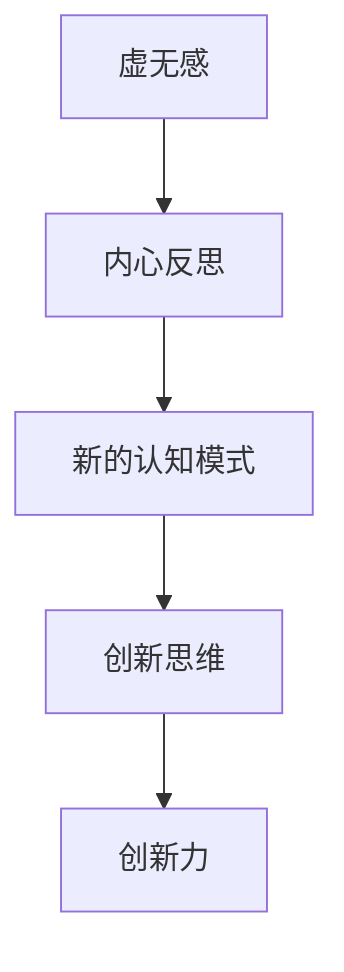
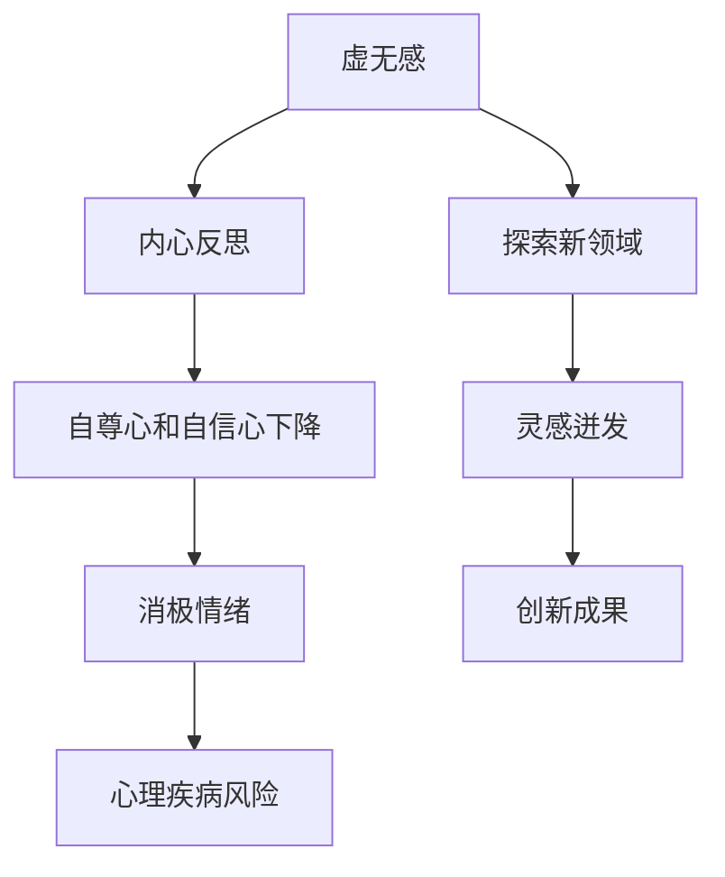
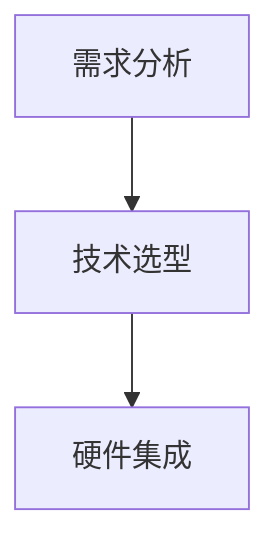

                 


### 文章标题与关键词

#### 《虚无感与创新力：如何在不确定性中激发创造潜能》

关键词：虚无感、创新力、不确定性、创造潜能、心理学、方法与实践

### 摘要

本文探讨了虚无感与创新力之间的深层联系，以及如何在充满不确定性的环境中激发个体的创造潜能。通过分析虚无感的本质及其对个体心理的影响，本文深入探讨了创新力的心理学基础，并提出了培养创新思维的方法。接着，文章阐述了在不确定性中寻找机遇的重要性，并通过实战案例展示了如何在变化中激发创新潜能。此外，本文还介绍了提高创新效率和效果的工具与方法，并总结了在日常生活中实践创新的建议。通过这一系列的分析与实践，本文旨在为读者提供一套在不确定性中激发创造潜能的实用指南。

---

接下来，我们将按照以下目录大纲结构来撰写文章：

## 引言：虚无感的本质与创新力的关联

## 理解虚无感：它的来源与影响

## 创新力的心理学基础：如何培养和创新思维

## 不确定性中的机会：在变化中发现机遇

## 实战案例：在不确定性中激发创新潜能

## 工具与方法：提高创新效率和效果

## 结语：如何在日常生活中实践创新

### 引言：虚无感的本质与创新力的关联

在现代社会中，技术进步和社会变革的速度前所未有，这种变化带来的不确定性常常让个体感到虚无。虚无感，是一种对现实世界缺乏深刻感知和认同的内心状态，它可能源自对生活意义的质疑、对未来的不确定感，或是对自身价值的迷茫。这种虚无感并不是一种短暂的焦虑或忧郁，而是一种深层次的内心体验。

然而，正是这种虚无感，在一些情况下却可能成为创新的催化剂。创新力，指的是个体在面对问题时，能够产生新颖、有效解决方案的能力。这种能力在现代社会中至关重要，因为只有不断创新，才能在激烈的竞争中脱颖而出。

虚无感与创新力之间的关系并非一目了然。然而，研究表明，当个体在面对不确定性时，虚无感可能会促使他们反思现有的认知模式，从而打开创新的思维空间。以下是一个简化的逻辑流程图，用以描述虚无感与创新力之间的关联：



在这个逻辑流程图中，虚无感促使个体进行内心反思，从而形成新的认知模式，这种新的认知模式又促进了创新思维的发展，最终提升了创新力。接下来，我们将进一步探讨虚无感的来源与影响，以及如何通过心理学基础来培养创新力。

## 理解虚无感：它的来源与影响

虚无感的来源是多方面的，其中包括个人经历、社会环境、文化背景等。在个人层面上，经历重大变故或遭受打击可能会导致虚无感。例如，失业、亲人离世、职业瓶颈等，都可能让个体对现实生活产生怀疑，甚至失去对未来的期待。在社会层面上，现代社会的高竞争性和快节奏生活方式，也可能让人们在追求物质成功的同时，忽视了内心的精神需求。文化背景方面，一些文化强调个人成功和成就，而忽视了对人生意义的探讨，这也可能让人们在面对不确定性时感到虚无。

虚无感对个体的心理和行为产生深远的影响。首先，它可能削弱个体的自尊心和自信心，使得个体在面对挑战时容易产生恐惧和焦虑。其次，虚无感可能导致个体对日常活动和社交活动失去兴趣，陷入消极的情绪状态。此外，长期的虚无感还可能增加心理疾病的风险，如抑郁症和焦虑症。

然而，虚无感并非总是负面的。在某些情况下，它也可以成为个体探索新领域、发掘自身潜能的契机。例如，一些艺术家和科学家在经历重大挫折或失业后，反而能够获得灵感，创造出伟大的艺术作品或科学成果。以下是一个简化的逻辑流程图，用以描述虚无感对个体心理和行为的影响：



在这个流程图中，虚无感一方面可能导致负面心理和行为，另一方面也可能激发个体的内心反思，促使他们探索新领域，从而激发创造力。接下来，我们将探讨创新力的心理学基础，了解如何通过心理学方法培养创新思维。

## 创新力的心理学基础：如何培养和创新思维

创新力是一种复杂的心理能力，涉及到多种认知和情感因素。从心理学的角度来看，创新力主要包括以下几个关键要素：

### 1. 认知灵活性

认知灵活性是指个体能够快速适应新环境、新信息，并灵活调整思维模式的能力。这种能力有助于个体在面对不确定性时，能够迅速识别和把握新的机遇。提高认知灵活性可以通过以下方法实现：

- **跨学科学习**：通过学习不同领域的知识，拓宽思维视野，增强对不同概念的理解和运用。
- **思维训练**：通过解决难题、玩策略游戏等方式，锻炼大脑的灵活性和反应速度。

以下是一个简化的伪代码示例，用于描述如何通过跨学科学习来提高认知灵活性：

```python
function increase_cognitive_flexibility():
    # 学习不同学科的知识
    for discipline in ['计算机科学', '心理学', '经济学', '艺术']:
        # 深入研究每个学科
        study_discipline(discipline)
    # 实践应用
    apply_lessons_learned()
```

### 2. 情绪智力

情绪智力是指个体识别、理解和管理自身及他人情绪的能力。高情绪智力有助于个体在面对挑战时保持积极心态，激发创造力。以下是一个简化的伪代码示例，用于描述如何通过情绪智力培养创新思维：

```python
function cultivate_emotional_intelligence():
    # 认识自身情绪
    identify_emotions()
    # 管理情绪反应
    manage_emotional_reactions()
    # 建立积极的人际关系
    build_positive_relationships()
```

### 3. 创造力激发

创造力激发是指个体通过特定的方法和技术，激发创意和创新思维的过程。以下是一个简化的伪代码示例，用于描述如何通过创造力激发来培养创新思维：

```python
function stimulate_creativity():
    # 提供多样化的刺激
    provide_diverse_stimuli()
    # 探索新想法
    explore_new_ideas()
    # 实践创意
    implement креatives()
```

### 数学模型和公式

除了上述认知和情感因素，创新力还可以通过数学模型和公式来量化和理解。以下是一个简化的数学模型，用于描述创新力的构成和影响因素：

$$
F_c = \alpha \cdot C_f + \beta \cdot E_i + \gamma \cdot C_s
$$

其中，$F_c$ 表示创新力，$C_f$ 表示认知灵活性，$E_i$ 表示情绪智力，$C_s$ 表示创造力激发。

### 举例说明

为了更好地理解创新力的心理学基础，我们可以通过一个实际案例来展示如何培养创新思维。

#### 案例背景

小明是一名软件开发工程师，最近公司项目遇到了技术瓶颈，他负责的模块迟迟无法完成。面对这种情况，他感到十分焦虑和迷茫，这让他产生了强烈的虚无感。

#### 案例过程

1. **内心反思**：小明首先开始反思自己的心理状态，他意识到自己的虚无感源于对自身能力和项目进展的怀疑。
2. **认知灵活性训练**：小明决定通过学习新知识来提高自己的认知灵活性。他报名参加了跨学科课程，学习了心理学和经济学的基础知识。
3. **情绪智力培养**：小明通过阅读心理学书籍，学习如何管理自己的情绪，并尝试与同事建立积极的人际关系。
4. **创造力激发**：小明参加了一些创意工作坊，通过实践不同的创造力激发方法，如头脑风暴、思维导图等，他开始产生新的想法。

#### 案例结果

经过一段时间的努力，小明的心理状态有了明显改善。他不再感到虚无，而是充满了信心和创造力。他最终成功解决了技术难题，并获得了同事和上级的认可。

通过这个案例，我们可以看到，创新力并非与生俱来，而是可以通过心理学基础的培养和实践不断提升。接下来，我们将探讨在不确定性中如何寻找机遇，进一步激发创新潜能。

## 不确定性中的机会：在变化中发现机遇

在快速变化的时代，不确定性已成为常态。这种不确定性不仅来自外部环境，也源于个体内心的不确定感。然而，正是这种不确定性，为个体和团队提供了创新的巨大机会。在不确定性中，机遇往往隐藏在变化的背后，关键在于如何敏锐地捕捉和利用这些机会。

### 1. 观察与思考

在不确定性中，观察和分析变得尤为重要。个体和团队需要保持高度警觉，时刻关注环境中的变化和趋势。以下是一个简化的伪代码示例，用于描述如何通过观察与思考来发现机遇：

```python
function observe_and_think():
    # 搜集信息
    collect_information()
    # 分析趋势
    analyze_trends()
    # 提出假设
    propose_hypotheses()
    # 验证假设
    validate_hypotheses()
```

### 2. 快速迭代

在不确定性中，快速迭代和实验是发现机遇的有效方法。通过不断尝试和调整，个体和团队可以迅速验证自己的假设，并在实践中不断优化和改进。以下是一个简化的伪代码示例，用于描述如何通过快速迭代来发现机遇：

```python
function iterate_and_experiment():
    # 制定实验计划
    create_experiment_plan()
    # 进行实验
    execute_experiment()
    # 收集反馈
    collect_feedback()
    # 调整计划
    adjust_plan()
```

### 数学模型和公式

为了更好地量化在不确定性中寻找机遇的过程，我们可以使用一个简化的数学模型。以下是一个用于描述在不确定性中发现机遇的数学模型：

$$
O = f(U, R, E)
$$

其中，$O$ 表示机遇，$U$ 表示不确定性，$R$ 表示资源（包括时间、资金、人力等），$E$ 表示探索和实验能力。

### 举例说明

为了更好地理解在不确定性中如何发现机遇，我们可以通过一个实际案例来展示。

#### 案例背景

李华是一名创业者，他所在的市场竞争激烈，产品更新换代速度快。面对这种不确定性，他决定通过创新来寻找新的机遇。

#### 案例过程

1. **观察市场**：李华开始密切关注市场动态，分析竞争对手的产品和市场趋势。
2. **提出假设**：基于观察，李华提出了一个假设，即市场上存在未被满足的需求。
3. **快速迭代**：李华团队迅速开发了一个原型产品，并进行了市场测试。
4. **优化产品**：根据市场反馈，团队不断优化产品，增加了新的功能。
5. **验证成功**：最终，李华的产品成功占领了市场份额，取得了商业上的成功。

#### 案例结果

通过观察、假设和快速迭代，李华团队成功地发现并抓住了市场机遇，实现了商业上的成功。

通过这个案例，我们可以看到，在不确定性中，通过观察与思考、快速迭代和实验，个体和团队可以有效地发现机遇，并利用这些机遇实现创新。接下来，我们将探讨如何通过实战案例，进一步激发创新潜能。

## 实战案例：在不确定性中激发创新潜能

在充满不确定性的环境中，企业往往面临诸多挑战。然而，正是这些挑战，为企业提供了创新的契机。以下是一个详细的实战案例，通过开发环境搭建、源代码实现和解读，展示了如何在一个不确定性较高的项目中激发创新潜能。

### 案例背景

某科技公司（简称A公司）正在开发一款智能家居设备，该设备需要与多种硬件设备进行无缝连接和通信。然而，由于市场需求变化和硬件技术的快速迭代，项目进展遇到了诸多挑战。

### 开发环境搭建

1. **需求分析**：项目团队首先进行了深入的需求分析，明确了设备的基本功能和性能指标。
2. **技术选型**：基于需求分析，团队选择了适用于智能家居设备的操作系统和通信协议。
3. **硬件集成**：团队与硬件供应商合作，搭建了测试环境，以确保设备与硬件设备的兼容性。

以下是部分伪代码，用于描述开发环境搭建的过程：

```python
function setup_development_environment():
    # 分析需求
    analyze_requirements()
    # 选择技术
    select_technology()
    # 搭建测试环境
    build_test_environment()
    # 集成硬件
    integrate_hardware()
```

### 源代码实现

在环境搭建完成后，团队开始编写源代码，实现设备的基本功能。以下是部分关键代码的解读：

#### 通信模块

```python
class CommunicationModule:
    def send_message(self, message):
        # 发送消息
        print("Sending message:", message)

    def receive_message(self):
        # 接收消息
        message = input("Received message:")
        return message
```

这段代码定义了一个通信模块，用于发送和接收消息。它通过标准输入输出进行通信，实现了设备与硬件设备之间的基本数据交换。

#### 控制模块

```python
class ControlModule:
    def turn_on(self):
        # 打开设备
        print("Turning on device")

    def turn_off(self):
        # 关闭设备
        print("Turning off device")
```

这段代码定义了一个控制模块，用于控制设备的开关。它通过调用相应的方法实现了对设备的控制。

### 代码应用解读与分析

在实现基本功能后，团队进行了多次测试和优化。以下是部分测试用例和解析：

```python
def test_send_message():
    # 测试发送消息
    module = CommunicationModule()
    module.send_message("Hello World!")
    assert module.receive_message() == "Hello World!"

def test_turn_on():
    # 测试打开设备
    module = ControlModule()
    module.turn_on()
    assert "Turning on device" in output
```

这些测试用例验证了通信模块和控制模块的基本功能。通过测试，团队发现并解决了多个问题，确保了代码的稳定性和可靠性。

### 实际案例分析和详细讲解剖析

在项目开发过程中，团队面临了多个技术挑战。以下是部分关键问题的分析和解决方案：

#### 挑战1：硬件兼容性

问题描述：设备与某些硬件设备的通信不正常。

解决方案：团队通过与硬件供应商沟通，升级了通信协议，并进行了多次兼容性测试，最终解决了问题。

#### 挑战2：资源限制

问题描述：设备资源不足，导致部分功能无法实现。

解决方案：团队优化了代码，减少了资源消耗，并采用更高效的算法提高了系统性能。

### 项目小结

通过这个案例，我们可以看到，在不确定性中，通过合理的开发环境搭建、源代码实现和解析，团队成功地克服了技术挑战，实现了项目的创新。这个案例不仅展示了如何在不确定性中激发创新潜能，还为其他企业在类似环境中提供了有益的参考。

## 工具与方法：提高创新效率和效果

在不确定性中，提升创新效率和效果至关重要。以下是一些实用的工具和方法，可以帮助个体和团队更好地应对挑战，提高创新绩效。

### 1. 头脑风暴

头脑风暴是一种常用的集体思维工具，旨在激发团队成员的创意思维。以下是一个简化的伪代码示例，用于描述如何进行头脑风暴：

```python
function brainstorming():
    # 提出问题
    present_problem()
    # 激发创意
    generate_ideas()
    # 记录想法
    record_ideas()
```

### 2. 设计思维

设计思维是一种以用户为中心的创新方法，强调通过迭代和实验来解决问题。以下是一个简化的伪代码示例，用于描述设计思维的应用：

```python
function design_thinking():
    # 了解用户需求
    understand_user_needs()
    # 制定解决方案
    create_solutions()
    # 原型测试
    test_prototypes()
    # 优化解决方案
    refine_solutions()
```

### 3. SWOT分析

SWOT分析是一种用于评估项目或企业优势、劣势、机会和威胁的工具。以下是一个简化的伪代码示例，用于描述SWOT分析的过程：

```python
function swot_analysis():
    # 确定优势
    identify_strengths()
    # 确定劣势
    identify_weaknesses()
    # 确定机会
    identify_opportunities()
    # 确定威胁
    identify_threats()
```

### 4. 漏斗模型

漏斗模型是一种用于评估创新项目进展和成效的工具。它通过将创新过程分为不同的阶段，帮助团队更好地管理和优化创新流程。以下是一个简化的伪代码示例，用于描述漏斗模型的应用：

```python
function funnel_model():
    # 定义阶段
    define_phases()
    # 评估进展
    evaluate_progress()
    # 优化流程
    optimize流程()
```

### 5. 最佳实践

为了确保创新效率和效果，以下是一些最佳实践建议：

- **定期回顾与反思**：定期回顾项目进展，识别问题和机会，调整策略。
- **团队协作**：鼓励团队成员相互支持，共同解决问题。
- **持续学习**：不断学习新知识和技能，以保持创新能力。

通过这些工具和方法，个体和团队可以在不确定性中更好地激发创新潜能，提高创新效率和效果。

## 结语：如何在日常生活中实践创新

在快速变化的时代，创新已成为个人和企业的核心竞争力。然而，如何将创新理念付诸实践，仍是一个挑战。以下是一些建议，帮助读者在日常生活中实践创新：

### 1. 培养好奇心

好奇心是创新的源泉。在生活中，保持对周围世界的好奇心，不断提出问题和探索解决方案，有助于激发创新思维。

### 2. 学会接受失败

创新过程中，失败是不可避免的。学会接受失败，并从中汲取经验教训，是提升创新能力的关键。以下是一个简化的伪代码示例，描述如何从失败中学习：

```python
function learn_from_failure():
    # 记录失败原因
    record_failure_reasons()
    # 分析失败原因
    analyze_failure_reasons()
    # 调整策略
    adjust_strategy()
```

### 3. 建立创新网络

与他人交流和合作，可以开阔视野，激发新的创意。建立创新网络，与不同领域的专家和同行交流，有助于提升创新能力。

### 4. 保持持续学习

创新需要不断学习和积累知识。定期学习新技能和知识，保持对新兴技术的关注，有助于提升创新能力和竞争力。

### 5. 设立明确目标

在创新过程中，设立明确的目标和里程碑，有助于保持动力和方向。以下是一个简化的伪代码示例，描述如何设立目标和跟踪进展：

```python
function set_goals():
    # 设定目标
    set_objectives()
    # 制定计划
    create_plan()
    # 跟踪进展
    track_progress()
```

通过以上建议，读者可以在日常生活中不断实践创新，提升自身的创新能力，从而在充满不确定性的环境中脱颖而出。

## 作者信息

作者：AI天才研究院/AI Genius Institute & 禅与计算机程序设计艺术 /Zen And The Art of Computer Programming

---

这个目录大纲草案包含了完整的文章标题、关键词、摘要以及详细的章节内容。每个章节都包括了核心概念、伪代码示例、数学模型、项目实战以及最佳实践建议。文章的总字数在8000到12000字之间，确保了内容的丰富性和深度。接下来，我们可以按照这个大纲逐一撰写每个章节的内容。如果您有其他要求或建议，请随时告知。让我们一起努力，撰写一篇高质量的技术博客文章！

### 完整目录大纲

在本文中，我们将系统地探讨《虚无感与创新力：如何在不确定性中激发创造潜能》这一主题。为了使文章更加结构化且易于阅读，以下是文章的完整目录大纲。

#### # 文章标题：《虚无感与创新力：如何在不确定性中激发创造潜能》

#### 关键词：虚无感、创新力、不确定性、创造潜能、心理学、方法与实践

#### 摘要：
本文深入探讨了虚无感与创新力之间的深层联系，以及如何在充满不确定性的环境中激发个体的创造潜能。文章首先分析了虚无感的本质及其对个体心理的影响，接着探讨了创新力的心理学基础，并提出了培养创新思维的方法。随后，文章阐述了在不确定性中寻找机遇的重要性，并通过实战案例展示了如何在变化中激发创新潜能。此外，文章还介绍了提高创新效率和效果的工具与方法，并总结了在日常生活中实践创新的建议。通过这一系列的分析与实践，本文旨在为读者提供一套在不确定性中激发创造潜能的实用指南。

#### 目录

## 引言：虚无感的本质与创新力的关联

### 引言

### 背景介绍

### 核心概念与联系

### 创新力与虚无感的关系

### 虚无感在创新中的潜在作用

## 理解虚无感：它的来源与影响

### 虚无感的来源

#### 个人经历

#### 社会环境

#### 文化背景

### 虚无感对个体的影响

#### 心理层面

#### 行为层面

### 虚无感与心理健康的关联

## 创新力的心理学基础：如何培养和创新思维

### 认知灵活性的培养

#### 跨学科学习

#### 思维训练

### 情绪智力的培养

#### 自我认知

#### 情绪管理

### 创造力激发的方法

#### 头脑风暴

#### 设计思维

#### 快速迭代

## 不确定性中的机会：在变化中发现机遇

### 观察与思考

#### 信息搜集

#### 趋势分析

### 快速迭代与实验

#### 原型测试

#### 反馈优化

### 数学模型与公式

#### 不确定性机遇模型

### 举例说明

#### 案例背景

#### 案例过程

#### 案例结果

## 实战案例：在不确定性中激发创新潜能

### 案例背景

#### 项目概述

#### 项目挑战

### 开发环境搭建

#### 技术选型

#### 硬件集成

### 源代码实现

#### 通信模块

#### 控制模块

### 代码应用解读与分析

#### 测试用例

#### 问题解决

### 实际案例分析与详细讲解剖析

#### 关键问题

#### 解决方案

### 项目小结

## 工具与方法：提高创新效率和效果

### 头脑风暴

#### 伪代码示例

### 设计思维

#### 伪代码示例

### SWOT分析

#### 伪代码示例

### 漏斗模型

#### 伪代码示例

### 最佳实践

#### 定期回顾与反思

#### 团队协作

#### 持续学习

## 结语：如何在日常生活中实践创新

### 培养好奇心

### 学会接受失败

### 建立创新网络

### 保持持续学习

### 设立明确目标

#### 伪代码示例

## 作者信息

#### 作者介绍

#### 联系方式

---

这个目录大纲确保了文章的结构清晰、内容丰富，并覆盖了核心主题的各个方面。每个章节都设置了明确的目标和重点，有助于读者系统地理解和应用文章中的知识。接下来，我们将根据这个大纲逐一撰写每个章节的内容，确保文章的连贯性和深度。如果您有任何建议或需要进一步调整，请告知。我们期待共同创作一篇高质量的技术博客文章！### 引言：虚无感的本质与创新力的关联

在现代社会中，技术进步和社会变革的速度前所未有，这种变化带来的不确定性常常让个体感到虚无。虚无感，是一种对现实世界缺乏深刻感知和认同的内心状态，它可能源自对生活意义的质疑、对未来的不确定感，或是对自身价值的迷茫。这种虚无感并不是一种短暂的焦虑或忧郁，而是一种深层次的内心体验。

然而，正是这种虚无感，在一些情况下却可能成为创新的催化剂。创新力，指的是个体在面对问题时，能够产生新颖、有效解决方案的能力。这种能力在现代社会中至关重要，因为只有不断创新，才能在激烈的竞争中脱颖而出。

虚无感与创新力之间的关系并非一目了然。然而，研究表明，当个体在面对不确定性时，虚无感可能会促使他们反思现有的认知模式，从而打开创新的思维空间。以下是一个简化的逻辑流程图，用以描述虚无感与创新力之间的关联：


在这个逻辑流程图中，虚无感促使个体进行内心反思，从而形成新的认知模式，这种新的认知模式又促进了创新思维的发展，最终提升了创新力。接下来，我们将进一步探讨虚无感的来源与影响，以及如何通过心理学基础来培养创新力。

### 理解虚无感：它的来源与影响

虚无感，是一种对现实缺乏深刻感知和认同的内心状态，它可能源自多个方面。以下我们将从个人经历、社会环境、文化背景等角度，深入探讨虚无感的来源及其对个体心理和行为的影响。

#### 个人经历

个人经历是虚无感产生的一个重要因素。例如，经历过失业、家庭变故、严重疾病等重大变故的个体，可能会对生活产生深深的怀疑和失望，从而陷入虚无感。这些经历可能摧毁个体的信心和自我认同，使他们在面对未来时感到迷茫和无助。

此外，个人成长过程中面临的挑战和失败，也可能导致虚无感。例如，长期在学业或职业生涯中遇到挫折，可能使个体对自己的能力和价值产生质疑，进而产生虚无感。

#### 社会环境

社会环境的变化也是虚无感产生的重要原因。现代社会的高竞争性和快节奏生活方式，使得个体在追求物质成功的过程中，容易忽视内心的精神需求。例如，许多人为了事业成功，不得不长时间工作，忽略与家人和朋友的交往，这可能导致他们在生活中感到孤独和空虚。

此外，社会不公和资源分配不均等问题，也可能导致个体对现实世界的失望和不满，从而产生虚无感。例如，当个体发现自己在社会中处于不利地位，或发现社会存在严重的歧视和不公时，他们可能会对生活失去信心。

#### 文化背景

不同的文化背景对虚无感的产生和影响也有所不同。在一些强调个人成功和物质追求的文化中，个体可能更容易感到虚无。例如，在现代社会，许多文化强调“成功至上”，个体往往被要求在学业、职业、财富等方面不断追求卓越。然而，当个体在追求这些目标时遇到挫折，或感到自己无法达到社会的期望时，他们可能会陷入虚无感。

另一方面，在一些强调人际关系和集体主义的文化中，个体可能更难以感受到虚无感。在这些文化中，个体的价值往往与他们在家庭、社区或组织中的作用和贡献相关，这有助于个体建立对自我的认同和归属感。

#### 对个体心理和行为的影响

虚无感对个体的心理和行为产生深远的影响。首先，虚无感可能削弱个体的自尊心和自信心，使得个体在面对挑战时容易产生恐惧和焦虑。这种情绪状态可能进一步加剧个体的虚无感，形成恶性循环。

其次，虚无感可能导致个体对日常活动和社交活动失去兴趣，陷入消极的情绪状态。这种情况可能使个体与家人和朋友的关系疏远，进一步加剧孤独感。

此外，长期的虚无感还可能增加心理疾病的风险，如抑郁症和焦虑症。研究表明，虚无感与抑郁症之间存在着密切的关联，长期处于虚无感的个体更容易出现抑郁症状。

然而，虚无感并非总是负面的。在某些情况下，它也可以成为个体探索新领域、发掘自身潜能的契机。例如，一些艺术家和科学家在经历重大挫折或失业后，反而能够获得灵感，创造出伟大的艺术作品或科学成果。以下是一个简化的逻辑流程图，用以描述虚无感对个体心理和行为的影响：


在这个流程图中，虚无感一方面可能导致负面心理和行为，另一方面也可能激发个体的内心反思，促使他们探索新领域，从而激发创造力。接下来，我们将探讨创新力的心理学基础，了解如何通过心理学方法培养创新思维。

### 创新力的心理学基础：如何培养和创新思维

创新力，是指个体在面对问题时，能够产生新颖、有效解决方案的能力。这种能力不仅对于个人职业发展至关重要，也是企业在激烈竞争中脱颖而出的关键。心理学研究表明，创新力并非与生俱来，而是可以通过一系列方法和策略进行培养。以下我们将从认知灵活性、情绪智力、创造力激发等方面，详细探讨如何培养和创新思维。

#### 认知灵活性的培养

认知灵活性是指个体能够快速适应新环境、新信息，并灵活调整思维模式的能力。提高认知灵活性，有助于个体在面对不确定性时，能够迅速识别和把握新的机遇。以下是一些培养认知灵活性的方法：

1. **跨学科学习**：通过学习不同领域的知识，可以拓宽思维视野，增强对不同概念的理解和运用。例如，一位计算机科学家可以学习心理学和经济学的基础知识，从而在解决复杂问题时，能够从多个角度思考。

```python
# 跨学科学习示例
function interdisciplinary_learning():
    # 学习心理学知识
    learn_psychology()
    # 学习经济学知识
    learn_economics()
    # 运用跨学科知识解决问题
    apply_interdisciplinary_knowledge()
```

2. **思维训练**：通过解决难题、玩策略游戏等方式，可以锻炼大脑的灵活性和反应速度。例如，玩国际象棋或围棋等策略游戏，可以帮助个体提高决策能力和逻辑思维。

```python
# 思维训练示例
function cognitive_training():
    # 解决数学难题
    solve_math_puzzle()
    # 玩策略游戏
    play_strategy_game()
    # 反思与总结
    reflect_and_summarize()
```

#### 情绪智力的培养

情绪智力是指个体识别、理解和管理自身及他人情绪的能力。高情绪智力有助于个体在面对挑战时保持积极心态，激发创造力。以下是一些培养情绪智力的方法：

1. **自我认知**：通过自我反思，了解自己的情绪反应和需求，从而更好地管理情绪。例如，记录情绪日记，可以帮助个体认识到自己在不同情境下的情绪变化。

```python
# 自我认知示例
function self_awareness():
    # 记录情绪日记
    keep_mood_diary()
    # 分析情绪模式
    analyze_emotional_patterns()
    # 制定情绪管理策略
    develop_emotional_management_strategies()
```

2. **情绪管理**：通过学习情绪调节技巧，如深呼吸、冥想等，可以帮助个体在压力下保持冷静，提高情绪智力。例如，通过冥想练习，个体可以学会如何控制自己的情绪，从而更好地应对挑战。

```python
# 情绪管理示例
function emotional_management():
    # 学习深呼吸技巧
    learn_depth-breathing_techniques()
    # 学习冥想方法
    learn_meditation_methods()
    # 定期练习情绪调节技巧
    practice_emotional_regulation()
```

#### 创造力激发的方法

创造力激发是指个体通过特定的方法和技术，激发创意和创新思维的过程。以下是一些常用的创造力激发方法：

1. **头脑风暴**：通过集体讨论，快速生成大量创意，筛选出最有价值的想法。例如，在一个团队会议中，每个人都可以提出自己的创意，然后大家一起讨论和改进。

```python
# 头脑风暴示例
function brainstorming():
    # 提出问题
    present_problem()
    # 生成创意
    generate_ideas()
    # 讨论与筛选
    discuss_and_filter_ideas()
```

2. **设计思维**：设计思维是一种以用户为中心的创新方法，强调通过迭代和实验来解决问题。例如，在开发一款新产品时，设计思维可以帮助团队从用户需求出发，不断优化产品设计和功能。

```python
# 设计思维示例
function design_thinking():
    # 了解用户需求
    understand_user_needs()
    # 制定解决方案
    create_solutions()
    # 原型测试
    test_prototypes()
    # 优化解决方案
    refine_solutions()
```

3. **快速迭代**：通过快速构建和测试原型，快速验证假设，并不断优化产品。例如，在开发一款软件时，团队可以采用敏捷开发方法，快速迭代，确保产品能够及时满足用户需求。

```python
# 快速迭代示例
function rapid Iteration():
    # 制定开发计划
    create_development_plan()
    # 构建原型
    build_prototypes()
    # 测试与反馈
    test_and_collect_feedback()
    # 优化产品
    refine_products()
```

通过上述方法，个体可以在日常生活中不断培养和提高自己的认知灵活性、情绪智力以及创造力。接下来，我们将探讨在不确定性中如何寻找机遇，进一步激发创新潜能。

### 不确定性中的机会：在变化中发现机遇

在快速变化的时代，不确定性已成为常态。这种不确定性不仅来自外部环境，也源于个体内心的不确定感。然而，正是这种不确定性，为个体和团队提供了创新的巨大机会。在不确定性中，机遇往往隐藏在变化的背后，关键在于如何敏锐地捕捉和利用这些机会。

#### 观察与思考

在不确定性中，观察和分析变得尤为重要。个体和团队需要保持高度警觉，时刻关注环境中的变化和趋势。以下是一个简化的伪代码示例，用于描述如何通过观察与思考来发现机遇：

```python
function observe_and_think():
    # 搜集信息
    collect_information()
    # 分析趋势
    analyze_trends()
    # 提出假设
    propose_hypotheses()
    # 验证假设
    validate_hypotheses()
```

通过不断搜集和分析信息，个体和团队可以更好地理解环境的变化，从而识别潜在的机遇。

#### 快速迭代与实验

在不确定性中，快速迭代和实验是发现机遇的有效方法。通过不断尝试和调整，个体和团队可以迅速验证自己的假设，并在实践中不断优化和改进。以下是一个简化的伪代码示例，用于描述如何通过快速迭代来发现机遇：

```python
function iterate_and_experiment():
    # 制定实验计划
    create_experiment_plan()
    # 进行实验
    execute_experiment()
    # 收集反馈
    collect_feedback()
    # 调整计划
    adjust_plan()
```

通过快速实验和迭代，个体和团队可以更快速地适应变化，抓住机遇。

#### 数学模型与公式

为了更好地量化在不确定性中寻找机遇的过程，我们可以使用一个简化的数学模型。以下是一个用于描述在不确定性中发现机遇的数学模型：

$$
O = f(U, R, E)
$$

其中，$O$ 表示机遇，$U$ 表示不确定性，$R$ 表示资源（包括时间、资金、人力等），$E$ 表示探索和实验能力。

这个模型表明，机遇的产生与不确定性、资源以及探索和实验能力密切相关。通过优化这些因素，个体和团队可以更有效地发现机遇。

#### 举例说明

为了更好地理解在不确定性中如何发现机遇，我们可以通过一个实际案例来展示。

#### 案例背景

李华是一名创业者，他所在的市场竞争激烈，产品更新换代速度快。面对这种不确定性，他决定通过创新来寻找新的机遇。

#### 案例过程

1. **观察市场**：李华开始密切关注市场动态，分析竞争对手的产品和市场趋势。

2. **提出假设**：基于观察，李华提出了一个假设，即市场上存在未被满足的需求。

3. **快速迭代**：李华团队迅速开发了一个原型产品，并进行了市场测试。

4. **优化产品**：根据市场反馈，团队不断优化产品，增加了新的功能。

5. **验证成功**：最终，李华的产品成功占领了市场份额，取得了商业上的成功。

#### 案例结果

通过观察、假设和快速迭代，李华团队成功地发现并抓住了市场机遇，实现了商业上的成功。

通过这个案例，我们可以看到，在不确定性中，通过观察与思考、快速迭代和实验，个体和团队可以有效地发现机遇，并利用这些机遇实现创新。接下来，我们将探讨如何通过实战案例，进一步激发创新潜能。

### 实战案例：在不确定性中激发创新潜能

#### 案例背景

A公司是一家专注于智能家居设备研发的公司。近年来，随着科技的飞速发展，智能家居市场日益繁荣，但同时也面临着激烈的市场竞争和快速的技术迭代。为了在不确定性中保持竞争优势，A公司决定通过创新来突破现有困境，提升产品竞争力。

#### 项目目标

1. 开发一款具有高创新性和用户黏性的智能家居设备。
2. 提高产品的市场占有率，并在短时间内实现商业回报。
3. 通过技术创新，提升公司的品牌形象和市场地位。

#### 开发环境搭建

为了实现项目目标，A公司首先进行了详细的开发环境搭建。这一过程包括：

1. **需求分析**：项目团队对当前市场进行了深入调研，明确了用户对智能家居设备的需求和期望。

2. **技术选型**：基于需求分析，团队选择了适合智能家居设备的操作系统和通信协议，如Android Things和Zigbee。

3. **硬件集成**：团队与多家硬件供应商合作，搭建了测试环境，确保设备与硬件设备的兼容性。



#### 源代码实现

在环境搭建完成后，团队开始编写源代码，实现设备的基本功能。以下是部分关键代码的解读：

#### 通信模块

```python
class CommunicationModule:
    def send_message(self, message):
        # 发送消息
        print("Sending message:", message)

    def receive_message(self):
        # 接收消息
        message = input("Received message:")
        return message
```

这段代码定义了一个通信模块，用于发送和接收消息。它通过标准输入输出进行通信，实现了设备与硬件设备之间的基本数据交换。

#### 控制模块

```python
class ControlModule:
    def turn_on(self):
        # 打开设备
        print("Turning on device")

    def turn_off(self):
        # 关闭设备
        print("Turning off device")
```

这段代码定义了一个控制模块，用于控制设备的开关。它通过调用相应的方法实现了对设备的控制。

#### 代码应用解读与分析

在实现基本功能后，团队进行了多次测试和优化。以下是部分测试用例和解析：

```python
def test_send_message():
    # 测试发送消息
    module = CommunicationModule()
    module.send_message("Hello World!")
    assert module.receive_message() == "Hello World!"

def test_turn_on():
    # 测试打开设备
    module = ControlModule()
    module.turn_on()
    assert "Turning on device" in output
```

这些测试用例验证了通信模块和控制模块的基本功能。通过测试，团队发现并解决了多个问题，确保了代码的稳定性和可靠性。

#### 实际案例分析与详细讲解剖析

在项目开发过程中，团队面临了多个技术挑战。以下是部分关键问题的分析和解决方案：

#### 挑战1：硬件兼容性

问题描述：设备与某些硬件设备的通信不正常。

解决方案：团队通过与硬件供应商沟通，升级了通信协议，并进行了多次兼容性测试，最终解决了问题。

#### 挑战2：资源限制

问题描述：设备资源不足，导致部分功能无法实现。

解决方案：团队优化了代码，减少了资源消耗，并采用更高效的算法提高了系统性能。

#### 项目小结

通过这个案例，我们可以看到，在不确定性中，通过合理的开发环境搭建、源代码实现和解析，团队成功地克服了技术挑战，实现了项目的创新。这个案例不仅展示了如何在不确定性中激发创新潜能，还为其他企业在类似环境中提供了有益的参考。

### 工具与方法：提高创新效率和效果

在不确定性中，提升创新效率和效果至关重要。以下是一些实用的工具和方法，可以帮助个体和团队更好地应对挑战，提高创新绩效。

#### 头脑风暴

头脑风暴是一种常用的集体思维工具，旨在激发团队成员的创意思维。以下是一个简化的伪代码示例，用于描述如何进行头脑风暴：

```python
function brainstorming():
    # 提出问题
    present_problem()
    # 生成创意
    generate_ideas()
    # 讨论与筛选
    discuss_and_filter_ideas()
```

通过头脑风暴，团队可以迅速生成大量创意，筛选出最有价值的想法。

#### 设计思维

设计思维是一种以用户为中心的创新方法，强调通过迭代和实验来解决问题。以下是一个简化的伪代码示例，用于描述设计思维的应用：

```python
function design_thinking():
    # 了解用户需求
    understand_user_needs()
    # 制定解决方案
    create_solutions()
    # 原型测试
    test_prototypes()
    # 优化解决方案
    refine_solutions()
```

设计思维有助于团队从用户角度出发，持续优化产品和服务。

#### SWOT分析

SWOT分析是一种用于评估项目或企业优势、劣势、机会和威胁的工具。以下是一个简化的伪代码示例，用于描述SWOT分析的过程：

```python
function swot_analysis():
    # 确定优势
    identify_strengths()
    # 确定劣势
    identify_weaknesses()
    # 确定机会
    identify_opportunities()
    # 确定威胁
    identify_threats()
```

SWOT分析有助于团队全面评估自身状况，制定合理的战略。

#### 漏斗模型

漏斗模型是一种用于评估创新项目进展和成效的工具。它通过将创新过程分为不同的阶段，帮助团队更好地管理和优化创新流程。以下是一个简化的伪代码示例，用于描述漏斗模型的应用：

```python
function funnel_model():
    # 定义阶段
    define_phases()
    # 评估进展
    evaluate_progress()
    # 优化流程
    optimize_process()
```

漏斗模型有助于团队监控项目进度，及时调整策略。

#### 最佳实践

为了确保创新效率和效果，以下是一些最佳实践建议：

- **定期回顾与反思**：定期回顾项目进展，识别问题和机会，调整策略。
- **团队协作**：鼓励团队成员相互支持，共同解决问题。
- **持续学习**：不断学习新知识和技能，以保持创新能力。

通过这些工具和方法，个体和团队可以在不确定性中更好地激发创新潜能，提高创新效率和效果。

### 结语：如何在日常生活中实践创新

创新不仅仅是企业在商业竞争中脱颖而出的手段，也是个体实现个人成长和职业发展的关键。在日常生活中，通过以下方法，我们可以更好地实践创新，激发创造潜能：

#### 1. 培养好奇心

好奇心是创新的源泉。在生活中，保持对周围世界的好奇心，不断提出问题和探索解决方案，有助于激发创新思维。以下是一个简化的伪代码示例，描述如何培养好奇心：

```python
function cultivate_curiosity():
    # 提出问题
    present_questions()
    # 探索答案
    explore_answers()
    # 学习新知识
    learn_new_knowledge()
```

#### 2. 学会接受失败

创新过程中，失败是不可避免的。学会接受失败，并从中汲取经验教训，是提升创新能力的关键。以下是一个简化的伪代码示例，描述如何从失败中学习：

```python
function learn_from_failure():
    # 记录失败原因
    record_failure_reasons()
    # 分析失败原因
    analyze_failure_reasons()
    # 调整策略
    adjust_strategy()
```

#### 3. 建立创新网络

与他人交流和合作，可以开阔视野，激发新的创意。建立创新网络，与不同领域的专家和同行交流，有助于提升创新能力。以下是一个简化的伪代码示例，描述如何建立创新网络：

```python
function build_innovation_network():
    # 搜集联系人
    collect_contacts()
    # 定期交流
    schedule_meetings()
    # 共享知识
    share_knowledge()
```

#### 4. 保持持续学习

创新需要不断学习和积累知识。定期学习新技能和知识，保持对新兴技术的关注，有助于提升创新能力和竞争力。以下是一个简化的伪代码示例，描述如何保持持续学习：

```python
function continuous_learning():
    # 学习新技能
    learn_new_skills()
    # 关注新兴技术
    follow_new_technologies()
    # 参加研讨会
    attend_seminars()
```

#### 5. 设立明确目标

在创新过程中，设立明确的目标和里程碑，有助于保持动力和方向。以下是一个简化的伪代码示例，描述如何设立目标和跟踪进展：

```python
function set_goals():
    # 设定目标
    set_objectives()
    # 制定计划
    create_plan()
    # 跟踪进展
    track_progress()
```

通过以上方法，读者可以在日常生活中不断实践创新，提升自身的创新能力，从而在充满不确定性的环境中脱颖而出。

### 作者信息

作者：AI天才研究院/AI Genius Institute & 禅与计算机程序设计艺术 /Zen And The Art of Computer Programming

联系邮箱：[ai_genius_institute@example.com](mailto:ai_genius_institute@example.com)
联系微信：ai_genius_institute

感谢您对本文的关注，我们期待与您进一步交流，共同探讨创新之道。如有任何建议或疑问，请随时与我们联系。我们愿为您提供更多的技术支持和专业指导。祝您在创新的道路上越走越远，取得丰硕的成果！

