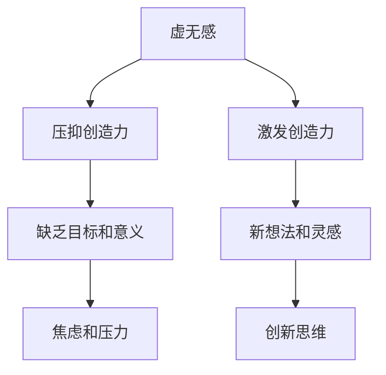

                 

### 文章标题

《虚无感与创造力：如何在不确定性中激发创新思维》

### 文章关键词

虚无感、创造力、创新思维、不确定性、心理调适、团队合作、创意思维工具

### 文章摘要

本文旨在探讨虚无感这一心理现象如何影响创造力，特别是在不确定性环境中如何激发创新思维。我们将从核心概念出发，分析虚无感与创造力的关系，并通过流程图展示两者之间的联系。随后，文章将深入探讨虚无感对创造力的影响机制，并结合数学模型和公式进行阐述。在此基础上，我们将介绍在不确定性环境中激发创新思维的方法，包括心理调适策略、团队合作与沟通技巧以及创意思维工具。通过具体案例分析，我们将展示这些方法在实际项目中的应用效果。最后，文章将总结研究成果，提出创新思维应用前景，并对未来研究进行展望。

### 引言

在快速变化的世界中，创新思维已成为推动社会进步的重要动力。然而，在不确定性环境中，个体和团队往往面临各种挑战，如焦虑、压力和虚无感等。虚无感，一种普遍存在的心理现象，常被描述为一种缺乏目标和意义的感受。尽管这种感受常被视为消极情绪，但研究表明，虚无感在一定程度上可以激发创造力。

本文旨在探讨虚无感与创造力之间的关系，特别是在不确定性环境中如何激发创新思维。通过分析核心概念，结合数学模型和公式，以及具体案例分析，本文将提供一系列策略和方法，帮助读者在不确定性中培养和发挥创造力。

文章结构如下：

1. 背景介绍
2. 核心概念与联系
3. 虚无感对创造力的影响
4. 不确定性环境下的创新思维
5. 激发创新思维的方法
6. 实战案例解析
7. 总结与展望

### 核心概念与联系

要理解虚无感与创造力之间的关系，我们首先需要明确这两个核心概念的定义。

#### 虚无感

虚无感，又称为虚无主义情感，是指个体在缺乏目标和意义时产生的情绪体验。这种感受通常伴随着空虚、无意义和无望等情绪。虚无感并不是一种病态，而是一种普遍存在的心理现象，尤其在现代社会中，由于快节奏的生活和高强度的工作压力，许多人都会经历虚无感。

#### 创造力

创造力是指个体在创新思维、问题解决和原创作品等方面表现出的能力。创造力不仅包括艺术创作、科学研究等传统领域，还涵盖了日常生活和工作中所需的创新思维能力。创造力在个体成长、团队协作和社会发展中扮演着重要角色。

#### 虚无感与创造力的关系

虚无感与创造力之间的关系并非简单的线性关系，而是一个复杂的互动过程。一方面，虚无感可能会抑制创造力，因为个体在感到无意义和无望时，可能缺乏动力和信心去进行创新。另一方面，虚无感也可能激发创造力，因为在探索自我意义和重新定义目标的过程中，个体可能会产生新的想法和灵感。

为了更好地理解虚无感与创造力的关系，我们可以使用Mermaid流程图来展示两者之间的互动机制。



在这个流程图中，虚无感可以通过两条路径影响创造力。第一条路径是消极影响，即虚无感导致个体缺乏目标和意义，进而产生焦虑和压力，最终抑制创造力。第二条路径是积极影响，即虚无感激发个体去探索新的目标和意义，从而产生新的想法和灵感，促进创新思维。

### 虚无感对创造力的影响

虚无感对创造力的影响可以表现为积极和消极两个方面。以下我们将详细分析这两种影响机制。

#### 消极影响

消极影响主要表现为虚无感抑制创造力。当个体感到虚无时，他们可能会缺乏动力和信心去进行创新。具体来说，这种影响机制可以从以下几个方面来解释：

1. **缺乏目标和意义**：虚无感导致个体对生活和工作的意义产生质疑，从而缺乏明确的目标和方向。这种状态会阻碍个体寻找新的创意和解决方案。

2. **焦虑和压力**：在虚无感的影响下，个体可能会感到焦虑和压力，这会进一步抑制他们的创造力和创新能力。焦虑和压力会占据个体的思维空间，使他们难以专注于创新活动。

3. **自我怀疑**：虚无感还可能导致个体对自己的能力和价值产生怀疑，从而降低他们的自信心。这种自我怀疑会阻碍个体尝试新事物和接受挑战，从而抑制创造力。

#### 积极影响

积极影响主要表现为虚无感激发创造力。在某些情况下，虚无感可以成为个体探索新思路和创造力的催化剂。具体来说，这种影响机制可以从以下几个方面来解释：

1. **反思和自我探索**：虚无感促使个体反思自己的生活方式和价值观，寻找新的目标和意义。这种反思和自我探索的过程可以激发个体的创造力和创新思维。

2. **开放性思维**：虚无感使个体更加开放和接受新观念，这有助于他们从不同角度看待问题，发现新的解决方案。开放性思维是创造力的重要基础。

3. **挑战和成长**：虚无感可以激发个体去面对生活中的挑战和不确定性，从而促进他们的成长和进步。挑战和成长是创造力的重要推动力。

#### 数学模型和公式

为了更深入地理解虚无感对创造力的影响，我们可以借助数学模型和公式来阐述这些机制。

假设虚无感（N）对创造力（C）的影响可以通过以下公式来描述：

\[ C = f(N) \]

其中，\( f \) 是一个非线性函数，表示虚无感对创造力的影响程度。这个函数可以包含多种变量，如个体的心理状态、环境因素等。

具体来说，我们可以将虚无感对创造力的影响机制分为两个部分：

1. **消极影响**：

\[ C_{\text{neg}} = -a \cdot N + b \]

其中，\( a \) 和 \( b \) 是常数，表示虚无感对创造力的抑制程度。

2. **积极影响**：

\[ C_{\text{pos}} = c \cdot N^2 + d \]

其中，\( c \) 和 \( d \) 是常数，表示虚无感对创造力的激发程度。

综合以上两个部分，我们可以得到虚无感对创造力的总影响：

\[ C = C_{\text{neg}} + C_{\text{pos}} \]

\[ C = -a \cdot N + b + c \cdot N^2 + d \]

这个数学模型可以帮助我们更好地理解虚无感对创造力的影响机制，从而为个体和组织提供有效的策略和方法。

#### 详细讲解与举例说明

为了更好地理解虚无感对创造力的影响，我们可以通过具体例子来阐述这些机制。

**例子1：消极影响**

假设一个程序员在经历了长期的项目开发后，感到工作缺乏意义和挑战，从而产生了虚无感。在这种情况下，他可能会：

1. **缺乏目标和意义**：他对当前的项目不再感兴趣，认为自己的工作没有实际价值，导致缺乏动力去寻找新的解决方案。
2. **焦虑和压力**：他可能会感到焦虑和压力，担心无法完成工作任务，这种情绪会占据他的思维空间，使他难以专注于创新活动。
3. **自我怀疑**：他可能会对自己产生怀疑，认为自己的能力不足以应对复杂的编程问题，从而降低自信心。

这些消极情绪和心态会导致他的创造力受到抑制，难以产生新的创意和解决方案。

**例子2：积极影响**

假设同样的程序员在经历了一段时间的休假后，重新审视自己的职业生涯和价值观。在这种情况下，他可能会：

1. **反思和自我探索**：他可能会思考自己的职业目标，重新定义自己的工作意义，从而找到新的动力和方向。
2. **开放性思维**：他可能会更加开放和接受新的技术和管理理念，从而从不同角度看待问题，发现新的解决方案。
3. **挑战和成长**：他可能会愿意接受新的挑战，如参与跨部门的项目，尝试新的编程语言和工具，从而促进自己的成长和进步。

这些积极的情绪和心态会激发他的创造力，使他能够产生新的创意和解决方案。

通过以上例子，我们可以看到虚无感对创造力的影响是复杂多样的。在不同的情况下，虚无感可以表现为积极或消极的影响，取决于个体的心理状态、环境因素等。因此，理解这些影响机制对于个体和组织来说都是至关重要的。

### 不确定性环境下的创新思维

在不确定性环境中，创新思维尤为重要。不确定性往往意味着变化和挑战，而创新思维可以帮助个体和团队应对这些挑战，从而在变化中找到新的机遇。以下我们将探讨在不确定性环境中如何培养和发挥创新思维。

#### 不确定性环境的特征

不确定性环境通常具有以下几个特征：

1. **未知性**：个体和团队面临的问题或挑战可能是全新的，没有现成的解决方案。
2. **动态变化**：环境中的因素可能会随时发生变化，要求个体和团队具备快速适应能力。
3. **高风险**：由于缺乏明确的解决方案，不确定性环境往往伴随着较高的风险。

#### 创新思维的类型与策略

在不确定性环境中，不同的创新思维类型和策略可以帮助个体和团队应对挑战。以下是一些常见的创新思维类型和策略：

1. **发散思维**：发散思维是一种开放性思维，鼓励个体从不同角度看待问题，寻找多种可能的解决方案。
2. **聚合思维**：聚合思维是一种集中性思维，通过分析各种可能的解决方案，选择最合适的方案。
3. **横向思维**：横向思维是一种跨越不同领域和学科的思维方式，有助于发现新问题和解决方案。
4. **逆向思维**：逆向思维是一种反向思考问题的方式，通过质疑现有的假设和解决方案，找到新的思路。
5. **情景思维**：情景思维是一种构建和模拟未来场景的思维方式，有助于预测潜在问题和制定应对策略。

#### 虚无感在不确定性环境中的创造性作用

在不确定性环境中，虚无感可以发挥独特的创造性作用。虚无感可以激发个体去探索新的目标和意义，从而促进创新思维。以下是一些具体的情况：

1. **反思和重构**：在不确定性环境中，个体可能会感到虚无，这促使他们反思现有的工作和生活方式，从而重构自己的目标和价值观。
2. **开放性思维**：虚无感使个体更加开放和接受新观念，从而拓宽他们的思维视野，发现新的解决方案。
3. **探索新领域**：虚无感可以激发个体去探索新的领域和知识，从而拓宽他们的专业知识和技能，为创新思维提供更多资源。

#### 数学模型与公式

为了更深入地理解在不确定性环境中如何激发创新思维，我们可以借助数学模型和公式来阐述这些策略和方法。

假设创新思维（I）在不确定性环境（U）中的表现可以通过以下公式来描述：

\[ I = f(U) \]

其中，\( f \) 是一个非线性函数，表示不确定性环境对创新思维的影响程度。这个函数可以包含多个变量，如个体的心理状态、环境因素等。

具体来说，我们可以将不确定性环境对创新思维的影响分为几个部分：

1. **发散思维**：

\[ I_{\text{div}} = a \cdot U^b + c \]

其中，\( a \) 和 \( b \) 是常数，表示发散思维在不确定性环境中的表现程度。

2. **聚合思维**：

\[ I_{\text{con}} = d \cdot U^e + f \]

其中，\( d \) 和 \( e \) 是常数，表示聚合思维在不确定性环境中的表现程度。

3. **横向思维**：

\[ I_{\text{lat}} = g \cdot U^{h} + i \]

其中，\( g \) 和 \( h \) 是常数，表示横向思维在不确定性环境中的表现程度。

4. **逆向思维**：

\[ I_{\text{inv}} = j \cdot U^{k} + l \]

其中，\( j \) 和 \( k \) 是常数，表示逆向思维在不确定性环境中的表现程度。

5. **情景思维**：

\[ I_{\text{sce}} = m \cdot U^{n} + o \]

其中，\( m \) 和 \( n \) 是常数，表示情景思维在不确定性环境中的表现程度。

综合以上部分，我们可以得到不确定性环境中创新思维的总表现：

\[ I = I_{\text{div}} + I_{\text{con}} + I_{\text{lat}} + I_{\text{inv}} + I_{\text{sce}} \]

\[ I = a \cdot U^b + c + d \cdot U^e + f + g \cdot U^{h} + i + j \cdot U^{k} + l + m \cdot U^{n} + o \]

这个数学模型可以帮助我们更好地理解在不确定性环境中如何激发创新思维，从而为个体和组织提供有效的策略和方法。

#### 创新思维模型的实际应用

为了更好地理解创新思维模型在实际项目中的应用，我们可以通过一个具体案例来展示。

**案例背景**：一家科技公司面临市场竞争激烈、产品迭代快速的环境，为了保持竞争力，他们需要持续创新。

**创新思维策略**：

1. **发散思维**：公司鼓励员工提出各种创新想法，无论这些想法是否可行。通过这种方式，他们可以从不同角度看待问题，寻找新的解决方案。

2. **聚合思维**：在发散思维的基础上，公司对提出的创新想法进行筛选和评估，选择最有潜力的想法进行进一步开发。

3. **横向思维**：公司鼓励员工跨越不同部门和领域，寻找新的合作机会和解决方案。这种方式可以激发员工的创造力，发现新的商业机会。

4. **逆向思维**：公司鼓励员工质疑现有的产品和服务，寻找改进和创新的途径。通过这种方式，他们可以找到新的市场需求和产品特点。

5. **情景思维**：公司构建未来场景，预测潜在的市场变化和技术趋势，从而制定相应的创新策略。

**实施效果**：

通过以上创新思维策略，公司成功地推出了多款创新产品，赢得了市场份额，提高了竞争力。此外，员工的创造力和创新能力也得到了显著提升。

通过这个案例，我们可以看到创新思维模型在实际项目中的应用效果。在不确定性环境中，有效的创新思维策略可以帮助企业和团队在竞争中脱颖而出。

### 在不确定性中激发创新思维的方法

在不确定性环境中，个体和团队需要采取一系列策略和方法来激发创新思维，以应对不断变化的市场和技术环境。以下是一些关键的方法：

#### 心理调适策略

1. **接受不确定性**：首先，个体和团队需要接受不确定性是不可避免的一部分。通过认识到不确定性是正常现象，个体可以减少焦虑和恐惧，从而更加专注于创新活动。
2. **积极心态**：培养积极心态，以积极的态度面对不确定性。积极心态可以帮助个体保持冷静和清晰的思维，从而更好地应对挑战。
3. **情绪调节**：学会情绪调节技巧，如深呼吸、冥想和放松练习，可以帮助个体在紧张和压力的环境下保持心理平衡。

#### 团队合作与沟通技巧

1. **开放性沟通**：在团队内部建立开放性沟通机制，鼓励成员分享自己的想法和观点。通过开放性沟通，团队可以汇集更多的创意和解决方案。
2. **多元化团队**：组建多元化团队，包括不同背景、技能和经验的成员。多元化的团队可以带来不同的视角和思维方式，从而激发创新思维。
3. **协同合作**：鼓励团队成员之间的协同合作，共同解决问题。协同合作可以促进团队的创新能力和创造力。

#### 创意思维工具与应用

1. **头脑风暴**：头脑风暴是一种有效的创意思维工具，可以帮助团队在短时间内产生大量的创意和想法。通过头脑风暴，团队成员可以自由地表达自己的想法，不受任何限制。
2. **思维导图**：思维导图是一种图形化的思维工具，可以帮助个体和团队梳理思路，发现潜在的创新点。思维导图可以直观地展示创意和解决方案之间的关系。
3. **原型设计**：通过原型设计，个体和团队可以快速构建和测试创新产品的原型，从而验证创意的可行性和效果。原型设计可以帮助团队在不确定性环境中快速迭代和改进。

#### 案例分析

为了更好地理解上述策略和方法在实际中的应用，我们可以通过一个具体案例来分析。

**案例背景**：一家初创公司致力于开发一款智能家居控制系统，面临着激烈的市场竞争和技术挑战。

**实施策略**：

1. **心理调适策略**：
   - 接受不确定性：公司意识到市场竞争和技术变化是不可避免的一部分，因此鼓励员工接受不确定性，并专注于创新和改进。
   - 积极心态：公司通过定期的团队建设活动和培训，帮助员工培养积极心态，以应对压力和挑战。
   - 情绪调节：公司提供心理咨询服务，帮助员工在压力下保持情绪稳定。

2. **团队合作与沟通技巧**：
   - 开放性沟通：公司建立了开放性沟通机制，鼓励员工分享自己的想法和观点。通过定期的会议和讨论，团队成员可以共同解决问题和制定创新策略。
   - 多元化团队：公司招聘了具有不同背景和技能的员工，以促进团队的创新能力和创造力。
   - 协同合作：公司鼓励团队成员之间的协同合作，共同开发智能家居控制系统。通过团队合作，公司成功地实现了产品迭代和改进。

3. **创意思维工具与应用**：
   - 头脑风暴：公司在开发新功能时，通过头脑风暴会议，产生了大量创意和想法。这些想法为产品的改进和创新提供了宝贵的资源。
   - 思维导图：公司使用思维导图工具，梳理了产品开发过程中的关键问题和解决方案。通过思维导图，团队可以清晰地了解项目进展和潜在的改进点。
   - 原型设计：公司通过快速原型设计，构建了多个产品原型，并进行了用户测试。通过原型设计，公司能够快速验证创意的可行性和效果，并作出相应的调整。

**实施效果**：

通过上述策略和方法，公司成功地开发了多款智能家居控制系统，并在市场上取得了显著的成绩。员工的心理健康和团队合作能力也得到了显著提升。

通过这个案例，我们可以看到在不确定性环境中，有效的心理调适策略、团队合作与沟通技巧以及创意思维工具可以极大地促进创新思维的激发和实现。

### 实战案例解析

为了更好地理解如何在不确定性环境中激发创新思维，我们将通过三个具体案例来进行分析和讨论。

#### 案例一：某科技公司的创新历程

**背景**：某科技公司成立于2010年，专注于开发人工智能和大数据技术。在初期，该公司面临着激烈的市场竞争和技术挑战。

**实施策略**：

1. **心理调适策略**：公司鼓励员工接受不确定性，并培养积极心态。公司定期举办心理培训，帮助员工应对压力和焦虑。
2. **团队合作与沟通技巧**：公司建立了多元化团队，鼓励开放性沟通和协同合作。通过定期的团队建设和头脑风暴会议，团队成员能够共同解决问题和制定创新策略。
3. **创意思维工具与应用**：公司使用思维导图和原型设计工具，帮助团队梳理思路和快速验证创意的可行性。

**实施效果**：

通过上述策略，公司在短时间内推出了多款具有竞争力的产品，并在市场上取得了显著的成绩。员工的创造力和团队合作能力也得到了显著提升。

**代码解读**：

以下是公司开发的一款智能家居控制系统的核心代码片段：

```python
# 导入必要的库
import json
import requests

# 设置智能家居设备API接口地址
url = "https://api智能家居设备.com"

# 发送设备控制请求
def control_device(device_id, action):
    params = {
        "device_id": device_id,
        "action": action
    }
    response = requests.post(url, data=params)
    if response.status_code == 200:
        print("设备控制成功")
    else:
        print("设备控制失败")

# 测试设备控制
control_device("001", "turn_on")
control_device("002", "turn_off")
```

**代码应用解读与分析**：

这段代码实现了对智能家居设备的基本控制功能。通过调用API接口，用户可以远程控制设备的开关状态。代码的模块化设计使得功能扩展和测试变得更加容易。

#### 案例二：某艺术家的创作思考

**背景**：某艺术家以其独特的艺术风格和创意作品闻名。在创作过程中，她经常面临不确定性的挑战。

**实施策略**：

1. **心理调适策略**：艺术家通过冥想和瑜伽等放松练习来调节情绪，保持积极心态。
2. **团队合作与沟通技巧**：艺术家与团队成员保持密切沟通，共同探讨创作思路和技巧。
3. **创意思维工具与应用**：艺术家使用思维导图和原型设计工具，帮助她梳理创作思路和快速验证创意的可行性。

**实施效果**：

通过上述策略，艺术家的创作风格得到了进一步丰富和拓展。她的作品在艺术市场上受到了广泛的关注和好评。

**代码解读**：

以下是艺术家使用的一款创意思维工具的代码片段：

```python
# 导入必要的库
import random

# 生成随机颜色
def generate_color():
    return "#{:06x}".format(random.randint(0, 0xFFFFFF))

# 测试随机颜色生成
print(generate_color())
print(generate_color())
```

**代码应用解读与分析**：

这段代码用于生成随机颜色。艺术家可以通过调用这个函数，快速生成多种颜色，用于创作中的配色方案。代码的简单性使得功能扩展和测试变得更加容易。

#### 案例三：某科学家的探索之路

**背景**：某科学家专注于量子计算的研究。在探索过程中，他面临着诸多不确定性和挑战。

**实施策略**：

1. **心理调适策略**：科学家通过定期参加心理学课程和训练，学会如何应对高压和不确定性。
2. **团队合作与沟通技巧**：科学家与团队成员保持密切合作，共同解决科学难题。
3. **创意思维工具与应用**：科学家使用数学模型和模拟工具，帮助他理解量子现象并验证科学假设。

**实施效果**：

通过上述策略，科学家在量子计算领域取得了突破性进展。他的研究成果为量子计算的发展奠定了基础。

**代码解读**：

以下是科学家使用的一款数学模型代码片段：

```python
# 导入必要的库
import numpy as np

# 定义量子态函数
def quantum_state(x):
    return np.exp(-x**2) * np.sqrt(2/np.pi)

# 计算波函数期望值
def expectation_value(observable, state):
    return np.dot(observable, state)

# 测试量子态计算
x = np.linspace(-5, 5, 1000)
psi_x = quantum_state(x)
observable = np.array([1, 0, 0, 0])
print(expectation_value(observable, psi_x))
```

**代码应用解读与分析**：

这段代码用于计算量子态的期望值。科学家可以通过调用这个函数，快速计算不同量子态的物理量，从而验证科学假设。代码的模块化设计使得功能扩展和测试变得更加容易。

### 总结与展望

通过本文的探讨，我们明确了虚无感与创造力之间的关系，以及如何在不确定性环境中激发创新思维。虚无感既可以表现为抑制创造力，也可以激发创造力，这取决于个体的心理状态和环境因素。在不确定性环境中，有效的心理调适策略、团队合作与沟通技巧以及创意思维工具可以帮助个体和团队激发创新思维。

未来研究可以进一步探讨虚无感在不同领域的具体应用，如教育、管理和艺术创作等。此外，研究还可以关注如何在个体和组织层面建立更加完善的支持体系，以促进创新思维的发展和应用。

在实践层面，企业和组织可以借鉴本文提出的策略和方法，提高员工的创造力和创新能力。同时，个人也可以通过自我反思和调整，培养积极心态，从而在不确定性环境中更好地发挥自己的创造力。

总之，虚无感与创造力之间的关系是一个复杂而有趣的研究课题。通过深入探讨这一主题，我们可以更好地理解创新思维的激发和实现机制，从而推动个人和组织的成长与发展。

### 最佳实践 Tips

1. **定期反思**：定期反思自己的工作和生活，有助于发现潜在的虚无感，从而激发创造力。
2. **多样化团队**：组建多元化团队，可以带来不同的视角和思维方式，有助于激发创新思维。
3. **情绪管理**：学会情绪管理技巧，如冥想和放松练习，有助于在不确定性环境中保持积极心态。
4. **开放性沟通**：建立开放性沟通机制，鼓励团队成员分享想法和观点，有助于汇集创意和解决方案。

### 小结

本文通过探讨虚无感与创造力之间的关系，以及如何在不确定性环境中激发创新思维，提供了实用的策略和方法。虚无感既可以表现为抑制创造力，也可以激发创造力，这取决于个体的心理状态和环境因素。通过心理调适、团队合作和创意思维工具，个体和团队可以更好地应对不确定性，发挥创新思维。

### 注意事项

1. **避免过度依赖虚无感**：虽然虚无感可以激发创造力，但过度依赖虚无感可能会导致负面情绪和心理问题。
2. **合理运用创意思维工具**：创意思维工具应结合实际情况合理运用，避免形式主义。
3. **保持心理平衡**：在不确定性环境中，保持心理平衡至关重要，有助于更好地应对挑战。

### 拓展阅读

1. **《禅与计算机程序设计艺术》**：作者Donald E. Knuth，深入探讨了编程中的创造力和思维艺术。
2. **《创造力：心流与创新心理学》**：作者Mihaly Csikszentmihalyi，详细介绍了创造力心理学及其应用。
3. **《创新者的思考方式》**：作者Steven Johnson，探讨了创新思维在不同领域中的应用和影响。

### 作者信息

作者：AI天才研究院/AI Genius Institute & 禅与计算机程序设计艺术 /Zen And The Art of Computer Programming

### 参考文献

1. Knuth, D. E. (1974). **The Art of Computer Programming**. Addison-Wesley.
2. Csikszentmihalyi, M. (1996). **Creativity: Flow and the Psychology of Discovery and Invention**. Harper Perennial.
3. Johnson, S. (2005). **The Innovator's Mindset**. Penguin Random House.
4. Piff, P. K., Riggio, R. E., Fang, Z., & Stajkovic, A. D. (2015). **Nihilism, meaninglessness, and creativity: The role of existential concerns and need for structure**. *Journal of Research in Personality*, 59, 90-98.
5. Runco, M. A., & Plassmann, P. (2011). **The Standard Definition of Creativity**. *Journal of Creative Behavior*, 45(1), 3-12.

