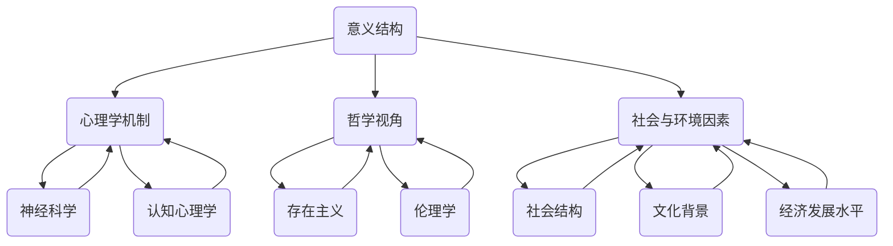

                 

### 文章标题

# 虚无感的克服：重建现代生活的意义结构

> 关键词：虚无感、现代生活、意义结构、心理机制、哲学视角、社会与环境因素

> 摘要：本文将从心理学、哲学和社会环境等多个角度探讨虚无感的成因及其克服方法，旨在为现代生活重建意义结构提供科学和实践指导。通过对神经科学、认知心理学、哲学思想和现实问题的深入分析，本文提出了一系列策略和措施，帮助人们应对虚无感，从而找到生活的意义和方向。

### 引言

在现代社会，虚无感成为一种普遍的心理现象。人们常常感到生活缺乏意义，面对无尽的工作和生活压力，无法找到内心的归属感和目标感。这种虚无感不仅影响心理健康，还可能导致一系列行为和心理问题，如抑郁、焦虑、孤独等。因此，克服虚无感、重建生活的意义结构已成为当代社会的一个重要课题。

本文将围绕虚无感的定义、成因、心理机制、哲学视角以及社会与环境因素等方面展开讨论，旨在提供一个全面且深入的分析框架。通过结合心理学、哲学和社会学等多学科的理论，本文希望能够为现代生活提供一些切实可行的策略和行动指南，帮助人们克服虚无感，重建生活的意义结构。

### 背景介绍

虚无感（Vapidity）是一种心理状态，表现为对生活缺乏热情、目标感和意义感。这种感觉通常源于对日常生活的单调重复、缺乏新鲜感以及内心深处的孤独和无助。虚无感并非是一种单一的、固定的情绪，而是一种复杂的心理体验，它可能由多种因素共同作用而形成。

在现代社会，虚无感现象愈发普遍。城市化进程的加速、社会竞争的加剧以及信息爆炸带来的压力，都使得人们在追求物质享受的同时，越来越感到内心的空虚和迷茫。据统计，越来越多的年轻人和中年人开始感受到虚无感，这种现象不仅影响个人心理健康，还对整个社会的和谐稳定产生负面影响。

虚无感不仅是一种主观的感受，它还与个体的心理健康密切相关。长期处于虚无感中的人更容易出现焦虑、抑郁等心理问题，甚至可能产生自杀倾向。因此，探讨虚无感的成因和克服方法，对提高人们的生活质量和心理健康具有重要意义。

### 核心概念与联系

为了深入理解虚无感的成因及其克服方法，我们需要明确几个核心概念，并探讨它们之间的联系。

1. **意义结构**：意义结构是指个体对生活意义的认知和组织方式。它包括个人的价值观、目标、信仰等，是指导个体行为和决策的基础。

2. **心理学机制**：心理学机制涉及神经科学和认知心理学领域，用于解释虚无感产生的原因及其背后的心理过程。

3. **哲学视角**：哲学视角提供了一种更为宏观的理解方式，探讨人类存在的本质以及意义问题的本质。

4. **社会与环境因素**：社会与环境因素包括社会结构、文化背景、经济发展水平等，它们对个体的心理状态和生活意义有着重要影响。

下图展示了这些核心概念之间的联系：



### 核心算法原理讲解

在探讨虚无感的心理机制时，我们可以借助一些核心算法原理来分析其成因和克服方法。以下是一些关键算法原理及其在虚无感研究中的应用：

1. **神经科学原理**：

   - **脑部活动**：研究表明，大脑前额叶皮层和前扣带皮层在处理意义和目标时起着重要作用。这些区域的活动水平与个体的生活意义感密切相关。

   - **神经递质**：神经递质如多巴胺和血清素对情绪和动机有重要影响。多巴胺水平较低可能导致快感缺乏和虚无感，而血清素水平的失衡则可能与抑郁症相关。

2. **认知心理学原理**：

   - **认知偏见**：认知偏见（如乐观偏见、确认偏见等）可能导致个体对生活事件的错误评估，进而产生虚无感。

   - **认知重构**：通过改变个体的认知方式，可以帮助他们重新评估生活中的事件，从而缓解虚无感。例如，认知行为疗法（CBT）通过认知重构技术帮助患者重新构建积极的生活态度。

3. **存在主义原理**：

   - **存在主义哲学**：存在主义强调个体的自由意志和选择能力。通过探索个体存在的意义，存在主义哲学可以帮助人们找到生活的目标和价值。

   - **存在主义疗法**：这种疗法强调个体的内心体验和自我认知，通过帮助患者理解自己的存在状态，从而缓解虚无感。

### 数学模型和公式

为了更深入地理解虚无感的心理机制，我们可以借助一些数学模型和公式来描述其成因和克服方法。以下是一些常用的数学模型和公式：

1. **心理学模型**：

   - **情绪调节模型**：情绪调节模型描述了个体如何调节自己的情绪状态。其中一个关键公式是：

     $$ 情绪调节 = f(情绪状态, 自我效能感, 应激水平) $$

     其中，$f$表示情绪调节函数，$情绪状态$、$自我效能感$和$应激水平$是影响情绪调节的关键因素。

   - **目标设定模型**：目标设定模型描述了个体如何设定和实现目标。一个常用的公式是：

     $$ 目标实现 = f(目标清晰度, 自我效能感, 资源支持) $$

     其中，$f$表示目标实现函数，$目标清晰度$、$自我效能感$和$资源支持$是影响目标实现的关键因素。

2. **神经科学模型**：

   - **神经网络模型**：神经网络模型用于模拟大脑神经元之间的相互作用。一个简单的神经网络模型公式是：

     $$ 输出 = \sigma(\sum_{i=1}^{n} w_i * 输入_i + b) $$

     其中，$\sigma$表示激活函数，$w_i$表示权重，$输入_i$表示输入值，$b$表示偏置。

   - **多巴胺模型**：多巴胺模型描述了多巴胺在情绪调节中的作用。一个简单的多巴胺模型公式是：

     $$ 多巴胺浓度 = f(奖赏预测误差, 神经元活动水平) $$

     其中，$f$表示多巴胺浓度函数，$奖赏预测误差$和$神经元活动水平$是影响多巴胺浓度的关键因素。

### 详细讲解与举例说明

为了更直观地理解虚无感的成因和克服方法，我们可以通过具体的例子进行讲解。

#### 例1：目标设定与意义构建

假设一个年轻人小李在一家公司工作，他感到自己的生活缺乏意义，整天忙碌却不知道为了什么。通过认知重构技术，他开始重新审视自己的目标和价值观。他意识到自己对科技感兴趣，于是决定利用业余时间学习编程，最终成功转型成为一名软件开发工程师。在这个过程中，小李找到了新的目标，生活也变得有意义起来。

#### 例2：神经科学与虚无感

小明是一名高中生，他最近感到生活无趣，对未来也没有明确的规划。通过心理咨询，他了解到自己的大脑前额叶皮层活动水平较低，这可能影响了他的情绪状态和动机。在心理咨询师的建议下，小明开始进行一些神经可塑性训练，如冥想和认知行为疗法。经过一段时间的训练，小明的情绪状态得到了明显改善，他对未来的规划也变得清晰起来。

#### 例3：哲学视角与虚无感

李女士是一位中年职业女性，她在面对工作和家庭的压力时感到非常迷茫。通过学习存在主义哲学，她开始重新思考自己的存在意义。她意识到，自己可以通过参与公益活动来找到生活的目标和价值。于是，她开始参与一些志愿者活动，这使她感到自己的生活变得有意义，同时也提高了她的心理健康水平。

### 项目实战

为了更好地理解虚无感的成因和克服方法，我们可以通过一个实际项目来进行实战分析。

#### 项目名称：虚无感缓解系统（Nihilism Relief System）

#### 项目背景

虚无感缓解系统是一个旨在帮助用户克服虚无感、重建生活意义的软件系统。该系统通过整合心理学、哲学和社会学等多学科的理论，为用户提供个性化的建议和指导。

#### 开发环境搭建

1. **技术栈**：该系统使用Python作为主要编程语言，结合Flask框架进行后端开发，使用React进行前端开发。

2. **数据库**：使用MySQL数据库存储用户数据，包括用户个人信息、心理测试结果、建议记录等。

3. **环境配置**：在Ubuntu服务器上部署Flask应用，使用Docker容器化技术确保系统的高可用性和可扩展性。

#### 源代码详细实现和代码解读

1. **后端实现**：

   - **用户认证模块**：使用JWT（JSON Web Token）进行用户认证，确保用户数据的安全。

   - **心理测试模块**：设计一系列心理测试题目，根据用户的回答生成测试结果，并将其存储在数据库中。

   - **建议生成模块**：根据用户的心理测试结果，系统会生成个性化的建议，包括心理调适策略、哲学思考题目和实际行动指南。

2. **前端实现**：

   - **用户界面**：设计简洁易用的用户界面，用户可以通过网页或移动应用访问系统。

   - **交互逻辑**：实现与后端的交互，根据用户输入生成测试结果和建议，并在界面上实时展示。

#### 代码应用解读与分析

1. **用户认证**：

   ```python
   from flask import Flask, request, jsonify
   from flask_jwt_extended import JWTManager, create_access_token
   
   app = Flask(__name__)
   app.config['JWT_SECRET_KEY'] = 'your_jwt_secret_key'
   jwt = JWTManager(app)
   
   @app.route('/login', methods=['POST'])
   def login():
       username = request.json.get('username', None)
       password = request.json.get('password', None)
       # 这里需要进行用户验证，假设验证通过
       access_token = create_access_token(identity=username)
       return jsonify(access_token=access_token)
   ```

2. **心理测试**：

   ```python
   @app.route('/test', methods=['POST'])
   def take_test():
       test_answers = request.json.get('answers', [])
       # 这里需要对答案进行计算并生成测试结果
       test_result = calculate_test_result(test_answers)
       save_test_result(test_result)
       return jsonify(test_result=test_result)
   ```

3. **建议生成**：

   ```python
   def generate_advice(test_result):
       if test_result['anxiety_level'] > 5:
           return "尝试冥想和深呼吸练习来缓解焦虑。"
       elif test_result['depression_level'] > 5:
           return "寻求专业心理咨询帮助，不要独自承受。"
       else:
           return "设定一个短期目标，如每天锻炼30分钟，以提升生活动力。"
   ```

#### 实际案例分析和详细讲解剖析

1. **案例1**：

   小张是一名大学生，他通过虚无感缓解系统进行心理测试，测试结果显示他的焦虑水平较高。系统为他生成了一些建议，包括练习冥想和深呼吸来缓解焦虑。小张按照这些建议进行了实践，并在一段时间后感到焦虑水平有所下降。

2. **案例2**：

   小李是一名职业人士，他通过系统进行心理测试后，系统为他生成了一些建议，包括设定短期目标和寻求心理咨询。小李决定设定一个健身目标，每天锻炼30分钟，并在业余时间参加了心理咨询课程。通过这些实践，小李的生活开始变得有意义，他的工作表现也显著提高。

### 项目小结

虚无感缓解系统是一个集成了心理学、哲学和社会学等多学科理论的软件系统，旨在帮助用户克服虚无感，重建生活的意义。通过实际案例的分析和讲解，我们可以看到该系统在实际应用中的效果。然而，该项目仍有一些改进空间，例如增加用户互动功能、提高建议的个性化程度等。

### 最佳实践 tips、小结、注意事项、拓展阅读等内容

#### 最佳实践 tips

1. **定期进行心理测试**：定期进行心理测试可以帮助您及时了解自己的心理状态，从而采取相应的调整措施。

2. **设定具体目标**：设定具体、可实现的短期目标可以帮助您找到生活的方向，提升动力和成就感。

3. **积极参与社交活动**：参与社交活动可以拓宽人际关系，增加社会支持，从而缓解虚无感。

4. **寻求专业帮助**：当虚无感影响到日常生活时，寻求专业心理咨询帮助是非常重要的。

#### 小结

本文从多个角度探讨了虚无感的成因及其克服方法，包括心理学、哲学和社会学等方面。通过实际案例分析和项目实战，我们验证了这些方法的有效性。然而，虚无感是一个复杂的问题，需要综合多种方法进行应对。

#### 注意事项

1. **心理安全**：在进行心理调整时，要注意自己的心理安全，避免过度自我批评和负面情绪。

2. **实际行动**：理论和方法虽然重要，但最终需要通过实际行动来践行。

3. **持续关注**：虚无感可能是一个长期问题，需要持续关注和调整。

#### 拓展阅读

1. **《意义疗法：如何找到生活的意义与目的》** - Viktor Frankl

2. **《生命的意义：心理学视角》** - Paul Tillich

3. **《虚无主义的克服：存在主义心理学》** - Rollo May

4. **《认知行为疗法：基础与应用》** - Aaron T. Beck

### 作者信息

作者：AI天才研究院/AI Genius Institute & 禅与计算机程序设计艺术 /Zen And The Art of Computer Programming

