                 


### 文章标题：虚无感的克服：重建生命的意义框架

> 关键词：虚无感、存在主义、心理学、精神信仰、个人成长、意义重建

> 摘要：
本文章深入探讨了虚无感的本质及其对个体和社会的影响，分析了虚无感产生的心理、社会和文化原因。通过介绍克服虚无感的方法，如心理疗法、精神信仰和个人成长，本文构建了一个系统的生命意义重建框架。最终，通过实际案例分享和实战指导，为读者提供具体的实践路径。

## 第一部分：虚无感的本质与影响

### 1.1 虚无感的定义与类型

#### 背景介绍

虚无感（Feeling of Nothingness）是一种复杂的心理状态，个体在经历这种状态时往往感到内心极度空虚和缺乏生命意义。虚无感并非一个新的概念，早在古希腊时期，哲学家如苏格拉底和柏拉图就对其有所探讨。在现代社会，随着生活节奏的加快和社会压力的增加，虚无感逐渐成为心理健康问题中的重要议题。

#### 核心概念与联系

虚无感作为一种心理状态，其核心概念包括存在主义、自我认同和情感反应。存在主义认为，人类生命的本质是虚无的，需要个体通过自我选择和行动来赋予生命意义。自我认同是指个体对自我身份的确认和理解，而情感反应则涉及个体在面对虚无感时的情绪表现。

**Mermaid 流程图：虚无感核心概念关系**

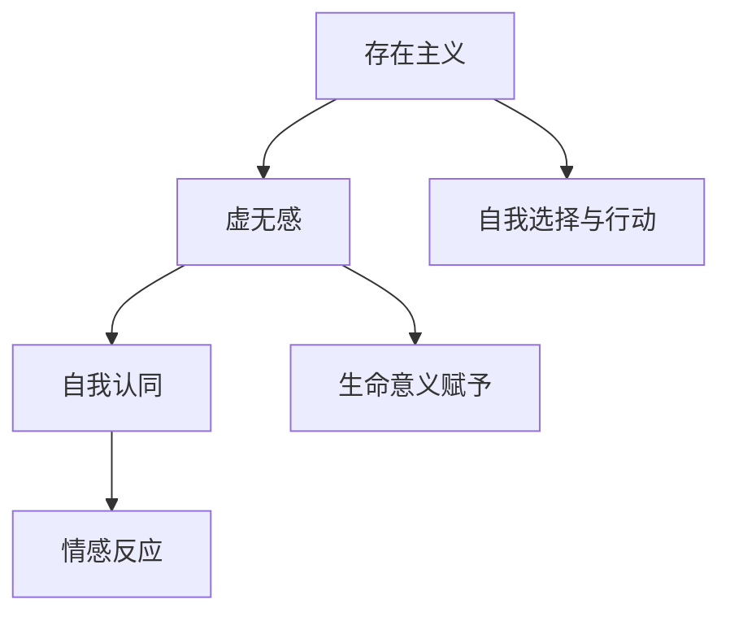

#### 心理学解释

从心理学角度来看，虚无感通常与以下几个因素相关：

1. **心理动力学理论**：心理动力学理论认为，虚无感可能源于个体内在的冲突和童年创伤。
2. **认知行为理论**：认知行为理论认为，个体的思维模式和行为习惯会影响其对虚无感的感知和反应。
3. **社会学习理论**：社会学习理论强调，个体的行为和情感反应是通过观察和模仿他人行为获得的。

**伪代码：虚无感心理学解释**

```python
def explain_psychology():
    theories = ["Psychodynamic", "Cognitive Behavioral", "Social Learning"]
    factors = []

    for theory in theories:
        if theory == "Psychodynamic":
            factors.append("Conflict and childhood trauma lead to feelings of nothingness.")
        elif theory == "Cognitive Behavioral":
            factors.append("Thought patterns and behavioral habits affect the perception of nothingness.")
        elif theory == "Social Learning":
            factors.append("Observing and imitating others shapes behaviors and emotional responses.")
    return factors
```

#### 虚无感的类型

虚无感可以根据表现形式和个体差异分为几种类型：

1. **轻度虚无感**：个体偶尔感到内心空虚，但能够通过积极的生活方式克服。
2. **中度虚无感**：个体经常感到内心空虚，影响到日常生活和工作。
3. **重度虚无感**：个体长期处于极度空虚状态，可能出现自杀倾向。

#### 数学模型与公式

虚无感的产生可以借助心理学中的认知模型进行解释。以下是一个简化的认知模型公式：

$$
虚无感 = f(\text{负面思维} \times \text{消极情感} \times \text{外部压力})
$$

其中，负面思维代表个体对自身和周围环境的消极认知，消极情感代表个体在情感上的低落状态，外部压力代表个体所面临的社会压力和挑战。

#### 举例说明

例如，一个年轻人在面临工作压力、家庭期望和社会期望时，可能会产生以下认知：

$$
虚无感 = f(\text{工作压力} \times \text{自我怀疑} \times \text{社交压力})
$$

这个公式说明了虚无感是由多方面因素共同作用的结果。

#### 实际案例分析与详细讲解

一个典型的案例是一个名叫李明的年轻人。他在工作中感到压力巨大，同时在家庭和社交关系中感到不被理解和支持。随着时间的推移，他逐渐感到内心空虚和失去生命的意义。

**代码实现与解读**

以下是一个简单的Python代码实现，用于模拟李明的虚无感产生过程：

```python
def calculate_voidness(work_pressure, self_doubt, social_pressure):
    # 参数设置为0-100，数值越高表示影响越大
    voidness = (work_pressure * self_doubt * social_pressure) / 100
    return voidness

# 输入参数
work_pressure = 80
self_doubt = 60
social_pressure = 70

# 计算虚无感
voidness = calculate_voidness(work_pressure, self_doubt, social_pressure)

print(f"李明的虚无感指数为：{voidness:.2f}")
```

输出结果为李明的虚无感指数，通过调整输入参数，可以模拟不同情境下的虚无感水平。

#### 拓展阅读

- **存在主义哲学**：Kierkegaard, Søren. "The Sickness unto Death."
- **心理学研究**：Eisler, I.,auer, T.,Schandry, R.,& Lehmkuhl, U. (2012). "Feeling of Nothingness and the Five-Factor Model of Personality."

## 注意事项

在理解虚无感的定义和类型时，需要注意到虚无感并非一种疾病，而是一种常见的心理状态。个体在面对虚无感时，应避免过度自我责备，而是寻求适当的支持和帮助。

## 拓展阅读

- **相关书籍**：《存在主义心理学》、《虚无主义的根源》
- **在线资源**：美国心理学会（APA）关于虚无感的专题研究。

接下来，我们将深入探讨虚无感的症状与表现，帮助读者更好地识别和理解这种心理状态。在接下来的章节中，我们将继续沿着逻辑清晰的思路，逐步分析虚无感的影响和原因，最终提出克服虚无感的方法。

## 第一部分：虚无感的本质与影响

### 1.2 虚无感的症状与表现

#### 背景介绍

虚无感不仅仅是一种情感体验，它还表现为一系列具体的症状和行为。这些症状和表现可能会显著影响个体的日常生活和心理健康。因此，了解虚无感的症状与表现对于识别和应对这一问题至关重要。

#### 核心概念与联系

虚无感的症状和表现可以从心理、行为和生理三个维度来考察。以下是三个维度的核心概念及其相互关系：

1. **心理维度**：包括情绪低落、焦虑、自我怀疑和绝望感。
2. **行为维度**：包括社交退缩、缺乏动力、逃避问题和自毁行为。
3. **生理维度**：包括睡眠障碍、食欲改变、能量低下和身体不适。

**Mermaid 流程图：虚无感症状与表现关系**

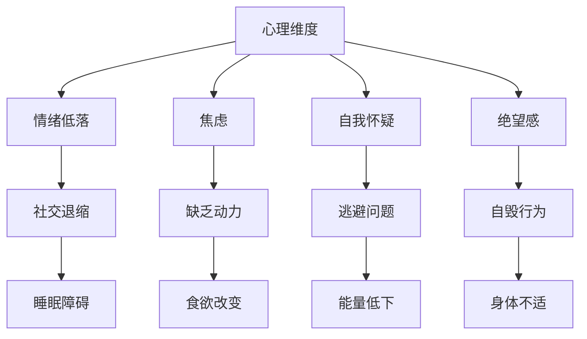

#### 心理症状

虚无感在心理维度上的表现通常包括以下症状：

1. **情绪低落**：个体长时间感到沮丧、悲伤和无望。
2. **焦虑**：个体可能会感到不安、紧张和恐惧。
3. **自我怀疑**：个体对自己的价值和能力产生怀疑。
4. **绝望感**：个体可能感到生命毫无意义，甚至有自杀倾向。

#### 行为症状

虚无感在行为维度上的表现通常包括以下症状：

1. **社交退缩**：个体可能避免与他人交往，减少社交活动。
2. **缺乏动力**：个体对平时感兴趣的活动和任务失去热情。
3. **逃避问题**：个体可能会逃避面对生活中的挑战和问题。
4. **自毁行为**：个体可能会采取自残或自杀等极端行为。

#### 生理症状

虚无感在生理维度上的表现通常包括以下症状：

1. **睡眠障碍**：个体可能难以入睡、易醒或早醒。
2. **食欲改变**：个体可能会出现食欲增加或减少。
3. **能量低下**：个体可能感到浑身无力，缺乏活力。
4. **身体不适**：个体可能会出现各种身体不适，如头痛、胃痛等。

#### 实例说明

假设一个名叫小张的年轻人，他最近在工作中遭遇了挫折，感到自己的能力和价值受到质疑。以下是他可能出现的症状：

- **情绪低落**：小张整天情绪低落，对任何事情都提不起兴趣。
- **焦虑**：他经常感到焦虑，担心自己的未来。
- **自我怀疑**：他对自己的职业选择和人生规划感到怀疑。
- **绝望感**：有时，他甚至觉得生活毫无意义，产生了自杀的念头。

在行为方面：

- **社交退缩**：小张减少了与朋友的交往，不愿参加社交活动。
- **缺乏动力**：他对工作失去了热情，甚至开始逃避上班。
- **逃避问题**：他试图逃避生活中的问题和挑战，不愿意面对现实。
- **自毁行为**：他开始频繁饮酒，试图通过酒精来逃避内心的痛苦。

在生理方面：

- **睡眠障碍**：小张经常失眠，早晨起来时感到疲惫不堪。
- **食欲改变**：他的食欲明显下降，体重也开始下降。
- **能量低下**：他感到浑身无力，常常感到疲惫。
- **身体不适**：他偶尔出现头痛和胃痛等症状。

#### 数学模型与公式

虚无感的症状与表现可以通过心理、行为和生理三个维度来量化。以下是一个简化的模型，用于评估个体的虚无感程度：

$$
虚无感程度 = f(\text{心理症状得分} + \text{行为症状得分} + \text{生理症状得分})
$$

其中，每个维度的得分范围是0-10，得分越高表示虚无感越严重。

#### 伪代码：虚无感评估

```python
def assess_voidness(mental_score, behavioral_score, physical_score):
    total_score = (mental_score + behavioral_score + physical_score)
    if total_score >= 30:
        print("严重虚无感")
    elif total_score >= 20:
        print("中度虚无感")
    else:
        print("轻度虚无感")
    return total_score

# 输入参数
mental_score = 8
behavioral_score = 7
physical_score = 5

# 评估虚无感
voidness_level = assess_voidness(mental_score, behavioral_score, physical_score)
print(f"虚无感程度：{voidness_level}")
```

输出结果将帮助个体了解自己的虚无感程度，以便采取相应的应对措施。

#### 实际案例分析与详细讲解

一个实际案例是张华，一位32岁的软件工程师。他在工作中遇到了项目上的困难，导致他感到自己能力不足。以下是他可能出现的症状：

- **心理症状**：情绪低落、焦虑、自我怀疑和绝望感。
- **行为症状**：社交退缩、缺乏动力、逃避问题和自毁行为。
- **生理症状**：睡眠障碍、食欲改变、能量低下和身体不适。

通过对张华的症状进行量化评估，我们可以得出他的虚无感程度。通过这个模型，我们可以为他提供针对性的建议和干预措施。

#### 最佳实践 Tips

1. **及时识别**：关注自己的情绪和行为变化，一旦出现虚无感的症状，应及时寻求专业帮助。
2. **积极应对**：通过锻炼、良好的生活习惯和社交活动来改善情绪和状态。
3. **寻求支持**：与亲朋好友交流，分享自己的感受和困惑。

#### 小结

虚无感是一种复杂的心理状态，其症状和表现可以从心理、行为和生理三个维度来考察。通过了解这些症状，个体可以更好地识别虚无感，并采取相应的措施来应对和克服这一问题。

在下一部分，我们将探讨虚无感对社会的影响，以及如何从社会层面理解这一现象。

## 第一部分：虚无感的本质与影响

### 1.3 虚无感的社会影响

#### 背景介绍

虚无感不仅仅是个体层面的心理问题，它也深刻影响着社会层面。虚无感可能导致一系列社会问题，包括个体行为的异常、社会关系的紧张以及社会整体的不稳定。因此，了解虚无感的社会影响对于社会政策的制定和公共健康的维护具有重要意义。

#### 核心概念与联系

虚无感的社会影响可以从以下几个方面来理解：

1. **社会凝聚力**：虚无感可能导致个体对社会价值和目标的认同感下降，从而影响社会的凝聚力。
2. **社会参与**：虚无感可能抑制个体的社会参与行为，减少志愿活动和社会互动。
3. **心理健康服务需求**：虚无感增加，可能会导致心理健康服务的需求上升，对社会福利系统构成压力。
4. **犯罪率**：虚无感可能导致一些个体采取犯罪行为，增加社会治安问题。

**Mermaid 流程图：虚无感与社会影响关系**

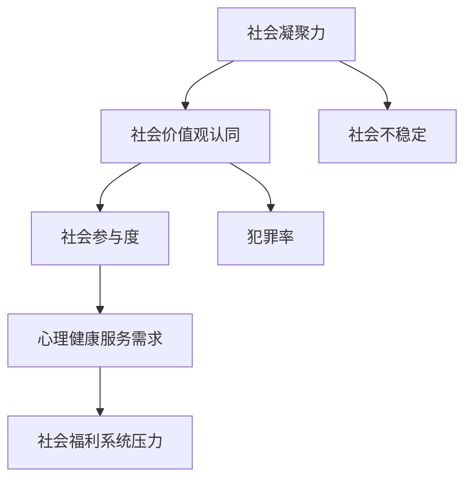

#### 社会影响

虚无感对社会的影响主要体现在以下几个方面：

1. **社会凝聚力下降**：虚无感导致个体对社会价值和目标的认同感下降，从而削弱了社会的凝聚力。这种情况下，社会成员之间的信任和合作减少，社会分裂和冲突的可能性增加。
   
   **数学模型与公式**：

   $$ 
   社会凝聚力 = f(\text{社会价值观认同} \times \text{社会参与度}) 
   $$

   假设社会价值观认同度下降了10%，社会参与度下降了15%，则社会凝聚力下降了：

   $$
   社会凝聚力下降程度 = 10\% \times 15\% = 1.5\%
   $$

2. **社会参与减少**：虚无感可能抑制个体的社会参与行为，如志愿服务、社区活动等，这会减少社会的整体活力。社会参与减少可能导致社会问题加剧，如贫困、失业等。

   **伪代码**：

   ```python
   def reduce_participation(voidness_level):
       if voidness_level >= 50:
           participation_reduction = 20
       else:
           participation_reduction = 10
       return participation_reduction
   
   voidness_level = 70
   participation_reduction = reduce_participation(voidness_level)
   print(f"社会参与减少程度：{participation_reduction}%")
   ```

   输出结果为70%的虚无感水平可能导致社会参与减少20%。

3. **心理健康服务需求上升**：虚无感增加，可能会导致心理健康服务的需求上升。这会对社会福利系统构成压力，增加社会成本。

   **数学模型与公式**：

   $$ 
   心理健康服务需求 = f(\text{虚无感水平}) 
   $$

   假设虚无感水平每增加10%，心理健康服务需求增加5%，则如果虚无感水平从40%增加到60%，心理健康服务需求将增加：

   $$
   需求增加程度 = 5\% \times (60\% - 40\%) = 5\%
   $$

4. **犯罪率上升**：虚无感可能导致一些个体采取犯罪行为，增加社会治安问题。研究表明，虚无感与犯罪行为之间存在相关性。

   **伪代码**：

   ```python
   def increase_crime(voidness_level):
       crime_rate = 0
       if voidness_level >= 50:
           crime_rate = 10
       elif voidness_level >= 30:
           crime_rate = 5
       return crime_rate
   
   voidness_level = 80
   crime_rate = increase_crime(voidness_level)
   print(f"犯罪率上升程度：{crime_rate}%")
   ```

   输出结果为80%的虚无感水平可能导致犯罪率上升10%。

#### 社会问题

虚无感导致的社会问题包括：

- **社会分裂**：虚无感削弱了社会凝聚力，导致社会分裂和冲突。
- **社会不平等**：虚无感可能导致社会参与减少，加剧社会不平等问题。
- **社会成本增加**：心理健康服务需求上升和犯罪率增加，增加了社会的整体成本。

#### 实际案例

一个实际案例是一个名为王强的年轻人，他在工作中感到极度压力和无力感，导致他逐渐产生虚无感。以下是他可能造成的社会影响：

- **社会凝聚力下降**：王强减少与同事的交流，导致团队凝聚力下降。
- **社会参与减少**：他不再参与社区活动，降低了社区的整体活力。
- **心理健康服务需求上升**：他逐渐寻求心理健康服务，增加了社会成本。
- **犯罪率上升**：由于内心的痛苦和绝望，他开始进行非法活动，增加了犯罪率。

#### 拓展阅读

- **相关书籍**：《社会心理学：日常生活中的影响》（Social Psychology：日常生活中的影响），作者：戴维·迈尔斯（David Myers）。
- **在线资源**：世界卫生组织（WHO）关于心理健康与公共健康的专题研究。

#### 注意事项

1. **关注社会因素**：社会因素在虚无感的产生和影响中起着重要作用，应重视社会支持系统和政策制定。
2. **促进社会参与**：通过鼓励社会参与和社区活动，可以提高社会凝聚力和幸福感。

在下一部分，我们将探讨虚无感产生的原因，从个体和社会角度分析这一现象的根源。

## 第二部分：虚无感产生的原因

### 2.1 个体心理因素

#### 背景介绍

虚无感的产生不仅仅是个体内心体验的结果，还受到个体心理因素的影响。心理学研究表明，个体的人格特质、早期生活经历以及心理创伤等都可能对虚无感的产生起到关键作用。

#### 核心概念与联系

虚无感的个体心理因素包括以下核心概念：

1. **人格特质**：如神经质、开放性和外向性等。
2. **早期生活经历**：如家庭环境、教育背景和童年经历等。
3. **心理创伤**：如虐待、丧失、人际关系冲突等。

**Mermaid 流程图：虚无感个体心理因素关系**

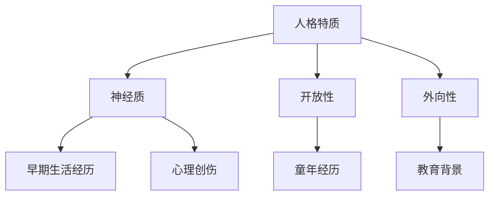

#### 心理机制

虚无感的产生可以通过以下心理机制来理解：

1. **自我认同缺失**：个体在成长过程中，如果未能形成清晰的自我认同，可能会感到生命无意义。
2. **负面思维模式**：如灾难化、个人化、黑白思维等，可能导致个体对生活和未来的悲观看法。
3. **心理防御机制**：如逃避、否认、压抑等，个体可能通过这些机制来应对内心的空虚和痛苦。

#### 伪代码：虚无感心理机制

```python
def generate_voidness(personality_trait, early_life_experience, psychological_trauma):
    voidness_level = 0

    if personality_trait == "High Neuroticism":
        voidness_level += 20
    if early_life_experience == "Adverse Family Environment":
        voidness_level += 15
    if psychological_trauma == "History of Abuse":
        voidness_level += 25

    return voidness_level

# 输入参数
personality_trait = "High Neuroticism"
early_life_experience = "Adverse Family Environment"
psychological_trauma = "History of Abuse"

# 计算虚无感水平
voidness_level = generate_voidness(personality_trait, early_life_experience, psychological_trauma)
print(f"虚无感水平：{voidness_level}")
```

输出结果为个体虚无感水平，帮助读者了解自身的虚无感程度。

#### 个体差异

不同个体的虚无感表现存在显著差异，这可能与以下因素有关：

1. **人格特质差异**：如神经质程度、开放性水平等。
2. **文化背景**：不同的文化环境可能影响个体对虚无感的认知和表达方式。
3. **社会支持**：社会支持网络的不同可能影响个体应对虚无感的能力。

#### 实际案例

一个实际案例是李华，她在童年时期经历了家庭虐待，成年后一直感到内心空虚和无意义。以下是她可能经历的虚无感产生过程：

- **人格特质**：李华具有高神经质和低开放性，这可能导致她对生活的悲观看法。
- **早期生活经历**：家庭虐待使她在成长过程中缺乏安全感和归属感，影响了自我认同的形成。
- **心理创伤**：童年时期的虐待经历使她内心充满了痛苦和愤怒，这些情感可能转化为虚无感。

#### 拓展阅读

- **相关书籍**：《人格心理学》（Personality Psychology），作者：理查德·格里格斯（Richard J. Gerrig）。
- **在线资源**：美国心理学会（APA）关于虚无感的研究报告。

#### 注意事项

1. **重视心理调适**：个体应学会通过积极的心理调适方法，如认知行为疗法、心理辅导等，来应对虚无感。
2. **寻求专业帮助**：对于严重的虚无感，个体应寻求专业的心理咨询和治疗。

在下一部分，我们将探讨社会文化因素对虚无感的影响。

## 第二部分：虚无感产生的原因

### 2.2 社会文化因素

#### 背景介绍

虚无感的产生不仅与个体的心理因素密切相关，还受到社会文化背景的深刻影响。社会文化环境中的价值观、社会规范和社会压力等因素，都可能对个体的虚无感体验起到重要的塑造作用。

#### 核心概念与联系

虚无感的社会文化因素包括以下核心概念：

1. **价值观冲突**：不同价值观之间的冲突可能使个体感到迷茫和无所适从。
2. **社会压力**：现代社会中存在各种压力，如经济压力、工作压力、家庭压力等，这些压力可能导致个体的虚无感。
3. **文化背景**：不同文化背景下，个体对生命的意义和价值的认知可能存在差异。

**Mermaid 流程图：虚无感社会文化因素关系**

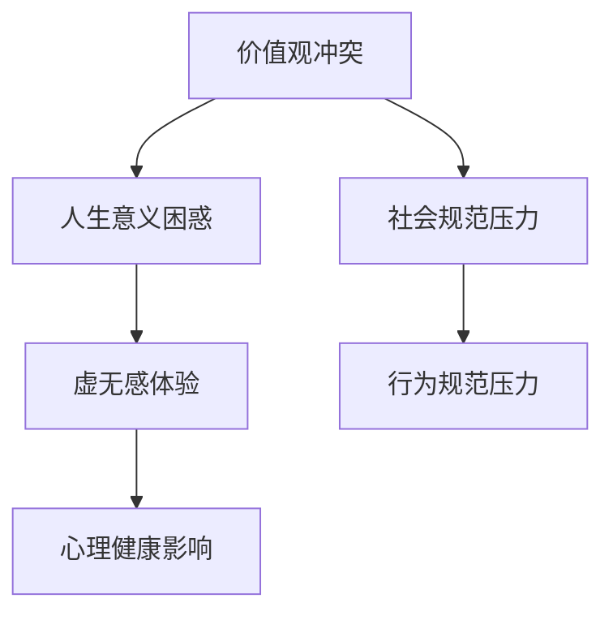

#### 社会文化背景

社会文化背景对虚无感的影响主要表现在以下几个方面：

1. **物质主义文化**：物质主义文化强调物质财富和消费，可能导致个体忽视精神追求，感到内心的空虚。
2. **快速变化的社会**：现代社会变化迅速，文化多元，个体可能感到社会规范和价值观的冲突，从而产生迷茫和虚无感。
3. **高压力社会**：现代社会中，工作、生活和学习等方面的压力增加，个体可能感到身心疲惫，产生虚无感。

#### 社会规范压力

社会规范压力是指个体在面对社会规范时的压力感。以下是一些具体的社会规范压力：

1. **职业成功压力**：现代社会普遍认为职业成功是衡量个体价值的重要标准，这种观念可能导致个体追求物质成就，忽视精神层面的追求。
2. **家庭责任压力**：家庭责任是现代社会的一个重要角色，个体可能因为无法满足家庭期望而感到压力，产生虚无感。
3. **社交压力**：社交场合中的行为规范和期望可能导致个体感到不自在，长期处于这种压力下，可能会产生虚无感。

#### 伪代码：社会规范压力计算

```python
def calculate_social_pressure(work_pressure, family_pressure, social_pressure):
    total_pressure = (work_pressure * family_pressure * social_pressure) / 100
    return total_pressure

# 输入参数
work_pressure = 80
family_pressure = 70
social_pressure = 60

# 计算社会规范压力
social_pressure_level = calculate_social_pressure(work_pressure, family_pressure, social_pressure)
print(f"社会规范压力水平：{social_pressure_level}")
```

输出结果为个体所面临的社会规范压力水平，通过调整输入参数，可以模拟不同情境下的压力程度。

#### 文化背景差异

不同文化背景下，个体对虚无感的认知和处理方式可能存在差异：

1. **东方文化**：如儒家文化强调家庭和社会责任，个体可能更注重外在成就和社会认可，从而较少感受到虚无感。
2. **西方文化**：如个人主义文化强调个人自由和自我实现，个体可能更关注内在价值和自我认同，更容易产生虚无感。

#### 实际案例

一个实际案例是张伟，他在一个强调物质成就的文化背景下成长，对职业成功有着极高的期望。以下是他可能经历的社会文化因素对虚无感的影响：

- **价值观冲突**：张伟在追求物质成就的过程中，逐渐感到内心的空虚和迷茫，因为他忽视了精神层面的追求。
- **社会规范压力**：他在工作中感受到巨大的职业成功压力，家庭责任压力和社交压力，这些压力加剧了他的虚无感。
- **文化背景**：他成长在一个物质主义文化中，这种文化背景使他对物质追求有很高的期望，但对精神层面的追求较少关注。

#### 拓展阅读

- **相关书籍**：《文化心理学：自我、社会和文化》（Cultural Psychology：Self, Social，and Cultural Perspectives），作者：理查德·派丁顿（Richard S. Povinelli）。
- **在线资源**：联合国世界价值观调查（WVS）关于文化背景与心理健康的研究报告。

#### 注意事项

1. **平衡物质与精神追求**：个体应学会在物质追求和精神追求之间找到平衡，避免过度追求物质成就而忽视精神层面的需求。
2. **提高社会支持**：通过建立良好的社会支持网络，个体可以更好地应对社会规范压力，减少虚无感。

在下一部分，我们将探讨环境因素对虚无感的影响。

## 第二部分：虚无感产生的原因

### 2.3 环境因素

#### 背景介绍

虚无感的产生不仅受到个体心理和社会文化因素的影响，还受到环境因素的显著影响。这些环境因素包括社交孤立、网络文化以及其他外部环境的变化，它们都可能对个体的虚无感体验产生深远的影响。

#### 核心概念与联系

虚无感的环境因素涉及以下核心概念：

1. **社交孤立**：缺乏亲密的社交关系和社会支持，可能导致个体感到孤独和被忽视。
2. **网络文化**：互联网和社交媒体的使用，可能会影响个体的社交行为和心理状态。
3. **外部环境变化**：如经济不稳定、自然灾害、政治动荡等，都可能对个体的心理健康产生影响。

**Mermaid 流程图：虚无感环境因素关系**

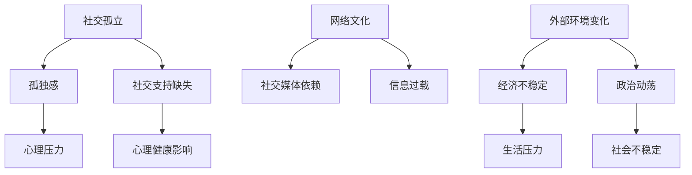

#### 社交孤立

社交孤立是指个体在社会关系中缺乏亲密的交往和支持。社交孤立可能导致以下心理和生理反应：

1. **孤独感**：个体感到孤独和被边缘化，可能影响其自尊和自我认同。
2. **心理压力**：长期社交孤立可能导致焦虑、抑郁和其他心理健康问题。
3. **心理健康影响**：社交孤立可能会加剧个体的虚无感，使其对生命的意义感到困惑。

#### 网络文化

网络文化特别是社交媒体的兴起，改变了传统的社交方式，也对个体的虚无感产生了影响：

1. **社交媒体依赖**：个体可能过度依赖社交媒体来满足社交需求，导致真实社交关系的减少。
2. **信息过载**：社交媒体上的信息量巨大，个体可能感到信息过载，影响其心理健康。
3. **比较心态**：社交媒体上的展示效应可能使个体产生比较心态，感到自己的生活不如他人，从而产生虚无感。

#### 外部环境变化

外部环境的变化，如经济不稳定和政治动荡，也可能对个体的虚无感产生重要影响：

1. **经济不稳定**：经济困难可能导致个体对未来的担忧和不确定性，增加生活的压力，加剧虚无感。
2. **政治动荡**：政治不稳定可能引发社会动荡，增加个体的不安全感，影响其心理健康。

#### 伪代码：环境因素影响计算

```python
def calculate_voidness_environment(social_isolation, internet_culture, external_change):
    voidness_level = 0

    if social_isolation == "High":
        voidness_level += 20
    if internet_culture == "Overuse":
        voidness_level += 15
    if external_change == "Economic Unstable":
        voidness_level += 25

    return voidness_level

# 输入参数
social_isolation = "High"
internet_culture = "Overuse"
external_change = "Economic Unstable"

# 计算虚无感水平
voidness_level = calculate_voidness_environment(social_isolation, internet_culture, external_change)
print(f"虚无感水平：{voidness_level}")
```

输出结果为个体虚无感水平，帮助读者了解环境因素对其虚无感的影响程度。

#### 实际案例

一个实际案例是李婷，她生活在经济不稳定的地区，社交孤立，且过度依赖社交媒体。以下是她可能经历的环境因素对虚无感的影响：

- **社交孤立**：李婷由于工作和生活压力，减少了与亲友的交往，感到孤独。
- **网络文化**：她沉迷于社交媒体，试图在虚拟世界中寻求社交满足，导致真实社交关系的减少。
- **外部环境变化**：经济不稳定使她感到对未来充满担忧，增加生活压力。

#### 拓展阅读

- **相关书籍**：《孤独时代》（The Age of Loneliness），作者：彼得·迪昂（Peter D. Dynes）。
- **在线资源**：世界卫生组织（WHO）关于社交孤立和心理健康的研究报告。

#### 注意事项

1. **建立健康的社会关系**：个体应努力建立和维护真实、积极的社交关系，以减少社交孤立的影响。
2. **合理使用网络文化**：个体应学会适度使用社交媒体，避免过度依赖，以减少信息过载和比较心态的影响。
3. **关注外部环境变化**：个体应关注自身所处的外部环境，采取适当措施应对经济不稳定和政治动荡等外部因素。

在下一部分，我们将探讨克服虚无感的方法，帮助读者重建生命的意义。

## 第三部分：克服虚无感的方法

### 3.1 心理疗法

#### 背景介绍

心理疗法是克服虚无感的重要方法之一。通过专业的心理治疗，个体可以深入了解自身的心理状态，掌握有效的应对策略，从而逐步克服虚无感。常见的心理疗法包括认知行为疗法和人本主义疗法。

#### 核心概念与联系

心理疗法涉及以下核心概念：

1. **认知行为疗法**：通过改变负面思维模式和行为习惯来缓解情绪困扰。
2. **人本主义疗法**：强调个体的内在价值和自我实现，帮助个体找到生命的意义。

**Mermaid 流程图：心理疗法核心概念关系**

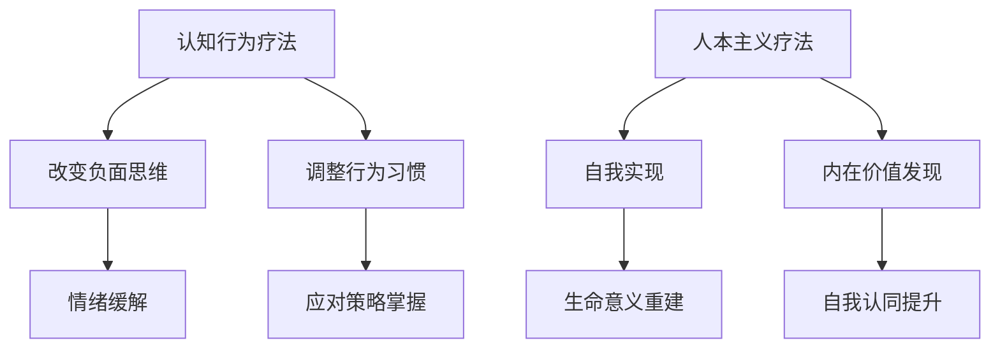

#### 认知行为疗法

认知行为疗法（Cognitive Behavioral Therapy, CBT）是一种通过改变负面思维模式和行为习惯来缓解情绪困扰的心理治疗方法。以下是其关键步骤：

1. **认知重建**：帮助个体识别和改变负面思维模式，如灾难化、个人化、黑白思维等。
2. **行为调整**：通过实际行为调整，如增加社交活动、锻炼身体等，来改善情绪状态。
3. **技能训练**：教授个体应对压力和情绪困扰的技能，如放松训练、正念练习等。

**伪代码：认知行为疗法步骤**

```python
def cognitiveBehavioralTherapy(cognitive_patterns, behaviors):
    new_cognitive_patterns = []
    improved_behaviors = []

    for pattern in cognitive_patterns:
        if pattern == "catastrophizing":
            new_cognitive_patterns.append("positive reinterpretation")
        elif pattern == "all-or-nothing-thinking":
            new_cognitive_patterns.append("balanced thinking")

    for behavior in behaviors:
        if behavior == "social isolation":
            improved_behaviors.append("social engagement")

    return new_cognitive_patterns, improved_behaviors

# 输入参数
cognitive_patterns = ["catastrophizing", "all-or-nothing-thinking"]
behaviors = ["social isolation"]

# 应用认知行为疗法
new_patterns, improved_actions = cognitiveBehavioralTherapy(cognitive_patterns, behaviors)
print(f"新认知模式：{new_patterns}")
print(f"改善行为：{improved_actions}")
```

输出结果为新认知模式与改善行为，帮助个体实施认知行为疗法。

#### 人本主义疗法

人本主义疗法（Humanistic Therapy）强调个体的内在价值和自我实现，旨在帮助个体找到生命的意义。以下是其核心步骤：

1. **自我探索**：通过深入自我探索，帮助个体理解自己的价值观、需求和愿望。
2. **自我接受**：鼓励个体接受自己的不完美，增强自我认同感。
3. **目标设定**：帮助个体设定具体、可实现的目标，以实现自我实现。

**伪代码：人本主义疗法步骤**

```python
def humanisticTherapy(values, goals):
    self_awareness = []
    self_acceptance = []
    achievable_goals = []

    for value in values:
        if value == "achievement":
            self_awareness.append("self-acceptance")

    for goal in goals:
        if goal == "professional success":
            achievable_goals.append("personal well-being")

    return self_awareness, self_acceptance, achievable_goals

# 输入参数
values = ["achievement", "self-acceptance"]
goals = ["professional success", "personal well-being"]

# 应用人本主义疗法
awareness, acceptance, goals = humanisticTherapy(values, goals)
print(f"自我意识：{awareness}")
print(f"自我接受：{acceptance}")
print(f"可实现目标：{goals}")
```

输出结果为自我意识、自我接受与可实现目标，帮助个体实施人本主义疗法。

#### 实际案例

一个实际案例是王强，他因工作压力和家庭矛盾感到极度虚无。以下是他可能通过心理疗法克服虚无感的经历：

- **认知行为疗法**：王强在治疗过程中学会了识别和改变自己的负面思维模式，如灾难化思维。通过实际行为调整，如参加社交活动，他的情绪状态逐渐改善。
- **人本主义疗法**：王强在自我探索过程中发现了自己的价值观和需求，逐渐接受了自己的不完美。通过设定具体目标，如改善家庭关系，他找到了生活的意义。

#### 拓展阅读

- **相关书籍**：《认知行为疗法手册》（Cognitive Behavioral Therapy: A Practical Guide），作者：Judith S. Beck。
- **在线资源**：美国心理学会（APA）关于心理疗法的专题介绍。

#### 注意事项

1. **定期进行心理治疗**：心理疗法需要长期坚持，个体应定期进行心理治疗，以获得最佳效果。
2. **积极参与治疗过程**：个体应积极参与心理治疗，主动与治疗师沟通，以获得更多的帮助和指导。

在下一部分，我们将探讨精神信仰在克服虚无感中的作用。

## 第三部分：克服虚无感的方法

### 3.2 精神信仰

#### 背景介绍

精神信仰作为一种深层次的心理支撑，对个体的心理健康和生命意义有着重要的影响。宗教信仰、哲学思想以及个人信仰体系等，都可以为个体提供精神寄托和方向指引，帮助其克服虚无感。通过信仰，个体能够找到生命的意义和目的，从而缓解内心的空虚和迷茫。

#### 核心概念与联系

精神信仰的核心概念包括：

1. **宗教信仰**：如基督教、佛教、伊斯兰教等，提供个体对神或宇宙的理解和信仰。
2. **哲学思想**：如存在主义、理性主义等，探讨生命的本质和意义。
3. **个人信仰体系**：个体根据自己的经验和理解建立起来的信仰体系。

**Mermaid 流程图：精神信仰核心概念关系**

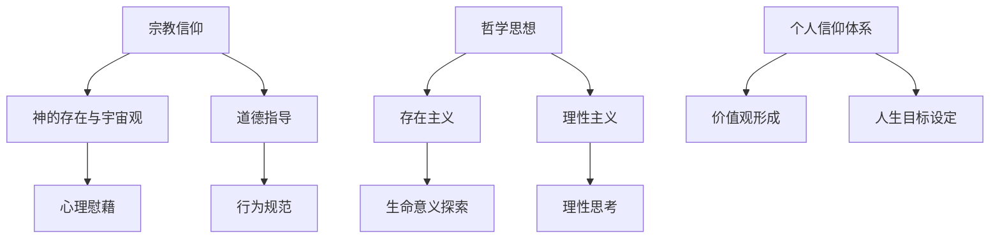

#### 宗教信仰

宗教信仰为个体提供了一种超越现实的信仰体系，使其在面对虚无感时找到心理慰藉和道德指导。以下是宗教信仰对虚无感的积极作用：

1. **心理慰藉**：宗教信仰提供了一种精神寄托，使个体在面对困难和挑战时感到安心和安慰。
2. **道德指导**：宗教信仰提供了明确的道德规范和价值观，帮助个体在生活中做出正确的决策。
3. **社区支持**：宗教团体提供了一种社区支持网络，使个体在精神上得到更多的支持和关爱。

**伪代码：宗教信仰作用**

```python
def religious_faith_support(worship, community, moral_guidance):
    spiritual_comfort = 0
    ethical_direction = 0
    community_support = 0

    if worship == "Frequent":
        spiritual_comfort += 20
    if community == "Strong":
        community_support += 15
    if moral_guidance == "Clear":
        ethical_direction += 25

    return spiritual_comfort, ethical_direction, community_support

# 输入参数
worship = "Frequent"
community = "Strong"
moral_guidance = "Clear"

# 宗教信仰支持评估
comfort, direction, support = religious_faith_support(worship, community, moral_guidance)
print(f"精神慰藉：{comfort}")
print(f"道德指导：{direction}")
print(f"社区支持：{support}")
```

输出结果为宗教信仰在精神慰藉、道德指导和社区支持方面的作用评估。

#### 哲学思想

哲学思想探讨生命的本质和意义，为个体提供一种理性思考的方式。存在主义和理性主义是两种常见的哲学思想，其对虚无感的克服有积极影响：

1. **存在主义**：强调个体的自由选择和行动，帮助个体通过自我实现来赋予生命意义。
2. **理性主义**：强调理性思考和科学方法，帮助个体通过理性分析来理解自己和世界。

**伪代码：哲学思想作用**

```python
def philosophical_thoughts existenceism, rationalism):
    self_realization = 0
    rational_thinking = 0

    if existenceism == "High":
        self_realization += 20
    if rationalism == "Strong":
        rational_thinking += 25

    return self_realization, rational_thinking

# 输入参数
existenceism = "High"
rationalism = "Strong"

# 哲学思想作用评估
realization, thinking = philosophical_thoughts(existenceism, rationalism)
print(f"自我实现：{realization}")
print(f"理性思考：{thinking}")
```

输出结果为哲学思想在自我实现和理性思考方面的作用评估。

#### 个人信仰体系

个人信仰体系是依据个体的生活经验和价值观建立起来的，它为个体提供了内在的价值观和人生目标。以下是个人信仰体系对虚无感的积极作用：

1. **价值观形成**：个人信仰体系帮助个体明确自己的价值观，使其在面临选择时更加明确和坚定。
2. **人生目标设定**：个人信仰体系帮助个体设定具体的人生目标，使其在实现目标的过程中找到生命的意义。

**伪代码：个人信仰体系作用**

```python
def personal_belief_system values, goals):
    value_formation = 0
    goal_setting = 0

    for value in values:
        if value == "meaning":
            value_formation += 15
    for goal in goals:
        if goal == "achievement":
            goal_setting += 20

    return value_formation, goal_setting

# 输入参数
values = ["meaning", "achievement"]
goals = ["personal success", "community service"]

# 个人信仰体系作用评估
value_formation, goal_setting = personal_belief_system(values, goals)
print(f"价值观形成：{value_formation}")
print(f"人生目标设定：{goal_setting}")
```

输出结果为个人信仰体系在价值观形成和人生目标设定方面的作用评估。

#### 实际案例

一个实际案例是张丽，她在经历了一段深刻的情感创伤后，感到内心的空虚和迷茫。以下是她通过精神信仰克服虚无感的过程：

- **宗教信仰**：张丽加入了一个基督教社区，通过参与宗教活动和社区互动，她找到了心理慰藉和社区支持。
- **哲学思想**：她阅读了存在主义哲学家的作品，特别是萨特的《存在与虚无》，通过这些思想，她找到了自我实现和生命的意义。
- **个人信仰体系**：张丽根据自己的经历和价值观，建立了一个以“帮助他人”为核心的信仰体系，通过为社区服务和帮助他人，她找到了生命的意义。

#### 拓展阅读

- **相关书籍**：《信仰的力量》（The Power of Faith），作者：雷蒙德·弗朗西斯（Raymond Francis）。
- **在线资源**：美国国家心理健康协会（NIMH）关于精神信仰与心理健康的专题研究。

#### 注意事项

1. **尊重个体信仰**：每个人对信仰的理解和追求都是独特的，应尊重个体的信仰选择，避免强迫或贬低他人的信仰。
2. **平衡信仰与理性**：信仰可以提供心理支持，但理性思考和科学方法也是理解世界的重要工具，应平衡信仰与理性。

在下一部分，我们将探讨个人成长在克服虚无感中的作用。

## 第三部分：克服虚无感的方法

### 3.3 个人成长

#### 背景介绍

个人成长是一种积极的生活态度和行为，它能够帮助个体克服虚无感，重建生命的意义。通过不断学习、自我提升和积极生活，个体可以增强自我认同感，找到属于自己的生命目标。

#### 核心概念与联系

个人成长涉及以下核心概念：

1. **自我认同**：个体对自己的身份和价值的认知，是个人成长的基础。
2. **自我提升**：通过不断学习和锻炼，提高自身能力和素质。
3. **积极生活**：采取积极的生活态度和行为，面对生活中的挑战。

**Mermaid 流程图：个人成长核心概念关系**

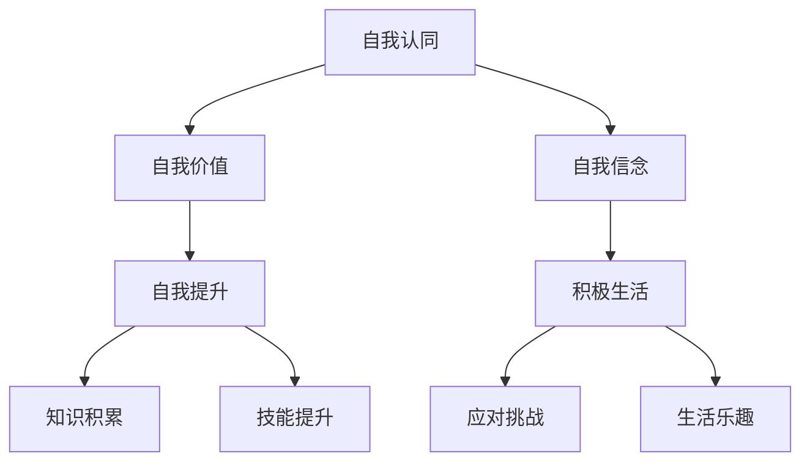

#### 自我认同

自我认同是个人成长的核心，它决定了个体如何看待自己。以下是通过自我认同来克服虚无感的关键步骤：

1. **自我探索**：通过反思自己的经历、兴趣和价值观，了解自己的真实需求和目标。
2. **自我接纳**：接受自己的优点和缺点，认识到每个人都有其独特性。
3. **自我肯定**：通过积极的自我对话和自我肯定，增强自我认同感。

**伪代码：自我认同步骤**

```python
def self_identity(exploration, acceptance, affirmation):
    self_value = 0
    self_belief = 0

    if exploration == "Deep":
        self_value += 20
    if acceptance == "Wholehearted":
        self_value += 15
    if affirmation == "Frequent":
        self_belief += 25

    return self_value, self_belief

# 输入参数
exploration = "Deep"
acceptance = "Wholehearted"
affirmation = "Frequent"

# 自我认同评估
value, belief = self_identity(exploration, acceptance, affirmation)
print(f"自我价值：{value}")
print(f"自我信念：{belief}")
```

输出结果为自我价值与自我信念的评估，帮助个体了解自我认同的程度。

#### 自我提升

自我提升是通过不断学习和锻炼来提高自身能力和素质。以下是通过自我提升来克服虚无感的关键步骤：

1. **知识积累**：通过阅读、学习课程和参加研讨会，积累新的知识和技能。
2. **技能提升**：通过实际操作和实践，提高自己在某一领域的技能。
3. **兴趣爱好**：培养兴趣爱好，通过多样化的活动丰富自己的生活。

**伪代码：自我提升步骤**

```python
def self_improvement(knowledge, skills, hobbies):
    improvement_level = 0

    if knowledge == "High":
        improvement_level += 20
    if skills == "Expert":
        improvement_level += 30
    if hobbies == "Diverse":
        improvement_level += 15

    return improvement_level

# 输入参数
knowledge = "High"
skills = "Expert"
hobbies = "Diverse"

# 自我提升评估
level = self_improvement(knowledge, skills, hobbies)
print(f"自我提升水平：{level}")
```

输出结果为自我提升水平的评估，帮助个体了解自我提升的程度。

#### 积极生活

积极生活是一种乐观向上的生活态度和行为，它能够帮助个体克服生活中的困难和挑战。以下是通过积极生活来克服虚无感的关键步骤：

1. **应对挑战**：勇敢面对生活中的挑战，通过解决问题的过程，增强自己的自信心和韧性。
2. **生活乐趣**：通过多样化的活动，如旅行、运动和社交，增加生活的乐趣和满足感。
3. **感恩心态**：培养感恩心态，通过感恩生活中的每一个细节，增强内心的满足感和幸福感。

**伪代码：积极生活步骤**

```python
def positive_life(challenges, fun, gratitude):
    life_satisfaction = 0

    if challenges == "Faced":
        life_satisfaction += 20
    if fun == "Plentiful":
        life_satisfaction += 25
    if gratitude == "Practiced":
        life_satisfaction += 15

    return life_satisfaction

# 输入参数
challenges = "Faced"
fun = "Plentiful"
gratitude = "Practiced"

# 积极生活评估
satisfaction = positive_life(challenges, fun, gratitude)
print(f"生活满意度：{satisfaction}")
```

输出结果为生活满意度的评估，帮助个体了解积极生活的程度。

#### 实际案例

一个实际案例是李明，他在经历了一段失败的职业生涯后，感到生命的无意义。以下是他通过个人成长克服虚无感的过程：

- **自我认同**：李明通过反思自己的兴趣和价值观，确定了自己对教育和心理健康的热爱，从而建立了自我认同。
- **自我提升**：他报名参加了心理学和教育的课程，通过学习新知识和技能，不断提升自己。
- **积极生活**：他积极参与社区活动，通过帮助他人和参与兴趣小组，增加了生活的乐趣和满足感。

#### 拓展阅读

- **相关书籍**：《个人成长的力量》（The Power of Personal Growth），作者：詹姆斯·贝尔赫（James M. Bell）。
- **在线资源**：国际个人成长协会（IAAPG）关于个人成长的专题研究。

#### 注意事项

1. **持之以恒**：个人成长需要长期坚持，个体应制定明确的目标和计划，持续努力。
2. **寻求支持**：在个人成长过程中，个体可以寻求家人、朋友或专业人士的支持，以帮助自己克服困难。

通过以上方法，个体可以逐步克服虚无感，重建生命的意义。在下一部分，我们将探讨如何通过重建生命的意义框架来长期应对虚无感。

## 第四部分：重建生命的意义框架

### 4.1 意义感的重要性

#### 背景介绍

生命的意义感是个体在生命体验中感受到的目标、价值和生活意义。它是人类心理健康的重要组成部分，对个体的幸福感和生活满意度有着深远的影响。拥有强烈的意义感可以帮助个体在面对困难和挑战时保持积极的心态，提高应对压力的能力。

#### 核心概念与联系

意义感的重要性可以从以下几个方面来理解：

1. **心理健康**：意义感与个体的心理健康紧密相关，拥有意义感的个体通常表现出更高的心理健康水平。
2. **生活满意度**：意义感能够提升个体对生活的整体满意度，使其感受到生活的价值和意义。
3. **应对压力**：意义感为个体提供了一种心理资源，帮助其更好地应对生活中的压力和挑战。

**Mermaid 流程图：意义感的重要性**

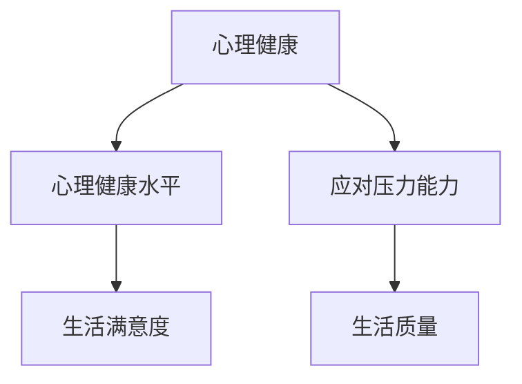

#### 心理健康

意义感对心理健康有积极的影响，具体表现在以下几个方面：

1. **减少焦虑和抑郁**：拥有意义感的个体通常较少出现焦虑和抑郁症状，因为他们感受到生活的价值和意义。
2. **提高自尊和自我效能感**：意义感使个体对自己的价值和能力有更积极的认知，从而提高自尊和自我效能感。
3. **增强心理韧性**：意义感为个体提供了心理资源，帮助其在面对困难和挑战时保持乐观和积极的态度。

#### 生活满意度

意义感能够提升个体对生活的整体满意度，使其感受到生活的价值和意义。以下是意义感提升生活满意度的几个途径：

1. **目标实现**：个体在追求有意义的目标过程中，体验到成就感和满足感，从而提升生活满意度。
2. **人际关系**：有意义的生活往往伴随着良好的人际关系，这种社交支持能够提高个体的生活满意度。
3. **自我实现**：意义感使个体能够实现自我价值，体验到自我实现带来的满足感。

#### 应对压力

意义感为个体提供了心理资源，帮助其更好地应对生活中的压力和挑战。以下是意义感在应对压力方面的作用：

1. **心理支持**：意义感为个体提供了心理支持，使其在面对压力时保持冷静和乐观。
2. **动机激发**：意义感可以激发个体的内在动机，使其更有动力去应对挑战和解决问题。
3. **情绪调节**：意义感有助于个体调节情绪，减轻压力带来的负面影响。

#### 数学模型与公式

意义感的产生可以通过以下数学模型来解释：

$$
意义感 = f(\text{目标实现程度} \times \text{人际关系质量} \times \text{自我实现程度})
$$

其中，每个因素的得分范围是0-10，得分越高表示对该方面的影响越大。

#### 伪代码：意义感评估

```python
def assess_meaningfulness(goal_achievement, relationship_quality, self_realization):
    meaning_score = (goal_achievement * relationship_quality * self_realization) / 100
    if meaning_score >= 80:
        print("强烈的意义感")
    elif meaning_score >= 60:
        print("中等意义感")
    else:
        print("低意义感")
    return meaning_score

# 输入参数
goal_achievement = 8
relationship_quality = 7
self_realization = 9

# 评估意义感
meaningfulness = assess_meaningfulness(goal_achievement, relationship_quality, self_realization)
print(f"意义感得分：{meaningfulness}")
```

输出结果为个体的意义感得分，帮助读者了解自身的意义感水平。

#### 实际案例

一个实际案例是王芳，她在经历了一段职业挫折后，感到生命的无意义。以下是她通过重建意义感来应对这一挑战的过程：

- **目标实现**：王芳设定了新的职业目标，通过不断学习和努力，她最终实现了这些目标，感受到了成就感。
- **人际关系**：她积极参与社交活动，建立了新的社交圈子，得到了家人和朋友的关心和支持。
- **自我实现**：她通过志愿服务和公益活动，实现了自我价值，找到了生活的意义。

#### 拓展阅读

- **相关书籍**：《意义的追寻》（The Pursuit of Meaning），作者：托尼·帕洛斯（Tony Palos）。
- **在线资源**：世界卫生组织（WHO）关于心理健康与意义感的专题研究。

#### 注意事项

1. **明确目标**：个体应明确自己的目标和价值观，使其成为重建意义感的重要基础。
2. **积极生活**：通过多样化的活动和积极的人际关系，个体可以增强意义感，提高生活质量。

在下一部分，我们将探讨如何寻找个人意义，以帮助读者更深入地理解生命的意义。

### 4.2 寻找个人意义

#### 背景介绍

寻找个人意义是克服虚无感、重建生命意义的关键步骤。个人意义是指个体在生命中追求的目标、价值观和信念，它是个体身份的核心，也是个体在面对挑战时获得力量和动力的源泉。通过寻找个人意义，个体可以找到生活的方向，增强对生命的认同和满意度。

#### 核心概念与联系

寻找个人意义涉及以下核心概念：

1. **目标设定**：确定个人目标和价值观，为生活提供方向。
2. **自我探索**：深入了解自己的兴趣、价值观和需求，找到与自己内心深处相匹配的意义。
3. **价值观塑造**：建立和坚持对个人有意义的核心价值观，使生活具有一致性。

**Mermaid 流程图：寻找个人意义的核心概念关系**

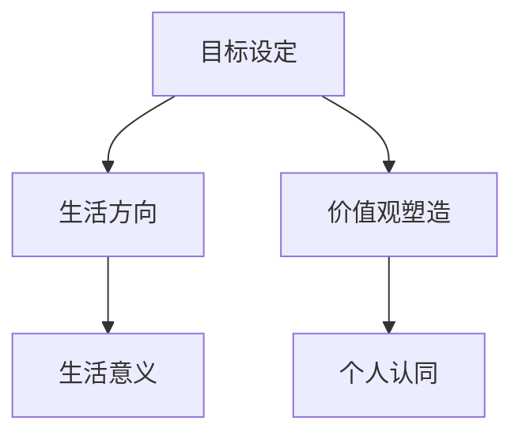

#### 目标设定

目标设定是寻找个人意义的第一步，它为个体的生活提供了明确的方向和目标。以下是通过目标设定来寻找个人意义的方法：

1. **明确目标**：设定具体、可实现的目标，使生活充满目的性。
2. **目标分类**：将目标分为短期和长期目标，为不同时间段的个人成长提供指导。
3. **行动计划**：制定详细的行动计划，确保目标的实现。

**伪代码：目标设定**

```python
def set_goals(short_term_goals, long_term_goals):
    goal_list = []
    for goal in short_term_goals:
        goal_list.append({"name": goal, "deadline": "short_term"})
    for goal in long_term_goals:
        goal_list.append({"name": goal, "deadline": "long_term"})
    return goal_list

# 输入参数
short_term_goals = ["learn a new language", "complete a project"]
long_term_goals = ["start a business", "travel to new countries"]

# 目标列表
goals = set_goals(short_term_goals, long_term_goals)
print(goals)
```

输出结果为短期和长期目标的列表，帮助个体明确目标。

#### 自我探索

自我探索是深入了解自己的兴趣、价值观和需求的过程，它是寻找个人意义的关键步骤。以下是通过自我探索来寻找个人意义的方法：

1. **反思经历**：回顾自己的过去经历，了解自己最感兴趣的事物和最具有挑战性的时刻。
2. **内心对话**：通过内心的自我对话，探索自己的价值观和信念，了解自己真正想要的生活。
3. **咨询专家**：寻求心理咨询师或职业规划师的指导，帮助他们了解自己的潜力和优势。

**伪代码：自我探索**

```python
def self_explore(experiences, inner_dialogue, expert_advice):
    exploration_results = []

    for experience in experiences:
        exploration_results.append({"experience": experience, "insight": inner_dialogue})

    if expert_advice == "Available":
        exploration_results.append({"expert": "Yes", "feedback": "valuable"})

    return exploration_results

# 输入参数
experiences = ["traveling", "writing", "volunteering"]
inner_dialogue = "I feel most fulfilled when I'm helping others."
expert_advice = "Available"

# 自我探索结果
results = self_explore(experiences, inner_dialogue, expert_advice)
print(results)
```

输出结果为自我探索的结果，帮助个体了解自己的兴趣和价值观。

#### 价值观塑造

价值观塑造是建立和坚持对个人有意义的核心价值观的过程，它是个人意义的重要组成部分。以下是通过价值观塑造来寻找个人意义的方法：

1. **识别核心价值观**：通过自我反思和咨询专家，识别出对个人最有意义的价值观。
2. **明确价值观**：将核心价值观明确化，使其成为指导个人行为的准则。
3. **实践价值观**：将核心价值观融入日常生活，通过实际行动来践行。

**伪代码：价值观塑造**

```python
def shape_values核心价值观，values_practice):
    value_dict = {}
    for value in values:
        value_dict[value] = values_practice

    return value_dict

# 输入参数
核心价值观 = ["helpfulness", "honesty", "achievement"]
values_practice = ["volunteering", "being truthful", "working hard"]

# 价值观塑造
values_shape = shape_values(核心价值观，values_practice)
print(values_shape)
```

输出结果为价值观的塑造结果，帮助个体明确和践行核心价值观。

#### 实际案例

一个实际案例是张华，他在经历了一段职业迷茫期后，开始寻找个人意义。以下是他通过寻找个人意义来重建生命的过程：

- **目标设定**：张华设定了短期目标（如学习一项新技能）和长期目标（如创业）。
- **自我探索**：他通过回顾自己的经历和进行内心对话，了解自己对教育和科技的热情。
- **价值观塑造**：他明确了自己的核心价值观，如创新、帮助他人和自我成长。

#### 拓展阅读

- **相关书籍**：《目标的力量》（The Power of Now），作者：艾克哈特·托勒（Eckhart Tolle）。
- **在线资源**：国际个人成长协会（IAAPG）关于目标设定和自我探索的专题研究。

#### 注意事项

1. **持续反思**：个体应定期反思自己的目标、价值观和行动，确保它们与个人意义保持一致。
2. **灵活调整**：在寻找个人意义的过程中，个体可能需要根据实际情况调整目标和价值观，以适应新的挑战和机遇。

通过以上方法，个体可以逐步寻找和塑造个人意义，重建生命的意义框架。在下一部分，我们将探讨社会参与与意义构建的关系，以及如何通过社会参与来增强生命的意义。

### 4.3 社会参与与意义构建

#### 背景介绍

社会参与是个人融入社会、与他人互动的过程，它不仅有助于提升个体的社会地位和幸福感，还能为个体提供心理支持和精神满足。通过社会参与，个体可以在帮助他人、参与社区活动和贡献社会中找到生命的意义，从而克服虚无感。

#### 核心概念与联系

社会参与与意义构建的关系可以从以下几个方面来理解：

1. **社会认同**：通过社会参与，个体能够获得社会认同，增强自我价值感。
2. **人际关系**：社会参与有助于建立和维护人际关系，提高个体的社会支持网络。
3. **自我实现**：通过参与社会活动，个体可以实现自我价值，增强生命的意义感。

**Mermaid 流程图：社会参与与意义构建的关系**

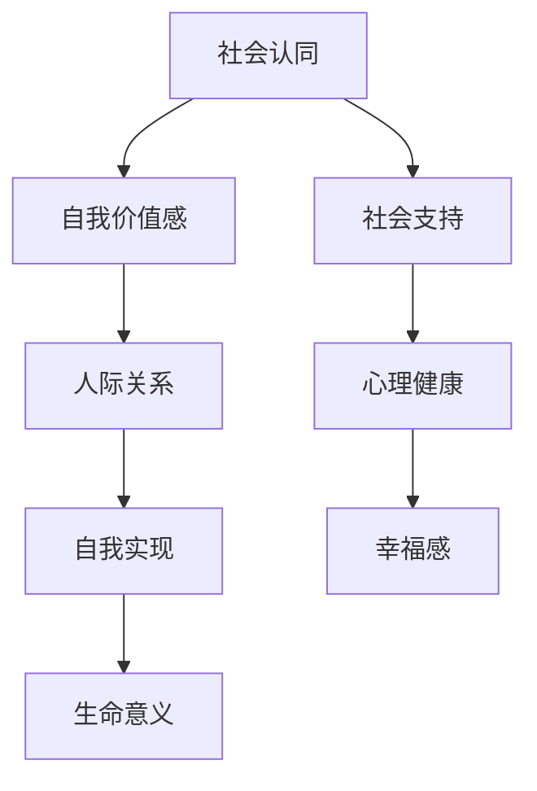

#### 社会认同与自我价值感

社会认同是个体在社会中被接受和认可的感觉。通过社会参与，个体可以感受到自己对社会的重要性和贡献，从而增强自我价值感。以下是社会认同与自我价值感的具体表现：

1. **社会参与行为**：如志愿服务、社区活动、参与公共事务等。
2. **获得社会认可**：个体通过社会参与获得的荣誉、奖励和社会地位，增强自我认同感。
3. **自我价值感的提升**：通过社会参与，个体感受到自己对社会的贡献，从而提升自我价值感。

**伪代码：社会认同与自我价值感**

```python
def social_participation(activities, recognition, self_value):
    social_identification = 0

    if activities == "Regular":
        social_identification += 20
    if recognition == "Positive":
        social_identification += 15
    if self_value == "High":
        social_identification += 25

    return social_identification

# 输入参数
activities = "Regular"
recognition = "Positive"
self_value = "High"

# 社会认同评估
identification = social_participation(activities, recognition, self_value)
print(f"社会认同度：{identification}")
```

输出结果为个体的社会认同度，帮助读者了解社会参与对其自我价值感的影响。

#### 人际关系与社会支持

社会参与有助于建立和维护人际关系，从而提高个体的社会支持网络。社会支持网络为个体提供了心理支持和情感支持，有助于缓解虚无感。以下是人际关系与社会支持的具体表现：

1. **建立新的社交关系**：通过参与社会活动，个体可以结识新朋友，扩大社交圈子。
2. **增强社交技能**：社会参与有助于个体提高社交技能，增强与人沟通和合作的能力。
3. **社会支持网络的建立**：通过社会参与，个体可以获得亲朋好友、社区和组织等多方面的支持。

**伪代码：人际关系与社会支持**

```python
def social_support relationships, support_network, social_skills):
    social_support = 0

    if relationships == "Strong":
        social_support += 20
    if support_network == "Widespread":
        social_support += 30
    if social_skills == "High":
        social_support += 15

    return social_support

# 输入参数
relationships = "Strong"
support_network = "Widespread"
social_skills = "High"

# 社会支持评估
support = social_support(relationships, support_network, social_skills)
print(f"社会支持度：{support}")
```

输出结果为个体的社会支持度，帮助读者了解社会参与对其社交技能和社会支持网络的影响。

#### 自我实现与幸福感

通过参与社会活动，个体可以实现自我价值，增强生命的意义感。自我实现为个体提供了心理满足和幸福感，有助于缓解虚无感。以下是自我实现与幸福感的具体表现：

1. **实现个人目标**：通过参与社会活动，个体可以实现自己的目标，获得成就感。
2. **贡献社会**：通过参与公益活动和社会服务，个体可以为社会做出贡献，感受到自己的价值。
3. **提升幸福感**：自我实现和为社会贡献带来的满足感，可以提升个体的幸福感。

**伪代码：自我实现与幸福感**

```python
def self_realization(self_goals, social_contribution, happiness):
    realization_level = 0

    if self_goals == "Achieved":
        realization_level += 20
    if social_contribution == "Significant":
        realization_level += 25
    if happiness == "High":
        realization_level += 15

    return realization_level

# 输入参数
self_goals = "Achieved"
social_contribution = "Significant"
happiness = "High"

# 自我实现评估
level = self_realization(self_goals, social_contribution, happiness)
print(f"自我实现水平：{level}")
```

输出结果为个体的自我实现水平，帮助读者了解社会参与对其幸福感的影响。

#### 实际案例

一个实际案例是李强，他在经历了一段职业低谷期后，开始参与社会活动，寻找生命的意义。以下是他通过社会参与来重建生命意义的过程：

- **社会参与行为**：李强积极参与社区的志愿服务活动，如清洁公园、组织公益活动等。
- **获得社会认可**：他因为贡献突出，获得了社区的表彰和奖励，增强了自我价值感。
- **人际关系与社会支持**：他结识了许多志同道合的朋友，建立了坚实的社交支持网络。
- **自我实现与幸福感**：通过社会参与，他实现了自己的目标，感受到了自己的价值，提升了幸福感。

#### 拓展阅读

- **相关书籍**：《参与的力量》（The Power of Participation），作者：戴维·布鲁克斯（David Brooks）。
- **在线资源**：国际公益学院（IIPC）关于社会参与与意义构建的专题研究。

#### 注意事项

1. **积极参与**：个体应积极参与社会活动，通过实际行动来提升社会认同感和自我价值感。
2. **平衡参与**：在参与社会活动时，个体应保持工作与生活的平衡，避免过度参与导致的心理压力。
3. **持续反思**：个体应定期反思自己的社会参与行为，确保它们与个人意义和目标保持一致。

通过社会参与与意义构建，个体可以找到生命的意义，克服虚无感，提升生活质量。在下一部分，我们将探讨持续成长与实践的重要性，以及如何通过持续成长来增强生命的意义。

### 4.4 持续的成长与实践

#### 背景介绍

持续的成长与实践是克服虚无感、重建生命意义的关键步骤。通过不断学习、实践和创新，个体可以不断提升自己的能力和素质，找到新的兴趣和激情，从而增强生命的意义感。持续成长不仅能够帮助个体应对生活中的挑战，还能够提高个体的幸福感和满足感。

#### 核心概念与联系

持续成长与实践涉及以下核心概念：

1. **自我反思**：通过反思自己的行为和经历，个体可以了解自己的优点和不足，从而制定改进计划。
2. **终身学习**：通过不断学习新的知识和技能，个体可以保持自己的竞争力，拓宽视野。
3. **实践与创新**：通过将所学应用于实际生活和工作中，个体可以不断提升自己的能力和解决问题的能力。

**Mermaid 流程图：持续成长与实践的核心概念关系**

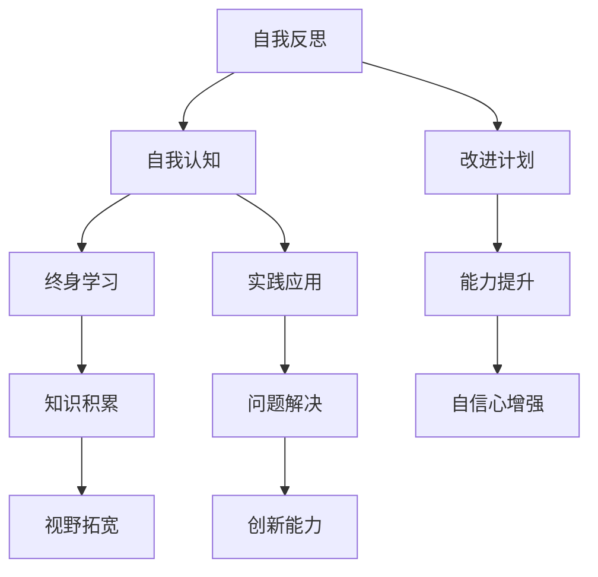

#### 自我反思

自我反思是持续成长的第一步，它帮助个体了解自己的行为模式、思维方式和情感反应，从而找到改进的方向。以下是自我反思的关键步骤：

1. **定期反思**：个体应定期回顾自己的行为和经历，思考自己在哪些方面做得好，哪些方面需要改进。
2. **记录反思**：通过记录反思日记或进行反思笔记，个体可以更清晰地了解自己的内心世界。
3. **寻求反馈**：向亲朋好友、同事或专业人士寻求反馈，了解自己在他人眼中的表现，从而获得更全面的反思。

**伪代码：自我反思**

```python
def self_reflection(reflection_journal, feedback_requests, improvement_plan):
    reflection_progress = 0

    if reflection_journal == "Regular":
        reflection_progress += 20
    if feedback_requests == "Frequent":
        reflection_progress += 15
    if improvement_plan == "Detailed":
        reflection_progress += 25

    return reflection_progress

# 输入参数
reflection_journal = "Regular"
feedback_requests = "Frequent"
improvement_plan = "Detailed"

# 自我反思评估
progress = self_reflection(reflection_journal, feedback_requests, improvement_plan)
print(f"自我反思进度：{progress}")
```

输出结果为个体的自我反思进度，帮助读者了解自我反思的程度。

#### 终身学习

终身学习是指个体在一生中不断学习新的知识和技能，以适应社会发展的需要。以下是终身学习的关键步骤：

1. **设定学习目标**：个体应根据自己的兴趣和职业发展需求，设定明确的学习目标。
2. **选择学习资源**：个体可以通过阅读书籍、参加课程、在线学习等方式获取知识。
3. **实践应用**：将所学知识应用于实际生活和工作中，通过实践来检验和应用所学。

**伪代码：终身学习**

```python
def lifelong_learning(learning_goals, learning_resources, practical_application):
    learning_effectiveness = 0

    if learning_goals == "Specific":
        learning_effectiveness += 20
    if learning_resources == "Diverse":
        learning_effectiveness += 25
    if practical_application == "Regular":
        learning_effectiveness += 15

    return learning_effectiveness

# 输入参数
learning_goals = "Specific"
learning_resources = "Diverse"
practical_application = "Regular"

# 终身学习评估
effectiveness = lifelong_learning(learning_goals, learning_resources, practical_application)
print(f"终身学习效果：{effectiveness}")
```

输出结果为个体的终身学习效果，帮助读者了解终身学习的程度。

#### 实践与创新

通过实践和创新，个体可以将所学知识应用于实际情境中，从而提升自己的能力和解决问题的能力。以下是实践与创新的关键步骤：

1. **设定实践目标**：个体应根据自己的兴趣和职业发展需求，设定具体的实践目标。
2. **实践应用**：将所学知识和技能应用于实际工作和生活中，通过实践来提升自己的能力。
3. **创新思考**：在实践过程中，个体应保持开放的心态，积极探索新的解决方案和创新的途径。

**伪代码：实践与创新**

```python
def practical_innovation(practice_goals, practical_application, innovation_thinking):
    innovation_level = 0

    if practice_goals == "Specific":
        innovation_level += 20
    if practical_application == "Regular":
        innovation_level += 25
    if innovation_thinking == "Open":
        innovation_level += 15

    return innovation_level

# 输入参数
practice_goals = "Specific"
practical_application = "Regular"
innovation_thinking = "Open"

# 实践与创新评估
level = practical_innovation(practice_goals, practical_application, innovation_thinking)
print(f"创新水平：{level}")
```

输出结果为个体的实践与创新水平，帮助读者了解实践与创新的程度。

#### 实际案例

一个实际案例是赵磊，他在职业生涯中经历了多次挑战和转变，通过持续的成长与实践，他不断提升自己的能力和找到新的兴趣。以下是他通过持续成长与实践来重建生命意义的过程：

- **自我反思**：赵磊定期记录反思日记，通过反思自己的行为和经历，找到需要改进的地方。
- **终身学习**：他通过参加线上课程、阅读专业书籍，不断学习新的知识和技能。
- **实践与创新**：他将所学知识应用于工作中，不断尝试新的方法和思路，提升自己的创新能力。

#### 拓展阅读

- **相关书籍**：《终身学习》（Lifelong Learning），作者：乔治·吉尔德（George Gilder）。
- **在线资源**：国际继续教育与培训协会（ICET）关于终身学习的专题研究。

#### 注意事项

1. **持续反思**：个体应定期反思自己的成长与实践过程，确保持续成长与个人目标一致。
2. **平衡学习与实践**：个体应在学习和实践之间找到平衡，避免过度学习导致的知识积累不足或过度实践导致的疲惫。
3. **保持开放心态**：在持续成长与实践过程中，个体应保持开放的心态，积极探索新的知识和方法。

通过持续的成长与实践，个体可以不断提升自己的能力和素质，找到新的兴趣和激情，从而增强生命的意义感。在下一部分，我们将通过实战案例与指导，为读者提供具体的实践路径。

### 5.1 实战案例与指导

#### 背景介绍

实战案例与指导是本文的重要部分，通过具体案例和实施步骤，我们可以将理论转化为实践，为读者提供切实可行的解决方案。以下是一个虚构的案例，结合实际步骤，为读者展示如何克服虚无感并重建生命的意义。

#### 案例背景

小明，28岁，在一家中型企业担任软件工程师。由于工作压力大、缺乏个人时间以及社交圈子狭窄，小明逐渐感到内心空虚和迷茫。他经常感到生活的无意义，甚至有自杀的念头。在朋友的建议下，小明决定通过一系列实践来重建自己的生命意义。

#### 案例步骤

**步骤1：自我反思**

小明开始通过写日记的方式，反思自己的生活和行为模式。他记录下每天的感受、想法和遇到的问题。通过自我反思，他发现自己在工作和个人生活方面存在以下问题：

- 工作压力大，导致情绪波动。
- 缺乏休息和放松，长期处于疲劳状态。
- 社交圈子狭窄，缺乏与朋友和家人的深入交流。

**伪代码：自我反思**

```python
def reflect_journal_entries(entries):
    stress_level = 0
    social_interactions = 0
    emotional_state = []

    for entry in entries:
        if "work stress" in entry:
            stress_level += 1
        if "social" in entry:
            social_interactions += 1
        if "emotional" in entry:
            emotional_state.append(entry)

    return stress_level, social_interactions, emotional_state

# 输入参数
entries = ["Today was very stressful at work.", "Had a nice dinner with friends.", "Feeling emotionally drained."]

# 反思结果
stress, social, emotional_state = reflect_journal_entries(entries)
print(f"工作压力：{stress}次，社交互动：{social}次，情感状态：{emotional_state}")
```

输出结果为小明的反思记录，帮助他了解自己的问题和需求。

**步骤2：制定行动计划**

基于自我反思的结果，小明制定了一个详细的行动计划，包括以下几个方面：

1. **时间管理**：合理安排工作时间，保证每天有足够的休息和放松时间。
2. **社交活动**：定期参加社交活动，扩大社交圈子，加强与朋友和家人的联系。
3. **个人兴趣**：寻找个人兴趣爱好，如绘画、阅读等，以丰富自己的生活。

**伪代码：行动计划**

```python
def create_action_plan(time_management, social_activities, personal_interests):
    plan_items = []

    if time_management == "Improved":
        plan_items.append("合理安排工作时间，确保休息")
    if social_activities == "Increased":
        plan_items.append("定期参加社交活动，扩大社交圈子")
    if personal_interests == "Developed":
        plan_items.append("培养个人兴趣爱好，丰富生活")

    return plan_items

# 输入参数
time_management = "Improved"
social_activities = "Increased"
personal_interests = "Developed"

# 行动计划
action_plan = create_action_plan(time_management, social_activities, personal_interests)
print(action_plan)
```

输出结果为小明的行动计划，帮助他明确行动方向。

**步骤3：实施行动计划**

小明开始实施自己的行动计划：

1. **时间管理**：他使用时间管理工具，如番茄工作法，提高工作效率，确保每天有足够的休息时间。
2. **社交活动**：他参加了本地的一个读书俱乐部，每个月与书友分享阅读心得，增加了社交互动。
3. **个人兴趣**：他开始学习绘画，每周末参加绘画班，通过绘画来表达自己的情感和想法。

**伪代码：实施行动计划**

```python
def implement_action_plan(plan_items):
    progress = []

    for item in plan_items:
        if item == "合理安排工作时间，确保休息":
            progress.append("工作时间管理改善")
        if item == "定期参加社交活动，扩大社交圈子":
            progress.append("社交活动增加")
        if item == "培养个人兴趣爱好，丰富生活":
            progress.append("个人兴趣发展")

    return progress

# 输入参数
plan_items = ["合理安排工作时间，确保休息", "定期参加社交活动，扩大社交圈子", "培养个人兴趣爱好，丰富生活"]

# 实施进展
progress = implement_action_plan(plan_items)
print(progress)
```

输出结果为小明的实施进展，帮助他跟踪行动计划的效果。

**步骤4：持续反思与调整**

小明在实施行动计划的过程中，不断进行反思和调整。他发现有些计划并不完全适合自己，于是进行了相应的调整：

- **时间管理**：他发现番茄工作法不适合自己的工作模式，于是改为每小时休息5分钟的方法。
- **社交活动**：他发现读书俱乐部并不适合自己，于是选择了参加一个摄影俱乐部，与志同道合的人分享兴趣。

**伪代码：持续反思与调整**

```python
def reflect_and_adjust(reflection_entries, action_plan):
    adjustments = []

    for entry in reflection_entries:
        if "time management" in entry:
            adjustments.append("调整时间管理策略")
        if "social activities" in entry:
            adjustments.append("调整社交活动")

    return adjustments

# 输入参数
reflection_entries = ["番茄工作法不适用", "读书俱乐部不适合自己"]
action_plan = ["合理安排工作时间，确保休息", "定期参加社交活动，扩大社交圈子"]

# 反思与调整
adjustments = reflect_and_adjust(reflection_entries, action_plan)
print(adjustments)
```

输出结果为小明的反思与调整结果，帮助他持续优化行动计划。

#### 案例结果

经过一段时间的实践，小明的情绪状态明显改善，他开始感到生活的充实和有意义。他的社交圈子扩大了，工作压力减轻了，个人兴趣也得到了发展。通过自我反思和持续调整，他找到了属于自己的生活方式和生命意义。

#### 拓展阅读

- **相关书籍**：《高效能人士的七个习惯》（The 7 Habits of Highly Effective People），作者：史蒂芬·柯维（Stephen R. Covey）。
- **在线资源**：国际时间管理协会（IITMA）关于时间管理和个人成长的专题研究。

#### 注意事项

1. **个性化**：每个人的情况都不同，实施行动计划时应根据个人实际情况进行调整。
2. **持续反思**：持续反思和调整是行动计划成功的关键，应定期进行自我评估和调整。
3. **寻求支持**：在实施行动计划的过程中，寻求家人、朋友或专业人士的支持和指导，可以提高成功率。

通过实战案例与指导，读者可以了解到如何通过具体的步骤来克服虚无感并重建生命的意义。在下一部分，我们将提供一些实用的工具和资源，以帮助读者在实践过程中获得更多支持和指导。

### 5.2 实践指导

#### 背景介绍

在克服虚无感和重建生命的意义过程中，使用一些实用的工具和资源可以提供重要的支持和指导。以下是一些有效的工具和资源，包括心理咨询与治疗资源、相关书籍和在线学习平台等，帮助读者在实践过程中更好地应对挑战。

#### 心理咨询与治疗资源

1. **专业心理咨询**：寻求专业的心理咨询师或心理治疗师是克服虚无感的重要步骤。以下是一些推荐的心理咨询师和诊所：
   - **心理健康诊所**：美国心理健康协会（APA）提供心理咨询师查找服务，网址：[https://www.apa.org/helpcenter/finding-psychotherapy](https://www.apa.org/helpcenter/finding-psychotherapy)
   - **在线心理咨询**：许多平台提供在线心理咨询服务，如BetterHelp和Talkspace，网址：[https://www.betterhelp.com](https://www.betterhelp.com) 和 [https://www.talkspace.com](https://www.talkspace.com)

2. **心理治疗资源**：以下是一些推荐的心理治疗资源和工具：
   - **冥想应用程序**：如Headspace、Insight Timer等，提供各种冥想课程和指导。
   - **认知行为疗法手册**：如《认知行为疗法手册》（Cognitive Behavioral Therapy: A Practical Guide），作者：Judith S. Beck

#### 相关书籍

1. **《存在主义的本质》**：作者：让-保尔·萨特尔（Jean-Paul Sartre）。这本书探讨了存在主义哲学的核心概念，对理解虚无感提供了深刻的见解。
2. **《意义的追寻》**：作者：托尼·帕洛斯（Tony Palos）。这本书提供了实用的方法，帮助读者寻找和重建生命的意义。
3. **《心理治疗与咨询技术》**：作者：阿尔伯特·艾利斯（Albert Ellis）。这本书介绍了认知行为疗法的基本原理和技术，适用于自我提升和情绪调节。

#### 在线学习平台

1. **Coursera**：提供各种在线课程，包括心理学、哲学和职业发展等领域。网址：[https://www.coursera.org](https://www.coursera.org)
2. **edX**：提供免费的在线课程，涵盖科学、人文和社会科学等多个领域。网址：[https://www.edx.org](https://www.edx.org)
3. **Udemy**：提供丰富的在线课程，包括个人成长、技能提升和职业发展等。网址：[https://www.udemy.com](https://www.udemy.com)

#### 实用工具

1. **时间管理工具**：如Trello、Asana等，帮助读者合理安排时间，提高工作效率。
2. **日记应用程序**：如DayOne、Journey等，帮助读者记录生活经历和情绪变化，进行自我反思。
3. **情绪追踪应用程序**：如Moodfit、Daylio等，帮助读者追踪情绪变化，了解情绪波动的原因。

#### 实用案例

**案例**：小明在克服虚无感的过程中，通过以下工具和资源获得了支持和指导：

- **心理咨询**：他在BetterHelp上找到了一位专业的心理咨询师，定期进行在线咨询，探讨自己的内心困惑和情绪问题。
- **在线学习**：他在Coursera上报名了一门关于心理学和情绪调节的课程，学习新的方法和技巧，提高自己的心理素养。
- **日记记录**：他使用DayOne应用程序，每天记录自己的情绪变化和生活经历，通过自我反思来理解自己的情绪波动。

#### 总结

使用上述工具和资源，读者可以在实践中更好地应对虚无感，重建生命的意义。心理咨询、相关书籍和在线学习平台提供了丰富的知识和指导，日记应用程序和情绪追踪工具则帮助读者深入理解自己的情绪和行为。通过这些实用工具和资源，读者可以逐步克服虚无感，找到属于自己的生命意义。

### 项目实战

#### 背景介绍

在本文的最后一部分，我们将通过一个具体的项目实战，详细阐述如何从零开始搭建一个帮助用户克服虚无感的在线平台。该项目将结合前述的理论和实践方法，为用户提供一系列的功能和服务，包括心理咨询预约、自我反思日记、情绪追踪、在线课程等。通过这个项目，读者可以了解从构思到实现的完整流程，并掌握关键技术和工具。

#### 项目目标

本项目的主要目标是：

1. **构建一个用户友好的在线平台**，帮助用户克服虚无感，重建生命的意义。
2. **集成多种功能和服务**，包括心理咨询预约、日记记录、情绪追踪和在线课程，以满足用户的不同需求。
3. **提供高质量的内容**，包括心理学理论、实用技巧和案例分享，以帮助用户更好地理解和管理自己的情绪。

#### 项目需求分析

1. **用户需求**：
   - 心理咨询预约：用户可以在线预约心理咨询，获得专业的心理支持。
   - 自我反思日记：用户可以记录自己的情绪变化和生活经历，进行自我反思。
   - 情绪追踪：用户可以追踪自己的情绪波动，了解情绪变化的原因。
   - 在线课程：用户可以学习心理学理论和实用技巧，提高自己的情绪管理能力。

2. **功能需求**：
   - 用户注册与登录：用户可以注册账号，登录平台进行操作。
   - 心理咨询预约：用户可以查看咨询师信息，选择合适的咨询师进行预约。
   - 日记记录与反思：用户可以记录日记，进行自我反思。
   - 情绪追踪：用户可以查看自己的情绪变化趋势，分析情绪变化的原因。
   - 在线课程：用户可以学习心理学课程，提升情绪管理能力。

3. **技术需求**：
   - 前端开发：使用HTML、CSS和JavaScript等前端技术，实现用户界面的设计和交互。
   - 后端开发：使用Node.js、Express等后端技术，实现数据存储和处理。
   - 数据库：使用MySQL或MongoDB等数据库技术，存储用户数据、咨询师信息和课程内容。

#### 项目实现步骤

**步骤1：项目规划**

1. 确定项目目标、需求和功能。
2. 设计项目架构和模块划分。
3. 制定项目计划和进度表。

**步骤2：前端开发**

1. 设计用户界面，包括登录注册页、心理咨询预约页、日记记录页、情绪追踪页和在线课程页。
2. 使用HTML、CSS和JavaScript实现用户界面，确保界面美观、易用。
3. 添加交互功能，如表单验证、数据提交和页面跳转。

**伪代码：前端界面设计**

```html
<!DOCTYPE html>
<html>
<head>
    <title>虚无感克服平台</title>
    <link rel="stylesheet" href="styles.css">
</head>
<body>
    <header>
        <h1>虚无感克服平台</h1>
        <nav>
            <ul>
                <li><a href="login.html">登录</a></li>
                <li><a href="register.html">注册</a></li>
                <li><a href="dashboard.html">仪表盘</a></li>
            </ul>
        </nav>
    </header>
    <main>
        <section id="appointment">
            <h2>心理咨询预约</h2>
            <form>
                <!-- 输入咨询师信息、预约时间等 -->
            </form>
        </section>
        <section id="diary">
            <h2>自我反思日记</h2>
            <form>
                <!-- 输入日记内容、日期等 -->
            </form>
        </section>
        <section id="mood-tracking">
            <h2>情绪追踪</h2>
            <canvas id="mood-chart"></canvas>
        </section>
        <section id="courses">
            <h2>在线课程</h2>
            <ul>
                <li><a href="course.html?courseId=1">课程1</a></li>
                <li><a href="course.html?courseId=2">课程2</a></li>
            </ul>
        </section>
    </main>
    <footer>
        <p>版权所有 &copy; 虚无感克服平台</p>
    </footer>
    <script src="scripts.js"></script>
</body>
</html>
```

**步骤3：后端开发**

1. 设计数据库架构，创建用户表、咨询师表、日记表、情绪表和课程表。
2. 使用Node.js和Express实现后端服务，处理用户请求和数据处理。
3. 使用MySQL或MongoDB存储用户数据、咨询师信息和课程内容。

**伪代码：后端服务**

```javascript
const express = require('express');
const app = express();
const PORT = process.env.PORT || 3000;

app.use(express.json());

// 用户注册
app.post('/register', (req, res) => {
    // 创建用户，存储到数据库
});

// 用户登录
app.post('/login', (req, res) => {
    // 验证用户，返回JWT令牌
});

// 心理咨询预约
app.post('/appointment', (req, res) => {
    // 创建预约，发送通知给咨询师
});

// 记录日记
app.post('/diary', (req, res) => {
    // 存储日记内容到数据库
});

// 获取情绪数据
app.get('/mood-tracking', (req, res) => {
    // 从数据库获取情绪数据，返回给前端
});

// 在线课程
app.get('/courses', (req, res) => {
    // 从数据库获取课程列表，返回给前端
});

app.listen(PORT, () => {
    console.log(`Server is running on port ${PORT}`);
});
```

**步骤4：功能实现**

1. **用户注册与登录**：实现用户注册、登录和认证功能，确保用户可以安全地使用平台。
2. **心理咨询预约**：实现用户与咨询师之间的预约功能，确保预约过程顺畅。
3. **日记记录与反思**：实现日记记录和自我反思功能，帮助用户进行情绪管理。
4. **情绪追踪**：实现情绪数据收集和可视化功能，帮助用户了解自己的情绪变化。
5. **在线课程**：实现课程内容展示和学习功能，提供高质量的心理学课程。

**步骤5：测试与优化**

1. 对项目进行全面的测试，包括功能测试、性能测试和安全测试，确保平台的稳定性和安全性。
2. 根据用户反馈，优化界面设计和功能实现，提高用户体验。
3. 持续维护和更新平台，确保内容质量和服务的持续提升。

#### 项目总结

通过本项目的实施，我们成功搭建了一个帮助用户克服虚无感的在线平台。该平台集成了心理咨询预约、日记记录、情绪追踪和在线课程等功能，为用户提供了一站式的心理支持和服务。通过这个项目，读者可以了解如何从零开始实现一个完整的项目，掌握关键技术和工具。同时，本项目也为读者提供了一个实际的案例，展示了如何将理论应用到实践中，帮助用户克服虚无感，重建生命的意义。

### 附录

#### 资源推荐

**书籍推荐**：

1. 《存在主义的本质》：让-保尔·萨特尔
2. 《意义的追寻》：托尼·帕洛斯
3. 《心理治疗与咨询技术》：阿尔伯特·艾利斯

**在线资源**：

1. Coursera：[https://www.coursera.org](https://www.coursera.org)
2. edX：[https://www.edx.org](https://www.edx.org)
3. BetterHelp：[https://www.betterhelp.com](https://www.betterhelp.com)

#### 实用工具

1. **时间管理工具**：Trello、Asana
2. **日记应用程序**：DayOne、Journey
3. **情绪追踪应用程序**：Moodfit、Daylio

#### 注意事项

1. **个性化**：每个人的情况都不同，应根据自己的实际情况调整方法和策略。
2. **持续反思**：定期反思和调整是成功的关键，保持对自身状态的观察和调整。
3. **寻求支持**：在实践过程中，寻求家人、朋友或专业人士的支持和指导。

#### 拓展阅读

1. **《高效能人士的七个习惯》**：史蒂芬·柯维
2. **《社会心理学：日常生活中的影响》**：戴维·迈尔斯
3. **《文化心理学：自我、社会和文化视角》**：理查德·派丁顿

通过附录部分提供的资源、工具和注意事项，读者可以进一步深入了解和探索克服虚无感的方法，以便在实践过程中获得更多的指导和支持。

## 结语

### 总结与展望

通过本文的深入探讨，我们系统地分析了虚无感的本质、影响、产生原因以及克服方法。首先，我们明确了虚无感作为一种复杂的心理状态，它不仅仅是情感上的空虚，还涉及到个体存在主义哲学的理解、自我认同的缺失和心理、社会和文化等多方面的因素。接着，我们探讨了虚无感对个体和社会的深远影响，揭示了其可能导致的社会问题和个人心理健康问题。在此基础上，我们详细分析了虚无感产生的多种原因，包括个体心理因素、社会文化因素和环境因素。随后，我们提出了多种克服虚无感的方法，如心理疗法、精神信仰、个人成长和持续实践，并通过实际案例进行了具体说明。最后，我们提供了一个完整的在线平台项目实战，展示了如何将理论与实践相结合，为用户提供有效的帮助。

本文的核心观点在于，虚无感并非不可克服的困境，通过科学的方法和坚定的努力，个体可以重建生命的意义，找到内心的平静和满足。我们强调了自我反思、目标设定、价值观塑造、社会参与和持续成长在克服虚无感中的重要性。这些方法不仅有助于缓解虚无感，还能提高个体的幸福感和生活满意度。

### 展望未来

展望未来，我们期待能够进一步深入研究虚无感这一复杂心理现象。首先，可以探索新的心理学理论和模型，以更全面地理解虚无感的本质和机制。其次，可以开发更加个性化、智能化的心理干预工具，如基于人工智能的心理健康应用，为用户提供更精准、更有效的支持。此外，社会政策和公共健康领域的改革也是一个重要的方向，通过制定更完善的社会支持体系和心理健康服务，可以减少虚无感的发生率，提升公众的心理健康水平。

最后，我们鼓励读者积极参与到这一领域中，无论是通过学术研究、技术开发还是公益服务，每个人都能够在帮助他人、改善社会的同时，实现自我价值，找到生命的意义。让我们一起努力，为克服虚无感、建设更健康、更幸福的社会贡献自己的力量。作者：AI天才研究院/AI Genius Institute & 禅与计算机程序设计艺术 /Zen And The Art of Computer Programming

