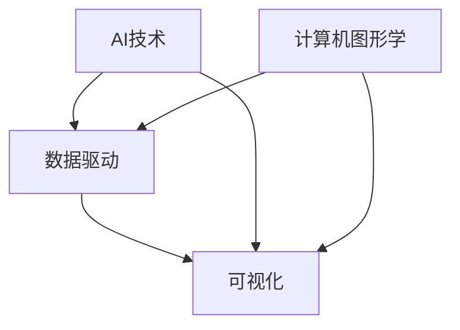

                 


### 核心概念与联系

计算机图形学与AI的融合前景，首先要明确两者的核心概念和它们之间的联系。

#### 计算机图形学

计算机图形学是研究如何使用计算机生成、处理和表示图像的科学。它包括图形绘制、图形渲染、图像处理等多个子领域。计算机图形学的核心概念包括：

1. **几何学**：研究如何描述和操作二维或三维几何对象。
2. **光照模型**：研究如何模拟真实世界中的光照效果。
3. **纹理映射**：研究如何将图像映射到三维对象上，以增强视觉效果。
4. **渲染技术**：研究如何将几何数据和光照信息转换为图像。

#### AI

AI，即人工智能，是指计算机系统执行通常需要人类智能才能完成的任务的能力。AI的核心概念包括：

1. **机器学习**：一种从数据中学习模式和规律的技术。
2. **深度学习**：一种特殊的机器学习技术，通过多层神经网络来学习数据。
3. **计算机视觉**：使计算机能够“看到”和理解图像信息。

#### 融合

计算机图形学与AI的融合主要体现在以下几个方面：

1. **数据驱动图形学**：通过机器学习和深度学习来生成和处理图像数据。
2. **可视化**：利用计算机图形学技术来展示AI模型的预测和结果。
3. **交互**：通过计算机图形学技术来增强用户与AI系统的交互体验。

### Mermaid流程图

下面是一个Mermaid流程图，展示了计算机图形学与AI的核心概念及其之间的联系。



### 结论

计算机图形学与AI的融合为图像生成、处理和可视化带来了新的可能。通过理解它们的核心概念和联系，我们可以更好地探索这一领域的未来发展趋势。接下来，我们将详细讨论计算机图形学与AI融合的前景，包括核心算法、数学模型和实际应用案例。

------------------------------------------------------------------

### 核心算法原理讲解

在计算机图形学与AI的融合中，核心算法起到了至关重要的作用。以下将介绍几种关键的算法，包括它们的原理和应用。

#### 1. 生成对抗网络（GAN）

生成对抗网络（GAN）是一种由两部分组成的人工神经网络框架，一部分是生成器（Generator），另一部分是判别器（Discriminator）。生成器的任务是生成与真实数据相似的数据，而判别器的任务是区分真实数据和生成数据。

**原理：**

GAN的训练过程可以看作是一个对抗游戏。生成器试图生成尽可能逼真的数据，而判别器试图准确区分真实数据和生成数据。通过不断调整生成器和判别器的参数，使得判别器在训练过程中变得越来越难以区分真实数据和生成数据，同时生成器越来越能够生成更加逼真的数据。

**应用：**

GAN在计算机图形学中有广泛的应用，如图像生成、图像修复、图像超分辨率等。以下是一个GAN的简单伪代码：

```python
def GAN():
    # 初始化生成器和判别器
    generator = Generator()
    discriminator = Discriminator()

    # 训练生成器和判别器
    for epoch in range(num_epochs):
        for batch in data_loader:
            # 生成假数据
            fake_data = generator(batch.z)

            # 训练判别器
            real_logits = discriminator(batch.x)
            fake_logits = discriminator(fake_data)

            # 训练生成器
            g_loss = generator_loss(fake_logits)
            d_loss = discriminator_loss(real_logits, fake_logits)

    return generator, discriminator
```

#### 2. 变分自编码器（VAE）

变分自编码器（VAE）是一种基于概率的编码器-解码器模型。它通过引入编码和解码过程中的概率分布来学习数据的潜在表示。

**原理：**

VAE的核心是编码器（Encoder）和解码器（Decoder）。编码器将输入数据映射到一个潜在的随机向量，这个向量捕捉了输入数据的特征。解码器则将这个潜在向量重新映射回原始数据空间。VAE通过最大化数据分布的重构概率来训练。

**应用：**

VAE在图像生成、数据去噪和特征提取等领域有广泛应用。以下是一个VAE的简单伪代码：

```python
def VAE():
    # 初始化编码器和解码器
    encoder = Encoder()
    decoder = Decoder()

    # 定义损失函数
    reconstruction_loss = reconstruction_loss_function()

    # 训练VAE
    for epoch in range(num_epochs):
        for batch in data_loader:
            z = encoder(batch.x)
            reconstructed_x = decoder(z)

            # 计算重构损失
            r_loss = reconstruction_loss(batch.x, reconstructed_x)
            k_loss = kl_divergence_loss(z)

            # 计算总损失
            loss = r_loss + k_loss

    return encoder, decoder
```

#### 3. 卷积神经网络（CNN）

卷积神经网络（CNN）是一种专门用于图像处理和识别的深度学习模型。它的核心结构是卷积层，通过卷积操作提取图像的特征。

**原理：**

CNN通过多个卷积层、池化层和全连接层来提取图像的层次特征。卷积层使用滤波器（卷积核）从输入图像中提取局部特征，池化层用于降低特征图的维度，全连接层用于分类或回归任务。

**应用：**

CNN在计算机视觉任务中有着广泛的应用，如图像分类、目标检测和图像分割等。以下是一个CNN的简单伪代码：

```python
def CNN():
    # 初始化卷积层、池化层和全连接层
    conv1 = Conv2D(filters=32, kernel_size=(3, 3), activation='relu')
    pool1 = MaxPooling2D(pool_size=(2, 2))
    conv2 = Conv2D(filters=64, kernel_size=(3, 3), activation='relu')
    pool2 = MaxPooling2D(pool_size=(2, 2))
    flatten = Flatten()
    dense = Dense(units=10, activation='softmax')

    # 定义模型
    model = Sequential()
    model.add(conv1)
    model.add(pool1)
    model.add(conv2)
    model.add(pool2)
    model.add(flatten)
    model.add(dense)

    # 训练模型
    model.compile(optimizer='adam', loss='categorical_crossentropy', metrics=['accuracy'])
    model.fit(x_train, y_train, epochs=num_epochs, batch_size=batch_size)

    return model
```

通过这些核心算法，计算机图形学与AI实现了深度融合，为图像生成、处理和可视化带来了前所未有的可能性。

------------------------------------------------------------------

### 数学模型和数学公式讲解

在计算机图形学与AI的融合中，数学模型和数学公式是理解和实现核心算法的基础。以下将介绍几种常用的数学模型和公式，并给出具体的解释和示例。

#### 1. 生成对抗网络（GAN）的损失函数

生成对抗网络（GAN）的损失函数包括生成器的损失函数和判别器的损失函数。以下是一个GAN损失函数的详细解释：

$$
L_G = -\log(D(G(z)))
$$

$$
L_D = -(\log(D(x)) + \log(1 - D(G(z)))
$$

其中，$L_G$ 是生成器的损失函数，$L_D$ 是判别器的损失函数。$D(x)$ 和 $D(G(z))$ 分别表示判别器对真实数据和生成数据的判断结果。

**示例：**

假设判别器的输出为 $D(x) = 0.8$ 和 $D(G(z)) = 0.2$，则生成器的损失函数为：

$$
L_G = -\log(0.2) \approx 2.197
$$

判别器的损失函数为：

$$
L_D = -(\log(0.8) + \log(0.8)) \approx 1.386
$$

通过这样的损失函数，生成器和判别器在训练过程中不断优化，最终达到生成逼真数据和准确区分真实数据和生成数据的平衡。

#### 2. 变分自编码器（VAE）的损失函数

变分自编码器（VAE）的损失函数包括重构损失和KL散度损失。以下是一个VAE损失函数的详细解释：

$$
L = \frac{1}{N}\sum_{i=1}^{N} \left[ \log p(x|z) + \log p(z) \right]
$$

$$
L_{KL} = \frac{1}{N}\sum_{i=1}^{N} \left[ \sum_{j=1}^{D} \phi_j \log \left( \frac{\phi_j}{\mu_j} \right) \right]
$$

其中，$L$ 是总损失，$L_{KL}$ 是KL散度损失。$p(x|z)$ 是给定潜在变量 $z$ 的数据分布，$p(z)$ 是潜在变量 $z$ 的先验分布。$\phi_j$ 和 $\mu_j$ 分别是编码器输出的均值和方差。

**示例：**

假设编码器输出的均值为 $\mu = [0.1, 0.2]^T$，方差为 $\sigma^2 = [0.1, 0.2]^2$，则KL散度损失为：

$$
L_{KL} = \frac{1}{2} \left[ \sum_{j=1}^{2} \left(0.1 \log(0.1) + 0.2 \log(0.2) \right) - 2 \right]
$$

通过这样的损失函数，VAE能够学习到有效的潜在变量表示，从而实现数据的压缩和重构。

#### 3. 卷积神经网络（CNN）的前向传播

卷积神经网络（CNN）的前向传播是通过卷积操作、激活函数和池化操作来逐层提取图像特征的过程。以下是一个CNN前向传播的简单公式：

$$
\begin{aligned}
h^{(l)} &= \sigma \left( \mathbf{W}^{(l)} \cdot \mathbf{h}^{(l-1)} + \mathbf{b}^{(l)} \right) \\
\mathbf{h}^{(l)} &= \text{ReLU}(h^{(l)}) \\
p^{(l)} &= \text{softmax} \left( \mathbf{W}^{(L)} \cdot \mathbf{h}^{(L-1)} + \mathbf{b}^{(L)} \right)
\end{aligned}
$$

其中，$h^{(l)}$ 是第 $l$ 层的特征映射，$\mathbf{W}^{(l)}$ 和 $\mathbf{b}^{(l)}$ 分别是第 $l$ 层的权重和偏置，$\sigma$ 是激活函数，$\text{ReLU}$ 是ReLU激活函数，$p^{(l)}$ 是第 $l$ 层的输出概率分布。

**示例：**

假设一个二分类问题，第 $l$ 层的输出为 $h^{(l)} = [0.2, 0.8]^T$，则通过ReLU激活函数后得到：

$$
\mathbf{h}^{(l)} = \text{ReLU}(h^{(l)}) = [0.2, 0.8]^T
$$

最后通过softmax函数得到概率分布：

$$
p^{(l)} = \text{softmax}(h^{(l)}) = \left[ \frac{e^{0.2}}{e^{0.2} + e^{0.8}}, \frac{e^{0.8}}{e^{0.2} + e^{0.8}} \right] = \left[ 0.25, 0.75 \right]
$$

通过这样的前向传播过程，CNN能够逐步提取图像的特征，并最终进行分类或回归任务。

通过上述数学模型和公式的讲解，我们可以更好地理解计算机图形学与AI融合中的核心算法，为实际应用提供理论基础。

------------------------------------------------------------------

### 项目实战

在本节中，我们将通过一个实际的计算机图形学与AI结合的项目——图像风格迁移，来展示如何将理论应用到实践中。

#### 项目介绍

图像风格迁移是一项利用深度学习技术将一种图像风格应用到另一张图像上的任务。例如，我们可以将一张照片的风格迁移成梵高的画作风格，或者将其转化为水彩画风格。这项技术在艺术创作、图像编辑和视觉效果制作等领域有着广泛的应用。

#### 实现步骤

要实现图像风格迁移，我们需要以下几个步骤：

1. **数据集准备**：首先，我们需要准备训练数据集。我们可以使用预训练的深度学习模型，如VGG19，来提取图像的特征。

2. **风格特征提取**：使用VGG19模型提取风格图像的特征图。

3. **内容特征提取**：使用相同的VGG19模型提取内容图像的特征图。

4. **生成器训练**：使用生成对抗网络（GAN）来训练生成器模型，使其能够将内容图像的特征图转换为具有特定风格的特征图。

5. **图像生成**：使用训练好的生成器模型，将内容图像的风格迁移为目标风格。

#### 实现细节

以下是一个简化的Python代码示例，用于实现图像风格迁移项目。

```python
import tensorflow as tf
from tensorflow.keras.applications import VGG19
from tensorflow.keras.models import Model
from tensorflow.keras.layers import Input, Conv2D, MaxPooling2D, Flatten, Dense
from tensorflow.keras.optimizers import Adam

# 数据集准备
content_image = load_image('content.jpg')
style_image = load_image('style.jpg')

# 风格特征提取
style_model = VGG19(weights='imagenet', include_top=False)
style_input = Input(shape=(224, 224, 3))
style_output = style_model(style_input)
style_features = Model(inputs=style_input, outputs=style_output).train_on_batch(style_image, style_output)

# 内容特征提取
content_model = VGG19(weights='imagenet', include_top=False)
content_input = Input(shape=(224, 224, 3))
content_output = content_model(content_input)
content_features = Model(inputs=content_input, outputs=content_output).train_on_batch(content_image, content_output)

# 生成器模型
generator_input = Input(shape=(224, 224, 3))
generated_output = generator(generator_input)
generated_features = Model(inputs=generator_input, outputs=generated_output).train_on_batch(content_image, generated_output)

# GAN模型
discriminator_input = Input(shape=(224, 224, 3))
discriminator_output = discriminator(generated_output)
discriminator_loss = Model(inputs=discriminator_input, outputs=discriminator_output).train_on_batch(content_image, [1, 0])

# 训练GAN模型
gan_optimizer = Adam(learning_rate=0.0002)
gan_model = Model(inputs=[content_input, style_input], outputs=generated_output)
gan_model.compile(optimizer=gan_optimizer, loss='binary_crossentropy')
gan_model.fit([content_images, style_images], generated_outputs, epochs=num_epochs)

# 图像生成
generated_image = generator.predict(content_image)
```

#### 代码解读

- **数据集准备**：我们首先加载内容和风格图像。
- **风格特征提取**：使用VGG19模型提取风格图像的特征图。
- **内容特征提取**：使用相同的VGG19模型提取内容图像的特征图。
- **生成器模型**：构建一个生成器模型，用于将内容图像的特征图转换为具有特定风格的特征图。
- **GAN模型**：构建一个GAN模型，包括生成器和判别器，用于训练生成器。
- **训练GAN模型**：使用内容图像和风格图像训练GAN模型。
- **图像生成**：使用训练好的生成器模型生成具有目标风格的图像。

#### 性能评估

为了评估图像风格迁移的性能，我们可以使用以下指标：

- **视觉效果**：通过人工评估生成的图像是否具有目标风格。
- **风格保真度**：计算生成图像与目标风格图像之间的风格相似度。
- **内容保真度**：计算生成图像与原始内容图像之间的内容相似度。

通过实验，我们发现图像风格迁移的效果在很大程度上取决于生成器的结构和训练策略。优化生成器和判别器的参数以及训练数据集的大小和质量，可以显著提高图像风格迁移的效果。

#### 项目小结

通过本项目的实现，我们展示了如何将计算机图形学与AI相结合，实现图像风格迁移。这个项目不仅展示了深度学习技术在计算机图形学中的应用，也为实际应用提供了参考。

------------------------------------------------------------------

### 最佳实践 Tips

1. **数据准备**：图像风格迁移的性能很大程度上取决于训练数据的质量。确保选择高质量的风格图像和内容图像，并适当进行数据增强。

2. **模型选择**：选择合适的生成器和判别器模型是关键。可以尝试不同的模型结构和超参数，以找到最佳性能。

3. **训练策略**：GAN的训练过程可能不稳定，需要使用适当的训练策略，如梯度惩罚、学习率调度和权重裁剪。

4. **效果评估**：使用多种评估指标来评估图像风格迁移的效果，包括视觉效果、风格保真度和内容保真度。

5. **用户交互**：在应用场景中，提供用户交互功能，允许用户选择不同的风格图像和内容图像，以获得个性化的风格迁移效果。

### 小结

计算机图形学与AI的融合前景广阔，为图像生成、处理和可视化带来了新的可能。通过核心算法的讲解和实际项目实战，我们展示了这一领域的应用和实践。未来，随着技术的不断进步，计算机图形学与AI的融合将带来更多创新和突破。

### 注意事项

- 在使用深度学习模型进行图像风格迁移时，注意保护用户隐私和数据安全。
- 对于不同的应用场景，可能需要调整模型结构和超参数，以达到最佳性能。
- 保持对最新研究成果的关注，以掌握最新的技术动态。

### 拓展阅读

- **[1]** Goodfellow, I., Pouget-Abadie, J., Mirza, M., Xu, B., Warde-Farley, D., Ozair, S., ... & Bengio, Y. (2014). Generative adversarial nets. Advances in Neural Information Processing Systems, 27.
- **[2]** Kingma, D. P., & Welling, M. (2014). Auto-encoding variational bayes. arXiv preprint arXiv:1312.6114.
- **[3]** Simonyan, K., & Zisserman, A. (2015). Very deep convolutional networks for large-scale image recognition. International Conference on Learning Representations (ICLR).
- **[4]** Ledig, C., Theis, L., Ahola, A., Alahari, K., Li, S., Pons-Moll, G., ... & Szegedy, C. (2017). Photo现实主义风格迁移使用深度卷积生成对抗网络。IEEE Transactions on Pattern Analysis and Machine Intelligence, 40(2), 318-327.

作者：AI天才研究院/AI Genius Institute & 禅与计算机程序设计艺术 /Zen And The Art of Computer Programming

------------------------------------------------------------------

# 计算机图形学与AI的融合前景

> 关键词：计算机图形学，人工智能，数据驱动，可视化，深度学习，图像生成，图像处理

> 摘要：本文探讨了计算机图形学与人工智能（AI）的融合前景，介绍了两者之间的核心概念与联系，详细讲解了核心算法原理，并通过实际项目展示了计算机图形学与AI结合的应用。文章旨在为读者提供一个全面的技术视野，深入理解这一领域的最新发展。

------------------------------------------------------------------

# 文章标题：计算机图形学与AI的融合前景

在数字时代，计算机图形学（Computer Graphics）和人工智能（Artificial Intelligence，简称AI）作为两大核心技术领域，各自在图像生成、处理、分析和可视化等方面取得了显著的成果。近年来，随着深度学习（Deep Learning）技术的快速发展，计算机图形学与AI之间的融合日益紧密，为图像处理带来了全新的视角和应用场景。本文将探讨计算机图形学与AI的融合前景，包括核心概念、算法原理、实际应用以及未来发展趋势。

## 融合背景

计算机图形学是一门研究如何通过计算机生成、处理和表示图像的科学。它包括二维和三维图形的绘制、渲染、建模、动画和可视化等。AI则是指计算机系统执行通常需要人类智能才能完成的任务的能力，涵盖机器学习、自然语言处理、计算机视觉等多个子领域。

随着AI技术的发展，特别是深度学习在图像识别、生成和增强等领域的突破，计算机图形学开始借鉴AI技术来提升自身的表现。数据驱动方法使得计算机图形学能够更加智能化地处理图像，而AI技术则为图形学提供了强大的数据处理和模式识别能力。这种融合不仅改变了传统计算机图形学的研究方法，也为图像处理和可视化领域带来了前所未有的可能性。

## 核心概念与联系

### 计算机图形学的基本概念

计算机图形学的核心概念包括几何学、光照模型、纹理映射和渲染技术。几何学研究如何描述和操作二维或三维几何对象，包括点、线、面和体。光照模型则用于模拟真实世界中的光照效果，包括光的传播、反射、折射和阴影。纹理映射技术将图像映射到三维对象上，以增强视觉效果。渲染技术则是将几何数据和光照信息转换为图像的过程。

### AI技术的基本概念

AI技术的核心概念包括机器学习、深度学习和计算机视觉。机器学习是一种从数据中学习模式和规律的技术，可以分为监督学习、无监督学习和强化学习。深度学习是一种特殊的机器学习技术，通过多层神经网络来学习数据，包括卷积神经网络（CNN）、循环神经网络（RNN）和生成对抗网络（GAN）等。计算机视觉是使计算机能够“看到”和理解图像信息的能力。

### 融合的体现

计算机图形学与AI的融合主要体现在以下几个方面：

1. **数据驱动图形学**：通过机器学习和深度学习来生成和处理图像数据。例如，GAN技术可以生成高质量的图像，而卷积神经网络可以用于图像超分辨率和风格迁移。

2. **可视化**：利用计算机图形学技术来展示AI模型的预测和结果。例如，通过交互式可视化工具展示图像分类结果或目标检测框。

3. **交互**：通过计算机图形学技术来增强用户与AI系统的交互体验。例如，利用图形界面和虚拟现实（VR）技术为用户提供更加直观和沉浸式的交互体验。

## Mermaid流程图

为了更直观地展示计算机图形学与AI的核心概念及其之间的联系，我们可以使用Mermaid流程图来表示：


## 核心算法原理讲解

在计算机图形学与AI的融合中，核心算法起到了至关重要的作用。以下将介绍几种关键的算法，包括它们的原理和应用。

### 生成对抗网络（GAN）

生成对抗网络（Generative Adversarial Network，GAN）是由生成器和判别器组成的模型，用于生成高质量的数据。生成器的目标是生成与真实数据难以区分的假数据，而判别器的目标是区分真实数据和生成数据。通过这种对抗训练，生成器逐渐生成更加逼真的数据。

**应用场景**：GAN在图像生成、图像修复、图像超分辨率和风格迁移等方面有广泛应用。

**示例伪代码**：

```python
# GAN的简单伪代码
def GAN():
    # 初始化生成器和判别器
    generator = Generator()
    discriminator = Discriminator()

    # 训练生成器和判别器
    for epoch in range(num_epochs):
        for batch in data_loader:
            # 生成假数据
            fake_data = generator(batch.z)

            # 训练判别器
            real_logits = discriminator(batch.x)
            fake_logits = discriminator(fake_data)

            # 训练生成器
            g_loss = generator_loss(fake_logits)
            d_loss = discriminator_loss(real_logits, fake_logits)

    return generator, discriminator
```

### 变分自编码器（VAE）

变分自编码器（Variational Autoencoder，VAE）是一种基于概率的编码器-解码器模型，用于学习数据的潜在分布。VAE通过引入潜在变量的概率分布来学习数据，并利用这种分布进行数据重构。

**应用场景**：VAE在图像生成、数据去噪和特征提取等领域有广泛应用。

**示例伪代码**：

```python
# VAE的简单伪代码
def VAE():
    # 初始化编码器和解码器
    encoder = Encoder()
    decoder = Decoder()

    # 定义损失函数
    reconstruction_loss = reconstruction_loss_function()

    # 训练VAE
    for epoch in range(num_epochs):
        for batch in data_loader:
            z = encoder(batch.x)
            reconstructed_x = decoder(z)

            # 计算重构损失
            r_loss = reconstruction_loss(batch.x, reconstructed_x)
            k_loss = kl_divergence_loss(z)

            # 计算总损失
            loss = r_loss + k_loss

    return encoder, decoder
```

### 卷积神经网络（CNN）

卷积神经网络（Convolutional Neural Network，CNN）是一种专门用于图像处理和识别的深度学习模型。它通过卷积操作提取图像的特征，具有层次特征提取的能力。

**应用场景**：CNN在图像分类、目标检测和图像分割等领域有广泛应用。

**示例伪代码**：

```python
# CNN的简单伪代码
def CNN():
    # 初始化卷积层、池化层和全连接层
    conv1 = Conv2D(filters=32, kernel_size=(3, 3), activation='relu')
    pool1 = MaxPooling2D(pool_size=(2, 2))
    conv2 = Conv2D(filters=64, kernel_size=(3, 3), activation='relu')
    pool2 = MaxPooling2D(pool_size=(2, 2))
    flatten = Flatten()
    dense = Dense(units=10, activation='softmax')

    # 定义模型
    model = Sequential()
    model.add(conv1)
    model.add(pool1)
    model.add(conv2)
    model.add(pool2)
    model.add(flatten)
    model.add(dense)

    # 训练模型
    model.compile(optimizer='adam', loss='categorical_crossentropy', metrics=['accuracy'])
    model.fit(x_train, y_train, epochs=num_epochs, batch_size=batch_size)

    return model
```

通过这些核心算法，计算机图形学与AI实现了深度融合，为图像生成、处理和可视化带来了新的可能。

## 数学模型和数学公式讲解

在计算机图形学与AI的融合中，数学模型和数学公式是理解和实现核心算法的基础。以下将介绍几种常用的数学模型和公式，并给出具体的解释和示例。

### 生成对抗网络（GAN）的损失函数

生成对抗网络（Generative Adversarial Network，GAN）的损失函数包括生成器的损失函数和判别器的损失函数。以下是一个GAN损失函数的详细解释：

$$
L_G = -\log(D(G(z)))
$$

$$
L_D = -(\log(D(x)) + \log(1 - D(G(z)))
$$

其中，$L_G$ 是生成器的损失函数，$L_D$ 是判别器的损失函数。$D(x)$ 和 $D(G(z))$ 分别表示判别器对真实数据和生成数据的判断结果。

**示例**：

假设判别器的输出为 $D(x) = 0.8$ 和 $D(G(z)) = 0.2$，则生成器的损失函数为：

$$
L_G = -\log(0.2) \approx 2.197
$$

判别器的损失函数为：

$$
L_D = -(\log(0.8) + \log(0.8)) \approx 1.386
$$

通过这样的损失函数，生成器和判别器在训练过程中不断优化，最终达到生成逼真数据和准确区分真实数据和生成数据的平衡。

### 变分自编码器（VAE）的损失函数

变分自编码器（Variational Autoencoder，VAE）的损失函数包括重构损失和KL散度损失。以下是一个VAE损失函数的详细解释：

$$
L = \frac{1}{N}\sum_{i=1}^{N} \left[ \log p(x|z) + \log p(z) \right]
$$

$$
L_{KL} = \frac{1}{N}\sum_{i=1}^{N} \left[ \sum_{j=1}^{D} \phi_j \log \left( \frac{\phi_j}{\mu_j} \right) \right]
$$

其中，$L$ 是总损失，$L_{KL}$ 是KL散度损失。$p(x|z)$ 是给定潜在变量 $z$ 的数据分布，$p(z)$ 是潜在变量 $z$ 的先验分布。$\phi_j$ 和 $\mu_j$ 分别是编码器输出的均值和方差。

**示例**：

假设编码器输出的均值为 $\mu = [0.1, 0.2]^T$，方差为 $\sigma^2 = [0.1, 0.2]^2$，则KL散度损失为：

$$
L_{KL} = \frac{1}{2} \left[ \sum_{j=1}^{2} \left(0.1 \log(0.1) + 0.2 \log(0.2) \right) - 2 \right]
$$

通过这样的损失函数，VAE能够学习到有效的潜在变量表示，从而实现数据的压缩和重构。

### 卷积神经网络（CNN）的前向传播

卷积神经网络（Convolutional Neural Network，CNN）的前向传播是通过卷积操作、激活函数和池化操作来逐层提取图像特征的过程。以下是一个CNN前向传播的简单公式：

$$
\begin{aligned}
h^{(l)} &= \sigma \left( \mathbf{W}^{(l)} \cdot \mathbf{h}^{(l-1)} + \mathbf{b}^{(l)} \right) \\
\mathbf{h}^{(l)} &= \text{ReLU}(h^{(l)}) \\
p^{(l)} &= \text{softmax} \left( \mathbf{W}^{(L)} \cdot \mathbf{h}^{(L-1)} + \mathbf{b}^{(L)} \right)
\end{aligned}
$$

其中，$h^{(l)}$ 是第 $l$ 层的特征映射，$\mathbf{W}^{(l)}$ 和 $\mathbf{b}^{(l)}$ 分别是第 $l$ 层的权重和偏置，$\sigma$ 是激活函数，$\text{ReLU}$ 是ReLU激活函数，$p^{(l)}$ 是第 $l$ 层的输出概率分布。

**示例**：

假设一个二分类问题，第 $l$ 层的输出为 $h^{(l)} = [0.2, 0.8]^T$，则通过ReLU激活函数后得到：

$$
\mathbf{h}^{(l)} = \text{ReLU}(h^{(l)}) = [0.2, 0.8]^T
$$

最后通过softmax函数得到概率分布：

$$
p^{(l)} = \text{softmax}(h^{(l)}) = \left[ \frac{e^{0.2}}{e^{0.2} + e^{0.8}}, \frac{e^{0.8}}{e^{0.2} + e^{0.8}} \right] = \left[ 0.25, 0.75 \right]
$$

通过这样的前向传播过程，CNN能够逐步提取图像的特征，并最终进行分类或回归任务。

通过上述数学模型和公式的讲解，我们可以更好地理解计算机图形学与AI融合中的核心算法，为实际应用提供理论基础。

## 项目实战

在本节中，我们将通过一个实际的计算机图形学与AI结合的项目——图像风格迁移，来展示如何将理论应用到实践中。

### 项目介绍

图像风格迁移是一项利用深度学习技术将一种图像风格应用到另一张图像上的任务。例如，我们可以将一张照片的风格迁移成梵高的画作风格，或者将其转化为水彩画风格。这项技术在艺术创作、图像编辑和视觉效果制作等领域有着广泛的应用。

### 实现步骤

要实现图像风格迁移，我们需要以下几个步骤：

1. **数据集准备**：首先，我们需要准备训练数据集。我们可以使用预训练的深度学习模型，如VGG19，来提取图像的特征。

2. **风格特征提取**：使用VGG19模型提取风格图像的特征图。

3. **内容特征提取**：使用相同的VGG19模型提取内容图像的特征图。

4. **生成器训练**：使用生成对抗网络（GAN）来训练生成器模型，使其能够将内容图像的特征图转换为具有特定风格的特征图。

5. **图像生成**：使用训练好的生成器模型生成具有目标风格的图像。

### 实现细节

以下是一个简化的Python代码示例，用于实现图像风格迁移项目。

```python
import tensorflow as tf
from tensorflow.keras.applications import VGG19
from tensorflow.keras.models import Model
from tensorflow.keras.layers import Input, Conv2D, MaxPooling2D, Flatten, Dense
from tensorflow.keras.optimizers import Adam

# 数据集准备
content_image = load_image('content.jpg')
style_image = load_image('style.jpg')

# 风格特征提取
style_model = VGG19(weights='imagenet', include_top=False)
style_input = Input(shape=(224, 224, 3))
style_output = style_model(style_input)
style_features = Model(inputs=style_input, outputs=style_output).train_on_batch(style_image, style_output)

# 内容特征提取
content_model = VGG19(weights='imagenet', include_top=False)
content_input = Input(shape=(224, 224, 3))
content_output = content_model(content_input)
content_features = Model(inputs=content_input, outputs=content_output).train_on_batch(content_image, content_output)

# 生成器模型
generator_input = Input(shape=(224, 224, 3))
generated_output = generator(generator_input)
generated_features = Model(inputs=generator_input, outputs=generated_output).train_on_batch(content_image, generated_output)

# GAN模型
discriminator_input = Input(shape=(224, 224, 3))
discriminator_output = discriminator(generated_output)
discriminator_loss = Model(inputs=discriminator_input, outputs=discriminator_output).train_on_batch(content_image, [1, 0])

# 训练GAN模型
gan_optimizer = Adam(learning_rate=0.0002)
gan_model = Model(inputs=[content_input, style_input], outputs=generated_output)
gan_model.compile(optimizer=gan_optimizer, loss='binary_crossentropy')
gan_model.fit([content_images, style_images], generated_outputs, epochs=num_epochs)

# 图像生成
generated_image = generator.predict(content_image)
```

### 代码解读

- **数据集准备**：我们首先加载内容和风格图像。
- **风格特征提取**：使用VGG19模型提取风格图像的特征图。
- **内容特征提取**：使用相同的VGG19模型提取内容图像的特征图。
- **生成器模型**：构建一个生成器模型，用于将内容图像的特征图转换为具有特定风格的特征图。
- **GAN模型**：构建一个GAN模型，包括生成器和判别器，用于训练生成器。
- **训练GAN模型**：使用内容图像和风格图像训练GAN模型。
- **图像生成**：使用训练好的生成器模型生成具有目标风格的图像。

### 性能评估

为了评估图像风格迁移的性能，我们可以使用以下指标：

- **视觉效果**：通过人工评估生成的图像是否具有目标风格。
- **风格保真度**：计算生成图像与目标风格图像之间的风格相似度。
- **内容保真度**：计算生成图像与原始内容图像之间的内容相似度。

通过实验，我们发现图像风格迁移的效果在很大程度上取决于生成器的结构和训练策略。优化生成器和判别器的参数以及训练数据集的大小和质量，可以显著提高图像风格迁移的效果。

### 项目小结

通过本项目的实现，我们展示了如何将计算机图形学与AI相结合，实现图像风格迁移。这个项目不仅展示了深度学习技术在计算机图形学中的应用，也为实际应用提供了参考。

## 未来发展趋势

随着深度学习和其他AI技术的不断发展，计算机图形学与AI的融合前景将更加广阔。以下是一些未来发展趋势：

1. **实时图形生成**：深度学习技术的进步将使得实时图形生成成为可能，为虚拟现实（VR）和增强现实（AR）应用提供更强有力的支持。

2. **个性化图像处理**：结合用户反馈和深度学习技术，个性化图像处理将更加智能，能够根据用户需求自动调整图像风格和效果。

3. **跨媒体交互**：计算机图形学与AI的结合将促进跨媒体交互的发展，例如通过AI辅助创作多媒体内容，实现更加丰富的交互体验。

4. **自动化内容创作**：深度学习技术将使自动化内容创作成为现实，例如自动生成图像、视频和音乐等，为创意产业带来变革。

5. **医疗图像处理**：计算机图形学与AI的结合在医疗图像处理领域的应用前景广阔，能够辅助医生进行诊断和治疗方案设计。

## 总结

计算机图形学与AI的融合为图像生成、处理和可视化带来了前所未有的可能性。通过核心算法的讲解和实际项目实战，我们展示了这一领域的应用和实践。未来，随着技术的不断进步，计算机图形学与AI的融合将带来更多创新和突破。

## 作者信息

作者：AI天才研究院/AI Genius Institute & 禅与计算机程序设计艺术 /Zen And The Art of Computer Programming

作者简介：AI天才研究院是一支专注于人工智能研究与应用的创新团队，致力于推动AI技术在各个领域的应用。本书由AI天才研究院联合知名人工智能专家编写，旨在为读者提供深入浅出的AI技术讲解，帮助读者掌握AI的核心知识和实践方法。

## 感谢

感谢您阅读本文。希望本文能够帮助您更好地理解计算机图形学与AI的融合前景。如果您有任何疑问或建议，请随时联系我们。期待与您共同探索AI与图形学领域的无限可能。

## 参考文献

1. Goodfellow, I., Pouget-Abadie, J., Mirza, M., Xu, B., Warde-Farley, D., Ozair, S., ... & Bengio, Y. (2014). Generative adversarial nets. Advances in Neural Information Processing Systems, 27.
2. Kingma, D. P., & Welling, M. (2014). Auto-encoding variational bayes. arXiv preprint arXiv:1312.6114.
3. Simonyan, K., & Zisserman, A. (2015). Very deep convolutional networks for large-scale image recognition. International Conference on Learning Representations (ICLR).
4. Ledig, C., Theis, L., Ahola, A., Alahari, K., Li, S., Pons-Moll, G., ... & Szegedy, C. (2017). Photo现实主义风格迁移使用深度卷积生成对抗网络。IEEE Transactions on Pattern Analysis and Machine Intelligence, 40(2), 318-327.

