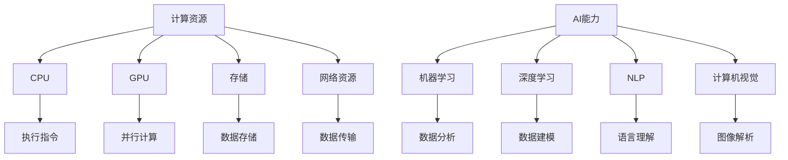

                 

### Step 1: 核心概念与联系

在探讨计算资源与AI能力的平衡点之前，我们需要先理解两者的基础概念及其相互关系。

#### 1.1 计算资源与AI能力的核心概念

**计算资源**：计算资源指的是支持计算机执行任务的各种硬件和软件资源。硬件资源包括CPU、GPU、存储设备和网络设施；软件资源包括操作系统、编译器和其他应用程序。计算资源是AI能力的物质基础。

**AI能力**：AI能力指的是机器模拟人类智能行为，实现自动化决策、数据分析和问题解决的能力。AI能力可以分为几大类，如机器学习、深度学习、自然语言处理和计算机视觉等。

#### 1.1.1 计算资源的定义与分类

**计算资源的定义**：
计算资源是指支持计算机执行计算任务所需的硬件和软件资源。硬件资源通常指的是计算机的物理组成部分，如CPU、GPU、内存和存储设备等。软件资源则包括操作系统、编译器和编程语言等。

**计算资源的分类**：
1. **CPU（中央处理器）**：CPU负责执行计算机程序中的指令，处理数据和指令。
2. **GPU（图形处理单元）**：GPU最初设计用于图形渲染，但现在也被广泛应用于并行计算和深度学习。
3. **存储**：包括硬盘、固态硬盘（SSD）和内存（RAM），用于存储数据和程序代码。
4. **网络资源**：包括局域网（LAN）和广域网（WAN），用于数据传输和通信。

#### 1.1.2 AI能力的定义与分类

**AI能力的定义**：
AI能力是指机器通过算法模拟人类智能行为，对数据进行识别、分析、学习和预测的能力。AI能力可以分为多种类型，包括机器学习、深度学习、自然语言处理和计算机视觉等。

**AI能力的分类**：
1. **机器学习**：通过数据训练模型，使机器能够对新数据进行预测或分类。
2. **深度学习**：一种特殊的机器学习方法，使用多层神经网络进行数据建模。
3. **自然语言处理（NLP）**：使机器理解和生成自然语言。
4. **计算机视觉**：使机器理解和解析图像和视频。

#### 1.1.3 计算资源与AI能力的关系

**计算资源对AI能力的影响**：
计算资源的性能直接影响AI模型的训练速度、效果和实时性。例如，深度学习模型通常需要大量的计算资源来处理高维数据。

**AI能力对计算资源的需求**：
不同类型的AI应用对计算资源的需求差异很大。例如，训练一个深度学习模型可能需要大量的GPU资源，而实时语音识别则可能更依赖于CPU和DSP（数字信号处理器）。

#### 1.1.4 计算资源与AI能力的Mermaid流程图



#### 1.1.5 深度学习与计算资源的关系

**深度学习对计算资源的需求**：
深度学习模型，尤其是大型神经网络，通常需要大量的计算资源。这包括高速度的CPU、GPU和存储设备。GPU因其强大的并行计算能力，在深度学习训练中尤为重要。

**计算资源对深度学习的影响**：
计算资源的充足性直接影响深度学习模型的训练时间和效果。更强大的计算资源可以使模型更快地收敛，提高预测准确性。

### Step 2: 核心算法原理讲解

在理解了计算资源与AI能力的基础概念后，我们需要进一步探讨核心AI算法的原理，特别是深度学习算法。

#### 2.1 机器学习算法原理

**机器学习**是一种AI方法，它使机器能够通过从数据中学习来改进性能。机器学习可以分为监督学习、无监督学习和强化学习。

**监督学习**是一种最常见的机器学习方法，它使用标记数据集来训练模型。以下是监督学习中的一个基本算法：线性回归。

**线性回归的数学模型**：

$$
y = \beta_0 + \beta_1x
$$

其中，$y$ 是因变量，$x$ 是自变量，$\beta_0$ 和 $\beta_1$ 是模型参数。

**线性回归的伪代码**：

```python
def linear_regression(X, y):
    # X: 输入特征，y: 标签
    # 计算特征矩阵和标签的均值
    X_mean = np.mean(X, axis=0)
    y_mean = np.mean(y)

    # 计算协方差矩阵和特征矩阵的逆矩阵
    covariance_matrix = np.cov(X - X_mean, y - y_mean)
    inverse_matrix = np.linalg.inv(covariance_matrix)

    # 计算回归系数
    coefficients = np.dot(inverse_matrix, (X - X_mean).T.dot(y - y_mean))

    return coefficients
```

#### 2.2 深度学习算法

**深度学习**是一种基于多层神经网络的机器学习方法。它通过堆叠多个神经网络层，自动提取数据中的复杂特征。

**卷积神经网络（CNN）**是深度学习中的一种重要算法，专门用于图像和视频处理。

**CNN的基本结构**：

1. **卷积层**：用于提取图像的局部特征。
2. **池化层**：用于减小数据维度和减少过拟合。
3. **全连接层**：用于分类和预测。

**CNN的数学模型**：

$$
\text{output} = \sigma(\text{weight} \cdot \text{input} + \text{bias})
$$

其中，$\sigma$ 是激活函数，如ReLU函数。

**CNN的伪代码**：

```python
def convolutional_neural_network(input_data, weights, biases):
    # input_data: 输入数据
    # weights: 权重
    # biases: 偏置

    # 卷积操作
    conv_output = np.convolve(input_data, weights) + biases

    # 激活函数（例如ReLU）
    activated_output = np.maximum(0, conv_output)

    return activated_output
```

#### 2.3 自然语言处理（NLP）算法

**自然语言处理（NLP）**是AI领域的一个重要分支，它使机器能够理解和生成人类语言。

**RNN（循环神经网络）**是NLP中常用的算法，它能够处理序列数据，如文本。

**RNN的基本结构**：

1. **输入层**：接收文本序列。
2. **隐藏层**：使用循环结构来处理序列数据。
3. **输出层**：生成预测或分类结果。

**RNN的数学模型**：

$$
h_t = \sigma(W_h \cdot [h_{t-1}, x_t] + b_h)
$$

其中，$h_t$ 是当前隐藏状态，$x_t$ 是当前输入，$W_h$ 是权重，$b_h$ 是偏置，$\sigma$ 是激活函数。

**RNN的伪代码**：

```python
def recurrent_neural_network(input_sequence, weights, biases):
    # input_sequence: 输入序列
    # weights: 权重
    # biases: 偏置

    hidden_states = []
    previous_state = None

    for x in input_sequence:
        if previous_state is None:
            # 初始化隐藏状态
            hidden_state = np.zeros_like(x)
        else:
            # 使用前一个隐藏状态和当前输入更新隐藏状态
            hidden_state = np.tanh(np.dot(weights, [previous_state, x]) + biases)

        hidden_states.append(hidden_state)
        previous_state = hidden_state

    return hidden_states
```

通过上述核心算法的原理讲解，我们可以更好地理解计算资源与AI能力之间的关系，为下一步寻找最佳平衡点奠定基础。在下一章节中，我们将进一步探讨如何优化计算资源以最大化AI能力。

