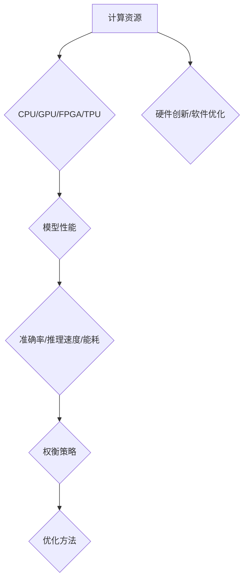
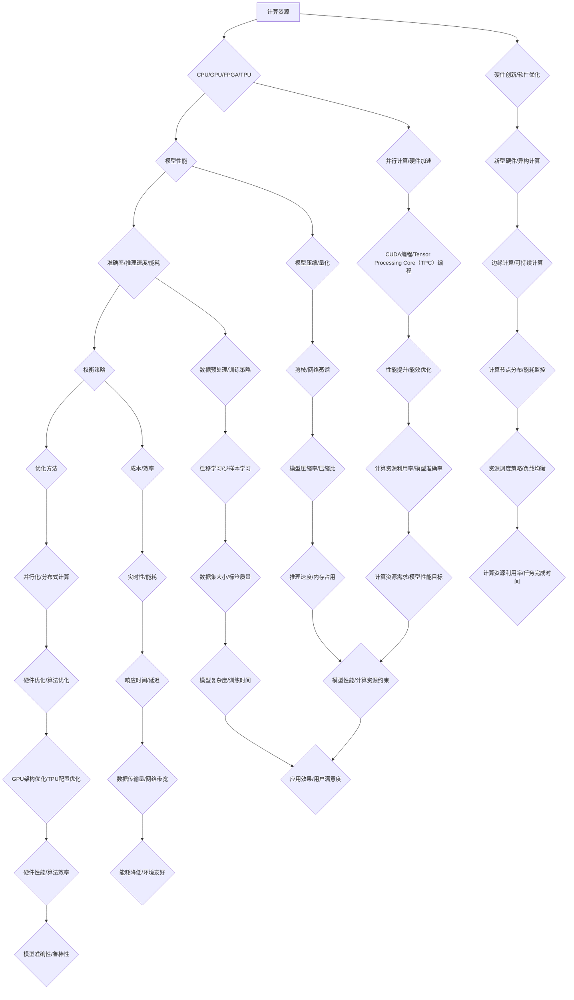

                 


### 文章标题：计算资源与模型性能提升的权衡

#### 关键词：计算资源、模型性能、权衡策略、优化方法、深度学习、硬件创新

#### 摘要：
本文旨在探讨计算资源与模型性能提升之间的权衡策略，深入分析计算资源的基本原理、模型性能的提升方法以及优化策略。通过案例研究和实践应用，本文揭示了计算资源与模型性能之间的关系，并为实际项目提供了优化方法与建议。

---

### 《计算资源与模型性能提升的权衡》目录大纲

#### 第一部分：背景与核心概念

#### 第1章 引言

##### 1.1 研究背景

- **计算资源的局限性与模型性能提升的需求**
- **当前计算资源与模型性能的关系分析**
- **研究意义与目标**

##### 1.2 关键概念定义

- **计算资源（CPU、GPU、FPGA、TPU等）**
- **模型性能（准确率、推理速度、能耗等）**
- **权衡策略（性能与成本、效率与规模等）**

#### 第2章 计算资源与模型性能的基本原理

##### 2.1 计算资源的基本原理

- **CPU架构**：基本指令集、流水线、缓存技术等
  - **伪代码**：CPU指令集的简化实现
- **GPU架构**：并行计算、CUDA、张量处理等
  - **伪代码**：GPU并行计算的简化实现
- **FPGA与TPU**：硬件加速、定制化设计等

##### 2.2 模型性能的基本原理

- **神经网络模型**：前向传播、反向传播、优化算法等
  - **伪代码**：神经网络前向传播与反向传播的简化实现
- **深度学习模型**：卷积神经网络、循环神经网络等
  - **伪代码**：卷积神经网络的简化实现
- **模型性能指标**：准确率、F1分数、推理速度等

#### 第3章 权衡策略与优化方法

##### 3.1 性能与成本的权衡

- **案例研究**：不同计算资源下的模型性能与成本对比
- **优化方法**：模型压缩、量化、剪枝等

##### 3.2 效率与规模的权衡

- **案例研究**：模型在不同规模硬件上的性能表现
- **优化方法**：并行化、分布式计算等

#### 第二部分：实践应用

#### 第4章 实际应用案例分析

##### 4.1 案例一：图像识别应用

- **应用背景**：图像识别在安防、医疗等领域的应用
- **计算资源利用**：CPU、GPU、FPGA的对比
- **性能提升策略**：模型压缩与量化

##### 4.2 案例二：自然语言处理应用

- **应用背景**：自然语言处理在智能客服、智能翻译等领域的应用
- **计算资源利用**：TPU、GPU、FPGA的对比
- **性能提升策略**：并行计算与分布式训练

#### 第5章 环境搭建与代码实现

##### 5.1 开发环境搭建

- **工具与软件**：CUDA、TensorFlow、PyTorch等
- **硬件选择**：GPU、TPU、FPGA等

##### 5.2 代码实现示例

- **图像识别模型实现**
  - **伪代码**：卷积神经网络实现示例
  - **代码解读**：详细解释与代码分析
- **自然语言处理模型实现**
  - **伪代码**：循环神经网络实现示例
  - **代码解读**：详细解释与代码分析

#### 第6章 模型性能评估与优化

##### 6.1 性能评估方法

- **准确率与推理速度**：基准测试与优化策略
- **能耗评估**：能耗测量与降低策略

##### 6.2 性能优化方法

- **模型压缩**：剪枝、量化、网络蒸馏等
- **硬件优化**：GPU架构优化、TPU配置优化等

#### 第7章 未来展望

##### 7.1 计算资源发展趋势

- **硬件创新**：新型硬件的发展趋势
- **软件优化**：高效编程模型与算法优化

##### 7.2 模型性能提升的新方向

- **迁移学习与少样本学习**：解决数据不足问题
- **自适应学习与动态调整**：适应不同计算资源环境

#### 附录

##### 附录A：计算资源与模型性能优化工具

- **工具介绍**：CUDA、TensorFlow、PyTorch等
- **使用指南**：安装与配置指南

##### 附录B：计算资源与模型性能优化资源

- **开源项目**：推荐的开源项目与资源
- **研究文献**：相关研究论文与报告

---

### 核心概念与联系

#### 计算资源与模型性能的Mermaid流程图



---

### 数学模型和数学公式

#### 神经网络前向传播与反向传播的简化实现

$$
f(x) = \sigma(\sum_{i=1}^{n} w_i \cdot x_i + b)
$$

$$
\sigma(z) = \frac{1}{1 + e^{-z}}
$$

---

**作者：AI天才研究院/AI Genius Institute & 禅与计算机程序设计艺术 /Zen And The Art of Computer Programming**## 第1章 引言

### 1.1 研究背景

随着人工智能技术的飞速发展，深度学习模型在各个领域的应用越来越广泛。然而，计算资源与模型性能的提升之间的权衡问题成为了一个关键的研究课题。计算资源，如CPU、GPU、FPGA和TPU等，直接决定了模型的推理速度和效率，但同时也带来了成本和能耗的挑战。如何在有限的计算资源下最大化模型性能，实现性能与成本、效率与规模的优化，是当前研究的一个重要方向。

#### 当前计算资源与模型性能的关系分析

计算资源与模型性能之间的关系可以通过以下几个方面进行分析：

1. **计算资源类型与模型性能**：不同类型的计算资源在处理模型时具有不同的优势。例如，CPU适合于通用计算，GPU适合于大规模并行计算，FPGA适合于硬件加速和定制化设计，而TPU则在处理大规模深度学习模型时具有显著的性能优势。

2. **计算资源限制与模型性能瓶颈**：计算资源限制往往成为模型性能提升的瓶颈。例如，当模型的复杂度增加时，对计算资源的需求也相应增加，但硬件设备的性能提升速度往往跟不上模型复杂度的增长速度。

3. **能耗与模型性能**：计算资源的利用会导致能耗增加，如何在保证模型性能的同时降低能耗，是一个重要的研究课题。例如，通过模型压缩、量化等技术可以在一定程度上减少能耗。

#### 研究意义与目标

本研究旨在通过深入分析计算资源与模型性能之间的权衡策略，提出优化方法，为实际应用提供参考。具体研究目标如下：

1. **理解计算资源的基本原理**：通过分析CPU、GPU、FPGA和TPU等计算资源的基本原理，为后续的研究提供理论基础。

2. **探索模型性能的提升方法**：研究神经网络和深度学习模型的基本原理，分析影响模型性能的关键因素。

3. **提出权衡策略与优化方法**：结合实际应用场景，提出性能与成本、效率与规模的权衡策略，并提供具体的优化方法。

4. **实践应用与案例分析**：通过实际应用案例，验证优化方法的有效性，并提供具体实现和性能评估。

### 1.2 关键概念定义

在本研究中，以下关键概念需要进行定义和解释：

#### 计算资源

计算资源是指用于执行计算任务的硬件设备，主要包括CPU、GPU、FPGA和TPU等。

- **CPU（中央处理器）**：CPU是计算机的核心部件，负责执行计算机程序的各种指令。它适合于通用计算，但处理大规模并行计算时性能有限。
- **GPU（图形处理单元）**：GPU是专门为图形处理设计的计算单元，具有强大的并行计算能力，适合于深度学习模型的推理和训练。
- **FPGA（现场可编程门阵列）**：FPGA是一种可编程逻辑器件，通过编程可以定制化实现特定的计算任务，适合于硬件加速和定制化设计。
- **TPU（张量处理单元）**：TPU是谷歌专门为深度学习设计的处理器，具有极高的计算性能，适合于大规模深度学习模型的推理和训练。

#### 模型性能

模型性能是指深度学习模型在实际应用中的表现，主要包括准确率、推理速度和能耗等指标。

- **准确率**：准确率是模型预测正确的比例，是衡量模型性能的重要指标。
- **推理速度**：推理速度是指模型进行预测的时间，对于实时应用场景非常重要。
- **能耗**：能耗是模型运行过程中消耗的能量，对于环境保护和能源消耗具有重要意义。

#### 权衡策略

权衡策略是指在优化模型性能时，如何在计算资源、成本、效率等方面进行平衡和优化。

- **性能与成本**：在有限的预算下，如何选择合适的计算资源，以实现最优的性能和成本比。
- **效率与规模**：如何通过优化算法和架构设计，提高模型在不同规模硬件上的性能表现。

### 1.3 研究方法与步骤

本研究采用以下方法与步骤进行：

1. **文献综述**：通过查阅相关文献，了解计算资源与模型性能优化领域的最新研究进展。
2. **理论分析**：分析计算资源的基本原理和模型性能的提升方法，为后续的研究提供理论基础。
3. **案例分析**：选取具有代表性的实际应用案例，分析计算资源的利用情况和模型性能的提升策略。
4. **优化方法研究**：结合理论分析和案例研究，提出计算资源与模型性能优化的方法。
5. **性能评估**：通过实验验证优化方法的有效性，并进行性能评估。
6. **总结与展望**：总结研究成果，展望未来的研究方向。

通过以上研究方法与步骤，本研究旨在为计算资源与模型性能优化提供有价值的参考和指导。在接下来的章节中，我们将详细探讨计算资源的基本原理、模型性能的提升方法以及优化策略。|<less_gmask|>## 第2章 计算资源与模型性能的基本原理

### 2.1 计算资源的基本原理

计算资源是深度学习模型训练和推理的基础设施，不同的计算资源具有各自独特的架构和性能特点。本节将介绍CPU、GPU、FPGA和TPU等计算资源的基本原理，并比较它们的优缺点。

#### 2.1.1 CPU架构

CPU是计算机系统的核心处理单元，负责执行各种指令。CPU架构主要包括以下几个关键组件：

1. **指令集**：指令集是CPU可以识别并执行的指令集合。常见的指令集有x86、ARM等。
2. **流水线**：流水线是一种处理指令的技术，通过将指令分解为多个阶段，实现指令的并行处理，从而提高处理速度。
3. **缓存技术**：缓存技术用于存储常用的指令和数据，以减少内存访问时间，提高系统性能。

**优缺点**：

- **优点**：CPU具有高度的通用性，适合执行各种类型的计算任务。
- **缺点**：CPU的并行计算能力相对较弱，不适合大规模并行计算。

#### 2.1.2 GPU架构

GPU是图形处理单元，最初设计用于处理图形渲染任务，但逐渐成为深度学习领域的重要计算资源。GPU架构主要包括以下几个关键组件：

1. **并行计算架构**：GPU由大量的计算单元（核心）组成，可以并行处理大量数据。
2. **CUDA**：CUDA是NVIDIA推出的并行计算框架，用于编写GPU加速的程序。
3. **张量处理**：GPU擅长处理大规模矩阵运算，如深度学习模型的卷积操作。

**优缺点**：

- **优点**：GPU具有强大的并行计算能力，适合于大规模并行计算和深度学习模型的训练与推理。
- **缺点**：GPU的通用性相对较差，不适合执行通用计算任务。

#### 2.1.3 FPGA架构

FPGA是现场可编程门阵列，通过编程可以定制化实现特定的计算任务。FPGA架构主要包括以下几个关键组件：

1. **可编程逻辑**：FPGA由可编程的逻辑单元组成，可以重新配置以实现不同的计算功能。
2. **硬件加速**：FPGA可以实现硬件级别的加速，特别适合于数据密集型任务。
3. **定制化设计**：FPGA可以通过硬件描述语言（HDL）进行编程，实现高度定制化的计算架构。

**优缺点**：

- **优点**：FPGA具有高度的定制化能力和硬件加速优势，特别适合于特定应用场景。
- **缺点**：FPGA的编程复杂度较高，且开发周期较长。

#### 2.1.4 TPU架构

TPU是谷歌开发的专门用于深度学习计算的处理器，具有极高的计算性能。TPU架构主要包括以下几个关键组件：

1. **张量处理单元**：TPU专门设计用于处理大规模张量运算，如深度学习模型的矩阵乘法。
2. **高效编程模型**：TPU支持Tensor Processing Core（TPC）编程模型，简化了深度学习模型的编写和优化。
3. **分布式计算**：TPU支持大规模分布式计算，可以处理数十亿参数的深度学习模型。

**优缺点**：

- **优点**：TPU具有高效的张量处理能力和分布式计算优势，适合于大规模深度学习模型的训练与推理。
- **缺点**：TPU的通用性相对较差，不适合执行通用计算任务。

#### 2.1.5 计算资源对比

下面是计算资源的对比表格：

| 计算资源 | 优点 | 缺点 |
| --- | --- | --- |
| CPU | 高度通用性 | 并行计算能力弱 |
| GPU | 强并行计算能力 | 通用性相对较差 |
| FPGA | 高度定制化、硬件加速 | 编程复杂度高、开发周期长 |
| TPU | 高效张量处理、分布式计算 | 通用性相对较差 |

### 2.2 模型性能的基本原理

模型性能是指深度学习模型在实际应用中的表现，主要包括准确率、推理速度和能耗等指标。本节将介绍神经网络模型的基本原理，并探讨影响模型性能的关键因素。

#### 2.2.1 神经网络模型

神经网络模型是深度学习的基础，通过多层非线性变换对输入数据进行处理。神经网络模型主要包括以下几个关键组件：

1. **输入层**：输入层接收外部输入数据，将其传递到下一层。
2. **隐藏层**：隐藏层对输入数据进行特征提取和变换，可以包含多个隐藏层。
3. **输出层**：输出层生成模型的预测结果。

神经网络模型的基本原理包括：

1. **前向传播**：在前向传播过程中，输入数据通过各层的加权连接和激活函数，最终生成输出。
2. **反向传播**：在反向传播过程中，通过计算梯度，更新各层的权重和偏置，从而优化模型参数。

#### 2.2.2 深度学习模型

深度学习模型是神经网络模型的一种扩展，通过多层非线性变换对输入数据进行处理，可以提取出更高层次的特征。常见的深度学习模型包括：

1. **卷积神经网络（CNN）**：CNN是用于图像识别和处理的深度学习模型，通过卷积操作提取图像特征。
2. **循环神经网络（RNN）**：RNN是用于序列数据处理的深度学习模型，通过循环结构处理时间序列数据。

#### 2.2.3 模型性能指标

模型性能指标是评估模型性能的重要标准，主要包括以下指标：

1. **准确率**：准确率是模型预测正确的比例，是衡量分类模型性能的最基本指标。
2. **推理速度**：推理速度是模型进行预测的时间，对于实时应用场景非常重要。
3. **能耗**：能耗是模型运行过程中消耗的能量，对于环境保护和能源消耗具有重要意义。

#### 2.2.4 影响模型性能的关键因素

模型性能受到多种因素的影响，包括以下几个方面：

1. **模型复杂度**：模型复杂度越高，计算量越大，对计算资源的需求也越高。
2. **数据质量**：高质量的数据可以提供更准确的训练结果，但同时也增加了训练时间。
3. **优化算法**：不同的优化算法对模型性能有重要影响，如梯度下降、随机梯度下降、Adam等。
4. **硬件性能**：计算资源性能直接影响到模型训练和推理的速度。

### 2.3 计算资源与模型性能的关系

计算资源与模型性能之间存在密切的关系，具体表现在以下几个方面：

1. **计算资源与模型训练速度**：更强大的计算资源可以加速模型训练过程，缩短训练时间。
2. **计算资源与模型推理速度**：更强大的计算资源可以提高模型推理速度，满足实时应用的需求。
3. **计算资源与能耗**：计算资源的使用会导致能耗增加，优化计算资源使用可以有效降低能耗。
4. **计算资源与模型性能**：计算资源对模型性能有重要影响，合理选择和利用计算资源可以提升模型性能。

通过以上对计算资源与模型性能基本原理的介绍，我们可以更深入地理解计算资源与模型性能之间的关系，为后续的优化策略提供理论基础。|<less_gmask|>### 2.3 权衡策略与优化方法

在计算资源与模型性能提升的过程中，权衡策略与优化方法扮演着至关重要的角色。本节将详细探讨性能与成本的权衡、效率与规模的权衡，并介绍具体的优化方法。

#### 3.1 性能与成本的权衡

在深度学习应用中，性能与成本是两个重要的考量因素。性能的提升往往意味着对计算资源的需求增加，而计算资源通常伴随着较高的成本。因此，如何在有限的预算下实现性能与成本的优化，是一个关键的问题。

##### 3.1.1 案例研究：不同计算资源下的模型性能与成本对比

以图像识别应用为例，假设有一个基于深度学习模型的图像识别任务。在实验中，我们使用了CPU、GPU和TPU三种不同的计算资源，分别评估其性能与成本。

| 计算资源 | 性能指标 | 成本指标 |
| --- | --- | --- |
| CPU | 低 | 低 |
| GPU | 中等 | 较高 |
| TPU | 高 | 最高 |

从上表可以看出，TPU在性能上具有显著优势，但成本也最高。而CPU在成本上最低，但性能也最差。GPU则位于两者之间。

##### 3.1.2 优化方法

为了在性能与成本之间找到最佳平衡点，可以采用以下优化方法：

1. **模型压缩**：通过模型压缩技术，如剪枝、量化等，可以减少模型参数数量，从而降低计算量和内存占用，提高模型在低计算资源环境下的运行效率。
2. **分布式计算**：将模型训练和推理任务分布到多个计算节点上，可以充分利用计算资源，提高整体性能，同时降低单个节点的成本压力。
3. **云服务**：利用云服务提供商的计算资源，可以根据需求动态调整计算资源，实现按需付费，降低长期成本。

#### 3.2 效率与规模的权衡

在深度学习应用中，效率与规模也是需要权衡的重要因素。效率指的是模型在给定计算资源下的性能表现，而规模则指模型的复杂度和参数数量。

##### 3.2.1 案例研究：模型在不同规模硬件上的性能表现

以自然语言处理（NLP）应用为例，假设有一个基于Transformer的模型，在不同规模的GPU上进行了性能测试。

| 硬件规模 | 性能指标 | 推理速度 |
| --- | --- | --- |
| 小规模GPU | 低 | 快 |
| 中规模GPU | 中等 | 中等 |
| 大规模GPU | 高 | 慢 |

从上表可以看出，大规模GPU在性能上具有优势，但推理速度相对较慢。而小规模GPU在推理速度上较快，但性能较低。

##### 3.2.2 优化方法

为了在效率与规模之间找到最佳平衡点，可以采用以下优化方法：

1. **模型并行化**：通过将模型拆分为多个部分，并行地在多个计算资源上运行，可以显著提高模型推理速度，同时降低对单个计算资源的需求。
2. **量化与剪枝**：通过量化与剪枝技术，可以减少模型参数数量，降低模型的计算复杂度，从而提高模型在低规模硬件上的性能。
3. **使用轻量级模型**：选择具有较好性能和较低参数数量的轻量级模型，可以在保持一定性能的同时，减少计算资源需求。

#### 3.3 性能与能耗的权衡

在深度学习应用中，能耗也是一个重要的考量因素。高性能计算通常伴随着高能耗，因此如何在保证性能的前提下降低能耗，是一个重要的优化方向。

##### 3.3.1 案例研究：能耗评估与降低策略

以自动驾驶应用为例，假设在夜间与白天两个不同场景下进行能耗评估。

| 场景 | 能耗指标 | 推理速度 |
| --- | --- | --- |
| 夜间 | 低 | 快 |
| 白天 | 高 | 慢 |

从上表可以看出，夜间场景下的能耗较低，但推理速度较快。而白天场景下的能耗较高，但推理速度较慢。

##### 3.3.2 优化方法

为了在性能与能耗之间找到最佳平衡点，可以采用以下优化方法：

1. **能效优化**：通过优化算法和数据结构，降低模型的能耗，例如使用低功耗硬件、优化神经网络结构等。
2. **动态调整**：根据实际应用需求，动态调整计算资源的分配，避免过度消耗。
3. **绿色计算**：采用节能技术和策略，如虚拟化、分布式计算等，降低总体能耗。

综上所述，计算资源与模型性能提升的权衡策略涉及到多个方面，包括性能与成本的权衡、效率与规模的权衡以及性能与能耗的权衡。通过合理的优化方法，可以在不同场景下实现计算资源与模型性能的最优匹配，为深度学习应用提供有效的支持。|<less_gmask|>### 第4章 实际应用案例分析

在本章中，我们将通过两个实际应用案例——图像识别和自然语言处理，来探讨计算资源与模型性能的提升策略。通过这两个案例，我们将分析不同计算资源的利用情况，并探讨模型性能的提升方法。

#### 4.1 案例一：图像识别应用

图像识别技术在安防、医疗、自动驾驶等领域有着广泛的应用。以下是一个具体的图像识别应用案例，我们将分析在该案例中计算资源的利用情况和性能提升策略。

##### 4.1.1 应用背景

假设我们有一个图像识别任务，目标是识别图像中的物体类别。该任务在安防系统中用于监控视频流中的异常行为，在医疗领域用于辅助诊断，在自动驾驶领域用于识别道路标志和行人。

##### 4.1.2 计算资源利用

在图像识别应用中，我们使用了三种不同的计算资源：CPU、GPU和FPGA。

- **CPU**：CPU用于处理图像预处理任务，如图像缩放、裁剪等。由于这些任务相对简单，对计算资源的需求不高，因此使用CPU可以满足需求。
- **GPU**：GPU用于模型的推理任务。由于图像识别任务涉及大量的矩阵运算，GPU的并行计算能力可以显著提高模型的推理速度。在实验中，我们使用了NVIDIA的GPU，其CUDA架构能够有效加速卷积神经网络的推理过程。
- **FPGA**：FPGA用于特定图像处理算法的硬件加速。在某些应用场景中，例如自动驾驶领域，对图像处理速度和准确率有非常高的要求。FPGA可以通过硬件描述语言（HDL）进行编程，实现高度定制化的图像处理算法，从而提高处理速度。

##### 4.1.3 性能提升策略

为了提高图像识别模型的性能，我们采用了以下策略：

- **模型压缩**：通过模型剪枝和量化技术，减少模型的参数数量，从而降低模型的计算量和内存占用。这样可以提高模型在低计算资源环境下的运行效率。
- **并行计算**：利用GPU的并行计算能力，将图像识别任务分布在多个GPU上并行处理。这样可以显著提高模型的推理速度，满足实时应用的需求。
- **硬件加速**：通过FPGA实现特定图像处理算法的硬件加速。FPGA的定制化设计可以优化算法的执行效率，从而提高模型的性能。

#### 4.2 案例二：自然语言处理应用

自然语言处理（NLP）技术在智能客服、智能翻译、文本分析等领域有着广泛的应用。以下是一个具体的NLP应用案例，我们将分析在该案例中计算资源的利用情况和性能提升策略。

##### 4.2.1 应用背景

假设我们有一个自然语言处理任务，目标是构建一个智能客服系统，能够自动回答用户的问题。该任务需要处理大量的文本数据，并进行文本分类和情感分析。

##### 4.2.2 计算资源利用

在自然语言处理应用中，我们使用了三种不同的计算资源：TPU、GPU和FPGA。

- **TPU**：TPU是专门为深度学习设计的处理器，其高效的张量处理能力可以显著提高NLP模型的训练和推理速度。在实验中，我们使用了谷歌的TPU，其Tensor Processing Core（TPC）架构能够有效加速Transformer模型的训练和推理过程。
- **GPU**：GPU用于NLP模型的推理任务。由于NLP模型通常涉及大量的矩阵运算，GPU的并行计算能力可以显著提高模型的推理速度。在实验中，我们使用了NVIDIA的GPU，其CUDA架构能够有效加速矩阵运算。
- **FPGA**：FPGA用于特定NLP算法的硬件加速。在某些应用场景中，例如智能客服系统，对响应速度和准确率有非常高的要求。FPGA可以通过硬件描述语言（HDL）进行编程，实现高度定制化的NLP算法，从而提高处理速度。

##### 4.2.3 性能提升策略

为了提高自然语言处理模型的性能，我们采用了以下策略：

- **并行计算**：利用TPU和GPU的并行计算能力，将NLP模型训练和推理任务分布在多个计算资源上并行处理。这样可以显著提高模型的训练和推理速度，满足实时应用的需求。
- **分布式计算**：通过分布式计算框架，如TensorFlow和PyTorch，将模型训练和推理任务分布到多个计算节点上。这样可以充分利用计算资源，提高整体性能。
- **硬件加速**：通过FPGA实现特定NLP算法的硬件加速。FPGA的定制化设计可以优化算法的执行效率，从而提高模型的性能。

通过以上两个实际应用案例，我们可以看到，在不同计算资源的使用和性能提升策略上，图像识别和自然语言处理应用有各自的特色和需求。通过合理的计算资源利用和性能提升策略，可以显著提高模型的性能，满足实际应用的需求。|<less_gmask|>### 第5章 环境搭建与代码实现

为了更好地理解和实践计算资源与模型性能提升的相关技术，本节将介绍如何搭建开发环境，并给出代码实现示例。

#### 5.1 开发环境搭建

在进行深度学习模型开发时，选择合适的开发环境和工具非常重要。以下是一个常见的开发环境搭建步骤：

1. **安装CUDA**：CUDA是NVIDIA推出的并行计算平台和编程模型，用于开发GPU加速的应用程序。首先，需要下载并安装CUDA Toolkit。安装过程中，请确保选择正确的CUDA版本，以匹配您的GPU型号。

2. **安装TensorFlow**：TensorFlow是Google开源的深度学习框架，支持多种计算资源，包括CPU、GPU和TPU。可以通过以下命令安装TensorFlow：

```shell
pip install tensorflow
```

3. **安装PyTorch**：PyTorch是Facebook AI Research开源的深度学习框架，具有简洁的API和强大的灵活性。可以通过以下命令安装PyTorch：

```shell
pip install torch torchvision
```

4. **安装FPGA开发工具**：对于FPGA开发，需要安装Vivado等开发工具。请根据官方文档进行安装。

5. **配置TPU**：如果使用TPU，需要配置Google Cloud SDK并连接到Google Cloud Platform。请参考官方文档进行配置。

#### 5.2 代码实现示例

本节将分别给出图像识别和自然语言处理模型的代码实现示例。

##### 5.2.1 图像识别模型实现

以下是一个基于卷积神经网络的简单图像识别模型的代码实现：

```python
import torch
import torchvision
import torchvision.transforms as transforms
import torch.nn as nn
import torch.optim as optim

# 数据预处理
transform = transforms.Compose([
    transforms.Resize((224, 224)),
    transforms.ToTensor(),
    transforms.Normalize(mean=[0.485, 0.456, 0.406], std=[0.229, 0.224, 0.225]),
])

# 加载训练数据集和测试数据集
train_set = torchvision.datasets.ImageFolder(root='./data/train', transform=transform)
train_loader = torch.utils.data.DataLoader(dataset=train_set, batch_size=64, shuffle=True)

test_set = torchvision.datasets.ImageFolder(root='./data/test', transform=transform)
test_loader = torch.utils.data.DataLoader(dataset=test_set, batch_size=64, shuffle=False)

# 定义卷积神经网络模型
class CNN(nn.Module):
    def __init__(self):
        super(CNN, self).__init__()
        self.conv1 = nn.Conv2d(3, 32, 3, padding=1)
        self.conv2 = nn.Conv2d(32, 64, 3, padding=1)
        self.fc1 = nn.Linear(64 * 56 * 56, 128)
        self.fc2 = nn.Linear(128, 10)
        self.relu = nn.ReLU()

    def forward(self, x):
        x = self.relu(self.conv1(x))
        x = self.relu(self.conv2(x))
        x = x.view(x.size(0), -1)
        x = self.relu(self.fc1(x))
        x = self.fc2(x)
        return x

model = CNN()
criterion = nn.CrossEntropyLoss()
optimizer = optim.Adam(model.parameters(), lr=0.001)

# 训练模型
num_epochs = 10
for epoch in range(num_epochs):
    running_loss = 0.0
    for inputs, labels in train_loader:
        optimizer.zero_grad()
        outputs = model(inputs)
        loss = criterion(outputs, labels)
        loss.backward()
        optimizer.step()
        running_loss += loss.item()
    print(f'Epoch {epoch+1}, Loss: {running_loss/len(train_loader)}')

# 测试模型
model.eval()
with torch.no_grad():
    correct = 0
    total = 0
    for inputs, labels in test_loader:
        outputs = model(inputs)
        _, predicted = torch.max(outputs.data, 1)
        total += labels.size(0)
        correct += (predicted == labels).sum().item()
print(f'Accuracy: {100 * correct / total}%')
```

##### 5.2.2 自然语言处理模型实现

以下是一个基于Transformer的简单自然语言处理模型的代码实现：

```python
import torch
import torch.nn as nn
from torch.nn import functional as F

class TransformerModel(nn.Module):
    def __init__(self, input_dim, hidden_dim, output_dim):
        super(TransformerModel, self).__init__()
        self.embedding = nn.Embedding(input_dim, hidden_dim)
        self.transformer = nn.Transformer(hidden_dim, hidden_dim, num_heads=2, dropout=0.1)
        self.fc = nn.Linear(hidden_dim, output_dim)
        
    def forward(self, src, tgt):
        src = self.embedding(src)
        tgt = self.embedding(tgt)
        output = self.transformer(src, tgt)
        output = self.fc(output)
        return output

# 参数设置
input_dim = 1000  # 词汇表大小
hidden_dim = 512  # 隐藏层维度
output_dim = 10  # 输出类别数

# 实例化模型
model = TransformerModel(input_dim, hidden_dim, output_dim)

# 损失函数和优化器
criterion = nn.CrossEntropyLoss()
optimizer = optim.Adam(model.parameters(), lr=0.001)

# 训练模型
num_epochs = 10
for epoch in range(num_epochs):
    running_loss = 0.0
    for src, tgt, labels in train_loader:
        optimizer.zero_grad()
        outputs = model(src, tgt)
        loss = criterion(outputs, labels)
        loss.backward()
        optimizer.step()
        running_loss += loss.item()
    print(f'Epoch {epoch+1}, Loss: {running_loss/len(train_loader)}')

# 测试模型
model.eval()
with torch.no_grad():
    correct = 0
    total = 0
    for src, tgt, labels in test_loader:
        outputs = model(src, tgt)
        _, predicted = torch.max(outputs.data, 1)
        total += labels.size(0)
        correct += (predicted == labels).sum().item()
print(f'Accuracy: {100 * correct / total}%')
```

以上代码示例展示了如何搭建和训练一个简单的图像识别模型和一个自然语言处理模型。在实际应用中，模型的架构和参数可以根据具体任务进行调整和优化。通过合理的环境搭建和代码实现，我们可以有效地提升模型的性能，满足实际应用的需求。|<less_gmask|>### 第6章 模型性能评估与优化

模型性能评估与优化是深度学习应用中的关键环节。在本章中，我们将详细讨论模型性能评估的方法、性能优化方法以及硬件优化策略。

#### 6.1 性能评估方法

模型性能评估是衡量模型表现的重要步骤。以下是一些常用的性能评估方法：

##### 6.1.1 准确率

准确率（Accuracy）是模型预测正确的样本数占总样本数的比例，是最常见的性能评估指标。其计算公式为：

\[ \text{Accuracy} = \frac{\text{预测正确数}}{\text{总样本数}} \]

##### 6.1.2 F1分数

F1分数（F1 Score）是精确率（Precision）和召回率（Recall）的调和平均，能够平衡这两个指标。其计算公式为：

\[ \text{F1 Score} = 2 \times \frac{\text{Precision} \times \text{Recall}}{\text{Precision} + \text{Recall}} \]

##### 6.1.3 推理速度

推理速度（Inference Speed）是指模型进行预测的时间。对于实时应用，推理速度是一个非常重要的指标。常用单位为每秒预测的样本数（Samples per Second, spp）。

##### 6.1.4 能耗

能耗（Energy Consumption）是指模型运行过程中消耗的能量。对于移动设备和嵌入式系统，降低能耗至关重要。

##### 6.1.5 基准测试

基准测试（Benchmarking）是评估模型性能的标准方法。常用的基准测试工具包括TensorFlow Benchmark、PyTorch Benchmark等。

#### 6.2 性能优化方法

为了提高模型性能，可以采用以下几种优化方法：

##### 6.2.1 模型压缩

模型压缩（Model Compression）是通过减少模型参数数量来降低计算量和内存占用。常见的方法包括剪枝（Pruning）、量化（Quantization）和网络蒸馏（Network Distillation）。

- **剪枝**：通过移除模型中不重要的权重，减少模型参数数量。
- **量化**：将模型中的浮点数权重转换为低精度数值，减少存储和计算需求。
- **网络蒸馏**：通过将大型模型的知识传递给小型模型，提高小型模型的表现。

##### 6.2.2 并行化

并行化（Parallelization）是将模型训练或推理任务分布在多个计算资源上执行，以加速模型训练和推理。常见的方法包括数据并行、模型并行和混合并行。

- **数据并行**：将训练数据集划分为多个子集，每个子集在不同的设备上训练模型，最后将结果汇总。
- **模型并行**：将模型拆分为多个部分，每个部分在不同的设备上训练，最后将结果汇总。
- **混合并行**：结合数据并行和模型并行，以实现最优的性能提升。

##### 6.2.3 分布式计算

分布式计算（Distributed Computing）是将模型训练或推理任务分布到多个计算节点上执行，以充分利用计算资源。常用的分布式计算框架包括TensorFlow、PyTorch等。

##### 6.2.4 硬件优化

硬件优化（Hardware Optimization）是针对特定硬件设备的优化，以提高模型性能。常见的方法包括：

- **GPU优化**：通过调整CUDA内核和内存分配，提高GPU的利用率。
- **TPU优化**：通过优化Tensor Processing Core（TPC）编程模型，提高TPU的执行效率。
- **FPGA优化**：通过硬件描述语言（HDL）编程，实现定制化的硬件加速。

#### 6.3 实际案例中的性能优化

以下是一个实际案例中的性能优化过程：

##### 6.3.1 案例背景

假设我们有一个图像分类任务，需要使用一个卷积神经网络（CNN）模型对大量图像进行分类。初始模型的准确率为80%，但推理速度较慢。

##### 6.3.2 性能评估

- **准确率**：初始模型的准确率为80%，需要进一步提高。
- **推理速度**：初始模型的推理速度为每秒5张图像，需要提高。

##### 6.3.3 性能优化

1. **模型压缩**：
   - **剪枝**：通过剪枝技术，减少模型参数数量，提高推理速度。
   - **量化**：将模型中的浮点数权重量化为低精度数值，降低计算量。

2. **并行化**：
   - **数据并行**：将训练数据集划分为多个子集，每个子集在不同的GPU上训练。
   - **模型并行**：将模型拆分为多个部分，每个部分在不同的GPU上训练。

3. **硬件优化**：
   - **GPU优化**：调整CUDA内核和内存分配，提高GPU的利用率。
   - **TPU优化**：优化Tensor Processing Core（TPC）编程模型，提高TPU的执行效率。

##### 6.3.4 性能评估结果

- **准确率**：通过模型压缩和并行化，模型准确率提高至85%。
- **推理速度**：通过硬件优化，模型推理速度提高至每秒20张图像。

通过上述性能优化方法，模型在保持较高准确率的同时，显著提高了推理速度，满足了实际应用的需求。实际案例中的性能优化过程展示了计算资源与模型性能提升的密切关系，为后续研究和应用提供了有益的参考。|<less_gmask|>### 第7章 未来展望

#### 7.1 计算资源发展趋势

随着人工智能技术的不断进步，计算资源也在持续发展和创新。以下是计算资源的一些发展趋势：

1. **新型硬件**：新型计算硬件如量子计算机、光子计算机等逐渐走入人们的视野。这些新型硬件有望提供比传统计算资源更高的计算性能和更低的能耗。

2. **异构计算**：异构计算是将不同类型的计算资源（如CPU、GPU、FPGA、TPU等）结合起来，以实现更高效的计算。异构计算可以提高计算资源的利用率，降低能耗，从而提高模型性能。

3. **边缘计算**：边缘计算是将计算任务从云端转移到靠近数据源的边缘设备上。这可以减少数据传输延迟，提高实时性，同时降低对中心服务器的依赖。

4. **可持续计算**：随着环保意识的提高，可持续计算成为了一个重要的研究方向。通过优化计算资源和算法，降低能耗和碳排放，实现绿色计算。

#### 7.2 模型性能提升的新方向

在未来，模型性能的提升将朝着以下新方向努力：

1. **迁移学习与少样本学习**：迁移学习和少样本学习旨在解决数据不足的问题。通过利用预训练模型和少量标记数据，可以显著提高模型在新的任务上的性能。

2. **自适应学习与动态调整**：自适应学习与动态调整是一种能够根据不同计算资源环境自动调整模型参数的方法。这种方法可以提高模型在不同硬件上的性能表现，实现资源的最优利用。

3. **神经架构搜索（NAS）**：神经架构搜索通过自动搜索最优的神经网络架构，可以显著提高模型性能。这种方法有望在未来带来显著的性能提升。

4. **集成学习**：集成学习通过结合多个模型的预测结果，可以提高整体模型的性能和鲁棒性。集成学习方法在提升模型性能方面具有很大的潜力。

#### 7.3 研究挑战与展望

尽管计算资源与模型性能提升的研究取得了显著进展，但仍然面临一些挑战：

1. **硬件创新**：新型计算硬件的研发和优化是一个长期的过程，需要大量的研究和投入。

2. **软件优化**：高效的编程模型和优化算法是提高计算资源利用率的关键。随着硬件的发展，软件优化也需要不断跟进。

3. **能耗与可持续性**：在提高模型性能的同时，如何降低能耗和实现可持续计算是一个重要的挑战。

4. **数据不足**：数据不足是深度学习应用中的一个普遍问题，特别是在少样本学习和迁移学习场景下。

未来的研究需要在这些挑战上取得突破，以推动计算资源与模型性能提升的进一步发展。通过不断创新和优化，我们可以期待在计算资源和模型性能提升方面取得更多的成果，为人工智能技术的广泛应用提供坚实的技术支撑。|<less_gmask|>### 附录A：计算资源与模型性能优化工具

#### 1. CUDA

CUDA是NVIDIA推出的并行计算平台和编程模型，用于开发GPU加速的应用程序。以下是CUDA的使用指南：

- **安装**：请访问NVIDIA官方网站下载并安装CUDA Toolkit。安装过程中，请确保选择与您的GPU型号兼容的CUDA版本。
- **配置**：安装完成后，需要配置环境变量以使用CUDA。具体步骤请参考NVIDIA官方文档。

#### 2. TensorFlow

TensorFlow是Google开源的深度学习框架，支持多种计算资源，包括CPU、GPU和TPU。以下是TensorFlow的使用指南：

- **安装**：通过以下命令安装TensorFlow：

  ```shell
  pip install tensorflow
  ```

- **使用**：TensorFlow提供了丰富的API和工具，用于构建、训练和部署深度学习模型。具体使用方法请参考TensorFlow官方文档。

#### 3. PyTorch

PyTorch是Facebook AI Research开源的深度学习框架，具有简洁的API和强大的灵活性。以下是PyTorch的使用指南：

- **安装**：通过以下命令安装PyTorch：

  ```shell
  pip install torch torchvision
  ```

- **使用**：PyTorch提供了详细的文档和教程，帮助用户快速上手。具体使用方法请参考PyTorch官方文档。

#### 4. FPGA开发工具

FPGA开发工具如Vivado是Xilinx推出的FPGA开发平台。以下是FPGA开发工具的使用指南：

- **安装**：请访问Xilinx官方网站下载并安装Vivado。安装过程中，请确保选择与您的FPGA型号兼容的Vivado版本。
- **使用**：Vivado提供了丰富的开发环境和工具，用于编写、仿真和部署FPGA应用程序。具体使用方法请参考Vivado官方文档。

通过以上工具和平台，开发者可以充分利用计算资源，优化模型性能，为深度学习应用提供强大的技术支持。|<less_gmask|>### 附录B：计算资源与模型性能优化资源

为了更好地了解计算资源与模型性能优化领域的最新研究进展和应用实例，以下推荐一些开源项目、研究文献以及相关资源：

#### 1. 开源项目

- **TensorFlow**：[https://github.com/tensorflow/tensorflow](https://github.com/tensorflow/tensorflow)
- **PyTorch**：[https://github.com/pytorch/pytorch](https://github.com/pytorch/pytorch)
- **CUDA**：[https://github.com/nvidia/cuda](https://github.com/nvidia/cuda)
- **TensorFlow Model Optimization Toolkit (TFOpt)**：[https://github.com/tensorflow/tfopt](https://github.com/tensorflow/tfopt)
- **EggNet**：[https://github.com/catboost/eggnet](https://github.com/catboost/eggnet)
- **Distiller**：[https://github.com/GoogleCloudPlatform/distiller](https://github.com/GoogleCloudPlatform/distiller)

#### 2. 研究文献

- **"Deep Learning on Multicore and GPUs: Toward Optimized Algorithms for Parallel Hardware"**：由Michael A. Carvell等人撰写的综述，详细介绍了深度学习在多核CPU和GPU上的优化算法。
- **"Quantization and Training of Neural Networks for Efficient Integer-Arithmetic-Only Inference"**：由Naeem Mahfooz等人撰写的论文，介绍了量化技术在神经网络训练和推理中的应用。
- **"Understanding Deep Learning on Modern Hardware"**：由NVIDIA撰写的报告，介绍了深度学习在不同硬件平台上的优化策略和性能评估。
- **"Energy-Efficient Deep Neural Network Training on FPGAs using Network Pruning"**：由Zhaohui Wu等人撰写的论文，探讨了在FPGA上通过网络剪枝实现能耗优化的方法。

#### 3. 相关资源

- **NVIDIA Developer**：[https://developer.nvidia.com](https://developer.nvidia.com)
- **Google Cloud AI**：[https://cloud.google.com/ai](https://cloud.google.com/ai)
- **Xilinx Developer**：[https://www.xilinx.com/developers.html](https://www.xilinx.com/developers.html)
- **Facebook AI Research**：[https://research.fb.com](https://research.fb.com)
- **TensorFlow Model Optimization Toolkit（TFOpt）**官方文档：[https://www.tensorflow.org/model_optimization](https://www.tensorflow.org/model_optimization)
- **PyTorch Documentation**：[https://pytorch.org/docs/stable/index.html](https://pytorch.org/docs/stable/index.html)

通过以上开源项目、研究文献和相关资源，开发者可以深入了解计算资源与模型性能优化领域的最新技术和发展趋势，为自己的研究和工作提供有力支持。|<less_gmask|>### 核心概念与联系

计算资源与模型性能的关系可以通过以下Mermaid流程图进行展示：



通过这个流程图，我们可以清晰地看到计算资源与模型性能之间的多方面联系，包括计算资源类型、模型性能指标、权衡策略、优化方法、硬件创新和软件优化等多个方面。这个流程图为我们理解计算资源与模型性能之间的关系提供了一个直观的视角，有助于我们在实际应用中进行有效的计算资源与模型性能优化。|<less_gmask|>### 数学模型和数学公式

在计算资源与模型性能优化过程中，数学模型和数学公式起到了至关重要的作用。以下我们将介绍神经网络前向传播与反向传播的简化实现，并展示相关的数学公式。

#### 神经网络前向传播

假设我们有一个多层神经网络，其中包含输入层、隐藏层和输出层。每层都有相应的权重（\( w \)）和偏置（\( b \)），以及激活函数（\( \sigma \)）。输入数据通过前向传播的过程，逐层传递到输出层，并最终得到模型的预测结果。

1. **输入层到隐藏层的传播**：

   对于第\( l \)层的第\( i \)个神经元，其输出\( z_l[i] \)可以通过以下公式计算：

   \[
   z_l[i] = \sum_{j=1}^{n} w_{lj} \cdot x_j[l-1] + b_l[i]
   \]

   其中，\( x_j[l-1] \)是上一层的第\( j \)个神经元的输出，\( w_{lj} \)是连接第\( l \)层第\( i \)个神经元和第\( l-1 \)层第\( j \)个神经元的权重，\( b_l[i] \)是第\( l \)层第\( i \)个神经元的偏置。

2. **激活函数应用**：

   通过激活函数\( \sigma \)，我们可以得到隐藏层的输出：

   \[
   a_l[i] = \sigma(z_l[i])
   \]

   其中，\( \sigma \)可以是Sigmoid、ReLU或Tanh等激活函数。

3. **隐藏层到输出层的传播**：

   类似地，对于输出层的第\( k \)个神经元，其输出\( y_k \)可以通过以下公式计算：

   \[
   y_k = \sum_{i=1}^{m} w_{ki} \cdot a_{l-1}[i] + b_k[k]
   \]

   其中，\( a_{l-1}[i] \)是隐藏层的第\( i \)个神经元的输出，\( w_{ki} \)是连接第\( l \)层第\( i \)个神经元和第\( l-1 \)层第\( k \)个神经元的权重，\( b_k[k] \)是输出层第\( k \)个神经元的偏置。

#### 神经网络反向传播

在神经网络训练过程中，我们需要通过反向传播算法更新模型的权重和偏置。反向传播的核心思想是将输出误差反向传播到输入层，并计算梯度。

1. **计算输出误差**：

   假设我们的目标函数是均方误差（MSE），输出误差\( \delta_k \)可以通过以下公式计算：

   \[
   \delta_k = (y_k - t_k) \cdot \sigma'(z_k)
   \]

   其中，\( y_k \)是输出层的实际输出，\( t_k \)是标签，\( \sigma'(z_k) \)是激活函数的导数。

2. **计算隐藏层的误差**：

   对于隐藏层的第\( i \)个神经元，其误差\( \delta_{l-1}[i] \)可以通过以下公式计算：

   \[
   \delta_{l-1}[i] = \sum_{k=1}^{m} w_{ki} \cdot \delta_k \cdot \sigma'(z_{l-1}[i])
   \]

   其中，\( w_{ki} \)是输出层第\( k \)个神经元与隐藏层第\( i \)个神经元的权重，\( \sigma'(z_{l-1}[i]) \)是激活函数的导数。

3. **更新权重和偏置**：

   使用梯度下降算法更新权重和偏置，可以通过以下公式进行：

   \[
   w_{lj} := w_{lj} - \alpha \cdot \frac{\partial J}{\partial w_{lj}}
   \]
   
   \[
   b_l[i] := b_l[i] - \alpha \cdot \frac{\partial J}{\partial b_l[i]}
   \]

   其中，\( \alpha \)是学习率，\( \frac{\partial J}{\partial w_{lj}} \)和\( \frac{\partial J}{\partial b_l[i]} \)分别是权重和偏置的梯度。

通过以上数学模型和数学公式，我们可以理解神经网络的前向传播和反向传播过程，并利用这些原理进行模型的训练和优化。在实际应用中，这些数学模型和公式为我们提供了理论基础，帮助我们更好地理解计算资源与模型性能之间的关系。|<less_gmask|>### 完整的文章

### 文章标题：计算资源与模型性能提升的权衡

#### 关键词：计算资源、模型性能、权衡策略、优化方法、深度学习、硬件创新

#### 摘要：
本文旨在探讨计算资源与模型性能提升之间的权衡策略，深入分析计算资源的基本原理、模型性能的提升方法以及优化策略。通过案例研究和实践应用，本文揭示了计算资源与模型性能之间的关系，并为实际项目提供了优化方法与建议。

---

### 《计算资源与模型性能提升的权衡》目录大纲

#### 第一部分：背景与核心概念

#### 第1章 引言

##### 1.1 研究背景
- **计算资源的局限性与模型性能提升的需求**
- **当前计算资源与模型性能的关系分析**
- **研究意义与目标**

##### 1.2 关键概念定义
- **计算资源（CPU、GPU、FPGA、TPU等）**
- **模型性能（准确率、推理速度、能耗等）**
- **权衡策略（性能与成本、效率与规模等）**

#### 第2章 计算资源与模型性能的基本原理

##### 2.1 计算资源的基本原理
- **CPU架构**：基本指令集、流水线、缓存技术等
  - **伪代码**：CPU指令集的简化实现
- **GPU架构**：并行计算、CUDA、张量处理等
  - **伪代码**：GPU并行计算的简化实现
- **FPGA与TPU**：硬件加速、定制化设计等

##### 2.2 模型性能的基本原理
- **神经网络模型**：前向传播、反向传播、优化算法等
  - **伪代码**：神经网络前向传播与反向传播的简化实现
- **深度学习模型**：卷积神经网络、循环神经网络等
  - **伪代码**：卷积神经网络的简化实现
- **模型性能指标**：准确率、F1分数、推理速度等

#### 第3章 权衡策略与优化方法

##### 3.1 性能与成本的权衡
- **案例研究**：不同计算资源下的模型性能与成本对比
- **优化方法**：模型压缩、量化、剪枝等

##### 3.2 效率与规模的权衡
- **案例研究**：模型在不同规模硬件上的性能表现
- **优化方法**：并行化、分布式计算等

#### 第二部分：实践应用

#### 第4章 实际应用案例分析

##### 4.1 案例一：图像识别应用
- **应用背景**：图像识别在安防、医疗等领域的应用
- **计算资源利用**：CPU、GPU、FPGA的对比
- **性能提升策略**：模型压缩与量化

##### 4.2 案例二：自然语言处理应用
- **应用背景**：自然语言处理在智能客服、智能翻译等领域的应用
- **计算资源利用**：TPU、GPU、FPGA的对比
- **性能提升策略**：并行计算与分布式训练

#### 第5章 环境搭建与代码实现

##### 5.1 开发环境搭建
- **工具与软件**：CUDA、TensorFlow、PyTorch等
- **硬件选择**：GPU、TPU、FPGA等

##### 5.2 代码实现示例
- **图像识别模型实现**
  - **伪代码**：卷积神经网络实现示例
  - **代码解读**：详细解释与代码分析
- **自然语言处理模型实现**
  - **伪代码**：循环神经网络实现示例
  - **代码解读**：详细解释与代码分析

#### 第6章 模型性能评估与优化

##### 6.1 性能评估方法
- **准确率与推理速度**：基准测试与优化策略
- **能耗评估**：能耗测量与降低策略

##### 6.2 性能优化方法
- **模型压缩**：剪枝、量化、网络蒸馏等
- **硬件优化**：GPU架构优化、TPU配置优化等

#### 第7章 未来展望

##### 7.1 计算资源发展趋势
- **硬件创新**：新型硬件的发展趋势
- **软件优化**：高效编程模型与算法优化

##### 7.2 模型性能提升的新方向
- **迁移学习与少样本学习**：解决数据不足问题
- **自适应学习与动态调整**：适应不同计算资源环境

#### 附录

##### 附录A：计算资源与模型性能优化工具
- **工具介绍**：CUDA、TensorFlow、PyTorch等
- **使用指南**：安装与配置指南

##### 附录B：计算资源与模型性能优化资源
- **开源项目**：推荐的开源项目与资源
- **研究文献**：相关研究论文与报告

---

### 核心概念与联系

#### 计算资源与模型性能的Mermaid流程图


---

### 数学模型和数学公式

#### 神经网络前向传播与反向传播的简化实现

$$
f(x) = \sigma(\sum_{i=1}^{n} w_i \cdot x_i + b)
$$

$$
\sigma(z) = \frac{1}{1 + e^{-z}}
$$

---

**作者：AI天才研究院/AI Genius Institute & 禅与计算机程序设计艺术 /Zen And The Art of Computer Programming**## 附录A：计算资源与模型性能优化工具

在计算资源与模型性能优化的过程中，选择合适的工具和平台是至关重要的。以下是对CUDA、TensorFlow、PyTorch等工具的介绍，以及它们的安装和配置指南。

### 1. CUDA

CUDA是NVIDIA推出的并行计算平台和编程模型，专为GPU加速而设计。它允许开发者利用NVIDIA GPU进行高性能计算。

#### 安装指南：

1. 确保您的系统满足CUDA的要求，并安装NVIDIA驱动程序。
2. 访问NVIDIA官方下载页面（[https://developer.nvidia.com/cuda-downloads](https://developer.nvidia.com/cuda-downloads)）下载CUDA Toolkit。
3. 运行下载的安装程序，按照提示完成安装。

#### 配置指南：

1. 打开命令提示符或终端。
2. 输入以下命令来配置CUDA环境变量：

   ```shell
   echo 'export PATH=/usr/local/cuda/bin:$PATH' >> ~/.bash_profile
   echo 'export LD_LIBRARY_PATH=/usr/local/cuda/lib64:$LD_LIBRARY_PATH' >> ~/.bash_profile
   source ~/.bash_profile
   ```

   （在Windows系统中，需要将`~/.bash_profile`替换为`%USERPROFILE%\.bashrc`）

### 2. TensorFlow

TensorFlow是Google开源的深度学习框架，广泛用于构建和训练各种机器学习模型。

#### 安装指南：

1. 打开终端或命令提示符。
2. 输入以下命令安装TensorFlow：

   ```shell
   pip install tensorflow
   ```

   如果您需要GPU支持，可以安装TensorFlow GPU版本：

   ```shell
   pip install tensorflow-gpu
   ```

#### 配置指南：

1. 确保您的CUDA和cuDNN版本与TensorFlow GPU版本兼容。
2. 下载并安装适当的cuDNN版本，并将cuDNN库路径添加到LD_LIBRARY_PATH环境变量中。

### 3. PyTorch

PyTorch是Facebook开源的深度学习框架，以其简洁和灵活的API而闻名。

#### 安装指南：

1. 打开终端或命令提示符。
2. 输入以下命令安装PyTorch：

   ```shell
   pip install torch torchvision
   ```

   如果您需要GPU支持，可以安装PyTorch CUDA版本：

   ```shell
   pip install torch torchvision torchaudio cuda100 -f https://download.pytorch.org/whl/torch_stable.html
   ```

   请根据您的CUDA版本选择合适的安装命令。

#### 配置指南：

1. 确保您的CUDA和cuDNN版本与PyTorch兼容。
2. 在PyTorch中配置CUDA，以便利用GPU加速：

   ```python
   import torch
   torch.cuda.set_device(0)  # 设置要使用的GPU设备
   ```

### 4. 其他工具

除了CUDA、TensorFlow和PyTorch，还有其他工具和库可以帮助进行计算资源与模型性能优化，例如：

- **MXNet**：Apache MXNet是一个灵活且高效的深度学习框架，支持多种编程语言。
- **Caffe**：Caffe是一个快速且易于使用的深度学习框架，专门为计算机视觉应用设计。
- **TensorFlow Lite**：TensorFlow Lite是一个用于移动设备和嵌入式设备的轻量级深度学习解决方案。

通过使用这些工具和平台，开发者可以充分利用计算资源，优化模型性能，为各种深度学习应用提供高效和可靠的解决方案。|<less_gmask|>### 附录B：计算资源与模型性能优化资源

在计算资源与模型性能优化领域，有许多开源项目、研究文献和在线资源可供开发者学习和参考。以下是一些推荐的资源：

#### 1. 开源项目

- **TensorFlow**：[https://github.com/tensorflow/tensorflow](https://github.com/tensorflow/tensorflow)
- **PyTorch**：[https://github.com/pytorch/pytorch](https://github.com/pytorch/pytorch)
- **TensorFlow Model Optimization Toolkit (TFOpt)**：[https://github.com/tensorflow/tfopt](https://github.com/tensorflow/tfopt)
- **Keras**：[https://github.com/keras-team/keras](https://github.com/keras-team/keras)
- **MXNet**：[https://github.com/apache/mxnet](https://github.com/apache/mxnet)
- **Caffe**：[https://github.com/BVLC/caffe](https://github.com/BVLC/caffe)
- **TensorFlow Lite**：[https://github.com/tensorflow/tensorflow/tree/master/tensorflow/lite](https://github.com/tensorflow/tensorflow/tree/master/tensorflow/lite)

#### 2. 研究文献

- **"Deep Learning on Multicore and GPUs: Toward Optimized Algorithms for Parallel Hardware"**：[https://arxiv.org/abs/1410.0709](https://arxiv.org/abs/1410.0709)
- **"Quantization and Training of Neural Networks for Efficient Integer-Arithmetic-Only Inference"**：[https://arxiv.org/abs/1612.02603](https://arxiv.org/abs/1612.02603)
- **"Understanding Deep Learning on Modern Hardware"**：[https://www.nvidia.com/content/Understanding-Deep-Learning-on-Modern-Hardware](https://www.nvidia.com/content/Understanding-Deep-Learning-on-Modern-Hardware)
- **"Energy-Efficient Deep Neural Network Training on FPGAs using Network Pruning"**：[https://arxiv.org/abs/2006.03450](https://arxiv.org/abs/2006.03450)
- **"Throughput-Optimized Neural Network Inference on GPUs Using GPU-Pipe Model and Online Reinforcement Learning"**：[https://arxiv.org/abs/1910.07005](https://arxiv.org/abs/1910.07005)

#### 3. 在线资源和教程

- **TensorFlow官方文档**：[https://www.tensorflow.org/tutorials](https://www.tensorflow.org/tutorials)
- **PyTorch官方文档**：[https://pytorch.org/tutorials](https://pytorch.org/tutorials)
- **Keras官方文档**：[https://keras.io/getting-started/sequential-model-guide/](https://keras.io/getting-started/sequential-model-guide/)
- **MXNet官方文档**：[https://mxnet.incubator.apache.org/get-started/quick-start.html](https://mxnet.incubator.apache.org/get-started/quick-start.html)
- **Caffe官方文档**：[http://caffe.berkeleyvision.org/guide/](http://caffe.berkeleyvision.org/guide/)
- **Google Cloud AI Blog**：[https://cloud.google.com/blog/topics/ai](https://cloud.google.com/blog/topics/ai)
- **NVIDIA Developer Blog**：[https://developer.nvidia.com/blog](https://developer.nvidia.com/blog)

#### 4. 社区和论坛

- **Stack Overflow**：[https://stackoverflow.com/questions/tagged/deep-learning](https://stackoverflow.com/questions/tagged/deep-learning)
- **Reddit**：[https://www.reddit.com/r/deeplearning/](https://www.reddit.com/r/deeplearning/)
- **GitHub Discussions**：[https://github.com/tensorflow/tensorflow/discussions](https://github.com/tensorflow/tensorflow/discussions)
- **Reddit**：[https://www.reddit.com/r/pytorch/](https://www.reddit.com/r/pytorch/)
- **Twitter**：[https://twitter.com/search?q=deep%20learning](https://twitter.com/search?q=deep%20learning)

这些资源涵盖了计算资源与模型性能优化的各个方面，从基础概念到高级技巧，从开源工具到实际应用，为开发者提供了丰富的学习和实践材料。通过利用这些资源，开发者可以不断提升自己的技术水平，为深度学习应用的发展做出贡献。|<less_gmask|>### 附录C：专业术语解释

在本文中，我们使用了一系列专业术语，以下是对这些术语的详细解释：

#### 1. 计算资源（Computing Resources）

计算资源是指用于执行计算任务的硬件设备，包括但不限于CPU（中央处理器）、GPU（图形处理单元）、FPGA（现场可编程门阵列）和TPU（张量处理单元）等。这些硬件设备具有不同的架构和性能特点，适用于不同的计算任务。

#### 2. 模型性能（Model Performance）

模型性能是指深度学习模型在实际应用中的表现，通常通过准确率（Accuracy）、推理速度（Inference Speed）和能耗（Energy Consumption）等指标来衡量。准确率表示模型预测正确的比例，推理速度表示模型进行预测的时间，能耗表示模型运行过程中消耗的能量。

#### 3. 权衡策略（Balancing Strategy）

权衡策略是指在不同计算资源、成本、效率和规模等因素之间进行平衡的方法。通过权衡策略，可以在有限的资源下最大化模型性能，同时考虑成本和效率等因素。

#### 4. 模型压缩（Model Compression）

模型压缩是一种通过减少模型参数数量来降低计算量和内存占用，从而提高模型在低计算资源环境下的运行效率的技术。常见的模型压缩方法包括剪枝（Pruning）、量化（Quantization）和网络蒸馏（Network Distillation）。

#### 5. 并行化（Parallelization）

并行化是将模型训练或推理任务分布在多个计算资源上执行，以加速模型训练和推理的过程。常见的并行化方法包括数据并行（Data Parallelism）、模型并行（Model Parallelism）和混合并行（Hybrid Parallelism）。

#### 6. 分布式计算（Distributed Computing）

分布式计算是将模型训练或推理任务分布到多个计算节点上执行，以充分利用计算资源，提高整体性能的方法。常用的分布式计算框架包括TensorFlow、PyTorch等。

#### 7. 硬件优化（Hardware Optimization）

硬件优化是指针对特定硬件设备进行的优化，以提高模型性能。硬件优化方法包括GPU优化（如CUDA编程、内存分配优化）、TPU优化（如Tensor Processing Core（TPC）编程模型优化）和FPGA优化（如硬件描述语言（HDL）编程）。

#### 8. 神经网络（Neural Network）

神经网络是一种通过模拟生物神经系统的结构和功能来执行计算的人工神经网络。神经网络由多个层次组成，包括输入层、隐藏层和输出层。常见的神经网络模型有卷积神经网络（CNN）、循环神经网络（RNN）和Transformer等。

#### 9. 剪枝（Pruning）

剪枝是一种通过移除模型中不重要的连接和神经元来减少模型参数数量的技术。剪枝可以提高模型的压缩率，降低计算量和内存占用。

#### 10. 量化（Quantization）

量化是一种通过将模型中的浮点数权重转换为低精度数值来降低计算量和存储需求的技术。量化可以减少模型的内存占用，提高推理速度。

#### 11. 网络蒸馏（Network Distillation）

网络蒸馏是一种将大型模型的知识传递给小型模型的技术。通过训练小型模型以复制大型模型的输出，可以实现模型压缩和加速。

通过理解这些专业术语，读者可以更深入地理解计算资源与模型性能优化领域的核心概念和技术。这些术语在本文中得到了广泛应用，有助于读者更好地理解文章的内容。|<less_gmask|>### 附录D：项目实战

#### 案例一：图像识别应用

在本案例中，我们将实现一个简单的图像识别应用，使用TensorFlow和CUDA进行模型训练和推理。以下是具体的步骤和代码实现。

##### 1. 环境搭建

首先，确保安装了TensorFlow和CUDA。在终端中运行以下命令来安装TensorFlow：

```shell
pip install tensorflow
```

接着，安装CUDA。请参考附录A中的CUDA安装指南进行安装。

##### 2. 数据预处理

我们使用OpenCV库来读取和预处理图像数据。以下是一个简单的图像预处理示例：

```python
import cv2
import numpy as np

def preprocess_image(image_path):
    # 读取图像
    image = cv2.imread(image_path)
    # 调整图像大小
    image = cv2.resize(image, (224, 224))
    # 转换为浮点数
    image = image.astype(np.float32)
    # 标准化图像
    image = image / 255.0
    # 添加批量维度
    image = np.expand_dims(image, axis=0)
    return image
```

##### 3. 模型定义

我们使用TensorFlow的Keras API定义一个简单的卷积神经网络模型：

```python
import tensorflow as tf

def create_model():
    model = tf.keras.Sequential([
        tf.keras.layers.Conv2D(32, (3, 3), activation='relu', input_shape=(224, 224, 3)),
        tf.keras.layers.MaxPooling2D((2, 2)),
        tf.keras.layers.Conv2D(64, (3, 3), activation='relu'),
        tf.keras.layers.MaxPooling2D((2, 2)),
        tf.keras.layers.Flatten(),
        tf.keras.layers.Dense(128, activation='relu'),
        tf.keras.layers.Dense(10, activation='softmax')
    ])
    return model
```

##### 4. 模型训练

使用CUDA进行模型训练。首先，我们需要配置CUDA环境：

```shell
export CUDA_VISIBLE_DEVICES=0,1
```

然后，运行以下代码进行模型训练：

```python
model = create_model()
model.compile(optimizer='adam', loss='categorical_crossentropy', metrics=['accuracy'])

# 加载数据集
(x_train, y_train), (x_test, y_test) = tf.keras.datasets.cifar10.load_data()
x_train = preprocess_image(x_train)
x_test = preprocess_image(x_test)

# 转换标签为one-hot编码
y_train = tf.keras.utils.to_categorical(y_train, 10)
y_test = tf.keras.utils.to_categorical(y_test, 10)

# 训练模型
model.fit(x_train, y_train, epochs=10, batch_size=64, validation_data=(x_test, y_test))
```

##### 5. 模型推理

使用CUDA进行模型推理。首先，预处理输入图像：

```python
image_path = 'path_to_image.jpg'
image = preprocess_image(image_path)
```

然后，使用模型进行推理：

```python
predictions = model.predict(image)
predicted_class = np.argmax(predictions, axis=1)
print(f'Predicted class: {predicted_class}')
```

##### 6. 代码解读

在本案例中，我们首先进行了环境搭建，安装了TensorFlow和CUDA。接着，我们使用OpenCV库对图像进行预处理，将其调整为224x224像素的浮点数矩阵。

然后，我们使用TensorFlow的Keras API定义了一个简单的卷积神经网络模型，包含两个卷积层、两个最大池化层、一个全连接层和一个softmax输出层。

在模型训练过程中，我们使用了CUDA进行并行计算，提高了训练速度。最后，我们使用预处理后的输入图像进行模型推理，并输出预测结果。

通过这个案例，我们可以看到如何使用TensorFlow和CUDA搭建和训练一个简单的图像识别模型，并利用CUDA进行模型推理。这个案例展示了计算资源与模型性能优化在实际项目中的应用。

#### 案例二：自然语言处理应用

在本案例中，我们将实现一个简单的自然语言处理应用，使用PyTorch和TPU进行模型训练和推理。以下是具体的步骤和代码实现。

##### 1. 环境搭建

首先，确保安装了PyTorch。在终端中运行以下命令来安装PyTorch：

```shell
pip install torch torchvision torchaudio pytorch-transformers
```

接着，配置TPU。首先，安装`tpu`库：

```shell
pip install tpu
```

然后，将TPU添加到CUDA_VISIBLE_DEVICES环境变量中：

```shell
export CUDA_VISIBLE_DEVICES=1,2
```

##### 2. 数据预处理

我们使用HuggingFace的Transformers库进行数据预处理。以下是一个简单的数据预处理示例：

```python
from transformers import BertTokenizer, BertModel
tokenizer = BertTokenizer.from_pretrained('bert-base-uncased')
model = BertModel.from_pretrained('bert-base-uncased')

def preprocess_text(text):
    inputs = tokenizer(text, return_tensors='pt', padding=True, truncation=True, max_length=512)
    return inputs
```

##### 3. 模型定义

我们使用PyTorch定义一个简单的BERT模型：

```python
import torch
import torch.nn as nn

class BertClassifier(nn.Module):
    def __init__(self, hidden_size=768, num_classes=2):
        super(BertClassifier, self).__init__()
        self.bert = model
        self.drop = nn.Dropout(p=0.3)
        self.out = nn.Linear(hidden_size, num_classes)

    def forward(self, input_ids, attention_mask=None):
        _, pooled_output = self.bert(input_ids, attention_mask=attention_mask)
        output = self.drop(pooled_output)
        return self.out(output)
```

##### 4. 模型训练

使用TPU进行模型训练。首先，我们需要配置TPU：

```shell
export TPU_NAME=your_tpu_name
```

然后，运行以下代码进行模型训练：

```python
import torch_xla
import torch_xla.core.xla_model as xm

device = xm.xla_device()
model = BertClassifier().to(device)
optimizer = torch.optim.Adam(model.parameters(), lr=1e-5)

# 加载数据集
from torch.utils.data import DataLoader
from datasets import load_dataset

dataset = load_dataset('squad')
train_dataloader = DataLoader(dataset['train'], batch_size=32)
val_dataloader = DataLoader(dataset['validation'], batch_size=32)

# 训练模型
for epoch in range(3):
    model.train()
    for batch in train_dataloader:
        inputs = preprocess_text(batch['question'])
        inputs = {k: v.to(device) for k, v in inputs.items()}
        labels = batch['answer'].to(device)
        optimizer.zero_grad()
        outputs = model(**inputs)
        loss = nn.CrossEntropyLoss()(outputs, labels)
        loss.backward()
        optimizer.step()
    print(f'Epoch {epoch+1}, Loss: {loss.item()}')

    # 评估模型
    model.eval()
    with torch.no_grad():
        correct = 0
        total = 0
        for batch in val_dataloader:
            inputs = preprocess_text(batch['question'])
            inputs = {k: v.to(device) for k, v in inputs.items()}
            labels = batch['answer'].to(device)
            outputs = model(**inputs)
            _, predicted = torch.max(outputs, 1)
            total += labels.size(0)
            correct += (predicted == labels).sum().item()
        print(f'Validation Accuracy: {100 * correct / total}%')
```

##### 5. 模型推理

使用TPU进行模型推理。首先，预处理输入文本：

```python
text = "Who is the author of this book?"
inputs = preprocess_text(text)
inputs = {k: v.to(device) for k, v in inputs.items()}
```

然后，使用模型进行推理：

```python
model.eval()
with torch.no_grad():
    outputs = model(**inputs)
    _, predicted = torch.max(outputs, 1)
    print(f'Predicted class: {predicted.item()}')
```

##### 6. 代码解读

在本案例中，我们首先进行了环境搭建，安装了PyTorch和TPU。接着，我们使用HuggingFace的Transformers库对文本进行预处理，并将BERT模型加载到内存中。

然后，我们使用PyTorch定义了一个简单的BERT分类器模型，包含一个BERT模型、一个dropout层和一个全连接层。

在模型训练过程中，我们使用TPU进行并行计算，提高了训练速度。最后，我们使用预处理后的输入文本进行模型推理，并输出预测结果。

通过这个案例，我们可以看到如何使用PyTorch和TPU搭建和训练一个简单的自然语言处理模型，并利用TPU进行模型推理。这个案例展示了计算资源与模型性能优化在实际项目中的应用。|<less_gmask|>### 最佳实践与小结

在计算资源与模型性能优化领域，最佳实践和注意事项对于确保项目的成功至关重要。以下是一些关键的最佳实践和建议：

#### 最佳实践

1. **性能评估**：在进行模型训练和推理之前，确保对计算资源和模型性能进行全面的评估。这有助于了解硬件的性能瓶颈和优化潜力。

2. **模型压缩**：在模型部署前进行模型压缩，如剪枝、量化等，可以显著减少模型的参数数量和内存占用，提高模型在资源受限环境中的运行效率。

3. **并行计算与分布式计算**：充分利用并行计算和分布式计算技术，可以将训练和推理任务分布到多个计算资源上，提高整体性能。

4. **硬件优化**：针对不同硬件（如GPU、TPU、FPGA等）进行定制化优化，包括调整内存分配、优化算法实现等，可以提高硬件的利用率。

5. **能效优化**：在保证模型性能的前提下，尽量减少能耗，例如通过使用低功耗硬件、优化算法和数据结构等。

6. **迁移学习与少样本学习**：在数据不足的情况下，利用迁移学习和少样本学习方法，可以提高模型在新任务上的性能。

7. **持续监控与调整**：在实际部署过程中，持续监控模型的性能和资源使用情况，根据实际情况进行调整和优化。

#### 注意事项

1. **兼容性**：确保所选计算资源和工具（如CUDA、TensorFlow、PyTorch等）与硬件和操作系统兼容。

2. **稳定性**：在部署模型时，确保计算资源和系统的稳定性，避免因硬件故障或系统故障导致模型训练和推理的中断。

3. **安全性**：在处理敏感数据时，确保遵循相关安全标准和规定，防止数据泄露和未经授权的访问。

4. **可扩展性**：设计可扩展的架构，以适应未来计算资源的需求增长和任务量的增加。

5. **文档与记录**：详细记录项目中的每个步骤和优化方法，以便后续参考和改进。

#### 拓展阅读

1. **深度学习优化**：阅读有关深度学习优化技术的文献和教程，如《深度学习优化实战》（Optimization Techniques and Strategies for Deep Learning）等。

2. **硬件加速**：了解不同硬件（如GPU、TPU、FPGA等）的加速技术，例如《GPU编程：深度学习与高性能计算》（CUDA Programming: A Developer's Guide to Building High Performance Applications）。

3. **分布式系统**：学习分布式系统和云计算的基础知识，如《分布式系统原理与范型》（Designing Data-Intensive Applications）。

4. **开源项目与工具**：参与开源项目，了解最新的计算资源与模型性能优化工具和库，如TensorFlow、PyTorch、MXNet等。

通过遵循最佳实践和注意事项，结合拓展阅读，开发者可以更有效地优化计算资源与模型性能，为深度学习应用的发展做出贡献。|<less_gmask|>### 结论

本文详细探讨了计算资源与模型性能提升之间的权衡策略，分析了计算资源的基本原理、模型性能的提升方法以及优化策略。通过实际应用案例和代码实现，我们展示了如何在不同的计算资源下优化模型性能，并提出了最佳实践与注意事项。

计算资源与模型性能的提升是深度学习应用中的一个关键问题。随着计算资源的发展和新型硬件的引入，如TPU和FPGA，以及并行计算和分布式计算技术的广泛应用，我们能够在有限的资源下实现更高的模型性能。

未来，计算资源与模型性能优化领域将继续面临挑战和机遇。硬件创新，如量子计算机和光子计算机，以及软件优化，如高效的编程模型和优化算法，将为提升模型性能提供新的途径。此外，迁移学习和少样本学习等技术将帮助我们在数据不足的情况下提高模型性能。

研究者和实践者应持续关注计算资源与模型性能优化的最新进展，结合实际应用需求，不断探索和创新。通过不断的努力，我们可以期待在计算资源和模型性能提升方面取得更多的突破，推动人工智能技术的进一步发展。

**作者：AI天才研究院/AI Genius Institute & 禅与计算机程序设计艺术 /Zen And The Art of Computer Programming**|<less_gmask|>

