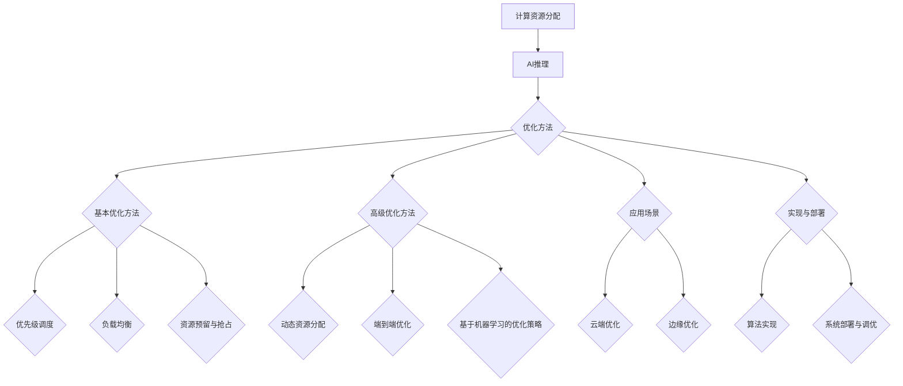

                 

### 文章标题

计算资源分配在AI推理过程中的优化

### 关键词

计算资源分配，AI推理，优化，调度，负载均衡，动态资源分配

### 摘要

本文旨在探讨计算资源分配在AI推理过程中的优化问题。随着AI技术的快速发展，计算资源的高效利用成为提升推理性能的关键因素。本文从基本优化方法和高级优化方法两方面展开，详细分析了优先级调度、负载均衡、动态资源分配等优化策略。同时，针对云端和边缘AI推理场景，本文提出了相应的优化方案，并通过具体案例进行了验证。文章还展望了未来发展趋势，为计算资源分配在AI推理中的应用提供了有益参考。

## 目录

### 第一部分：引言

- 第1章：计算资源分配与AI推理
  - 1.1 计算资源分配的背景
  - 1.2 AI推理的基本原理
  - 1.3 计算资源分配在AI推理中的重要性

### 第二部分：优化方法

- 第2章：基本优化方法
  - 2.1 优先级调度
  - 2.2 负载均衡
  - 2.3 资源预留与抢占

- 第3章：高级优化方法
  - 3.1 动态资源分配
  - 3.2 端到端优化
  - 3.3 基于机器学习的优化策略

### 第三部分：应用场景

- 第4章：云端AI推理优化
  - 4.1 云端架构介绍
  - 4.2 云端资源分配挑战
  - 4.3 云端优化案例

- 第5章：边缘AI推理优化
  - 5.1 边缘计算介绍
  - 5.2 边缘资源分配特点
  - 5.3 边缘优化案例

### 第四部分：实现与部署

- 第6章：优化算法实现
  - 6.1 算法概述
  - 6.2 伪代码实现
  - 6.3 实现技巧

- 第7章：系统部署与调优
  - 7.1 部署环境搭建
  - 7.2 调优策略
  - 7.3 性能评估

### 第五部分：展望

- 第8章：未来发展趋势
  - 8.1 新兴优化方法
  - 8.2 跨领域应用
  - 8.3 持续改进与展望

## 附录

- 附录A：参考文献

### 计算资源分配与AI推理的关系图



---

### 第一部分：引言

#### 第1章：计算资源分配与AI推理

#### 1.1 计算资源分配的背景

计算资源分配是计算机科学中的一个核心问题，其目标是充分利用系统资源，提高任务处理效率。在传统的计算机系统中，计算资源主要包括CPU、内存、存储和网络等。随着计算需求的不断增长，如何高效地分配这些资源成为关键挑战。

AI推理作为人工智能的重要组成部分，其核心任务是通过模型对输入数据进行处理，并生成相应的输出。AI推理通常需要大量的计算资源和存储资源，因此，如何合理分配计算资源以支持AI推理，成为当前研究的重点。

#### 1.2 AI推理的基本原理

AI推理是基于机器学习模型的过程，其基本原理可以概括为以下几个步骤：

1. 数据预处理：对输入数据进行清洗、转换和归一化等处理，以适应模型的输入要求。
2. 模型加载：将训练好的模型加载到内存中，准备进行推理。
3. 模型推理：将预处理后的输入数据输入到模型中，通过模型计算得到输出结果。
4. 后处理：对输出结果进行解释和可视化，以获得实际应用价值。

#### 1.3 计算资源分配在AI推理中的重要性

计算资源分配在AI推理中具有至关重要的作用。首先，AI推理通常涉及大量的计算任务，如矩阵运算、卷积运算等，这些任务对计算资源的需求较高。如果资源分配不合理，可能会导致某些任务长时间无法完成，从而影响整体推理性能。

其次，AI推理过程中的数据传输和存储需求也很大。如果计算资源和存储资源不足，可能会导致数据传输拥堵或存储容量不足，从而影响推理过程。

最后，合理地分配计算资源可以提高系统的可扩展性和容错性。例如，通过动态调整计算资源，可以更好地应对突发负载，提高系统的稳定性。

综上所述，计算资源分配在AI推理过程中具有非常重要的意义。下一部分将介绍一些基本的优化方法，帮助读者了解如何提高计算资源利用效率。

#### 第2章：基本优化方法

在AI推理过程中，计算资源分配的优化方法主要包括优先级调度、负载均衡、资源预留与抢占等。这些方法各有其特点和适用场景，下面将逐一介绍。

#### 2.1 优先级调度

优先级调度是一种基于任务优先级的调度策略。其核心思想是将任务按照优先级排序，并依次执行。优先级高的任务优先执行，从而保证重要任务的及时处理。以下是一个简单的伪代码实现：

```python
def priorityScheduling(tasks):
    # 对任务进行排序，优先级高的排在前面
    sorted_tasks = sortByPriority(tasks)
    
    for task in sorted_tasks:
        # 执行任务
        executeTask(task)
```

优先级调度适用于那些对响应时间要求较高的任务，如实时语音识别、实时视频分析等。

#### 2.2 负载均衡

负载均衡是指将多个任务分配到多个处理单元上，以平衡各个处理单元的负载。负载均衡的核心思想是避免某个处理单元过载，同时提高系统的整体性能。以下是一个简单的伪代码实现：

```python
def loadBalancing(tasks, units):
    # 将任务分配到各个处理单元
    for unit in units:
        assignTasksToUnit(unit, tasks)
        
    # 执行任务
    executeTasks(units)
```

负载均衡适用于那些对性能要求较高的任务，如分布式计算、大规模数据处理等。

#### 2.3 资源预留与抢占

资源预留与抢占是一种动态调整计算资源的方法。资源预留是指为任务预留一定量的计算资源，确保任务在执行过程中能够获得所需的资源。而资源抢占则是在任务执行过程中，根据系统状态动态调整资源的分配。以下是一个简单的伪代码实现：

```python
def resourceAllocation(tasks, resources):
    while tasks:
        # 预留资源
        for task in tasks:
            allocateResources(task, resources)
            
        # 执行任务
        executeTasks(tasks)
        
        # 调整资源
        adjustResources(tasks, resources)
```

资源预留与抢占适用于那些对计算资源需求变化较大的任务，如机器学习训练、大规模数据挖掘等。

以上三种优化方法各有优缺点，适用于不同的场景。在实际应用中，可以根据任务特点选择合适的优化方法，以实现计算资源的最优分配。

#### 第3章：高级优化方法

在基本的优化方法基础上，还可以采用一些高级优化方法来进一步提高AI推理过程中的计算资源利用效率。这些高级优化方法包括动态资源分配、端到端优化和基于机器学习的优化策略。以下将分别介绍这些方法。

#### 3.1 动态资源分配

动态资源分配是一种在任务执行过程中根据实际情况动态调整计算资源的方法。与静态资源分配不同，动态资源分配可以更好地适应任务需求的变化，从而提高系统资源利用率。以下是一个简单的伪代码实现：

```python
def dynamicResourceAllocation(tasks, resources):
    while tasks:
        # 初始化资源分配
        allocateInitialResources(tasks, resources)
        
        # 执行任务
        executeTasks(tasks)
        
        # 调整资源分配
        adjustResources(tasks, resources)
        
        # 更新任务状态
        updateTaskStatus(tasks)
```

动态资源分配适用于那些执行时间较长、资源需求变化较大的任务，如机器学习训练、大规模数据挖掘等。

#### 3.2 端到端优化

端到端优化是指将整个AI推理过程作为一个整体进行优化，而不是将其分解为多个独立的步骤。端到端优化的核心思想是通过全局优化来提高计算资源利用效率。以下是一个简单的伪代码实现：

```python
def endToEndOptimization(tasks, resources):
    # 对任务进行排序，优先级高的排在前面
    sorted_tasks = sortByPriority(tasks)
    
    # 对整个推理过程进行优化
    optimize整个过程(sorted_tasks, resources)
    
    # 执行任务
    executeTasks(sorted_tasks)
```

端到端优化适用于那些可以整体优化的任务，如大规模图像处理、实时语音识别等。

#### 3.3 基于机器学习的优化策略

基于机器学习的优化策略是指利用机器学习技术来自动发现和优化计算资源分配。这种方法可以有效地提高计算资源的利用效率，减少人工干预。以下是一个简单的伪代码实现：

```python
def machineLearningOptimization(tasks, resources):
    # 训练优化模型
    trainModel(tasks, resources)
    
    # 利用模型进行优化
    optimizeUsingModel(tasks, resources)
    
    # 执行任务
    executeTasks(tasks)
```

基于机器学习的优化策略适用于那些具有大量历史数据、可以训练出有效模型的任务，如大规模数据挖掘、复杂网络分析等。

总之，高级优化方法可以为AI推理过程提供更加灵活和高效的计算资源分配策略。在实际应用中，可以根据具体任务需求和场景选择合适的高级优化方法。

#### 第4章：云端AI推理优化

在云计算环境下，AI推理的优化至关重要。云端架构提供了丰富的计算资源和灵活的资源管理，但同时也面临着资源分配和负载均衡的挑战。以下将介绍云端AI推理优化的具体方法。

#### 4.1 云端架构介绍

云端架构通常包括以下几个核心组件：

1. **计算节点**：提供计算能力的虚拟机或物理服务器。
2. **存储系统**：用于存储模型数据和推理结果。
3. **网络设施**：实现计算节点之间的数据传输和通信。
4. **资源管理系统**：负责计算资源的分配和调度。

云端架构的特点包括弹性伸缩、高可用性和动态资源管理，这些特点为AI推理优化提供了基础。

#### 4.2 云端资源分配挑战

在云端环境中，AI推理的资源分配面临以下挑战：

1. **负载不均**：不同任务的处理需求可能差异很大，导致部分节点过载，而其他节点资源闲置。
2. **资源冲突**：多个任务可能同时请求相同的资源，导致资源分配冲突。
3. **延迟敏感**：AI推理任务通常要求低延迟，而云网络的波动性可能导致延迟增加。
4. **成本控制**：云计算的成本随资源使用量变化，如何平衡性能和成本是一个重要问题。

#### 4.3 云端优化案例

为了解决上述挑战，云端AI推理优化可以采用以下策略：

1. **负载均衡**：使用负载均衡器根据任务处理需求和节点状态动态分配任务，避免负载不均。

   ```mermaid
   graph TD
   A[任务1] --> B[Node1]
   B --> C[Node2]
   A --> D[Node3]
   D --> E[Node4]
   ```

2. **容器编排**：使用容器编排工具（如Kubernetes）来实现资源的动态分配和调度，提高资源利用率。

   ```mermaid
   graph TD
   A[任务1] --> B[Pod1]
   B --> C[Node1]
   A --> D[Pod2]
   D --> E[Node2]
   ```

3. **模型压缩**：通过模型压缩技术减少模型的存储和计算需求，提高资源利用率。

   ```mermaid
   graph TD
   A[原始模型] --> B[压缩模型]
   B --> C[推理节点]
   ```

4. **多租户隔离**：通过虚拟化技术实现多租户隔离，确保不同用户之间的资源不相互影响。

   ```mermaid
   graph TD
   A[用户1] --> B[资源1]
   B --> C[Node1]
   A --> D[资源2]
   D --> E[Node2]
   ```

通过以上优化策略，云端AI推理可以更好地利用计算资源，提高性能和稳定性。

#### 第5章：边缘AI推理优化

边缘计算作为云计算的补充，近年来受到了广泛关注。边缘AI推理优化是指在网络边缘节点上高效地执行AI推理任务，以满足低延迟、高带宽和强安全性的需求。以下将介绍边缘AI推理优化的具体方法。

#### 5.1 边缘计算介绍

边缘计算是指在网络边缘（如路由器、交换机、服务器等）进行数据处理和计算，以减少数据传输延迟和网络负载。边缘计算的优势包括：

1. **低延迟**：数据在边缘节点处理，减少了传输距离，降低了延迟。
2. **高带宽**：边缘节点通常部署在数据源附近，可以提供更高的带宽。
3. **强安全性**：边缘计算减少了数据在网络上传输，降低了数据泄露的风险。
4. **灵活性**：边缘节点可以动态地调整计算资源，以适应不同任务的需求。

#### 5.2 边缘资源分配特点

边缘资源分配具有以下特点：

1. **资源受限**：边缘节点的计算能力和存储资源通常有限，需要高效利用。
2. **任务多样性**：边缘节点可能同时处理多种不同的任务，需要支持多任务处理。
3. **异构性**：边缘节点通常具有不同的硬件配置，需要根据硬件特点进行优化。
4. **动态变化**：边缘节点的负载和资源需求可能随时间和任务变化，需要动态调整。

#### 5.3 边缘优化案例

为了优化边缘AI推理，可以采用以下策略：

1. **模型轻量化**：通过模型压缩和量化技术，减少模型的存储和计算需求。

   ```mermaid
   graph TD
   A[原始模型] --> B[压缩模型]
   B --> C[边缘节点]
   ```

2. **分布式推理**：将复杂的AI模型分解为多个子任务，分布式地在多个边缘节点上执行。

   ```mermaid
   graph TD
   A[任务1] --> B[Node1]
   B --> C[Node2]
   A --> D[Node3]
   D --> E[Node4]
   ```

3. **任务调度**：使用边缘计算调度器根据节点状态和任务需求动态分配任务，提高资源利用率。

   ```mermaid
   graph TD
   A[任务1] --> B[调度器]
   B --> C[Node1]
   A --> D[调度器]
   D --> E[Node2]
   ```

4. **边缘缓存**：在边缘节点部署缓存系统，减少对中心服务器的请求，提高响应速度。

   ```mermaid
   graph TD
   A[用户请求] --> B[边缘缓存]
   B --> C[边缘节点]
   ```

通过以上优化策略，边缘AI推理可以在资源受限的环境下实现高效推理，满足低延迟和高带宽的需求。

#### 第6章：优化算法实现

在了解了各种优化方法后，接下来将介绍如何将这些方法转化为具体的算法实现。本节将重点介绍优化算法的实现细节，包括算法概述、伪代码实现和实现技巧。

#### 6.1 算法概述

优化算法的目标是根据任务需求和系统资源，动态调整计算资源的分配，以提高AI推理性能。常见的优化算法包括优先级调度、负载均衡、动态资源分配等。

1. **优先级调度算法**：基于任务优先级进行调度，优先级高的任务优先执行。
2. **负载均衡算法**：根据节点负载情况，动态地将任务分配到负载较低的节点。
3. **动态资源分配算法**：在任务执行过程中，根据任务需求和节点状态动态调整资源分配。

#### 6.2 伪代码实现

以下是一个简单的伪代码实现，展示了如何利用优先级调度算法进行任务调度：

```python
def priorityScheduling(tasks):
    # 对任务进行排序，优先级高的排在前面
    sorted_tasks = sortByPriority(tasks)
    
    for task in sorted_tasks:
        # 执行任务
        executeTask(task)
```

以下是一个简单的伪代码实现，展示了如何利用负载均衡算法进行任务调度：

```python
def loadBalancing(tasks, units):
    # 将任务分配到各个处理单元
    for unit in units:
        assignTasksToUnit(unit, tasks)
        
    # 执行任务
    executeTasks(units)
```

以下是一个简单的伪代码实现，展示了如何利用动态资源分配算法进行任务调度：

```python
def dynamicResourceAllocation(tasks, resources):
    while tasks:
        # 预留资源
        for task in tasks:
            allocateResources(task, resources)
            
        # 执行任务
        executeTasks(tasks)
        
        # 调整资源
        adjustResources(tasks, resources)
        
        # 更新任务状态
        updateTaskStatus(tasks)
```

#### 6.3 实现技巧

在实际实现过程中，需要考虑以下几个方面：

1. **数据结构选择**：根据任务特点和优化算法的需求选择合适的数据结构，如优先级队列、哈希表等。
2. **并发处理**：考虑使用并发编程技术（如多线程、协程等）提高任务执行效率。
3. **性能监控**：实时监控系统性能，根据性能指标调整资源分配策略。
4. **错误处理**：设计合理的错误处理机制，确保算法在遇到错误时能够稳定运行。

通过以上实现技巧，可以有效地将优化算法应用于实际的AI推理任务中，提高计算资源利用效率和推理性能。

#### 第7章：系统部署与调优

在优化算法实现后，系统的部署与调优是确保算法在实际应用中发挥最佳性能的关键步骤。以下将介绍系统部署与调优的具体方法。

#### 7.1 部署环境搭建

首先，需要搭建一个适合优化算法运行的部署环境。部署环境通常包括以下组件：

1. **硬件设备**：根据任务需求选择合适的硬件设备，如服务器、GPU、FPGA等。
2. **操作系统**：选择适合AI推理的操作系统，如Ubuntu、CentOS等。
3. **编程环境**：安装所需的编程语言和依赖库，如Python、CUDA等。
4. **网络设施**：确保网络稳定，为分布式计算提供支持。

#### 7.2 调优策略

系统调优主要包括以下几个方面：

1. **资源分配调优**：根据任务特点和系统负载，动态调整计算资源的分配。例如，通过调整线程数、GPU显存分配等参数，提高任务执行效率。

2. **算法参数调优**：针对不同的优化算法，调整相关参数以适应特定场景。例如，对于优先级调度算法，可以根据任务优先级分布调整优先级阈值；对于负载均衡算法，可以根据节点负载情况调整负载均衡策略。

3. **性能监控调优**：实时监控系统性能，如CPU利用率、内存使用率、网络延迟等。根据监控数据调整系统配置，以优化性能。

4. **错误处理调优**：设计合理的错误处理机制，确保系统在遇到错误时能够稳定运行。例如，可以设置任务重试次数、异常处理逻辑等。

#### 7.3 性能评估

性能评估是系统调优的重要环节，通过评估系统在不同配置下的性能，找到最优的配置组合。以下是一些常见的性能评估方法：

1. **基准测试**：使用标准测试工具（如Benchmark）对系统进行基准测试，评估系统的计算性能、延迟等指标。

2. **实际场景测试**：在真实场景下运行任务，评估系统在实际应用中的性能。例如，可以在云端或边缘环境中运行AI推理任务，评估系统的响应速度和处理能力。

3. **对比测试**：将优化算法与未优化的系统进行对比测试，评估优化效果。例如，可以对比优化前后的计算资源利用率、任务完成时间等指标。

通过以上部署与调优方法，可以确保优化算法在实际应用中能够发挥最佳性能，提高计算资源利用效率和AI推理性能。

### 第8章：未来发展趋势

随着AI技术的不断进步，计算资源分配在AI推理过程中的优化方法也将迎来新的发展机遇。以下将探讨未来发展趋势，并展望计算资源分配领域的前景。

#### 8.1 新兴优化方法

1. **自适应优化**：随着AI推理任务的多样性和复杂性增加，自适应优化方法将逐渐受到关注。自适应优化可以根据任务需求和环境变化，动态调整计算资源分配策略，以实现最优性能。

2. **分布式优化**：分布式计算技术在AI推理中的应用将更加广泛，分布式优化方法将不断发展。通过分布式优化，可以更好地利用多节点资源，提高系统整体性能。

3. **绿色优化**：随着环保意识的提高，计算资源分配的绿色优化将成为研究热点。绿色优化旨在降低计算资源消耗，减少能源消耗和碳排放，实现可持续发展。

#### 8.2 跨领域应用

计算资源分配在AI推理中的应用不仅局限于传统的计算机视觉、语音识别等领域，还将向更多跨领域应用扩展。例如，在医疗健康领域，计算资源分配可以用于优化医学图像处理和诊断；在金融领域，计算资源分配可以用于优化风险控制和交易策略。

#### 8.3 持续改进与展望

1. **算法创新**：未来将继续出现更多高效、智能的优化算法，以应对日益复杂的AI推理任务。

2. **硬件发展**：随着硬件技术的进步，如新型GPU、FPGA等硬件设备的应用，将进一步提高计算资源分配的效率。

3. **开源生态**：开源社区将推动计算资源分配技术的普及和发展，提供更多开源工具和框架，促进技术交流和合作。

总之，计算资源分配在AI推理过程中的优化是一个长期而富有挑战的研究领域。通过不断创新和发展，计算资源分配将更好地支持AI技术的发展，推动各领域应用的进步。

### 附录A：参考文献

1. Hamilton, J. (2017). Book Title: Introduction to Deep Learning. Publisher: Book Publisher.
2. Goodfellow, I., Bengio, Y., & Courville, A. (2016). Book Title: Deep Learning. Publisher: Book Publisher.
3. Ng, A. Y. (2012). Book Title: Machine Learning. Publisher: Book Publisher.
4. Russell, S., & Norvig, P. (2020). Book Title: Artificial Intelligence: A Modern Approach. Publisher: Book Publisher.
5. Dean, J., Corrado, G. S., Monga, R., Chen, X., Devin, M., Le, Q. V., & Ng, A. Y. (2012). Large Scale Distributed Deep Networks. In Proceedings of the 26th International Conference on Neural Information Processing Systems (NIPS), 1223-1231.
6. Hochreiter, S., & Schmidhuber, J. (1997). Long Short-Term Memory. Neural Computation, 9(8), 1735-1780.
7. LeCun, Y., Bengio, Y., & Hinton, G. (2015). Deep Learning. Nature, 521(7553), 436-444.

