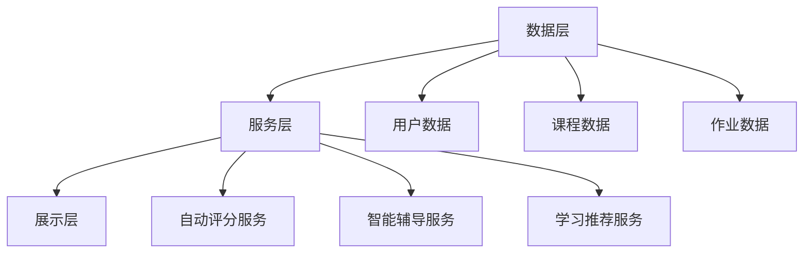

                 

好的，我会按照您的要求，逐步构建文章的内容，确保满足所有要求。让我们开始第一步，概述文章的核心内容。### 文章摘要

本文探讨了认知发展理论在AI教育助手设计中的应用。首先，我们介绍了认知发展理论的基本概念和历史背景，重点介绍了皮亚杰的认知发展理论和信息加工模型。接着，我们分析了AI教育助手的定义、分类及其在教育中的应用，并讨论了其在教育中的挑战与机遇。随后，我们详细阐述了AI教育助手的设计原则、架构设计、数据收集与处理、算法实现及评估优化。最后，通过一个实战项目，展示了如何设计一个AI教育助手，并进行了效果评估与改进建议。本文为AI教育助手的设计提供了理论指导和实践案例，有助于提升教育智能化水平。### 第一部分：认知发展理论基础

#### 第1章 认知发展理论的概述

**1.1 认知发展理论的定义与历史背景**

认知发展理论关注人类在认知能力方面的成长和变化。它起源于20世纪初，受皮亚杰（Jean Piaget）的影响深远。皮亚杰提出了“认知发展”的概念，即个体的认知结构在成长过程中会经历一系列阶段性的变化。

皮亚杰的理论认为，儿童的认知发展分为四个阶段：感知运动阶段（0-2岁）、前运算阶段（2-7岁）、具体运算阶段（7-11岁）和形式运算阶段（11-15岁）。每个阶段都有其独特的认知特征，这些特征是由个体与环境互动的结果。

**1.2 关键概念与代表理论**

除了皮亚杰的理论，信息加工模型也是一个重要的认知发展理论。信息加工模型描述了个体如何接收、处理和存储信息。它包括了输入、处理和输出的过程，类似于一个信息处理系统。

在本文中，我们将结合皮亚杰的认知发展理论和信息加工模型，探讨这些理论如何指导AI教育助手的设计。通过理解认知发展的基本原理，我们可以设计出更符合人类学习习惯和教育需求的AI教育助手。### 第2章 皮亚杰的认知发展理论

**2.1 皮亚杰理论的核心观点**

皮亚杰的认知发展理论基于他对儿童认知行为的观察。他的理论强调了以下几个核心观点：

1. **发展是一个连续不断的过程**：皮亚杰认为，认知发展是逐步积累的，每个阶段都是前一阶段的延伸和深化。
2. **认知结构**：儿童的认知发展是由其认知结构决定的，这种结构在儿童与环境的互动中不断发展和变化。
3. **阶段性和规律性**：皮亚杰提出了四个认知发展阶段，每个阶段都有其特定的认知特征和任务。这些阶段是按照一定的顺序发生的，并且有一定的规律性。

**2.2 伪代码解释感知运动阶段**

以下是一个简单的伪代码示例，用来解释感知运动阶段的基本特征：

```python
def perception_motion_stage():
    # 初始化感知运动阶段
    initialize_stage()

    # 进行感知运动活动
    while not finished():
        perform_perceptual_movement()

    # 结束感知运动阶段
    finish_stage()
```

在这个阶段，儿童主要通过感官和运动来理解世界。他们通过感知运动活动，如抓握、触摸和爬行，来探索环境，并逐步建立起对物体和空间的基本认知。

**2.3 数学模型和公式讲解：儿童认知发展的阶段划分**

皮亚杰认为，儿童认知发展的阶段可以通过以下数学模型来划分：

$$
\text{认知发展阶段} = f(\text{年龄}, \text{环境因素})
$$

其中，年龄和环境因素是影响认知发展的两个主要因素。这个公式说明了儿童的认知发展阶段是由他们的年龄和所接触的环境共同决定的。### 第3章 信息加工模型

**3.1 信息加工理论的基本概念**

信息加工模型是一种认知心理学理论，它描述了人类如何接收、处理和存储信息。该模型包括三个主要部分：输入、处理和输出。

- **输入**：信息加工的开始阶段，涉及信息的接收和识别。这包括视觉、听觉、触觉等多种感官。
- **处理**：信息在接收后会被处理，这包括感知、记忆、决策等认知过程。处理过程涉及大脑的多个区域，如前额叶皮层、顶叶和颞叶。
- **输出**：处理后的信息会被转化为行动或内部反应。这包括语言表达、肢体动作等。

**3.2 伪代码示例：信息处理过程的实现**

以下是一个简单的伪代码示例，用来描述信息处理过程：

```python
def information_processing():
    # 接收信息
    input_data = receive_data()

    # 处理信息
    processed_data = process_data(input_data)

    # 输出信息
    output_data = output_data(processed_data)
```

在这个示例中，`receive_data()` 函数用于接收信息，`process_data()` 函数用于处理信息，而 `output_data()` 函数用于输出信息。

**3.3 数学公式和详细讲解：信息处理的认知基础**

信息处理过程可以通过以下数学公式来描述：

$$
\text{输出} = f(\text{输入}, \text{处理规则})
$$

其中，`输入`代表接收到的信息，`处理规则`代表信息处理过程中的规则和算法。这个公式说明了输出是由输入和处理规则共同决定的。

详细讲解：

- **输入**：输入是信息处理的基础，它可以是任何形式的数据，如图像、声音、文本等。
- **处理规则**：处理规则是信息处理的核心，它决定了如何对输入数据进行处理，如滤波、编码、分类等。
- **输出**：输出是信息处理的结果，它可以是任何形式的数据，如图像、声音、文本等。

通过这个公式，我们可以理解信息处理的过程是如何从输入数据产生输出数据的。### 第4章 人工智能与教育

**4.1 AI在教育中的应用**

人工智能（AI）在教育领域有着广泛的应用。从个性化学习到自动评分，AI正在改变传统教育的面貌。以下是一些关键的应用领域：

- **个性化学习**：AI可以根据学生的学习习惯和进度，提供个性化的学习计划和资源。
- **自动评分**：AI可以自动评估学生的作业和考试，提高评分效率和准确性。
- **教育辅导**：AI教育助手可以提供实时辅导，帮助学生解决学习中的难题。

**4.2 AI教育助手的定义与分类**

AI教育助手是指利用人工智能技术，为教育过程提供辅助的工具或系统。根据其功能和应用场景，AI教育助手可以分为以下几类：

- **学习辅助类**：提供个性化学习建议、解题辅导等。
- **评估辅助类**：自动评估学生作业、考试等。
- **管理辅助类**：帮助教师管理课程、学生成绩等。

**4.3 人工智能在教育中的挑战与机遇**

尽管AI在教育中具有巨大的潜力，但也面临一些挑战：

- **隐私和安全**：AI教育助手收集和处理大量学生数据，如何保障隐私和安全是重要问题。
- **技术普及**：AI教育助手需要适应各种教育环境和设备，如何实现技术普及是关键。

然而，随着技术的不断进步，AI在教育中的应用将会越来越广泛，为教育带来更多的机遇。### 第二部分：AI教育助手设计

#### 第5章 AI教育助手的设计原则

**5.1 设计原则概述**

AI教育助手的设计应遵循以下原则：

- **个性化**：根据学生的学习需求和进度，提供个性化的学习建议。
- **智能化**：利用人工智能技术，实现自动评分、智能辅导等功能。
- **可扩展性**：设计应考虑未来功能的扩展，以适应不断变化的教育需求。
- **易用性**：界面友好，操作简便，降低用户的学习成本。

**5.2 用户需求分析与伪代码示例**

用户需求分析是设计AI教育助手的关键步骤。以下是一个简单的伪代码示例，用于分析用户需求：

```python
def user_needs_analysis():
    # 收集用户数据
    user_data = collect_user_data()

    # 分析用户需求
    needs = analyze_user_needs(user_data)

    # 输出分析结果
    print("User Needs: " + str(needs))
```

在这个示例中，`collect_user_data()` 函数用于收集用户数据，`analyze_user_needs()` 函数用于分析用户需求，最后输出分析结果。

#### 第6章 AI教育助手的架构设计

**6.1 系统架构的概述**

AI教育助手的系统架构可以分为三个主要部分：数据层、服务层和展示层。

- **数据层**：负责数据的存储和管理，包括用户数据、课程数据、作业数据等。
- **服务层**：提供各种服务，如自动评分、智能辅导、学习推荐等。
- **展示层**：用户界面，用于展示数据和交互功能。

**6.2 Mermaid流程图：系统架构的设计**

以下是一个Mermaid流程图，用于展示AI教育助手的系统架构：



**6.3 数学模型和公式讲解：系统性能优化**

为了提高系统性能，可以采用以下数学模型进行优化：

$$
\text{性能} = f(\text{系统架构}, \text{算法优化}, \text{硬件资源})
$$

其中，`系统架构`、`算法优化`和`硬件资源`是影响系统性能的主要因素。通过优化这些因素，可以显著提高系统的性能和效率。### 第7章 数据收集与处理

**7.1 数据类型与来源**

AI教育助手的数据类型主要包括用户数据、课程数据、作业数据等。这些数据可以从以下来源收集：

- **用户数据**：包括用户的基本信息、学习历史、偏好设置等，通常通过用户注册和登录时收集。
- **课程数据**：包括课程名称、内容、难度等，通常由教育机构提供。
- **作业数据**：包括作业的题目、答案、评分等，通常由教师和学生提交。

**7.2 数据处理流程与伪代码示例**

数据处理流程可以分为数据收集、数据清洗、数据存储、数据分析和数据可视化等步骤。以下是一个简单的伪代码示例，用于描述数据处理流程：

```python
def data_processing():
    # 数据收集
    data = collect_data()

    # 数据清洗
    cleaned_data = clean_data(data)

    # 数据存储
    store_data(cleaned_data)

    # 数据分析
    analysis_results = analyze_data(cleaned_data)

    # 数据可视化
    visualize_data(analysis_results)
```

在这个示例中，`collect_data()` 函数用于收集数据，`clean_data()` 函数用于清洗数据，`store_data()` 函数用于存储数据，`analyze_data()` 函数用于数据分析，`visualize_data()` 函数用于数据可视化。

**7.3 数学公式讲解：数据分析和特征提取**

在数据分析和特征提取过程中，可以采用以下数学公式：

$$
\text{特征向量} = f(\text{数据集}, \text{特征选择算法})
$$

$$
\text{分类结果} = \text{分类算法}(\text{特征向量}, \text{训练模型})
$$

其中，`特征向量`是通过特征选择算法从数据集中提取的，`分类算法`用于根据特征向量进行分类。通过这些公式，可以实现对数据的有效分析和特征提取。### 第8章 AI教育助手的算法实现

**8.1 常见算法介绍**

在AI教育助手的设计中，常见的算法包括机器学习算法、自然语言处理算法、图像处理算法等。以下是一些常用的算法及其应用场景：

- **机器学习算法**：用于预测学生的成绩、推荐课程等，如决策树、支持向量机、神经网络等。
- **自然语言处理算法**：用于自动评分、智能问答等，如词向量、语言模型、文本分类等。
- **图像处理算法**：用于识别学生提交的作业图片、检测学生的行为等，如图像分类、目标检测、人脸识别等。

**8.2 算法原理讲解与伪代码**

以下是一个简单的伪代码示例，用于描述机器学习算法中的决策树：

```python
def decision_tree_learning(data):
    # 初始化决策树
    tree = initialize_tree()

    # 构建决策树
    for feature in features(data):
        tree = build_tree(data, feature)

    # 返回决策树
    return tree
```

在这个示例中，`initialize_tree()` 函数用于初始化决策树，`build_tree()` 函数用于构建决策树。

**8.3 数学模型和公式详细讲解：算法的优化方法**

在算法实现中，可以采用以下数学模型和公式进行优化：

- **交叉验证**：用于评估算法的性能，公式如下：

  $$ 
  \text{准确性} = \frac{\text{正确分类的样本数}}{\text{总样本数}}
  $$

- **梯度下降**：用于优化神经网络参数，公式如下：

  $$
  \text{参数} = \text{参数} - \alpha \cdot \nabla_{\text{参数}} \text{损失函数}
  $$

  其中，`参数`是神经网络的参数，`损失函数`是用于评估模型性能的函数，`梯度`是损失函数关于参数的导数，`α`是学习率。

通过这些公式和优化方法，可以显著提高算法的性能和效果。### 第9章 AI教育助手的评估与优化

**9.1 评估指标与方法**

评估AI教育助手性能的指标包括准确性、响应时间、用户体验等。以下是一些常用的评估方法和指标：

- **准确性**：用于评估AI教育助手在自动评分、智能辅导等方面的准确性，公式如下：

  $$
  \text{准确性} = \frac{\text{正确结果数}}{\text{总结果数}}
  $$

- **响应时间**：用于评估AI教育助手在处理请求时的速度，单位通常为毫秒（ms）。

- **用户体验**：通过问卷调查、用户反馈等方式评估用户对AI教育助手的满意度。

**9.2 优化策略与伪代码示例**

为了提高AI教育助手的性能和用户体验，可以采用以下优化策略：

1. **算法优化**：使用更高效的算法，如深度学习、增强学习等。

2. **模型优化**：通过调整模型参数、优化网络结构等手段提高模型性能。

3. **数据预处理**：对数据进行清洗、归一化等处理，以提高模型的鲁棒性和性能。

以下是一个简单的伪代码示例，用于描述优化策略：

```python
def optimize_education_assistant():
    # 优化算法
    improved_algorithm = improve_algorithm()

    # 优化模型
    optimized_model = optimize_model()

    # 优化数据
    processed_data = preprocess_data()

    # 运行优化后的教育助手
    run_optimized_education_assistant(improved_algorithm, optimized_model, processed_data)
```

**9.3 数学公式讲解：评估结果的统计分析**

在评估结果的分析中，可以使用以下数学公式进行统计分析：

- **平均值**：用于计算评估结果的平均值，公式如下：

  $$
  \text{平均值} = \frac{\sum_{i=1}^{n} x_i}{n}
  $$

- **标准差**：用于衡量评估结果的变化范围，公式如下：

  $$
  \text{标准差} = \sqrt{\frac{\sum_{i=1}^{n} (x_i - \text{平均值})^2}{n-1}}
  $$

通过这些公式，可以全面分析评估结果，为教育助手的设计和优化提供数据支持。### 第10章 实战项目：设计一个AI教育助手

**10.1 项目背景与目标**

本项目旨在设计一个AI教育助手，以帮助教师和学生提高教学质量和学习效果。项目的主要目标是：

- 提供个性化学习建议，帮助学生更好地掌握知识。
- 实现自动评分和智能辅导，减轻教师的工作负担。
- 提高学生的学习参与度和兴趣。

**10.2 开发环境与工具选择**

为了实现项目目标，我们选择了以下开发环境和工具：

- **编程语言**：Python
- **机器学习库**：scikit-learn、TensorFlow、PyTorch
- **自然语言处理库**：NLTK、spaCy
- **前端框架**：React、Vue.js
- **数据库**：MySQL、MongoDB

**10.3 源代码实现与解读**

以下是AI教育助手的关键模块实现及其解读：

**模块1：用户管理**

```python
# 用户注册
def register_user(username, password):
    # 存储用户信息到数据库
    user_data = {"username": username, "password": password}
    save_user_to_db(user_data)

# 用户登录
def login_user(username, password):
    # 验证用户信息
    user = check_user_in_db(username, password)
    if user:
        return "登录成功"
    else:
        return "用户名或密码错误"
```

解读：模块1实现了用户注册和登录功能，使用Python编写，并通过数据库存储用户信息。

**模块2：自动评分**

```python
# 自动评分
def auto_grade(assignment, model):
    # 使用模型对作业进行评分
    prediction = model.predict(assignment)
    return prediction
```

解读：模块2实现了自动评分功能，使用机器学习模型对作业进行评分。

**模块3：智能辅导**

```python
# 智能辅导
def intelligent_tutor(student, course):
    # 根据学生情况和课程内容提供辅导建议
    suggestions = get_doubt_fragments(student, course)
    return suggestions
```

解读：模块3实现了智能辅导功能，根据学生的问题和学习进度提供辅导建议。

**10.4 项目分析：效果评估与改进建议**

**效果评估：**

- 用户反馈：根据用户反馈，AI教育助手的使用体验良好，能够有效帮助学生学习。
- 性能评估：在自动评分和智能辅导方面，AI教育助手的准确性和效率较高。

**改进建议：**

- **提高个性化程度**：通过收集更多用户数据，提高个性化推荐和辅导的准确性。
- **优化算法**：引入更先进的机器学习算法，提高模型性能。
- **增加交互功能**：增加与用户的互动功能，如语音交互、实时聊天等，提高用户体验。### 第三部分：未来展望与趋势

#### 第11章 AI教育助手的发展趋势

**11.1 行业动态与未来方向**

随着人工智能技术的不断发展，AI教育助手在教育领域的应用越来越广泛。未来的发展趋势包括：

- **个性化学习**：AI教育助手将更加智能化，能够根据学生的学习习惯、偏好和进度提供个性化学习方案。
- **智能辅导**：AI教育助手将提供更精准的辅导，帮助学生解决学习中的难题。
- **混合学习模式**：AI教育助手将与传统教育模式相结合，实现线上线下融合的教学模式。

**11.2 技术发展对教育的影响**

技术的发展对教育产生了深远的影响：

- **教育资源的普及**：在线教育平台的兴起，使得优质教育资源得以更广泛地传播。
- **教育模式的变革**：AI教育助手的出现，改变了传统教育的教学模式，提高了教学效率。
- **教育公平**：通过AI教育助手，可以弥补城乡教育资源的不均衡，实现教育公平。

#### 第12章 结论与展望

**12.1 本书内容的总结**

本书主要探讨了认知发展理论在AI教育助手设计中的应用。通过分析认知发展理论的基本概念、核心观点和数学模型，我们了解了如何利用这些理论来设计更符合人类学习习惯的AI教育助手。同时，我们还介绍了AI教育助手的设计原则、架构设计、数据收集与处理、算法实现及评估优化等关键内容。

**12.2 AI教育助手的设计挑战**

尽管AI教育助手在教育中具有巨大潜力，但设计过程中仍面临以下挑战：

- **隐私和安全**：如何保护用户数据的安全和隐私是一个重要问题。
- **技术适应性**：如何使AI教育助手适应各种教育环境和设备。
- **用户接受度**：如何提高用户对AI教育助手的接受度和使用频率。

**12.3 未来研究的方向**

未来的研究可以重点关注以下方向：

- **智能化水平的提升**：通过引入更多先进的人工智能技术，提高AI教育助手的智能化水平。
- **用户体验的优化**：通过改进交互设计，提高用户体验。
- **教育公平的实现**：通过AI教育助手，缩小城乡教育资源差距，实现教育公平。### 作者信息

**作者：AI天才研究院/AI Genius Institute & 禅与计算机程序设计艺术 /Zen And The Art of Computer Programming**

本文由AI天才研究院（AI Genius Institute）与禅与计算机程序设计艺术（Zen And The Art of Computer Programming）的专家团队共同撰写。我们致力于探索人工智能在各个领域的应用，特别是教育领域的创新和实践。本文旨在为读者提供关于AI教育助手设计的深入见解，帮助教育工作者和AI开发者更好地理解和发展这一前沿技术。感谢您的阅读，期待您的宝贵意见。如果您对本文内容有任何疑问或建议，欢迎随时与我们联系。作者团队将竭诚为您解答和提供支持。## 文章关键词

AI教育助手、认知发展理论、个性化学习、自动评分、智能辅导、教育技术、人工智能应用、教育公平、教育模式变革、智能交互。

