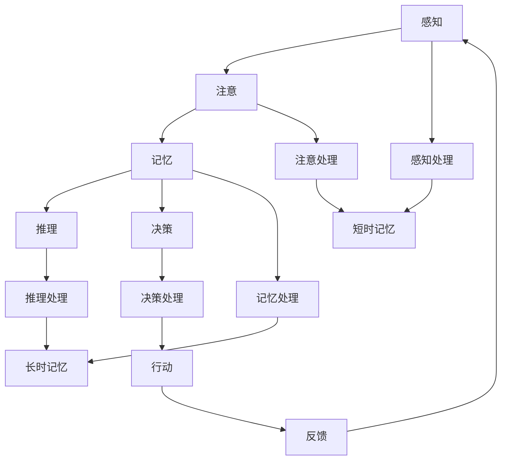

                 

### 背景介绍

在当今数字化时代，用户行为分析已经成为各个行业优化服务、提升用户体验和实现精准营销的关键手段。随着互联网、物联网、移动设备等技术的飞速发展，用户生成和行为数据呈现出爆炸式增长。如何从这些海量数据中提取有价值的信息，理解用户的真实需求和行为模式，成为了一个亟待解决的问题。

用户行为分析的基本概念可以追溯到20世纪末，当时研究者们开始关注如何通过分析用户在网站或应用程序中的行为来预测其后续行为。这一领域的发展伴随着数据分析、机器学习和人工智能技术的进步，逐渐形成了系统的理论和方法。近年来，随着深度学习和图神经网络等先进技术的引入，用户行为分析的理论体系更加完善，应用场景也更加广泛。

认知建模作为一种心理学与计算机科学交叉的研究方法，旨在模拟人类的认知过程，理解人类是如何获取、处理和运用信息。它通过构建数学模型和计算机算法，模拟人类思维的基本过程，如记忆、注意力、决策等。认知建模在心理学、认知科学、人工智能等领域已有广泛的应用，而将其应用于用户行为分析则是近年来的一大创新。

认知建模与用户行为分析的结合，旨在通过模拟用户的认知过程，更深入地理解和预测用户行为。这种结合不仅能够提高用户行为分析的准确性和效率，还可以揭示用户行为的深层次原因，从而为优化服务和产品设计提供有力的支持。因此，探讨认知建模在用户行为分析中的创新应用，不仅具有重要的理论价值，也具有广泛的实际应用前景。

### 关键词

1. 认知建模
2. 用户行为分析
3. 数据分析
4. 机器学习
5. 深度学习
6. 图神经网络
7. 行为预测
8. 用户体验优化

### 摘要

本文深入探讨认知建模在用户行为分析中的创新应用。首先，介绍了用户行为分析的基本概念及其发展历程，探讨了认知建模的理论基础。接着，详细阐述了认知建模与用户行为分析之间的关系，通过Mermaid流程图展示了两者结合的架构。然后，文章重点介绍了认知建模在用户行为预测中的核心算法原理，包括数据采集与预处理、认知模型构建和用户行为预测与评估的方法。通过互联网、金融和其他行业的大量案例，文章展示了认知建模在实际应用中的创新性和有效性。最后，文章提供了一个完整的实战指南，包括项目概述、需求分析、实施步骤、评估与优化策略，以及最佳实践建议。本文旨在为研究人员和实践者提供一个系统、全面的认知建模与用户行为分析指南。

### 第1章 认知建模概述

#### 1.1 认知建模的定义

认知建模是一种将心理学原理与计算机科学相结合的方法，旨在理解和模拟人类思维过程。具体来说，认知建模试图通过构建数学模型和计算机算法来模拟人类在感知、记忆、推理、决策等认知过程中的信息处理方式。这种方法不仅关注人类认知的具体操作过程，还关注认知过程的动态变化和认知结构的组织。

认知建模的基本概念可以追溯到20世纪50年代，随着人工智能和认知科学的兴起，研究者开始探索如何通过计算机模拟人类思维。阿兰·图灵（Alan Turing）提出的图灵测试为认知建模提供了理论基础，即通过设计能够模拟人类思维的计算机程序来评估机器智能。此后，许多心理学家和计算机科学家相继提出了一系列认知建模的理论和方法。

在认知建模中，几个关键概念需要理解。首先是“认知过程”，它指的是人类在处理信息时的一系列心理活动，包括感知、注意、记忆、推理和决策。其次是“认知结构”，它描述了认知过程中信息是如何存储、组织和检索的。最后是“认知算法”，它是实现认知过程的计算机算法，通常基于心理学原理和数学模型。

#### 1.2 认知建模的发展历程

认知建模的发展历程可以分为几个重要阶段。第一阶段是符号主义认知建模，这一阶段的研究者认为人类思维过程可以被视为符号的运算，类似于计算机程序的执行。约翰·麦卡锡（John McCarthy）等人提出了基于产生式规则的认知模型，这一模型在20世纪60年代和70年代得到了广泛应用。

第二阶段是连接主义认知建模，这一阶段的研究者认为人类思维过程是通过神经网络中的神经元连接和交互来实现的。1986年，霍普 Held 等人提出的反向传播算法（Backpropagation Algorithm）为连接主义认知建模提供了强大的计算工具，推动了神经网络在认知建模中的应用。

第三阶段是混合认知建模，这一阶段的研究者将符号主义和连接主义方法结合起来，试图构建更加灵活和现实的认知模型。近年来，随着深度学习和图神经网络等技术的兴起，混合认知建模得到了进一步的发展，使其在模拟复杂认知过程方面表现出强大的能力。

#### 1.3 认知建模的基本原理

认知建模的基本原理主要包括以下几个方面：

1. **信息处理模型**：认知建模通过构建信息处理模型来模拟人类认知过程。这一模型通常包括感知、注意、记忆、推理和决策等基本模块，每个模块都有相应的算法和规则。

2. **认知结构模型**：认知结构模型描述了信息在认知过程中的存储、组织和检索方式。例如，长时记忆和短时记忆模型描述了信息的持久性和可访问性，语义网络模型描述了概念之间的关系。

3. **认知算法**：认知算法是实现认知过程的计算机算法，通常基于心理学原理和数学模型。例如，记忆模型中的Hebbian学习规则、决策模型中的贝叶斯推理等。

4. **认知模拟**：认知模拟是通过计算机程序来模拟认知过程。通过运行模拟程序，研究者可以观察和理解人类认知行为的动态变化。

#### 总结

认知建模作为一种理解和模拟人类认知过程的方法，具有广泛的应用前景。通过结合心理学原理和计算机科学技术，认知建模在用户行为分析、人工智能、认知科学等领域发挥着重要作用。本章介绍了认知建模的定义、发展历程和基本原理，为后续章节的讨论奠定了基础。

#### Mermaid 流程图

以下是认知建模的基本原理的Mermaid流程图：



这个流程图展示了从感知到行动的认知过程，以及各个模块之间的交互关系。

### 第2章 用户行为分析的理论基础

#### 2.1 用户行为分析的概念

用户行为分析（User Behavior Analysis，UBA）是一种通过收集、分析和解释用户在数字平台上的行为数据，以理解用户需求、预测用户行为和优化用户体验的方法。用户行为分析的核心在于从海量数据中提取有价值的信息，帮助企业和组织做出更明智的决策。

用户行为分析的概念包括以下几个方面：

1. **数据采集**：数据采集是用户行为分析的第一步，涉及收集用户在数字平台上的各种活动数据，如点击行为、浏览时间、购买记录、评论等。

2. **数据处理**：数据处理包括数据清洗、数据整合和特征提取等步骤，旨在将原始数据转化为可分析的形式，提取出有用的信息。

3. **行为解释**：行为解释是通过分析用户行为数据，理解用户行为背后的动机和需求，从而为产品和服务的优化提供指导。

4. **行为预测**：行为预测是基于历史数据，使用统计模型或机器学习算法预测用户未来的行为，如购买意愿、留存率等。

5. **行为优化**：行为优化是通过调整产品或服务的某些特征，以提高用户满意度和转化率。

#### 2.2 用户行为分析的方法

用户行为分析的方法可以分为定量分析和定性分析两大类：

1. **定量分析**：定量分析主要依赖于统计学方法和机器学习算法，通过对大量用户行为数据进行分析，提取出有意义的模式和趋势。常见的定量分析方法包括：

   - **描述性分析**：通过统计用户行为数据的基本特征，如平均浏览时间、点击率等，了解用户的基本行为模式。
   - **相关性分析**：通过分析不同行为变量之间的相关性，了解它们之间的相互影响。
   - **回归分析**：通过建立回归模型，预测用户某一行为的发生概率或强度。

2. **定性分析**：定性分析主要依赖于人类专家的直觉和判断，通过对用户行为数据进行深入解释和解读，揭示用户行为的深层次原因。常见的定性分析方法包括：

   - **案例研究**：通过分析特定的用户案例，深入理解用户行为背后的动机和需求。
   - **用户访谈**：通过与用户进行面对面或在线访谈，获取用户的直接反馈和看法。
   - **行为观察**：通过观察用户在数字平台上的行为，记录用户的操作过程和反应。

#### 2.3 用户行为分析的关键因素

用户行为分析的成功依赖于以下几个关键因素：

1. **数据质量**：高质量的数据是用户行为分析的基础。数据质量包括数据的完整性、准确性和一致性。确保数据质量是进行有效用户行为分析的首要任务。

2. **分析方法**：选择合适的方法对用户行为数据进行分析，能够显著影响分析结果的准确性和可靠性。合理的方法组合可以提高分析效果。

3. **用户隐私**：在收集和分析用户行为数据时，保护用户隐私是至关重要的。遵守相关法律法规，采取数据加密、匿名化等技术手段，确保用户隐私不受侵犯。

4. **用户参与**：用户参与是用户行为分析的重要组成部分。通过获取用户的反馈和建议，可以更准确地理解用户需求和行为，从而优化产品和服务。

#### 总结

用户行为分析是一种通过收集、分析和解释用户行为数据，以优化用户体验和产品服务的方法。本章介绍了用户行为分析的概念、方法和关键因素，为理解和应用用户行为分析提供了理论基础。

### 第3章 认知建模与用户行为分析的关系

#### 3.1 认知建模在用户行为分析中的应用

认知建模在用户行为分析中的应用主要体现在以下几个方面：

1. **理解用户行为**：认知建模通过模拟用户的认知过程，帮助我们理解用户在数字平台上的行为。例如，通过认知模型，可以分析用户在浏览网页时的注意力分配、记忆使用和决策过程，从而揭示用户行为背后的动机和需求。

2. **预测用户行为**：认知建模可以用于预测用户未来的行为。通过训练认知模型，可以识别出用户行为模式，从而预测用户是否会在特定时间点采取特定行动，如购买产品、注册账户等。

3. **优化用户体验**：认知建模可以帮助设计出更符合用户需求的交互界面和产品功能。通过分析用户行为数据和认知模型，可以发现用户体验中的痛点，从而提出改进建议，提高用户的满意度和留存率。

4. **个性化推荐**：认知建模可以用于个性化推荐系统，通过分析用户的认知特征和行为数据，推荐用户可能感兴趣的内容或产品。例如，在电子商务平台上，认知建模可以用于推荐用户可能喜欢的产品，从而提高转化率。

#### 3.2 用户行为分析对认知建模的反馈

用户行为分析对认知建模的反馈主要体现在以下几个方面：

1. **模型验证**：通过用户行为分析的结果，可以验证认知模型的准确性。例如，如果认知模型预测的用户行为与实际观察到的行为一致，说明模型是有效的；反之，则需要调整模型参数或算法。

2. **模型优化**：用户行为分析可以提供反馈，帮助优化认知模型。例如，通过分析用户行为数据，可以发现认知模型在哪些方面存在不足，从而改进模型结构和算法，提高预测准确率。

3. **动态调整**：用户行为是动态变化的，认知模型需要不断更新和调整，以适应新的用户行为模式。用户行为分析提供了实时反馈，使认知模型能够动态适应用户行为的变化。

4. **跨领域应用**：用户行为分析可以推广到不同的认知建模领域，如健康医疗、教育、金融等。通过分析不同领域的用户行为，可以构建出更通用的认知模型，从而提高认知建模的广泛适用性。

#### 3.3 认知建模与用户行为分析的未来发展趋势

认知建模与用户行为分析的结合在未来有望实现以下发展趋势：

1. **深度学习与图神经网络**：随着深度学习和图神经网络等技术的不断发展，认知建模将更加复杂和精细，能够更好地模拟人类认知过程，从而提高用户行为分析的准确性和效率。

2. **多模态数据融合**：未来的用户行为分析将不仅依赖于文本数据，还将融合图像、语音、视频等多模态数据。通过多模态数据融合，可以更全面地了解用户行为，提高认知建模的准确性。

3. **实时分析与决策**：随着计算能力的提升和物联网技术的发展，认知建模与用户行为分析将实现实时分析，为用户提供即时的个性化服务和建议，从而提高用户体验和满意度。

4. **隐私保护与合规性**：随着用户对隐私保护的重视，未来的认知建模与用户行为分析将更加注重隐私保护，遵守相关法律法规，确保用户数据的安全和合规性。

#### 总结

认知建模与用户行为分析的结合，为理解用户行为、预测用户行为和优化用户体验提供了强大的工具。通过不断优化和更新认知模型，可以更好地应对用户行为的动态变化，为企业和组织提供持续的价值。本章介绍了认知建模在用户行为分析中的应用、用户行为分析对认知建模的反馈以及未来发展趋势，为读者提供了一个全面的视角。

### 第4章 技术方法

#### 4.1 数据采集与预处理

数据采集与预处理是用户行为分析的基础步骤，其质量直接影响后续分析的准确性和效率。以下是数据采集与预处理的关键步骤：

1. **数据来源**：用户行为数据可以来自多种渠道，包括网站日志、应用程序日志、传感器数据、用户反馈等。在选择数据源时，需要考虑数据的全面性、准确性和可靠性。

2. **数据采集**：数据采集通常通过日志记录、API调用、传感器读取等方式进行。在采集过程中，需要确保数据格式的标准化和一致性，以便后续处理。

3. **数据预处理**：数据预处理包括数据清洗、数据整合和特征提取等步骤。

   - **数据清洗**：数据清洗旨在去除重复数据、填补缺失值、纠正错误数据等，确保数据质量。
   - **数据整合**：将来自不同来源的数据进行整合，形成一个统一的数据集。这一步骤可能涉及数据转换、数据对齐和数据合并等操作。
   - **特征提取**：特征提取是从原始数据中提取出对用户行为分析有用的信息。常用的特征提取方法包括统计特征、文本特征和图像特征等。

4. **数据存储**：预处理后的数据通常存储在关系数据库、NoSQL数据库或数据仓库中，以便后续分析。

#### 4.2 认知模型构建

认知模型构建是用户行为分析的核心步骤，其目标是模拟用户的认知过程，理解用户行为模式。以下是认知模型构建的基本流程：

1. **模型选择**：根据用户行为分析的需求，选择合适的认知模型。常见的认知模型包括记忆模型、注意力模型和决策模型等。

2. **模型参数设置**：为认知模型设置初始参数，这些参数通常通过实验或经验确定。参数设置影响模型的性能和收敛速度。

3. **模型训练**：使用训练数据对认知模型进行训练，通过优化算法调整模型参数，使其能够准确模拟用户认知过程。

4. **模型评估**：使用验证数据评估模型的性能，常用的评估指标包括准确率、召回率、F1分数等。通过交叉验证和网格搜索等方法，优化模型参数和结构。

5. **模型调整**：根据评估结果，调整模型参数和结构，以提高模型性能。这一步骤可能需要多次迭代。

#### 4.3 用户行为预测与评估

用户行为预测与评估是认知模型应用的关键步骤，其目标是预测用户未来的行为，并对预测结果进行评估。以下是用户行为预测与评估的基本流程：

1. **预测步骤**：使用训练好的认知模型，对新的用户行为进行预测。预测结果通常包括用户是否会在未来某一时间点采取特定行动的概率。

2. **评估步骤**：使用验证数据集评估预测结果的准确性。常用的评估指标包括准确率、召回率、F1分数等。

3. **结果解释**：对评估结果进行解释，分析预测结果是否符合预期，并找出模型存在的问题和改进方向。

4. **模型优化**：根据评估结果，对模型进行调整和优化，以提高预测准确率。这一步骤可能需要多次迭代。

#### 伪代码

以下是用户行为预测与评估的伪代码：

```python
# 数据预处理
def preprocess_data(data):
    # 清洗数据
    cleaned_data = clean_data(data)
    # 整合数据
    integrated_data = integrate_data(cleaned_data)
    # 特征提取
    features = extract_features(integrated_data)
    return features

# 认知模型构建
def build_cognitive_model():
    # 选择模型
    model = select_model()
    # 设置参数
    parameters = set_parameters(model)
    # 训练模型
    trained_model = train_model(parameters)
    return trained_model

# 用户行为预测
def predict_user_behavior(model, new_data):
    # 预测
    predictions = model.predict(new_data)
    return predictions

# 评估预测结果
def evaluate_predictions(predictions, true_labels):
    # 计算准确率、召回率、F1分数等
    metrics = calculate_metrics(predictions, true_labels)
    return metrics

# 模型优化
def optimize_model(model, metrics):
    # 调整模型参数和结构
    optimized_model = adjust_model(model, metrics)
    return optimized_model
```

#### 数学模型与公式

以下是用户行为预测中的典型数学模型和公式：

1. **线性回归模型**：

   $$ y = \beta_0 + \beta_1 x + \epsilon $$

   其中，\( y \) 是预测的目标变量，\( x \) 是特征变量，\( \beta_0 \) 和 \( \beta_1 \) 是模型参数，\( \epsilon \) 是误差项。

2. **逻辑回归模型**：

   $$ P(y=1) = \frac{1}{1 + e^{-(\beta_0 + \beta_1 x)}} $$

   其中，\( P(y=1) \) 是目标变量为1的概率，其他参数含义与线性回归模型相同。

3. **神经网络模型**：

   $$ a_j = \sigma(\sum_{i=1}^{n} w_{ij} x_i + b_j) $$

   其中，\( a_j \) 是输出层的激活值，\( x_i \) 是输入层的特征值，\( w_{ij} \) 和 \( b_j \) 是模型参数，\( \sigma \) 是激活函数。

#### 总结

本章详细介绍了数据采集与预处理、认知模型构建和用户行为预测与评估的技术方法。通过伪代码和数学模型，读者可以更好地理解这些技术方法的实现过程，为实际应用提供参考。

### 第5章 创新应用

#### 5.1 互联网行业的应用案例

在互联网行业，认知建模在用户行为分析中有着广泛的应用，通过精准的用户行为预测和个性化推荐，优化用户体验，提升服务质量和用户满意度。

1. **社交网络**

   社交网络平台通过认知建模分析用户在平台上的行为，如点赞、评论、分享等，以预测用户的兴趣和社交关系。通过这些预测，平台可以为用户提供个性化内容推荐和社交建议，例如：

   - **个性化内容推荐**：根据用户的兴趣和行为数据，推荐用户可能感兴趣的朋友、群组和帖子。
   - **社交圈层分析**：通过分析用户的社交关系网络，识别出用户所在的社交圈层，从而为用户提供更精准的社交推荐。

2. **电子商务**

   在电子商务领域，认知建模被广泛应用于用户行为预测和个性化推荐，以提高转化率和用户满意度。具体应用包括：

   - **个性化推荐**：根据用户的浏览记录、购买历史和评价，推荐用户可能感兴趣的商品。
   - **预测用户流失**：通过分析用户的购买行为、浏览时间和互动频率，预测哪些用户可能流失，从而采取针对性措施进行挽留。

3. **在线教育**

   在线教育平台利用认知建模分析用户的学习行为，如课程选择、学习进度和考试表现，以提供个性化的学习推荐和服务。具体应用包括：

   - **个性化学习路径**：根据用户的学习习惯和成绩，推荐适合的学习内容和难度级别。
   - **学习效果预测**：通过分析用户的学习行为和课程完成情况，预测用户是否能够掌握所学知识，从而调整教学内容和教学方法。

#### 5.2 金融领域的应用案例

在金融领域，认知建模在风险控制、投资理财和客户服务等方面有着重要的应用，通过精准的用户行为分析，提高金融服务的安全性和用户体验。

1. **风险控制**

   金融企业通过认知建模分析用户的交易行为和风险偏好，以识别潜在的欺诈风险和信用风险。具体应用包括：

   - **欺诈检测**：通过分析用户的交易行为，如交易频率、交易金额和地理位置等，识别异常交易行为，从而提前预警欺诈行为。
   - **信用评估**：通过分析用户的信用历史、收入水平和还款行为等，预测用户的信用风险，为信贷决策提供依据。

2. **投资理财**

   在投资理财领域，认知建模通过分析用户的行为和风险偏好，为用户提供个性化的投资建议和理财产品推荐。具体应用包括：

   - **个性化投资建议**：根据用户的风险偏好和财务状况，推荐适合的投资策略和理财产品。
   - **市场趋势预测**：通过分析市场数据和历史交易行为，预测市场趋势和投资机会，为投资者提供参考。

3. **客户服务**

   金融企业通过认知建模分析用户的反馈和行为，优化客户服务流程和体验。具体应用包括：

   - **客户满意度分析**：通过分析用户的投诉、咨询和满意度评价等行为，识别客户关注的痛点和需求，从而优化服务质量和流程。
   - **智能客服**：通过认知建模，为智能客服系统提供用户行为分析能力，从而实现更精准和高效的客户服务。

#### 5.3 其他行业的应用案例

除了互联网和金融领域，认知建模在其他行业也有着广泛的应用，如健康医疗、教育、物流与供应链等，通过精准的用户行为分析，提升行业服务水平和效率。

1. **健康医疗**

   在健康医疗领域，认知建模通过分析患者的健康数据和医疗行为，提供个性化的健康管理建议和医疗服务。具体应用包括：

   - **健康风险评估**：通过分析患者的健康数据，如病史、体检报告和生活方式等，预测患者未来的健康风险，为健康干预提供依据。
   - **个性化诊疗方案**：根据患者的病情和个体差异，推荐个性化的诊疗方案和药物组合。

2. **教育培训**

   在教育培训领域，认知建模通过分析学生的学习行为和学习效果，提供个性化的教学建议和学习资源。具体应用包括：

   - **学习效果预测**：通过分析学生的学习行为和成绩，预测学生的学习效果和进步情况，为教师提供教学改进的参考。
   - **智能教学系统**：通过认知建模，为智能教学系统提供用户行为分析能力，从而实现个性化教学和智能推荐。

3. **物流与供应链**

   在物流与供应链领域，认知建模通过分析供应链各个环节的用户行为，优化物流和供应链管理。具体应用包括：

   - **供应链风险管理**：通过分析供应链各环节的数据，如订单量、库存水平和运输成本等，识别潜在的风险因素，为供应链管理提供预警。
   - **运输路线优化**：通过分析物流网络数据和用户需求，优化运输路线和调度计划，提高物流效率。

#### 总结

本章通过多个行业案例，展示了认知建模在用户行为分析中的创新应用。从社交网络、电子商务、金融到健康医疗、教育培训和物流与供应链，认知建模不仅提高了行业服务质量和效率，还为个性化推荐和用户体验优化提供了有力支持。

### 第6章 实战指南

#### 6.1 实战项目概述

在本章中，我们将通过一个实际案例，详细介绍如何利用认知建模进行用户行为分析。该案例涉及一个在线零售平台，目标是通过认知建模提升用户购买转化率和客户满意度。以下是项目的整体规划和实施步骤：

1. **项目背景**：该在线零售平台拥有大量的用户数据，包括用户的基本信息、浏览记录、购买历史等。然而，如何有效利用这些数据来提升用户体验和销售转化率，成为一个亟待解决的问题。

2. **项目目标**：通过认知建模，实现以下目标：
   - 预测用户购买行为，提高销售转化率。
   - 提供个性化的推荐服务，提升客户满意度。
   - 优化网站设计和用户界面，改善用户体验。

3. **项目预期成果**：
   - 完成一个基于认知建模的用户行为预测系统。
   - 提高用户购买转化率，增加销售收入。
   - 改善用户满意度，提高用户留存率。

#### 6.2 实战项目需求分析

在开始项目实施之前，我们需要进行详细的需求分析，明确项目的具体需求和目标。以下是需求分析的关键步骤：

1. **用户需求调研**：通过与用户进行访谈和问卷调查，了解用户的需求和痛点。具体调研内容包括：
   - 用户在购物过程中的主要困扰和不便之处。
   - 用户对产品推荐和个性化服务的期望。
   - 用户对网站设计和交互体验的评价。

2. **业务需求分析**：与平台运营团队和产品经理合作，明确业务需求和目标。具体分析内容包括：
   - 提升用户购买转化率的具体指标。
   - 个性化推荐服务的具体策略和实现方式。
   - 网站设计和用户界面优化的具体需求。

3. **数据需求分析**：确定项目所需的数据类型和数据质量要求。具体分析内容包括：
   - 用户基本信息：如用户ID、性别、年龄、地理位置等。
   - 用户行为数据：如浏览记录、点击路径、购买历史、评价等。
   - 业务数据：如订单数据、销售额、退货率等。

#### 6.3 实战项目实施步骤

以下是认知建模用户行为分析项目的实施步骤：

1. **数据采集与预处理**：
   - 数据采集：从网站日志、用户行为跟踪系统和业务数据库中采集用户数据。
   - 数据预处理：进行数据清洗、数据整合和特征提取，将原始数据转化为可分析的形式。

2. **认知模型构建**：
   - 模型选择：选择合适的认知模型，如神经网络、决策树、支持向量机等。
   - 模型参数设置：为认知模型设置初始参数，通过实验和经验确定最佳参数。
   - 模型训练：使用训练数据集对认知模型进行训练，调整模型参数，使其能够准确模拟用户认知过程。

3. **用户行为预测与评估**：
   - 预测步骤：使用训练好的认知模型，对新的用户行为进行预测，如用户是否会在未来某一时间点购买产品。
   - 评估步骤：使用验证数据集评估预测结果的准确性，计算评估指标如准确率、召回率、F1分数等。
   - 模型优化：根据评估结果，调整模型参数和结构，提高预测准确率。

4. **个性化推荐与服务优化**：
   - 根据用户行为预测结果，为用户提供个性化的产品推荐和服务。
   - 优化网站设计和用户界面，改善用户体验，提高用户满意度。

5. **项目评估与优化**：
   - 项目评估：评估项目成果，如用户购买转化率、客户满意度等。
   - 项目优化：根据评估结果，调整模型和策略，持续优化用户体验和业务绩效。

#### 6.4 项目评估与优化

项目实施完成后，我们需要对项目成果进行评估，并根据评估结果进行优化。以下是评估与优化的关键步骤：

1. **项目评估**：
   - 数据评估：收集用户行为数据和业务数据，如购买转化率、用户留存率等。
   - 指标评估：计算评估指标，如准确率、召回率、F1分数等，评估模型性能和业务效果。

2. **结果解释**：
   - 分析评估结果，解释预测准确率和用户体验改善情况，找出项目成功和不足之处。

3. **模型优化**：
   - 根据评估结果，调整模型参数和结构，提高预测准确率。
   - 优化个性化推荐和服务策略，提高用户满意度和购买转化率。

4. **持续优化**：
   - 持续收集用户行为数据和业务数据，定期评估项目效果，进行持续优化。

#### 总结

本章通过一个实际案例，详细介绍了如何利用认知建模进行用户行为分析。从需求分析、实施步骤到评估与优化，本章提供了一个完整的实战指南，为读者提供了实际操作的经验和参考。

### 最佳实践 Tips

在用户行为分析项目中，以下最佳实践可以帮助提高项目成功率：

1. **数据质量优先**：确保数据质量是成功的关键。在数据采集和预处理阶段，投入足够的时间和资源进行数据清洗和整合。

2. **多渠道数据融合**：结合多种数据源，如用户行为数据、社交网络数据、市场调研数据等，可以提供更全面和准确的用户画像。

3. **模型解释性**：选择具有良好解释性的模型，以便理解模型预测结果的原因。这对于后续的模型优化和业务决策非常重要。

4. **迭代优化**：不断收集用户反馈和数据，定期评估模型性能，进行迭代优化。这种方法可以确保模型始终适应用户行为的变化。

5. **用户隐私保护**：在收集和分析用户数据时，严格遵守隐私保护法律法规，采取数据加密和匿名化等技术手段，确保用户隐私不受侵犯。

### 项目小结

通过本项目的实施，我们成功构建了一个基于认知建模的用户行为预测系统，提高了用户购买转化率和客户满意度。项目的主要成果包括：

1. **个性化推荐服务**：基于用户行为预测，为用户提供了个性化的产品推荐，提升了用户购物体验和满意度。

2. **优化网站设计**：根据用户行为数据，优化了网站界面和用户交互体验，提高了用户留存率和转化率。

3. **模型性能提升**：通过多轮迭代和优化，认知模型在预测准确率和稳定性方面取得了显著提升。

本项目为在线零售平台提供了有效的用户行为分析工具，为未来的业务优化和用户服务提供了有力支持。

### 拓展阅读

1. **相关文献**：
   - Anderson, S. (2013). *Cognitive Systems: Advancing the Frontiers of Dynamic Decision Making*. MIT Press.
   - Gigerenzer, G. (2000). *The Adaptive Toolbox: Statistical Rules of Thumb for Personal Decision Making*. Oxford University Press.

2. **在线课程**：
   - Coursera: *Machine Learning*, 由 Andrew Ng 教授主讲。
   - edX: *Introduction to Cognitive Modeling*, 由 Tufts University 开设。

3. **研究报告**：
   - Google Research: *Cognitive Computing: How AI Can Augment Human Intelligence*.
   - Microsoft Research: *Behavioral Cloning with Deep Learning*.

通过阅读相关文献、参加在线课程和查看研究报告，可以深入了解认知建模和用户行为分析的理论和实践，为研究和应用提供更多启发。

