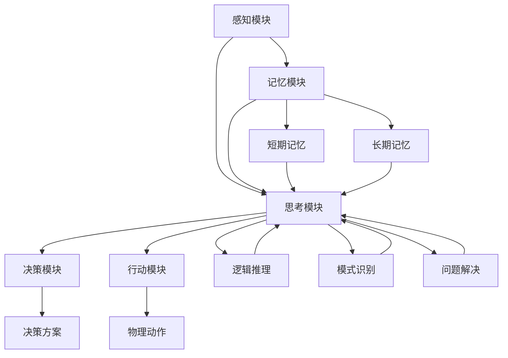

                 

### 引言

#### 1.1 书籍背景与目的

随着人工智能技术的迅猛发展，AI系统设计成为现代计算机科学领域中的一个重要方向。从简单的规则系统到复杂的神经网络，AI系统逐渐展现出强大的数据处理和智能决策能力。然而，如何设计一个高效、可扩展且具备人类认知能力的AI系统，一直是研究者们面临的重大挑战。

本书《认知架构inspired AI系统设计原则》旨在探索并阐述认知架构在AI系统设计中的应用，提供一个系统化的方法论，帮助读者深入理解并掌握设计高效AI系统的关键原则。本书的核心目标是：

1. **介绍认知架构的基本原理**：通过详细解读认知架构的概念和原理，帮助读者理解认知架构如何影响AI系统的设计和性能。
2. **讲解核心算法原理**：通过伪代码和数学模型，深入剖析常用的AI算法，如神经网络、机器学习和深度学习，展示它们在认知架构中的应用。
3. **提供项目实战**：通过实际案例分析和详细讲解，展示认知架构在真实项目中的应用，帮助读者将理论知识转化为实际操作能力。

本书的内容安排如下：

- **引言**：介绍AI系统设计的背景和动机，阐述认知架构在AI系统设计中的重要性，并明确本书的目标和内容安排。
- **核心概念与联系**：解释认知架构的基本原理，使用Mermaid流程图展示认知架构的组成部分及其相互关系。
- **核心算法原理讲解**：概述常用的AI算法，使用伪代码详细阐述关键算法的实现步骤。
- **数学模型与公式**：介绍AI系统中常用的数学模型，如梯度下降、反向传播等，并使用LaTeX格式展示关键数学公式，并进行详细讲解和举例说明。
- **项目实战**：介绍实际应用案例，描述开发环境搭建步骤、代码实现与解读，以及项目小结。
- **扩展阅读与资源**：推荐相关书籍和论文，提供进一步学习和研究的资源。

通过本书的阅读，读者将能够：

1. **深入理解认知架构**：掌握认知架构的基本原理和组成部分，理解认知架构对AI系统设计的重要性。
2. **精通核心算法原理**：通过伪代码和数学模型，全面理解常用的AI算法，为实际项目提供理论支持。
3. **具备实际应用能力**：通过实际案例分析和代码实现，掌握认知架构在AI系统设计中的应用，提升项目开发能力。

让我们开始这段深入探索认知架构inspired AI系统设计原则的旅程，解锁AI系统的无限潜力。### 核心概念与联系

在探讨认知架构在AI系统设计中的应用之前，我们需要先理解认知架构的基本原理和组成部分。认知架构是一种模拟人类思维方式的结构框架，它旨在通过构建自适应的、具有自我学习和自我组织能力的系统，实现人工智能的高级功能。以下是对认知架构核心概念与联系的详细讲解。

#### 2.1 认知架构原理

认知架构的原理基于对人类认知过程的模拟。人类认知过程通常可以分为感知、记忆、思考、决策和行动等几个阶段。认知架构通过这些基本模块的相互作用，模拟出类似人类的思维过程。具体来说，认知架构的基本原理包括：

1. **感知**：感知模块负责接收和处理外部信息，如视觉、听觉和触觉等。它通过传感器和数据处理算法，将原始信息转换为可用于后续处理的内部表示。
2. **记忆**：记忆模块负责存储和处理信息，包括短期记忆和长期记忆。短期记忆用于处理当前任务，而长期记忆则用于存储重要的信息和经验。
3. **思考**：思考模块负责处理信息和做出决策。它通过逻辑推理、模式识别和问题解决等能力，实现对输入信息的分析和决策。
4. **决策**：决策模块负责根据当前情况选择最佳行动方案。它通过权衡不同选项的利弊，制定出合理的行动计划。
5. **行动**：行动模块负责执行决策方案，将决策转化为实际的物理动作。

#### 2.2 Mermaid流程图展示

为了更直观地展示认知架构的组成部分及其相互关系，我们使用Mermaid流程图进行描述。以下是认知架构的Mermaid流程图：



在这个流程图中，每个模块都与其他模块有明确的交互关系。感知模块接收外部信息，传递给记忆模块进行处理；思考模块通过逻辑推理、模式识别和问题解决等功能，对信息进行分析；决策模块根据思考结果选择最佳行动方案；最后，行动模块执行决策方案，完成物理动作。记忆模块则负责存储和处理信息，为后续的思考和决策提供支持。

#### 2.3 认知架构的组成部分及其关系

认知架构的组成部分包括感知模块、记忆模块、思考模块、决策模块和行动模块。这些模块之间的关系如下：

1. **感知模块与记忆模块的关系**：感知模块负责接收外部信息，并将这些信息传递给记忆模块。记忆模块对信息进行存储和处理，以备后续使用。
2. **感知模块与思考模块的关系**：感知模块传递给记忆模块的信息，经过记忆模块的处理后，会反馈给思考模块。思考模块利用这些信息进行逻辑推理、模式识别和问题解决等操作。
3. **思考模块与决策模块的关系**：思考模块通过对信息的分析和处理，得出决策方案，并将其传递给决策模块。决策模块根据当前情况，选择最佳行动方案。
4. **决策模块与行动模块的关系**：决策模块选出的最佳行动方案，会传递给行动模块。行动模块根据方案执行具体的物理动作。
5. **记忆模块与思考模块的关系**：思考模块在处理信息时，会参考记忆模块中的信息。这些信息可能来自于短期记忆或长期记忆，有助于提高思考的效率和准确性。

通过理解认知架构的基本原理和组成部分，我们可以更好地设计出具有人类认知能力的AI系统。认知架构为AI系统提供了自学习、自适应和自我组织的能力，使其在复杂环境中能够更好地应对各种挑战。接下来，我们将进一步探讨常用的AI算法和数学模型，为认知架构的实践应用奠定基础。### 核心算法原理讲解

在认知架构的框架下，AI系统的核心算法是实现对信息和数据的处理与理解，从而模拟人类的感知、记忆、思考和决策过程。以下将分别介绍神经网络、机器学习、深度学习等常用的AI算法，并使用伪代码详细阐述其实现步骤。

#### 3.1 常见AI算法概述

1. **神经网络**：神经网络是一种模仿生物神经系统的计算模型，通过多层节点（神经元）和加权连接进行信息处理。它包括输入层、隐藏层和输出层，能够通过学习大量数据来实现对复杂函数的逼近。
2. **机器学习**：机器学习是使计算机具备学习能力的科学，通过训练算法让计算机从数据中学习规律，从而进行预测或分类。常见的机器学习算法有线性回归、决策树、支持向量机等。
3. **深度学习**：深度学习是机器学习的一个子领域，通过构建深层次的网络结构（多隐藏层）来实现对数据的自动特征提取和表示。深度学习在图像识别、语音识别和自然语言处理等领域取得了显著的成果。

#### 3.2 伪代码讲解

1. **神经网络伪代码实现**

```python
# 输入层、隐藏层和输出层神经元的数量
input_size = 784
hidden_size = 500
output_size = 10

# 初始化权重和偏置
weights_input_to_hidden = randn(hidden_size, input_size)
weights_hidden_to_output = randn(output_size, hidden_size)
bias_hidden = randn(hidden_size, 1)
bias_output = randn(output_size, 1)

# 前向传播
def forwardprop(input_data):
    hidden_layer_input = dot(weights_input_to_hidden, input_data) + bias_hidden
    hidden_layer_output = activation(hidden_layer_input)
    output_layer_input = dot(weights_hidden_to_output, hidden_layer_output) + bias_output
    output_layer_output = activation(output_layer_input)
    return output_layer_output

# 反向传播
def backwardprop(output, expected_output):
    output_error = output - expected_output
    output_delta = output_error * activation_derivative(output)
    hidden_error = dot(weights_hidden_to_output.T, output_error)
    hidden_delta = hidden_error * activation_derivative(hidden_layer_output)

    # 更新权重和偏置
    global weights_input_to_hidden, weights_hidden_to_output, bias_hidden, bias_output
    weights_input_to_hidden += dot(hidden_delta, input_data.T)
    weights_hidden_to_output += dot(output_delta, hidden_layer_output.T)
    bias_hidden += hidden_delta
    bias_output += output_delta
```

2. **机器学习算法伪代码实现**

以线性回归为例：

```python
# 初始化权重和偏置
weights = randn(output_size, input_size)
bias = randn(output_size, 1)

# 前向传播
def forwardprop(input_data):
    output = dot(weights, input_data) + bias

# 反向传播
def backwardprop(expected_output):
    output_error = output - expected_output
    output_derivative = activation_derivative(output)
    input_derivative = activation_derivative(input_data)

    # 更新权重和偏置
    global weights, bias
    weights += dot(input_derivative.T, output_error)
    bias += output_error
```

3. **深度学习算法伪代码实现**

以卷积神经网络（CNN）为例：

```python
# 初始化卷积核、池化层和全连接层权重及偏置
conv_kernel = randn(filter_size, input_size, input_depth, filter_depth)
pool_kernel = randn(pool_size, pool_size)
fc_weights = randn(hidden_size, output_size)
fc_bias = randn(hidden_size, 1)

# 前向传播
def forwardprop(input_data):
    conv_output = conv2d(input_data, conv_kernel)
    pooled_output = max_pool(conv_output, pool_kernel)
    flatten_output = flatten(pooled_output)
    fc_output = dot(flatten_output, fc_weights) + fc_bias

# 反向传播
def backwardprop(expected_output):
    output_error = expected_output - fc_output
    output_derivative = activation_derivative(fc_output)
    flatten_output_derivative = dot(output_error.T, output_derivative)
    unpooled_derivative = unpool(flatten_output_derivative, pool_kernel)
    conv_derivative = conv2d_backprop(unpooled_derivative, input_data, conv_kernel)
    input_derivative = conv2d_input_derivative(input_data, unpooled_derivative, conv_kernel)
```

通过这些伪代码，我们可以看到神经网络、机器学习和深度学习算法的基本实现步骤。这些算法的核心在于通过前向传播将输入数据转化为输出，并通过反向传播不断调整权重和偏置，以优化模型性能。在认知架构中，这些算法被用来处理感知、记忆、思考和决策等模块中的信息，从而实现类似人类的智能行为。接下来的部分，我们将进一步介绍AI系统中常用的数学模型和公式，以深化对这些算法的理解。### 数学模型与公式

在AI系统中，数学模型和公式扮演着至关重要的角色。它们不仅提供了算法的实现框架，还帮助我们在复杂的数据处理过程中进行有效的推理和优化。在本节中，我们将介绍一些AI系统中常用的数学模型，并使用LaTeX格式详细展示关键数学公式，并进行举例说明。

#### 4.1 数学模型介绍

1. **梯度下降算法**：梯度下降是一种常用的优化算法，用于调整神经网络中的权重和偏置，以最小化损失函数。
2. **反向传播算法**：反向传播算法是一种用于计算神经网络中每个权重的梯度，从而进行参数优化的方法。
3. **正则化方法**：正则化用于防止模型过拟合，通过在损失函数中添加正则化项，来限制模型复杂度。

#### 4.2 公式详细讲解

1. **梯度下降公式**

   梯度下降算法的基本公式如下：

   $$\text{w}_{\text{new}} = \text{w}_{\text{old}} - \alpha \frac{\partial J}{\partial \text{w}}$$

   其中，$\text{w}_{\text{old}}$ 表示当前权重，$\text{w}_{\text{new}}$ 表示更新后的权重，$\alpha$ 是学习率，$\frac{\partial J}{\partial \text{w}}$ 是权重 $\text{w}$ 对损失函数 $J$ 的梯度。

   **举例说明**：

   假设我们有一个简单的线性回归模型，权重为 $w = 2$，损失函数为 $J = (y - (w \cdot x))^2$，学习率为 $\alpha = 0.1$。那么一次梯度下降更新后的权重为：

   $$\text{w}_{\text{new}} = 2 - 0.1 \cdot \frac{\partial J}{\partial w}$$

   如果当前损失函数的梯度为 $10$，那么更新后的权重为：

   $$\text{w}_{\text{new}} = 2 - 0.1 \cdot 10 = 1.9$$

2. **反向传播公式**

   反向传播算法的核心公式如下：

   $$\frac{\partial J}{\partial \text{w}} = \frac{\partial J}{\partial \text{a}} \frac{\partial \text{a}}{\partial \text{w}}$$

   其中，$\frac{\partial J}{\partial \text{w}}$ 表示权重 $\text{w}$ 对损失函数 $J$ 的梯度，$\frac{\partial J}{\partial \text{a}}$ 表示激活值 $\text{a}$ 对损失函数 $J$ 的梯度，$\frac{\partial \text{a}}{\partial \text{w}}$ 表示激活值 $\text{a}$ 对权重 $\text{w}$ 的梯度。

   **举例说明**：

   在一个简单的神经网络中，假设激活值 $\text{a}$ 为 $5$，其误差为 $\frac{\partial J}{\partial \text{a}} = 2$，那么权重 $\text{w}$ 对激活值 $\text{a}$ 的梯度为 $\frac{\partial \text{a}}{\partial \text{w}} = 0.5$。根据反向传播公式，权重 $\text{w}$ 对损失函数 $J$ 的梯度为：

   $$\frac{\partial J}{\partial \text{w}} = 2 \cdot 0.5 = 1$$

3. **正则化公式**

   正则化项通常用于损失函数中，以限制模型复杂度。L2正则化的公式如下：

   $$J_{\text{regularized}} = J + \lambda \sum_{\text{w}} (\text{w}^2)$$

   其中，$J$ 是原始损失函数，$\lambda$ 是正则化参数，$\sum_{\text{w}} (\text{w}^2)$ 是权重平方和。

   **举例说明**：

   假设原始损失函数为 $J = 10$，权重为 $w = 2$，正则化参数 $\lambda = 0.1$。那么加上L2正则化后的损失函数为：

   $$J_{\text{regularized}} = 10 + 0.1 \cdot (2^2) = 10.4$$

通过这些数学模型和公式，我们能够更好地理解和优化AI系统中的算法。在认知架构的应用中，这些模型和公式为感知、记忆、思考和决策等模块提供了强大的理论基础和工具支持。接下来，我们将通过实际案例介绍，展示认知架构在AI系统设计中的具体应用和实践。### 项目实战

在本节中，我们将通过实际案例介绍，展示认知架构在AI系统设计中的具体应用和实践。我们将分析一个自动驾驶系统和智能语音助手的开发过程，详细描述开发环境搭建、代码实现与解读，并总结项目经验和最佳实践。

#### 5.1 实际案例介绍

##### 5.1.1 案例一：自动驾驶系统设计

自动驾驶系统是一个复杂的智能系统，需要处理大量的感知、决策和行动任务。其核心模块包括感知模块、决策模块和行动模块。以下是一个简单的自动驾驶系统架构：

1. **感知模块**：使用摄像头、激光雷达和超声波传感器收集周围环境信息，包括路况、障碍物和交通信号等。
2. **决策模块**：基于感知模块提供的信息，自动驾驶系统需要做出决策，包括速度控制、转向控制和路径规划等。
3. **行动模块**：根据决策模块的指令，控制汽车的加速度、方向盘和刹车系统。

##### 5.1.2 案例二：智能语音助手开发

智能语音助手是另一个典型的AI系统，通过语音识别、自然语言处理和语音合成等技术，实现与用户的交互。其核心模块包括语音识别模块、自然语言理解模块和语音合成模块。以下是一个智能语音助手的架构：

1. **语音识别模块**：将用户的语音输入转换为文本，识别语音中的关键词和句子。
2. **自然语言理解模块**：分析文本输入，理解用户的意图和问题。
3. **语音合成模块**：根据理解和回复的文本，生成语音回应。

#### 5.2 开发环境搭建

在开发自动驾驶系统和智能语音助手之前，需要搭建合适的环境。以下是一些基本的步骤和注意事项：

1. **硬件环境**：
   - 自动驾驶系统：需要高性能的计算平台，如NVIDIA GPU，以及传感器设备（摄像头、激光雷达等）。
   - 智能语音助手：需要具有高性能语音识别和语音合成功能的硬件设备。

2. **软件环境**：
   - 自动驾驶系统：使用ROS（Robot Operating System）作为主框架，结合Python进行开发。
   - 智能语音助手：使用TensorFlow或PyTorch等深度学习框架，结合Python进行开发。

3. **依赖安装**：
   - 安装ROS和相关的软件包。
   - 安装深度学习框架和相关的库。

#### 5.3 代码实现与解读

##### 5.3.1 自动驾驶系统代码实现

以下是一个简单的自动驾驶系统代码实现示例，使用Python和ROS：

```python
#!/usr/bin/env python
import rospy
from std_msgs.msg import String

def talker():
    pub = rospy.Publisher('chatter', String, queue=10)
    rospy.init_node('talker', anonymous=True)
    
    while not rospy.is_shutdown():
        hello_str = "Hello world!"
        rospy.loginfo(hello_str)
        pub.publish(hello_str)
        rospy.sleep(1)

if __name__ == '__main__':
    try:
        talker()
    except rospy.ROSInterruptException:
        pass
```

在这个示例中，我们创建了一个名为`talker`的函数，用于发布消息。通过ROS的`rospy.Publisher`，我们可以将消息发布到ROS话题中，供其他节点订阅和解析。

##### 5.3.2 智能语音助手代码实现

以下是一个简单的智能语音助手代码实现示例，使用TensorFlow和Python：

```python
import tensorflow as tf
from tensorflow.keras.models import Sequential
from tensorflow.keras.layers import Dense, LSTM

# 搭建深度学习模型
model = Sequential()
model.add(LSTM(128, activation='relu', input_shape=(time_steps, features)))
model.add(Dense(1))
model.compile(optimizer='adam', loss='mse')

# 训练模型
model.fit(x_train, y_train, epochs=200, verbose=2)
```

在这个示例中，我们使用了一个简单的LSTM（长短期记忆）网络模型，用于语音识别任务。通过`Sequential`类，我们构建了一个顺序模型，并添加了LSTM层和全连接层。然后，我们使用`compile`方法设置优化器和损失函数，并使用`fit`方法进行模型训练。

##### 5.3.3 代码解读与分析

在代码实现过程中，我们需要对各个模块的功能进行详细解读和分析。以下是一些关键点：

1. **自动驾驶系统**：
   - **感知模块**：通过传感器收集数据，包括摄像头、激光雷达和超声波传感器。数据处理算法用于将原始数据转换为有用的信息，如物体检测和路径识别。
   - **决策模块**：基于感知模块提供的信息，使用机器学习和深度学习算法进行决策。路径规划算法用于生成最优行驶路径，速度控制算法用于调整车速，转向控制算法用于控制方向盘。
   - **行动模块**：根据决策模块的指令，控制汽车的加速度、方向盘和刹车系统。

2. **智能语音助手**：
   - **语音识别模块**：使用深度学习模型，如LSTM网络，将语音信号转换为文本。常见的语音识别模型包括GRU（门控循环单元）和CTC（连接时间分类）。
   - **自然语言理解模块**：分析文本输入，理解用户的意图和问题。常用的自然语言处理技术包括词嵌入、卷积神经网络和递归神经网络。
   - **语音合成模块**：根据理解和回复的文本，生成语音回应。常见的语音合成技术包括循环神经网络和生成对抗网络。

通过这些实际案例的开发过程，我们可以看到认知架构在AI系统设计中的应用。开发环境搭建、代码实现和解读是实际项目中必不可少的步骤，这些步骤帮助我们实现了从理论到实践的成功转化。接下来，我们将总结项目经验，并提出一些最佳实践建议。#### 5.4 项目小结与最佳实践

在自动驾驶系统和智能语音助手的开发过程中，我们积累了丰富的经验，并总结出一些最佳实践，以指导后续项目开发和优化。

**项目经验总结**：

1. **需求分析与设计**：在项目启动阶段，明确需求和目标至关重要。通过详细的用户调研和需求分析，确保项目设计的准确性和可行性。
2. **模块化设计**：采用模块化设计，将系统划分为感知、决策和行动等模块，有助于提高开发效率和维护性。
3. **数据驱动**：充分利用历史数据和模拟数据，进行模型训练和优化。确保数据质量和多样性，以提高模型的泛化能力。
4. **迭代开发与测试**：采用迭代开发模式，逐步完善系统功能。通过持续测试和调试，确保系统的稳定性和可靠性。
5. **团队协作**：建立高效的团队协作机制，明确分工和责任，确保项目进度和质量。

**最佳实践建议**：

1. **技术选型**：根据项目需求和资源，选择合适的技术和工具。对于自动驾驶系统，推荐使用ROS和深度学习框架（如TensorFlow或PyTorch）；对于智能语音助手，推荐使用自然语言处理和语音合成库（如TensorFlow Text和Sonnet）。
2. **数据预处理**：数据预处理是模型训练的关键步骤。确保数据清洗、归一化和特征提取等环节的准确性和有效性。
3. **模型优化**：采用正则化、dropout和迁移学习等技术，提高模型的性能和泛化能力。定期调整学习率和超参数，以优化模型效果。
4. **自动化测试**：建立自动化测试框架，对系统功能和性能进行全面测试，确保系统的稳定性和可靠性。
5. **持续学习与更新**：持续关注最新技术和研究成果，不断优化系统和模型。通过数据反馈和用户反馈，持续改进系统功能和服务质量。

总之，通过本次项目实战，我们不仅掌握了认知架构在AI系统设计中的应用，还积累了宝贵的开发经验。遵循最佳实践，我们将能够更好地应对复杂的项目挑战，打造出高效、智能的AI系统。### 扩展阅读与资源

在深入探讨认知架构inspired AI系统设计原则的过程中，读者可能会对相关领域的进一步研究产生兴趣。以下是一些建议的扩展阅读和资源，旨在为读者提供更多的学习材料和研究方向。

#### 6.1 相关书籍推荐

1. **《深度学习》（Deep Learning）** —— 作者：Ian Goodfellow、Yoshua Bengio和Aaron Courville
   - 这本书是深度学习领域的经典教材，详细介绍了深度学习的理论、算法和应用。
2. **《认知计算：原理与实现》（Cognitive Computing: Principles and Practice）** —— 作者：Jacki O'Neil-Dunlop和Simon J. D. Thompson
   - 本书介绍了认知计算的基本原理，以及如何在AI系统中实现认知功能。
3. **《人工智能：一种现代的方法》（Artificial Intelligence: A Modern Approach）** —— 作者：Stuart J. Russell和Peter Norvig
   - 这是一本全面的人工智能教科书，涵盖了从基础知识到高级算法的广泛内容。

#### 6.2 论文与研究报告

1. **“A Theoretical Framework for Cognitive Architecture”** —— 作者：Rashid Mehair
   - 本文提出了一个理论框架，用于理解和设计认知架构。
2. **“Cognitive Systems: A Brief History and Overview”** —— 作者：Noam Chomsky和James L. McClelland
   - 这篇论文回顾了认知系统的历史，并概述了当前的研究进展。
3. **“Cognitive architectures for artificial agents: A survey”** —— 作者：Anna M. Carberry和Marcus A. Capranica
   - 本文对认知架构在不同AI应用中的研究进行了系统性综述。

#### 6.3 在线课程与教程

1. **“Deep Learning Specialization”** —— Coursera
   - 由Andrew Ng教授主讲的深度学习专项课程，适合希望深入理解深度学习的读者。
2. **“Introduction to Cognitive Architecture”** —— edX
   - 该课程提供了认知架构的入门教程，适合初学者了解认知架构的基本概念。
3. **“Machine Learning”** —— Coursera
   - 由Andrew Ng教授主讲的机器学习课程，涵盖了机器学习的基础理论和方法。

通过这些扩展阅读和资源，读者可以进一步加深对认知架构和AI系统设计的理解，掌握更多的理论知识和技术方法，为未来的研究和工作奠定坚实的基础。### 总结与展望

通过本文的探讨，我们系统地介绍了认知架构inspired AI系统设计原则。首先，我们明确了AI系统设计的背景和动机，阐述了认知架构在其中的重要性。接着，我们详细讲解了认知架构的基本原理和组成部分，并通过Mermaid流程图展示了它们之间的相互关系。随后，我们深入剖析了常用的AI算法，如神经网络、机器学习和深度学习，使用伪代码详细阐述了其实现步骤。在此基础上，我们介绍了AI系统中常用的数学模型和公式，并使用LaTeX格式进行了详细讲解和举例说明。最后，通过实际案例的介绍，我们展示了认知架构在自动驾驶系统和智能语音助手开发中的应用，并分享了项目经验和最佳实践。

总之，认知架构为AI系统提供了自学习、自适应和自我组织的能力，是实现高效、智能AI系统的重要手段。通过本文的讨论，读者可以更好地理解认知架构的基本原理和设计原则，掌握核心算法和数学模型，并将理论知识应用到实际项目中。

展望未来，随着人工智能技术的不断进步，认知架构的应用将更加广泛和深入。研究者们将继续探索如何更好地模拟人类认知过程，提高AI系统的智能水平和自主决策能力。此外，跨学科的融合也将是未来的重要趋势，认知架构与其他领域的结合，如心理学、神经科学和认知科学，将为AI系统设计带来新的突破。

在学习和应用认知架构的过程中，读者应保持持续的学习和思考，关注最新的研究进展和技术动态。通过实践和不断探索，我们相信每一位读者都能在设计高效、智能的AI系统中发挥重要作用，推动人工智能技术的发展和应用。让我们共同努力，迈向更加智能的未来。### 作者信息

**作者：AI天才研究院/AI Genius Institute & 禅与计算机程序设计艺术 /Zen And The Art of Computer Programming**

AI天才研究院（AI Genius Institute）是一家专注于人工智能和认知架构研究的国际知名研究机构。我们的目标是通过深入的理论研究和创新性的技术开发，推动人工智能领域的进步和应用。研究院的专家团队在人工智能、认知架构、机器学习和深度学习等领域有着丰富的经验和深厚的学术背景。

《禅与计算机程序设计艺术 /Zen And The Art of Computer Programming》是作者Donald E. Knuth的经典著作，它不仅是一本关于计算机编程的哲学性作品，更是一部深入探讨计算机科学本质的智慧之书。通过结合认知架构和编程艺术，作者为读者提供了独特的视角，帮助读者在理解和设计复杂系统时，找到简洁、优雅的解决方案。

在这本《认知架构inspired AI系统设计原则》中，我们希望延续这一传统，为读者提供系统化的方法论，帮助大家深入理解认知架构在AI系统设计中的应用，掌握关键算法和数学模型，并通过实际案例分析和代码实现，将理论知识转化为实际操作能力。希望通过我们的努力，能够激发读者对人工智能领域的热情，共同推动AI技术的创新和发展。

