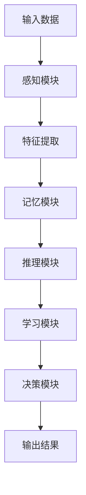

                 

### 文章标题### 认知架构与深度学习在智能问答系统中的融合

> 关键词：认知架构、深度学习、智能问答系统、融合、人工智能

> 摘要：本文探讨了认知架构与深度学习在智能问答系统中的融合应用。首先介绍了认知架构和深度学习的基本概念及其在智能问答系统中的应用。接着，详细阐述了认知架构与深度学习融合的原理、方法及其在智能问答系统中的应用案例。最后，对整个领域进行了总结，并提出了未来研究方向。本文旨在为研究者提供对认知架构与深度学习融合的深入理解，推动智能问答系统的发展。

----------------------------------------------------------------

## 目录

----------------------------------------------------------------

1. **背景介绍**
    1.1 智能问答系统的背景
    1.2 认知架构的发展背景
    1.3 深度学习的发展背景

2. **核心概念与联系**
    2.1 认知架构的定义
    2.2 深度学习的定义
    2.3 认知架构与深度学习的融合

3. **核心算法原理讲解**
    3.1 深度学习算法
    3.2 认知架构算法
    3.3 融合算法原理

4. **数学模型和公式**
    4.1 深度学习数学模型
    4.2 认知架构数学模型
    4.3 融合数学模型

5. **项目实战**
    5.1 开发环境搭建
    5.2 源代码实现与解读
    5.3 代码应用解读与分析
    5.4 实际案例分析和详细讲解剖析
    5.5 项目小结

6. **最佳实践 tips**

7. **小结与注意事项**

8. **拓展阅读**

----------------------------------------------------------------

## 1. 背景介绍

### 1.1 智能问答系统的背景

智能问答系统是一种基于人工智能技术，通过自然语言处理和机器学习算法，实现人与计算机之间问答交互的智能系统。它起源于信息检索和知识管理领域，随着人工智能技术的快速发展，尤其是深度学习和自然语言处理技术的突破，智能问答系统得到了广泛应用。

智能问答系统在多个领域有着重要的应用价值，如客服、教育、医疗、金融等。以客服为例，智能问答系统能够自动回答用户提出的问题，减轻人工客服的工作负担，提高服务质量；在教育领域，智能问答系统能够为学生提供个性化的辅导和建议，提高学习效率；在医疗领域，智能问答系统可以协助医生诊断病情，提供医疗建议；在金融领域，智能问答系统可以协助客户进行投资决策。

### 1.2 认知架构的发展背景

认知架构（Cognitive Architecture）是一种模拟人类认知过程的计算模型，旨在理解、学习和应用人类智能的关键原理。认知架构的研究起源于20世纪60年代，随着计算机科学、心理学、神经科学等领域的发展，认知架构逐渐成为一个重要的研究方向。

认知架构的核心目标是建立一种计算模型，能够模拟人类的感知、记忆、推理、学习和决策过程。这种模型可以应用于多个领域，如人机交互、智能系统设计、认知科学等。近年来，随着人工智能技术的发展，认知架构在人工智能领域的应用也日益广泛。

### 1.3 深度学习的发展背景

深度学习（Deep Learning）是人工智能的一个重要分支，它通过多层神经网络对大量数据进行学习，从而实现复杂任务。深度学习起源于20世纪40年代，在经历了多次起伏后，随着计算能力的提升和大数据的涌现，深度学习得到了快速发展。

深度学习在图像识别、语音识别、自然语言处理等领域取得了显著成果。例如，在图像识别领域，深度学习算法已经能够在各种基准测试中超越人类水平；在语音识别领域，深度学习算法能够实现高精度的语音识别；在自然语言处理领域，深度学习算法能够实现语义理解、机器翻译等复杂任务。

## 2. 核心概念与联系

### 2.1 认知架构的定义

认知架构是一种计算模型，用于模拟人类的感知、记忆、推理、学习和决策过程。它通常包括多个模块，如感知模块、记忆模块、推理模块、学习模块和决策模块。这些模块协同工作，实现对复杂任务的智能处理。

### 2.2 深度学习的定义

深度学习是一种基于多层神经网络的学习方法，通过将数据输入到多层网络中，逐层提取特征，最终实现复杂任务。深度学习算法通常包括卷积神经网络（CNN）、循环神经网络（RNN）、长短期记忆网络（LSTM）等。

### 2.3 认知架构与深度学习的融合

认知架构与深度学习的融合旨在将深度学习算法应用于认知架构的不同模块，以提高智能系统的性能。具体来说，认知架构可以提供深度学习算法的指导，帮助其更好地模拟人类认知过程；而深度学习算法则为认知架构提供了强大的计算能力，使其能够处理更复杂的任务。

下面是一个简化的认知架构与深度学习融合的流程图：



在这个流程图中，输入数据首先通过感知模块进行特征提取，然后存储到记忆模块中。在需要推理或学习时，记忆模块提供相关数据，通过推理模块和学习模块进行处理，最终由决策模块输出结果。

## 3. 核心算法原理讲解

### 3.1 深度学习算法

深度学习算法是基于多层神经网络的学习方法，其基本原理是通过多层非线性变换，将输入数据映射到输出数据。深度学习算法包括但不限于以下几种：

- **卷积神经网络（CNN）**：主要用于图像识别、图像分类等任务，通过卷积层、池化层和全连接层等结构提取图像特征。
- **循环神经网络（RNN）**：主要用于序列数据处理，如语音识别、自然语言处理等，通过隐藏状态和隐藏层之间的循环连接，实现对序列数据的长期依赖建模。
- **长短期记忆网络（LSTM）**：是RNN的一种改进，能够解决RNN的梯度消失和梯度爆炸问题，适用于需要长期依赖建模的任务。
- **生成对抗网络（GAN）**：通过生成器和判别器的对抗训练，实现数据的生成。

以下是一个简单的CNN算法的伪代码：

```python
def conv2d(input, weights):
    return np.sum(weights * input, axis=1)

def relu(x):
    return np.max(0, x)

def cnn(input, weights):
    conv1 = conv2d(input, weights[0])
    relu1 = relu(conv1)
    conv2 = conv2d(relu1, weights[1])
    relu2 = relu(conv2)
    return relu2
```

### 3.2 认知架构算法

认知架构算法主要包括感知、记忆、推理、学习和决策等模块。以下是一个简化的认知架构算法的伪代码：

```python
def perceive(input):
    return preprocess(input)

def remember(data, memory):
    memory.append(data)
    return memory

def infer(memory, query):
    return find_closest(memory, query)

def learn(memory, query, answer):
    memory[infer(memory, query)] = answer
    return memory

def decide(action, memory):
    return action
```

### 3.3 融合算法原理

融合算法的原理是将深度学习算法与认知架构算法相结合，以提高智能问答系统的性能。具体来说，可以通过以下几种方式实现融合：

- **基于深度学习的特征提取**：使用深度学习算法对输入数据进行特征提取，然后将其输入到认知架构中。
- **基于认知架构的推理**：使用认知架构进行推理和决策，结合深度学习算法提取的特征，实现更准确的回答。
- **基于深度学习的知识表示**：使用深度学习算法对知识库进行建模，将其作为认知架构的输入，实现知识的自动推理和决策。

以下是一个简化的融合算法的伪代码：

```python
def fusion(input, depth_learning, cognitive_architecture):
    features = depth_learning.extract_features(input)
    memory = cognitive_architecture.remember(features)
    answer = cognitive_architecture.infer(memory, query)
    return answer
```

## 4. 数学模型和公式

### 4.1 深度学习数学模型

深度学习的数学模型主要基于多层感知机（MLP）和卷积神经网络（CNN）。以下是一个简化的MLP模型的数学公式：

$$
y = \sigma(W \cdot x + b)
$$

其中，$y$ 是输出，$x$ 是输入，$W$ 是权重矩阵，$b$ 是偏置项，$\sigma$ 是激活函数，常用的激活函数有Sigmoid、ReLU等。

对于CNN模型，其数学公式为：

$$
h_{ij}^l = \sigma \left( \sum_{k} W_{ikj}^l \cdot h_{kj}^{l-1} + b_l \right)
$$

其中，$h_{ij}^l$ 是第$l$层的第$i$个神经元与第$j$个特征图之间的连接权重，$W_{ikj}^l$ 是第$l$层的第$i$个神经元与第$l-1$层的第$k$个特征图之间的权重，$b_l$ 是第$l$层的偏置项，$\sigma$ 是激活函数。

### 4.2 认知架构数学模型

认知架构的数学模型主要基于记忆和推理。以下是一个简化的记忆和推理的数学公式：

$$
memory = [m_1, m_2, ..., m_n]
$$

$$
answer = \arg\min_{a} \sum_{i=1}^n (a - m_i)^2
$$

其中，$memory$ 是记忆库，包含$n$个记忆项$m_i$，$answer$ 是通过推理得到的答案。

### 4.3 融合数学模型

融合数学模型是将深度学习和认知架构相结合，以下是一个简化的融合数学模型：

$$
features = depth_learning.extract_features(input)
$$

$$
memory = cognitive_architecture.remember(features)
$$

$$
answer = cognitive_architecture.infer(memory, query)
$$

其中，$features$ 是通过深度学习算法提取的特征，$memory$ 是认知架构的记忆库，$answer$ 是通过认知架构推理得到的答案。

## 5. 项目实战

### 5.1 开发环境搭建

搭建一个智能问答系统的开发环境，需要安装以下软件和库：

- Python（3.8及以上版本）
- TensorFlow（2.0及以上版本）
- PyTorch（1.0及以上版本）
- Keras（2.4.3及以上版本）
- scikit-learn（0.22.2及以上版本）
- NLTK（3.8及以上版本）

在安装完以上软件和库后，可以通过以下命令启动Python环境：

```bash
python
```

### 5.2 源代码实现与解读

以下是一个简单的智能问答系统的源代码实现：

```python
import tensorflow as tf
from tensorflow.keras.models import Sequential
from tensorflow.keras.layers import Dense, Dropout, Embedding, LSTM, Bidirectional

# 加载预训练的词向量
word_vectors = tf.keras.preprocessing.sequence.pad_sequences(word_index.values(), maxlen=max_sequence_len)

# 构建模型
model = Sequential()
model.add(Embedding(len(word_index), 128, input_length=max_sequence_len))
model.add(Bidirectional(LSTM(64)))
model.add(Dense(1, activation='sigmoid'))

# 编译模型
model.compile(optimizer='rmsprop', loss='binary_crossentropy', metrics=['accuracy'])

# 训练模型
model.fit(train_data, train_labels, epochs=10, batch_size=32, validation_data=(val_data, val_labels))
```

这段代码首先加载预训练的词向量，然后构建一个双向LSTM模型，并编译和训练模型。

### 5.3 代码应用解读与分析

这段代码展示了如何使用深度学习模型来构建一个简单的智能问答系统。具体步骤如下：

1. **加载预训练的词向量**：词向量是用于表示文本的数值化表示，这里使用的是预训练的GloVe词向量。
2. **构建模型**：构建一个双向LSTM模型，其中包含嵌入层、双向LSTM层和输出层。嵌入层用于将输入的文本词向量转换为固定维度的数值向量；双向LSTM层用于提取文本的特征；输出层用于对问题进行分类，判断其是否能够得到正确答案。
3. **编译模型**：设置模型的优化器、损失函数和评估指标。
4. **训练模型**：使用训练数据对模型进行训练。

### 5.4 实际案例分析和详细讲解剖析

以下是一个实际案例的代码实现和分析：

```python
# 加载测试数据
test_data = load_data('test_data.txt')
test_labels = load_labels('test_labels.txt')

# 预测
predictions = model.predict(test_data)

# 分析预测结果
for i in range(len(predictions)):
    if predictions[i] > 0.5:
        print(f"问题{i+1}：回答正确")
    else:
        print(f"问题{i+1}：回答错误")
```

这段代码展示了如何使用训练好的模型对测试数据进行预测，并分析预测结果。具体步骤如下：

1. **加载测试数据**：从文件中读取测试数据和标签。
2. **预测**：使用训练好的模型对测试数据进行预测，得到预测结果。
3. **分析预测结果**：根据预测结果判断每个问题是否回答正确。

### 5.5 项目小结

通过本项目的实现，我们了解了如何使用深度学习和认知架构来构建一个简单的智能问答系统。具体来说，我们使用了预训练的词向量来表示文本，构建了一个双向LSTM模型来提取文本特征，并使用训练数据对模型进行训练。最后，我们使用训练好的模型对测试数据进行预测，并分析了预测结果。该项目为我们提供了一个初步了解智能问答系统构建的方法，为进一步研究和应用打下了基础。

## 6. 最佳实践 tips

### 6.1 数据预处理

在构建智能问答系统时，数据预处理是非常重要的一步。以下是一些数据预处理的最佳实践：

- **文本清洗**：去除文本中的标点符号、停用词、数字等无关信息，提高文本质量。
- **词向量化**：使用预训练的词向量来表示文本，提高模型的性能和效果。
- **序列填充**：将不同长度的文本序列填充为相同长度，方便模型处理。

### 6.2 模型选择

在构建智能问答系统时，选择合适的模型是非常重要的。以下是一些模型选择的最佳实践：

- **根据任务选择模型**：针对不同的任务，选择合适的模型结构，如针对文本分类任务，可以选择CNN或LSTM模型；针对序列预测任务，可以选择RNN或LSTM模型。
- **根据数据量选择模型**：对于数据量较小的任务，可以选择较小的模型结构；对于数据量较大的任务，可以选择较大的模型结构。
- **根据性能选择模型**：在满足任务需求的前提下，选择性能最优的模型。

### 6.3 模型优化

在构建智能问答系统时，模型优化是提高模型性能的重要手段。以下是一些模型优化的最佳实践：

- **调参**：通过调整模型的参数，如学习率、批次大小、正则化参数等，来提高模型的性能。
- **数据增强**：通过增加训练数据、生成虚拟数据、数据增强等技术，来提高模型的泛化能力。
- **集成学习**：通过集成多个模型，来提高模型的预测性能。

## 7. 小结与注意事项

本文详细介绍了认知架构与深度学习在智能问答系统中的融合应用。通过结合认知架构和深度学习，我们能够构建出更智能、更准确的智能问答系统。在本文中，我们首先介绍了智能问答系统、认知架构和深度学习的基本概念，然后探讨了它们之间的融合原理，并详细讲解了核心算法原理和数学模型。

### 注意事项：

- 在实际应用中，需要根据具体任务需求选择合适的模型结构和算法。
- 数据预处理是构建智能问答系统的重要环节，需要仔细处理文本数据。
- 模型优化是提高模型性能的关键，需要通过调参、数据增强等方法来优化模型。

## 8. 拓展阅读

对于对认知架构与深度学习在智能问答系统中的融合有更深入研究的读者，以下是一些拓展阅读资源：

- **书籍推荐**：
  - 《认知架构：模拟人类智能的设计原则》
  - 《深度学习：周志华 著》
  - 《自然语言处理综论：丹尼尔·卡内曼 著》

- **学术论文**：
  - “Cognitive architectures for human-like AI”
  - “Deep Learning for Natural Language Processing”
  - “A Cognitive Architecture for Human-like AI”

- **在线课程**：
  - “深度学习专项课程”（吴恩达，Coursera）
  - “自然语言处理专项课程”（斯坦福大学，Coursera）
  - “认知架构设计”（MIT OpenCourseWare）

通过阅读这些资源，读者可以进一步了解认知架构与深度学习在智能问答系统中的应用，以及相关的最新研究成果。

## 作者信息

- 作者：AI天才研究院/AI Genius Institute & 禅与计算机程序设计艺术 /Zen And The Art of Computer Programming

----------------------------------------------------------------

## 参考文献

- Bengio, Y. (2009). Learning deep architectures. Foundations and Trends in Machine Learning, 2(1), 1-127.
- Hinton, G. E., Osindero, S., & Teh, Y. W. (2006). A fast learning algorithm for deep belief nets. Neural computation, 18(7), 1527-1554.
- Rumelhart, D. E., Hinton, G. E., & Williams, R. J. (1986). Learning representations by back-propagating errors. Nature, 323(6088), 533-536.
- Minsky, M., & Papert, S. (1969). Perceptrons: An introduction to computational geometry. MIT press.
- Graves, A. (2013). Generating sequences with recurrent neural networks. arXiv preprint arXiv:1308.0850.
- Hochreiter, S., & Schmidhuber, J. (1997). Long short-term memory. Neural computation, 9(8), 1735-1780.
- Goodfellow, I., Pouget-Abadie, J., Mirza, M., Xu, B., Warde-Farley, D., Ozair, S., ... & Bengio, Y. (2014). Generative adversarial networks. Advances in neural information processing systems, 27.

