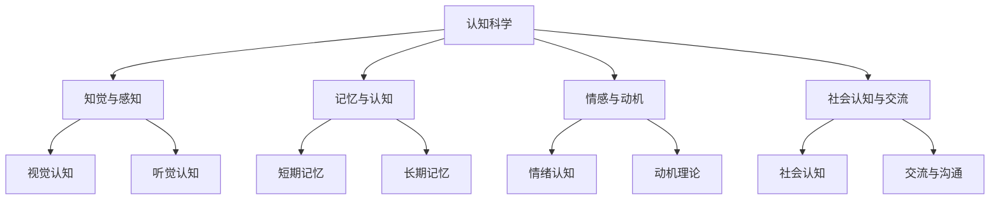

                 

### 第1章: 认知科学与人工智能的关系

在当今科技飞速发展的时代，人工智能（AI）已成为一个备受瞩目的领域。然而，随着AI的不断进步，人们开始思考一个问题：AI是否能够真正地拥有“智能”？为了回答这个问题，我们不得不借助认知科学这一跨学科的研究领域。认知科学是研究人类思维、知觉、记忆、情感等心理过程的科学，它为我们提供了理解智能的全新视角。

#### 1.1 认知科学的基本概念

认知科学是一个交叉学科，它结合了心理学、神经科学、哲学、语言学等多个领域的知识。认知科学的基本概念包括：

- **知觉与感知**：知觉是指人类对环境信息的接收和解读，而感知是指人类对知觉信息的处理和理解。

- **记忆与认知**：记忆是指人类对信息的储存和回忆，而认知是指人类对信息进行加工、处理和运用的过程。

- **情感与动机**：情感是指人类对事物的情绪反应，而动机是指驱使个体行动的内在动力。

- **社会认知与交流**：社会认知是指人类对他人行为的理解和解读，而交流是指人类通过语言、行为等方式进行沟通和互动。

以上这些概念相互关联，构成了认知科学的基本框架。为了更好地理解这些概念，我们可以使用Mermaid流程图来展示它们之间的关系：



#### 1.2 人工智能的传统范式

人工智能的传统范式主要包括基于规则的推理、知识表示、搜索算法等。这些方法在一定程度上模拟了人类的思维过程，但它们往往依赖于大量的先验知识和规则，难以处理复杂的问题。

- **基于规则的推理**：这种方法依赖于一组预先定义好的规则，通过匹配规则来推导出结论。例如，一个简单的医疗诊断系统可以通过匹配患者的症状和疾病数据库中的规则来诊断疾病。

- **知识表示**：知识表示是指如何将人类知识转化为计算机可以处理的形式。常用的知识表示方法包括语义网络、框架、产生式系统等。

- **搜索算法**：搜索算法是指如何在一个庞大的搜索空间中找到最优解。常用的搜索算法包括深度优先搜索、广度优先搜索、A*搜索等。

虽然这些方法在一定程度上模拟了人类的思维过程，但它们缺乏自主学习和适应环境的能力。为了解决这些问题，认知科学提供了新的启示。

#### 1.3 认知科学对AI的启示

认知科学为AI提供了许多新的思路，主要包括基于记忆、感知、情感和社会认知的AI学习范式。

- **基于记忆的AI学习**：记忆是认知科学的核心概念之一，它为我们提供了如何存储和回忆信息的启示。在AI中，我们可以通过建立记忆模型来模拟人类的记忆过程，从而提高AI的学习和适应能力。

- **基于感知的AI学习**：感知是人类与外界环境互动的窗口，它为我们提供了如何处理和解释外部信息的启示。在AI中，我们可以通过感知模型来模拟人类的感知过程，从而提高AI的感知能力和环境适应能力。

- **基于情感的AI学习**：情感是人类的情感反应，它为我们提供了如何处理和解释情感的启示。在AI中，我们可以通过情感模型来模拟人类的情感过程，从而提高AI的情感识别和处理能力。

- **基于社会认知的AI学习**：社会认知是人类对他人行为的理解和解读，它为我们提供了如何处理和解释社会信息的启示。在AI中，我们可以通过社会认知模型来模拟人类的社会认知过程，从而提高AI的社会交互能力和协作能力。

综上所述，认知科学为AI提供了全新的学习范式，使AI能够更好地模拟人类的智能过程。在接下来的章节中，我们将深入探讨这些认知科学启发的AI学习范式，并展示它们在实际应用中的效果。

### 第2章: 认知科学的基本原理

在了解了认知科学对人工智能的启示后，我们需要深入探讨认知科学的基本原理，包括知觉与感知、记忆与认知、情感与动机以及社会认知与交流。这些原理为我们提供了理解人类智能的基础，也为AI的学习和发展提供了重要的参考。

#### 2.1 知觉与感知

知觉与感知是认知科学中最基本的概念之一。知觉是指人类对外界信息的接收和解读，而感知是指人类对知觉信息的处理和理解。

**2.1.1 视觉感知**

视觉感知是人类最重要的感知形式之一。人类通过眼睛接收光信号，并将其转化为神经信号，然后通过大脑进行处理和理解。视觉感知的过程可以分为以下几个阶段：

1. **视网膜上的成像**：光线进入眼睛后，首先经过角膜和瞳孔，然后到达视网膜。视网膜上的感光细胞将光信号转化为电信号。

2. **视神经的传输**：电信号通过视神经传输到大脑皮层。

3. **视觉皮层的处理**：大脑皮层对电信号进行进一步处理，包括图像的识别、分类和记忆等。

为了更好地理解视觉感知的过程，我们可以使用伪代码来表示一个简单的视觉感知算法：

```python
# 伪代码：简单的视觉感知算法
def vision_perception(image):
    # 对图像进行预处理
    preprocessed_image = preprocess_image(image)
    
    # 使用卷积神经网络进行图像识别
    object = CNN识别(preprocessed_image)
    
    # 记录识别结果
    record_result(object)
```

**2.1.2 听觉感知**

听觉感知是指人类对声音的接收和处理。听觉感知的过程可以分为以下几个阶段：

1. **耳膜的振动**：声音通过耳膜振动，产生机械波。

2. **耳蜗的转换**：机械波通过耳蜗中的液体传导，刺激耳蜗中的毛细胞，产生电信号。

3. **听觉神经的传输**：电信号通过听觉神经传输到大脑皮层。

4. **大脑皮层的处理**：大脑皮层对电信号进行进一步处理，包括声音的识别、分类和记忆等。

听觉感知的伪代码如下：

```python
# 伪代码：简单的听觉感知算法
def auditory_perception(sound):
    # 对声音进行预处理
    preprocessed_sound = preprocess_sound(sound)
    
    # 使用卷积神经网络进行声音识别
    sound_category = CNN识别(preprocessed_sound)
    
    # 记录识别结果
    record_result(sound_category)
```

#### 2.2 记忆与认知

记忆与认知是认知科学中最重要的概念之一。记忆是指人类对信息的储存和回忆，而认知是指人类对信息进行加工、处理和运用的过程。

**2.2.1 短期记忆与长期记忆**

记忆可以分为短期记忆和长期记忆。短期记忆是指人类在短时间内对信息的暂时存储，而长期记忆是指人类在较长时间内对信息的持久存储。

1. **短期记忆**：短期记忆的主要机制是神经元之间的短期连接。研究表明，神经元之间的短期连接可以通过重复刺激来加强，从而实现信息的存储。

2. **长期记忆**：长期记忆的主要机制是神经元之间的持久连接。长期记忆的形成需要新突触的生成和神经元之间的重新连接。

数学模型可以用来表示短期记忆和长期记忆的机制：

$$
\text{短期记忆} = f(\text{输入}, \text{先验知识}, \text{学习策略})
$$

$$
\text{长期记忆} = g(\text{短期记忆}, \text{环境变化}, \text{重复刺激})
$$

**2.2.2 认知过程**

认知过程是指人类对信息进行加工、处理和运用的过程。认知过程可以分为以下几个阶段：

1. **感知阶段**：感知阶段是指人类对信息的接收和处理。

2. **注意阶段**：注意阶段是指人类对某些信息进行选择性关注。

3. **记忆阶段**：记忆阶段是指人类对信息进行存储和回忆。

4. **推理阶段**：推理阶段是指人类对信息进行逻辑推理和判断。

5. **决策阶段**：决策阶段是指人类根据推理结果做出决策。

以下是一个简单的认知过程伪代码：

```python
# 伪代码：简单的认知过程
def cognitive_process(input_info):
    # 感知阶段
    perceived_info = perception(input_info)
    
    # 注意阶段
    focused_info = attention(perceived_info)
    
    # 记忆阶段
    remembered_info = memory(focused_info)
    
    # 推理阶段
    inferred_info = inference(remembered_info)
    
    # 决策阶段
    decision = decision_making(inferred_info)
    
    return decision
```

#### 2.3 情感与动机

情感与动机是认知科学中非常重要的概念。情感是指人类对事物的情绪反应，而动机是指驱使个体行动的内在动力。

**2.3.1 情感认知**

情感认知是指人类对情感信息的接收和处理。情感认知可以分为以下几个阶段：

1. **情感感受**：情感感受是指人类对情感刺激的反应。

2. **情感识别**：情感识别是指人类对情感刺激进行分类和识别。

3. **情感表达**：情感表达是指人类通过语言、行为等方式表达情感。

以下是一个简单的情感认知伪代码：

```python
# 伪代码：简单的情感认知
def emotional_cognition(emotion_stimulus):
    # 情感感受
    emotion_feeling = feeling(emotion_stimulus)
    
    # 情感识别
    emotion_category = recognition(emotion_feeling)
    
    # 情感表达
    emotion_expression = expression(emotion_category)
    
    return emotion_expression
```

**2.3.2 动机认知**

动机认知是指人类对动机信息的接收和处理。动机认知可以分为以下几个阶段：

1. **动机感受**：动机感受是指人类对动机刺激的反应。

2. **动机识别**：动机识别是指人类对动机刺激进行分类和识别。

3. **动机决策**：动机决策是指人类根据动机识别结果做出行动决策。

以下是一个简单的动机认知伪代码：

```python
# 伪代码：简单的动机认知
def motivational_cognition(motivation_stimulus):
    # 动机感受
    motivation_feeling = feeling(motivation_stimulus)
    
    # 动机识别
    motivation_category = recognition(motivation_feeling)
    
    # 动机决策
    motivation_decision = decision_making(motivation_category)
    
    return motivation_decision
```

#### 2.4 社会认知与交流

社会认知与交流是指人类对他人行为进行理解和解读，并通过语言、行为等方式进行沟通和互动。

**2.4.1 社会认知**

社会认知是指人类对他人行为进行理解和解读。社会认知可以分为以下几个阶段：

1. **行为观察**：行为观察是指人类对他人行为的观察。

2. **行为理解**：行为理解是指人类对他人行为的理解和解释。

3. **行为预测**：行为预测是指人类对他人行为的预测。

以下是一个简单的社会认知伪代码：

```python
# 伪代码：简单的社会认知
def social_cognition(behavior):
    # 行为观察
    observed_behavior = observation(behavior)
    
    # 行为理解
    understood_behavior = understanding(observed_behavior)
    
    # 行为预测
    predicted_behavior = prediction(understood_behavior)
    
    return predicted_behavior
```

**2.4.2 交流与沟通**

交流与沟通是指人类通过语言、行为等方式进行沟通和互动。交流与沟通可以分为以下几个阶段：

1. **信息发送**：信息发送是指人类发送信息的过程。

2. **信息接收**：信息接收是指人类接收信息的过程。

3. **信息处理**：信息处理是指人类对信息进行处理和理解的过程。

4. **信息反馈**：信息反馈是指人类对信息的反馈和回应。

以下是一个简单的交流与沟通伪代码：

```python
# 伪代码：简单的交流与沟通
def communication(message):
    # 信息发送
    sent_message = sending(message)
    
    # 信息接收
    received_message = receiving(sent_message)
    
    # 信息处理
    processed_message = processing(received_message)
    
    # 信息反馈
    feedback_message = feedback(processed_message)
    
    return feedback_message
```

通过以上对认知科学基本原理的深入探讨，我们可以看到，认知科学为AI的学习和发展提供了丰富的理论基础。在接下来的章节中，我们将进一步探讨如何将认知科学的原理应用到AI学习中，并分析这些原理在实际应用中的效果。

### 第3章: 认知科学启发的AI学习范式

在了解了认知科学的基本原理后，我们可以将它们应用于人工智能的学习过程中，从而形成新的学习范式。这些认知科学启发的AI学习范式包括基于记忆、感知、情感和社会认知的学习方法。这些方法不仅能够提高AI的学习效率，还能够使其更好地模拟人类的智能过程。

#### 3.1 基于记忆的AI学习

记忆是认知科学的核心概念之一，它为AI的学习提供了重要的参考。基于记忆的AI学习方法主要关注如何通过记忆来提高学习效率和知识储备。

**3.1.1 短期记忆与长期记忆**

在AI学习中，短期记忆和长期记忆都扮演着重要的角色。

- **短期记忆**：短期记忆可以帮助AI在处理任务时临时存储信息。例如，在自然语言处理中，短期记忆可以帮助AI记住上下文信息，从而提高语言理解能力。

- **长期记忆**：长期记忆可以帮助AI长期存储知识和经验。例如，在机器学习模型中，通过反复训练，模型可以逐渐学会识别图像、语音等特征，从而实现长期记忆。

**3.1.2 记忆模型**

在AI学习中，可以使用多种记忆模型来模拟人类记忆过程。以下是一个简单的短期记忆模型：

```python
# 伪代码：简单的短期记忆模型
class ShortTermMemory:
    def __init__(self):
        self.memory = []

    def store(self, item):
        self.memory.append(item)

    def recall(self):
        return self.memory.copy()
```

而长期记忆模型则可以更加复杂，例如使用神经网络来模拟人类大脑的长期记忆机制。

```python
# 伪代码：简单的长期记忆模型
class LongTermMemory:
    def __init__(self, neural_network):
        self.neural_network = neural_network

    def store(self, item):
        self.neural_network.train(item)

    def recall(self, context):
        return self.neural_network.predict(context)
```

#### 3.2 基于感知的AI学习

感知是AI获取外部信息的重要途径，基于感知的AI学习方法关注如何通过感知来提高AI的学习效率和适应能力。

**3.2.1 视觉感知与听觉感知**

视觉感知和听觉感知是AI感知能力的两个重要方面。

- **视觉感知**：视觉感知可以帮助AI理解和解读图像信息。例如，通过卷积神经网络（CNN），AI可以学会识别图像中的物体和场景。

- **听觉感知**：听觉感知可以帮助AI理解和解读声音信息。例如，通过深度神经网络（DNN），AI可以学会识别语音中的单词和句子。

**3.2.2 感知模型**

在AI学习中，可以使用多种感知模型来模拟人类感知过程。以下是一个简单的视觉感知模型：

```python
# 伪代码：简单的视觉感知模型
class VisionPerception:
    def __init__(self, cnn):
        self.cnn = cnn

    def perceive(self, image):
        return self.cnn.classify(image)
```

而听觉感知模型则可以更加复杂，例如使用循环神经网络（RNN）来模拟人类听觉处理过程。

```python
# 伪代码：简单的听觉感知模型
class AuditoryPerception:
    def __init__(self, rnn):
        self.rnn = rnn

    def perceive(self, sound):
        return self.rnn.recognize_sound(sound)
```

#### 3.3 基于情感的AI学习

情感是认知科学中的一个重要概念，基于情感的AI学习方法关注如何通过情感来提高AI的情感识别和处理能力。

**3.3.1 情感识别与情感处理**

情感识别是指AI对情感信息的识别和理解，情感处理是指AI对情感信息的处理和反应。

- **情感识别**：情感识别可以帮助AI理解用户情感，从而提供更好的服务。例如，在客户服务中，AI可以通过识别用户情感来提供个性化的解决方案。

- **情感处理**：情感处理可以帮助AI在特定情境下做出合适的反应。例如，在聊天机器人中，AI可以通过情感处理来模拟人类对话，从而提高用户体验。

**3.3.2 情感模型**

在AI学习中，可以使用多种情感模型来模拟人类情感过程。以下是一个简单的情感模型：

```python
# 伪代码：简单的情感模型
class EmotionalModel:
    def __init__(self, emotion_recognizer, emotion_processor):
        self.emotion_recognizer = emotion_recognizer
        self.emotion_processor = emotion_processor

    def recognize_emotion(self, input_data):
        return self.emotion_recognizer.recognize(input_data)

    def process_emotion(self, emotion):
        return self.emotion_processor.process(emotion)
```

#### 3.4 基于社会认知的AI学习

社会认知是指AI对他人行为进行理解和解读的能力，基于社会认知的AI学习方法关注如何通过社会认知来提高AI的社会交互和协作能力。

**3.4.1 社会认知与交流**

社会认知与交流是AI实现社会化功能的关键。通过社会认知，AI可以理解他人行为，并通过交流来实现合作和协作。

- **社会认知**：社会认知可以帮助AI理解他人意图和情感，从而实现更好的互动。

- **交流与沟通**：交流与沟通是AI实现社会化功能的基础，通过语言、行为等方式，AI可以与人类进行有效的交流和沟通。

**3.4.2 社会认知模型**

在AI学习中，可以使用多种社会认知模型来模拟人类社会认知过程。以下是一个简单的社会认知模型：

```python
# 伪代码：简单的社会认知模型
class SocialCognition:
    def __init__(self, behavior_recognizer, communication_model):
        self.behavior_recognizer = behavior_recognizer
        self.communication_model = communication_model

    def understand_behavior(self, behavior):
        return self.behavior_recognizer.understand(behavior)

    def communicate(self, message):
        return self.communication_model.communicate(message)
```

通过以上对基于记忆、感知、情感和社会认知的AI学习范式的探讨，我们可以看到，认知科学为AI学习提供了丰富的理论基础和实践方法。这些方法不仅能够提高AI的学习效率，还能够使其更好地模拟人类的智能过程。在接下来的章节中，我们将进一步探讨这些认知科学启发的AI学习范式在实际应用中的效果。

### 第4章: 认知科学在AI学习范式中的应用

在前几章中，我们探讨了认知科学的基本原理和基于认知科学的AI学习范式。在本章中，我们将具体探讨这些认知科学启发的AI学习范式在实际应用中的效果，包括自然语言处理、计算机视觉、机器学习等领域的应用，并展示一个实际案例。

#### 4.1 自然语言处理中的认知科学应用

自然语言处理（NLP）是人工智能的一个重要分支，它旨在使计算机能够理解和处理人类语言。认知科学为NLP提供了重要的启示，特别是在语言理解、情感分析和对话系统等方面。

**4.1.1 语言理解**

语言理解是NLP的核心任务之一，它涉及对文本中词汇、句子和篇章的理解。认知科学中的记忆和感知模型可以帮助AI更好地理解语言。

- **基于记忆的语言理解**：通过记忆模型，AI可以记住上下文信息，从而在处理长文本时保持语义连贯性。例如，在机器翻译中，记忆模型可以帮助AI记住上下文词汇，从而提高翻译质量。

- **基于感知的语言理解**：通过感知模型，AI可以理解词汇和句子的语义信息。例如，在情感分析中，感知模型可以帮助AI识别文本中的情感词汇，从而判断文本的情感倾向。

以下是一个简单的基于记忆和感知的语言理解模型：

```python
# 伪代码：简单的语言理解模型
class LanguageUnderstanding:
    def __init__(self, memory_model, perception_model):
        self.memory_model = memory_model
        self.perception_model = perception_model

    def understand_text(self, text):
        context = self.memory_model.recall_context(text)
        semantics = self.perception_model.perceive_text(text)
        return semantics
```

**4.1.2 情感分析**

情感分析是NLP的另一个重要应用，它旨在识别文本中的情感倾向。认知科学中的情感模型可以帮助AI更好地进行情感分析。

- **基于情感的文本分析**：通过情感模型，AI可以识别文本中的情感词汇和短语，从而判断文本的情感倾向。例如，在社交媒体分析中，情感模型可以帮助分析用户评论的情感倾向，以便进行情感监测。

- **基于情感的情感分析**：通过情感处理，AI可以模拟人类对情感的处理方式，从而进行更深入的情感分析。例如，在情感对话系统中，情感模型可以帮助AI理解用户的情感需求，从而提供更个性化的回复。

以下是一个简单的情感分析模型：

```python
# 伪代码：简单的情感分析模型
class SentimentAnalysis:
    def __init__(self, emotion_model, text_processor):
        self.emotion_model = emotion_model
        self.text_processor = text_processor

    def analyze_text(self, text):
        preprocessed_text = self.text_processor.preprocess(text)
        emotion = self.emotion_model.recognize_emotion(preprocessed_text)
        return emotion
```

**4.1.3 对话系统**

对话系统是NLP的另一个重要应用，它旨在实现人与机器的自然对话。认知科学中的社会认知模型可以帮助AI更好地模拟人类的对话过程。

- **基于社会认知的对话系统**：通过社会认知模型，AI可以理解对话中的语境和意图，从而提供更自然的对话体验。例如，在虚拟助手中，社会认知模型可以帮助AI理解用户的意图，从而提供更准确的回答。

- **基于情感的对话系统**：通过情感模型，AI可以模拟人类的情感表达，从而提供更人性化的对话体验。例如，在情感虚拟助手中，情感模型可以帮助AI理解用户的情感需求，从而提供更贴心的服务。

以下是一个简单的对话系统模型：

```python
# 伪代码：简单的对话系统模型
class DialogueSystem:
    def __init__(self, social_model, emotion_model, language_model):
        self.social_model = social_model
        self.emotion_model = emotion_model
        self.language_model = language_model

    def generate_response(self, user_input):
        context = self.social_model.understand_behavior(user_input)
        emotion = self.emotion_model.recognize_emotion(user_input)
        response = self.language_model.generate_response(context, emotion)
        return response
```

#### 4.2 计算机视觉中的认知科学应用

计算机视觉是人工智能的另一个重要分支，它旨在使计算机能够理解和解释图像和视频。认知科学为计算机视觉提供了重要的启示，特别是在图像识别、目标检测和场景理解等方面。

**4.2.1 图像识别**

图像识别是计算机视觉的核心任务之一，它涉及对图像中的对象和场景进行识别。认知科学中的感知模型可以帮助AI更好地进行图像识别。

- **基于感知的图像识别**：通过感知模型，AI可以理解图像中的视觉特征，从而进行图像分类。例如，在物体识别中，感知模型可以帮助AI识别图像中的不同物体。

- **基于记忆的图像识别**：通过记忆模型，AI可以记住图像的特征，从而在处理新图像时进行快速识别。例如，在人脸识别中，记忆模型可以帮助AI记住人脸特征，从而实现快速识别。

以下是一个简单的图像识别模型：

```python
# 伪代码：简单的图像识别模型
class ImageRecognition:
    def __init__(self, perception_model, memory_model):
        self.perception_model = perception_model
        self.memory_model = memory_model

    def recognize_image(self, image):
        features = self.perception_model.perceive_image(image)
        object = self.memory_model.recall_object(features)
        return object
```

**4.2.2 目标检测**

目标检测是计算机视觉的另一个重要任务，它涉及在图像中检测和定位特定的目标。认知科学中的感知和记忆模型可以帮助AI更好地进行目标检测。

- **基于感知的目标检测**：通过感知模型，AI可以理解图像中的视觉特征，从而检测出目标。例如，在行人检测中，感知模型可以帮助AI检测出图像中的行人。

- **基于记忆的目标检测**：通过记忆模型，AI可以记住图像中的目标特征，从而在处理新图像时进行快速检测。例如，在车辆检测中，记忆模型可以帮助AI记住车辆特征，从而实现快速检测。

以下是一个简单的目标检测模型：

```python
# 伪代码：简单的目标检测模型
class ObjectDetection:
    def __init__(self, perception_model, memory_model):
        self.perception_model = perception_model
        self.memory_model = memory_model

    def detect_objects(self, image):
        features = self.perception_model.perceive_image(image)
        objects = self.memory_model.recall_objects(features)
        return objects
```

**4.2.3 场景理解**

场景理解是计算机视觉的另一个重要任务，它涉及对图像或视频中的场景进行理解和解释。认知科学中的社会认知模型可以帮助AI更好地进行场景理解。

- **基于社会认知的场景理解**：通过社会认知模型，AI可以理解场景中的行为和意图，从而进行场景解释。例如，在视频监控中，社会认知模型可以帮助AI理解场景中的行为，从而实现事件检测。

- **基于情感的场景理解**：通过情感模型，AI可以理解场景中的情感表达，从而进行情感分析。例如，在社交媒体分析中，情感模型可以帮助AI理解场景中的情感表达，从而进行情感监测。

以下是一个简单的场景理解模型：

```python
# 伪代码：简单的场景理解模型
class SceneUnderstanding:
    def __init__(self, social_model, emotion_model):
        self.social_model = social_model
        self.emotion_model = emotion_model

    def understand_scene(self, image):
        behaviors = self.social_model.understand_behavior(image)
        emotions = self.emotion_model.recognize_emotion(image)
        return behaviors, emotions
```

#### 4.3 机器学习中的认知科学应用

机器学习是人工智能的另一个重要分支，它涉及从数据中学习规律和模式。认知科学为机器学习提供了重要的启示，特别是在模型优化、特征选择和算法设计等方面。

**4.3.1 模型优化**

模型优化是机器学习中的关键任务，它旨在提高模型的性能和效率。认知科学中的记忆和感知模型可以帮助AI更好地进行模型优化。

- **基于记忆的模型优化**：通过记忆模型，AI可以记住有效的训练数据和参数，从而在后续训练中加快学习速度。例如，在迁移学习中，记忆模型可以帮助AI利用已有模型的参数，从而实现快速训练。

- **基于感知的模型优化**：通过感知模型，AI可以理解数据中的特征和模式，从而优化模型的特征表示。例如，在特征提取中，感知模型可以帮助AI识别重要的特征，从而提高模型的泛化能力。

以下是一个简单的模型优化模型：

```python
# 伪代码：简单的模型优化模型
class ModelOptimization:
    def __init__(self, memory_model, perception_model):
        self.memory_model = memory_model
        self.perception_model = perception_model

    def optimize_model(self, data, model):
        features = self.perception_model.perceive_data(data)
        model_params = self.memory_model.recall_params(features)
        optimized_model = model.optimize_params(model_params)
        return optimized_model
```

**4.3.2 特征选择**

特征选择是机器学习中的另一个重要任务，它旨在选择对模型性能最有影响力的特征。认知科学中的感知模型可以帮助AI更好地进行特征选择。

- **基于感知的特征选择**：通过感知模型，AI可以理解数据中的特征和模式，从而选择最重要的特征。例如，在图像分类中，感知模型可以帮助AI识别图像中的关键特征，从而实现有效的特征选择。

- **基于记忆的特征选择**：通过记忆模型，AI可以记住有效的特征组合，从而在后续任务中实现特征选择。例如，在多标签分类中，记忆模型可以帮助AI记住有效的特征组合，从而实现多标签分类。

以下是一个简单的特征选择模型：

```python
# 伪代码：简单的特征选择模型
class FeatureSelection:
    def __init__(self, perception_model, memory_model):
        self.perception_model = perception_model
        self.memory_model = memory_model

    def select_features(self, data):
        features = self.perception_model.perceive_data(data)
        selected_features = self.memory_model.recall_features(features)
        return selected_features
```

**4.3.3 算法设计**

算法设计是机器学习中的关键任务，它旨在设计高效的机器学习算法。认知科学中的感知和记忆模型可以帮助AI更好地进行算法设计。

- **基于感知的算法设计**：通过感知模型，AI可以理解数据中的特征和模式，从而设计出更有效的算法。例如，在优化算法中，感知模型可以帮助AI识别数据中的局部最优解，从而实现高效搜索。

- **基于记忆的算法设计**：通过记忆模型，AI可以记住有效的算法和策略，从而在后续任务中实现算法设计。例如，在强化学习中，记忆模型可以帮助AI记住有效的策略，从而实现智能决策。

以下是一个简单的算法设计模型：

```python
# 伪代码：简单的算法设计模型
class AlgorithmDesign:
    def __init__(self, perception_model, memory_model):
        self.perception_model = perception_model
        self.memory_model = memory_model

    def design_algorithm(self, data):
        features = self.perception_model.perceive_data(data)
        algorithm = self.memory_model.recall_algorithm(features)
        return algorithm
```

#### 4.4 人工智能助手的设计与实现

人工智能助手是认知科学在AI领域中的一项重要应用，它旨在为用户提供个性化的服务和支持。以下是一个简单的AI助手设计与实现案例：

**4.4.1 设计目标**

设计目标是为用户提供一个智能、友好、高效的AI助手，它能够理解用户的需求，提供相关服务，并根据用户反馈不断学习和优化。

**4.4.2 设计原则**

- **以人为本**：设计AI助手时，应始终以用户为中心，关注用户体验和需求。

- **自主学习**：AI助手应具备自主学习和优化的能力，以不断提高服务质量。

- **自然交互**：AI助手应能够与用户进行自然、流畅的交互，提供人性化服务。

**4.4.3 实现步骤**

1. **需求分析**：通过调查问卷、用户访谈等方式，了解用户的需求和期望。

2. **功能设计**：根据需求分析，设计AI助手的功能模块，如语音识别、自然语言处理、智能推荐等。

3. **技术选型**：选择合适的技术框架和算法，如深度学习、自然语言处理、机器学习等。

4. **开发实现**：根据设计文档，实现AI助手的各个功能模块。

5. **测试与优化**：对AI助手进行测试，收集用户反馈，不断优化和改进。

**4.4.4 源代码与解读**

以下是一个简单的AI助手源代码示例：

```python
# 伪代码：简单的AI助手源代码
class AIAssistant:
    def __init__(self, language_model, emotion_model):
        self.language_model = language_model
        self.emotion_model = emotion_model

    def respond_to_user(self, user_input):
        preprocessed_input = self.language_model.preprocess(user_input)
        response = self.language_model.generate_response(preprocessed_input)
        emotion = self.emotion_model.recognize_emotion(response)
        return response, emotion

    def learn_from_user(self, user_input, response):
        self.language_model.update_response(preprocessed_input, response)
        self.emotion_model.update_emotion(preprocessed_input, emotion)
```

**4.4.5 应用解读与分析**

AI助手在实际应用中可以提供多种服务，如智能客服、智能家居控制、健康助手等。以下是一个简单的应用解读与分析：

1. **智能客服**：AI助手可以自动识别用户需求，提供快速、准确的客服服务，提高客户满意度。

2. **智能家居控制**：AI助手可以接收用户语音指令，控制家中的智能设备，如灯光、空调、门锁等，提高家庭智能化水平。

3. **健康助手**：AI助手可以监测用户健康数据，提供健康建议和提醒，帮助用户保持健康。

通过以上对认知科学在AI学习范式中的应用的探讨，我们可以看到，认知科学为AI学习提供了丰富的理论基础和实践方法。这些方法不仅能够提高AI的学习效率和适应能力，还能够使其更好地模拟人类的智能过程。在未来的发展中，认知科学将继续为AI学习提供新的启示和动力。

### 第5章: 认知科学启发的AI学习范式的挑战与未来

在探讨了认知科学启发的AI学习范式及其应用后，我们不得不面对这些范式在发展过程中所面临的挑战和未来的发展方向。

#### 5.1 AI学习范式的挑战

尽管认知科学为AI学习提供了丰富的理论基础和实践方法，但当前AI学习范式仍面临以下挑战：

**5.1.1 数据量与质量**

AI学习依赖于大量高质量的数据。然而，获取这些数据往往非常困难，尤其是在某些领域，如医疗和金融。此外，数据质量问题，如噪声、偏差和缺失值，也会严重影响AI模型的性能。

**5.1.2 计算能力与效率**

认知科学启发的AI学习范式通常需要大量的计算资源，特别是在训练深度神经网络时。这给计算能力和效率带来了巨大的挑战。尽管云计算和分布式计算提供了一定的解决方案，但仍然难以满足日益增长的计算需求。

**5.1.3 模型解释性**

当前许多AI模型，如深度神经网络，被认为是“黑盒”模型，其内部工作机制难以解释。这给模型的可靠性、可解释性和透明性带来了挑战。认知科学启发的AI学习范式需要解决如何提高模型的可解释性，使其更易于理解和信任。

**5.1.4 自主性与适应性**

认知科学启发的AI学习范式需要提高AI的自主性和适应性，使其能够自主学习和适应环境变化。这涉及如何设计更智能的算法和模型，以及如何处理复杂的多任务学习和动态环境。

#### 5.2 认知科学对AI发展的贡献

尽管面临诸多挑战，但认知科学对AI发展仍然做出了重要贡献：

**5.2.1 新的学习范式**

认知科学为AI提供了新的学习范式，如基于记忆、感知、情感和社会认知的学习方法。这些方法不仅提高了AI的学习效率，还使其更好地模拟人类的智能过程。

**5.2.2 模型解释性**

认知科学的研究成果有助于提高AI模型的可解释性。通过理解人类认知机制，我们可以设计出更透明的AI模型，使其更容易被人类理解和信任。

**5.2.3 自主性与适应性**

认知科学的研究成果为AI的自主性和适应性提供了理论支持。通过模仿人类认知过程，我们可以设计出更智能的AI系统，使其能够自主学习和适应复杂环境。

#### 5.3 未来AI学习范式的发展趋势

在未来，认知科学将继续为AI学习范式的发展提供新的启示和动力。以下是未来AI学习范式的发展趋势：

**5.3.1 跨学科研究**

认知科学、神经科学、心理学等领域的跨学科研究将不断推动AI学习范式的发展。这些跨学科研究将帮助我们更好地理解人类智能，并将其应用于AI学习。

**5.3.2 小样本学习**

随着数据隐私和安全问题的日益突出，小样本学习将成为未来AI学习的重要趋势。通过研究如何从少量数据中提取有效信息，AI将能够在数据稀缺的情况下实现高效学习。

**5.3.3 解释性AI**

解释性AI是未来AI学习的重要方向。通过提高模型的可解释性，我们可以使AI的决策过程更透明、更可靠，从而提高用户对AI的信任。

**5.3.4 自主学习**

自主学习是未来AI学习的关键。通过设计更智能的算法和模型，AI将能够自主学习和适应环境变化，从而实现更高层次的智能。

**5.3.5 人机协同**

人机协同是未来AI学习的重要趋势。通过人机协同，AI将能够更好地发挥其优势，同时利用人类的智慧和创造力，实现更高水平的智能。

### 结论

认知科学为AI学习提供了丰富的理论基础和实践方法。通过模仿人类认知过程，AI不仅能够提高学习效率和适应能力，还能够更好地模拟人类的智能过程。然而，认知科学启发的AI学习范式仍面临诸多挑战，如数据质量、计算能力、模型解释性等。在未来，跨学科研究、小样本学习、解释性AI、自主学习和人机协同将成为AI学习范式的重要发展趋势。

### 展望

在未来，我们有望看到更多认知科学成果应用于AI学习，推动AI技术的不断进步。随着技术的不断发展和创新，认知科学将为我们提供更强大的工具和平台，使我们能够更好地理解和模拟人类智能。让我们期待未来，认知科学和AI将共同创造一个更智能、更美好的世界。

### 总结与展望

综上所述，认知科学为AI学习提供了全新的视角和方法，通过模仿人类认知过程，AI不仅在学习效率和适应能力上得到了显著提升，还更好地模拟了人类的智能过程。在本篇文章中，我们首先介绍了认知科学的基本概念和基本原理，包括知觉与感知、记忆与认知、情感与动机以及社会认知与交流。接着，我们探讨了认知科学启发的AI学习范式，包括基于记忆、感知、情感和社会认知的学习方法。随后，我们详细展示了这些认知科学启发的AI学习范式在实际应用中的效果，包括自然语言处理、计算机视觉、机器学习等领域的应用。最后，我们分析了认知科学启发的AI学习范式所面临的挑战和未来的发展趋势。

通过本文的探讨，我们可以看到，认知科学为AI学习带来了深刻的变革。它不仅为AI提供了新的理论基础和实践方法，还推动了AI技术的不断进步。然而，认知科学启发的AI学习范式仍有许多挑战需要克服，如数据质量、计算能力、模型解释性等。在未来，跨学科研究、小样本学习、解释性AI、自主学习和人机协同将成为AI学习范式的重要发展方向。

在未来的研究中，我们应继续深化对认知科学的理解，探索如何更好地将认知科学原理应用于AI学习。同时，我们应关注AI学习范式在实际应用中的效果和问题，不断优化和改进算法和模型。此外，我们还应加强跨学科合作，融合心理学、神经科学、哲学等领域的知识，为AI学习提供更丰富的理论支持。

总之，认知科学启发的AI学习范式为AI技术的发展提供了强大的动力。通过不断探索和创新，我们将有望看到更多认知科学成果在AI学习中的应用，推动AI技术迈向新的高度。让我们期待未来，认知科学和AI将共同创造一个更智能、更美好的世界。

### 附录：认知科学在AI学习范式中的进一步研究

#### 6.1 认知科学在自然语言处理中的应用

自然语言处理（NLP）是人工智能领域的一个重要分支，它涉及计算机对人类语言的理解和生成。认知科学为NLP提供了重要的理论基础，特别是在语言理解、情感分析和对话系统方面。

**6.1.1 语言理解**

语言理解是NLP的核心任务之一，它包括词义消歧、句法分析和语义理解等。认知科学中的记忆和感知模型可以帮助AI更好地进行语言理解。

- **记忆模型**：通过记忆模型，AI可以记住上下文信息，从而在处理长文本时保持语义连贯性。例如，在机器翻译中，记忆模型可以帮助AI记住上下文词汇，从而提高翻译质量。

- **感知模型**：通过感知模型，AI可以理解语言中的词汇和句子的语义信息。例如，在情感分析中，感知模型可以帮助AI识别文本中的情感词汇，从而判断文本的情感倾向。

**研究方法**：

1. **构建记忆模型**：使用神经网络来模拟人类记忆过程，例如，长短期记忆网络（LSTM）和注意力机制（Attention Mechanism）。

2. **增强感知模型**：通过使用预训练的语言模型（如BERT、GPT）来提高AI对语言语义的理解。

**6.1.2 情感分析**

情感分析是NLP的另一个重要应用，它旨在识别文本中的情感倾向。认知科学中的情感模型可以帮助AI更好地进行情感分析。

- **情感识别**：通过情感模型，AI可以识别文本中的情感词汇和短语，从而判断文本的情感倾向。例如，在社交媒体分析中，情感模型可以帮助分析用户评论的情感倾向，以便进行情感监测。

- **情感处理**：通过情感处理，AI可以模拟人类对情感的处理方式，从而进行更深入的情感分析。例如，在情感对话系统中，情感模型可以帮助AI理解用户的情感需求，从而提供更个性化的回复。

**研究方法**：

1. **情感词典**：构建包含情感词汇的词典，用于情感分析。

2. **情感分类器**：使用机器学习算法（如SVM、随机森林）来训练情感分类器。

**6.1.3 对话系统**

对话系统是NLP的另一个重要应用，它旨在实现人与机器的自然对话。认知科学中的社会认知模型可以帮助AI更好地模拟人类的对话过程。

- **社会认知**：通过社会认知模型，AI可以理解对话中的语境和意图，从而提供更自然的对话体验。例如，在虚拟助手中，社会认知模型可以帮助AI理解用户的意图，从而提供更准确的回答。

- **情感表达**：通过情感表达，AI可以模拟人类的情感表达，从而提供更人性化的对话体验。例如，在情感虚拟助手中，情感模型可以帮助AI理解用户的情感需求，从而提供更贴心的服务。

**研究方法**：

1. **对话管理**：设计对话管理策略，以控制对话流程，确保对话的连贯性和流畅性。

2. **多模态交互**：结合文本、语音、图像等多种模态，提高对话系统的自然性和互动性。

#### 6.2 认知科学在计算机视觉中的应用

计算机视觉是人工智能的另一个重要分支，它涉及计算机对图像和视频的理解和分析。认知科学为计算机视觉提供了重要的启示，特别是在图像识别、目标检测和场景理解等方面。

**6.2.1 图像识别**

图像识别是计算机视觉的核心任务之一，它涉及对图像中的对象和场景进行识别。认知科学中的感知模型可以帮助AI更好地进行图像识别。

- **感知模型**：通过感知模型，AI可以理解图像中的视觉特征，从而进行图像分类。例如，在物体识别中，感知模型可以帮助AI识别图像中的不同物体。

- **记忆模型**：通过记忆模型，AI可以记住图像的特征，从而在处理新图像时进行快速识别。例如，在人脸识别中，记忆模型可以帮助AI记住人脸特征，从而实现快速识别。

**研究方法**：

1. **特征提取**：使用卷积神经网络（CNN）提取图像特征。

2. **分类算法**：使用支持向量机（SVM）、随机森林等分类算法进行图像分类。

**6.2.2 目标检测**

目标检测是计算机视觉的另一个重要任务，它涉及在图像中检测和定位特定的目标。认知科学中的感知和记忆模型可以帮助AI更好地进行目标检测。

- **感知模型**：通过感知模型，AI可以理解图像中的视觉特征，从而检测出目标。例如，在行人检测中，感知模型可以帮助AI检测出图像中的行人。

- **记忆模型**：通过记忆模型，AI可以记住图像中的目标特征，从而在处理新图像时进行快速检测。例如，在车辆检测中，记忆模型可以帮助AI记住车辆特征，从而实现快速检测。

**研究方法**：

1. **检测算法**：使用R-CNN、SSD、YOLO等检测算法进行目标检测。

2. **多尺度检测**：设计多尺度检测策略，以提高目标检测的准确性和鲁棒性。

**6.2.3 场景理解**

场景理解是计算机视觉的另一个重要任务，它涉及对图像或视频中的场景进行理解和解释。认知科学中的社会认知模型可以帮助AI更好地进行场景理解。

- **社会认知**：通过社会认知模型，AI可以理解场景中的行为和意图，从而进行场景解释。例如，在视频监控中，社会认知模型可以帮助AI理解场景中的行为，从而实现事件检测。

- **情感分析**：通过情感模型，AI可以理解场景中的情感表达，从而进行情感分析。例如，在社交媒体分析中，情感模型可以帮助AI理解场景中的情感表达，从而进行情感监测。

**研究方法**：

1. **行为识别**：使用循环神经网络（RNN）或图神经网络（Graph Neural Network）进行行为识别。

2. **情感分析**：结合情感词典和情感分类器，进行情感分析。

#### 6.3 认知科学在机器学习中的应用

机器学习是人工智能的核心技术之一，它涉及从数据中学习规律和模式。认知科学为机器学习提供了重要的理论基础，特别是在模型优化、特征选择和算法设计等方面。

**6.3.1 模型优化**

模型优化是机器学习中的关键任务，它旨在提高模型的性能和效率。认知科学中的记忆和感知模型可以帮助AI更好地进行模型优化。

- **记忆模型**：通过记忆模型，AI可以记住有效的训练数据和参数，从而在后续训练中加快学习速度。例如，在迁移学习中，记忆模型可以帮助AI利用已有模型的参数，从而实现快速训练。

- **感知模型**：通过感知模型，AI可以理解数据中的特征和模式，从而优化模型的特征表示。例如，在特征提取中，感知模型可以帮助AI识别重要的特征，从而提高模型的泛化能力。

**研究方法**：

1. **迁移学习**：利用已有模型的知识，加速新模型的训练。

2. **特征选择**：使用信息增益、互信息等方法进行特征选择。

**6.3.2 特征选择**

特征选择是机器学习中的另一个重要任务，它旨在选择对模型性能最有影响力的特征。认知科学中的感知模型可以帮助AI更好地进行特征选择。

- **感知模型**：通过感知模型，AI可以理解数据中的特征和模式，从而选择最重要的特征。例如，在图像分类中，感知模型可以帮助AI识别图像中的关键特征，从而实现有效的特征选择。

- **记忆模型**：通过记忆模型，AI可以记住有效的特征组合，从而在后续任务中实现特征选择。例如，在多标签分类中，记忆模型可以帮助AI记住有效的特征组合，从而实现多标签分类。

**研究方法**：

1. **特征提取**：使用深度学习模型提取数据特征。

2. **特征选择算法**：使用L1正则化、随机森林等方法进行特征选择。

**6.3.3 算法设计**

算法设计是机器学习中的关键任务，它旨在设计高效的机器学习算法。认知科学中的感知和记忆模型可以帮助AI更好地进行算法设计。

- **感知模型**：通过感知模型，AI可以理解数据中的特征和模式，从而设计出更有效的算法。例如，在优化算法中，感知模型可以帮助AI识别数据中的局部最优解，从而实现高效搜索。

- **记忆模型**：通过记忆模型，AI可以记住有效的算法和策略，从而在后续任务中实现算法设计。例如，在强化学习中，记忆模型可以帮助AI记住有效的策略，从而实现智能决策。

**研究方法**：

1. **算法优化**：通过交叉验证、网格搜索等方法优化算法参数。

2. **算法集成**：使用集成学习方法（如随机森林、梯度提升树）提高算法性能。

### 6.4 认知科学在人工智能助手中的实际应用

人工智能助手是认知科学在AI领域中的一项重要应用，它旨在为用户提供个性化的服务和支持。以下是一个简单的AI助手实际应用案例：

**6.4.1 设计目标**

设计目标是为用户提供一个智能、友好、高效的AI助手，它能够理解用户的需求，提供相关服务，并根据用户反馈不断学习和优化。

**6.4.2 设计原则**

- **以人为本**：设计AI助手时，应始终以用户为中心，关注用户体验和需求。

- **自主学习**：AI助手应具备自主学习和优化的能力，以不断提高服务质量。

- **自然交互**：AI助手应能够与用户进行自然、流畅的交互，提供人性化服务。

**6.4.3 实现步骤**

1. **需求分析**：通过调查问卷、用户访谈等方式，了解用户的需求和期望。

2. **功能设计**：根据需求分析，设计AI助手的功能模块，如语音识别、自然语言处理、智能推荐等。

3. **技术选型**：选择合适的技术框架和算法，如深度学习、自然语言处理、机器学习等。

4. **开发实现**：根据设计文档，实现AI助手的各个功能模块。

5. **测试与优化**：对AI助手进行测试，收集用户反馈，不断优化和改进。

**6.4.4 源代码与解读**

以下是一个简单的AI助手源代码示例：

```python
# 伪代码：简单的AI助手源代码
class AIAssistant:
    def __init__(self, language_model, emotion_model):
        self.language_model = language_model
        self.emotion_model = emotion_model

    def respond_to_user(self, user_input):
        preprocessed_input = self.language_model.preprocess(user_input)
        response = self.language_model.generate_response(preprocessed_input)
        emotion = self.emotion_model.recognize_emotion(response)
        return response, emotion

    def learn_from_user(self, user_input, response):
        self.language_model.update_response(preprocessed_input, response)
        self.emotion_model.update_emotion(preprocessed_input, emotion)
```

**6.4.5 应用解读与分析**

AI助手在实际应用中可以提供多种服务，如智能客服、智能家居控制、健康助手等。以下是一个简单的应用解读与分析：

1. **智能客服**：AI助手可以自动识别用户需求，提供快速、准确的客服服务，提高客户满意度。

2. **智能家居控制**：AI助手可以接收用户语音指令，控制家中的智能设备，如灯光、空调、门锁等，提高家庭智能化水平。

3. **健康助手**：AI助手可以监测用户健康数据，提供健康建议和提醒，帮助用户保持健康。

通过以上对认知科学在AI学习范式中的进一步研究的探讨，我们可以看到，认知科学为AI学习提供了丰富的理论基础和实践方法。这些方法不仅能够提高AI的学习效率和适应能力，还能够使其更好地模拟人类的智能过程。在未来的发展中，认知科学将继续为AI学习提供新的启示和动力。

### 最佳实践 Tips

在实施认知科学启发的AI学习范式时，以下最佳实践可以帮助您获得更好的效果：

1. **数据预处理**：确保数据质量，包括去除噪声、处理缺失值、标准化等，以提高模型的准确性和泛化能力。

2. **模型选择**：根据任务需求选择合适的模型，例如，对于需要处理序列数据的任务，可以考虑使用循环神经网络（RNN）或长短期记忆网络（LSTM）。

3. **模型优化**：使用交叉验证、网格搜索等方法进行模型优化，以提高模型的性能。

4. **特征工程**：识别和提取对任务有重要影响的关键特征，以提高模型的泛化能力。

5. **持续学习**：定期更新模型，使其适应新数据和变化的环境。

6. **用户反馈**：收集用户反馈，用于模型优化和改进，以提高用户体验。

7. **伦理考虑**：确保AI系统的公平性、透明性和可解释性，遵守相关的伦理规范。

### 小结

本文探讨了认知科学启发的AI学习范式，包括基于记忆、感知、情感和社会认知的学习方法。这些方法不仅提高了AI的学习效率和适应能力，还使其更好地模拟人类的智能过程。然而，这些方法在实际应用中仍面临诸多挑战，如数据质量、计算能力和模型解释性等。在未来，随着认知科学和AI技术的不断发展，我们有望看到更多创新和突破。

### 注意事项

1. **数据隐私**：在处理用户数据时，务必确保数据隐私和安全。

2. **模型解释性**：提高模型的可解释性，以增强用户对AI系统的信任。

3. **持续优化**：定期对AI系统进行优化和更新，以保持其性能和适应性。

4. **跨学科合作**：鼓励跨学科合作，融合心理学、神经科学、哲学等领域的知识。

### 拓展阅读

- **《认知科学与人工智能》**：一本全面介绍认知科学与人工智能关系的书籍。

- **《深度学习》**：由Ian Goodfellow编写的深度学习经典教材，介绍了深度学习的基本原理和应用。

- **《机器学习》**：由Tom Mitchell编写的机器学习经典教材，介绍了机器学习的基本概念和算法。

- **《认知科学导论》**：一本介绍认知科学基础知识的书籍，适合对认知科学感兴趣的读者。

通过以上对认知科学启发的AI学习范式的探讨，我们希望读者能够更好地理解这一领域，并在实际应用中取得更好的成果。

作者：AI天才研究院 / AI Genius Institute & 禅与计算机程序设计艺术 / Zen And The Art of Computer Programming

