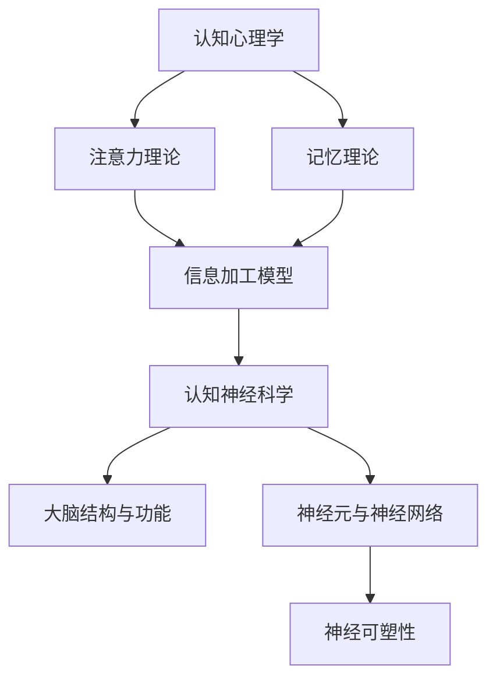
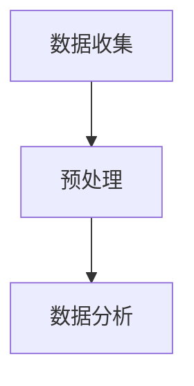
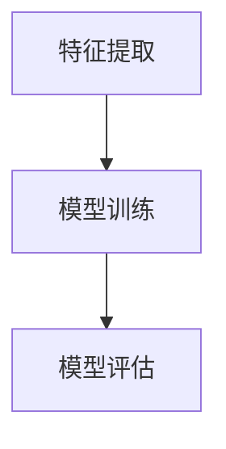
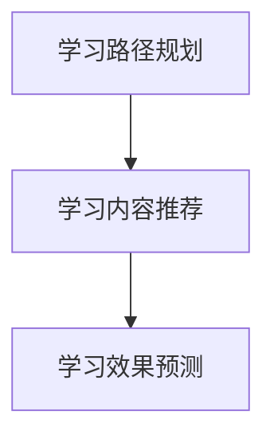
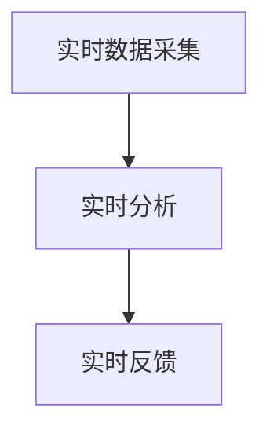

                 

### 文章标题：认知科学启发的AI驱动个性化学习体验设计

#### 关键词：认知科学、AI、个性化学习、学习体验设计、教育技术

#### 摘要：
本文旨在探讨认知科学在AI驱动个性化学习体验设计中的重要作用。通过分析认知科学的核心概念和原理，以及AI技术的应用场景和方法论，本文将深入探讨如何利用认知科学的理论指导AI在个性化学习体验设计中的实际应用，提高学习效率和效果。同时，本文将通过具体案例和实践，阐述认知科学和AI技术在教育领域的融合与发展前景。

### 第1章：引言：认知科学与个性化学习体验设计

#### 1.1 认知科学的概述

##### 1.1.1 认知科学的基本概念
认知科学是研究人类思维、感知、学习和记忆等认知过程的科学。它融合了心理学、神经科学、计算机科学和哲学等多个学科，旨在理解和解释人类认知的本质。

- **定义**：认知科学可以定义为研究认知过程的科学，包括思维、感知、学习、记忆和决策等方面。
- **研究对象**：认知科学的研究对象包括人类的认知活动、认知系统和认知能力。
- **认知科学与心理学、神经科学的关系**：认知科学起源于心理学，但与神经科学有着密切的联系。神经科学为认知科学提供了大脑结构和功能的基础知识，而认知科学则通过实验和理论模型研究认知过程。

##### 1.1.2 认知科学的发展历程
认知科学的发展可以追溯到20世纪50年代，其发展历程可以分为几个阶段：

- **传统认知科学的形成**：在20世纪50年代和60年代，认知科学的概念开始形成，主要依赖于心理学的研究成果。
- **认知科学的研究热点和趋势**：近年来，随着人工智能和计算技术的发展，认知科学的研究重点逐渐转向计算模型和脑成像技术，探索认知过程的神经基础。

##### 1.1.3 认知科学的核心理论
认知科学的核心理论包括认知心理学理论、认知神经科学理论和跨学科交叉理论：

- **认知心理学理论**：认知心理学通过实验研究人类认知过程的各个方面，包括注意力、记忆、感知和问题解决等。
- **认知神经科学理论**：认知神经科学研究认知功能与大脑结构和功能之间的关系，利用脑成像技术揭示认知过程的神经基础。
- **认知科学与其他学科的交叉**：认知科学与其他学科的交叉研究，如计算机科学、哲学和语言学等，推动了认知科学的多元化发展。

#### 1.2 个性化学习体验设计的核心概念

##### 1.2.1 个性化学习的定义
个性化学习是指根据学生的个体差异，采用不同的教学策略和学习资源，为学生提供最适合其学习风格和需求的学习环境。

- **个性化学习的含义**：个性化学习强调学生的个体差异，尊重每个学生的独特性，提供差异化的教育服务。
- **个性化学习的特征**：个性化学习具有灵活性、适应性、互动性和自主性的特征，能够满足不同学生的学习需求。

##### 1.2.2 个性化学习体验设计的目标
个性化学习体验设计的核心目标是提高学习效率、增强学习动机和促进知识内化：

- **提升学习效率**：通过个性化学习，学生能够以适合自己的方式学习，提高学习效率。
- **增强学习动机**：个性化学习能够激发学生的学习兴趣和动力，提高学习的主动性和积极性。
- **促进知识内化**：个性化学习帮助学生在实际情境中应用知识，促进知识的内化和迁移。

##### 1.2.3 个性化学习体验设计的关键要素
个性化学习体验设计的关键要素包括学习内容、学习过程和学习反馈的个性化：

- **学习内容的个性化**：根据学生的兴趣、能力和知识背景，提供个性化的学习内容。
- **学习过程的个性化**：通过个性化的学习策略和方法，满足不同学生的学习需求。
- **学习反馈的个性化**：提供个性化的学习反馈，帮助学生了解学习效果，调整学习策略。

#### 1.3 认知科学对AI驱动个性化学习体验设计的影响

##### 1.3.1 认知科学对个性化学习体验设计的方法论影响
认知科学为个性化学习体验设计提供了方法论指导：

- **基于认知科学的学习分析方法**：通过认知科学的研究方法，分析学生的学习过程和认知特点，为个性化学习体验设计提供依据。
- **基于认知科学的个性化学习策略**：根据认知科学的理论，设计适应学生认知特点的个性化学习策略，提高学习效果。

##### 1.3.2 AI技术在个性化学习体验设计中的应用
AI技术为个性化学习体验设计提供了强大的支持：

- **人工智能与学习过程监测**：利用AI技术，收集和分析学生的学习行为数据，监测学习过程，为个性化学习提供依据。
- **人工智能与学习内容推荐**：通过AI算法，为学习者推荐适合其学习风格和需求的学习内容。
- **人工智能与学习行为预测**：利用AI技术，预测学习者的学习行为和效果，为个性化学习提供指导。

##### 1.3.3 认知科学启发的AI驱动的个性化学习体验设计案例
通过具体案例，展示认知科学启发的AI驱动的个性化学习体验设计：

- **案例一：智能学习助手的设计与实现**：利用认知科学和AI技术，开发智能学习助手，为学习者提供个性化的学习支持和指导。
- **案例二：个性化学习路径规划与推荐**：基于认知科学的理论，设计个性化学习路径规划系统，为学习者推荐最优的学习路径。

#### 1.4 总结与展望
##### 1.4.1 总结
认知科学为AI驱动个性化学习体验设计提供了理论基础和方法指导，AI技术则为个性化学习体验设计提供了技术支持。两者结合，有望推动个性化学习体验设计的发展。

##### 1.4.2 展望
未来，认知科学和AI技术的融合将进一步深化，为个性化学习体验设计带来更多创新和发展。例如，利用脑机接口技术，实现更精确的学习过程监测和学习效果评估；利用大数据分析，提供更加个性化和精准的学习推荐。

---

### 第2章：认知科学的核心概念与原理

#### 2.1 认知心理学的基本理论

##### 2.1.1 认知心理学的历史背景
认知心理学起源于20世纪中叶，是对传统心理学的革新。它强调对内部心理过程的研究，特别是对认知过程的关注。

- **认知心理学的起源**：认知心理学起源于对传统心理学的反思和批判，试图通过科学的方法研究人类的认知过程。
- **认知心理学的发展历程**：认知心理学经历了从信息加工模型到认知模拟的演变，不断发展和完善。

##### 2.1.2 认知心理学的核心理论
认知心理学的核心理论包括认知模型理论、注意力理论和记忆理论。

- **认知模型理论**：认知模型理论试图通过计算机模拟的方式，理解人类的信息加工过程，如感知、注意、记忆和决策等。
- **注意力理论**：注意力理论关注人类如何分配有限的认知资源，以处理不同类型的信息。
- **记忆理论**：记忆理论研究人类如何存储、检索和遗忘信息，包括短期记忆和长期记忆的研究。

##### 2.1.3 认知心理学的主要研究方法
认知心理学采用了多种研究方法，以探索认知过程。

- **实验法**：实验法是认知心理学最常用的研究方法，通过控制变量，观察被试的行为反应，来推断认知过程。
- **行为观察法**：行为观察法通过直接观察被试的行为，来推断认知过程。
- **计算模型法**：计算模型法利用计算机模拟，构建认知过程的数学模型，以验证和预测认知现象。

#### 2.2 认知神经科学的基础知识

##### 2.2.1 认知神经科学的定义
认知神经科学是研究大脑如何产生认知过程的科学，它是认知科学与神经科学的交叉领域。

- **认知神经科学的含义**：认知神经科学通过理解大脑的结构和功能，来解释认知过程。
- **认知神经科学与认知心理学的关系**：认知神经科学为认知心理学提供了大脑的基础知识，而认知心理学则为认知神经科学提供了理论框架。

##### 2.2.2 认知神经科学的研究领域
认知神经科学的研究领域广泛，包括大脑结构与功能、神经元与神经网络、神经可塑性等。

- **大脑结构与功能**：研究大脑的不同区域如何协同工作，产生认知功能。
- **神经元与神经网络**：研究神经元如何通过神经网络进行信息传递和处理。
- **神经可塑性**：研究大脑如何通过经验和学习改变其结构和功能。

##### 2.2.3 认知神经科学的研究方法
认知神经科学采用了多种研究方法，包括功能磁共振成像（fMRI）、电生理记录和神经心理学测试。

- **功能磁共振成像（fMRI）**：通过测量大脑活动区域的血氧水平，来推断大脑的功能活动。
- **电生理记录**：通过记录大脑神经元的电活动，来研究神经元的信号传递和处理。
- **神经心理学测试**：通过设计特定的心理测试，来评估个体的认知功能。

#### 2.3 认知科学对学习过程的启示

##### 2.3.1 学习过程的认知模型
认知科学为学习过程提供了多种认知模型，包括信息加工模型、交互式模型和多元智能理论。

- **信息加工模型**：信息加工模型将学习过程视为信息输入、处理和输出的过程。
- **交互式模型**：交互式模型强调学习过程中的主动性和互动性，认为学习是一个动态的交互过程。
- **多元智能理论**：多元智能理论认为，人们具有不同的智能类型，学习应该根据个体的智能特点进行。

##### 2.3.2 学习策略与认知科学的关系
认知科学的研究成果为学习策略的设计提供了理论依据。

- **精细加工策略**：精细加工策略通过将新信息与已有知识建立联系，提高记忆效果。
- **组织策略**：组织策略通过将学习内容进行结构化处理，帮助学习者更好地理解和记忆。
- **复述策略**：复述策略通过重复学习内容，加强记忆效果。

##### 2.3.3 认知科学在个性化学习中的应用
认知科学为个性化学习提供了理论基础和指导。

- **基于认知科学的个性化学习方案设计**：通过分析学习者的认知特点，设计适应其认知需求的学习方案。
- **基于认知科学的学习效果评估**：通过认知科学的测量工具，评估学习者的学习效果和认知发展。

#### 2.4 认知科学的核心概念联系与流程图

##### 2.4.1 认知科学的核心概念联系
认知科学的各个核心概念之间存在紧密的联系，共同构成了对认知过程的理解。

- **认知心理学与认知神经科学的交叉**：认知心理学提供了对认知过程的描述和解释，而认知神经科学则通过脑成像和神经生理学方法，验证和探究这些认知过程的神经基础。
- **认知科学与人工智能的融合**：认知科学与人工智能的融合，旨在通过计算模型和算法，模拟和优化人类的认知过程。

##### 2.4.2 认知科学核心概念流程图
使用Mermaid流程图，可以直观地展示认知科学的核心概念联系：

该流程图展示了认知心理学、注意力理论、记忆理论、信息加工模型、认知神经科学、大脑结构与功能、神经元与神经网络和神经可塑性等核心概念之间的联系，以及它们在认知科学中的地位和作用。

---

### 第3章：AI在个性化学习体验设计中的应用

#### 3.1 AI技术概述

##### 3.1.1 AI的基本概念
人工智能（Artificial Intelligence，简称AI）是指通过计算机程序模拟人类的认知功能，实现智能行为的科学技术。AI具有自主思考、学习和适应的能力，能够处理复杂的任务。

- **人工智能的定义**：人工智能是指通过计算机程序模拟人类的智能行为，包括感知、思考、学习、推理和决策等。
- **人工智能的分类**：人工智能可以分为弱AI和强AI。弱AI指在特定领域具有智能行为，而强AI则具有全面的人类智能。

##### 3.1.2 AI技术的发展历程
人工智能的发展经历了多个阶段，从最初的简单模拟到现代复杂的多领域应用。

- **人工智能的黄金时代**：在20世纪50年代到70年代，人工智能得到了快速发展，出现了许多重要的理论和算法。
- **人工智能的衰退期**：在70年代到80年代，由于技术限制，人工智能的研究陷入低潮。
- **人工智能的复兴**：在90年代以来，随着计算能力和算法的进步，人工智能迎来了新的发展机遇。

##### 3.1.3 AI技术的核心组成部分
人工智能的核心组成部分包括机器学习、深度学习和自然语言处理。

- **机器学习**：机器学习是AI的一个重要分支，通过训练模型，使计算机能够从数据中学习规律，进行预测和决策。
- **深度学习**：深度学习是机器学习的一个子领域，通过多层神经网络，对大量数据进行自动特征提取和分类。
- **自然语言处理**：自然语言处理是AI的一个分支，旨在使计算机理解和处理自然语言，实现人机交互。

#### 3.2 AI在个性化学习中的应用场景

##### 3.2.1 AI与学习过程监测
AI技术在个性化学习中，可以通过收集和分析学习行为数据，监测学习过程。

- **学习行为数据的收集与分析**：利用传感器、学习平台和日志记录等手段，收集学生的学习行为数据，如学习时间、学习内容、学习方式等，通过数据分析，了解学生的学习习惯和需求。
- **学习习惯的识别与建模**：通过分析学习行为数据，利用机器学习和深度学习算法，识别学生的学习习惯，建立学习习惯模型，为个性化学习提供依据。
- **学习效果的实时评估**：利用自然语言处理和深度学习技术，实时分析学生的学习反馈和作业表现，评估学习效果，为学习过程的调整提供支持。

##### 3.2.2 AI与学习内容推荐
AI技术在个性化学习中，可以通过推荐系统，为学习者推荐适合其学习风格和需求的学习内容。

- **基于内容的推荐**：基于内容的推荐通过分析学习内容的特点，将相似的内容推荐给学习者。
- **基于协同过滤的推荐**：基于协同过滤的推荐通过分析学习者的行为和偏好，为学习者推荐可能感兴趣的学习内容。
- **基于深度学习的推荐**：基于深度学习的推荐利用深度学习算法，自动提取学习内容的特征，为学习者推荐个性化的学习内容。

##### 3.2.3 AI与学习行为预测
AI技术在个性化学习中，可以通过预测学习行为，为学习者提供个性化的学习建议。

- **学习路径的预测**：通过分析学习行为数据和学习内容，利用机器学习和深度学习算法，预测学习者的学习路径，为其推荐最优的学习顺序。
- **学习效果的预测**：通过分析学习行为数据和学习效果，利用自然语言处理和深度学习算法，预测学习者的学习效果，为学习过程的调整提供依据。
- **学习动机的预测**：通过分析学习行为数据和学习者的情绪状态，利用机器学习和深度学习算法，预测学习者的学习动机，为激发学习兴趣提供支持。

#### 3.3 AI驱动个性化学习体验设计的方法论

##### 3.3.1 数据驱动的个性化学习
数据驱动的个性化学习是AI技术在个性化学习中的重要应用。

- **数据采集与处理**：通过传感器、学习平台和日志记录等手段，采集学习行为数据，并对数据进行预处理，去除噪声和冗余。
- **数据分析与建模**：利用机器学习和深度学习算法，对学习行为数据进行分析，建立学习行为模型，为个性化学习提供依据。
- **数据驱动的个性化学习策略**：根据学习行为模型，设计适应学生认知特点和需求的学习策略，提高学习效果。

##### 3.3.2 模式识别与个性化学习
模式识别是AI技术的重要应用，用于识别学习者的个体差异和认知模式。

- **个体差异的识别**：通过分析学习行为数据，利用机器学习和深度学习算法，识别学习者的个体差异，为个性化学习提供依据。
- **学习模式的识别**：通过分析学习行为数据，利用自然语言处理和深度学习算法，识别学习者的学习模式，为个性化学习提供支持。
- **个性化学习方案的生成**：根据个体差异和学习模式，利用机器学习和深度学习算法，生成适应学习者特点的个性化学习方案。

##### 3.3.3 人工智能与教育学的融合
人工智能与教育学的融合，为个性化学习体验设计提供了新的思路。

- **教育理论的计算机化**：通过将教育学理论转化为计算机算法，实现个性化学习的设计和实施。
- **教育数据的可视化**：通过数据可视化技术，将学习行为数据和学习效果以图形化的方式呈现，帮助教育者和学习者理解学习过程。
- **教育人**：利用人工智能技术，实现教育过程的智能化，提高教育质量和效率。

---

### 第4章：认知科学在个性化学习体验设计中的应用

#### 4.1 认知科学与个性化学习体验设计的理论基础

##### 4.1.1 认知科学的理论基础
认知科学为个性化学习体验设计提供了理论基础，主要包括认知心理学和认知神经科学的理论。

- **认知心理学的理论**：认知心理学通过研究人类的感知、记忆、思维和语言等认知过程，揭示了个体在信息处理和学习中的认知机制，为个性化学习体验设计提供了理论基础。
- **认知神经科学的理论**：认知神经科学通过研究大脑的结构和功能，揭示了认知过程与大脑活动之间的关系，为个性化学习体验设计提供了生物基础。

##### 4.1.2 个性化学习体验设计的理论框架
个性化学习体验设计的理论框架包括学习目标、学习内容、学习过程和学习评价等方面。

- **学习目标**：根据学习者的个体差异和需求，设定具体、可操作的学习目标。
- **学习内容**：根据学习目标和学习者的认知特点，设计符合学习者需求和认知水平的个性化学习内容。
- **学习过程**：通过多样化的学习方法和策略，激发学习者的学习兴趣和动机，促进学习效果的提升。
- **学习评价**：通过科学、系统的评价方法，评估学习者的学习效果，为学习过程的调整提供依据。

##### 4.1.3 认知科学与个性化学习体验设计的关系
认知科学与个性化学习体验设计之间存在密切的关系：

- **认知科学为个性化学习体验设计提供理论基础**：通过认知科学的研究成果，理解学习者的认知特点和学习需求，为个性化学习体验设计提供科学依据。
- **个性化学习体验设计为认知科学提供实践应用**：个性化学习体验设计将认知科学的理论应用于实际教育情境中，验证和丰富认知科学的理论。

#### 4.2 认知科学在个性化学习体验设计中的应用

##### 4.2.1 基于认知科学的个性化学习方案设计
基于认知科学的个性化学习方案设计，旨在通过分析学习者的认知特点，为学习者提供符合其认知水平和需求的学习方案。

- **分析学习者的认知特点**：通过认知心理学的理论，分析学习者的感知能力、记忆能力、思维能力等认知特点，为个性化学习方案设计提供依据。
- **设计适应学习者特点的学习方案**：根据学习者的认知特点，设计符合其需求的学习内容、学习方法和学习评价，以提高学习效果。

##### 4.2.2 基于认知科学的个性化学习过程监测
基于认知科学的个性化学习过程监测，旨在通过监测学习者的学习过程，了解其学习状态和需求，为个性化学习提供实时支持。

- **学习过程数据采集**：通过学习平台、传感器和日志记录等手段，采集学习者的学习行为数据，如学习时间、学习内容、学习方式等。
- **学习过程数据解析**：利用认知神经科学的理论，对学习过程数据进行解析，识别学习者的学习状态和需求。
- **个性化学习支持**：根据学习过程数据解析结果，提供个性化的学习支持，如调整学习内容、学习方法和学习评价。

##### 4.2.3 基于认知科学的个性化学习效果评估
基于认知科学的个性化学习效果评估，旨在通过科学、系统的评估方法，评估学习者的学习效果，为个性化学习提供依据。

- **学习效果评估指标**：根据认知科学的理论，设定学习效果评估指标，如知识掌握程度、学习能力提升、学习动机等。
- **学习效果评估方法**：通过实验法、观察法、自我评估等方法，对学习者的学习效果进行评估。
- **个性化学习调整**：根据学习效果评估结果，调整个性化学习方案，提高学习效果。

#### 4.3 认知科学在个性化学习体验设计中的实际应用

##### 4.3.1 认知神经科学在个性化学习中的应用
认知神经科学在个性化学习体验设计中的应用，主要包括脑成像技术、神经生理学和神经可塑性研究。

- **脑成像技术**：利用脑成像技术，如功能磁共振成像（fMRI）和脑电图（EEG），监测学习者的学习状态和认知活动，为个性化学习提供支持。
- **神经生理学**：研究学习者的神经生理学机制，如神经元活动、神经递质释放等，了解学习者的认知特点和需求。
- **神经可塑性**：通过神经可塑性的研究，了解学习者的学习能力和学习效果，为个性化学习提供依据。

##### 4.3.2 认知心理学在个性化学习中的应用
认知心理学在个性化学习体验设计中的应用，主要包括学习策略、记忆方法和思维技巧的研究。

- **学习策略**：通过研究学习策略的有效性，为学习者提供适应其认知特点的学习策略，提高学习效果。
- **记忆方法**：通过研究记忆方法的有效性，为学习者提供适应其认知特点的记忆方法，提高记忆效果。
- **思维技巧**：通过研究思维技巧的有效性，为学习者提供适应其认知特点的思维技巧，提高思维能力。

##### 4.3.3 认知科学在其他领域个性化学习中的应用
认知科学在个性化学习体验设计中的应用不仅限于传统的教育领域，还包括在线教育、远程教育、游戏化学习等。

- **在线教育**：通过认知科学的理论和方法，设计适应在线学习特点的个性化学习方案，提高在线教育的效果。
- **远程教育**：通过认知科学的理论和方法，设计适应远程学习特点的个性化学习方案，提高远程教育的效果。
- **游戏化学习**：通过认知科学的理论和方法，设计适应游戏化学习特点的个性化学习方案，提高游戏化学习的效果。

#### 4.4 认知科学在个性化学习体验设计中的未来发展趋势

##### 4.4.1 脑机接口技术在个性化学习中的应用
脑机接口技术（Brain-Computer Interface，简称BCI）是将人的大脑信号直接转换为计算机指令的技术。未来，脑机接口技术有望在个性化学习体验设计中发挥重要作用。

- **脑机接口技术在个性化学习中的应用**：通过脑机接口技术，实时监测学习者的脑电活动，了解其学习状态和需求，为个性化学习提供支持。
- **脑机接口技术的挑战与前景**：脑机接口技术面临技术挑战，如信号处理的准确性、设备的舒适性和可靠性等，但其潜在的应用前景广阔。

##### 4.4.2 大数据技术在个性化学习中的应用
大数据技术（Big Data）在个性化学习体验设计中的应用，主要包括数据的收集、存储、分析和应用。

- **大数据技术在个性化学习中的应用**：通过大数据技术，收集学习者的学习行为数据，分析其学习习惯、需求和效果，为个性化学习提供支持。
- **大数据技术的挑战与前景**：大数据技术面临数据隐私、数据质量和数据分析准确性的挑战，但其为个性化学习带来的变革性影响不可忽视。

##### 4.4.3 人工智能与认知科学的深度融合
未来，人工智能与认知科学的深度融合将推动个性化学习体验设计的进一步发展。

- **人工智能与认知科学的深度融合**：通过人工智能算法，分析学习者的认知数据，为个性化学习提供智能化支持。
- **个性化学习体验设计的创新**：借助人工智能和认知科学的融合，创新个性化学习体验设计，提高学习效果和满意度。

---

### 第5章：AI驱动的个性化学习体验设计实践

#### 5.1 实践背景与目的

##### 5.1.1 实践背景
在当今社会，随着教育技术的飞速发展，个性化学习体验设计越来越受到关注。然而，传统的教育模式往往难以满足学生的个性化需求，导致学习效果不佳。因此，如何利用人工智能（AI）技术，实现更高质量的个性化学习体验设计，成为教育领域的一个重要课题。

##### 5.1.2 实践目的
本章节旨在通过实际案例，展示AI驱动的个性化学习体验设计在现实中的应用。具体目标包括：

- **展示AI技术在个性化学习体验设计中的应用**：通过实际案例，展示AI技术在学习过程监测、学习内容推荐和学习效果预测等方面的应用。
- **分析AI驱动的个性化学习体验设计的优势与挑战**：通过对实际案例的分析，探讨AI驱动的个性化学习体验设计的优势以及面临的挑战。
- **提出未来发展的建议**：针对现有问题和挑战，提出改进措施和发展建议，为AI驱动的个性化学习体验设计提供参考。

#### 5.2 案例介绍：AI驱动的个性化学习平台

##### 5.2.1 案例背景
本案例介绍的是一个基于AI技术的个性化学习平台，旨在为学生提供个性化的学习体验。该平台利用机器学习和深度学习算法，分析学生的学习行为和需求，为学生推荐适合的学习内容和路径。

##### 5.2.2 案例目标
该案例的主要目标是：

- **提高学习效率**：通过个性化推荐，让学生更快地找到适合自己的学习资源，提高学习效率。
- **增强学习动机**：通过学习过程的实时监测和反馈，激发学生的学习兴趣和动机。
- **促进知识内化**：通过个性化学习路径的设计，帮助学生更好地理解和掌握知识，促进知识的内化。

#### 5.3 实践过程

##### 5.3.1 数据收集与预处理
首先，通过传感器、学习平台和日志记录等手段，收集学生的学习行为数据，包括学习时间、学习内容、学习方式、学习效果等。然后，对数据进行预处理，去除噪声和冗余，确保数据的质量。

##### 5.3.2 数据分析与建模
利用机器学习和深度学习算法，对学习行为数据进行分析，建立学习行为模型。具体步骤如下：

1. **特征提取**：从学习行为数据中提取关键特征，如学习时长、学习频率、学习内容等。
2. **模型训练**：利用训练数据，训练机器学习模型，如决策树、支持向量机等。
3. **模型评估**：通过测试数据，评估模型的效果，调整模型参数，提高模型的准确性。

##### 5.3.3 个性化学习方案生成
根据学习行为模型，生成个性化的学习方案。具体步骤如下：

1. **学习路径规划**：根据学习者的学习特点，规划最优的学习路径。
2. **学习内容推荐**：根据学习者的兴趣和学习进度，推荐适合的学习内容。
3. **学习效果预测**：预测学习者的学习效果，为学习过程的调整提供依据。

##### 5.3.4 实时监测与反馈
通过实时监测学习者的学习行为和效果，提供个性化的反馈和支持。具体步骤如下：

1. **实时数据采集**：持续收集学习者的学习行为数据，如学习时长、学习频率等。
2. **实时分析**：利用实时数据分析算法，分析学习者的学习状态和需求。
3. **实时反馈**：根据分析结果，提供个性化的学习建议和反馈。

#### 5.4 案例分析

##### 5.4.1 优势分析
本案例展示了AI驱动的个性化学习体验设计的优势：

- **高效性**：通过个性化推荐和学习路径规划，学生可以更快地找到适合自己的学习资源，提高学习效率。
- **互动性**：通过实时监测和反馈，学生可以及时了解自己的学习状态和效果，获得个性化的支持。
- **适应性**：随着学习过程的进行，AI系统可以不断调整学习方案，以适应学生的变化。

##### 5.4.2 挑战分析
然而，AI驱动的个性化学习体验设计也面临一些挑战：

- **数据隐私**：收集和处理大量学习行为数据，可能引发数据隐私问题。
- **算法公平性**：算法的设计和训练过程可能存在不公平性，导致个性化推荐和评估的偏差。
- **系统稳定性**：AI系统需要持续运行，确保系统的稳定性和可靠性。

#### 5.5 未来展望

##### 5.5.1 技术发展趋势
随着人工智能和认知科学的不断发展，AI驱动的个性化学习体验设计有望实现以下发展趋势：

- **智能化**：通过更先进的人工智能算法，实现更精准的个性化推荐和学习路径规划。
- **融合化**：将AI技术与教育心理学、神经科学等学科深度融合，提供更加科学的个性化学习体验。
- **普及化**：随着技术的普及和应用，AI驱动的个性化学习体验设计将越来越普及，为更多的学习者提供支持。

##### 5.5.2 发展建议
为推动AI驱动的个性化学习体验设计的发展，提出以下建议：

- **加强技术研究和开发**：持续研究和开发先进的人工智能和认知科学技术，提高个性化学习体验的设计和实现能力。
- **关注数据隐私和安全**：在收集和处理学习行为数据时，注重数据隐私和保护，确保学生的个人信息安全。
- **提升教育者和学生的认知**：通过培训和教育，提高教育者和学生的认知水平，使他们更好地理解和利用AI驱动的个性化学习体验设计。
- **开展多学科合作**：鼓励跨学科合作，整合人工智能、教育心理学、神经科学等领域的资源，共同推动个性化学习体验设计的发展。

---

### 第6章：认知科学启发的AI驱动的个性化学习体验设计的未来发展趋势

#### 6.1 人工智能与认知科学的深度融合
随着人工智能（AI）和认知科学的不断发展，两者的深度融合将成为个性化学习体验设计的关键方向。

- **AI算法与认知模型的结合**：通过将认知科学的模型与AI算法相结合，可以实现更精准、更个性化的学习体验。
- **神经计算与脑机接口**：利用神经计算和脑机接口技术，可以实时监测和学习者的认知状态，为个性化学习提供更深入的指导。

#### 6.2 大数据和云计算的广泛应用
大数据和云计算技术的进步，为个性化学习体验设计提供了强大的支持。

- **大数据分析**：通过收集和分析大量的学习行为数据，可以更准确地了解学习者的学习特点和需求。
- **云计算平台**：利用云计算平台，可以快速搭建和部署个性化的学习系统，提高学习体验的灵活性和可扩展性。

#### 6.3 教育技术与虚拟现实（VR）的结合
虚拟现实（VR）技术为个性化学习体验设计带来了新的机遇。

- **沉浸式学习体验**：通过VR技术，学生可以进入虚拟的学习环境，获得更加生动、直观的学习体验。
- **个性化学习资源**：利用VR技术，可以创建个性化的学习资源，如虚拟实验、虚拟场景等，提高学习的互动性和参与度。

#### 6.4 人工智能伦理与隐私保护
在推动AI驱动的个性化学习体验设计的同时，伦理和隐私保护也是不可忽视的问题。

- **伦理规范**：制定人工智能伦理规范，确保AI技术在教育领域的应用符合伦理要求。
- **隐私保护**：加强数据隐私保护，确保学习者的个人信息安全。

#### 6.5 跨学科合作与创新
跨学科合作将推动个性化学习体验设计的持续创新。

- **多学科融合**：通过整合人工智能、认知科学、教育学、心理学等多学科资源，共同推动个性化学习体验设计的发展。
- **创新实践**：鼓励创新实践，探索新的教育模式和教学方法，为个性化学习体验设计提供新的思路和方向。

#### 6.6 未来展望
未来，认知科学启发的AI驱动的个性化学习体验设计将朝着更加智能化、个性化、互动化和安全化的方向发展。

- **智能化**：通过更先进的人工智能算法和认知模型，实现更加智能化和精准化的个性化学习体验。
- **个性化**：充分利用大数据和云计算技术，提供更加个性化的学习资源和学习路径。
- **互动化**：通过虚拟现实和增强现实技术，创造更加生动、互动的学习体验。
- **安全化**：加强伦理和隐私保护，确保个性化学习体验设计的安全性和合规性。

---

### 第7章：总结与展望

#### 7.1 主要观点回顾
本文通过详细探讨认知科学和AI技术对个性化学习体验设计的启示，总结出以下主要观点：

- **认知科学的理论基础**：认知科学提供了个性化学习体验设计的理论基础，包括认知心理学、认知神经科学等核心概念。
- **AI技术的应用**：AI技术，特别是机器学习和深度学习，为个性化学习体验设计提供了强大的支持，包括学习过程监测、学习内容推荐和学习行为预测等。
- **数据驱动的个性化学习**：利用大数据分析，可以实现个性化学习方案的设计和实施，提高学习效率和质量。
- **认知科学和AI技术的融合**：认知科学与AI技术的深度融合，将推动个性化学习体验设计的进一步发展，为教育领域带来革命性变化。

#### 7.2 研究的局限性和未来方向
尽管本文探讨了认知科学启发的AI驱动的个性化学习体验设计的诸多优势和应用，但仍存在一些局限性和挑战：

- **数据隐私和伦理问题**：随着数据收集和分析的深入，数据隐私和伦理问题日益凸显，需要在实践中加强保护。
- **算法公平性**：AI算法的设计和训练可能存在不公平性，需要确保个性化推荐和学习评估的公正性。
- **技术普及和应用**：AI和认知科学技术的普及和应用仍面临挑战，需要进一步推动技术的研究和推广。

未来研究方向包括：

- **技术整合与创新**：继续探索认知科学和AI技术的深度融合，创新个性化学习体验设计的理论和实践。
- **跨学科合作**：鼓励多学科合作，整合人工智能、认知科学、教育学等领域的资源，共同推动个性化学习体验设计的发展。
- **实践应用研究**：通过实际案例和实践，验证和优化认知科学启发的AI驱动的个性化学习体验设计，提高其效果和应用价值。

#### 7.3 结论
本文系统地探讨了认知科学启发的AI驱动的个性化学习体验设计，强调了其在教育领域的潜力。通过认知科学的理论指导，结合AI技术的应用，个性化学习体验设计有望实现更加智能化、个性化和互动化的学习环境，为学习者提供更好的学习体验和效果。未来，随着技术的不断进步和多学科合作的深化，认知科学启发的AI驱动的个性化学习体验设计将不断取得新的突破和进展。作者：AI天才研究院/AI Genius Institute & 禅与计算机程序设计艺术 /Zen And The Art of Computer Programming

