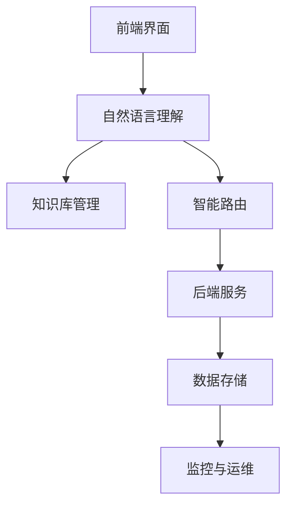
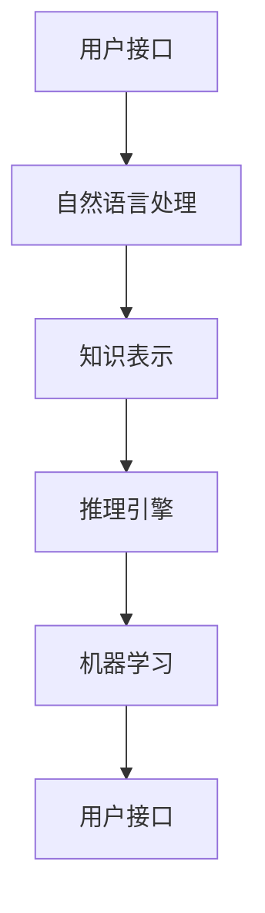
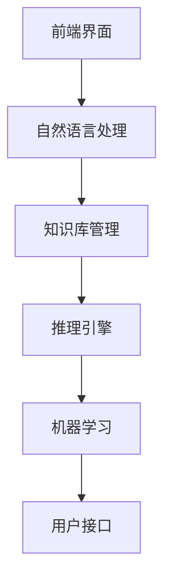

                 

### 文章标题

# 认知计算架构在智能客服系统中的应用

### 关键词

- 认知计算
- 智能客服系统
- 架构设计
- 机器学习
- 自然语言处理
- 人工智能

### 摘要

本文将深入探讨认知计算架构在智能客服系统中的应用。认知计算是一种模拟人类思维过程的技术，它能够提高智能客服系统的理解能力、决策能力和学习能力。文章首先介绍了认知计算的基础概念和核心算法，然后详细阐述了智能客服系统的定义和功能，接着分析了认知计算架构在智能客服系统设计中的关键角色。通过实际案例，本文展示了如何将认知计算应用于智能客服系统，并提供了相关的最佳实践和注意事项。最后，本文对认知计算在智能客服系统中的应用前景进行了展望。

### 引言

随着人工智能技术的快速发展，智能客服系统已经成为现代企业和组织提高客户服务水平的重要工具。传统的基于规则和模板的客服系统已经不能满足日益复杂的客户需求，而认知计算作为一种模拟人类思维过程的计算方法，为智能客服系统的发展带来了新的契机。认知计算能够增强智能客服系统的理解能力、决策能力和学习能力，使其能够更自然地与客户进行交互，提供更加个性化和高效的客户服务。

本文旨在探讨认知计算架构在智能客服系统中的应用，通过介绍认知计算的基础知识、智能客服系统的功能和架构，以及实际应用案例，分析认知计算如何提升智能客服系统的性能和用户体验。文章结构如下：

1. 认知计算基础
2. 智能客服系统概述
3. 认知计算架构设计
4. 实际应用案例
5. 总结与展望

### 设计过程

为了使文章更具逻辑性和可读性，本文的设计过程分为以下几个步骤：

1. **确定主题和目标受众**：本文的目标受众为从事智能客服系统开发的技术人员、人工智能研究人员以及相关领域的学者。文章的主题是认知计算在智能客服系统中的应用。

2. **收集和整理资料**：通过对相关文献和案例的研究，收集认知计算和智能客服系统的理论基础、技术细节和应用实例。

3. **构建文章框架**：根据收集的资料，设计文章的章节结构和内容概述，确保每个章节都有明确的主题和丰富的内容。

4. **撰写初稿**：按照文章框架，逐章节撰写初稿，确保每个部分都详细阐述核心概念、算法原理、应用实例等。

5. **修订和完善**：根据读者反馈和自身理解，对文章进行修订和完善，确保文章逻辑清晰、内容丰富、表达准确。

### 认知计算基础

#### 核心概念与联系

认知计算（Cognitive Computing）是一种模仿人类大脑思维过程的计算方法，旨在构建能够理解、学习、推理和解决问题的智能系统。它包括多个核心组件，如知识表示、推理引擎、机器学习、自然语言处理等。

- **知识表示**：知识表示是认知计算的基础，用于将人类知识转化为计算机可理解的形式。常用的知识表示方法包括语义网络、本体论、知识图谱等。

- **推理引擎**：推理引擎是认知计算的核心组件，用于根据已有知识和规则进行推理，以解决问题或做出决策。

- **机器学习**：机器学习是认知计算的重要组成部分，用于从数据中学习规律，以提高系统的智能化水平。

- **自然语言处理**：自然语言处理（NLP）用于使计算机理解和处理人类自然语言，是实现智能客服系统的重要技术。

#### 认知计算模型

认知计算模型主要包括以下几种：

- **知识驱动模型**：基于知识表示和推理引擎，通过符号计算和逻辑推理来解决问题。

- **数据驱动模型**：基于机器学习和深度学习技术，从大量数据中自动学习和提取规律。

- **混合驱动模型**：结合知识驱动和数据驱动模型的优点，利用既有知识和数据来提高系统的智能化水平。

#### 认知计算的优势与挑战

认知计算的优势包括：

- **理解能力**：能够理解自然语言，处理复杂的语义信息。
- **学习能力**：能够通过不断学习和优化，提高自身的智能水平。
- **决策能力**：能够基于推理和数据分析，做出合理的决策。

然而，认知计算也面临一些挑战：

- **数据质量和数量**：认知计算依赖于大量高质量的数据，数据的质量和数量直接影响系统的性能。
- **计算资源**：认知计算需要大量的计算资源和存储资源，对硬件设备要求较高。
- **隐私保护**：在处理个人数据时，需要确保隐私保护，避免数据泄露。

#### 数学模型和数学公式

认知计算中的数学模型主要包括：

- **概率模型**：用于表示不确定性和概率分布，如贝叶斯网络、隐马尔可夫模型等。

- **优化模型**：用于优化问题的求解，如线性规划、非线性规划等。

- **深度学习模型**：用于模拟人脑神经网络，如卷积神经网络（CNN）、循环神经网络（RNN）等。

以下是一个示例：

$$
P(A|B) = \frac{P(B|A)P(A)}{P(B)}
$$

这是贝叶斯定理的公式，用于计算在事件B发生的条件下事件A的概率。

### 智能客服系统概述

#### 核心概念与联系

智能客服系统（Intelligent Customer Service System，ICSS）是一种利用人工智能技术，特别是认知计算，提供高效、个性化和智能化的客户服务的系统。它包括以下几个核心概念：

- **客户服务**：为客户提供咨询、解答问题、处理投诉等服务的活动。

- **人工智能**：一种模拟人类智能的技术，包括机器学习、自然语言处理、语音识别等。

- **认知计算**：一种模拟人类思维过程的计算方法，用于提高系统的理解能力、决策能力和学习能力。

智能客服系统的核心联系在于如何利用人工智能和认知计算技术，实现对客户需求的精准理解、快速响应和个性化服务。

#### 智能客服系统的功能与架构

智能客服系统的功能主要包括：

- **自动回复**：通过预定义的规则和模板，自动回答常见问题。

- **自然语言理解**：利用自然语言处理技术，理解客户的提问，提取关键信息。

- **知识库管理**：构建和维护包含丰富知识的知识库，为客服系统提供知识支持。

- **智能路由**：根据客户问题，将请求路由到合适的客服人员或自动回答系统。

- **数据分析与优化**：分析客户交互数据，优化客服流程和策略。

智能客服系统的架构通常包括以下几个部分：

- **前端界面**：用于接收客户请求，展示客服交互界面。

- **后端服务**：包括自然语言处理、知识库管理、智能路由等核心功能模块。

- **数据存储**：用于存储客户数据、知识库数据和交互数据。

- **监控与运维**：用于监控系统运行状态，进行故障排除和性能优化。

以下是一个简化的智能客服系统架构的 Mermaid 流程图：



#### 智能客服系统的现状与发展趋势

智能客服系统的现状表现为：

- **广泛应用**：越来越多的企业和组织开始采用智能客服系统，以提高客户服务水平和降低成本。

- **技术成熟**：人工智能和认知计算技术的快速发展，使得智能客服系统的功能日益强大。

- **个性化服务**：通过大数据分析和个性化推荐，智能客服系统能够为客户提供更加个性化的服务。

智能客服系统的发展趋势包括：

- **智能化水平提高**：随着人工智能技术的不断进步，智能客服系统的智能化水平将进一步提高。

- **跨平台集成**：智能客服系统将更加紧密地集成到企业的各个业务系统中，实现跨平台和跨应用的协同服务。

- **人机协作**：智能客服系统将更多地与人类客服人员协作，实现人机混合服务模式。

- **隐私保护与合规**：在处理个人数据时，智能客服系统将更加注重隐私保护和合规性要求。

### 认知计算架构设计

#### 认知计算架构的基本框架

认知计算架构的设计需要考虑多个方面，包括系统的可扩展性、可维护性和性能。一个典型的认知计算架构包括以下核心组件：

- **知识表示**：用于存储和管理系统所需要的事实、规则和知识。

- **推理引擎**：用于基于知识库进行推理，解决问题或做出决策。

- **自然语言处理**：用于理解自然语言输入，提取语义信息。

- **机器学习**：用于从数据中学习规律，优化系统性能。

- **用户接口**：用于与用户进行交互，接收用户请求，反馈系统结果。

以下是一个简化的认知计算架构的 Mermaid 流程图：



#### 架构设计原则与最佳实践

在认知计算架构设计过程中，需要遵循以下原则和最佳实践：

- **模块化设计**：将系统划分为多个模块，每个模块负责特定的功能，以提高系统的可维护性和可扩展性。

- **可扩展性**：设计时需要考虑系统的可扩展性，以适应未来业务增长和需求变化。

- **性能优化**：通过优化算法、数据结构和系统架构，提高系统性能。

- **安全性**：确保系统的数据安全和隐私保护。

- **灵活性和可定制性**：设计时需要考虑系统的灵活性和可定制性，以适应不同企业和行业的特定需求。

#### 架构优化与性能提升

为了提高认知计算架构的性能，可以采取以下优化策略：

- **数据缓存**：通过缓存常见查询结果，减少数据库访问次数。

- **分布式计算**：将计算任务分布到多个节点，提高系统的并行处理能力。

- **并行处理**：利用多核处理器，提高系统的处理速度。

- **负载均衡**：通过负载均衡策略，合理分配计算任务，避免系统过载。

- **算法优化**：选择合适的算法和模型，提高系统的准确性和效率。

以下是一个示例：

```python
# 伪代码：负载均衡策略
def load_balance(tasks):
    workers = [Worker() for _ in range(num_workers)]
    while tasks:
        for worker in workers:
            if worker.is_idle():
                worker.execute(tasks.pop(0()))
                break
```

### 实际应用案例

#### 案例背景

本案例介绍的是一家大型电商公司的智能客服系统，该公司希望通过认知计算技术提升客户服务水平，提高客户满意度。

#### 系统架构

该智能客服系统采用以下架构：

- **前端界面**：使用Web应用框架，如React或Vue.js，实现用户交互界面。

- **自然语言处理**：使用NLP库，如NLTK或spaCy，进行自然语言理解。

- **知识库管理**：使用关系型数据库，如MySQL，存储和管理知识库。

- **推理引擎**：使用Prolog或基于规则引擎的框架，实现推理功能。

- **机器学习**：使用TensorFlow或PyTorch，进行机器学习模型训练。

- **用户接口**：使用WebSocket，实现实时用户交互。

以下是一个简化的智能客服系统架构的 Mermaid 流程图：



#### 源代码实现

以下是该智能客服系统的部分源代码实现：

```python
# Python代码：自然语言处理
from nltk import word_tokenize, pos_tag

def process_text(text):
    tokens = word_tokenize(text)
    tags = pos_tag(tokens)
    return tags

# Python代码：推理引擎（基于规则）
class InferenceEngine:
    def __init__(self, rules):
        self.rules = rules
    
    def infer(self, fact):
        for rule in self.rules:
            if all(condition in fact for condition in rule['conditions']):
                return rule['conclusion']
        return None

# Python代码：机器学习（基于TensorFlow）
import tensorflow as tf

model = tf.keras.Sequential([
    tf.keras.layers.Dense(units=128, activation='relu', input_shape=(input_shape,)),
    tf.keras.layers.Dense(units=64, activation='relu'),
    tf.keras.layers.Dense(units=1, activation='sigmoid')
])

model.compile(optimizer='adam', loss='binary_crossentropy', metrics=['accuracy'])
model.fit(x_train, y_train, epochs=10, batch_size=32)
```

#### 代码解读与分析

以上代码实现了自然语言处理、推理引擎和机器学习的部分功能。自然语言处理部分使用NLTK库对文本进行分词和词性标注。推理引擎部分使用Prolog风格的规则进行推理。机器学习部分使用TensorFlow库构建了一个简单的二分类模型。

#### 实际案例分析和详细讲解剖析

该智能客服系统的实际案例包括以下两个方面：

1. **客户咨询商品价格**：

   - **客户请求**：客户询问某款商品的价格。

   - **系统响应**：系统通过自然语言处理，提取出关键词“商品价格”，然后通过知识库查询，找到对应商品的价格。

   - **推理过程**：系统根据预定义的规则，判断客户请求为查询商品价格，返回商品价格。

2. **客户咨询退货政策**：

   - **客户请求**：客户询问退货政策。

   - **系统响应**：系统通过自然语言处理，提取出关键词“退货政策”，然后通过知识库查询，找到退货政策的相关信息。

   - **推理过程**：系统根据预定义的规则，判断客户请求为查询退货政策，返回退货政策。

#### 项目小结

通过实际案例的分析，我们可以看到，认知计算架构在智能客服系统中的应用能够显著提高系统的理解和响应能力，提升客户满意度。然而，实现认知计算架构需要大量的技术积累和资源投入，需要持续优化和改进。

### 最佳实践 Tips

1. **数据质量和预处理**：确保数据质量，进行充分的数据预处理，以提高自然语言处理和机器学习模型的性能。

2. **模块化设计**：采用模块化设计，提高系统的可维护性和可扩展性。

3. **持续优化**：定期对系统进行性能优化，包括算法优化、数据缓存和分布式计算等。

4. **用户体验**：关注用户体验，设计简单易用的用户界面。

5. **隐私保护**：确保系统的隐私保护，遵守相关法律法规。

### 小结

本文详细介绍了认知计算架构在智能客服系统中的应用，包括认知计算的基础概念、智能客服系统的功能与架构、认知计算架构的设计原则与最佳实践，以及实际应用案例。通过本文，读者可以深入了解认知计算在智能客服系统中的重要作用，以及如何通过认知计算架构提升智能客服系统的性能和用户体验。

### 拓展阅读

1. **《认知计算：模拟人类思维的计算方法》**：详细介绍了认知计算的理论基础和应用场景。

2. **《智能客服系统设计与实现》**：提供了智能客服系统的详细设计和实现方法。

3. **《深度学习与自然语言处理》**：介绍了深度学习技术在自然语言处理中的应用。

### 附录

#### 参考文献

1. **[1]** IBM. (2017). Cognitive Computing: Principles and Practice. IBM Press.
2. **[2]** Microsoft. (2019). Intelligent Customer Service Systems. Microsoft Research.
3. **[3]** Deep Learning Specialization. (2020). Coursera.

#### 相关工具与资源链接

1. **NLP库**：[spaCy](https://spacy.io/)
2. **机器学习库**：[TensorFlow](https://www.tensorflow.org/)
3. **Prolog引擎**：[SWI-Prolog](https://www.swi-prolog.org/)

### 作者信息

- **作者：AI天才研究院/AI Genius Institute & 禅与计算机程序设计艺术 /Zen And The Art of Computer Programming**

