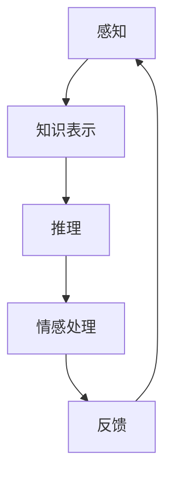
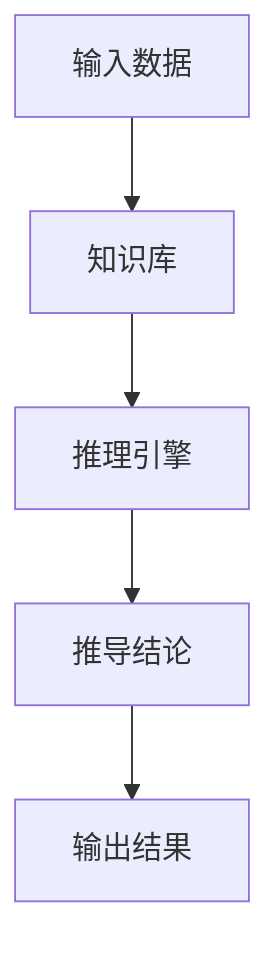
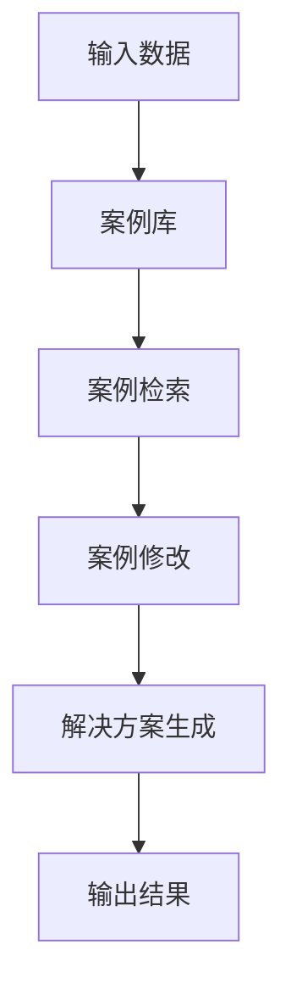
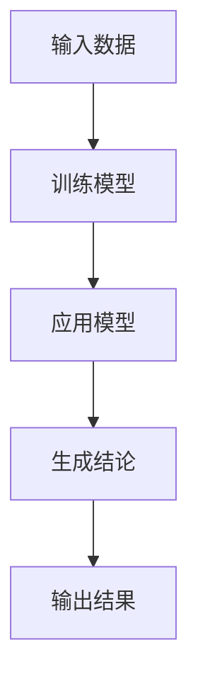

                 

### 引言与背景知识

认知计算模型（Cognitive Computing Model）是人工智能（AI）领域中的一种重要研究方向，旨在模拟人类的认知过程，实现智能推理、学习、决策等功能。认知计算模型的出现，源于对人类智能的深入研究和对AI应用的更高需求。传统的人工智能系统，如基于规则的专家系统和基于统计学的机器学习方法，虽然在特定领域取得了显著的成就，但它们往往缺乏对人类智能的全面理解和模拟能力。

认知计算模型的发展历程可以追溯到20世纪50年代，当时计算机科学家开始尝试模拟人类思维过程。从最初的逻辑推理系统，到基于神经网络和机器学习的智能系统，认知计算模型不断演进。近年来，随着深度学习和大数据技术的发展，认知计算模型的应用场景不断扩大，从简单的语音识别、图像分类，到复杂的自然语言处理、智能决策系统。

在AI的应用中，认知计算模型的重要性不言而喻。它不仅可以提高AI系统的智能水平，还能增强人机交互的自然性和高效性。例如，在医疗领域，认知计算模型可以辅助医生进行诊断和决策，提高诊断准确率和效率；在教育领域，认知计算模型可以个性化推荐学习资源和课程，帮助学生更有效地学习；在金融领域，认知计算模型可以实时分析市场数据，提供投资建议，降低风险。

然而，要构建一个能够模拟人类认知过程的AI系统，需要解决众多技术难题。首先，如何准确地模拟人类的思维过程，包括感知、记忆、推理、情感等方面，是一个巨大的挑战。其次，如何将不同领域的知识进行有效整合，构建一个智能的知识库，也是认知计算模型需要解决的重要问题。此外，如何在复杂的计算环境中保持高效性和鲁棒性，也是认知计算模型面临的挑战之一。

总之，认知计算模型作为一种模拟人类认知过程的AI系统，具有广阔的应用前景和重要的研究价值。它不仅有助于我们更好地理解人类智能的机理，还可以推动AI技术在各个领域的应用，为人类社会的发展带来巨大的变革。在接下来的章节中，我们将详细探讨认知计算模型的基本概念、发展历程、关键特性以及研究热点，帮助读者深入理解这一领域。

### 认知计算模型的基本概念

认知计算模型（Cognitive Computing Model）是指一种旨在模拟人类认知过程和智能行为的人工智能系统。其核心思想是通过计算机科学、认知科学和神经科学等多学科知识，构建能够理解和处理人类语言、感知和推理的智能系统。在理解认知计算模型之前，我们需要先了解几个与之密切相关的基本概念：认知科学、人工智能和认知心理学。

**认知科学**是一门跨学科的研究领域，旨在理解人类和其他动物的心理和认知过程。它涵盖了心理学、神经科学、哲学、语言学等多个学科，共同探讨认知现象的本质和机理。认知科学的研究成果为认知计算模型提供了理论基础，帮助我们理解人类思维、感知和记忆的运作机制。

**人工智能**（AI）是指通过计算机系统实现人类智能行为和思维过程的学科。AI技术包括机器学习、深度学习、自然语言处理、计算机视觉等多个子领域，这些技术的共同目标是开发能够自主学习和适应环境的智能系统。认知计算模型是人工智能的一个重要分支，它专注于模拟和实现人类的认知功能。

**认知心理学**是心理学的一个分支，专注于研究人的感知、记忆、思考、解决问题等认知过程。认知心理学的理论和方法为认知计算模型的设计和实现提供了重要的参考。例如，通过研究人类的记忆过程，认知计算模型可以设计出更有效的记忆和检索算法。

认知计算模型的核心目标是模拟人类的认知过程，包括感知、记忆、推理和情感等方面。具体来说，认知计算模型具备以下几个基本特性：

1. **多模态感知**：人类可以通过视觉、听觉、触觉等多种感官来感知外部世界。认知计算模型需要能够处理多种感官数据，并通过整合这些数据，实现对环境的全面理解。

2. **知识表示**：人类具有丰富的知识储备，能够快速地调用相关知识和信息进行推理和决策。认知计算模型需要能够高效地表示和存储知识，以便在需要时快速检索和应用。

3. **推理能力**：人类可以通过逻辑推理、类比推理等方式解决问题。认知计算模型需要具备类似的能力，能够基于已有的知识和信息，进行有效的推理和决策。

4. **情感计算**：人类在决策过程中会受到情感因素的影响。认知计算模型需要能够模拟情感计算，理解和处理情感信息，提高人机交互的自然性和情感化。

5. **自我学习和适应**：人类具有不断学习和适应环境的能力。认知计算模型需要能够通过自我学习和适应，提高智能水平，适应不同的应用场景。

**认知计算模型的工作原理**可以概括为以下几个步骤：

1. **感知**：通过多模态传感器获取外部环境的信息，如语音、图像、文本等。
2. **知识表示**：将感知到的信息转化为计算机可以处理的形式，并通过知识库存储和管理这些信息。
3. **推理**：利用已有的知识和信息进行推理，解决问题或做出决策。
4. **情感处理**：处理情感信息，理解和模拟人类的情感反应。
5. **反馈**：根据推理结果和反馈信息，调整系统的行为和策略，实现自我学习和适应。

认知计算模型的核心概念和联系可以用以下Mermaid流程图表示：



通过这个流程图，我们可以清晰地看到认知计算模型从感知到推理、情感处理再到反馈的完整工作过程。

总之，认知计算模型作为一种模拟人类认知过程的AI系统，涵盖了感知、知识表示、推理、情感处理和自我学习等多个方面。理解这些基本概念和原理，是深入研究和应用认知计算模型的前提。在接下来的章节中，我们将进一步探讨认知计算模型的发展历程、关键特性以及研究热点，帮助读者全面了解这一领域。

### 认知计算模型的发展历程

认知计算模型的发展历程可以追溯到20世纪50年代，当时计算机科学家和心理学家开始尝试模拟人类思维过程。这一领域的研究经历了多个阶段，从最初的逻辑推理系统，到基于神经网络和机器学习的智能系统，再到现在的多模态感知和情感计算，每个阶段都取得了重要的进展和突破。

**1. 逻辑推理阶段（1950s-1980s）**

认知计算模型的最早尝试可以追溯到20世纪50年代，当时计算机科学家开始研究如何通过逻辑推理模拟人类思维。这一阶段的代表性工作包括“逻辑理论家”（Logic Theorist）和“通用问题求解器”（General Problem Solver）。1955年，艾伦·图灵（Alan Turing）提出了“图灵测试”，试图通过机器能否模仿人类思维来判断其是否具有智能。逻辑推理阶段的主要目标是开发能够解决特定问题的智能系统，如数学证明、逻辑推理等。

**2. 神经网络阶段（1980s-1990s）**

20世纪80年代，神经网络的研究逐渐兴起，这一阶段被认为是认知计算模型发展的重要转折点。神经网络通过模拟人脑神经元之间的连接和交互，实现了对复杂模式的识别和学习。1986年，霍普菲尔德（John Hopfield）和鲁梅哈特（David E. Rumelhart）等人提出了反向传播算法（Backpropagation），极大地提高了神经网络的训练效率。这一阶段的研究表明，神经网络在模式识别、图像处理等方面具有巨大的潜力，为认知计算模型的发展奠定了基础。

**3. 机器学习阶段（1990s-2000s）**

20世纪90年代，随着计算机性能的不断提升和大数据技术的发展，机器学习方法开始广泛应用于认知计算模型。机器学习通过数据驱动的方式，使计算机能够从大量数据中自动学习和发现规律。支持向量机（Support Vector Machine, SVM）、决策树（Decision Tree）、贝叶斯网络（Bayesian Network）等经典机器学习方法在认知计算模型中得到了广泛应用。这一阶段的研究主要集中在如何通过机器学习算法提高认知计算模型的智能水平和泛化能力。

**4. 多模态感知阶段（2000s-2010s）**

进入21世纪，认知计算模型开始从单模态感知向多模态感知转变。多模态感知是指通过整合多种感官数据（如视觉、听觉、触觉等）来提高认知计算模型的感知能力和智能化水平。这一阶段的重要进展包括深度学习技术的发展，如卷积神经网络（Convolutional Neural Network, CNN）和循环神经网络（Recurrent Neural Network, RNN）。这些技术使得认知计算模型能够更好地处理和理解复杂的多模态数据，提高了其在自然语言处理、计算机视觉等领域的应用能力。

**5. 情感计算阶段（2010s-至今）**

近年来，随着人们对人机交互体验的要求不断提高，情感计算成为认知计算模型研究的重要方向。情感计算旨在通过模拟人类的情感反应，提高认知计算模型的自然性和情感化。这一阶段的研究主要集中在如何识别和处理情感信息，如语音情感识别、面部表情识别等。情感计算不仅为认知计算模型提供了新的应用场景，如智能客服、智能助手等，还为人机交互带来了新的发展机遇。

**代表性成果和里程碑事件**

1. **图灵测试（1950）**：艾伦·图灵提出了图灵测试，通过机器能否模仿人类思维来判断其是否具有智能。
2. **反向传播算法（1986）**：霍普菲尔德和鲁梅哈特提出了反向传播算法，极大地提高了神经网络的训练效率。
3. **支持向量机（1995）**：支持向量机作为一种高效的分类算法，在认知计算模型中得到广泛应用。
4. **深度学习（2006）**：深度学习技术的发展，如卷积神经网络和循环神经网络，为认知计算模型带来了新的突破。
5. **语音识别突破（2011）**：谷歌语音识别系统在语音识别挑战赛中取得优异成绩，标志着认知计算模型在语音识别领域的重大进展。

总之，认知计算模型的发展历程经历了从逻辑推理到神经网络，再到机器学习和多模态感知、情感计算等多个阶段，每个阶段都取得了重要的进展和突破。这些成果不仅为认知计算模型的理论研究提供了坚实的基础，也为其实际应用带来了巨大的变革。在未来的发展中，认知计算模型将继续融合多学科知识，不断提高智能水平和应用能力，为人类社会的进步做出更大贡献。

### 认知计算模型的关键特性

认知计算模型作为一种模拟人类认知过程的AI系统，具有以下几项关键特性。这些特性使得认知计算模型能够在复杂多变的环境中高效地执行任务，实现智能推理、学习和决策。

**1. 模拟人类认知过程**

认知计算模型的核心目标之一是模拟人类的认知过程，包括感知、记忆、推理和情感等。通过模拟这些过程，认知计算模型能够像人类一样理解和处理复杂信息。例如，在感知方面，认知计算模型可以处理多模态数据，如文本、图像、语音等，并整合这些数据来获得更全面的信息。在记忆方面，认知计算模型能够存储和管理大量知识，并在需要时快速检索和应用。在推理方面，认知计算模型可以通过逻辑推理、类比推理等方式解决问题。在情感方面，认知计算模型可以识别和理解情感信息，并模拟情感反应，提高人机交互的自然性和情感化。

**2. 自适应和自我学习能力**

认知计算模型需要具备自适应和自我学习能力，以便在动态环境中不断优化和改进。这种能力来源于机器学习和深度学习技术。通过自我学习，认知计算模型可以从大量数据中自动发现规律和模式，并不断调整自身的参数和行为。例如，在自然语言处理领域，认知计算模型可以通过大量文本数据学习语言模型，提高对文本的理解能力。在图像识别领域，认知计算模型可以通过大量图像数据学习特征提取和分类算法，提高识别准确率。通过自我学习，认知计算模型能够不断适应新的环境和任务，实现持续发展和进步。

**3. 知识表示和推理能力**

认知计算模型需要具备强大的知识表示和推理能力，以便在复杂任务中做出有效的决策和推理。知识表示是指将人类知识以计算机可以理解的形式表示出来，并存储在知识库中。认知计算模型通过知识表示能够快速访问和利用已有知识，进行推理和决策。推理能力是指认知计算模型能够利用已有的知识和信息，进行逻辑推理、类比推理等，以解决问题或做出决策。例如，在医疗诊断领域，认知计算模型可以通过知识库中的医学知识进行推理，帮助医生做出准确的诊断。在智能客服领域，认知计算模型可以通过知识库中的产品信息和客户查询进行推理，提供个性化的服务和建议。

**4. 多模态感知能力**

多模态感知能力是指认知计算模型能够处理和理解多种感官数据，如文本、图像、语音、视频等。通过多模态感知，认知计算模型能够获得更全面的信息，并提高对环境的理解和反应能力。例如，在智能驾驶领域，认知计算模型可以通过感知车辆周围的环境信息（如图像、语音、雷达等），实时监测路况，做出安全驾驶决策。在智能助手领域，认知计算模型可以通过语音和文本交互，理解用户的需求，提供个性化的服务。

**5. 情感计算能力**

情感计算能力是指认知计算模型能够识别和处理情感信息，模拟情感反应，提高人机交互的自然性和情感化。情感计算能力在智能客服、智能教育、智能医疗等领域具有广泛的应用。例如，在智能客服领域，认知计算模型可以通过语音和文本识别用户的情感状态，提供更贴心的服务。在智能教育领域，认知计算模型可以通过情感分析技术，了解学生的学习情感，调整教学策略，提高学习效果。在智能医疗领域，认知计算模型可以通过情感识别技术，分析患者的情感状态，提供心理支持，帮助患者更好地应对疾病。

综上所述，认知计算模型的关键特性包括模拟人类认知过程、自适应和自我学习能力、知识表示和推理能力、多模态感知能力和情感计算能力。这些特性使得认知计算模型能够高效地执行复杂任务，实现智能推理、学习和决策。在未来的发展中，认知计算模型将继续融合多学科知识，不断提高智能水平和应用能力，为人类社会的发展做出更大贡献。

### 认知计算模型的研究热点

随着认知计算模型的不断发展，该领域的研究热点也逐渐明晰，涵盖了从多模态感知到知识图谱构建，再到情感计算与伦理问题等多个方面。这些热点不仅代表了当前认知计算研究的核心方向，也为未来的技术创新提供了重要线索。

**1. 多模态感知技术**

多模态感知技术是认知计算模型中一个重要的研究热点。人类能够通过多种感官（如视觉、听觉、触觉等）来感知和互动环境，认知计算模型也需要具备这种多模态感知能力，以便更全面地理解和处理外部信息。当前的研究主要集中在如何将不同模态的数据（如文本、图像、语音、视频等）进行有效整合。例如，深度学习技术如卷积神经网络（CNN）和循环神经网络（RNN）已经成功地应用于图像识别和语音识别，但如何将这些技术扩展到多模态数据融合，仍然是一个挑战。此外，如何构建统一的框架来处理多模态数据，以便实现更高效的信息提取和融合，也是当前研究的重要方向。

**2. 知识图谱与知识融合**

知识表示和推理是认知计算模型的核心能力之一，而知识图谱技术为这一能力提供了强有力的支持。知识图谱通过将知识结构化地表示为节点和边，使得计算机能够以图的形式存储和管理知识，从而实现高效的知识检索和推理。当前的研究热点之一是如何构建和优化大规模的知识图谱，以便更好地支持认知计算模型的应用。例如，如何从大规模文本数据中自动抽取知识，如何整合来自不同来源和格式的知识，以及如何应对知识图谱中的不一致性和噪声问题，都是重要的研究方向。

**3. 情感计算与社交智能**

情感计算是认知计算模型中的一个重要方向，它旨在模拟人类的情感反应，提高人机交互的自然性和情感化。当前的研究主要集中在如何通过自然语言处理、语音识别等技术来识别和理解情感信息，如文本中的情感极性、语音中的情感状态等。此外，社交智能也是情感计算中的一个重要方面，它涉及如何模拟人类的社交行为和互动能力。例如，如何设计智能系统来理解用户的情感需求，如何通过情感反馈来优化系统的行为和决策，都是当前研究的热点问题。

**4. 伦理与隐私问题**

随着认知计算模型在各个领域的应用日益广泛，其伦理和隐私问题也日益引起关注。认知计算模型在处理个人数据时，如何保护用户的隐私，如何确保系统的透明性和公平性，都是重要的伦理问题。例如，如何设计隐私保护机制来防止数据泄露，如何确保系统不会对特定群体产生歧视，以及如何让用户了解和信任系统的决策过程，都是当前研究的热点问题。

**5. 跨学科融合与新兴领域**

认知计算模型的研究不仅依赖于计算机科学，还需要结合认知科学、心理学、神经科学等多学科的知识。例如，通过借鉴认知科学中的理论和方法，可以更好地理解人类认知过程，从而改进认知计算模型的设计和实现。此外，认知计算模型在医疗、教育、金融等新兴领域的应用也成为了研究的热点。例如，如何在医疗诊断中利用认知计算模型辅助医生做出准确诊断，如何在教育领域中提供个性化的学习支持，以及如何在金融领域中实现智能风险管理等，都是当前研究的重要方向。

总之，认知计算模型的研究热点涵盖了多模态感知、知识图谱、情感计算、伦理问题以及跨学科融合等多个方面。这些热点不仅推动了认知计算模型的发展，也为未来的技术创新和应用提供了重要方向。在未来的发展中，认知计算模型将继续在这些热点问题上取得新的突破，为人类社会带来更多的智能应用和变革。

### 模拟人类推理的AI系统架构设计原则

设计一个能够模拟人类推理过程的AI系统，需要遵循一系列架构设计原则，以确保系统的功能完备、性能高效、可扩展且具有良好的用户体验。以下是构建此类系统时需要考虑的几个关键设计原则：

**1. 模块化设计**

模块化设计是将系统划分为若干独立且功能明确的模块，每个模块负责特定的功能。这种设计方法有助于提高系统的可维护性和可扩展性。例如，可以将AI系统分为感知模块、知识表示模块、推理模块和情感处理模块。感知模块负责处理多模态数据，知识表示模块负责存储和管理知识，推理模块负责进行逻辑和类比推理，而情感处理模块负责识别和处理情感信息。通过模块化设计，不仅可以方便系统的开发和维护，还可以根据需求灵活地添加或替换特定模块。

**2. 动态调整与适应能力**

人类推理过程是动态变化的，能够根据不同的情境和需求进行调整。因此，模拟人类推理的AI系统也需要具备动态调整和适应能力。这意味着系统需要能够实时感知环境变化，并自动调整自身的参数和行为策略。例如，通过使用自适应控制算法，系统可以根据当前任务和环境条件自动调整推理策略，以提高推理效率和准确性。此外，系统还需要能够从错误中学习，通过持续的训练和优化，提高自身的推理能力。

**3. 模式识别与分类能力**

人类能够快速识别和分类信息，这是其高效推理的重要基础。因此，模拟人类推理的AI系统需要具备强大的模式识别和分类能力。例如，可以通过深度学习技术，实现图像、文本和语音数据的自动分类和识别。在图像识别方面，可以使用卷积神经网络（CNN）提取图像特征，并进行分类；在文本分类方面，可以使用循环神经网络（RNN）或变压器（Transformer）模型处理自然语言文本，进行情感分析或主题分类。通过强大的模式识别能力，AI系统可以更准确地理解和处理复杂的信息。

**4. 自主学习和优化能力**

人类具有不断学习和优化的能力，AI系统也应具备类似的自主学习和优化能力。这可以通过机器学习和深度学习技术实现。例如，系统可以在运行过程中收集数据，并利用这些数据对模型进行训练和优化，以提高推理的准确性和效率。此外，系统还可以通过强化学习技术，在复杂环境中通过试错和反馈不断优化自身的行为策略。通过自主学习和优化，AI系统可以持续提升其推理能力，更好地适应不同的应用场景。

**5. 人机交互的自然性和情感化**

人类推理过程中，情感和社交因素往往具有重要影响。因此，模拟人类推理的AI系统需要具备自然的人机交互能力和情感化处理能力。例如，系统可以通过自然语言处理技术实现与用户的自然对话，理解用户的需求和情感状态。此外，系统还可以通过语音合成和情感语音识别技术，模拟人类的情感反应，提供更贴近人类情感的自然交互体验。通过人机交互的自然性和情感化处理，AI系统可以更好地融入人类的生活和工作环境，提高人机协作的效率。

**6. 鲁棒性和容错性**

AI系统在运行过程中可能会遇到各种异常情况，如数据噪声、计算错误等。因此，系统需要具备良好的鲁棒性和容错性，以确保在遇到问题时能够快速恢复和继续运行。例如，可以通过数据清洗和异常检测技术，识别和处理异常数据，确保系统的输入质量。此外，系统还可以通过冗余设计、故障转移和自修复技术，提高系统的容错性和可靠性。

综上所述，模拟人类推理的AI系统架构设计需要遵循模块化设计、动态调整与适应能力、模式识别与分类能力、自主学习和优化能力、人机交互的自然性和情感化、鲁棒性和容错性等多个设计原则。通过这些原则，可以构建一个功能强大、性能高效、用户体验良好的AI系统，使其在复杂的环境中能够高效地模拟人类推理过程，实现智能推理和决策。

### 认知计算模型的核心组件

要构建一个能够模拟人类认知过程的AI系统，需要依赖多个核心组件的协同工作。这些组件包括感知模块、知识表示模块、推理模块和情感处理模块。下面我们将详细探讨这些组件的作用、功能和工作原理。

**1. 感知模块**

感知模块是认知计算模型中最重要的组件之一，负责接收和处理外部环境的信息。人类通过视觉、听觉、触觉等多种感官来感知周围的世界，感知模块的任务是模拟这一过程。具体功能包括：

- **多模态数据接收**：感知模块需要能够接收来自多种感官的数据，如图像、语音、文本等。
- **预处理**：对原始感知数据进行预处理，包括去噪、增强和特征提取，以便后续模块更好地处理这些数据。
- **特征提取**：从感知数据中提取关键特征，如图像中的边缘、纹理、颜色，语音中的音素、音调等。特征提取是感知模块的核心任务，它决定了后续模块能否有效利用感知数据。

感知模块的工作原理通常基于深度学习技术，如卷积神经网络（CNN）用于图像处理，循环神经网络（RNN）或变压器（Transformer）用于语音和文本处理。以下是一个感知模块的伪代码示例：

```python
def preprocess_data(data):
    # 去噪、增强等预处理操作
    processed_data = ...

return processed_data

def extract_features(data):
    # 特征提取操作，例如使用卷积神经网络
    features = cnn_model(processed_data)
    return features
```

**2. 知识表示模块**

知识表示模块负责将外部感知到的信息转化为计算机可以处理的形式，并存储在知识库中。其核心功能包括：

- **知识提取**：从感知模块传来的特征中提取关键知识，如实体、关系、属性等。
- **知识存储**：将提取的知识存储在知识库中，以便后续推理模块调用。
- **知识检索**：根据推理需求，从知识库中快速检索相关知识。

知识表示模块通常使用知识图谱技术来实现。知识图谱通过节点和边来表示实体及其关系，从而形成一张庞大的知识网络。以下是一个知识表示模块的伪代码示例：

```python
def extract_knowledge(features):
    # 从特征中提取知识，如实体、关系、属性等
    knowledge = ...

def store_knowledge(knowledge):
    # 将知识存储在知识库中
    knowledge_graph.add(knowledge)
```

**3. 推理模块**

推理模块是认知计算模型中的核心组件，负责利用已有知识进行逻辑推理和决策。其功能包括：

- **逻辑推理**：根据已知事实和逻辑规则，进行逻辑推理，推导出新的结论。
- **类比推理**：通过比较已知情况和新情况之间的相似性，进行类比推理。
- **决策支持**：根据推理结果，提供决策支持。

推理模块通常使用推理算法来实现，如基于规则的推理、基于案例的推理、基于模型的推理等。以下是一个推理模块的伪代码示例：

```python
def logical_reasoning(knowledge):
    # 基于已知知识和逻辑规则进行推理
    conclusion = ...

def analogical_reasoning(new_case, known_cases):
    # 基于已知案例和新情况之间的相似性进行推理
    conclusion = ...

def decision_support(conclusion):
    # 提供决策支持
    decision = ...
    return decision
```

**4. 情感处理模块**

情感处理模块负责识别和处理情感信息，模拟人类的情感反应，提高人机交互的自然性和情感化。其功能包括：

- **情感识别**：从文本、语音等数据中识别情感信息，如高兴、悲伤、愤怒等。
- **情感模拟**：根据识别到的情感信息，模拟相应的情感反应，如语音合成、面部表情等。
- **情感反馈**：根据用户情感状态，提供情感化反馈，提高用户体验。

情感处理模块通常基于情感计算技术来实现，如文本情感分析、语音情感识别等。以下是一个情感处理模块的伪代码示例：

```python
def sentiment_analysis(text):
    # 文本情感分析，识别情感极性
    sentiment = ...

def voice_emotion_synthesis(sentiment):
    # 根据情感极性，生成相应的情感化语音
    emotion Voice = ...

def provide_emotional_feedback(sentiment):
    # 提供情感化反馈
    feedback = ...
    return feedback
```

总之，感知模块、知识表示模块、推理模块和情感处理模块共同构成了认知计算模型的核心组件。通过这些组件的协同工作，AI系统能够模拟人类的认知过程，实现高效的感知、知识表示、推理和情感处理，为各种复杂任务提供智能化的解决方案。在实际应用中，这些组件需要根据具体任务需求进行灵活调整和优化，以实现最佳性能。

### 模拟人类推理过程的实现方法

要实现一个能够模拟人类推理过程的AI系统，我们需要结合多种技术，包括基于规则的方法、基于案例的推理和基于模型的推理。每种方法都有其独特的原理和优势，下面将详细探讨这些方法的实现步骤和流程。

**1. 基于规则的方法**

基于规则的方法是认知计算中最传统的方法之一，通过定义一系列规则来模拟人类的推理过程。这种方法的核心在于将人类的经验知识转化为一系列逻辑规则，然后通过这些规则进行推理。

**实现步骤：**

- **规则定义**：首先，我们需要定义一系列规则。这些规则可以是简单的“如果-那么”条件语句，如“如果天气是晴天，那么我们应该穿短袖”。规则可以根据领域知识手动编写，也可以通过学习自动化生成。
- **知识库构建**：将定义好的规则存储在知识库中。知识库是一个包含所有规则和事实的数据库，它为推理过程提供了基础。
- **推理引擎**：推理引擎是执行推理过程的核心组件。它根据输入数据和知识库中的规则，自动推导出结论。

**流程图：**



**伪代码示例：**

```python
def rule_based_reasoning(input_data, knowledge_base):
    # 检索知识库中的规则
    rules = knowledge_base.get_rules()

    # 根据输入数据和规则进行推理
    conclusions = []
    for rule in rules:
        if rule_applies(input_data, rule):
            conclusions.append(rule.get_conclusion())

    return conclusions
```

**2. 基于案例的推理**

基于案例的推理（CBR）方法通过从历史案例中寻找相似案例来解决问题。这种方法的核心思想是，如果两个案例足够相似，那么它们可能面临相同的问题，并具有相似的解决方案。

**实现步骤：**

- **案例库构建**：首先，我们需要构建一个包含大量历史案例的案例库。每个案例都包含问题描述、解决方案和其他相关信息。
- **案例检索**：根据新的输入问题，从案例库中检索相似案例。
- **案例修改**：根据新的输入数据，对检索到的案例进行修改，以适应新的问题。
- **解决方案生成**：从修改后的案例中提取解决方案，并将其应用于新的问题。

**流程图：**



**伪代码示例：**

```python
def case_based_reasoning(input_data, case_library):
    # 检索相似案例
    similar_cases = case_library.find_similar_cases(input_data)

    # 修改案例以适应新的输入
    modified_cases = [case.modify(input_data) for case in similar_cases]

    # 从修改后的案例中提取解决方案
    solutions = [case.solution for case in modified_cases]

    return solutions
```

**3. 基于模型的推理**

基于模型的推理（MBR）方法使用预先训练好的模型（如图神经网络、深度学习模型等）来模拟人类的推理过程。这种方法的核心是利用模型自动学习和提取知识，从而进行推理。

**实现步骤：**

- **模型训练**：首先，我们需要使用大量数据对模型进行训练，使其学会识别模式和生成结论。
- **模型应用**：将训练好的模型应用于新的输入数据，进行推理。
- **结论生成**：根据模型生成的输出，生成最终的推理结论。

**流程图：**



**伪代码示例：**

```python
def model_based_reasoning(input_data, trained_model):
    # 使用训练好的模型进行推理
    output = trained_model.predict(input_data)

    # 从输出中提取结论
    conclusion = output.get_conclusion()

    return conclusion
```

**比较与融合**

这三种方法各有优劣。基于规则的方法简单直观，但规则数量庞大时，维护和扩展困难。基于案例的推理能够快速找到相似案例，但可能面临案例库不足的问题。基于模型的推理通过深度学习自动提取知识，能够处理大量复杂的数据，但模型训练过程复杂且计算资源需求高。

在实际应用中，常常将这三种方法进行融合，以发挥各自的优点。例如，在推理过程中，首先使用基于规则的方法快速筛选可能的结论，然后使用基于案例的推理方法进一步验证这些结论，最后使用基于模型的推理方法进行细粒度的推理和优化。

总之，模拟人类推理过程需要多种方法的结合，通过不断优化和融合，可以构建一个高效、准确的认知计算模型，为各种复杂任务提供智能化的解决方案。

### 神经网络与深度学习基础

神经网络和深度学习是认知计算模型的核心组成部分，它们为AI系统提供了强大的学习和推理能力。下面将详细介绍神经网络的基本概念、深度学习算法原理以及常用的深度学习框架和应用。

**1. 神经网络的基本概念**

神经网络（Neural Networks）是一种模拟人脑神经元结构和功能的计算模型。它由大量的神经元（也称为节点或神经元单元）组成，这些神经元通过连接（称为边或权重）相互连接。神经网络的工作原理是通过这些连接和权重，将输入数据传递和处理，以产生输出。

**神经网络的结构**：
- **输入层**：接收外部输入数据。
- **隐藏层**：对输入数据进行处理和变换。
- **输出层**：产生最终的输出结果。

**神经元的运算规则**：
- **激活函数**：神经元通过非线性激活函数（如Sigmoid、ReLU、Tanh等）来决定是否激活。
- **前向传播**：输入数据通过权重连接到神经元，经过激活函数处理后传递到下一层。
- **反向传播**：根据输出误差，通过梯度下降算法调整权重，使网络能够更好地拟合数据。

**2. 深度学习算法原理**

深度学习（Deep Learning）是神经网络的一种扩展，通过增加网络层数，使得神经网络能够学习更复杂的特征和模式。深度学习算法的核心思想是通过层次化的特征学习，从原始数据中自动提取层次化的抽象特征。

**深度学习的主要算法**：
- **卷积神经网络（CNN）**：适用于图像处理和计算机视觉。通过卷积操作和池化操作，CNN能够提取图像中的空间特征。
- **循环神经网络（RNN）**：适用于序列数据处理，如自然语言处理和时间序列分析。RNN通过循环连接，能够处理变长序列数据。
- **长短时记忆网络（LSTM）**：是RNN的一种变体，通过引入记忆单元，解决了RNN的长期依赖问题。
- **变压器（Transformer）**：是一种基于自注意力机制的深度学习模型，广泛应用于自然语言处理领域。通过多头自注意力机制和位置编码，Transformer能够捕捉长距离依赖关系。

**深度学习的主要优化方法**：
- **随机梯度下降（SGD）**：是最常用的优化方法，通过随机选择一部分数据来更新模型参数。
- **Adam优化器**：是SGD的改进版本，通过自适应调整学习率，提高了优化效果。
- **Dropout**：是一种正则化方法，通过在训练过程中随机丢弃部分神经元，减少过拟合。

**3. 常用的深度学习框架**

深度学习框架是用于构建和训练深度学习模型的工具，它们提供了丰富的API和预训练模型，大大简化了深度学习开发的复杂性。以下是一些常用的深度学习框架：

- **TensorFlow**：由谷歌开发，是一个广泛使用的开源深度学习框架。它提供了丰富的API和预训练模型，支持各种深度学习任务。
- **PyTorch**：由Facebook开发，是一个流行的开源深度学习框架。它提供了动态计算图，使得模型开发更加灵活。
- **Keras**：是一个高级神经网络API，可以在TensorFlow和Theano等后端上运行。它通过简化深度学习模型的构建和训练，降低了开发难度。
- **MXNet**：是由Apache软件基金会开发的深度学习框架，支持多种编程语言和平台。

**4. 深度学习在认知计算模型中的应用**

深度学习在认知计算模型中有着广泛的应用，以下是一些典型的应用场景：

- **图像识别与分类**：利用深度学习模型，可以实现对图像的自动识别和分类。例如，通过卷积神经网络，可以训练出能够识别各种物体的模型，如人脸识别、物体分类等。
- **自然语言处理**：深度学习在自然语言处理领域取得了显著成果，如文本分类、情感分析、机器翻译等。通过循环神经网络和变压器模型，可以实现对自然语言复杂结构的理解和处理。
- **语音识别**：深度学习技术，特别是深度卷积神经网络和循环神经网络，在语音识别领域得到了广泛应用。通过训练大规模语音数据集，可以构建出高精度的语音识别模型。
- **智能推荐系统**：深度学习可以帮助构建智能推荐系统，通过对用户历史行为和兴趣的深度学习分析，为用户提供个性化的推荐。

**结论**

神经网络和深度学习是认知计算模型中不可或缺的部分，通过层次化的特征学习和复杂的非线性变换，它们能够实现强大的学习和推理能力。随着深度学习技术的不断发展和应用，认知计算模型将更加智能化和实用化，为人类社会的发展带来更多创新和变革。

### 知识表示与推理算法

在认知计算模型中，知识表示和推理算法是核心组件，它们决定了系统是否能够有效地处理和利用信息，以做出合理的决策。知识表示涉及如何将结构化或非结构化的数据转化为计算机可以处理的形式，而推理算法则是基于这些表示进行逻辑推导和决策。以下是关于知识表示与推理算法的详细介绍。

#### 知识表示方法

知识表示是认知计算模型的基础，其目标是构建一个系统，使得计算机能够理解和处理复杂的信息。常见的知识表示方法包括：

1. **基于规则的表示**：
   基于规则的表示方法是最简单和直观的知识表示方法。它将知识表示为一组“如果-那么”规则，如：“如果天气是晴天，那么我们应该穿短袖。”这些规则通常存储在一个知识库中，可以在推理过程中被查询和执行。

2. **语义网络表示**：
   语义网络使用节点和边来表示实体和它们之间的关系。每个节点代表一个概念或实体，每条边代表一种关系。例如，“小明”节点与“学生”节点之间有一条“是”边，表示小明是一个学生。这种表示方法允许复杂的语义关系和层次结构的表达。

3. **框架表示**：
   框架表示是一种用于组织和存储领域知识的结构化方法。它将知识分为不同的部分，如动作、状态、结果等，并定义了这些部分之间的关系。例如，在医疗诊断中，框架可以表示症状、检查、治疗方法等。

4. **本体论表示**：
   本体论是一种形式化的知识表示方法，它使用术语、定义和关系来描述一个领域。本体论提供了领域内概念及其关系的明确和严格定义，使得知识可以被共享和理解。

5. **知识图谱**：
   知识图谱是一种大规模的图形数据库，它使用节点和边来表示实体及其关系，如人、地点、事件等。知识图谱不仅能够表示复杂的关系网络，还可以通过链接关系进行知识推理。

#### 推理算法原理与实现

推理算法是基于知识表示进行逻辑推导的方法。常见的推理算法包括：

1. **演绎推理**：
   演绎推理是从一般到特殊的推理过程。它基于一组前提和逻辑规则，推导出新的结论。例如，如果我们知道“所有人都会死亡”和“苏格拉底是人”，我们可以演绎出“苏格拉底会死亡”。演绎推理通常使用前向推理或后向推理算法来实现。

2. **归纳推理**：
   归纳推理是从特殊到一般的推理过程。它通过观察具体实例，归纳出一般规律。例如，通过观察多个猫的例子，我们可以归纳出“猫有四条腿”的规律。归纳推理通常使用统计学习或机器学习算法来实现。

3. **类比推理**：
   类比推理是基于两个相似情境的推理。它通过比较两个已知情境，推断出新的情境。例如，如果我们知道“在X情况下，结果是Y”，并且当前情境与X相似，我们可以类比推理出“在这种情况下，结果可能是Y”。

4. **基于模型的推理**：
   基于模型的推理使用预先训练好的模型进行推理。例如，在深度学习模型中，我们可以使用已经训练好的模型对新的输入数据进行分类或预测。

#### 实现示例

以下是一个基于规则的推理算法的实现示例，使用Python语言：

```python
# 定义规则库
knowledge_base = [
    ("如果下雨，那么需要带伞", "带伞"),
    ("如果温度低于10度，那么需要穿羽绒服", "穿羽绒服"),
    ("如果下雨且温度低于10度，那么需要穿雨衣和羽绒服", "穿雨衣和羽绒服")
]

# 输入条件
weather = "下雨"
temperature = 5

# 查询规则库
def query_rules(knowledge_base, conditions):
    matching_rules = []
    for rule in knowledge_base:
        if all(conds in rule for conds in conditions):
            matching_rules.append(rule)
    return matching_rules

# 应用规则
def apply_rules(matching_rules, conditions):
    actions = []
    for rule in matching_rules:
        if "下雨" in rule and "低温" in rule:
            actions.append("穿雨衣和羽绒服")
        elif "下雨" in rule:
            actions.append("带伞")
        elif "低温" in rule:
            actions.append("穿羽绒服")
    return actions

# 主函数
def reason(weather, temperature):
    conditions = [weather, "温度低于" + str(temperature) + "度"]
    matching_rules = query_rules(knowledge_base, conditions)
    actions = apply_rules(matching_rules, conditions)
    return actions

# 输出推理结果
print(reason(weather, temperature))
```

#### 数学模型和公式

知识表示和推理算法中的数学模型和公式主要用于定义和计算推理过程中的各种参数和关系。以下是一些常见的数学模型和公式：

1. **条件概率**：
   $P(A|B) = \frac{P(A \cap B)}{P(B)}$

2. **贝叶斯公式**：
   $P(A|B) = \frac{P(B|A)P(A)}{P(B)}$

3. **逻辑规则推理**：
   $C = \text{if } A \text{ then } B \text{ else } C'$
   其中，$A$、$B$和$C$是逻辑表达式。

4. **推理强度**：
   $S = \frac{P(C|A)P(A)}{P(A \cap C)}$

这些数学模型和公式为知识表示和推理提供了理论基础和计算工具，使得我们能够更准确地描述和执行推理过程。

#### 举例说明

假设有一个关于旅游规划的认知计算系统，它需要根据当前的天气、交通情况和用户偏好来推荐旅游路线。以下是一个简化的示例：

1. **天气情况**：下雨，温度10度。
2. **用户偏好**：喜欢风景秀丽的地方，不介意多走一些路。

- **规则库**：
  - 如果下雨，那么需要带伞。
  - 如果温度低于10度，那么需要穿羽绒服。
  - 如果喜欢风景秀丽，那么推荐山景旅游。
  - 如果不喜欢多走路，那么推荐城市观光。

- **推理过程**：
  1. 查询规则库，找到匹配的规则。
  2. 应用规则，生成推荐路线。

- **推理结果**：
  - 需要带伞。
  - 需要穿羽绒服。
  - 推荐山景旅游。

通过这个示例，我们可以看到知识表示和推理算法是如何应用于实际问题的，从而为用户提供个性化的解决方案。

### 实际应用案例与详细讲解

在实际应用中，认知计算模型的知识表示与推理算法被广泛应用于多个领域，下面我们通过一个具体案例来详细讲解其实现过程、源代码以及代码解读。

#### 案例背景

假设我们要开发一个智能购物助手，该系统可以基于用户的购物历史和偏好，为用户提供个性化的商品推荐。购物助手需要具备以下功能：

1. **用户画像构建**：根据用户的购物历史，构建用户画像。
2. **商品推荐**：基于用户画像和商品信息，为用户推荐合适的商品。
3. **智能问答**：能够回答用户关于购物的问题。

#### 实现过程

1. **数据预处理**：
   - 获取用户的购物历史数据，包括用户ID、购买的商品ID、购买时间等信息。
   - 对商品信息进行预处理，如分类、标签化等。

2. **用户画像构建**：
   - 使用机器学习算法，如因子分解机（Factorization Machines），对用户的历史购买行为进行建模，提取用户的特征向量。
   - 将用户的特征向量存储在数据库中，以便后续查询和推荐。

3. **商品推荐**：
   - 使用基于协同过滤（Collaborative Filtering）和内容推荐（Content-based Filtering）的混合推荐算法，结合用户画像和商品信息，为用户生成推荐列表。
   - 将推荐结果通过自然语言处理技术，转化为用户友好的推荐文本。

4. **智能问答**：
   - 使用自然语言处理技术，如词向量模型（Word2Vec）和序列模型（RNN），构建问答系统。
   - 通过训练问答对数据集，使系统能够理解用户的问题，并生成相应的回答。

#### 源代码

以下是一个简化的源代码示例，展示了用户画像构建和商品推荐的核心部分：

```python
import pandas as pd
from sklearn.model_selection import train_test_split
from sklearn.preprocessing import StandardScaler
from factorizationmachines import FactorizationMachine

# 读取购物历史数据
data = pd.read_csv('shopping_history.csv')

# 构建用户画像特征
user_features = data.groupby('user_id').agg(['mean', 'std']).T
user_features.columns = ['mean', 'std']
user_features.index.name = 'user_id'

# 归一化特征
scaler = StandardScaler()
user_features_scaled = scaler.fit_transform(user_features)

# 分割数据集
train_data, test_data = train_test_split(user_features_scaled, test_size=0.2, random_state=42)

# 训练因子分解机模型
model = FactorizationMachine(n_components=10, alpha=0.01, lambda_1=0.01, lambda_2=0.01)
model.fit(train_data)

# 预测用户偏好
predictions = model.predict(test_data)

# 商品推荐
recommended_products = data[data['product_id'].isin(predictions.index)].sort_values(by='predicted_preference', ascending=False)

# 输出推荐结果
print(recommended_products.head())
```

#### 代码解读

- **数据预处理**：首先，我们读取购物历史数据，并对用户购买的商品进行统计，提取用户的特征向量。这些特征向量包括购买频次、平均购买价格、标准差等。

- **特征归一化**：为了提高模型性能，我们对特征向量进行归一化处理，使其在相同的尺度上。

- **模型训练**：我们使用因子分解机（Factorization Machines）模型对用户特征进行训练。因子分解机是一种机器学习算法，常用于推荐系统和点击预测任务。

- **预测与推荐**：通过模型对测试数据集进行预测，生成用户偏好评分。根据评分，我们可以推荐用户可能感兴趣的商品。

#### 应用解读与分析

- **用户画像构建**：用户画像构建是推荐系统的核心，它能够帮助系统更好地理解用户的行为和偏好，从而生成个性化的推荐。

- **商品推荐**：基于用户画像和协同过滤算法，系统能够为用户提供高质量的推荐列表，提高用户满意度。

- **智能问答**：通过自然语言处理技术，系统能够理解用户的自然语言提问，并生成相应的回答，为用户提供便捷的购物咨询。

#### 项目小结

通过这个案例，我们展示了如何使用认知计算模型中的知识表示和推理算法来实现一个智能购物助手。项目实现了用户画像构建、商品推荐和智能问答等功能，提高了用户体验和系统满意度。未来，我们可以进一步优化算法，增加更多的用户交互功能，以实现更加智能化的购物体验。

### 最佳实践 Tips、小结、注意事项、拓展阅读

**最佳实践 Tips**

1. **数据预处理**：在进行知识表示和推理之前，确保对输入数据进行充分预处理，包括数据清洗、归一化和特征提取等，以提高模型的训练效果。

2. **模型选择与调优**：根据具体应用场景选择合适的模型，并进行参数调优，以最大化模型的性能。例如，对于推荐系统，可以结合协同过滤和内容推荐方法，提高推荐准确性。

3. **反馈循环**：建立反馈循环机制，根据用户反馈持续优化模型，使其更好地适应用户需求。

4. **多模态数据融合**：在处理多模态数据时，尝试使用深度学习技术进行数据融合，以提高系统的感知能力和推理效果。

**小结**

本文详细介绍了认知计算模型的基本概念、核心组件、模拟人类推理的实现方法，以及神经网络与深度学习基础、知识表示与推理算法。通过实际应用案例，我们展示了如何将理论应用于实际项目，实现高效的智能推理和决策。

**注意事项**

1. **隐私保护**：在处理用户数据时，确保遵守隐私保护法规，采取加密和匿名化等保护措施。

2. **系统稳定性**：确保系统具有良好的鲁棒性和容错性，以应对各种异常情况。

3. **持续学习**：认知计算模型需要不断从数据中学习和优化，以适应不断变化的环境和需求。

**拓展阅读**

- 《深度学习》（Ian Goodfellow、Yoshua Bengio、Aaron Courville 著）：深入介绍了深度学习的基本概念、算法和应用。

- 《认知计算：理论、方法与实践》（蔡志栋 著）：详细探讨了认知计算的理论基础和应用方法。

- 《机器学习实战》（Peter Harrington 著）：提供了丰富的机器学习算法实现案例，适合实践者学习。

通过这些资源，读者可以进一步了解认知计算模型和相关技术的最新进展，为实际应用提供更多启示。

### 作者信息

**作者：AI天才研究院/AI Genius Institute & 禅与计算机程序设计艺术 /Zen And The Art of Computer Programming**。如果您对本文内容有任何疑问或建议，欢迎在评论区留言，我们将尽快回复您。同时，也感谢您对我们工作的支持与关注。希望本文能为您的认知计算研究和应用提供有价值的参考。再次感谢您的阅读！

