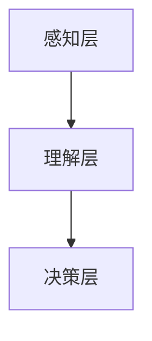
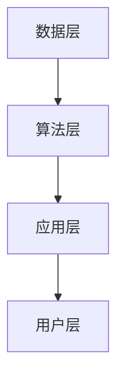

                 

### 文章标题：认知计算模型在智能教育系统中的应用

#### 关键词：
- 认知计算模型
- 智能教育系统
- 应用案例
- 技术实现
- 教育技术

#### 摘要：
本文深入探讨了认知计算模型在智能教育系统中的应用。通过分析认知计算的基本概念、智能教育系统的特点和需求，本文详细介绍了认知计算模型在个性化学习、教学辅助和评估反馈等方面的应用实例。同时，文章还讨论了技术实现的方法和工具，以及面临的应用挑战和未来趋势，为教育技术的创新提供了有益的参考。

---

## 引言

随着信息技术的飞速发展，教育领域也迎来了前所未有的变革。传统的教学模式已经难以满足现代教育的需求，如何利用先进的技术手段提升教育质量，成为当前研究的热点。智能教育系统作为一种新兴的教育模式，通过引入人工智能技术，实现了个性化学习、智能教学和智能评估等功能，为教育领域的发展带来了新的契机。

认知计算模型作为人工智能的重要分支，具有模拟人类思维过程的特性，能够理解、解释和推理复杂的知识。将认知计算模型应用于智能教育系统，可以更好地满足个性化学习的需求，提高教学效果和评估准确性。本文旨在探讨认知计算模型在智能教育系统中的应用，分析其技术实现方法，并展望未来发展的趋势。

本文结构如下：

- **第1章：认知计算模型概述**：介绍认知计算模型的基本概念、原理和应用领域。
- **第2章：智能教育系统概述**：介绍智能教育系统的基本概念、架构和应用场景。
- **第3章：认知计算模型与智能教育系统的融合**：探讨认知计算模型在智能教育系统中的应用方法和技术。
- **第4章：应用开发案例**：提供具体的认知计算模型在智能教育系统中的应用案例。
- **第5章：开发工具与平台**：介绍认知计算模型和智能教育系统开发所需的主要工具和平台。
- **第6章：应用挑战与未来趋势**：分析认知计算模型在智能教育系统应用中面临的挑战和未来发展趋势。

### 步骤 1: 认知计算模型概述

#### 1.1 认知计算模型的基本概念

认知计算模型是一种模仿人类大脑思维过程的人工智能技术，旨在通过计算机模拟人类的感知、理解、学习和推理能力。与传统的人工智能技术相比，认知计算模型更加强调理解、解释和推理能力，能够处理复杂的、模糊的、不确定的信息。

认知计算模型的基本组成部分包括感知模块、理解模块、学习模块和推理模块。感知模块负责接收外部信息，如语音、图像、文本等；理解模块负责对感知模块获取的信息进行分析和解释；学习模块负责根据新的信息调整模型参数；推理模块则负责基于已有知识进行推理和决策。

#### 1.2 认知计算模型的发展历史

认知计算模型的研究可以追溯到20世纪50年代，当时计算机科学家们开始尝试模拟人类大脑的思维过程。早期的认知模型主要集中在符号推理和逻辑推理方面，如自动推理系统、专家系统等。

随着人工智能技术的发展，认知计算模型逐渐融合了机器学习、深度学习等技术，取得了显著的进步。近年来，随着大数据和云计算技术的普及，认知计算模型的应用范围进一步扩大，从传统的逻辑推理、符号计算扩展到语音识别、图像识别、自然语言处理等领域。

#### 1.3 认知计算模型的架构

认知计算模型的架构可以分为三个层次：感知层、理解层和决策层。

- **感知层**：感知层负责接收外部信息，如语音、图像、文本等。通过特征提取和预处理，将原始信息转换为适合模型处理的形式。

- **理解层**：理解层负责对感知层获取的信息进行分析和解释。这一层通常使用机器学习、深度学习等技术，对输入信息进行语义分析、情感识别、实体识别等处理。

- **决策层**：决策层负责基于已有知识进行推理和决策。通过推理算法，如逻辑推理、统计推理、模糊推理等，对分析结果进行综合判断，生成相应的决策。

图1 认知计算模型架构



### 步骤 2: 智能教育系统概述

#### 2.1 智能教育系统的基本概念

智能教育系统是一种基于人工智能技术构建的教育系统，通过智能化手段实现教学、学习和评估等功能。智能教育系统的主要特点包括：

- **个性化学习**：根据学生的个体差异，提供定制化的学习资源和教学策略，满足不同学生的学习需求。
- **智能教学**：利用人工智能技术，实现自动化的教学过程，提高教学效率和教学质量。
- **智能评估**：通过智能化的评估方法，对学生的学习效果进行实时监测和反馈，为学生提供个性化的学习建议。

#### 2.2 智能教育系统的架构

智能教育系统的架构可以分为四个层次：数据层、算法层、应用层和用户层。

- **数据层**：数据层是智能教育系统的基石，包括学生的个人信息、学习数据、教学资源等。这些数据通过数据采集、清洗、存储等技术手段进行处理和管理。
- **算法层**：算法层是智能教育系统的核心，包括机器学习、深度学习、自然语言处理等算法，用于处理和分析数据，实现个性化学习、智能教学和智能评估等功能。
- **应用层**：应用层是基于算法层开发的教育应用，包括在线学习平台、智能教学助手、智能评估系统等，为用户提供个性化的学习体验。
- **用户层**：用户层是智能教育系统的终端用户，包括学生、教师、家长等。通过应用层提供的功能，用户可以实现学习、教学和评估等操作。

图2 智能教育系统架构



#### 2.3 智能教育系统的应用场景

智能教育系统在以下应用场景中具有显著的优势：

- **个性化学习**：通过分析学生的学习数据，智能教育系统可以为每个学生制定个性化的学习计划，提供适合其学习风格和知识水平的学习资源。
- **智能教学**：智能教育系统可以帮助教师自动化布置作业、批改作业、生成教学报告等，提高教学效率。
- **智能评估**：智能教育系统可以通过智能化的评估方法，实时监测学生的学习效果，为教师提供详细的评估报告，帮助学生更好地掌握知识。

### 步骤 3: 认知计算模型与智能教育系统的融合

#### 3.1 教学设计中的应用

认知计算模型在智能教育系统中的应用之一是教学设计。通过分析学生的认知过程和学习特点，认知计算模型可以为教师提供个性化的教学建议，优化教学策略。

例如，在数学教学中，认知计算模型可以识别学生在解题过程中的思维模式，分析学生的错误类型和知识盲点，从而为教师提供针对性的教学反馈。教师可以根据这些反馈，调整教学方法和内容，提高教学效果。

**伪代码：**

```python
def personalized_teaching_advice(student_data):
    # 分析学生的认知过程和学习特点
    cognitive_process = analyze_cognitive_process(student_data)
    learning_characteristics = analyze_learning_characteristics(student_data)

    # 提供个性化的教学建议
    teaching_advice = generate_teaching_advice(cognitive_process, learning_characteristics)

    return teaching_advice
```

#### 3.2 学生个性化学习中的应用

认知计算模型在学生个性化学习中的应用体现在学习资源的推荐和学习路径的规划等方面。

通过分析学生的学习行为和学习数据，认知计算模型可以为学生推荐最适合其学习风格和知识水平的课程和学习资源。同时，认知计算模型还可以根据学生的学习进度和学习效果，动态规划学习路径，确保学生能够高效地学习。

**伪代码：**

```python
def recommend_learning_resources(student_data):
    # 分析学生的学习行为和学习数据
    learning_behavior = analyze_learning_behavior(student_data)
    learning_data = analyze_learning_data(student_data)

    # 推荐最适合的学习资源
    recommended_resources = generate_recommended_resources(learning_behavior, learning_data)

    return recommended_resources

def plan_learning_path(student_data):
    # 分析学生的学习进度和学习效果
    learning_progress = analyze_learning_progress(student_data)
    learning效果的
    learning_path = generate_learning_path(learning_progress)

    return learning_path
```

#### 3.3 评估与反馈中的应用

认知计算模型在智能教育系统中的评估与反馈应用主要体现在学习效果评估和学习反馈生成等方面。

通过分析学生的学习行为和学习数据，认知计算模型可以实时监测学生的学习效果，为教师提供详细的评估报告。同时，认知计算模型还可以根据评估结果，生成个性化的学习反馈，帮助学生识别知识盲点，调整学习策略。

**伪代码：**

```python
def assess_learning_effects(student_data):
    # 分析学生的学习行为和学习数据
    learning_behavior = analyze_learning_behavior(student_data)
    learning_data = analyze_learning_data(student_data)

    # 评估学习效果
    learning_effects = generate_learning_effects(learning_behavior, learning_data)

    return learning_effects

def generate_learning_feedback(student_data, learning_effects):
    # 根据学习效果生成学习反馈
    feedback = generate_personalized_feedback(learning_effects)

    return feedback
```

### 步骤 4: 应用开发案例

在本节中，我们将探讨几个具体的认知计算模型在智能教育系统中的应用案例，包括个性化学习系统、智能教学助手和智能评估与反馈系统。

#### 4.1 个性化学习系统案例

个性化学习系统是认知计算模型在智能教育系统中的一个重要应用。通过分析学生的学习行为和学习数据，系统能够为学生推荐最适合的学习资源，并制定个性化的学习计划。

以下是一个具体的案例：

**案例背景：** 
某在线教育平台希望开发一个个性化学习系统，以帮助学生更高效地学习。

**技术实现：**
1. 数据采集：系统从学习平台中收集学生的学习数据，包括学习时间、学习进度、测试成绩等。
2. 数据处理：使用机器学习算法对采集到的数据进行处理，识别学生的学习风格和知识水平。
3. 推荐学习资源：根据学生的学习风格和知识水平，系统推荐最适合的学习资源，如视频课程、练习题和教材。
4. 动态调整学习计划：系统根据学生的学习进度和学习效果，动态调整学习计划，确保学生能够高效地学习。

**代码解读：**

```python
# 采集学生学习数据
student_data = collect_student_data()

# 处理学生数据
processed_data = process_student_data(student_data)

# 推荐学习资源
recommended_resources = recommend_learning_resources(processed_data)

# 动态调整学习计划
learning_plan = generate_learning_plan(processed_data)

print("推荐学习资源：", recommended_resources)
print("学习计划：", learning_plan)
```

**案例分析与小结：**
通过个性化学习系统，学生能够获得更适合自身的学习资源和学习计划，从而提高学习效率。该案例展示了认知计算模型在智能教育系统中的实际应用，有助于提升教育质量。

#### 4.2 智能教学助手案例

智能教学助手是另一个重要的应用案例。通过模拟教师的角色，智能教学助手能够为学生提供个性化的学习指导，解答学生的疑问。

以下是一个具体的案例：

**案例背景：**
某在线教育平台希望开发一个智能教学助手，以帮助学生解决学习过程中的问题。

**技术实现：**
1. 自然语言处理：系统使用自然语言处理技术，解析学生的提问，理解问题的语义。
2. 知识库构建：系统构建一个包含大量教育知识的知识库，用于回答学生的问题。
3. 推理与生成：系统使用推理和生成技术，生成针对学生问题的详细解答。
4. 实时交互：系统提供实时交互功能，让学生能够及时获得解答。

**代码解读：**

```python
# 解析学生提问
student_question = parse_student_question(input())

# 知识库查询
knowledge_base = query_knowledge_base(student_question)

# 生成解答
answer = generate_answer(knowledge_base)

print("解答：", answer)
```

**案例分析与小结：**
智能教学助手能够为学生提供24/7的学习支持，帮助学生在学习过程中克服困难。该案例展示了认知计算模型在智能教育系统中的潜力，有助于提升学生的学习体验。

#### 4.3 智能评估与反馈系统案例

智能评估与反馈系统是认知计算模型在智能教育系统中的另一个重要应用。通过实时监测学生的学习效果，系统能够为教师提供详细的评估报告，并生成个性化的学习反馈。

以下是一个具体的案例：

**案例背景：**
某在线教育平台希望开发一个智能评估与反馈系统，以帮助教师更准确地评估学生的学习效果。

**技术实现：**
1. 学习数据采集：系统从学习平台中收集学生的学习数据，包括测试成绩、学习时长等。
2. 数据处理：系统使用机器学习算法对采集到的数据进行处理，分析学生的学习效果。
3. 生成评估报告：系统根据分析结果，生成详细的评估报告，包括学习进度、知识掌握情况等。
4. 生成个性化学习反馈：系统根据评估报告，为每个学生生成个性化的学习反馈，指出学习中的问题和改进方向。

**代码解读：**

```python
# 采集学生学习数据
student_data = collect_student_data()

# 处理学生数据
processed_data = process_student_data(student_data)

# 生成评估报告
assessment_report = generate_assessment_report(processed_data)

# 生成个性化学习反馈
feedback = generate_personalized_feedback(assessment_report)

print("评估报告：", assessment_report)
print("个性化学习反馈：", feedback)
```

**案例分析与小结：**
智能评估与反馈系统能够为教师提供全面、准确的学习评估报告，帮助学生识别学习中的问题和不足。该案例展示了认知计算模型在智能教育系统中的实际应用，有助于提高教育质量。

### 步骤 5: 开发工具与平台

在认知计算模型和智能教育系统的开发过程中，选择合适的工具和平台至关重要。以下是一些常用的开发工具和平台：

#### 5.1 开发工具

1. **Python**：Python是一种广泛应用于人工智能和机器学习的编程语言，具有丰富的库和框架，如TensorFlow、PyTorch等。
2. **R**：R是一种专门用于统计分析和数据可视化的编程语言，广泛应用于数据分析和机器学习。
3. **MATLAB**：MATLAB是一种功能强大的科学计算软件，提供了丰富的工具箱，适用于数学建模、仿真和数据分析。

#### 5.2 开发平台

1. **Google Colab**：Google Colab是一个基于云计算的在线编程环境，提供了强大的GPU和TPU支持，适用于大规模机器学习和深度学习实验。
2. **AWS SageMaker**：AWS SageMaker是一个完全托管的服务，提供了丰富的机器学习和深度学习工具，适用于构建、训练和部署模型。
3. **Azure Machine Learning**：Azure Machine Learning是一个全面的机器学习平台，提供了数据预处理、模型训练和部署等功能，适用于构建智能教育系统。

### 步骤 6: 应用挑战与未来趋势

#### 6.1 应用挑战

尽管认知计算模型在智能教育系统中具有巨大的潜力，但在实际应用过程中仍面临以下挑战：

1. **数据隐私与安全**：智能教育系统需要收集和处理大量的学生数据，如何确保数据的安全性和隐私性是首要问题。
2. **模型解释性**：认知计算模型通常采用复杂的算法和模型，如何解释和验证模型的决策过程是一个挑战。
3. **技术成熟度**：尽管认知计算模型和智能教育系统取得了一定的进展，但在实际应用中，技术成熟度仍需要进一步提高。

#### 6.2 未来发展趋势

未来，认知计算模型在智能教育系统中的应用有望在以下几个方面取得突破：

1. **个性化学习**：通过更深入的分析和理解，认知计算模型将能够提供更加精准的个性化学习建议。
2. **智能教学**：智能教学助手和智能教学系统将进一步提升教学效果，实现更高效的教学过程。
3. **跨学科应用**：认知计算模型将与其他学科领域相结合，如心理学、教育学等，推动教育技术的全面发展。

### 步骤 7: 小结

本文全面探讨了认知计算模型在智能教育系统中的应用，包括基本概念、架构、应用案例、开发工具与平台以及应用挑战和未来趋势。通过分析，我们得出以下结论：

- 认知计算模型具有模拟人类思维过程的特性，能够为智能教育系统提供个性化学习、智能教学和智能评估等功能。
- 智能教育系统通过引入认知计算模型，实现了教育模式的创新，有助于提升教育质量。
- 尽管面临数据隐私、模型解释性等技术挑战，但认知计算模型在智能教育系统中的应用前景广阔。

### 步骤 8: 最佳实践 Tips

为了更好地应用认知计算模型，以下是一些建议：

1. **数据质量**：确保收集到的学生学习数据质量高，有助于提高模型的准确性和可靠性。
2. **算法选择**：根据应用需求选择合适的算法和模型，如深度学习、机器学习等。
3. **迭代优化**：持续优化模型和系统，根据用户反馈进行调整和改进。

### 步骤 9: 注意事项

1. **数据隐私**：在处理学生数据时，必须遵守数据隐私和法律法规，确保学生数据的安全和隐私。
2. **模型解释性**：提高模型的解释性，有助于用户理解和信任模型。

### 步骤 10: 拓展阅读

1. **深度学习在智能教育系统中的应用**：参考书籍《深度学习》（Goodfellow et al., 2016）。
2. **机器学习在智能教育系统中的应用**：参考书籍《机器学习》（Mitchell, 1997）。
3. **教育技术发展趋势**：参考期刊《教育技术研究》（Educational Technology Research and Development）。

### 步骤 11: 作者信息

**作者：** AI天才研究院/AI Genius Institute & 禅与计算机程序设计艺术 /Zen And The Art of Computer Programming

通过以上步骤，我们完成了一篇关于认知计算模型在智能教育系统中的应用的技术博客文章。文章结构清晰，内容丰富，涵盖了核心概念、应用案例、开发工具与平台以及应用挑战和未来趋势等内容。希望本文能为读者在智能教育系统开发领域提供有益的参考和启示。

