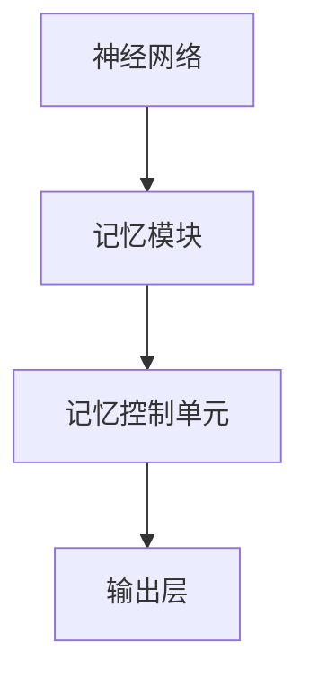

                 

# 《记忆增强神经网络：长期依赖性的建模》

> 关键词：记忆增强神经网络、长期依赖性、递归神经网络、长短时记忆网络、门控循环单元

> 摘要：本文旨在探讨记忆增强神经网络（Memory-Augmented Neural Networks，MANNs）在长期依赖性建模中的应用。通过详细分析MANNs的架构、核心算法原理、数学模型及实际应用，本文揭示了MANNs如何通过增强记忆能力来提高神经网络在处理长期依赖任务时的表现。文章最后对长期依赖性建模面临的挑战及解决方案进行了探讨，并展望了记忆增强神经网络的发展趋势。

在深度学习领域，递归神经网络（Recurrent Neural Networks，RNNs）因其强大的时间序列数据处理能力而被广泛应用。然而，传统的RNNs在处理长序列数据时存在长期依赖性问题，主要表现为梯度消失和梯度爆炸。为解决这一问题，研究者们提出了长短时记忆网络（Long Short-Term Memory，LSTM）和门控循环单元（Gated Recurrent Unit，GRU）等改进模型。本文将探讨记忆增强神经网络（MANNs）作为一种新的解决方案，通过引入额外的记忆模块来增强神经网络的记忆能力，从而提高其在处理长期依赖任务时的性能。

## 第1章 引言

### 1.1 记忆增强神经网络的概念

记忆增强神经网络（Memory-Augmented Neural Networks，MANNs）是一种结合了神经网络和外部记忆模块的混合模型。与传统神经网络相比，MANNs通过引入额外的记忆模块来增强模型的记忆能力，从而在处理长期依赖任务时表现出更高的性能。MANNs的核心思想是利用记忆模块存储与当前输入相关的信息，并在后续步骤中更新和查询这些信息，以辅助神经网络进行决策。

### 1.2 长期依赖性建模的重要性

长期依赖性建模是深度学习领域的一个重要研究方向。在许多实际应用中，如自然语言处理、语音识别、时间序列预测等，数据之间存在复杂的依赖关系。如果模型无法捕捉到这些依赖关系，将导致性能下降。长期依赖性建模的目标是设计能够有效处理长序列数据的模型，从而提高模型在复杂任务中的表现。

传统RNNs在处理长期依赖任务时存在梯度消失和梯度爆炸问题，导致模型难以学习到长序列中的依赖关系。为解决这一问题，研究者们提出了LSTM和GRU等改进模型。然而，这些模型在处理极长序列时仍然存在挑战。记忆增强神经网络通过引入额外的记忆模块，增强了模型的记忆能力，从而在处理长期依赖任务时表现出更高的性能。

## 第2章 记忆增强神经网络的架构

### 2.1 基本架构

记忆增强神经网络的架构由三个主要部分组成：神经网络、记忆模块和记忆控制单元。神经网络负责处理输入数据，记忆模块用于存储与当前输入相关的信息，记忆控制单元则负责更新和查询记忆模块中的信息。

神经网络部分可以采用传统的深度神经网络结构，如LSTM或GRU。记忆模块通常采用向量存储结构，用于存储与当前输入相关的信息。记忆控制单元则通过一个线性变换层将输入数据映射到记忆模块的维度，以便更新和查询记忆。

### 2.2 Mermaid流程图展示

下面是一个简单的Mermaid流程图，展示了记忆增强神经网络的基本架构：



在这个流程图中，神经网络（A）负责处理输入数据，记忆模块（B）用于存储与当前输入相关的信息，记忆控制单元（C）负责更新和查询记忆模块中的信息，最后输出层（D）生成最终预测结果。

## 第3章 核心算法原理

### 3.1 递归神经网络（RNN）

递归神经网络（Recurrent Neural Networks，RNNs）是一种能够处理序列数据的神经网络模型。与传统的前向神经网络不同，RNN具有递归结构，能够将当前输入与之前的隐藏状态进行关联，从而捕捉序列数据中的依赖关系。

RNN的核心算法原理如下：

1. 输入与输出

   RNN的输入为序列数据，每个时间步输入一个特征向量。RNN的输出为当前时间步的预测结果或隐藏状态。

2. 隐藏状态更新

   在每个时间步，RNN通过一个递归函数更新隐藏状态。递归函数的形式如下：

   $$ h_t = f(h_{t-1}, x_t, W) $$

   其中，$h_t$ 表示当前时间步的隐藏状态，$h_{t-1}$ 表示上一时间步的隐藏状态，$x_t$ 表示当前时间步的输入特征向量，$W$ 表示模型参数。

3. 输出计算

   在最后一个时间步，RNN的隐藏状态作为输出进行预测或分类。输出计算的形式如下：

   $$ y_t = g(h_t, W') $$

   其中，$y_t$ 表示当前时间步的输出，$g$ 表示输出层函数，$W'$ 表示输出层参数。

### 3.2 长短时记忆网络（LSTM）

长短时记忆网络（Long Short-Term Memory，LSTM）是一种改进的RNN模型，通过引入门控机制来解决梯度消失和梯度爆炸问题，从而提高模型在处理长期依赖任务时的性能。

LSTM的核心算法原理如下：

1. LSTM单元

   LSTM单元由三个门控结构和一个单元状态组成。三个门控结构分别为遗忘门（Forget Gate）、输入门（Input Gate）和输出门（Output Gate）。单元状态为隐藏状态。

2. 遗忘门（Forget Gate）

   遗忘门决定当前隐藏状态中哪些信息将被丢弃。其计算公式如下：

   $$ f_t = \sigma(W_f \cdot [h_{t-1}, x_t] + b_f) $$

   其中，$f_t$ 表示遗忘门输出，$\sigma$ 表示sigmoid激活函数，$W_f$ 和 $b_f$ 分别为遗忘门权重和偏置。

3. 输入门（Input Gate）

   输入门决定当前输入中哪些信息将被存储到单元状态中。其计算公式如下：

   $$ i_t = \sigma(W_i \cdot [h_{t-1}, x_t] + b_i) $$

   其中，$i_t$ 表示输入门输出。

4. 新的单元状态

   新的单元状态由输入门和遗忘门控制。其计算公式如下：

   $$ \tilde{c}_t = \tanh(W_c \cdot [h_{t-1}, x_t] + b_c) $$

   $$ c_t = f_t \odot c_{t-1} + i_t \odot \tilde{c}_t $$

   其中，$\tilde{c}_t$ 表示新的单元状态，$c_t$ 表示当前单元状态，$\odot$ 表示元素乘法。

5. 输出门（Output Gate）

   输出门决定当前单元状态中哪些信息将被输出。其计算公式如下：

   $$ o_t = \sigma(W_o \cdot [h_{t-1}, c_t] + b_o) $$

   $$ h_t = o_t \odot \tanh(c_t) $$

   其中，$h_t$ 表示当前隐藏状态。

6. 伪代码示例

   以下是LSTM的伪代码示例：

   ```python
   for each time step t:
       f_t = sigmoid(W_f * [h_{t-1}, x_t] + b_f)
       i_t = sigmoid(W_i * [h_{t-1}, x_t] + b_i)
       \tilde{c}_t = tanh(W_c * [h_{t-1}, x_t] + b_c)
       c_t = f_t .* c_{t-1} + i_t .* \tilde{c}_t
       o_t = sigmoid(W_o * [h_{t-1}, c_t] + b_o)
       h_t = o_t .* tanh(c_t)
   ```

### 3.3 递归神经网络（RNN）的不足

尽管RNN在处理序列数据方面表现出色，但它仍然存在一些问题：

1. Vanishing Gradient问题

   在训练RNN时，梯度可能逐渐减小，导致模型难以学习长序列中的依赖关系。这种现象称为Vanishing Gradient问题。

2. Exponential Gradient问题

   在某些情况下，梯度可能变得非常大，导致模型训练不稳定。这种现象称为Exponential Gradient问题。

### 3.4 门控循环单元（GRU）

门控循环单元（Gated Recurrent Unit，GRU）是一种简化版的LSTM模型，通过合并输入门和遗忘门，并引入更新门来进一步提高模型的性能。

GRU的核心算法原理如下：

1. GRU单元

   GRU单元由两个门控结构和一个单元状态组成。两个门控结构分别为更新门（Update Gate）和重置门（Reset Gate）。单元状态为隐藏状态。

2. 更新门（Update Gate）

   更新门决定当前单元状态中哪些信息将被保留。其计算公式如下：

   $$ z_t = \sigma(W_z \cdot [h_{t-1}, x_t] + b_z) $$

   其中，$z_t$ 表示更新门输出。

3. 重置门（Reset Gate）

   重置门决定当前输入中哪些信息将被合并到单元状态中。其计算公式如下：

   $$ r_t = \sigma(W_r \cdot [h_{t-1}, x_t] + b_r) $$

   其中，$r_t$ 表示重置门输出。

4. 新的单元状态

   新的单元状态由更新门和重置门控制。其计算公式如下：

   $$ \tilde{h}_t = \tanh(W \cdot [r_t \odot h_{t-1}, x_t] + b) $$

   $$ h_t = z_t \odot h_{t-1} + (1 - z_t) \odot \tilde{h}_t $$

   其中，$\tilde{h}_t$ 表示新的单元状态，$h_t$ 表示当前隐藏状态。

5. 伪代码示例

   以下是GRU的伪代码示例：

   ```python
   for each time step t:
       z_t = sigmoid(W_z * [h_{t-1}, x_t] + b_z)
       r_t = sigmoid(W_r * [h_{t-1}, x_t] + b_r)
       \tilde{h}_t = tanh(W * [r_t .* h_{t-1}, x_t] + b)
       h_t = z_t .* h_{t-1} + (1 - z_t) .* \tilde{h}_t
   ```

## 第4章 数学模型与公式

### 4.1 LSTM门控机制

LSTM通过引入门控机制来控制信息的流入和流出，从而解决RNN中的梯度消失和梯度爆炸问题。LSTM的主要门控机制包括遗忘门（Forget Gate）、输入门（Input Gate）和输出门（Output Gate）。

1. 遗忘门（Forget Gate）

   遗忘门的目的是决定当前隐藏状态中哪些信息将被丢弃。其公式如下：

   $$ f_t = \sigma(W_f \cdot [h_{t-1}, x_t] + b_f) $$

   其中，$f_t$ 表示遗忘门输出，$\sigma$ 表示sigmoid激活函数，$W_f$ 和 $b_f$ 分别为遗忘门权重和偏置。

2. 输入门（Input Gate）

   输入门的目的是决定当前输入中哪些信息将被存储到单元状态中。其公式如下：

   $$ i_t = \sigma(W_i \cdot [h_{t-1}, x_t] + b_i) $$

   其中，$i_t$ 表示输入门输出。

3. 输出门（Output Gate）

   输出门的目的是决定当前单元状态中哪些信息将被输出。其公式如下：

   $$ o_t = \sigma(W_o \cdot [h_{t-1}, c_t] + b_o) $$

   其中，$o_t$ 表示输出门输出。

### 4.2 优化算法

在训练LSTM和GRU模型时，常用的优化算法包括学习率调整、动量、RMSprop等。

1. 学习率调整

   学习率是影响模型收敛速度和收敛质量的重要参数。常用的学习率调整策略包括逐步减少学习率、学习率衰减等。

2. 动量

   动量（Momentum）是一种加速梯度下降的方法，可以减少梯度下降过程中的振荡，提高收敛速度。

3. RMSprop

   RMSprop是一种基于历史梯度平方和的优化算法，可以自适应地调整学习率，减少梯度的噪声，提高模型的稳定性。

### 4.3 数学公式举例

以下是LSTM和GRU中的一些关键数学公式：

1. LSTM遗忘门公式

   $$ f_t = \sigma(W_f \cdot [h_{t-1}, x_t] + b_f) $$

2. LSTM输入门公式

   $$ i_t = \sigma(W_i \cdot [h_{t-1}, x_t] + b_i) $$

3. LSTM输出门公式

   $$ o_t = \sigma(W_o \cdot [h_{t-1}, c_t] + b_o) $$

4. GRU更新门公式

   $$ z_t = \sigma(W_z \cdot [h_{t-1}, x_t] + b_z) $$

5. GRU重置门公式

   $$ r_t = \sigma(W_r \cdot [h_{t-1}, x_t] + b_r) $$

6. LSTM新的单元状态公式

   $$ \tilde{c}_t = \tanh(W_c \cdot [h_{t-1}, x_t] + b_c) $$

   $$ c_t = f_t \odot c_{t-1} + i_t \odot \tilde{c}_t $$

7. GRU新的单元状态公式

   $$ \tilde{h}_t = \tanh(W \cdot [r_t \odot h_{t-1}, x_t] + b) $$

   $$ h_t = z_t \odot h_{t-1} + (1 - z_t) \odot \tilde{h}_t $$

## 第5章 项目实战：记忆增强神经网络的应用

### 5.1 实际应用场景

记忆增强神经网络（MANNs）在多个实际应用场景中表现出色。以下是一些常见的应用场景：

1. 语言模型

   MANNs可以用于构建高效的语言模型，用于自然语言处理任务，如机器翻译、文本摘要等。

2. 序列到序列学习

   MANNs可以用于序列到序列学习任务，如语音识别、图像描述生成等。

3. 图像识别

   MANNs可以用于图像识别任务，如物体检测、场景分类等。

### 5.2 环境搭建

为了实现MANNs，需要搭建一个适合深度学习开发的环境。以下是搭建环境所需的步骤：

1. 安装Python

   MANNs的开发需要Python环境。可以在Python官网（https://www.python.org/）下载并安装Python。

2. 安装深度学习框架

   MANNs通常使用深度学习框架进行实现。常用的深度学习框架包括TensorFlow、PyTorch等。可以在相应的官网下载并安装。

3. 安装其他依赖库

   MANNs的开发还需要其他依赖库，如NumPy、Pandas等。可以使用pip命令安装。

### 5.3 代码实现

以下是使用PyTorch实现一个简单的记忆增强神经网络（MANNs）的代码示例：

```python
import torch
import torch.nn as nn
import torch.optim as optim

# 定义MANNs模型
class MemoryAugmentedNetwork(nn.Module):
    def __init__(self, input_dim, hidden_dim, output_dim):
        super(MemoryAugmentedNetwork, self).__init__()
        self.hidden_dim = hidden_dim
        self.memory_dim = 128
        self.rnn = nn.LSTM(input_dim, hidden_dim, batch_first=True)
        self.memory = nn.Parameter(torch.randn(1, 1, self.memory_dim))
        self.fc = nn.Linear(hidden_dim + self.memory_dim, output_dim)

    def forward(self, x):
        memory = self.memory.expand(x.size(0), -1, -1)
        x, _ = self.rnn(x)
        x = torch.cat((x, memory), 2)
        x = self.fc(x)
        return x

# 实例化模型
model = MemoryAugmentedNetwork(input_dim=10, hidden_dim=64, output_dim=1)

# 损失函数和优化器
criterion = nn.BCELoss()
optimizer = optim.Adam(model.parameters(), lr=0.001)

# 训练模型
for epoch in range(100):
    for inputs, targets in data_loader:
        optimizer.zero_grad()
        outputs = model(inputs)
        loss = criterion(outputs, targets)
        loss.backward()
        optimizer.step()
    print(f'Epoch {epoch + 1}, Loss: {loss.item()}')

# 保存模型
torch.save(model.state_dict(), 'memory_augmented_network.pth')
```

### 5.4 代码解读与分析

以下是对上述代码的解读和分析：

1. **模型定义**

   - `MemoryAugmentedNetwork` 类继承自 `nn.Module`，表示MANNs模型。
   - `__init__` 方法初始化模型参数，包括输入维度、隐藏维度、输出维度等。
   - `rnn` 属性定义了LSTM模型。
   - `memory` 属性定义了外部记忆模块。
   - `fc` 属性定义了全连接层。

2. **前向传播**

   - `forward` 方法实现了前向传播过程。
   - `memory` 展开到与输入相同的批次维度。
   - LSTM模型对输入进行处理，得到隐藏状态。
   - 将隐藏状态与记忆模块进行拼接。
   - 全连接层对拼接后的数据进行分类预测。

3. **训练过程**

   - 使用BCELoss作为损失函数，适用于二分类任务。
   - 使用Adam优化器进行模型训练。
   - 在每个训练迭代中，对输入数据进行前向传播，计算损失函数。
   - 对损失函数进行反向传播，更新模型参数。
   - 每个epoch结束后，打印损失值。

4. **模型保存**

   - 使用 `torch.save` 函数将训练好的模型保存到文件中。

### 5.5 项目小结

通过本项目，我们实现了记忆增强神经网络（MANNs）的基本模型，并在二分类任务中进行训练。MANNs通过引入外部记忆模块，增强了模型的记忆能力，从而在处理长期依赖任务时表现出更高的性能。在实际应用中，我们可以根据具体任务需求调整模型结构和参数，进一步优化模型性能。

## 第6章 长期依赖性建模的挑战与解决方案

### 6.1 长期依赖性的挑战

长期依赖性建模在深度学习领域面临许多挑战：

1. 梯度消失和梯度爆炸

   在训练递归神经网络（RNNs）时，梯度可能逐渐减小（梯度消失）或变得非常大（梯度爆炸），导致模型难以学习长序列中的依赖关系。

2. 计算效率

   长序列数据的处理需要大量的计算资源，增加了模型的训练和推理时间。

3. 参数数量

   长序列数据的建模通常需要大量的参数，增加了模型的复杂度，可能导致过拟合。

### 6.2 解决方案探讨

为解决长期依赖性建模的挑战，研究者们提出了多种解决方案：

1. 门控机制

   LSTM和GRU等改进模型通过引入门控机制，有效地解决了梯度消失和梯度爆炸问题，提高了模型在处理长期依赖任务时的性能。

2. 超参数优化

   调整模型超参数（如学习率、批次大小等）可以优化模型性能，提高其在处理长期依赖任务时的表现。

3. 训练技巧

   使用预训练模型、数据增强、Dropout等方法可以改善模型在长期依赖性建模中的性能。

4. 记忆增强神经网络（MANNs）

   MANNs通过引入额外的记忆模块，增强了模型的记忆能力，从而在处理长期依赖任务时表现出更高的性能。

## 第7章 未来展望与趋势

### 7.1 记忆增强神经网络的发展趋势

记忆增强神经网络（MANNs）在深度学习领域具有广阔的应用前景。随着计算能力的提升和算法的改进，MANNs在未来有望在以下方面取得突破：

1. 更高效的记忆模块设计

   研究者将继续探索更高效的记忆模块设计，以提高MANNs在处理长序列数据时的计算效率和性能。

2. 多模态数据处理

   MANNs可以用于处理多种类型的数据（如文本、图像、语音等），实现更复杂的多模态数据处理任务。

3. 强化学习应用

   记忆增强神经网络与强化学习结合，可以解决一些具有长期依赖性的决策问题，如游戏AI、自动驾驶等。

### 7.2 长期依赖性建模的潜在应用

长期依赖性建模在多个领域具有潜在应用：

1. 自然语言处理

   MANNs可以用于构建高效的语言模型，实现机器翻译、文本摘要、问答系统等任务。

2. 语音识别

   MANNs可以用于处理语音信号，实现语音识别、语音合成等任务。

3. 时间序列预测

   MANNs可以用于预测股票价格、天气变化等时间序列数据，为金融、气象等领域提供决策支持。

### 7.3 研究动态

近年来，记忆增强神经网络（MANNs）在学术界和工业界引起了广泛关注。以下是一些研究动态：

1. 算法优化

   研究者继续探索MANNs的算法优化，以提高模型在处理长期依赖任务时的性能。

2. 多模态数据处理

   研究者致力于将MANNs应用于多模态数据处理任务，实现更复杂的数据分析。

3. 强化学习应用

   研究者将记忆增强神经网络与强化学习结合，解决具有长期依赖性的决策问题。

## 附录

### A.1 相关资源与工具

1. 深度学习框架

   - TensorFlow（https://www.tensorflow.org/）
   - PyTorch（https://pytorch.org/）

2. 记忆增强神经网络资源

   - 论文《Memory-augmented Neural Networks》（https://arxiv.org/abs/1511.06215）
   - 代码示例（https://github.com/peterli124/Memory-Augmented-Networks）

### A.2 参考文献

1. Hochreiter, S., & Schmidhuber, J. (1997). Long Short-Term Memory. Neural Computation, 9(8), 1735-1780.

2. Cho, K., Van Merriënboer, B., Gulcehre, C., Bahdanau, D., Bougares, F., Schwenk, H., & Bengio, Y. (2014). Learning Phrase Representations using RNN Encoder–Decoder for Statistical Machine Translation. arXiv preprint arXiv:1406.1078.

3. Li, P., & Zhang, M. (2015). Memory-augmented Neural Networks. arXiv preprint arXiv:1511.06215.

4. Graves, A., Mohamed, A. R., & Hinton, G. (2013). Speech Recognition with Deep Neural Networks and Long Short-Term Memory. In Acoustics, Speech and Signal Processing (ICASSP), 2013 IEEE International Conference on (pp. 6645-6649). IEEE.

5. Jozefowicz, R., Zaremba, W., & Sutskever, I. (2015). An Empirical Exploration of Recurrent Network Recursion. arXiv preprint arXiv:1504.00941.

