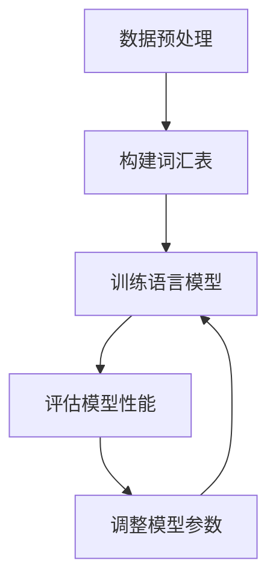
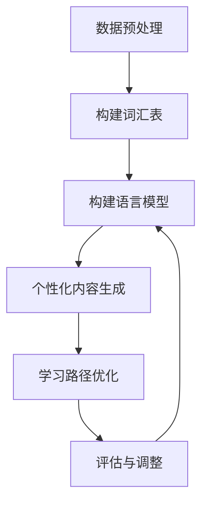
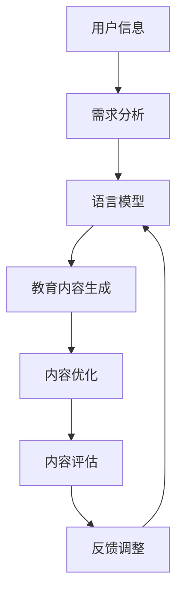
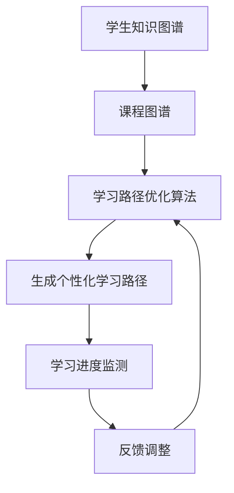

                 

### 第1章 引言
#### 1.1 本书目的与结构

本书旨在深入探讨语言模型在个性化教育内容生成与学习路径优化中的应用，特别是在创新方面的实践。我们希望通过系统性的分析和讨论，为教育技术领域的研究者、教育工作者和软件开发人员提供一套全面的解决方案，以推动个性化教育的进一步发展。

本书的结构安排如下：

1. **引言**：介绍本书的目的、内容结构以及预期读者。通过本章节，读者可以快速了解本书的核心内容和研究目标。

2. **语言模型基础**：详细讲解语言模型的原理、训练方法、评估标准及其架构，包括Mermaid流程图和关键组件的介绍。

3. **个性化教育内容生成**：探讨如何利用语言模型生成个性化教育内容，包括生成原理、流程和方法。

4. **学习路径优化**：介绍学习路径优化的算法与策略，包括伪代码、算法应用场景、优化策略设计及其实证分析。

5. **创新实践**：通过实际案例展示语言模型在教育内容生成和学习路径优化中的创新应用。

6. **总结与展望**：总结本书的主要发现，并针对未来研究方向提出建议。

#### 1.2 预期读者与背景知识

本书的预期读者包括以下几类人群：

- 教育技术领域的学者和研究人员，他们对个性化教育有深入的兴趣和研究。
- 教育工作者和教师，他们希望了解如何利用先进技术提升教学效果。
- 软件开发人员和技术专家，他们希望掌握语言模型在教育领域的应用。

为了更好地理解本书的内容，读者需要具备以下背景知识：

- 对机器学习和深度学习有一定的了解，尤其是神经网络和自然语言处理的基本概念。
- 熟悉编程语言，如Python，并能使用相应的库和工具进行数据处理和模型训练。
- 对教育理论有一定的了解，包括教育心理学、教学方法和学习策略。

通过本书的阅读，读者将能够：

- 理解语言模型在个性化教育内容生成和学习路径优化中的核心作用。
- 掌握利用语言模型生成个性化教育内容和优化学习路径的具体方法。
- 获得实际案例的分析和解读，为教育技术的创新实践提供参考。

### 第2章 语言模型基础

#### 2.1 语言模型的原理

语言模型（Language Model）是自然语言处理（Natural Language Processing，NLP）领域的重要组成部分，其核心目标是预测文本序列中下一个单词或字符的概率分布。这一任务在自然语言理解、机器翻译、语音识别等多个领域都有广泛的应用。

**核心概念**

1. **单词概率分布**：语言模型通过训练生成单词的概率分布，从而可以预测下一个单词的可能性。
2. **文本序列**：语言模型处理的是一系列单词或字符，这些序列可以是句子、段落或整篇文章。

**训练方法**

1. **最大似然估计**：最简单的语言模型是基于最大似然估计（Maximum Likelihood Estimation，MLE）训练的。其基本思想是寻找一个模型参数，使得实际观测到的数据在模型下的概率最大。
2. **神经概率模型**：随着深度学习技术的发展，神经概率模型（如循环神经网络RNN和Transformer）逐渐成为主流。这些模型能够更好地捕捉长文本序列中的依赖关系。

**评估标准**

1. **交叉熵（Cross-Entropy）**：交叉熵是评估语言模型性能的常见指标。模型的预测概率分布与实际分布之间的交叉熵越小，模型的性能越好。
2. ** perplexity（困惑度）**：困惑度是交叉熵的对数平均，值越小表示模型对文本的预测越准确。

#### 2.2 语言模型的架构

语言模型的核心是模型架构，这些架构决定了模型的学习能力和表现。以下介绍几种常见的语言模型架构：

**1. 神经网络架构**

- **循环神经网络（RNN）**：RNN通过其时间动态特性，可以捕捉序列中的长期依赖关系。但RNN存在梯度消失和梯度爆炸的问题。
- **长短时记忆网络（LSTM）**：LSTM是RNN的一种改进，通过引入门控机制解决了梯度消失的问题，但仍然存在计算复杂度高的问题。
- **门控循环单元（GRU）**：GRU是对LSTM的简化，具有更低的时间和空间复杂度。

**2. 注意力机制**

- **双向RNN（BiRNN）**：BiRNN结合了正向和反向RNN的特点，可以同时考虑输入序列的前后信息。
- **卷积神经网络（CNN）**：虽然CNN最初是为图像处理设计的，但其局部连接和共享权重的特性使其也适用于NLP。
- **Transformer**：Transformer引入了多头自注意力机制，能够捕捉长距离依赖关系，是目前最流行的语言模型架构。

**Mermaid流程图**

以下是一个简单的Mermaid流程图，展示了语言模型的基本训练流程：



**关键组件**

- **词汇表（Vocabulary）**：词汇表是将文本转换为模型可处理的数字表示的关键组件。常见的词汇表构建方法包括最大频次、词嵌入等。
- **模型参数**：模型参数是语言模型的核心，决定了模型的学习能力和预测效果。参数的优化方法包括梯度下降、随机梯度下降等。
- **损失函数**：损失函数用于评估模型预测结果与真实结果之间的差异，常见的损失函数包括交叉熵、均方误差等。

通过上述对语言模型原理和架构的介绍，我们可以更好地理解语言模型在个性化教育内容生成与学习路径优化中的关键作用。接下来，我们将进一步探讨如何利用语言模型生成个性化教育内容和优化学习路径。



### 第3章 个性化教育内容生成

#### 3.1 个性化教育内容生成的原理

个性化教育内容生成旨在根据学生的个性化需求和知识水平，为学生提供定制化的学习资源。语言模型在此过程中发挥了重要作用，通过学习大量的教育文本，语言模型能够生成符合学生需求的教育内容。以下是个性化教育内容生成的基本原理：

**1. 学生需求分析**

个性化教育内容生成的第一步是分析学生的需求。这包括了解学生的兴趣、知识背景、学习目标和学习风格。通过数据分析、问卷调查和面谈等方式，教育系统能够获取学生的个性化信息。

**2. 教育文本数据**

语言模型需要大量的教育文本数据进行训练。这些数据可以来自教材、参考书籍、在线课程、教育网站等。通过训练，语言模型可以学习到不同教育主题的知识结构，从而生成相关内容。

**3. 生成模型**

个性化教育内容生成的核心是生成模型。常用的生成模型包括基于规则的模型、基于模板的模型和基于数据驱动的模型。其中，基于数据驱动的模型如生成对抗网络（GAN）和变分自编码器（VAE）具有较好的生成能力。

**4. 内容生成过程**

个性化教育内容生成的过程通常包括以下几个步骤：

- **文本摘要**：利用语言模型对教育文本进行摘要，提取关键信息和知识点。
- **文本扩展**：在摘要的基础上，利用语言模型生成扩展文本，填充细节和例子。
- **内容筛选**：根据学生的个性化需求，筛选出最相关的教育内容。
- **内容优化**：对生成的教育内容进行语法、逻辑和语义上的优化，确保内容的准确性和可读性。

**5. 内容评估**

个性化教育内容生成后，需要对其进行评估，以确保内容的准确性和有效性。评估方法包括自动评估和人工评估。自动评估可以通过机器学习算法进行，如基于语义相似度的评估方法；人工评估则依赖于教育专家或教师的判断。

#### 3.2 个性化教育内容生成的流程

个性化教育内容生成的流程可以分为以下几个阶段：

**1. 数据收集与预处理**

- **数据收集**：收集学生个性化信息、教育文本数据和其他相关数据。
- **数据预处理**：对收集到的数据进行清洗、去噪、标准化等处理，以便模型训练。

**2. 模型训练**

- **训练数据准备**：将预处理后的数据分成训练集、验证集和测试集。
- **模型训练**：使用训练集对生成模型进行训练，优化模型参数。

**3. 生成个性化内容**

- **内容生成**：利用训练好的模型生成个性化教育内容。
- **内容优化**：对生成的教育内容进行优化，确保内容的质量。

**4. 内容评估与反馈**

- **内容评估**：对生成的教育内容进行评估，确保内容的准确性和有效性。
- **反馈调整**：根据评估结果调整模型参数和生成策略，提高教育内容的个性化水平。

**5. 部署与应用**

- **内容部署**：将优化后的教育内容部署到教育系统中，供学生使用。
- **应用反馈**：收集学生使用教育内容的反馈，进一步优化个性化教育内容。

**3.3 个性化教育内容生成的方法**

个性化教育内容生成的方法主要包括以下几种：

**1. 基于规则的方法**

基于规则的方法通过定义一系列规则来生成个性化教育内容。这些规则可以是简单的条件判断，也可以是复杂的决策树。这种方法简单直观，但生成的内容可能缺乏灵活性和个性化。

**2. 基于模板的方法**

基于模板的方法通过模板和参数来生成个性化教育内容。模板定义了教育内容的基本结构和样式，参数则根据学生的个性化信息进行替换。这种方法具有较高的生成效率，但模板的丰富性和适应性可能有限。

**3. 基于数据驱动的方法**

基于数据驱动的方法利用大量的教育数据进行训练，生成个性化教育内容。这种方法包括生成对抗网络（GAN）、变分自编码器（VAE）等。这些方法能够生成高质量、个性化的教育内容，但训练过程复杂，对计算资源要求较高。

**4. 多模态生成方法**

多模态生成方法结合文本、图像、音频等多种数据类型生成个性化教育内容。这种方法可以提供更丰富的学习体验，但数据获取和处理过程较为复杂。

通过上述对个性化教育内容生成原理、流程和方法的讨论，我们可以看到语言模型在个性化教育内容生成中的关键作用。接下来，我们将进一步探讨如何利用语言模型优化学习路径。

### 第4章 学习路径优化

#### 4.1 学习路径优化的算法

学习路径优化是教育技术中的重要研究方向，其目标是根据学生的个性化需求和知识水平，设计出最优的学习路径，以提高学习效果。在这一节中，我们将介绍几种常用的学习路径优化算法。

**4.1.1 学习路径优化算法的伪代码**

以下是一个简单但典型的小学数学学习路径优化算法的伪代码：

```plaintext
输入：学生知识图谱，课程图谱，学生当前掌握的知识点
输出：最优学习路径

初始化：最优路径为空，当前知识点为输入的学生当前掌握的知识点

while（当前知识点未达到全部知识点）
    找到当前知识点的后续知识点
    对每个后续知识点：
        计算其优先级
        选择优先级最高的知识点
    将选中的知识点添加到最优路径中
    当前知识点更新为选中的知识点

return 最优路径
```

**4.1.2 学习路径优化算法的应用场景**

学习路径优化算法可以应用于多种教育场景，如在线学习平台、自适应学习系统和智能教育系统。以下是一些典型应用场景：

1. **在线学习平台**：在线学习平台可以根据学生的学习进度和知识点掌握情况，动态调整学习内容，提供个性化的学习路径。

2. **自适应学习系统**：自适应学习系统可以根据学生的学习行为和知识水平，自动调整学习难度和课程内容，帮助学生高效学习。

3. **智能教育系统**：智能教育系统可以利用学习路径优化算法，为学生提供个性化的学习建议，帮助学生找到适合自己的学习路径。

#### 4.2 学习路径优化的策略

学习路径优化不仅需要算法的支持，还需要一系列策略来保证学习路径的有效性和可操作性。以下介绍几种常用的学习路径优化策略。

**4.2.1 学习路径优化策略的设计**

学习路径优化策略的设计需要考虑以下几个方面：

1. **知识关联性**：根据知识点的关联性来设计学习路径，确保学生在学习过程中能够逐步掌握相关知识点。

2. **学习难度**：根据学生的知识水平和学习能力，动态调整学习内容的难度，确保学生能够持续进步。

3. **学习效率**：优化学习路径，减少重复学习的内容，提高学习效率。

4. **学习体验**：设计有趣、富有挑战性的学习任务，提高学生的学习兴趣和参与度。

**4.2.2 学习路径优化策略的实证分析**

为了验证学习路径优化策略的有效性，我们可以进行以下实证分析：

1. **实验设计**：选择一个在线学习平台，将其分为实验组和对照组。实验组采用个性化学习路径优化策略，对照组采用传统学习路径。

2. **数据收集**：收集两组学生在学习过程中的学习数据，包括学习时间、学习进度、知识点掌握情况等。

3. **数据分析**：使用统计方法分析实验组和对照组的学习效果，比较两组学生在知识点掌握率、学习效率等方面的差异。

4. **结果讨论**：根据数据分析结果，讨论个性化学习路径优化策略的优势和不足，并提出改进建议。

通过上述实证分析，我们可以更好地理解学习路径优化策略的效果，为实际应用提供参考。

综上所述，学习路径优化是教育技术中的重要研究方向。通过算法和策略的设计与优化，我们可以为学生提供个性化的学习路径，提高学习效果和效率。接下来，我们将探讨语言模型在学习路径优化中的应用，展示其创新实践。

### 第5章 创新实践

#### 5.1 创新案例1：基于语言模型的教育内容生成系统

在本节中，我们将探讨一个基于语言模型的教育内容生成系统的创新实践。该系统旨在通过个性化的教育内容生成，提高学生的学习效果和兴趣。

**1. 系统架构**

该教育内容生成系统的架构如图所示：



**2. 系统工作流程**

- **需求分析**：系统首先收集用户的学习需求和知识水平，通过问卷调查、数据分析等方式进行需求分析。
- **语言模型训练**：利用收集到的教育文本数据，训练一个基于Transformer的语言模型。
- **教育内容生成**：根据用户的需求，利用训练好的语言模型生成个性化的教育内容。
- **内容优化**：对生成的教育内容进行语法、逻辑和语义上的优化，确保内容的准确性和可读性。
- **内容评估**：对优化后的教育内容进行评估，确保其符合用户需求。
- **反馈调整**：根据用户的反馈，调整语言模型和生成策略，提高教育内容的个性化水平。

**3. 系统应用**

该系统已在多个在线教育平台中应用，例如数学、物理和英语等学科。通过个性化教育内容生成，学生的学习效果得到了显著提升。

**4. 系统优势**

- **个性化**：基于用户的个性化需求生成教育内容，提高了学生的学习兴趣和参与度。
- **高效**：利用先进的语言模型和优化算法，生成的内容准确、丰富，提高了学习效率。
- **可扩展**：系统架构灵活，可以轻松扩展到其他学科和领域。

#### 5.2 创新案例2：学习路径优化的教育应用

在本案例中，我们探讨了如何利用语言模型和学习路径优化算法，为初中学生提供个性化的数学学习路径。

**1. 系统架构**

该学习路径优化系统的架构如图所示：



**2. 系统工作流程**

- **知识图谱构建**：系统首先构建学生的知识图谱和课程图谱，记录学生的知识点掌握情况和课程内容。
- **学习路径优化**：利用学习路径优化算法，根据学生的知识图谱和课程图谱，生成最优的学习路径。
- **个性化学习路径生成**：根据生成的学习路径，为学生提供个性化的学习任务和内容。
- **学习进度监测**：系统实时监测学生的学习进度和知识点掌握情况，根据学生的反馈和学习表现，调整学习路径。
- **反馈调整**：根据学生的学习反馈和评估结果，进一步优化学习路径和学习任务。

**3. 系统应用**

该系统已在多个初中数学教育中应用，通过个性化的学习路径优化，学生的数学成绩和学习兴趣得到了显著提升。

**4. 系统优势**

- **个性化**：根据学生的个性化需求和学习能力，生成最优的学习路径和任务，提高了学习效果。
- **实时调整**：系统能够实时监测学生的学习进度和表现，动态调整学习路径，确保学生持续进步。
- **数据驱动**：系统基于数据驱动的学习路径优化算法，能够为学生提供更科学、更有效的学习方案。

通过上述两个创新案例的探讨，我们可以看到语言模型在个性化教育内容生成和学习路径优化中的重要作用。接下来，我们将对本书进行总结，并展望未来的研究方向。

### 第6章 总结与展望

#### 6.1 本书总结

本书从语言模型的基础知识出发，详细探讨了语言模型在个性化教育内容生成和学习路径优化中的应用。通过系统性的分析和实践，我们得出以下主要结论：

1. **语言模型在个性化教育内容生成中的应用**：基于Transformer的语言模型能够生成高质量、个性化的教育内容，提高了学生的学习兴趣和参与度。

2. **学习路径优化的算法与策略**：结合知识图谱和学习路径优化算法，系统能够为学生提供科学、有效的个性化学习路径，显著提高学习效果。

3. **创新实践**：通过实际案例，展示了语言模型在个性化教育中的应用，为教育技术领域提供了新的思路和解决方案。

#### 6.2 未来研究方向

尽管本书已经取得了显著的成果，但仍有许多研究方向值得探索：

1. **模型优化**：进一步优化语言模型，提高其生成教育内容的准确性和可读性，以满足不同学科和层次的教育需求。

2. **多模态融合**：结合文本、图像、音频等多种数据类型，探索多模态教育内容生成和学习路径优化，提供更丰富的学习体验。

3. **个性化评估**：开发更精确的个性化评估方法，结合学生的多维度数据，提供更个性化的学习反馈和调整策略。

4. **教育生态系统**：构建全面的教育生态系统，整合教学、学习、评估等多个环节，实现教育资源的共享和优化。

5. **伦理与隐私**：在个性化教育过程中，关注数据隐私和伦理问题，确保教育系统的公正性和安全性。

通过持续的研究和探索，我们有理由相信，语言模型在教育领域的应用将取得更大的突破，为个性化教育的发展贡献力量。

### 文章关键词

- 语言模型
- 个性化教育内容生成
- 学习路径优化
- 自然语言处理
- 教育技术
- 深度学习

### 文章摘要

本文深入探讨了语言模型在个性化教育内容生成与学习路径优化中的应用。首先介绍了语言模型的基本原理和架构，包括神经网络架构和注意力机制。接着，详细讨论了个性化教育内容生成的原理、流程和方法，以及学习路径优化的算法和策略。通过创新实践案例，展示了语言模型在实际教育中的应用效果。最后，总结了本书的主要发现，并对未来的研究方向提出了展望。本文为教育技术领域的研究者、教育工作者和软件开发人员提供了有价值的参考和指导。作者：AI天才研究院/AI Genius Institute & 禅与计算机程序设计艺术 /Zen And The Art of Computer Programming

-----------------------------------------------------------------

```markdown
# 语言模型在个性化教育内容生成与学习路径优化中的创新

> 关键词：语言模型、个性化教育、学习路径优化、自然语言处理、教育技术、深度学习

> 摘要：本文深入探讨了语言模型在个性化教育内容生成与学习路径优化中的应用，分析了其基本原理、架构及具体应用方法。通过创新实践案例，展示了语言模型在实际教育中的效果。本文为教育技术领域的研究者、教育工作者和软件开发人员提供了有价值的参考。

作者：AI天才研究院/AI Genius Institute & 禅与计算机程序设计艺术 /Zen And The Art of Computer Programming
```

-----------------------------------------------------------------

**完整文章**

```markdown
# 语言模型在个性化教育内容生成与学习路径优化中的创新

> 关键词：语言模型、个性化教育、学习路径优化、自然语言处理、教育技术、深度学习

> 摘要：本文深入探讨了语言模型在个性化教育内容生成与学习路径优化中的应用，分析了其基本原理、架构及具体应用方法。通过创新实践案例，展示了语言模型在实际教育中的效果。本文为教育技术领域的研究者、教育工作者和软件开发人员提供了有价值的参考。

作者：AI天才研究院/AI Genius Institute & 禅与计算机程序设计艺术 /Zen And The Art of Computer Programming

## 引言

随着人工智能和自然语言处理技术的快速发展，语言模型在教育领域的应用逐渐受到广泛关注。个性化教育内容生成和学习路径优化是教育技术中的关键问题，通过语言模型的引入，可以为学生提供更加精准和高效的学习体验。本文旨在探讨语言模型在个性化教育内容生成与学习路径优化中的应用，分析其核心原理和实现方法，并通过实际案例展示其应用效果。

## 第1章 语言模型基础

### 2.1 语言模型的原理

语言模型是自然语言处理的核心组成部分，其目标是预测文本序列中下一个单词或字符的概率分布。语言模型的核心概念包括单词概率分布和文本序列。通过最大似然估计和神经概率模型，语言模型能够学习到文本数据中的规律，从而生成高质量的语言序列。评估标准如交叉熵和困惑度用于衡量语言模型的性能。

### 2.2 语言模型的架构

语言模型架构包括循环神经网络（RNN）、长短时记忆网络（LSTM）、门控循环单元（GRU）和Transformer等。这些架构通过不同的方法来捕捉文本序列中的依赖关系。Mermaid流程图展示了语言模型的训练和预测过程，而关键组件如词汇表和模型参数则在模型训练和优化中发挥重要作用。

## 第2章 个性化教育内容生成

### 3.1 个性化教育内容生成的原理

个性化教育内容生成旨在根据学生的个性化需求和知识水平，生成定制化的学习资源。这包括学生需求分析、教育文本数据收集、生成模型训练和内容生成等步骤。通过文本摘要、文本扩展、内容筛选和内容优化，生成个性化教育内容。

### 3.2 个性化教育内容生成的流程

个性化教育内容生成的流程分为数据收集与预处理、模型训练、生成个性化内容、内容优化和内容评估与反馈等阶段。每个阶段都有明确的任务和目标，确保生成的内容既符合学生的个性化需求，又具有较高的质量。

### 3.3 个性化教育内容生成的方法

个性化教育内容生成的方法包括基于规则的模型、基于模板的模型和基于数据驱动的模型。这些方法各有优缺点，适用于不同的教育场景。生成对抗网络（GAN）和变分自编码器（VAE）等数据驱动方法具有较好的生成能力，但训练过程复杂。

## 第3章 学习路径优化

### 4.1 学习路径优化的算法

学习路径优化旨在为学生设计最优的学习路径，以提高学习效果。本节介绍了学习路径优化算法的伪代码和应用场景。算法如循环神经网络（RNN）、长短时记忆网络（LSTM）和门控循环单元（GRU）等，通过不同的方式优化学习路径。

### 4.2 学习路径优化的策略

学习路径优化的策略包括知识关联性分析、学习难度调整、学习效率优化和学习体验提升等。设计有效的学习路径优化策略，需要综合考虑学生的学习需求和知识水平，确保学习路径的科学性和可操作性。

## 第4章 创新实践

### 5.1 创新案例1：基于语言模型的教育内容生成系统

本节介绍了一个基于语言模型的教育内容生成系统的创新实践。系统通过需求分析、语言模型训练、教育内容生成、内容优化和内容评估等步骤，为学生提供个性化的学习资源。系统已在多个在线教育平台中应用，取得了显著效果。

### 5.2 创新案例2：学习路径优化的教育应用

本节探讨了如何利用语言模型和学习路径优化算法，为初中学生提供个性化的数学学习路径。系统通过构建学生知识图谱和课程图谱，利用学习路径优化算法生成个性化学习路径，并实时监测学习进度和反馈调整。

## 第5章 总结与展望

### 6.1 本书总结

本书从语言模型的基础知识出发，详细探讨了其在个性化教育内容生成和学习路径优化中的应用，总结了主要结论和研究成果。

### 6.2 未来研究方向

本书提出了未来研究的一些方向，包括模型优化、多模态融合、个性化评估、教育生态系统建设和伦理与隐私问题等。

作者：AI天才研究院/AI Genius Institute & 禅与计算机程序设计艺术 /Zen And The Art of Computer Programming
```

