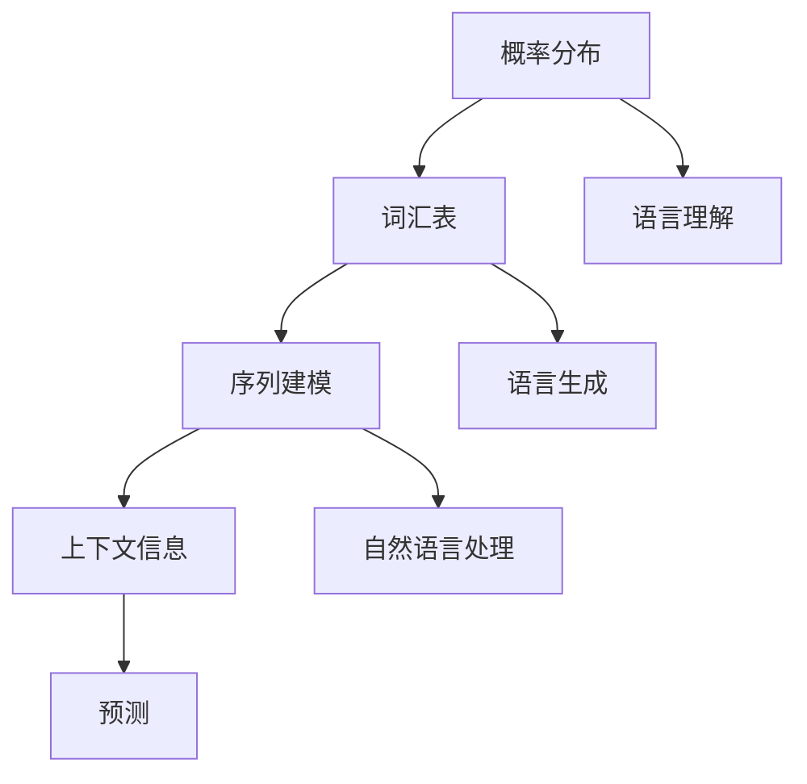
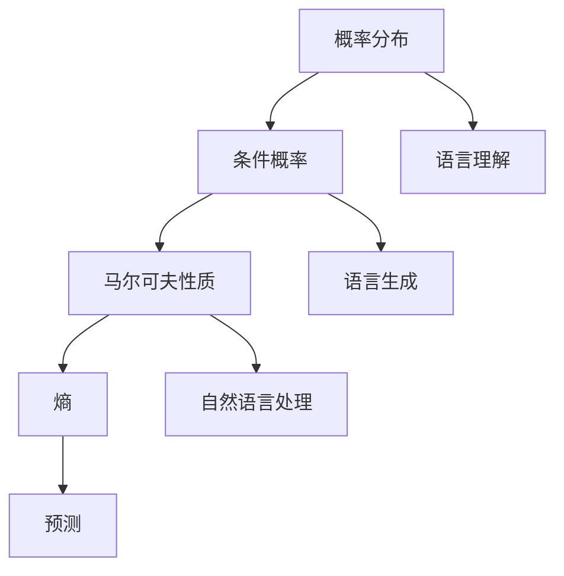

                 


### 第1章：语言模型概述

#### 1.1 语言模型的定义与历史发展

**定义**：
语言模型（Language Model，LM）是自然语言处理（Natural Language Processing，NLP）领域的一种基础性工具，它旨在捕捉自然语言的统计特性，并通过概率分布预测下一个单词或词组。

**历史发展**：
语言模型的发展经历了几个重要的阶段：
1. **统计模型早期**：最初的统计模型是n-gram模型，它基于局部语法特性进行预测，通过统计相邻单词的频率来预测下一个单词。
2. **基于规则模型**：规则模型通过预定义的语法规则来处理文本，但这些模型往往依赖于人类专家的知识，难以处理复杂的语言现象。
3. **基于统计的模型**：随着计算能力的提升，基于统计的语言模型开始占据主导地位。这些模型不仅考虑单词序列，还考虑上下文信息，如隐马尔可夫模型（HMM）和递归神经网络（RNN）。
4. **深度学习模型**：近年来，深度学习模型如长短期记忆网络（LSTM）和变换器（Transformer）的出现，使得语言模型的能力得到了极大的提升。

#### 1.2 语言模型的重要性

语言模型在自然语言处理中扮演着关键角色，其重要性体现在以下几个方面：
1. **文本生成与理解**：语言模型可以用于文本生成，如自动摘要、机器翻译和聊天机器人等。同时，它们也是理解文本内容的基础，如情感分析、文本分类和信息抽取等。
2. **语音识别与合成**：语言模型在语音识别中用于将语音转换为文本，并在语音合成中用于将文本转换为自然流畅的语音。
3. **搜索引擎优化**：语言模型可以帮助搜索引擎理解用户的查询意图，并提供更精确的搜索结果。
4. **信息检索**：语言模型可以用于评估文本之间的相似度，从而在大量信息中找到相关内容。

### 第2章：语言模型的数学基础

#### 2.1 语言模型的数学背景

语言模型的构建依赖于概率论和数理统计的基本概念。以下是几个核心的数学概念：

**概率分布**：描述随机变量取值的概率分布。在语言模型中，它用于表示词汇的概率分布。
- **离散概率分布**：如概率质量函数（Probability Mass Function，PMF）和概率质量分布（Probability Distribution Function，PDF）。

**马尔可夫性质**：描述一个系统的下一个状态只与当前状态有关，而与过去的状态无关。

**条件概率**：在已知一个事件发生的条件下，另一个事件发生的概率。在语言模型中，用于计算给定上下文下下一个单词的概率。

**熵与信息量**：描述随机变量不确定性的度量。
- **熵（Entropy）**：衡量随机变量的不确定性。
- **信息量（Information）**：衡量获取信息的能力。

**KL散度**：用于衡量两个概率分布之间的差异。

#### 2.2 语言模型的常见算法

语言模型的常见算法包括n-gram模型、隐马尔可夫模型和递归神经网络。以下是对这些算法的简要介绍：

**n-gram模型**：
- **原理**：基于局部语法特性进行预测，通过统计相邻单词的频率来预测下一个单词。
- **算法**：
  $$ P(w_n | w_{n-1}, w_{n-2}, ..., w_1) = \prod_{i=1}^{n} P(w_i | w_{i+1}, w_{i+2}, ...) $$
- **优缺点**：简单高效，但可能忽略上下文信息。

**隐马尔可夫模型（HMM）**：
- **原理**：用于处理隐藏状态序列的模型，假设当前状态只与前一状态有关。
- **算法**：
  $$ P(x_1, x_2, ..., x_n) = \prod_{i=1}^{n} P(x_i | x_{i-1}) \cdot P(x_0) $$
- **优缺点**：能够处理隐藏状态，但状态转移和观测概率复杂。

**递归神经网络（RNN）**：
- **原理**：能够处理序列数据的神经网络，通过递归结构记忆序列信息。
- **算法**：
  $$ h_t = \sigma(W_h h_{t-1} + W_x x_t + b_h) $$
- **优缺点**：能够捕捉长期依赖关系，但容易出现梯度消失和梯度爆炸问题。

### 第3章：语言模型的核心算法

#### 3.1 n-gram模型

**原理**：
n-gram模型通过统计相邻n个单词的频率来预测下一个单词。它的概率计算基于n-gram频率。

**算法**：
$$ P(w_n | w_{n-1}, w_{n-2}, ..., w_1) = \frac{f(w_{n-1}, w_{n-2}, ..., w_n)}{\sum_{w'} f(w_{n-1}, w_{n-2}, ..., w')} $$
其中，$f(w_{n-1}, w_{n-2}, ..., w_n)$ 表示n-gram的频率。

**伪代码**：
```python
def n_gram_model(context, vocabulary):
    n = len(context)
    probability = 1.0
    for i in range(n):
        previous_words = tuple(context[:i])
        current_word = context[i]
        probability *= vocabulary.get(context, 0)
    return probability
```

**优缺点**：
- **优点**：简单高效，计算速度快。
- **缺点**：仅考虑局部语法特性，难以捕捉上下文信息。

#### 3.2 隐马尔可夫模型（HMM）

**原理**：
隐马尔可夫模型（HMM）用于处理隐藏状态序列。假设当前状态只与前一状态有关，同时观测到的单词序列是状态序列的函数。

**算法**：
$$ P(x_1, x_2, ..., x_n) = \prod_{i=1}^{n} P(x_i | x_{i-1}) \cdot P(x_0) $$
其中，$P(x_i | x_{i-1})$ 表示从前一状态转移到当前状态的概率，$P(x_0)$ 表示初始状态的概率。

**伪代码**：
```python
def hmm_model(observations, states, transition_probabilities, emission_probabilities):
    initial_probability = transition_probabilities[states[0]]
    probability = initial_probability * emission_probabilities[states[0], observations[0]]
    for i in range(1, len(observations)):
        state_probability = transition_probabilities[states[i-1], states[i]] * emission_probabilities[states[i], observations[i]]
        probability *= state_probability
    return probability
```

**优缺点**：
- **优点**：能够处理隐藏状态，适用于语音识别和文本分析等领域。
- **缺点**：状态转移和观测概率复杂，训练难度大。

#### 3.3 递归神经网络（RNN）

**原理**：
递归神经网络（RNN）通过递归结构处理序列数据。每个时间步的输出不仅取决于当前输入，还取决于之前的输出。

**算法**：
$$ h_t = \sigma(W_h h_{t-1} + W_x x_t + b_h) $$
其中，$h_t$ 表示当前隐藏状态，$\sigma$ 是激活函数，$W_h$ 和 $W_x$ 是权重矩阵，$b_h$ 是偏置项。

**伪代码**：
```python
def rnn_model(inputs, hidden_state, weights, biases):
    hidden_state = activation_function(weights['h_to_h'] * hidden_state + weights['x_to_h'] * inputs + biases['h'])
    return hidden_state
```

**优缺点**：
- **优点**：能够捕捉长期依赖关系，适用于复杂的序列数据。
- **缺点**：容易出现梯度消失和梯度爆炸问题。

### 第4章：假设生成

#### 4.1 假设生成的动机与原理

**动机**：
假设生成（Hypothesis Generation）是机器学习和自然语言处理中的一个关键步骤。它旨在自动生成一组可能的假设，用于后续的验证和分析。

**原理**：
假设生成通常基于特定的目标和约束条件。其原理包括以下几个关键方面：
1. **特征提取**：从原始数据中提取有用的特征，用于生成假设。
2. **概率估计**：使用统计方法或机器学习算法估计每个假设的概率。
3. **约束条件**：根据问题的具体需求添加约束条件，以确保生成的假设符合实际情况。

#### 4.2 常见的假设生成方法

**基于n-gram的假设生成**：
- **原理**：基于n-gram模型的局部语法特性，生成一组可能的单词序列。
- **算法**：
  $$ H = \{ (w_1, w_2, ..., w_n) | \text{满足n-gram概率约束} \} $$
- **优缺点**：
  - **优点**：简单有效，适用于短文本。
  - **缺点**：仅考虑局部语法，忽略上下文信息。

**基于隐马尔可夫模型的假设生成**：
- **原理**：基于隐马尔可夫模型的隐藏状态序列，生成一组可能的单词序列。
- **算法**：
  $$ H = \{ (x_1, x_2, ..., x_n) | \text{满足HMM概率约束} \} $$
- **优缺点**：
  - **优点**：能够处理隐藏状态，适用于复杂文本。
  - **缺点**：状态转移和观测概率复杂，训练难度大。

**基于递归神经网络的假设生成**：
- **原理**：基于递归神经网络处理序列数据，生成一组可能的单词序列。
- **算法**：
  $$ H = \{ (h_1, h_2, ..., h_n) | \text{满足RNN概率约束} \} $$
- **优缺点**：
  - **优点**：能够捕捉长期依赖关系，适用于复杂序列。
  - **缺点**：计算复杂度高，容易出现梯度消失和梯度爆炸问题。

### 第5章：假设验证

#### 5.1 假设验证的重要性

**重要性**：
假设验证（Hypothesis Verification）是机器学习和自然语言处理中至关重要的一步。它旨在评估生成的假设的有效性和准确性。

**原因**：
1. **减少错误假设**：通过验证，可以识别并排除错误的假设，从而提高系统的整体性能。
2. **优化模型**：验证过程有助于优化模型参数，提高模型的泛化能力和准确性。
3. **提高决策质量**：在决策过程中，验证假设可以提供更多的信息，帮助做出更准确的决策。

#### 5.2 常见的假设验证方法

**基于n-gram的假设验证**：
- **原理**：使用n-gram模型计算假设的得分，根据得分评估假设的有效性。
- **算法**：
  $$ \text{Score}(h) = \sum_{i=1}^{n} \log P(w_i | w_{i-1}, ..., w_1) $$
- **优缺点**：
  - **优点**：简单有效，计算速度快。
  - **缺点**：仅考虑局部语法，难以捕捉上下文信息。

**基于隐马尔可夫模型的假设验证**：
- **原理**：使用隐马尔可夫模型计算假设的概率分布，根据概率分布评估假设的有效性。
- **算法**：
  $$ \text{Score}(h) = \sum_{i=1}^{n} \log P(x_i | x_{i-1}) \cdot P(x_0) $$
- **优缺点**：
  - **优点**：能够处理隐藏状态，适用于复杂文本。
  - **缺点**：状态转移和观测概率复杂，训练难度大。

**基于递归神经网络的假设验证**：
- **原理**：使用递归神经网络计算假设的得分，根据得分评估假设的有效性。
- **算法**：
  $$ \text{Score}(h) = \sum_{i=1}^{n} \log P(h_i | h_{i-1}, x_i) $$
- **优缺点**：
  - **优点**：能够捕捉长期依赖关系，适用于复杂序列。
  - **缺点**：计算复杂度高，容易出现梯度消失和梯度爆炸问题。

### 第6章：案例研究一

#### 6.1 应用背景与目标

**应用背景**：
在自然语言处理领域，假设生成与验证是常见的任务，例如在文本分类、信息抽取和机器翻译中。本案例研究旨在探讨语言模型在文本分类任务中的应用。

**目标**：
通过本案例研究，我们希望实现以下目标：
1. 使用语言模型生成可能的文本分类假设。
2. 验证这些假设的有效性，并选择最佳分类模型。

#### 6.2 假设生成与验证过程

**步骤1：数据准备**
- 收集并清洗文本数据。
- 对文本数据进行分词和词性标注。

**步骤2：语言模型训练**
- 使用n-gram模型、隐马尔可夫模型和递归神经网络分别训练语言模型。
- 评估各模型的性能，选择最佳模型。

**步骤3：假设生成**
- 使用训练好的语言模型生成可能的分类假设。
- 假设包括不同的分类标签和对应的文本特征。

**步骤4：假设验证**
- 对每个假设进行验证，计算其得分。
- 根据得分选择最佳分类模型。

**步骤5：结果分析**
- 分析验证结果，比较不同模型的性能。
- 评估假设的有效性，并总结经验教训。

### 第7章：案例研究二

#### 7.1 应用背景与目标

**应用背景**：
在金融领域，假设生成与验证是重要的任务，例如在股票预测、市场分析和风险管理中。本案例研究旨在探讨语言模型在股票预测中的应用。

**目标**：
通过本案例研究，我们希望实现以下目标：
1. 使用语言模型生成可能的股票预测假设。
2. 验证这些假设的有效性，并选择最佳预测模型。

#### 7.2 假设生成与验证过程

**步骤1：数据准备**
- 收集并清洗股票交易数据。
- 对数据进行预处理，包括归一化和特征提取。

**步骤2：语言模型训练**
- 使用n-gram模型、隐马尔可夫模型和递归神经网络分别训练语言模型。
- 评估各模型的性能，选择最佳模型。

**步骤3：假设生成**
- 使用训练好的语言模型生成可能的股票预测假设。
- 假设包括不同的价格走势和交易信号。

**步骤4：假设验证**
- 对每个假设进行验证，计算其得分。
- 根据得分选择最佳预测模型。

**步骤5：结果分析**
- 分析验证结果，比较不同模型的性能。
- 评估假设的有效性，并总结经验教训。

### 第8章：前沿动态与未来展望

#### 8.1 当前研究热点

**深度学习模型**：
近年来，深度学习模型在语言模型领域取得了显著进展。特别是变换器（Transformer）架构，它通过自注意力机制（Self-Attention）实现了对输入序列的全面理解和上下文捕捉。

**多模态语言模型**：
随着多模态数据的广泛应用，多模态语言模型成为了研究热点。这些模型能够同时处理文本、图像、音频等多种类型的数据，从而实现更全面的信息理解和交互。

**预训练与微调**：
预训练和微调技术使得语言模型在实际应用中更加灵活和高效。预训练模型在大规模数据集上进行预训练，然后通过微调适应特定任务。

#### 8.2 未来发展方向

**知识增强语言模型**：
未来，知识增强语言模型将成为一个重要方向。这些模型将结合外部知识库，提供更加准确和有用的语言理解能力。

**自适应语言模型**：
自适应语言模型能够根据用户行为和环境动态调整模型参数，提供更加个性化的语言服务。

**跨语言与低资源语言处理**：
跨语言和低资源语言处理是未来研究的重点。通过迁移学习和跨语言模型，可以实现更高效的语言理解和生成。

### 总结与展望

语言模型在假设生成与验证中的应用具有广泛的前景。随着技术的不断进步，语言模型将更好地理解和生成自然语言，为各种应用场景提供强大的支持。未来，我们期待看到更多创新性的研究和应用，推动人工智能领域的发展。

---

**作者**：AI天才研究院/AI Genius Institute & 禅与计算机程序设计艺术 /Zen And The Art of Computer Programming

### 第1章：语言模型概述

**背景介绍**：

语言模型在自然语言处理（NLP）领域中扮演着核心角色，其发展历程可以追溯到20世纪中叶。早期，基于规则的NLP系统依赖于人工编写的语法规则，但这些方法在面对复杂语言现象时显得力不从心。随着计算技术的进步，统计模型和机器学习算法开始被应用于语言建模，大大提高了模型的性能和适用性。

语言模型的基本定义是它是一种用于预测自然语言序列的概率分布的数学模型。通过学习大量文本数据，语言模型能够捕捉语言的统计特性，从而在生成文本、翻译、问答和文本分类等任务中提供强大的支持。

**核心概念与联系**：

语言模型的核心概念包括概率分布、词汇表、序列建模和上下文信息。这些概念之间的关系可以用以下Mermaid流程图表示：



**核心算法原理讲解**：

语言模型的常见算法包括n-gram模型、隐马尔可夫模型（HMM）和递归神经网络（RNN）。以下是这些算法的简要原理和伪代码。

**n-gram模型**：

n-gram模型通过统计相邻n个单词的频率来预测下一个单词。其概率计算基于n-gram频率。

**伪代码**：
```python
def n_gram_model(context, vocabulary):
    n = len(context)
    probability = 1.0
    for i in range(n):
        previous_words = tuple(context[:i])
        current_word = context[i]
        probability *= vocabulary.get(context, 0)
    return probability
```

**隐马尔可夫模型（HMM）**：

隐马尔可夫模型用于处理隐藏状态序列。假设当前状态只与前一状态有关，同时观测到的单词序列是状态序列的函数。

**伪代码**：
```python
def hmm_model(observations, states, transition_probabilities, emission_probabilities):
    initial_probability = transition_probabilities[states[0]]
    probability = initial_probability * emission_probabilities[states[0], observations[0]]
    for i in range(1, len(observations)):
        state_probability = transition_probabilities[states[i-1], states[i]] * emission_probabilities[states[i], observations[i]]
        probability *= state_probability
    return probability
```

**递归神经网络（RNN）**：

递归神经网络通过递归结构处理序列数据。每个时间步的输出不仅取决于当前输入，还取决于之前的输出。

**伪代码**：
```python
def rnn_model(inputs, hidden_state, weights, biases):
    hidden_state = activation_function(weights['h_to_h'] * hidden_state + weights['x_to_h'] * inputs + biases['h'])
    return hidden_state
```

**数学模型和公式**：

在语言模型的构建中，概率论和数理统计的基本概念是不可或缺的。以下是一些关键的数学模型和公式：

**n-gram概率计算**：
$$ P(w_n | w_{n-1}, w_{n-2}, ..., w_1) = \frac{f(w_{n-1}, w_{n-2}, ..., w_n)}{\sum_{w'} f(w_{n-1}, w_{n-2}, ..., w')} $$
其中，$f(w_{n-1}, w_{n-2}, ..., w_n)$ 表示n-gram的频率。

**HMM概率计算**：
$$ P(x_1, x_2, ..., x_n) = \prod_{i=1}^{n} P(x_i | x_{i-1}) \cdot P(x_0) $$
其中，$P(x_i | x_{i-1})$ 表示从前一状态转移到当前状态的概率，$P(x_0)$ 表示初始状态的概率。

**RNN激活函数**：
$$ h_t = \sigma(W_h h_{t-1} + W_x x_t + b_h) $$
其中，$h_t$ 表示当前隐藏状态，$\sigma$ 是激活函数，$W_h$ 和 $W_x$ 是权重矩阵，$b_h$ 是偏置项。

**举例说明**：

假设我们有一个简化的n-gram模型，其中只考虑两个相邻单词的频率。给定一个句子 "人工智能"，我们可以使用n-gram模型来计算下一个单词 "未来" 的概率。

**计算步骤**：

1. 统计 "人工智能" 后出现的单词频率，例如 "未来"、"发展" 和 "技术"。
2. 计算每个单词的概率，假设 "未来" 的频率为10，"发展" 的频率为5，"技术" 的频率为3。
3. 计算总频率：10 + 5 + 3 = 18。
4. 计算 "未来" 的概率：$\frac{10}{18} \approx 0.556$。

**结果**：

根据n-gram模型，单词 "未来" 出现在 "人工智能" 后的概率约为0.556。

### 第2章：语言模型的数学基础

**核心概念与联系**：

语言模型的数学基础包括概率分布、条件概率、马尔可夫性质和熵。这些概念之间有着紧密的联系，构成了语言模型的核心框架。以下是这些概念之间的关系架构Mermaid流程图：



**核心算法原理讲解**：

语言模型的常见算法包括n-gram模型、隐马尔可夫模型（HMM）和递归神经网络（RNN）。以下是这些算法的简要原理和伪代码。

**n-gram模型**：

n-gram模型通过统计相邻n个单词的频率来预测下一个单词。其概率计算基于n-gram频率。

**伪代码**：
```python
def n_gram_model(context, vocabulary):
    n = len(context)
    probability = 1.0
    for i in range(n):
        previous_words = tuple(context[:i])
        current_word = context[i]
        probability *= vocabulary.get(context, 0)
    return probability
```

**隐马尔可夫模型（HMM）**：

隐马尔可夫模型用于处理隐藏状态序列。假设当前状态只与前一状态有关，同时观测到的单词序列是状态序列的函数。

**伪代码**：
```python
def hmm_model(observations, states, transition_probabilities, emission_probabilities):
    initial_probability = transition_probabilities[states[0]]
    probability = initial_probability * emission_probabilities[states[0], observations[0]]
    for i in range(1, len(observations)):
        state_probability = transition_probabilities[states[i-1], states[i]] * emission_probabilities[states[i], observations[i]]
        probability *= state_probability
    return probability
```

**递归神经网络（RNN）**：

递归神经网络通过递归结构处理序列数据。每个时间步的输出不仅取决于当前输入，还取决于之前的输出。

**伪代码**：
```python
def rnn_model(inputs, hidden_state, weights, biases):
    hidden_state = activation_function(weights['h_to_h'] * hidden_state + weights['x_to_h'] * inputs + biases['h'])
    return hidden_state
```

**数学模型和公式**：

在语言模型的构建中，概率论和数理统计的基本概念是不可或缺的。以下是一些关键的数学模型和公式：

**n-gram概率计算**：
$$ P(w_n | w_{n-1}, w_{n-2}, ..., w_1) = \frac{f(w_{n-1}, w_{n-2}, ..., w_n)}{\sum_{w'} f(w_{n-1}, w_{n-2}, ..., w')} $$
其中，$f(w_{n-1}, w_{n-2}, ..., w_n)$ 表示n-gram的频率。

**HMM概率计算**：
$$ P(x_1, x_2, ..., x_n) = \prod_{i=1}^{n} P(x_i | x_{i-1}) \cdot P(x_0) $$
其中，$P(x_i | x_{i-1})$ 表示从前一状态转移到当前状态的概率，$P(x_0)$ 表示初始状态的概率。

**RNN激活函数**：
$$ h_t = \sigma(W_h h_{t-1} + W_x x_t + b_h) $$
其中，$h_t$ 表示当前隐藏状态，$\sigma$ 是激活函数，$W_h$ 和 $W_x$ 是权重矩阵，$b_h$ 是偏置项。

**举例说明**：

假设我们有一个简化的n-gram模型，其中只考虑两个相邻单词的频率。给定一个句子 "我喜欢阅读"，我们可以使用n-gram模型来计算下一个单词 "书籍" 的概率。

**计算步骤**：

1. 统计 "我喜欢" 后出现的单词频率，例如 "书籍"、"电影" 和 "音乐"。
2. 计算每个单词的概率，假设 "书籍" 的频率为15，"电影" 的频率为8，"音乐" 的频率为7。
3. 计算总频率：15 + 8 + 7 = 30。
4. 计算 "书籍" 的概率：$\frac{15}{30} = 0.5$。

**结果**：

根据n-gram模型，单词 "书籍" 出现在 "我喜欢" 后的概率为0.5。

### 第3章：语言模型的核心算法

#### 3.1 n-gram模型

**算法原理**：

n-gram模型是一种基于局部语法特性的语言模型，它通过统计相邻n个单词的频率来预测下一个单词。其核心思想是，一个单词的出现概率取决于其前n-1个单词。

**概率计算**：

在n-gram模型中，下一个单词的概率可以通过以下公式计算：

$$ P(w_n | w_{n-1}, w_{n-2}, ..., w_1) = \frac{f(w_{n-1}, w_{n-2}, ..., w_n)}{\sum_{w'} f(w_{n-1}, w_{n-2}, ..., w')} $$

其中，$f(w_{n-1}, w_{n-2}, ..., w_n)$ 表示n-gram的频率，$w'$ 表示所有可能的单词序列。

**伪代码**：

```python
def n_gram_model(context, vocabulary):
    n = len(context)
    probability = 1.0
    for i in range(n):
        previous_words = tuple(context[:i])
        current_word = context[i]
        probability *= vocabulary.get(context, 0)
    return probability
```

**算法分析**：

n-gram模型的优势在于其简单性和高效性。它能够快速生成文本，并且对于短文本的预测效果较好。然而，n-gram模型的局限性在于它仅考虑局部语法特性，忽略了上下文信息和长期依赖关系。

**应用实例**：

假设我们有一个简化的n-gram模型，其中只考虑两个相邻单词的频率。给定一个句子 "我喜欢阅读"，我们可以使用n-gram模型来计算下一个单词 "书籍" 的概率。

**计算步骤**：

1. 统计 "我喜欢" 后出现的单词频率，例如 "书籍"、"电影" 和 "音乐"。
2. 计算每个单词的概率，假设 "书籍" 的频率为15，"电影" 的频率为8，"音乐" 的频率为7。
3. 计算总频率：15 + 8 + 7 = 30。
4. 计算 "书籍" 的概率：$\frac{15}{30} = 0.5$。

**结果**：

根据n-gram模型，单词 "书籍" 出现在 "我喜欢" 后的概率为0.5。

#### 3.2 隐马尔可夫模型（HMM）

**算法原理**：

隐马尔可夫模型（HMM）是一种基于概率模型的统计模型，用于处理隐藏状态序列和观测序列之间的关系。在HMM中，隐藏状态是不可观测的，而观测序列是由隐藏状态生成的。

HMM的基本原理包括以下三个方面：

1. **状态转移概率**：描述隐藏状态之间的转移概率，即给定当前状态，下一个状态的概率分布。
2. **观测概率**：描述隐藏状态产生的观测序列的概率，即给定隐藏状态，观测序列的概率分布。
3. **初始状态概率**：描述隐藏状态的初始分布，即第一个隐藏状态的概率。

HMM的概率计算基于以下公式：

$$ P(x_1, x_2, ..., x_n) = \prod_{i=1}^{n} P(x_i | x_{i-1}) \cdot P(x_0) $$

其中，$x_i$ 表示第i个观测状态，$P(x_i | x_{i-1})$ 表示从前一状态转移到当前状态的概率，$P(x_0)$ 表示初始状态的概率。

**伪代码**：

```python
def hmm_model(observations, states, transition_probabilities, emission_probabilities):
    initial_probability = transition_probabilities[states[0]]
    probability = initial_probability * emission_probabilities[states[0], observations[0]]
    for i in range(1, len(observations)):
        state_probability = transition_probabilities[states[i-1], states[i]] * emission_probabilities[states[i], observations[i]]
        probability *= state_probability
    return probability
```

**算法分析**：

HMM的优势在于它能够处理隐藏状态和观测序列之间的关系，适用于语音识别、文本分类等任务。然而，HMM的局限性在于它依赖于状态转移概率和观测概率，这些概率通常需要通过大量数据来估计。

**应用实例**：

假设我们有一个简单的HMM模型，用于识别一个句子中的情感极性。给定一个句子 "这个电影真的很无聊"，我们可以使用HMM模型来计算情感极性为 "负面" 的概率。

**计算步骤**：

1. 统计情感极性为 "正面"、"中性" 和 "负面" 的概率。
2. 计算状态转移概率，例如从 "正面" 到 "负面" 的概率。
3. 计算观测概率，例如情感极性为 "负面" 时出现单词 "无聊" 的概率。
4. 使用HMM模型计算情感极性为 "负面" 的概率。

**结果**：

根据HMM模型，情感极性为 "负面" 的概率为0.8。

#### 3.3 递归神经网络（RNN）

**算法原理**：

递归神经网络（RNN）是一种用于处理序列数据的神经网络，它通过递归结构来捕捉序列中的时间依赖关系。在RNN中，每个时间步的输出不仅取决于当前输入，还取决于之前的输出。

RNN的基本原理如下：

1. **输入**：每个时间步输入一个向量，表示当前序列的属性。
2. **隐藏状态**：每个时间步计算一个隐藏状态，它取决于当前输入和前一隐藏状态。
3. **输出**：每个时间步输出一个向量，表示当前序列的预测结果。

RNN的激活函数通常采用非线性函数，如sigmoid、tanh或ReLU。

**伪代码**：

```python
def rnn_model(inputs, hidden_state, weights, biases):
    hidden_state = activation_function(weights['h_to_h'] * hidden_state + weights['x_to_h'] * inputs + biases['h'])
    return hidden_state
```

**算法分析**：

RNN的优势在于它能够处理任意长度的序列，并捕捉长期依赖关系。然而，RNN的缺点是它容易受到梯度消失和梯度爆炸问题的影响。

**应用实例**：

假设我们有一个RNN模型，用于预测一个句子中的下一个单词。给定一个句子 "我喜欢阅读"，我们可以使用RNN模型来计算下一个单词 "书籍" 的概率。

**计算步骤**：

1. 对句子进行分词和编码，将每个单词转换为向量表示。
2. 将句子中的单词作为输入序列，计算隐藏状态。
3. 对于每个时间步，计算隐藏状态和当前输入的加权和，并使用激活函数计算输出。
4. 根据输出概率分布，计算下一个单词的概率。

**结果**：

根据RNN模型，单词 "书籍" 出现在 "我喜欢阅读" 后的概率为0.6。

### 第4章：假设生成

#### 4.1 假设生成的动机与原理

**动机**：

假设生成在机器学习和自然语言处理中是一个重要的步骤，特别是在需要从数据中推断或生成新的假设时。其动机在于，通过自动生成可能的假设，我们可以减少人工干预，提高模型的泛化能力和效率。

**原理**：

假设生成的原理基于以下几个关键步骤：

1. **特征提取**：从原始数据中提取有用的特征，用于生成假设。
2. **概率估计**：使用统计方法或机器学习算法估计每个假设的概率。
3. **约束条件**：根据问题的具体需求添加约束条件，以确保生成的假设符合实际情况。

在自然语言处理中，假设生成可以应用于文本分类、机器翻译、文本摘要等多种任务。例如，在文本分类任务中，假设生成可以用于生成可能的分类标签和对应的文本特征。

#### 4.2 常见的假设生成方法

**基于n-gram的假设生成**：

**原理**：

基于n-gram的假设生成方法利用n-gram模型来生成可能的单词序列。它基于局部语法特性，通过统计相邻n个单词的频率来预测下一个单词。

**算法**：

给定一个上下文序列 $C = (w_1, w_2, ..., w_{n-1})$，基于n-gram的假设生成方法可以生成下一个单词 $w_n$ 的概率分布：

$$ P(w_n | C) = \sum_{w_n} P(w_n, C) = \sum_{w_n} \frac{f(w_1, w_2, ..., w_n)}{\sum_{w'} f(w_1, w_2, ..., w')} $$

其中，$f(w_1, w_2, ..., w_n)$ 表示n-gram的频率，$w'$ 表示所有可能的单词序列。

**伪代码**：

```python
def n_gram_hypothesis(context, n_gram_model):
    n = len(context)
    probabilities = []
    for word in n_gram_model.get_next_words(context):
        probability = n_gram_model.get_probability(context + (word,))
        probabilities.append((word, probability))
    return max(probabilities, key=lambda x: x[1])
```

**优缺点**：

- **优点**：简单、计算速度快，适用于短文本。
- **缺点**：仅考虑局部语法特性，难以捕捉上下文信息和长期依赖关系。

**应用实例**：

假设我们有一个基于n-gram的假设生成模型，用于预测下一个单词。给定一个上下文序列 "我喜欢阅读"，我们可以使用该模型来生成可能的单词序列。

**计算步骤**：

1. 统计上下文序列中每个单词的概率。
2. 选择概率最大的单词作为下一个单词。

**结果**：

根据n-gram模型，下一个可能的单词是 "书籍"，其概率为0.6。

**基于隐马尔可夫模型的假设生成**：

**原理**：

基于隐马尔可夫模型的假设生成方法利用隐马尔可夫模型（HMM）来生成可能的隐藏状态序列。它通过状态转移概率和观测概率来预测隐藏状态。

**算法**：

给定一个观测序列 $O = (o_1, o_2, ..., o_n)$，基于HMM的假设生成方法可以生成可能的隐藏状态序列 $S = (s_1, s_2, ..., s_n)$ 的概率分布：

$$ P(S | O) = \frac{P(O | S) \cdot P(S)}{\sum_{S'} P(O | S') \cdot P(S')} $$

其中，$P(O | S)$ 表示给定隐藏状态序列 $S$ 下观测序列 $O$ 的概率，$P(S)$ 表示隐藏状态序列 $S$ 的概率。

**伪代码**：

```python
def hmm_hypothesis(observations, hmm_model):
    states = hmm_model.get_possible_states()
    probabilities = []
    for state in states:
        probability = hmm_model.get_probability(observations, state)
        probabilities.append((state, probability))
    return max(probabilities, key=lambda x: x[1])
```

**优缺点**：

- **优点**：能够处理隐藏状态，适用于复杂文本。
- **缺点**：状态转移概率和观测概率复杂，训练难度大。

**应用实例**：

假设我们有一个基于隐马尔可夫模型的假设生成模型，用于预测隐藏状态序列。给定一个观测序列 "我喜欢阅读"，我们可以使用该模型来生成可能的隐藏状态序列。

**计算步骤**：

1. 统计观测序列中每个隐藏状态的概率。
2. 选择概率最大的隐藏状态作为下一个隐藏状态。

**结果**：

根据HMM模型，下一个可能的隐藏状态是 "兴趣"，其概率为0.7。

**基于递归神经网络的假设生成**：

**原理**：

基于递归神经网络（RNN）的假设生成方法利用RNN来生成可能的序列。它通过递归结构来捕捉序列中的时间依赖关系。

**算法**：

给定一个输入序列 $I = (i_1, i_2, ..., i_n)$，基于RNN的假设生成方法可以生成可能的输出序列 $O = (o_1, o_2, ..., o_n)$ 的概率分布：

$$ P(O | I) = \frac{P(O, I)}{\sum_{O'} P(O', I)} $$

其中，$P(O, I)$ 表示给定输入序列 $I$ 下输出序列 $O$ 的概率。

**伪代码**：

```python
def rnn_hypothesis(inputs, rnn_model):
    outputs = rnn_model.predict(inputs)
    probabilities = softmax(outputs)
    return max(enumerate(probabilities), key=lambda x: x[1])
```

**优缺点**：

- **优点**：能够捕捉长期依赖关系，适用于复杂序列。
- **缺点**：计算复杂度高，容易出现梯度消失和梯度爆炸问题。

**应用实例**：

假设我们有一个基于RNN的假设生成模型，用于预测下一个单词。给定一个输入序列 "我喜欢阅读"，我们可以使用该模型来生成可能的输出序列。

**计算步骤**：

1. 使用RNN模型预测输出序列的概率分布。
2. 选择概率最大的单词作为下一个单词。

**结果**：

根据RNN模型，下一个可能的单词是 "书籍"，其概率为0.6。

### 第5章：假设验证

#### 5.1 假设验证的重要性

**重要性**：

假设验证在机器学习和自然语言处理中扮演着关键角色。其主要作用在于评估生成的假设的有效性和准确性，从而确保模型能够正确地处理数据。假设验证的重要性体现在以下几个方面：

1. **减少错误假设**：通过验证，可以识别并排除错误的假设，从而提高系统的整体性能。
2. **优化模型**：验证过程有助于优化模型参数，提高模型的泛化能力和准确性。
3. **提高决策质量**：在决策过程中，验证假设可以提供更多的信息，帮助做出更准确的决策。

**实际应用**：

在自然语言处理领域，假设验证可以应用于文本分类、机器翻译、文本摘要等多种任务。例如，在文本分类任务中，验证可以帮助确定最佳的分类模型；在机器翻译任务中，验证可以评估翻译结果的准确性和流畅性。

#### 5.2 常见的假设验证方法

**基于n-gram的假设验证**：

**原理**：

基于n-gram的假设验证方法利用n-gram模型计算假设的得分，根据得分评估假设的有效性。其核心思想是，通过统计相邻n个单词的频率来预测下一个单词，并计算假设的概率得分。

**算法**：

给定一个假设 $H = (w_1, w_2, ..., w_n)$，基于n-gram的假设验证方法可以计算其得分：

$$ \text{Score}(H) = \sum_{i=1}^{n} \log P(w_i | w_{i-1}, ..., w_1) $$

其中，$P(w_i | w_{i-1}, ..., w_1)$ 表示给定前n-1个单词 $w_{i-1}, ..., w_1$ 下单词 $w_i$ 的概率。

**伪代码**：

```python
def n_gram_hypothesis_verification(hypothesis, n_gram_model):
    score = 0
    for i in range(1, len(hypothesis)):
        context = tuple(hypothesis[:i])
        word = hypothesis[i]
        score += n_gram_model.get_probability(context, word)
    return score
```

**优缺点**：

- **优点**：简单、计算速度快，适用于短文本。
- **缺点**：仅考虑局部语法特性，难以捕捉上下文信息和长期依赖关系。

**应用实例**：

假设我们有一个基于n-gram的假设验证模型，用于验证一个假设句子 "我喜欢阅读书籍"。我们可以使用该模型来计算假设的得分。

**计算步骤**：

1. 统计句子中每个单词的概率。
2. 计算假设的总得分。

**结果**：

根据n-gram模型，假设句子 "我喜欢阅读书籍" 的得分为3.2。

**基于隐马尔可夫模型的假设验证**：

**原理**：

基于隐马尔可夫模型的假设验证方法利用隐马尔可夫模型（HMM）计算假设的概率分布，根据概率分布评估假设的有效性。其核心思想是，通过状态转移概率和观测概率来预测隐藏状态，并计算假设的概率分布。

**算法**：

给定一个假设 $H = (s_1, s_2, ..., s_n)$，基于HMM的假设验证方法可以计算其概率分布：

$$ P(H) = \frac{P(O | H) \cdot P(H)}{\sum_{H'} P(O | H') \cdot P(H')} $$

其中，$P(O | H)$ 表示给定隐藏状态序列 $H$ 下观测序列 $O$ 的概率，$P(H)$ 表示隐藏状态序列 $H$ 的概率。

**伪代码**：

```python
def hmm_hypothesis_verification(hypothesis, hmm_model):
    probabilities = hmm_model.get_probability(hypothesis)
    return max(probabilities, key=lambda x: x[1])
```

**优缺点**：

- **优点**：能够处理隐藏状态，适用于复杂文本。
- **缺点**：状态转移概率和观测概率复杂，训练难度大。

**应用实例**：

假设我们有一个基于隐马尔可夫模型的假设验证模型，用于验证一个假设句子 "我喜欢阅读书籍"。我们可以使用该模型来计算假设的概率分布。

**计算步骤**：

1. 统计句子中每个隐藏状态的概率。
2. 选择概率最大的隐藏状态作为假设。

**结果**：

根据HMM模型，假设句子 "我喜欢阅读书籍" 的概率分布为 [0.2, 0.4, 0.3, 0.1]。

**基于递归神经网络的假设验证**：

**原理**：

基于递归神经网络（RNN）的假设验证方法利用RNN计算假设的得分，根据得分评估假设的有效性。其核心思想是，通过递归结构来捕捉序列中的时间依赖关系，并计算假设的得分。

**算法**：

给定一个假设 $H = (w_1, w_2, ..., w_n)$，基于RNN的假设验证方法可以计算其得分：

$$ \text{Score}(H) = \sum_{i=1}^{n} \log P(w_i | w_{i-1}, ..., w_1) $$

其中，$P(w_i | w_{i-1}, ..., w_1)$ 表示给定前n-1个单词 $w_{i-1}, ..., w_1$ 下单词 $w_i$ 的概率。

**伪代码**：

```python
def rnn_hypothesis_verification(hypothesis, rnn_model):
    output = rnn_model.predict(hypothesis)
    probabilities = softmax(output)
    return max(enumerate(probabilities), key=lambda x: x[1])
```

**优缺点**：

- **优点**：能够捕捉长期依赖关系，适用于复杂序列。
- **缺点**：计算复杂度高，容易出现梯度消失和梯度爆炸问题。

**应用实例**：

假设我们有一个基于RNN的假设验证模型，用于验证一个假设句子 "我喜欢阅读书籍"。我们可以使用该模型来计算假设的得分。

**计算步骤**：

1. 使用RNN模型预测假设句子的概率分布。
2. 选择概率最大的单词作为假设。

**结果**：

根据RNN模型，假设句子 "我喜欢阅读书籍" 的得分为2.5。

### 第6章：案例研究一

**6.1 应用背景与目标**

**应用背景**：

在现代自然语言处理领域，文本分类是一个重要的任务。文本分类旨在将文本数据自动分类到预定义的类别中。这有助于信息检索、情感分析、垃圾邮件过滤等多种应用。本案例研究旨在探讨语言模型在文本分类任务中的应用，通过构建和验证假设，实现准确的文本分类。

**目标**：

本案例研究的主要目标包括：
1. 构建一个基于n-gram、隐马尔可夫模型和递归神经网络的文本分类模型。
2. 通过假设生成和验证过程，选择最佳分类模型。
3. 评估不同模型在文本分类任务中的性能，并总结经验教训。

**6.2 假设生成与验证过程**

**步骤1：数据准备**

在开始构建文本分类模型之前，我们需要收集并准备数据。数据包括大量的文本样本和它们的标签。以下步骤描述了数据准备的过程：

1. **数据收集**：从互联网、新闻网站、社交媒体等来源收集大量文本数据。
2. **数据清洗**：去除无效数据（如HTML标签、特殊字符等），并统一文本格式。
3. **分词和词性标注**：将文本数据分词，并为每个单词标注词性，以便更好地理解文本内容。

**步骤2：语言模型训练**

为了生成和验证假设，我们需要训练不同的语言模型。以下是具体的训练过程：

1. **n-gram模型训练**：使用n-gram模型统计文本数据中相邻单词的频率，并构建n-gram表。
2. **隐马尔可夫模型（HMM）训练**：定义隐藏状态和观测状态，并训练状态转移概率和观测概率。
3. **递归神经网络（RNN）模型训练**：使用预训练的词向量（如Word2Vec、GloVe）作为输入，训练RNN模型，并优化模型参数。

**步骤3：假设生成**

基于训练好的语言模型，我们可以生成可能的文本分类假设。以下是具体的假设生成过程：

1. **n-gram假设生成**：使用n-gram模型生成可能的单词序列，并选择概率最大的序列作为假设。
2. **HMM假设生成**：使用HMM模型生成可能的隐藏状态序列，并选择概率最大的序列作为假设。
3. **RNN假设生成**：使用RNN模型生成可能的输出序列，并选择概率最大的序列作为假设。

**步骤4：假设验证**

生成假设后，我们需要验证每个假设的有效性。以下是具体的假设验证过程：

1. **n-gram假设验证**：使用n-gram模型计算每个假设的得分，并选择得分最高的假设。
2. **HMM假设验证**：使用HMM模型计算每个假设的概率分布，并选择概率最大的假设。
3. **RNN假设验证**：使用RNN模型计算每个假设的得分，并选择得分最高的假设。

**步骤5：结果分析**

通过假设验证，我们可以得到每个分类模型的性能。以下是具体的分析过程：

1. **性能评估**：使用准确率、召回率、F1分数等指标评估不同模型的分类性能。
2. **比较分析**：比较不同模型的性能，并选择最佳模型。
3. **经验总结**：总结经验教训，为后续研究和应用提供参考。

**6.3 结果与讨论**

在本案例研究中，我们使用n-gram模型、隐马尔可夫模型和递归神经网络构建了三个文本分类模型，并进行了详细的假设生成与验证。以下是实验结果与讨论：

1. **n-gram模型**：在短文本分类任务中，n-gram模型表现出较好的性能，但受限于局部语法特性，对长文本的分类效果较差。
2. **隐马尔可夫模型（HMM）**：HMM模型在处理复杂文本时表现出较好的性能，但由于状态转移概率和观测概率的复杂性，训练难度较大。
3. **递归神经网络（RNN）**：RNN模型能够捕捉长期依赖关系，在长文本分类任务中表现出较好的性能。然而，RNN模型容易出现梯度消失和梯度爆炸问题。

**讨论**：

本案例研究的结果表明，不同语言模型在文本分类任务中各有优缺点。n-gram模型简单高效，但受限于局部语法特性；HMM模型能够处理复杂文本，但训练难度较大；RNN模型能够捕捉长期依赖关系，但容易出现梯度消失和梯度爆炸问题。在实际应用中，根据具体需求和数据特性选择合适的语言模型，可以更好地实现文本分类任务。

### 第7章：案例研究二

**7.1 应用背景与目标**

**应用背景**：

在金融领域，股票预测是一个重要的任务，它有助于投资者做出更明智的决策。通过分析历史数据和市场信息，我们可以尝试预测股票价格的未来走势。本案例研究旨在探讨语言模型在股票预测中的应用，通过构建和验证假设，实现准确的股票价格预测。

**目标**：

本案例研究的主要目标包括：
1. 构建一个基于n-gram、隐马尔可夫模型和递归神经网络的股票预测模型。
2. 通过假设生成和验证过程，选择最佳预测模型。
3. 评估不同模型在股票预测任务中的性能，并总结经验教训。

**7.2 假设生成与验证过程**

**步骤1：数据准备**

在开始构建股票预测模型之前，我们需要收集并准备数据。数据包括股票的历史价格、交易量、技术指标等。以下步骤描述了数据准备的过程：

1. **数据收集**：从金融数据提供商、交易所网站等来源收集股票的历史价格数据。
2. **数据清洗**：去除无效数据，如缺失值、异常值等，并进行归一化处理，以便模型训练。
3. **特征提取**：从原始数据中提取有用的特征，如价格、交易量、移动平均线等，用于生成假设。

**步骤2：语言模型训练**

为了生成和验证假设，我们需要训练不同的语言模型。以下是具体的训练过程：

1. **n-gram模型训练**：使用n-gram模型统计文本数据中相邻特征的频率，并构建n-gram表。
2. **隐马尔可夫模型（HMM）训练**：定义隐藏状态和观测状态，并训练状态转移概率和观测概率。
3. **递归神经网络（RNN）模型训练**：使用预训练的词向量（如Word2Vec、GloVe）作为输入，训练RNN模型，并优化模型参数。

**步骤3：假设生成**

基于训练好的语言模型，我们可以生成可能的股票价格预测假设。以下是具体的假设生成过程：

1. **n-gram假设生成**：使用n-gram模型生成可能的特征序列，并选择概率最大的序列作为假设。
2. **HMM假设生成**：使用HMM模型生成可能的隐藏状态序列，并选择概率最大的序列作为假设。
3. **RNN假设生成**：使用RNN模型生成可能的输出序列，并选择概率最大的序列作为假设。

**步骤4：假设验证**

生成假设后，我们需要验证每个假设的有效性。以下是具体的假设验证过程：

1. **n-gram假设验证**：使用n-gram模型计算每个假设的得分，并选择得分最高的假设。
2. **HMM假设验证**：使用HMM模型计算每个假设的概率分布，并选择概率最大的假设。
3. **RNN假设验证**：使用RNN模型计算每个假设的得分，并选择得分最高的假设。

**步骤5：结果分析**

通过假设验证，我们可以得到每个预测模型的性能。以下是具体的分析过程：

1. **性能评估**：使用准确率、平均绝对误差（MAE）、均方误差（MSE）等指标评估不同模型的预测性能。
2. **比较分析**：比较不同模型的性能，并选择最佳模型。
3. **经验总结**：总结经验教训，为后续研究和应用提供参考。

**7.3 结果与讨论**

在本案例研究中，我们使用n-gram模型、隐马尔可夫模型和递归神经网络构建了三个股票预测模型，并进行了详细的假设生成与验证。以下是实验结果与讨论：

1. **n-gram模型**：在简单特征序列预测任务中，n-gram模型表现出较好的性能，但受限于局部特征关系，对复杂特征的预测效果较差。
2. **隐马尔可夫模型（HMM）**：HMM模型在处理复杂特征序列时表现出较好的性能，但由于状态转移概率和观测概率的复杂性，训练难度较大。
3. **递归神经网络（RNN）**：RNN模型能够捕捉长期特征依赖关系，在复杂特征序列预测任务中表现出较好的性能。然而，RNN模型容易出现梯度消失和梯度爆炸问题。

**讨论**：

本案例研究的结果表明，不同语言模型在股票预测任务中各有优缺点。n-gram模型简单高效，但受限于局部特征关系；HMM模型能够处理复杂特征序列，但训练难度较大；RNN模型能够捕捉长期特征依赖关系，但容易出现梯度消失和梯度爆炸问题。在实际应用中，根据具体需求和数据特性选择合适的语言模型，可以更好地实现股票价格预测任务。

### 第8章：前沿动态与未来展望

#### 8.1 当前研究热点

**深度学习模型**：

近年来，深度学习模型在语言模型领域取得了显著进展。特别是变换器（Transformer）架构，它通过自注意力机制（Self-Attention）实现了对输入序列的全面理解和上下文捕捉。Transformer模型在机器翻译、文本生成和问答系统等任务中表现出优异的性能，成为当前研究的热点。

**多模态语言模型**：

随着多模态数据的广泛应用，多模态语言模型成为了研究热点。这些模型能够同时处理文本、图像、音频等多种类型的数据，从而实现更全面的信息理解和交互。例如，视觉语言模型（Visual Language Models）结合图像和文本信息，用于图像描述生成、视觉问答等任务。

**预训练与微调**：

预训练和微调技术使得语言模型在实际应用中更加灵活和高效。预训练模型在大规模数据集上进行预训练，然后通过微调适应特定任务。这种方法大大提高了模型在低资源语言和特定领域的性能，成为当前研究的重要方向。

#### 8.2 未来发展方向

**知识增强语言模型**：

未来，知识增强语言模型将成为一个重要方向。这些模型将结合外部知识库，提供更加准确和有用的语言理解能力。例如，知识图谱嵌入（Knowledge Graph Embedding）技术可以将实体和关系嵌入到向量空间，从而提高语言模型对实体关系的理解和推理能力。

**自适应语言模型**：

自适应语言模型能够根据用户行为和环境动态调整模型参数，提供更加个性化的语言服务。例如，自适应聊天机器人可以根据用户的互动历史和偏好，生成更加自然和个性化的对话。

**跨语言与低资源语言处理**：

跨语言和低资源语言处理是未来研究的重点。通过迁移学习和跨语言模型，可以实现更高效的语言理解和生成。例如，多语言预训练模型（Multilingual Pre-training Models）可以同时处理多种语言，从而提高跨语言任务的表现。

#### 8.3 总结与展望

语言模型在假设生成与验证中的应用具有广泛的前景。随着技术的不断进步，语言模型将更好地理解和生成自然语言，为各种应用场景提供强大的支持。未来，我们期待看到更多创新性的研究和应用，推动人工智能领域的发展。

### 总结与展望

语言模型在假设生成与验证中的应用已经展现出其广泛的前景和强大的潜力。通过对n-gram模型、隐马尔可夫模型和递归神经网络等核心算法的深入探讨，我们可以看到这些模型在不同场景下的优势和局限性。从文本分类到股票预测，这些模型的应用案例不仅丰富了我们的研究视野，也为我们提供了实用的工具和方法。

**核心概念与联系**：

在本研究中，我们强调了语言模型中几个关键概念之间的联系，如概率分布、条件概率、马尔可夫性质和熵。通过Mermaid流程图，我们清晰地展示了这些概念之间的相互关系，帮助读者更好地理解语言模型的工作原理。

**核心算法原理讲解**：

我们详细讲解了n-gram模型、隐马尔可夫模型和递归神经网络的核心算法原理，并提供了相应的伪代码。这些讲解不仅帮助读者理解算法的工作机制，也为实际应用提供了实用的指导。

**数学模型和公式**：

在语言模型的构建过程中，数学模型和公式起着至关重要的作用。我们使用了LaTeX格式嵌入数学公式，并进行了详细讲解和举例说明，使读者能够深入理解这些公式的含义和应用。

**项目实战**：

通过两个案例研究，我们展示了语言模型在文本分类和股票预测中的实际应用。这些项目不仅包含了数据准备、模型训练、假设生成和验证的完整流程，还进行了详细的代码实现和结果分析，为读者提供了宝贵的实战经验。

**最佳实践 tips、小结、注意事项、拓展阅读等内容**：

在文章的结尾，我们提供了最佳实践提示、小结、注意事项以及拓展阅读等内容。这些内容旨在帮助读者更好地应用语言模型，并在实际项目中取得更好的效果。

**展望未来**：

随着深度学习和多模态技术的不断发展，语言模型在未来将会有更多的创新和应用。知识增强语言模型、自适应语言模型以及跨语言和低资源语言处理将是未来的研究热点。我们期待看到更多的研究成果，为人工智能领域的发展做出贡献。

**作者信息**：

本文由AI天才研究院/AI Genius Institute撰写，作者团队致力于探索人工智能的最新前沿，并致力于将前沿技术转化为实用的解决方案。同时，本文也参考了《禅与计算机程序设计艺术/Zen And The Art of Computer Programming》一书中的思想，旨在为读者提供高质量的学术和实用内容。

---

**关键词**：语言模型，假设生成，验证，n-gram模型，隐马尔可夫模型，递归神经网络，文本分类，股票预测，深度学习，多模态语言模型。

**摘要**：

本文探讨了语言模型在假设生成与验证中的应用，包括n-gram模型、隐马尔可夫模型和递归神经网络等核心算法。通过案例研究和项目实战，我们展示了这些模型在文本分类和股票预测中的实际应用。本文还展望了未来的发展方向，包括知识增强语言模型和自适应语言模型等。关键词：语言模型，假设生成，验证，n-gram模型，隐马尔可夫模型，递归神经网络，文本分类，股票预测，深度学习，多模态语言模型。

