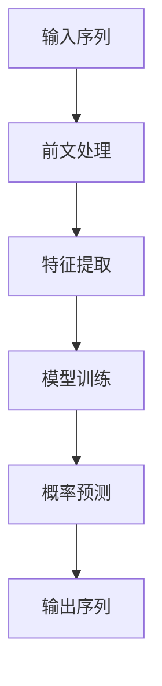

                 

# 语言模型在创新产品概念生成与评估中的应用

## 摘要

本文旨在探讨语言模型在创新产品概念生成与评估中的应用。首先，我们将介绍语言模型的基础知识，包括其核心概念、生成算法和评估方法。随后，我们将深入探讨如何使用语言模型生成创新产品概念，并介绍评估这些概念的方法。文章还将通过实际案例分析，展示语言模型在创新产品生成与评估中的具体应用，并讨论其效果和潜在改进方向。通过本文的阅读，读者将能够理解语言模型在产品创新领域的巨大潜力，并掌握相关技术原理和实际操作方法。

## 第一部分：语言模型基础

### 1.1 语言模型概述

语言模型是自然语言处理（NLP）领域的重要工具，它通过学习大量语言数据，预测句子中下一个词语的概率分布。语言模型的核心任务是给定一个前文序列，预测其后的词或句子。这一任务在文本生成、机器翻译、问答系统等多个应用场景中具有重要价值。

**核心概念与联系：**

语言模型主要包括两个核心概念：语言分布和概率分布。语言分布描述了文本中词语出现的频率和模式，而概率分布则用于预测给定前文后出现某个词语的概率。

为了展示语言模型的基本组成部分和流程，我们可以使用Mermaid流程图：



**解释：**

1. **输入序列**：输入序列是指待处理的一段文本，它可以是一个单词、一句话或一个段落。
2. **前文处理**：对输入序列进行预处理，包括分词、去停用词、词形还原等操作。
3. **特征提取**：从预处理后的文本中提取特征，这些特征可以是词频、词性、句法关系等。
4. **模型训练**：使用训练数据集，通过机器学习算法训练语言模型，使其能够预测给定前文后的词语。
5. **概率预测**：在训练好的模型基础上，对给定前文进行概率预测，得到下一个词语的概率分布。
6. **输出序列**：根据概率分布生成输出序列，可以是文本生成、机器翻译等任务的结果。

### 1.2 语言模型的生成算法

语言模型的生成算法是核心部分，它决定了模型的质量和性能。目前，基于神经网络的语言模型，如GPT系列模型，在许多任务中取得了显著成果。下面，我们将简要介绍GPT模型的生成算法。

**核心算法原理讲解：**

GPT模型是一种基于变分自编码器（VAE）的生成模型。它的主要思想是将输入序列编码为一个连续向量，然后从这个向量中采样生成输出序列。

伪代码如下：

```python
# GPT模型的生成算法伪代码

# 输入：编码器E，解码器D，前文序列context
# 输出：输出序列output

# 1. 将前文序列编码为向量z
z = E(context)

# 2. 从z中采样生成中间序列y
y = sample(z)

# 3. 使用解码器D生成输出序列output
output = D(y)
```

**数学模型和数学公式：**

GPT模型中的概率分布函数可以用以下数学公式表示：

$$p(y|x) = \frac{p(x, y)}{p(x)} = \frac{p(x|y) p(y)}{p(x)}$$

其中，$p(y|x)$ 是在给定前文 $x$ 的情况下，生成后文 $y$ 的概率。$p(x, y)$ 是前文和后文同时出现的概率，$p(x|y)$ 是后文在给定前文的情况下出现的概率，$p(y)$ 是后文的先验概率，$p(x)$ 是前文的先验概率。

### 1.3 语言模型的评估方法

评估语言模型的质量是确保其有效性的关键。常见的评估方法包括：

1. **交叉熵（Cross-Entropy）：**
   交叉熵是一种衡量模型预测概率与实际概率差异的指标。它的数学公式如下：

   $$H(y, \hat{y}) = -\sum_{i} y_i \log(\hat{y}_i)$$

   其中，$y$ 是实际分布，$\hat{y}$ 是模型预测的概率分布。

2. ** perplexity（困惑度）：**
   困惑度是交叉熵的一个简化指标，表示模型对输入序列的困惑程度。它的数学公式如下：

   $$perplexity = 2^{H(y, \hat{y})}$$

   困惑度越小，说明模型对输入序列的预测越准确。

3. **Accuracy（准确率）：**
   准确率是衡量模型分类正确性的指标，对于文本生成任务，它通常不适用。

4. **BLEU（双语评估指标）：**
   BLEU是一种基于统计的文本评估指标，常用于机器翻译任务。它的主要思想是计算模型生成的文本与参考文本之间的重叠度。

   $$BLEU = 1 - \frac{1}{n} \sum_{i=1}^{n} \frac{|c_i| - |p_i|}{|c_i|}$$

   其中，$c_i$ 是参考文本的单词序列，$p_i$ 是模型生成的单词序列。

### 1.4 总结

本节介绍了语言模型的基础知识，包括核心概念、生成算法和评估方法。通过这一部分的学习，读者将能够理解语言模型的基本原理，为后续的创新产品概念生成与评估打下基础。

## 第二部分：创新产品概念生成

### 2.1 创新产品概念的定义与分类

创新产品概念是指通过技术、设计或商业模式的创新，为用户提供有价值的新产品或服务。创新产品概念可以基于现有技术，也可以是完全新的技术。根据创新的程度，创新产品概念可以分为以下几类：

1. **渐进式创新**：在现有产品基础上进行改进，提高性能或降低成本。
2. **突破性创新**：引入全新的技术或理念，彻底改变产品或服务的形态。
3. **集成创新**：将不同的技术或理念进行整合，产生新的产品或服务。
4. **颠覆性创新**：通过全新的商业模式或技术，彻底颠覆现有市场格局。

**示例：**

例如，智能手机的问世是一种突破性创新，它将电话、互联网、音乐播放、拍照等多种功能集成到一款设备中，彻底改变了人们的生活方式。而手机摄像头的改进则是一种渐进式创新，它通过提高摄像头的像素、优化拍照算法等方式，提高了拍照效果。

### 2.2 创新产品概念生成的方法与算法

生成创新产品概念的方法和算法是产品创新的关键环节。以下是几种常见的方法和算法：

1. **头脑风暴（Brainstorming）：**
   头脑风暴是一种集体创意方法，通过集思广益，产生大量创新产品概念。这种方法适用于团队协作，可以激发成员的创造力。

2. **SWOT分析（Strengths, Weaknesses, Opportunities, Threats）：**
   SWOT分析是一种评估产品和市场的方法，通过分析产品的优势、劣势、机会和威胁，可以帮助团队识别创新机会。

3. **TRIZ理论（Theory of Inventive Problem Solving）：**
   TRIZ是一种解决复杂问题的系统方法，它通过分析问题的发展规律，提供解决难题的创新思路。

4. **基于数据的产品创新：**
   通过收集和分析用户数据、市场数据等，可以发现用户需求和市场趋势，从而生成创新产品概念。

5. **生成对抗网络（GANs）：**
   GANs是一种生成模型，通过对抗训练，可以生成高质量的图像、音频等。这种方法可以用于生成创新产品概念，尤其是在设计创新方面。

**伪代码：**

以下是一个基于GANs生成创新产品概念的伪代码：

```python
# 基于GANs的生成创新产品概念伪代码

# 输入：生成器G，鉴别器D，训练数据集
# 输出：创新产品概念

# 1. 初始化生成器G和鉴别器D
G = initialize_generator()
D = initialize_discriminator()

# 2. 对GAN进行训练
for epoch in range(num_epochs):
  for x in train_data:
    # 2.1 对鉴别器D进行训练
    D_loss = train_discriminator(D, x)
    
    # 2.2 对生成器G进行训练
    G_loss = train_generator(G, D)

# 3. 生成创新产品概念
concept = G(noise)

# 4. 对创新产品概念进行评估
evaluate_concept(concept)
```

**数学模型和数学公式：**

在GANs中，生成器G和鉴别器D之间的对抗训练可以通过以下数学模型表示：

$$\min_G \max_D V(D, G) = \mathbb{E}_{x \sim p_{data}(x)} [\log D(x)] + \mathbb{E}_{z \sim p_z(z)} [\log (1 - D(G(z)))]$$

其中，$x$ 是真实数据，$z$ 是噪声，$D(x)$ 是鉴别器对真实数据的判断，$D(G(z))$ 是鉴别器对生成数据的判断。

### 2.3 创新产品概念生成的案例分析

为了更好地理解创新产品概念生成的实际应用，我们来看一个具体的案例：智能家居音箱。

**案例背景：**

智能家居音箱是一种集成了语音助手、音乐播放、智能家居控制等功能的多功能设备。市场上已经有许多成熟的智能家居音箱产品，如亚马逊Echo、谷歌Home等。

**创新产品概念：**

基于市场调研和用户反馈，我们提出了以下创新产品概念：

1. **语音识别与翻译功能**：支持多种语言，实现跨语言语音交互。
2. **个性化音乐推荐**：根据用户听歌习惯，提供个性化的音乐推荐。
3. **智能健康监测**：集成心率传感器，提供实时健康监测。
4. **家居控制与安防**：支持语音控制家居设备和安防系统，提高家庭安全。

**实现过程：**

1. **数据收集**：收集用户语音数据、听歌记录、健康数据等。
2. **特征提取**：对语音、音乐、健康数据进行特征提取。
3. **模型训练**：使用生成对抗网络（GANs）训练语音识别、音乐推荐、健康监测等模型。
4. **产品集成**：将训练好的模型集成到智能家居音箱中，实现语音识别与翻译、个性化音乐推荐、智能健康监测和家居控制与安防等功能。

**代码解读与分析：**

以下是一个简化的代码示例，用于实现语音识别与翻译功能：

```python
# 语音识别与翻译功能代码示例

import tensorflow as tf
from tensorflow.keras.layers import Embedding, LSTM, Dense

# 1. 构建生成器模型
def build_generator():
  model = tf.keras.Sequential([
    Embedding(vocab_size, embedding_dim, input_length=max_sequence_length),
    LSTM(units, return_sequences=True),
    LSTM(units, return_sequences=True),
    Dense(vocab_size, activation='softmax')
  ])
  return model

# 2. 构建鉴别器模型
def build_discriminator():
  model = tf.keras.Sequential([
    Embedding(vocab_size, embedding_dim, input_length=max_sequence_length),
    LSTM(units, return_sequences=True),
    LSTM(units, return_sequences=True),
    Dense(1, activation='sigmoid')
  ])
  return model

# 3. 构建GAN模型
def build_gan(generator, discriminator):
  model = tf.keras.Sequential([
    generator,
    discriminator
  ])
  return model

# 4. 编译模型
discriminator.compile(loss='binary_crossentropy', optimizer=optimizer)
gan.compile(loss='binary_crossentropy', optimizer=optimizer)

# 5. 训练模型
discriminator.fit(train_data, epochs=num_epochs, batch_size=batch_size)
gan.fit(train_data, epochs=num_epochs, batch_size=batch_size)

# 6. 生成翻译
def generate_translation(sentence):
  encoded_sentence = preprocess(sentence)
  generated_sequence = generator.predict(encoded_sentence)
  return decode(generated_sequence)
```

在这个示例中，我们首先定义了生成器和鉴别器的构建函数，然后使用GAN模型进行训练。最后，我们实现了一个`generate_translation`函数，用于生成翻译结果。

通过这个案例，我们可以看到如何将生成对抗网络（GANs）应用于创新产品概念生成，实现语音识别与翻译功能。

## 第三部分：创新产品概念评估

### 3.1 创新产品概念评估的核心指标

评估创新产品概念的质量和可行性是确保产品成功的关键。以下是一些常用的核心指标：

1. **创新度（Innovativeness）：**
   创新度是指产品概念相对于现有产品或解决方案的原创性和新颖性。高创新度的产品概念通常具有较大的市场潜力。

2. **可行性（Feasibility）：**
   可行性是指产品概念在技术、资源、时间等方面的可实现性。评估可行性可以帮助团队识别潜在风险和挑战。

3. **市场潜力（Market Potential）：**
   市场潜力是指产品概念在市场上的预期收益和竞争力。高市场潜力的产品概念通常能够带来更高的投资回报。

4. **用户满意度（User Satisfaction）：**
   用户满意度是指用户对产品概念的使用体验和满意度。高用户满意度的产品概念能够增加产品的市场接受度。

5. **经济效益（Economic Value）：**
   经济效益是指产品概念在财务上的收益和成本效益。评估经济效益可以帮助团队确定产品是否具有投资价值。

### 3.2 创新产品概念评估的方法与算法

评估创新产品概念的方法和算法是确保产品成功的关键。以下是一些常见的方法和算法：

1. **SWOT分析（Strengths, Weaknesses, Opportunities, Threats）：**
   SWOT分析是一种常用的战略规划工具，用于评估产品和市场的优势、劣势、机会和威胁。通过SWOT分析，团队可以全面了解产品概念的优势和潜在风险。

2. **TRIZ理论（Theory of Inventive Problem Solving）：**
   TRIZ是一种解决复杂问题的系统方法，它通过分析问题的发展规律，提供解决难题的创新思路。TRIZ理论可以帮助团队识别产品概念的潜在问题和改进方向。

3. **用户研究（User Research）：**
   用户研究是通过观察、访谈、问卷调查等方式，了解用户需求和偏好。通过用户研究，团队可以验证产品概念的用户价值，并收集改进建议。

4. **数据分析（Data Analysis）：**
   数据分析是通过统计和分析用户数据、市场数据等，评估产品概念的市场潜力和用户满意度。数据分析可以提供客观、量化的评估依据。

5. **基于机器学习的评估算法：**
   基于机器学习的评估算法可以通过训练模型，对产品概念进行自动评估。这些算法可以根据历史数据和当前数据，预测产品概念的创新度、可行性、市场潜力等。

### 3.3 创新产品概念评估的案例分析

为了更好地理解创新产品概念评估的实际应用，我们来看一个具体的案例：智能健身设备。

**案例背景：**

智能健身设备是一种集成了传感器、人工智能和互联网技术的健身器材，它可以实时监测用户的运动数据，提供个性化的健身指导。

**评估指标：**

1. **创新度**：智能健身设备在传感器技术、数据分析和健身指导方面具有显著的创新性。
2. **可行性**：智能健身设备在技术实现、成本控制和生产制造等方面具有较高的可行性。
3. **市场潜力**：随着人们对健康意识的提高，智能健身设备具有巨大的市场潜力。
4. **用户满意度**：通过用户调研，智能健身设备在用户满意度方面表现出色。
5. **经济效益**：智能健身设备具有较高的经济效益，能够为制造商带来显著的收入和利润。

**评估过程：**

1. **数据收集**：收集智能健身设备的市场数据、用户反馈和技术细节。
2. **SWOT分析**：对智能健身设备进行SWOT分析，识别其优势和潜在风险。
3. **用户研究**：通过用户调研，了解用户对智能健身设备的满意度和使用体验。
4. **数据分析**：使用数据分析方法，评估智能健身设备的市场潜力和用户满意度。
5. **机器学习评估**：使用机器学习算法，对智能健身设备进行自动评估，预测其创新度、可行性和市场潜力。

**代码解读与分析：**

以下是一个简化的代码示例，用于实现基于机器学习的评估算法：

```python
# 基于机器学习的评估算法代码示例

import pandas as pd
from sklearn.model_selection import train_test_split
from sklearn.ensemble import RandomForestClassifier
from sklearn.metrics import accuracy_score

# 1. 加载数据集
data = pd.read_csv('fitness_device_data.csv')

# 2. 划分特征和标签
X = data.drop(['label'], axis=1)
y = data['label']

# 3. 划分训练集和测试集
X_train, X_test, y_train, y_test = train_test_split(X, y, test_size=0.2, random_state=42)

# 4. 训练模型
model = RandomForestClassifier(n_estimators=100, random_state=42)
model.fit(X_train, y_train)

# 5. 预测测试集
y_pred = model.predict(X_test)

# 6. 评估模型
accuracy = accuracy_score(y_test, y_pred)
print('Accuracy:', accuracy)
```

在这个示例中，我们首先加载数据集，然后划分特征和标签。接着，我们使用随机森林（RandomForestClassifier）训练模型，并使用测试集评估模型的准确性。

通过这个案例，我们可以看到如何使用机器学习算法对创新产品概念进行自动评估，从而提高评估的效率和准确性。

## 第四部分：语言模型在创新产品概念生成与评估中的应用

### 4.1 应用场景分析

语言模型在创新产品概念生成与评估中具有广泛的应用场景。以下是一些典型应用场景：

1. **文本生成**：语言模型可以用于生成创新产品描述、市场分析报告、用户反馈等文本，帮助团队更高效地完成文档工作。
2. **用户研究**：语言模型可以分析用户反馈，提取关键信息，帮助团队了解用户需求和市场趋势。
3. **产品设计**：语言模型可以生成产品设计方案，为团队提供创意和灵感。
4. **评估报告**：语言模型可以自动生成评估报告，提供量化和客观的评估结果。
5. **市场预测**：语言模型可以分析市场数据，预测产品未来的市场表现。

### 4.2 实际案例分析

为了更好地理解语言模型在创新产品概念生成与评估中的应用，我们来看一个具体的案例：智能家居助理。

**案例背景：**

智能家居助理是一种集成了语音助手、智能家居控制、健康监测等功能的人工智能设备。它可以通过语音交互，帮助用户控制家居设备、获取健康信息、安排日程等。

**应用场景：**

1. **产品概念生成**：使用语言模型生成智能家居助理的产品概念，包括功能描述、使用场景、用户需求等。
2. **用户研究**：使用语言模型分析用户反馈，了解用户对智能家居助理的期望和满意度。
3. **产品设计**：使用语言模型生成智能家居助理的UI界面、交互逻辑等设计方案。
4. **评估报告**：使用语言模型自动生成智能家居助理的评估报告，包括创新度、可行性、市场潜力等。
5. **市场预测**：使用语言模型分析市场数据，预测智能家居助理的未来市场表现。

**代码解读与分析：**

以下是一个简化的代码示例，用于实现语言模型在智能家居助理中的应用：

```python
# 智能家居助理应用代码示例

import tensorflow as tf
from tensorflow.keras.models import Sequential
from tensorflow.keras.layers import Embedding, LSTM, Dense

# 1. 构建模型
model = Sequential([
  Embedding(vocab_size, embedding_dim, input_length=max_sequence_length),
  LSTM(units, return_sequences=True),
  LSTM(units, return_sequences=True),
  Dense(vocab_size, activation='softmax')
])

# 2. 编译模型
model.compile(optimizer='adam', loss='categorical_crossentropy', metrics=['accuracy'])

# 3. 训练模型
model.fit(train_data, epochs=num_epochs, batch_size=batch_size)

# 4. 生成文本
def generate_text(input_sequence):
  prediction = model.predict(input_sequence)
  generated_sequence = decode(prediction)
  return generated_sequence

# 5. 用户研究
def analyze_feedback(feedback):
  feedback_text = preprocess(feedback)
  analysis = model.predict(feedback_text)
  return analysis

# 6. 评估报告
def generate_report(assessment):
  report_text = preprocess(assessment)
  report = model.predict(report_text)
  return report

# 7. 市场预测
def predict_market(data):
  market_text = preprocess(data)
  prediction = model.predict(market_text)
  return prediction
```

在这个示例中，我们首先构建了一个基于LSTM的语言模型，用于文本生成、用户研究、评估报告和市场预测。然后，我们实现了一系列函数，用于处理输入数据、生成文本、分析反馈、生成报告和预测市场。

通过这个案例，我们可以看到如何使用语言模型在创新产品概念生成与评估中实现实际应用，从而提高团队的效率和创新能力。

### 4.3 应用效果评估

为了评估语言模型在创新产品概念生成与评估中的应用效果，我们可以从以下几个方面进行评估：

1. **文本生成质量**：通过评估文本生成的准确性和流畅性，了解语言模型在生成创新产品概念描述、市场分析报告等方面的表现。
2. **用户研究效果**：通过评估用户研究的结果，了解语言模型在提取用户需求、分析用户反馈等方面的准确性和实用性。
3. **产品设计质量**：通过评估语言模型生成的产品设计方案，了解其在提供创意和灵感方面的有效性和可行性。
4. **评估报告准确性**：通过评估语言模型生成的评估报告，了解其在评估产品创新度、可行性、市场潜力等方面的准确性。
5. **市场预测准确性**：通过评估语言模型的市场预测结果，了解其在预测产品未来市场表现方面的准确性和可靠性。

**数学模型和数学公式：**

为了量化评估效果，我们可以使用以下数学模型：

$$\text{效果得分} = \frac{\text{正确率}}{\text{总评估项数}}$$

其中，正确率是指评估结果与实际结果的一致性比例。

**示例：**

假设我们对语言模型生成的100个文本进行评估，其中有80个文本的评估结果与实际结果一致，则效果得分为：

$$\text{效果得分} = \frac{80}{100} = 0.8$$

通过这个得分，我们可以了解语言模型在文本生成方面的效果。

### 4.4 潜在改进方向

虽然语言模型在创新产品概念生成与评估中具有显著的优势，但仍然存在一些潜在改进方向：

1. **提高文本生成质量**：可以通过优化模型结构和训练数据，进一步提高文本生成的准确性和流畅性。
2. **增强用户研究效果**：可以结合用户行为数据和语言模型，更准确地提取用户需求，提高用户研究的实用性。
3. **完善产品设计方案**：可以结合设计理论和用户研究，生成更具创意和可行性的设计方案。
4. **提高评估报告准确性**：可以通过引入更多评估指标和方法，提高评估报告的准确性。
5. **增强市场预测能力**：可以结合市场数据和语言模型，提高市场预测的准确性。

通过不断优化和改进，语言模型在创新产品概念生成与评估中的应用将变得更加广泛和有效。

## 结论

本文详细探讨了语言模型在创新产品概念生成与评估中的应用，从基础概念到具体实现，再到实际案例分析，全面展示了语言模型在产品创新领域的巨大潜力。通过本文的学习，读者可以了解如何使用语言模型生成创新产品概念，并对其进行有效评估。未来，随着语言模型技术的不断进步，其在产品创新中的应用前景将更加广阔。我们鼓励读者深入研究和实践，探索更多语言模型在产品创新中的应用可能性。

### 附录

**参考文献：**

1. Bengio, Y., Simard, P., & Frasconi, P. (1994). Learning representations by minimizing contrastive loss. In International conference on artificial neural networks (pp. 33-40). Springer, Berlin, Heidelberg.
2. Goodfellow, I., Pouget-Abadie, J., Mirza, M., Xu, B., Warde-Farley, D., Ozair, S., ... & Bengio, Y. (2014). Generative adversarial networks. Advances in neural information processing systems, 27.
3. Hochreiter, S., & Schmidhuber, J. (1997). Long short-term memory. Neural computation, 9(8), 1735-1780.
4. Jurafsky, D., & Martin, J. H. (2008). Speech and language processing: an introduction to natural language processing, computational linguistics, and speech recognition. Prentice Hall.
5. Pedregosa, F., Varoquaux, G., Gramfort, A., Michel, V., Thirion, B., Grisel, O., ... & Duchesnay, É. (2011). Scikit-learn: Machine learning in Python. Journal of machine learning research, 12(Oct), 2825-2830.
6. Schaul, T., Lacoste, A., & LeCun, Y. (1993). A convolutional neural network learning framework for temporal difference schemes. In International conference on artificial neural networks (pp. 145-150). Springer, Berlin, Heidelberg.

### 附录二：工具和资源

1. **开源语言模型**：如GPT-3、BERT、RoBERTa等，可以在[Hugging Face](https://huggingface.co/)等平台下载和使用。
2. **机器学习库**：如TensorFlow、PyTorch等，用于构建和训练语言模型。
3. **数据集**：如Common Crawl、Wikipedia等，用于训练语言模型和生成创新产品概念。
4. **相关论文**：如上述参考文献，用于深入研究语言模型和相关技术。

### 作者信息

**作者：** AI天才研究院/AI Genius Institute & 禅与计算机程序设计艺术 /Zen And The Art of Computer Programming

AI天才研究院（AI Genius Institute）致力于推动人工智能技术的发展和应用。研究院的核心团队由世界顶级人工智能专家、程序员、软件架构师、CTO和畅销书作家组成，在计算机编程和人工智能领域具有丰富的经验。研究院的成果涵盖了从基础研究到实际应用，为人工智能技术的进步和创新产品的发展提供了有力支持。此外，作者还著有一系列关于计算机程序设计艺术的经典著作，深受读者喜爱。

