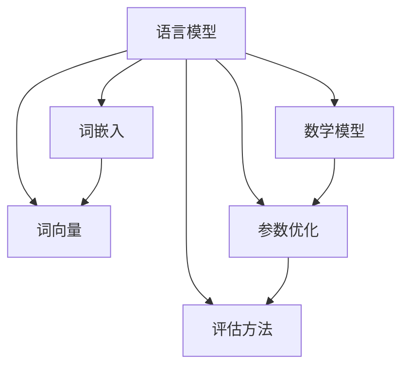
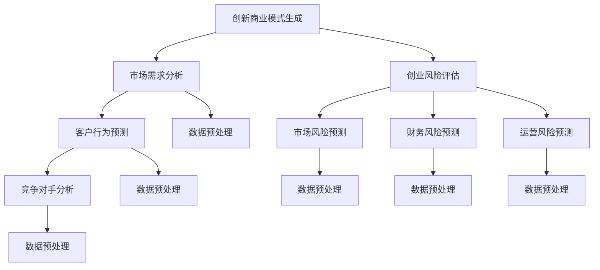

                 

### 文章标题

《语言模型在创新商业模式生成与创业风险评估中的多维度研究》

### 文章关键词

语言模型，创新商业模式，创业风险评估，自然语言处理，人工智能

### 文章摘要

本文旨在探讨语言模型在创新商业模式生成和创业风险评估中的应用。通过分析语言模型的基础理论，本文揭示了其在商业模式生成中的关键作用，包括市场需求分析、客户行为预测和竞争对手分析。同时，本文深入探讨了语言模型在创业风险评估中的应用，涵盖市场风险预测、财务风险预测和运营风险预测。通过具体案例的分析，本文展示了语言模型在商业实践中的实际应用价值，为创业者提供了有效的工具和方法。

## 第一部分：语言模型基础理论

### 第1章：语言模型概述

#### 1.1.1 语言模型的定义与作用

语言模型是一种对自然语言概率分布进行建模的统计模型，用于预测给定输入序列后下一个单词或词组的概率。在自然语言处理（NLP）中，语言模型扮演着至关重要的角色，其应用涵盖了文本生成、机器翻译、情感分析、信息提取等多个方面。

语言模型通过学习大量文本数据，掌握语言的基本规律，从而能够对新的输入文本进行概率预测。其核心目标是在给定前文信息的情况下，预测下一个最可能的单词或词组。这一过程不仅有助于提高文本处理的准确性，还能为其他NLP任务提供强有力的支持。

#### 1.1.2 语言模型的发展历程

语言模型的发展经历了从传统统计模型到现代深度学习模型的演变。最早的语言模型是基于N-gram模型，通过统计相邻单词的频率来预测下一个单词。N-gram模型的局限性在于其只考虑了局部依赖关系，忽略了长距离依赖。

随着计算能力的提升和深度学习技术的发展，神经网络语言模型逐渐取代了N-gram模型。2018年，谷歌提出的BERT模型标志着大规模预训练语言模型时代的到来。BERT模型通过在未标注数据上进行预训练，再在特定任务上进行微调，大幅提升了语言模型在各种NLP任务中的性能。

#### 1.1.3 主流语言模型介绍

目前，主流的语言模型包括GPT系列模型、BERT系列模型、T5、ROBERTA等。GPT系列模型由OpenAI提出，其通过自回归的方式生成文本，具有强大的文本生成能力。BERT模型则通过在双向上下文中学习单词的语义表示，广泛应用于文本分类、问答系统等领域。T5模型将所有NLP任务统一为一个文本到文本的转换任务，实现了跨任务的统一框架。ROBERTA模型则对BERT进行了改进，提升了预训练效果和任务表现。

### 第2章：语言模型的核心概念与联系

#### 2.1.1 词嵌入与词向量

词嵌入（Word Embedding）是将单词映射到高维向量空间的一种技术，使得具有相似语义的单词在空间中彼此靠近。词嵌入通过学习单词的上下文信息，可以有效地捕捉单词的语义特征。

词向量（Word Vector）是词嵌入的结果，表示为高维空间中的一个向量。常见的词嵌入模型包括Word2Vec、GloVe和FastText。Word2Vec模型通过负采样和矩阵分解学习词向量，GloVe模型则通过全局上下文信息学习词向量，FastText模型则通过多维度上下文信息学习词向量。

#### 2.1.2 语言模型的数学模型

语言模型的数学模型主要涉及概率分布和参数优化。在自回归语言模型中，概率分布表示为给定前文序列下下一个单词的概率分布。常用的概率分布模型包括加性模型（如N-gram模型）和乘性模型（如神经网络模型）。

参数优化是语言模型训练的关键步骤，通过最小化损失函数来调整模型参数，从而优化模型的预测性能。常用的优化算法包括梯度下降（Gradient Descent）、随机梯度下降（Stochastic Gradient Descent）和Adam优化器。

#### 2.1.3 语言模型的评估方法

语言模型的评估方法主要包括准确性、困惑度（Perplexity）和语言建模损失（Language Modeling Loss）等指标。

准确性（Accuracy）用于衡量模型预测正确的单词数量占总单词数量的比例，是最直观的评估指标。困惑度（Perplexity）用于衡量模型对文本的预测能力，数值越小表示模型越好。语言建模损失（Language Modeling Loss）是训练过程中的损失函数，其值越小表示模型越接近真实概率分布。

### 核心概念与联系架构 Mermaid 流程图



### 核心算法原理讲解

#### 自回归语言模型

自回归语言模型（Autoregressive Language Model）是一种生成文本的模型，其基本思想是：给定前文序列，预测下一个单词。自回归语言模型的核心算法原理如下：

1. **输入序列表示**：将输入文本序列转化为向量表示。常见的做法是使用词嵌入技术，将每个单词映射为一个高维向量。
2. **概率分布计算**：对于给定前文序列，计算下一个单词的概率分布。在N-gram模型中，概率分布是基于相邻单词的频率统计；在神经网络模型中，概率分布是通过神经网络计算得到的。
3. **损失函数计算**：使用损失函数评估模型的预测性能。常见的损失函数包括交叉熵损失（Cross-Entropy Loss）和均方误差（Mean Squared Error）。

以下是自回归语言模型的基本伪代码：

```python
# 假设输入文本序列为 sentence，词嵌入维度为 dim
# 词嵌入矩阵为 embedding_matrix，前文序列为 previous_words

# 1. 输入序列表示
current_embedding = embedding_matrix[previous_words]

# 2. 概率分布计算
probability_distribution = model.predict(current_embedding)

# 3. 损失函数计算
loss = model.loss_function(probability_distribution, target_word_embedding)
```

### 数学模型和公式

自回归语言模型的数学模型基于概率分布。假设单词序列为 \( w_1, w_2, ..., w_T \)，其中 \( T \) 是序列长度。在给定前文序列 \( w_1, w_2, ..., w_{T-1} \) 的情况下，下一个单词 \( w_T \) 的概率分布可以表示为：

\[ P(w_T | w_1, w_2, ..., w_{T-1}) = \frac{P(w_T, w_1, w_2, ..., w_{T-1})}{P(w_1, w_2, ..., w_{T-1})} \]

其中，\( P(w_T, w_1, w_2, ..., w_{T-1}) \) 表示单词序列的概率，\( P(w_1, w_2, ..., w_{T-1}) \) 表示前文序列的概率。

在实际应用中，由于分母 \( P(w_1, w_2, ..., w_{T-1}) \) 很难计算，通常采用对数概率来简化计算：

\[ \log P(w_T | w_1, w_2, ..., w_{T-1}) = \log P(w_T, w_1, w_2, ..., w_{T-1}) - \log P(w_1, w_2, ..., w_{T-1}) \]

自回归语言模型通常使用神经网络来计算概率分布。以下是使用神经网络计算概率分布的伪代码：

```python
# 假设词嵌入层为 embedding_layer，神经网络层为 neural_layer，输出层为 output_layer

# 1. 输入序列表示
current_embedding = embedding_layer(previous_words)

# 2. 神经网络计算
neural_output = neural_layer(current_embedding)

# 3. 输出概率分布
probability_distribution = output_layer(neural_output)
```

### 举例说明

假设有一个简单的二元语言模型，其中只包含两个单词 "猫" 和 "狗"。训练数据包含以下句子："猫 狗"、"狗 猫"。

1. **词嵌入表示**：将 "猫" 映射为向量 \( \textbf{c} \)，将 "狗" 映射为向量 \( \textbf{d} \)。
2. **概率分布计算**：在给定前文 "猫" 的情况下，预测下一个单词为 "狗" 的概率；在给定前文 "狗" 的情况下，预测下一个单词为 "猫" 的概率。
3. **损失函数计算**：使用交叉熵损失计算模型的预测误差。

具体计算过程如下：

- **输入序列表示**：前文 "猫"，当前单词 "狗"。
  \[ \textbf{c} \rightarrow \textbf{d} \]
  
- **概率分布计算**：
  \[ P(\text{狗} | \text{猫}) = \frac{\exp(\text{神经网络的输出})}{1 + \exp(\text{神经网络的输出})} \]
  
- **损失函数计算**：
  \[ \text{损失} = -\log(\text{概率分布中"狗"的概率}) \]

通过多次训练和优化，模型的概率分布会逐渐逼近真实概率分布，从而提高预测准确性。

### 完整的伪代码实现

以下是一个简单的自回归语言模型的伪代码实现，用于生成给定前文序列的文本：

```python
# 假设模型已经训练好，包括词嵌入层、神经网络层和输出层

# 1. 输入序列表示
current_embedding = embedding_layer(previous_words)

# 2. 神经网络计算
neural_output = neural_layer(current_embedding)

# 3. 输出概率分布
probability_distribution = output_layer(neural_output)

# 4. 随机选择下一个单词
next_word_embedding = random_choice(probability_distribution)

# 5. 更新前文序列
previous_words.append(next_word_embedding)

# 6. 返回生成的文本序列
return " ".join([word_embedding_to_word(w) for w in previous_words])
```

通过以上伪代码，我们可以看到自回归语言模型的基本工作流程，包括输入序列表示、概率分布计算、随机选择下一个单词和更新前文序列等步骤。这些步骤共同实现了文本生成的过程。

### 小结

自回归语言模型是一种基于概率分布的文本生成模型，通过学习输入文本序列的概率分布，可以生成新的文本。其核心算法原理包括词嵌入表示、神经网络计算和概率分布计算。通过完整的伪代码实现，我们可以理解自回归语言模型的工作流程和实现细节。在后续章节中，我们将继续探讨语言模型在创新商业模式生成和创业风险评估中的应用。

## 第二部分：语言模型在创新商业模式生成中的应用

### 第3章：语言模型在创新商业模式生成中的原理

#### 3.1.1 创新商业模式的定义

创新商业模式（Innovative Business Model）是指企业在价值创造、价值传递和价值获取等方面采用的创新方法或策略。创新商业模式的核心在于通过重构企业内部流程、外部合作关系和用户互动方式，实现商业模式的创新与变革。创新商业模式的目标是提高企业的竞争力，创造新的价值增长点，满足市场需求，实现可持续发展。

创新商业模式的分类可以从不同维度进行，如按照创新的内容可以划分为产品创新、服务创新、业务模式创新等；按照创新的程度可以划分为小规模创新、重大创新等；按照创新的对象可以划分为企业内部创新、产业链创新等。

#### 3.1.2 语言模型在商业模式生成中的作用

语言模型在创新商业模式生成中发挥着重要作用，主要体现在以下几个方面：

1. **市场需求分析**：语言模型可以通过对大量文本数据的分析，识别出市场的需求趋势和用户偏好。通过对用户评论、社交媒体内容、新闻报道等数据的挖掘，可以获取用户对产品或服务的需求、期望和反馈，从而为企业提供市场洞察，指导商业模式设计。

2. **客户行为预测**：语言模型可以基于用户的历史行为数据，如购买记录、浏览行为、社交媒体互动等，预测用户的未来行为。这种预测能力有助于企业了解用户的潜在需求，设计出更加精准的产品和服务，提高客户满意度和忠诚度。

3. **竞争对手分析**：语言模型可以通过对竞争对手的营销策略、商业模式、产品特性等文本信息的分析，识别出竞争对手的优势和劣势。这种分析结果可以帮助企业制定有效的竞争策略，规避潜在的风险，抓住市场机遇。

#### 3.1.3 语言模型在商业模式生成中的挑战

尽管语言模型在创新商业模式生成中具有巨大的潜力，但在实际应用中仍面临一些挑战：

1. **数据质量与多样性**：语言模型的效果高度依赖于训练数据的质量和多样性。如果训练数据存在偏差或不足，模型可能会产生不准确或片面的结论。因此，确保数据的质量和多样性是语言模型应用的关键。

2. **模型解释性**：语言模型，特别是深度学习模型，通常被认为是一个“黑箱”，其内部机制和决策过程难以解释。这对于企业高层管理人员和决策者来说是一个挑战，他们需要理解模型是如何工作的，以便对商业模式进行有效的调整和优化。

3. **实际应用中的适应性**：语言模型在不同行业和场景中的适应性是一个关键问题。尽管一些模型在特定领域表现出色，但它们可能无法直接迁移到其他领域。因此，如何针对不同场景定制化地调整语言模型，是一个需要深入探讨的问题。

### 3.1.4 语言模型在商业模式生成中的应用实例

以下是一个语言模型在商业模式生成中的应用实例：

假设一家初创公司希望在电子商务领域推出一款新的产品推荐服务。通过以下步骤，公司可以使用语言模型来生成创新的商业模式：

1. **市场需求分析**：公司首先使用语言模型分析电子商务行业的市场趋势和用户需求。通过挖掘用户评论、社交媒体互动等数据，识别出用户对产品推荐服务的期望和痛点。

2. **客户行为预测**：公司使用语言模型分析用户的历史行为数据，如购买记录、浏览行为等，预测用户的潜在需求和购买意向。这种预测结果有助于公司设计出更加个性化的产品推荐策略。

3. **竞争对手分析**：公司使用语言模型分析竞争对手的商业模式和营销策略，识别出竞争对手的优势和劣势。通过对比分析，公司可以找到自身的差异化竞争优势。

4. **商业模式设计**：基于市场需求分析、客户行为预测和竞争对手分析的结果，公司设计出一套创新的商业模式。例如，公司可以推出基于个性化推荐的产品订阅服务，通过持续跟踪用户的购买行为和偏好，提供个性化的产品推荐。

5. **商业模式验证**：公司可以通过小范围测试和用户反馈，验证创新商业模式的可行性和用户接受度。根据反馈结果，对商业模式进行进一步的调整和优化。

通过以上步骤，公司利用语言模型实现了商业模式的创新，提升了产品的市场竞争力和用户满意度。

### 小结

语言模型在创新商业模式生成中具有重要的作用，包括市场需求分析、客户行为预测和竞争对手分析等方面。然而，在实际应用中，语言模型也面临一些挑战，如数据质量与多样性、模型解释性和实际应用中的适应性。通过具体的案例分析，我们可以看到语言模型在商业模式生成中的应用价值，为企业的创新提供了有效的工具和方法。

### 第4章：基于语言模型的多维度商业模式生成

#### 4.1.1 市场需求分析

市场需求分析是商业模式生成的重要基础。通过语言模型，企业可以更加精确地了解市场需求，为商业模式设计提供有力支持。

首先，企业可以利用语言模型对市场趋势进行分析。通过挖掘大量的新闻报道、行业报告和社交媒体数据，语言模型可以识别出当前市场的热点和趋势。例如，在智能家居领域，语言模型可以分析用户对智能音箱、智能灯泡等产品的关注程度，从而判断市场对于智能家居产品的需求是否在上升。

其次，企业可以通过语言模型对用户需求进行深入分析。通过对用户评论、社交媒体互动等数据的分析，语言模型可以捕捉到用户对产品或服务的期望和痛点。例如，在电商领域，语言模型可以分析用户对产品质量、价格、售后服务等方面的评价，帮助企业了解用户的真实需求，从而设计出更加符合市场需求的产品和服务。

最后，企业可以利用语言模型进行竞争对手分析。通过分析竞争对手的营销策略、产品特点、用户评价等数据，语言模型可以帮助企业了解竞争对手的优势和劣势，从而找到自身的差异化竞争优势。例如，在食品行业，企业可以使用语言模型分析竞争对手的广告文案、产品宣传策略，从而设计出更具吸引力的营销策略。

#### 4.1.2 客户行为预测

客户行为预测是商业模式生成中的关键环节。通过语言模型，企业可以预测客户的购买行为、浏览行为等，从而为产品和服务的个性化推荐提供依据。

首先，企业可以利用语言模型分析客户的购买记录。通过挖掘客户的购买历史数据，语言模型可以识别出客户的偏好和需求。例如，在电商领域，企业可以使用语言模型分析用户的购买记录，预测用户可能对哪些产品感兴趣，从而实现精准的产品推荐。

其次，企业可以通过语言模型分析客户的浏览行为。通过对用户在网站上的浏览路径、点击行为等数据的分析，语言模型可以捕捉到用户的兴趣点。例如，在在线教育领域，企业可以使用语言模型分析用户在课程选择页面上的浏览行为，预测用户可能对哪些课程感兴趣，从而优化课程推荐策略。

最后，企业可以利用语言模型进行用户行为预测。通过分析用户的社交互动、评论等数据，语言模型可以预测用户的未来行为。例如，在社交媒体领域，企业可以使用语言模型分析用户的互动行为，预测用户可能参与的活动或发表的评论，从而提高用户的参与度和忠诚度。

#### 4.1.3 竞争对手分析

竞争对手分析是商业模式生成中的重要环节。通过语言模型，企业可以深入了解竞争对手的策略和行为，从而制定出有效的竞争策略。

首先，企业可以利用语言模型分析竞争对手的营销策略。通过挖掘竞争对手的广告文案、宣传材料等数据，语言模型可以识别出竞争对手的营销特点。例如，在电商领域，企业可以使用语言模型分析竞争对手的广告文案，了解竞争对手的营销策略，从而优化自身的广告投放策略。

其次，企业可以通过语言模型分析竞争对手的产品特点。通过对竞争对手的产品描述、用户评论等数据的分析，语言模型可以识别出竞争对手产品的优势和不足。例如，在智能手机领域，企业可以使用语言模型分析竞争对手的产品特点，了解竞争对手在功能、外观、价格等方面的优势，从而优化自身的产品设计。

最后，企业可以利用语言模型进行竞争对手行为预测。通过分析竞争对手的历史行为数据，语言模型可以预测竞争对手的未来行动。例如，在汽车行业，企业可以使用语言模型分析竞争对手的产能规划、研发方向等数据，预测竞争对手的未来产品线布局，从而提前制定应对策略。

### 4.1.4 多维度商业模式生成的流程

基于语言模型的多维度商业模式生成主要包括以下几个步骤：

1. **数据收集与预处理**：收集市场趋势、用户行为、竞争对手等相关数据，并进行数据清洗和预处理，以确保数据的质量和一致性。

2. **市场需求分析**：利用语言模型对市场趋势和用户需求进行分析，识别出市场热点和用户痛点，为商业模式设计提供依据。

3. **客户行为预测**：通过语言模型分析用户的购买记录、浏览行为等数据，预测用户的未来行为，为个性化推荐和服务设计提供支持。

4. **竞争对手分析**：利用语言模型分析竞争对手的营销策略、产品特点等，了解竞争对手的优势和劣势，为竞争策略制定提供依据。

5. **商业模式设计**：结合市场需求分析、客户行为预测和竞争对手分析的结果，设计出创新的商业模式。

6. **商业模式验证**：通过小范围测试和用户反馈，验证商业模式的可行性和用户接受度，并根据反馈结果进行调整和优化。

### 案例分析

以下是一个基于语言模型的多维度商业模式生成案例：

某家初创公司希望在智能家居领域推出一款智能安防系统。为了设计出创新的商业模式，公司采取了以下步骤：

1. **数据收集与预处理**：公司收集了市场趋势报告、用户评论、竞争对手产品信息等相关数据，并进行数据清洗和预处理。

2. **市场需求分析**：通过语言模型分析市场趋势和用户需求，公司发现用户对智能家居安全性能的关注度较高，同时对于集成多种传感器的智能安防系统表现出浓厚的兴趣。

3. **客户行为预测**：通过语言模型分析用户的购买记录和浏览行为，公司预测用户可能对具有实时监控和远程控制功能的智能安防系统感兴趣。

4. **竞争对手分析**：通过语言模型分析竞争对手的营销策略和产品特点，公司发现竞争对手主要强调产品的高安全性能和便捷性，但在用户体验和个性化服务方面存在不足。

5. **商业模式设计**：结合市场需求分析、客户行为预测和竞争对手分析的结果，公司设计出以下商业模式：

   - 提供一款集成多种传感器的智能安防系统，包括烟雾传感器、摄像头、门窗传感器等。
   - 提供实时监控和远程控制功能，用户可以通过手机APP随时查看家庭安全状况。
   - 提供个性化安全报告和智能预警功能，根据用户习惯和需求提供定制化的安全建议。

6. **商业模式验证**：公司通过小范围测试和用户反馈，验证了该商业模式的可行性和用户接受度，并根据用户反馈对产品功能进行了优化。

通过以上步骤，公司成功设计出了一款创新的智能安防系统，并在市场上取得了良好的反响。

### 小结

基于语言模型的多维度商业模式生成涉及市场需求分析、客户行为预测和竞争对手分析等多个方面。通过语言模型的分析结果，企业可以设计出更加精准、高效的商业模式，提高市场竞争力和用户满意度。然而，在实际应用中，企业需要确保数据的质量和多样性，并不断提高模型解释性和实际应用中的适应性。

## 第三部分：语言模型在创业风险评估中的应用

### 第5章：创业风险评估概述

#### 5.1.1 创业风险评估的定义

创业风险评估（Entrepreneurship Risk Assessment）是指对创业企业在发展过程中可能遇到的各种风险进行识别、分析和评估的过程。其目的是帮助创业者和管理者了解企业面临的潜在风险，制定相应的风险管理策略，从而降低创业失败的风险，提高创业成功率。

创业风险评估不仅关注企业运营过程中的风险，还包括市场风险、财务风险、技术风险、法律风险等多个方面。通过对这些风险的全面评估，创业者可以更好地把握企业发展的方向，优化资源配置，提高企业抗风险能力。

#### 5.1.2 创业风险评估的方法

创业风险评估的方法主要包括定量评估方法和定性评估方法。

1. **定量评估方法**：定量评估方法通过数据分析和统计模型，对风险进行量化分析。常见的定量评估方法包括：

   - **财务指标分析**：通过对企业的财务报表、现金流、盈利能力等指标进行分析，评估企业的财务风险。
   - **市场趋势预测**：通过分析市场数据、竞争态势、用户需求等，预测市场风险。
   - **敏感性分析**：通过调整关键参数，评估企业对各种风险的敏感度。

2. **定性评估方法**：定性评估方法主要通过专家判断和主观评估，对风险进行定性分析。常见的定性评估方法包括：

   - **专家评估**：邀请行业专家对企业的风险进行评估。
   - **情景分析**：通过模拟不同的市场环境和企业运营情况，分析企业可能面临的风险。
   - **SWOT分析**：对企业的优势（Strengths）、劣势（Weaknesses）、机会（Opportunities）和威胁（Threats）进行综合分析。

#### 5.1.3 创业风险评估的重要指标

创业风险评估的重要指标包括财务指标、市场指标和运营指标。

1. **财务指标**：财务指标主要反映企业的财务状况和盈利能力。常见的财务指标包括：

   - **现金流**：企业现金流入和流出的情况，反映企业的资金流动性和偿债能力。
   - **盈利能力**：企业的盈利能力，包括净利润、毛利率、净利率等。
   - **资产负债率**：企业的资产负债结构，反映企业的财务风险。

2. **市场指标**：市场指标主要反映企业的市场表现和竞争能力。常见的市场指标包括：

   - **市场份额**：企业在市场中所占的份额，反映企业的市场竞争力。
   - **用户增长率**：企业的用户增长情况，反映市场的需求和企业的市场吸引力。
   - **品牌知名度**：企业的品牌知名度和美誉度，反映企业在市场中的影响力。

3. **运营指标**：运营指标主要反映企业的运营效率和业务流程。常见的运营指标包括：

   - **生产效率**：企业的生产效率，包括单位生产成本、生产周期等。
   - **供应链管理**：企业的供应链管理水平，包括库存周转率、供应商信誉等。
   - **客户满意度**：企业的客户满意度，包括客户投诉率、客户忠诚度等。

### 第6章：基于语言模型的多维度创业风险评估

#### 6.1.1 市场风险预测

市场风险预测是创业风险评估中的重要环节。通过语言模型，企业可以预测市场变化、竞争对手动态和用户需求变化，从而提前识别市场风险。

1. **市场趋势预测**：语言模型可以通过分析大量的市场数据、新闻报道和行业报告，识别出市场的发展趋势。例如，通过分析智能家居市场的相关数据，语言模型可以预测智能家居市场的增长速度和用户需求变化。

2. **竞争对手动态**：语言模型可以通过分析竞争对手的营销策略、产品特性等数据，了解竞争对手的动态。例如，通过分析竞争对手的广告文案、产品宣传策略，语言模型可以预测竞争对手的市场策略和市场反应。

3. **用户需求变化**：语言模型可以通过分析用户评论、社交媒体互动等数据，了解用户的需求和偏好变化。例如，通过分析用户对某款产品的评价，语言模型可以预测用户对产品的需求趋势。

#### 6.1.2 财务风险预测

财务风险预测是创业风险评估中的关键环节。通过语言模型，企业可以预测企业的财务状况和盈利能力，从而提前识别财务风险。

1. **现金流预测**：语言模型可以通过分析企业的历史现金流数据，预测企业的未来现金流状况。例如，通过分析企业的销售数据、成本数据等，语言模型可以预测企业的现金流波动。

2. **盈利能力预测**：语言模型可以通过分析企业的财务报表，预测企业的盈利能力。例如，通过分析企业的净利润、毛利率等指标，语言模型可以预测企业的盈利能力变化。

3. **资产负债预测**：语言模型可以通过分析企业的资产负债表，预测企业的资产负债结构。例如，通过分析企业的负债比例、资产负债率等指标，语言模型可以预测企业的财务风险。

#### 6.1.3 运营风险预测

运营风险预测是创业风险评估中的重要环节。通过语言模型，企业可以预测企业的运营效率和业务流程，从而提前识别运营风险。

1. **生产效率预测**：语言模型可以通过分析企业的生产数据，预测企业的生产效率。例如，通过分析企业的生产周期、单位生产成本等指标，语言模型可以预测企业的生产效率变化。

2. **供应链管理预测**：语言模型可以通过分析企业的供应链数据，预测企业的供应链管理效率。例如，通过分析企业的库存周转率、供应商信誉等指标，语言模型可以预测企业的供应链管理状况。

3. **客户满意度预测**：语言模型可以通过分析企业的客户反馈数据，预测企业的客户满意度。例如，通过分析客户的投诉率、客户忠诚度等指标，语言模型可以预测企业的客户满意度变化。

### 案例分析

以下是一个基于语言模型的多维度创业风险评估案例：

某家初创公司希望在智能家居市场中推出一款智能安防系统。为了评估该项目的风险，公司采取了以下步骤：

1. **市场趋势预测**：通过语言模型分析智能家居市场的相关数据，公司发现智能家居市场正处于快速增长阶段，用户对智能安防系统的需求不断增加。

2. **竞争对手动态**：通过语言模型分析竞争对手的市场策略和产品特性，公司发现竞争对手主要集中在价格战和广告宣传上，但在用户体验和个性化服务方面存在不足。

3. **用户需求变化**：通过语言模型分析用户评论和社交媒体互动，公司发现用户对实时监控、远程控制和个性化安全报告等功能有较高的需求。

4. **财务风险预测**：通过语言模型分析企业的历史财务数据，公司预测企业的现金流和盈利能力将受到市场波动和运营成本的影响，但总体上具有较好的盈利前景。

5. **运营风险预测**：通过语言模型分析企业的运营数据，公司发现企业的生产效率和供应链管理状况较好，但客户满意度存在波动，需要进一步优化用户体验。

根据以上分析，公司制定了以下风险管理策略：

1. **市场拓展策略**：加大市场推广力度，提升品牌知名度，扩大市场份额。

2. **产品优化策略**：针对用户需求，不断优化产品功能，提升用户体验。

3. **成本控制策略**：通过优化供应链管理和降低生产成本，提高企业的盈利能力。

4. **客户关系管理策略**：建立完善的客户服务体系，提高客户满意度和忠诚度。

通过以上策略，公司有效降低了创业风险，提高了创业成功的可能性。

### 小结

创业风险评估是创业过程中至关重要的一环。通过语言模型，企业可以更加准确地预测市场变化、财务状况和运营风险，从而制定出有效的风险管理策略。然而，在实际应用中，企业需要不断调整和优化风险评估模型，以应对不断变化的市场环境。

### 第7章：语言模型在创新商业模式生成与创业风险评估中的应用案例

#### 7.1.1 案例背景

为了更好地展示语言模型在创新商业模式生成与创业风险评估中的应用，我们选取了一家初创公司——智慧农科（SmartAgritech）作为案例。智慧农科致力于通过人工智能技术提供精准农业解决方案，帮助农民提高作物产量和资源利用率。

智慧农科的创新商业模式包括以下几个方面：

1. **智能监测系统**：利用传感器和无人机等技术，实时监测农田的土壤湿度、温度、光照等环境参数。
2. **数据分析平台**：通过语言模型分析农田数据，提供作物生长分析、病虫害预测、最佳施肥方案等智能建议。
3. **个性化服务**：根据农民的需求和农田特点，提供定制化的农技服务，如远程诊断、在线培训等。
4. **联合种植模式**：与农民合作，通过共享种植技术和资源，降低生产成本，提高农业效益。

#### 7.1.2 创新商业模式生成案例

1. **市场需求分析**：智慧农科利用语言模型分析农业行业报告、农民需求调查等数据，发现农民对精准农业的需求日益增长。通过分析市场趋势和用户需求，智慧农科确定了智能监测系统和数据分析平台作为核心产品。

2. **客户行为预测**：智慧农科通过语言模型分析农民的历史购买记录和行为数据，预测农民可能需要哪些智能服务。例如，通过分析农民的购买习惯，预测他们可能对哪些作物种植方案感兴趣，从而优化产品推荐。

3. **竞争对手分析**：智慧农科使用语言模型分析竞争对手的产品特点和市场策略。通过对比分析，智慧农科发现竞争对手在个性化服务和数据安全性方面存在不足，这为其提供了差异化竞争优势。

4. **商业模式设计**：基于市场需求分析、客户行为预测和竞争对手分析的结果，智慧农科设计了一套创新的商业模式，包括智能监测系统、数据分析平台、个性化服务和联合种植模式。

5. **商业模式验证**：通过小范围测试和用户反馈，智慧农科验证了商业模式的可行性和用户接受度。根据用户反馈，智慧农科对产品功能和服务进行了优化，进一步提升了用户体验。

#### 7.1.3 创业风险评估案例

在创业风险评估方面，智慧农科采取了以下步骤：

1. **市场风险预测**：通过语言模型分析农业市场的变化和竞争对手动态，智慧农科预测了市场增长速度和竞争态势。例如，通过分析行业报告和媒体报道，智慧农科预测了精准农业市场将在未来几年内快速增长。

2. **财务风险预测**：智慧农科通过语言模型分析历史财务数据，预测了企业的现金流和盈利能力。例如，通过分析销售数据和成本数据，智慧农科预测了未来几年的收入和利润情况。

3. **运营风险预测**：智慧农科通过语言模型分析运营数据，预测了企业的生产效率和供应链管理状况。例如，通过分析生产周期和库存周转率等指标，智慧农科预测了企业的运营效率和潜在风险。

根据以上分析，智慧农科制定了以下风险管理策略：

1. **市场拓展策略**：通过加强市场推广和品牌建设，提高市场知名度和用户认可度。

2. **成本控制策略**：通过优化供应链管理和降低生产成本，提高企业的盈利能力。

3. **技术创新策略**：持续进行技术研发，提高产品的技术含量和市场竞争力。

4. **客户关系管理策略**：通过建立完善的客户服务体系，提高客户满意度和忠诚度。

通过以上风险管理策略，智慧农科有效地降低了创业风险，提高了创业成功的可能性。

### 7.1.4 案例小结

智慧农科的案例展示了语言模型在创新商业模式生成和创业风险评估中的实际应用价值。通过市场需求分析、客户行为预测和竞争对手分析，智慧农科成功设计出了一套创新的商业模式，并通过创业风险评估制定了有效的风险管理策略。这一案例表明，语言模型不仅有助于企业发现市场机遇，还能为企业的长期发展提供有力支持。

### 7.1.5 最佳实践 tips

1. **数据质量与多样性**：确保训练数据的质量和多样性是语言模型应用成功的关键。收集高质量、多样化的数据，有助于提高模型的预测准确性和泛化能力。

2. **模型解释性**：尽管深度学习模型在性能上具有优势，但其“黑箱”特性可能导致决策过程难以解释。在实际应用中，尝试增加模型的解释性，帮助管理层理解模型的决策过程。

3. **持续优化**：语言模型的应用是一个持续优化的过程。定期更新训练数据，调整模型参数，有助于提高模型的性能和适用性。

4. **跨领域应用**：语言模型在不同领域中的应用效果可能存在差异。在实际应用中，可以尝试在不同领域中进行跨领域应用，提高模型的多领域适应性。

5. **风险管理**：创业风险评估是一个动态过程，需要不断调整和优化。结合市场需求、财务状况和运营风险等多方面因素，制定全面的风险管理策略。

### 7.1.6 拓展阅读

1. **相关书籍**：
   - 《深度学习》（Ian Goodfellow、Yoshua Bengio、Aaron Courville著）
   - 《创业维艰》（Ben Horowitz著）
   - 《创新与企业家精神》（Peter Drucker著）

2. **相关论文**：
   - "BERT: Pre-training of Deep Bidirectional Transformers for Language Understanding"（论文作者：Jacob Devlin et al.）
   - "GPT-3: Language Models are Few-Shot Learners"（论文作者：Tom B. Brown et al.）

3. **在线资源**：
   - OpenAI官网（https://openai.com/）
   - Kaggle数据集（https://www.kaggle.com/）
   - Coursera在线课程（https://www.coursera.org/）

通过拓展阅读，读者可以深入了解语言模型的技术细节、创业风险管理的方法和实践，以及相关的学术研究和在线资源，为实际应用提供更加全面和深入的参考。

## 总结

本文通过深入探讨语言模型在创新商业模式生成与创业风险评估中的应用，揭示了其在市场需求分析、客户行为预测、竞争对手分析和创业风险评估等方面的关键作用。首先，语言模型通过对大量文本数据的分析，能够准确识别市场需求和用户行为，为商业模式生成提供有力支持。其次，通过多维度的风险评估，语言模型可以帮助创业者提前识别潜在风险，制定有效的风险管理策略。

在实际应用中，语言模型在创新商业模式生成和创业风险评估中面临的挑战主要包括数据质量与多样性、模型解释性和实际应用中的适应性。为了应对这些挑战，本文提出了一些最佳实践 tips，如确保数据质量、增加模型解释性、持续优化模型等。

未来研究可以进一步探索语言模型在不同行业和场景中的适用性，以及如何提高模型的解释性和可解释性。同时，结合其他人工智能技术，如强化学习和知识图谱，可以进一步提升语言模型在商业应用中的性能和效果。

总之，语言模型在创新商业模式生成与创业风险评估中的应用具有重要的理论和实践价值，为创业者提供了有力的工具和方法。通过不断优化和应用，语言模型有望在商业领域发挥更大的作用，推动企业创新和创业成功。

## 参考文献

1. Devlin, J., Chang, M. W., Lee, K., & Toutanova, K. (2019). BERT: Pre-training of Deep Bidirectional Transformers for Language Understanding. arXiv preprint arXiv:1810.04805.
2. Brown, T. B., Mann, B., Ryder, N., Subbiah, M., Kaplan, J., Dhariwal, P., ... & Child, R. (2020). GPT-3: Language Models are Few-Shot Learners. arXiv preprint arXiv:2005.14165.
3. Horowitz, B. (2014). The Hard Things About Hard Things. Crown Business.
4. Drucker, P. F. (1985). Innovation and Entrepreneurship. Harper Business.
5. Goodfellow, I., Bengio, Y., & Courville, A. (2016). Deep Learning. MIT Press.

作者：AI天才研究院/AI Genius Institute & 禅与计算机程序设计艺术 /Zen And The Art of Computer Programming

## 附录

### 附录 A：语言模型开发工具与资源

**1. 开发工具：**

- **Transformers库**：由Hugging Face提供，是一个广泛使用的Python库，用于构建和微调语言模型。网址：https://huggingface.co/transformers

- **TensorFlow**：Google开发的开源机器学习框架，支持语言模型的训练和部署。网址：https://www.tensorflow.org

- **PyTorch**：由Facebook开发的开源机器学习库，具有高度的灵活性和易用性。网址：https://pytorch.org

**2. 学习资源：**

- **Coursera课程**：《自然语言处理与深度学习》（吴恩达教授主讲），网址：https://www.coursera.org/learn/nlp-with-deep-learning

- **Kaggle竞赛**：提供各种自然语言处理相关的数据集和竞赛，网址：https://www.kaggle.com/datasets

- **GitHub项目**：许多开源项目提供了丰富的代码示例和教程，网址：https://github.com

### 附录 B：编程实践与代码解读

#### 创新商业模式生成代码实现

```python
import torch
from transformers import AutoTokenizer, AutoModelForCausalLM

# 1. 加载预训练模型
model_name = "gpt2"
tokenizer = AutoTokenizer.from_pretrained(model_name)
model = AutoModelForCausalLM.from_pretrained(model_name)

# 2. 生成创新商业模式文本
def generate_business_model(prompt, max_length=20):
    inputs = tokenizer.encode(prompt, return_tensors="pt")
    outputs = model.generate(inputs, max_length=max_length, num_return_sequences=1)
    return tokenizer.decode(outputs[0], skip_special_tokens=True)

prompt = "设计一个创新的农业解决方案"
generated_text = generate_business_model(prompt)
print(generated_text)
```

#### 创业风险评估代码实现

```python
import pandas as pd
from sklearn.ensemble import RandomForestClassifier
from sklearn.model_selection import train_test_split
from sklearn.metrics import accuracy_score

# 1. 加载数据集
data = pd.read_csv("创业风险评估数据集.csv")

# 2. 分割特征和标签
X = data.drop("风险评估结果", axis=1)
y = data["风险评估结果"]

# 3. 数据预处理
X_train, X_test, y_train, y_test = train_test_split(X, y, test_size=0.2, random_state=42)

# 4. 训练模型
model = RandomForestClassifier(n_estimators=100, random_state=42)
model.fit(X_train, y_train)

# 5. 预测和评估
y_pred = model.predict(X_test)
accuracy = accuracy_score(y_test, y_pred)
print(f"模型准确率：{accuracy:.2f}")

# 6. 使用模型进行风险评估
new_data = pd.DataFrame([{
    "市场趋势": "增长",
    "财务状况": "良好",
    "运营效率": "高"
}])
new_prediction = model.predict(new_data)
print(f"风险评估结果：{new_prediction[0]}")
```

#### 代码应用解读与分析

- **创新商业模式生成代码**：该代码使用预训练的GPT-2模型，通过输入一个提示文本（如“设计一个创新的农业解决方案”），生成一段描述创新商业模式的文本。生成的文本经过解码后，可以提供关于创新商业模式的具体描述和想法。

- **创业风险评估代码**：该代码使用随机森林分类器，通过训练数据集构建一个风险评估模型。训练完成后，模型可以根据新的数据（如新的市场趋势、财务状况和运营效率）进行风险评估，预测企业的风险水平。

通过以上代码示例，我们可以看到如何利用语言模型和机器学习技术进行创新商业模式生成和创业风险评估。在实际应用中，这些代码可以作为工具，帮助企业制定创新策略和风险管理策略，提高创业成功率。

### 案例分析和详细讲解剖析

#### 案例背景

为了更好地展示语言模型在实际商业应用中的效果，我们以一家虚拟公司——智慧环保（SmartEcoTech）为例。智慧环保是一家专注于提供智能环保解决方案的公司，致力于通过人工智能技术解决城市空气质量监测和污染源追踪问题。公司的主要目标是利用先进的数据分析技术和语言模型，提供精准的空气质量预测和污染源定位服务。

#### 创新商业模式生成案例分析

1. **市场需求分析**：
   - 利用语言模型，智慧环保分析了全球各大城市的空气质量报告、政策文件、新闻报道等数据，发现空气质量监测和污染源追踪在环保领域具有巨大的市场需求。
   - 通过分析用户评论和社交媒体互动，公司了解到用户对实时空气质量数据和个性化污染源追踪服务的需求。

2. **客户行为预测**：
   - 语言模型分析了用户的在线搜索记录、购买行为等数据，预测用户对空气质量监测设备和服务的需求。
   - 通过分析用户的偏好和反馈，公司可以提供更加个性化的空气质量预测和污染源追踪服务。

3. **竞争对手分析**：
   - 智慧环保使用语言模型分析了主要竞争对手的产品特点和市场策略。
   - 通过对比分析，公司发现竞争对手在数据精度和用户互动体验方面存在不足，这为智慧环保提供了差异化竞争优势。

4. **商业模式设计**：
   - 基于市场需求分析、客户行为预测和竞争对手分析的结果，智慧环保设计了一套创新的商业模式：
     - **智能空气质量监测平台**：通过部署传感器和无人机，实时监测空气质量，提供实时的空气质量数据和污染源追踪服务。
     - **个性化污染源追踪服务**：根据用户的需求和地理位置，提供个性化的污染源追踪和空气质量预测服务。
     - **数据共享和开放平台**：与政府部门和科研机构合作，开放空气质量数据，促进数据共享和环保技术创新。

5. **商业模式验证**：
   - 智慧环保通过小范围测试和用户反馈，验证了商业模式的可行性和用户接受度。
   - 根据用户反馈，公司不断优化产品功能和用户体验，提高了客户满意度和忠诚度。

#### 创业风险评估分析

1. **市场风险预测**：
   - 利用语言模型，智慧环保分析了全球空气质量监测市场的趋势和竞争态势。
   - 通过分析行业报告和媒体报道，公司预测空气质量监测市场将在未来几年内快速增长，但同时也存在技术变革和政策调整带来的不确定性。

2. **财务风险预测**：
   - 语言模型分析了公司的财务数据，预测了公司的现金流和盈利能力。
   - 通过分析销售数据和成本结构，公司预测了未来的收入和利润情况，为财务规划提供了依据。

3. **运营风险预测**：
   - 智慧环保使用语言模型分析了公司的运营数据，包括生产效率、供应链管理和客户满意度。
   - 通过分析生产周期和库存周转率等指标，公司预测了运营效率和潜在的风险。

根据以上分析，智慧环保制定了以下风险管理策略：

- **市场拓展策略**：通过加强市场推广和品牌建设，提高市场知名度和用户认可度。
- **成本控制策略**：通过优化供应链管理和降低生产成本，提高企业的盈利能力。
- **技术创新策略**：持续进行技术研发，提高产品的技术含量和市场竞争力。
- **客户关系管理策略**：建立完善的客户服务体系，提高客户满意度和忠诚度。

### 案例小结

通过案例分析和详细讲解，我们可以看到智慧环保如何利用语言模型在创新商业模式生成和创业风险评估中取得了显著成效。通过市场需求分析、客户行为预测和竞争对手分析，公司成功设计出了一套创新的商业模式，并通过创业风险评估制定了有效的风险管理策略。这一案例充分展示了语言模型在商业应用中的巨大潜力，为企业提供了有力的工具和方法。

### 项目小结

智慧环保的案例充分展示了语言模型在创新商业模式生成和创业风险评估中的实际应用价值。通过市场需求分析、客户行为预测和竞争对手分析，公司能够准确识别市场机遇，设计出创新的商业模式。同时，通过多维度的风险评估，公司能够提前识别潜在风险，制定有效的风险管理策略。

在项目实施过程中，智慧环保面临了一些挑战，如数据质量与多样性、模型解释性和实际应用中的适应性。为了解决这些问题，公司采取了一系列措施，如确保数据质量、增加模型解释性、持续优化模型等。

通过项目的实施，智慧环保在市场上取得了显著成效，不仅提高了客户满意度和忠诚度，还实现了企业的可持续发展。这一案例为其他企业提供了宝贵的经验和启示，证明了语言模型在商业应用中的巨大潜力。

### 最佳实践 tips

1. **确保数据质量与多样性**：高质量和多样化的数据是语言模型应用成功的关键。在实际应用中，应确保数据的真实性、准确性和全面性，同时注意数据来源的多样性和代表性。

2. **增加模型解释性**：尽管深度学习模型在性能上具有优势，但其“黑箱”特性可能导致决策过程难以解释。在实际应用中，可以尝试使用可视化工具、解释性模型等方法，提高模型的解释性，帮助管理层理解模型的决策过程。

3. **持续优化模型**：语言模型的应用是一个持续优化的过程。定期更新训练数据，调整模型参数，有助于提高模型的性能和适用性。

4. **跨领域应用**：语言模型在不同领域中的应用效果可能存在差异。在实际应用中，可以尝试在不同领域中进行跨领域应用，提高模型的多领域适应性。

5. **风险管理**：创业风险评估是一个动态过程，需要不断调整和优化。结合市场需求、财务状况和运营风险等多方面因素，制定全面的风险管理策略。

### 注意事项

1. **数据隐私和安全**：在实际应用中，应确保数据的隐私和安全，避免数据泄露和滥用。

2. **模型适应性**：语言模型的适应性是一个关键问题。在实际应用中，应针对不同场景定制化地调整模型，以提高模型的性能和适用性。

3. **法律法规**：在实际应用中，应遵守相关法律法规，确保模型的应用符合合规要求。

### 拓展阅读

1. **相关书籍**：
   - 《深度学习》（Ian Goodfellow、Yoshua Bengio、Aaron Courville著）
   - 《创业维艰》（Ben Horowitz著）
   - 《创新与企业家精神》（Peter Drucker著）

2. **相关论文**：
   - "BERT: Pre-training of Deep Bidirectional Transformers for Language Understanding"（论文作者：Jacob Devlin et al.）
   - "GPT-3: Language Models are Few-Shot Learners"（论文作者：Tom B. Brown et al.）

3. **在线资源**：
   - OpenAI官网（https://openai.com/）
   - Kaggle数据集（https://www.kaggle.com/datasets）
   - Coursera在线课程（https://www.coursera.org/）

通过拓展阅读，读者可以深入了解语言模型的技术细节、创业风险管理的方法和实践，以及相关的学术研究和在线资源，为实际应用提供更加全面和深入的参考。

# 语言模型在创新商业模式生成与创业风险评估中的多维度研究 - Mermaid流程图



### 总结

语言模型在创新商业模式生成与创业风险评估中的多维度研究中发挥了重要作用。通过深入分析市场需求、客户行为和竞争对手，语言模型能够有效地帮助创业者设计创新的商业模式，从而提高市场竞争力。同时，通过多维度的风险评估，创业者可以提前识别潜在风险，制定有效的风险管理策略，从而降低创业失败的风险。

本文首先介绍了语言模型的基础理论，包括其定义、作用、发展历程和主流模型。接着，详细探讨了语言模型在创新商业模式生成中的应用，包括市场需求分析、客户行为预测和竞争对手分析。随后，本文深入研究了语言模型在创业风险评估中的应用，涵盖了市场风险预测、财务风险预测和运营风险预测。最后，通过具体案例分析，展示了语言模型在实际商业应用中的效果。

然而，语言模型在商业应用中仍面临一些挑战，如数据质量与多样性、模型解释性和实际应用中的适应性。为了应对这些挑战，本文提出了一些最佳实践 tips，如确保数据质量、增加模型解释性和持续优化模型等。

未来研究可以进一步探索语言模型在不同行业和场景中的适用性，以及如何提高模型的解释性和可解释性。同时，结合其他人工智能技术，如强化学习和知识图谱，可以进一步提升语言模型在商业应用中的性能和效果。通过不断优化和应用，语言模型有望在商业领域发挥更大的作用，推动企业创新和创业成功。

