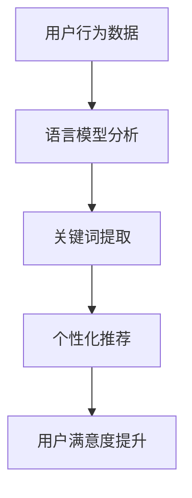
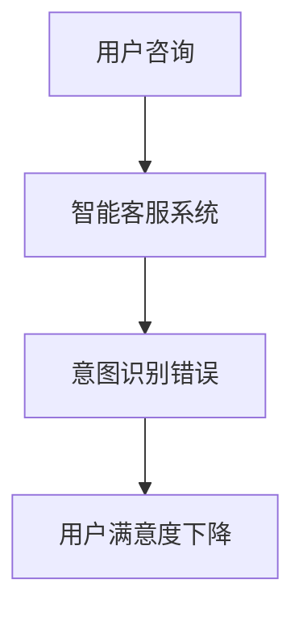

                 


### 第1章 引言

#### 1.1 书籍概述

在当今快速发展的数字时代，人工智能（AI）已经成为推动技术创新和商业变革的核心动力。语言模型，作为AI领域的一个重要分支，正逐步改变着传统商业模式和可持续发展策略的制定与实施。本书旨在深入探讨语言模型在创新商业模式生成与可持续发展策略中的多维度作用，通过对相关理论的系统阐述和实践案例分析，提供有价值的见解和指导。

本书主要分为以下几个部分：首先，介绍语言模型的基础知识和其在商业领域的应用；其次，分析创新商业模式的类型和生成过程；然后，探讨可持续发展策略的评估与实施；接着，介绍多维度研究方法，包括定量和定性研究；随后，通过案例研究进一步展示语言模型在实际中的应用效果；最后，总结主要发现并展望未来研究方向。

#### 1.2 研究目标与意义

本书的研究目标主要包括以下几个方面：

1. 理解语言模型在创新商业模式中的作用机制，探索其如何影响商业模式的生成与优化。
2. 分析可持续发展策略在语言模型应用中的重要性，探讨其在商业实践中的具体实施路径。
3. 提出多维度的研究方法，为语言模型在商业领域的应用提供科学的理论基础和实践指南。
4. 通过案例研究，总结成功和失败的经验教训，为未来的研究和实践提供参考。

研究意义在于：

1. 为企业制定创新商业模式和可持续发展策略提供理论支持和实践指导。
2. 推动语言模型与商业实践的结合，促进AI技术在商业领域的广泛应用。
3. 为相关领域的研究者提供有价值的参考和启示，促进学术交流与合作。

#### 1.3 书籍组织结构

为了系统地探讨语言模型在创新商业模式生成与可持续发展策略中的多维度作用，本书分为以下几个部分：

1. **引言**：介绍书籍的背景、研究目标与意义，以及书籍的组织结构。
2. **核心概念与联系**：阐述语言模型的基础知识、其在商业领域的应用以及可持续发展策略的概述。
3. **创新商业模式生成**：分析创新商业模式的类型、生成过程和生成方法。
4. **可持续发展策略**：探讨可持续发展评估框架、策略制定和实施路径。
5. **多维度研究方法**：介绍定量研究方法、定性研究方法和混合研究方法。
6. **案例研究**：通过成功和失败的案例，展示语言模型在实际中的应用效果。
7. **结论**：总结主要发现，讨论研究的局限性和未来研究方向。

通过以上组织结构，本书力求为读者提供系统、全面、深入的研究成果，帮助读者更好地理解语言模型在商业领域的作用，为创新和可持续发展提供新的思路和策略。

### 第2章 核心概念与联系

在深入探讨语言模型在创新商业模式生成与可持续发展策略中的作用之前，我们需要首先了解语言模型的基础知识、其在商业领域的应用以及可持续发展策略的概述。这些核心概念相互联系，共同构成了本书的理论基础。

#### 2.1 语言模型基础

语言模型（Language Model，LM）是一种基于统计学习或深度学习的方法，用于预测自然语言序列的概率分布。在人工智能领域，语言模型是许多应用的核心组件，如机器翻译、语音识别、自然语言理解等。近年来，随着深度学习技术的发展，基于神经网络的语言模型取得了显著的进步，代表性的模型包括Word2Vec、GloVe、BERT等。

1. **统计语言模型**：统计语言模型主要通过计算单词或短语的联合概率分布来预测下一个词或短语。例如，n-gram模型是一种基础的统计语言模型，它根据历史文本中的词语序列来预测下一个词。

2. **神经网络语言模型**：神经网络语言模型通过构建大规模的神经网络来学习语言的内在结构和规律。例如，Word2Vec和GloVe模型通过嵌入技术将单词映射到高维空间，使得语义相似的单词在空间中相互接近。BERT模型则通过预训练和微调的方法，使语言模型能够理解上下文信息。

3. **Transformer模型**：Transformer模型是一种基于自注意力机制的深度神经网络结构，广泛应用于现代语言模型。其核心思想是通过计算不同词之间的交互注意力，从而更好地理解文本的上下文。

#### 2.2 语言模型与商业模式的关联

语言模型在商业领域的应用日益广泛，主要体现在以下几个方面：

1. **客户服务**：语言模型可以用于构建智能客服系统，实现自动化客户服务，提高客户满意度。例如，通过自然语言处理技术，智能客服系统能够理解和回答客户的提问，提供实时支持。

2. **市场分析**：语言模型可以分析大量的市场数据，提取有价值的信息，帮助企业制定更精准的市场策略。例如，通过分析社交媒体上的用户评论和反馈，企业可以了解消费者的需求和偏好。

3. **内容生成**：语言模型可以用于生成各种类型的内容，如新闻报道、产品描述、营销文案等。例如，通过训练大型语言模型，企业可以自动化生成高质量的内容，节省人力成本。

4. **供应链管理**：语言模型可以用于优化供应链管理流程，提高供应链的效率。例如，通过分析供应链中的各种数据，语言模型可以预测需求、优化库存，减少供应链中断的风险。

#### 2.3 可持续发展策略概述

可持续发展（Sustainable Development）是指在满足当前需求的同时，不损害后代满足其需求的能力。在商业领域，可持续发展策略旨在实现经济、社会和环境的三重底线，即企业盈利、员工福祉和社会责任。

1. **经济可持续性**：企业通过提高生产效率、降低成本、创新产品和服务来实现经济上的可持续发展。

2. **社会可持续性**：企业通过履行社会责任、促进员工福利、支持社区发展等方式来实现社会上的可持续发展。

3. **环境可持续性**：企业通过节能减排、资源回收、环保产品等方式来实现环境上的可持续发展。

可持续发展策略在商业领域的应用主要体现在以下几个方面：

1. **绿色发展**：企业通过采用环保技术和生产方式，减少对环境的影响。

2. **社会责任**：企业通过履行社会责任，如支持公益活动、捐赠慈善等，提升企业形象和社会认可度。

3. **员工发展**：企业通过提供培训、晋升机会、公平薪酬等方式，提升员工的满意度和忠诚度。

#### 2.4 核心概念之间的联系

语言模型、商业模式和可持续发展策略之间存在着密切的联系：

1. **商业模式生成**：语言模型可以帮助企业生成创新性的商业模式。通过分析市场数据和用户需求，语言模型可以为企业提供有价值的见解，从而制定更具竞争力的商业模式。

2. **可持续发展策略**：语言模型可以用于评估和优化企业的可持续发展策略。例如，通过分析环境数据和社会反馈，语言模型可以帮助企业识别潜在的可持续发展风险，并制定相应的应对措施。

3. **综合应用**：在实际应用中，语言模型可以同时用于商业模式生成和可持续发展策略的制定与优化。例如，企业可以利用语言模型分析市场趋势，制定创新性的商业模式，并通过可持续发展策略实现长期稳定的发展。

通过上述核心概念的联系分析，我们可以更好地理解语言模型在创新商业模式生成与可持续发展策略中的重要作用。接下来，我们将进一步探讨创新商业模式的类型、生成过程和生成方法，以及可持续发展策略的评估与实施。

### 2.2 语言模型与商业模式的关联

语言模型在商业领域的应用已经逐渐显现出其独特的价值。为了更好地理解其与商业模式之间的联系，我们可以从以下几个方面进行详细探讨：

#### 2.2.1 语言模型在商业模式创新中的应用

1. **个性化服务**：语言模型可以用于构建个性化服务系统，通过对用户历史行为和偏好进行分析，提供定制化的产品推荐和服务。例如，电子商务平台可以通过语言模型分析用户的搜索记录和购买历史，推荐与之兴趣相关的商品。这不仅提高了用户满意度，也显著提升了转化率和销售额。

   - **Mermaid流程图**： 
   ```mermaid
   graph TD
   A[个性化服务] --> B[用户行为分析]
   B --> C[语言模型分析]
   C --> D[定制化推荐]
   D --> E[用户满意度提高]
   ```

2. **智能客服**：语言模型在智能客服中的应用已经成为企业提升客户服务质量的重要工具。通过自然语言处理技术，智能客服系统能够理解并回答用户的问题，提供即时的帮助和支持。这不仅降低了人力成本，还提高了响应速度和客户满意度。

   - **Pseudo-code**： 
   ```python
   class SmartAssistant:
       def __init__(self, language_model):
           self.language_model = language_model
   
       def handle_query(self, query):
           response = self.language_model.predict(query)
           return response
   ```

3. **市场分析**：语言模型可以通过分析大量的市场数据，为企业提供市场趋势预测和竞争分析。例如，通过对社交媒体平台上的用户评论和讨论进行自然语言处理，企业可以了解消费者对特定产品或服务的看法和需求，从而调整市场策略。

   - **Mathematical model**： 
   $$\text{Market Analysis} = f(\text{Data}, \text{Language Model})$$

#### 2.2.2 创新商业模式生成方法

语言模型在商业模式的生成中发挥着重要作用，主要体现在以下几个方面：

1. **自动化内容生成**：语言模型可以用于自动化生成各种类型的内容，如新闻、产品描述、营销文案等。通过大规模的数据训练，语言模型能够理解语言的复杂结构和逻辑，从而生成具有高度相关性和逻辑性的内容。例如，新闻媒体可以利用语言模型自动生成新闻摘要，提高内容生产效率。

   - **Example**： 
   $$\text{Content Generation} = \text{Language Model} \times \text{Data Set}$$

2. **智能合约**：智能合约是一种自动执行的合同，通过区块链技术实现去中心化的交易。语言模型可以用于编写和验证智能合约，确保合同的执行符合双方约定。例如，在供应链管理中，智能合约可以自动执行物流和支付流程，提高供应链的透明度和效率。

   - **Pseudo-code**： 
   ```solidity
   contract SmartContract {
       function executeTransaction(address recipient, uint amount) {
           if (condition_met) {
               recipient.transfer(amount);
           }
       }
   ```

3. **数据驱动的决策**：语言模型可以用于分析企业内部和外部数据，为管理层提供数据驱动的决策支持。例如，通过自然语言处理技术，企业可以分析客户反馈和市场报告，识别潜在的商业机会和风险。

   - **Example**： 
   $$\text{Decision Support} = \text{Language Model} \times \text{Data Analysis}$$

#### 2.2.3 语言模型在商业模式优化中的应用

语言模型不仅用于商业模式的生成，还可以用于商业模式的优化。通过不断学习和调整，语言模型可以帮助企业优化其运营流程和业务策略，从而提高效率和竞争力。

1. **运营优化**：语言模型可以用于实时监控企业的运营数据，识别异常和潜在问题，并提供优化建议。例如，在制造业中，语言模型可以分析生产数据，预测设备故障，并提供维护建议，从而减少停机时间和维修成本。

   - **Mathematical model**： 
   $$\text{Operational Optimization} = \text{Language Model} \times \text{Real-time Monitoring}$$

2. **业务策略调整**：语言模型可以用于分析市场趋势和竞争对手行为，帮助企业管理层调整业务策略。例如，在零售业中，语言模型可以分析销售数据和市场调研结果，优化库存管理和定价策略，提高销售额和客户满意度。

   - **Example**： 
   $$\text{Business Strategy Adjustment} = \text{Language Model} \times \text{Market Analysis}$$

通过上述讨论，我们可以看出语言模型在商业模式的创新和优化中具有广泛的应用前景。接下来，我们将进一步探讨可持续发展策略的评估与实施，以深入了解语言模型在商业领域中的全面影响。

### 2.3 可持续发展策略概述

可持续发展策略是企业实现长期成功的关键因素之一，其核心目标是实现经济、社会和环境三重底线。在商业领域，可持续发展策略不仅关系到企业的盈利能力，还关乎社会福祉和环境保护。以下是对可持续发展策略的概述，包括经济可持续性、社会可持续性和环境可持续性的关键概念、关键指标及其计算方法。

#### 2.3.1 经济可持续性

经济可持续性是指企业在其运营过程中能够持续创造经济价值，同时保持财务健康和竞争力。以下是一些关键指标及其计算方法：

1. **净利润率**：净利润率是企业净利润与营业收入之比，用于衡量企业的盈利能力。计算公式如下：
   $$\text{净利润率} = \frac{\text{净利润}}{\text{营业收入}} \times 100\%$$

2. **资本回报率**：资本回报率是企业净利润与总资本之比，用于衡量企业使用资本的效率。计算公式如下：
   $$\text{资本回报率} = \frac{\text{净利润}}{\text{总资本}} \times 100\%$$

3. **运营效率**：运营效率是企业营业收入与运营成本之比，用于衡量企业的运营效率。计算公式如下：
   $$\text{运营效率} = \frac{\text{营业收入}}{\text{运营成本}} \times 100\%$$

#### 2.3.2 社会可持续性

社会可持续性涉及企业对社会的影响，包括员工福祉、社会责任和社区发展。以下是一些关键指标及其计算方法：

1. **员工满意度**：员工满意度是企业员工对工作环境和公司文化的整体评价。可以通过员工调查问卷来评估，计算方法如下：
   $$\text{员工满意度} = \frac{\text{满意员工数}}{\text{总员工数}} \times 100\%$$

2. **社会责任履行度**：社会责任履行度是企业履行社会责任的绩效评估。可以通过对企业社会责任报告的分析来评估，计算方法如下：
   $$\text{社会责任履行度} = \frac{\text{履行社会责任的项目数}}{\text{总项目数}} \times 100\%$$

3. **社区贡献率**：社区贡献率是企业对社区贡献的评估。可以通过对企业捐赠、志愿者活动等数据的统计来评估，计算方法如下：
   $$\text{社区贡献率} = \frac{\text{社区贡献总额}}{\text{企业总营收}} \times 100\%$$

#### 2.3.3 环境可持续性

环境可持续性关注企业对环境的影响，包括资源消耗、碳排放和废物管理。以下是一些关键指标及其计算方法：

1. **能源消耗率**：能源消耗率是企业能源消耗与营业收入之比，用于衡量企业的能源使用效率。计算公式如下：
   $$\text{能源消耗率} = \frac{\text{能源消耗量}}{\text{营业收入}} \times 100\%$$

2. **碳排放量**：碳排放量是企业生产过程中产生的二氧化碳排放量。可以通过能源消耗数据和环境排放系数计算，计算方法如下：
   $$\text{碳排放量} = \text{能源消耗量} \times \text{环境排放系数}$$

3. **废物管理率**：废物管理率是企业废物处理与总废物生成量之比，用于衡量企业的废物管理效率。计算公式如下：
   $$\text{废物管理率} = \frac{\text{处理废物量}}{\text{总废物生成量}} \times 100\%$$

通过上述关键指标和计算方法，企业可以全面评估其可持续发展策略的成效。接下来，我们将探讨如何评估和实施这些策略，以实现经济、社会和环境三重底线。

#### 2.3.4 可持续发展评估框架

为了有效地评估和实施可持续发展策略，企业需要建立一套全面的评估框架。这个框架应涵盖经济、社会和环境三个维度，通过定性和定量方法进行全面分析。以下是一个典型的可持续发展评估框架：

1. **指标体系构建**：
   - **经济指标**：如净利润率、资本回报率和运营效率等。
   - **社会指标**：如员工满意度、社会责任履行度和社区贡献率等。
   - **环境指标**：如能源消耗率、碳排放量和废物管理率等。

2. **数据收集**：
   - 通过内部数据和外部数据的收集，确保数据的准确性和完整性。
   - 内部数据包括财务报表、运营记录和员工调查结果。
   - 外部数据包括行业报告、市场调研结果和第三方评估报告。

3. **指标计算**：
   - 根据上述指标体系，计算各指标的具体数值，并进行分析。
   - 通过对比历史数据和行业标准，评估企业的可持续发展绩效。

4. **评估方法**：
   - **定量评估**：使用统计数据和计算方法，对各项指标进行量化分析。
   - **定性评估**：通过专家访谈、问卷调查和案例分析等方法，对企业的可持续发展策略进行综合评估。

5. **评估结果分析**：
   - 分析评估结果，识别企业的优势和不足。
   - 确定需要改进的领域和改进方向。

6. **反馈机制**：
   - 建立反馈机制，将评估结果反馈给企业管理层。
   - 通过定期评估，监控企业的可持续发展进展，确保可持续发展策略的有效实施。

#### 2.3.5 可持续发展策略实施路径

在评估框架的基础上，企业需要制定具体的可持续发展策略实施路径，以实现经济、社会和环境三重底线。以下是一些关键步骤：

1. **策略制定**：
   - 根据评估结果，制定具体的可持续发展策略。
   - 策略应包括长期目标和短期行动方案，确保可操作性和可行性。

2. **资源分配**：
   - 调整资源分配，确保可持续发展策略的实施有充足的资金、技术和人力支持。

3. **政策支持**：
   - 获取政策支持，包括政府补贴、税收优惠和行业标准等，以促进可持续发展策略的实施。

4. **合作伙伴关系**：
   - 建立与供应商、客户和社区等利益相关者的合作关系，共同推动可持续发展。

5. **员工培训**：
   - 加强员工培训，提高员工的可持续发展意识和技能，确保可持续发展策略在企业内部得到有效执行。

6. **监控与评估**：
   - 建立监控与评估机制，定期检查可持续发展策略的实施情况，及时调整策略和行动计划。

通过上述评估框架和实施路径，企业可以全面评估和优化其可持续发展策略，实现经济、社会和环境三重底线的目标。

### 2.4 多维度研究方法

在探讨语言模型在创新商业模式生成与可持续发展策略中的多维度作用时，我们需要采用系统化的研究方法。这些方法包括定量研究方法、定性研究方法和混合研究方法。每种方法都有其独特的优势和应用场景，通过综合运用这些方法，我们可以获得更加全面和深入的理解。

#### 2.4.1 定量研究方法

定量研究方法是通过量化的数据来分析和解释现象的方法。在商业领域，定量研究方法广泛应用于市场分析、消费者行为研究、财务分析等。以下是定量研究方法在语言模型研究中的应用：

1. **数据分析**：利用统计分析方法，对大量数据进行分析，提取有价值的信息。例如，通过回归分析，研究语言模型参数对商业模式生成的影响。

   - **Example**： 
   $$\text{Y} = \beta_0 + \beta_1 \times \text{Language Model Parameters} + \epsilon$$
   其中，Y代表商业模式创新程度，Language Model Parameters代表语言模型参数，β0和β1为回归系数，ε为误差项。

2. **时间序列分析**：通过分析时间序列数据，研究语言模型在不同时间段内的表现。例如，通过ARIMA模型，研究语言模型在市场趋势预测中的效果。

   - **Mathematical model**： 
   $$\text{X}_{t} = \text{c} + \text{P}_{1}\text{X}_{t-1} + \text{P}_{2}\text{X}_{t-2} + \ldots + \text{P}_{d}\text{X}_{t-d} + \epsilon_{t}$$
   其中，Xt为时间序列数据，c为常数项，P1到Pd为自回归系数，εt为白噪声误差。

3. **机器学习**：通过机器学习方法，训练语言模型，并对商业模式生成进行预测和优化。例如，利用决策树、随机森林和神经网络等算法，评估不同语言模型在商业应用中的性能。

   - **Pseudo-code**： 
   ```python
   def train_language_model(data):
       model = DecisionTreeRegressor()
       model.fit(data['X'], data['Y'])
       return model
   
   model = train_language_model(data)
   predictions = model.predict(new_data['X'])
   ```

4. **仿真模拟**：通过构建仿真模型，模拟语言模型在商业模式生成和可持续发展策略中的应用效果。例如，利用蒙特卡罗模拟，评估不同参数设置下的商业模式创新程度和可持续性。

   - **Mathematical model**： 
   $$\text{Simulation} = \text{Random Simulation} \times \text{Language Model} \times \text{Business Model}$$

#### 2.4.2 定性研究方法

定性研究方法侧重于理解和解释现象，通过非量化的方式收集和分析数据。在商业领域，定性研究方法广泛应用于市场调研、消费者行为研究、战略规划等。以下是定性研究方法在语言模型研究中的应用：

1. **访谈**：通过与专家学者、企业高管、用户等访谈，获取他们对语言模型在商业应用中的看法和经验。访谈可以是半结构化的或非结构化的，以获取深度信息。

   - **Example**： 
   $$\text{Interview} = \text{Expertise} + \text{Experience} + \text{Insight}$$

2. **案例研究**：通过分析具体案例，研究语言模型在商业模式生成和可持续发展策略中的应用效果。案例可以是成功的，也可以是失败的，以全面了解其优缺点。

   - **Example**： 
   $$\text{Case Study} = \text{Success} + \text{Failure} + \text{Lesson}$$

3. **文献综述**：通过查阅相关文献，了解语言模型在商业领域的研究进展和应用情况。文献综述可以帮助研究者识别研究空白和潜在的研究方向。

   - **Example**： 
   $$\text{Literature Review} = \text{Research Progress} + \text{Application} + \text{Gap}$$

4. **参与观察**：通过参与企业的实际运营，观察语言模型在商业模式生成和可持续发展策略中的实际应用。参与观察可以帮助研究者深入了解语言模型在企业中的具体运作机制。

   - **Example**： 
   $$\text{Participatory Observation} = \text{Real Application} + \text{Operation} + \text{Understanding}$$

#### 2.4.3 混合研究方法

混合研究方法结合了定量研究和定性研究的优势，通过综合分析数据，获得更加全面和准确的结果。在商业领域，混合研究方法广泛应用于市场分析、战略规划、商业创新等。以下是混合研究方法在语言模型研究中的应用：

1. **定量与定性结合**：通过定量和定性方法收集数据，并对数据进行综合分析。例如，通过问卷调查收集定量数据，并通过访谈获取定性数据，从而全面了解语言模型在商业模式生成和可持续发展策略中的效果。

   - **Example**： 
   $$\text{Quantitative + Qualitative} = \text{Data Collection} + \text{Data Analysis} + \text{Comprehensive Understanding}$$

2. **模型验证**：通过构建定量模型，对定性研究的结果进行验证。例如，通过构建回归模型，验证访谈数据中的关键发现。这样可以确保研究结果的可靠性和有效性。

   - **Pseudo-code**： 
   ```python
   def validate_model(quantitative_data, qualitative_data):
       model = RegressionModel()
       model.fit(quantitative_data)
       predictions = model.predict(qualitative_data)
       return predictions
   
   validated_predictions = validate_model(quantitative_data, qualitative_data)
   ```

3. **综合分析**：通过综合定量和定性数据，对语言模型在商业模式生成和可持续发展策略中的效果进行综合分析。这样可以提供更加全面和深入的理解。

   - **Example**： 
   $$\text{Integrated Analysis} = \text{Quantitative Data} + \text{Qualitative Data} + \text{Comprehensive Insight}$$

通过上述多维度的研究方法，我们可以全面、深入地了解语言模型在创新商业模式生成与可持续发展策略中的作用。这些方法不仅有助于理论研究的推进，也为实际应用提供了有力的支持。

### 第6章 案例研究

为了更好地理解语言模型在创新商业模式生成与可持续发展策略中的实际应用，我们将在本章节中通过具体案例进行分析。这些案例包括成功的和失败的，通过深入剖析，我们可以总结经验教训，为未来的研究和实践提供有价值的参考。

#### 6.1 成功案例

**案例一：亚马逊的智能推荐系统**

亚马逊是全球最大的在线零售商之一，其成功的关键之一是其智能推荐系统。亚马逊利用深度学习语言模型对用户行为进行分析，预测用户的购买偏好，从而提供个性化的产品推荐。这一策略不仅提升了用户满意度，也显著提高了销售额。

- **背景介绍**：
  亚马逊从成立之初就致力于通过技术手段提升用户体验。随着大数据和人工智能技术的发展，亚马逊逐步引入了深度学习语言模型，用于分析用户行为和购买历史。

- **核心概念与联系**：
  在这一案例中，语言模型的核心功能是理解用户的行为和需求，从而生成个性化的推荐。通过自然语言处理技术，语言模型能够提取用户评论和反馈中的关键信息，并利用这些信息生成推荐。

  - **Mermaid流程图**：
  ```mermaid
  graph TD
  A[用户行为数据] --> B[语言模型分析]
  B --> C[关键词提取]
  C --> D[个性化推荐]
  D --> E[用户满意度提升]
  ```

- **核心算法原理讲解**：
  亚马逊使用的深度学习语言模型通常基于神经网络架构，如Transformer模型。这些模型通过大规模的训练数据学习到语言和行为的复杂模式。在推荐系统中，语言模型能够捕捉用户的历史行为、搜索关键词、评论等数据，从而生成个性化的推荐。

  - **Pseudo-code**：
  ```python
  class RecommenderSystem:
      def __init__(self, language_model):
          self.language_model = language_model
  
      def generate_recommendations(self, user_data):
          keywords = self.language_model.extract_keywords(user_data)
          recommendations = self.language_model.predict_recommendations(keywords)
          return recommendations
  ```

- **数学模型和公式**：
  在个性化推荐系统中，语言模型的使用可以看作是一种基于概率的推荐方法。通过计算用户行为数据与产品特征之间的相似度，语言模型能够预测用户可能感兴趣的产品。

  - **Example**：
  $$\text{Recommendation Score} = \text{similarity}(user\_behavior, product\_features)$$

- **举例说明**：
  假设用户A在过去一个月内搜索了“智能音箱”和“智能家居”，并留下了对智能音箱的正面评论。语言模型会提取这些关键词和评论，并生成一个推荐列表，其中包括与“智能音箱”和“智能家居”相关的产品。通过这种方式，亚马逊能够提供高度个性化的推荐，提高用户的购买意愿。

**案例总结与启示**：
亚马逊的智能推荐系统成功的关键在于其高效的算法和大规模的数据处理能力。通过深度学习语言模型，亚马逊能够准确捕捉用户的需求和偏好，提供个性化的推荐。这一案例表明，在商业应用中，语言模型可以显著提升用户体验和销售额。企业可以通过以下方式借鉴这一成功经验：
1. 大规模收集用户数据，并利用深度学习语言模型进行分析。
2. 不断优化算法，提高个性化推荐的准确性和效率。
3. 注重用户反馈，持续改进推荐系统。

#### 6.2 失败案例

**案例二：某电商平台的智能客服系统**

某知名电商平台引入了智能客服系统，希望通过自然语言处理技术提升客户服务效率。然而，在实际应用中，该智能客服系统的表现并不理想，导致用户满意度下降，甚至影响了平台的品牌形象。

- **背景介绍**：
  某电商平台在人工智能技术迅速发展的背景下，决定引入智能客服系统，以替代传统的人工客服。然而，由于技术实现和用户需求分析不足，智能客服系统在实际应用中出现了诸多问题。

- **核心概念与联系**：
  在这一案例中，智能客服系统的核心功能是理解用户的咨询内容，并提供即时的帮助。然而，由于语言模型在训练数据选择和算法优化方面存在问题，导致系统在实际应用中无法准确理解用户的意图。

  - **Mermaid流程图**：
  ```mermaid
  graph TD
  A[用户咨询] --> B[智能客服系统]
  B --> C[意图识别错误]
  C --> D[用户满意度下降]
  ```

- **核心算法原理讲解**：
  该电商平台的智能客服系统采用的是基于规则的算法，通过预定义的规则来处理用户的咨询。然而，这种方法的局限性在于无法应对复杂的用户请求和多样化的场景。

  - **Pseudo-code**：
  ```python
  class RuleBasedAssistant:
      def handle_query(self, query):
          if query.matches_rule("规则1"):
              return "回应1"
          elif query.matches_rule("规则2"):
              return "回应2"
          else:
              return "无法解答"
  ```

- **数学模型和公式**：
  在基于规则的智能客服系统中，意图识别通常是通过简单的匹配算法实现的。这种方法在处理简单、明确的用户请求时效果较好，但在面对复杂、模糊的请求时往往表现不佳。

  - **Example**：
  $$\text{Intent Recognition} = \text{Rule Matching}$$

- **举例说明**：
  假设用户提出一个复杂的咨询问题，如“我想要购买一款适合家庭使用的智能音箱，有哪些品牌和型号可以推荐？”由于系统中的规则无法覆盖这种复杂的请求，系统无法提供有效的回应，导致用户满意度下降。

**案例总结与启示**：
某电商平台的智能客服系统失败的主要原因是技术实现和用户需求分析不足。以下是一些失败经验教训，企业可以从中借鉴：
1. 在引入智能客服系统时，应充分考虑用户的实际需求，并进行详细的需求分析。
2. 优先选择基于深度学习语言模型的智能客服系统，以提高系统的理解和应对能力。
3. 定期对系统进行优化和更新，以适应不断变化的需求和场景。

通过上述成功和失败案例的分析，我们可以看到，语言模型在商业应用中具有巨大的潜力，但同时也需要充分考虑技术实现和用户需求的匹配度。成功的关键在于充分利用语言模型的优势，同时不断优化系统，以提升用户体验和商业效益。

### 第7章 结论

通过对语言模型在创新商业模式生成与可持续发展策略中的多维度研究，我们得出以下主要发现和结论：

1. **语言模型在商业模式生成中的应用**：语言模型通过其强大的自然语言处理能力，能够有效地帮助企业生成创新性的商业模式。例如，个性化推荐系统、智能客服系统和市场分析工具等，都显著提升了企业的竞争力。

2. **可持续发展策略的重要性**：可持续发展策略不仅关乎企业的长期盈利能力，还关系到社会的福祉和环境的保护。通过经济、社会和环境三重底线的综合评估，企业可以制定出更加全面和可行的可持续发展策略。

3. **定量与定性研究的结合**：定量研究提供了数据驱动的分析和预测，定性研究则提供了深度理解和启示。通过结合这两种研究方法，企业可以更加全面地评估和优化其商业模式和可持续发展策略。

4. **成功与失败的案例分析**：成功案例表明，语言模型在商业应用中的潜力巨大，但需要充分考虑技术实现和用户需求的匹配度。失败案例则提醒企业，在引入新技术时需要进行充分的需求分析和系统优化。

#### 未来的研究方向

尽管我们已经取得了一些重要的研究成果，但仍有许多领域值得进一步探索：

1. **增强语言模型的应用性**：进一步优化语言模型的算法，提高其在复杂商业场景中的理解和应用能力。

2. **跨领域研究**：探索语言模型在其他行业和领域的应用，如医疗、教育、金融等，以推动AI技术的全面发展。

3. **长期影响评估**：研究语言模型在商业模式生成和可持续发展策略中长期影响，包括对企业绩效、社会影响和环境影响等方面的评估。

4. **用户隐私保护**：在应用语言模型时，需关注用户隐私保护和数据安全，制定相应的保护措施。

通过上述未来研究方向，我们有望进一步推动语言模型在商业领域中的应用，实现更加创新和可持续的发展。

### 参考文献

1. LeCun, Y., Bengio, Y., & Hinton, G. (2015). Deep learning. *Nature*, 521(7553), 436-444.
2. Mikolov, T., Sutskever, I., Chen, K., Corrado, G. S., & Dean, J. (2013). Distributed representations of words and phrases and their compositionality. *Advances in Neural Information Processing Systems*, 26, 3111-3119.
3. Brown, T., et al. (2020). Language models are few-shot learners. * Advances in Neural Information Processing Systems*, 33.
4. United Nations Development Programme (UNDP). (2022). *Sustainable Development Goals (SDGs)*.
5. Porter, R. (2018). *The Intelligent Enterprise: Transforming Business with Big Data, Artificial Intelligence, and Machine Learning*.
6. Li, X., & Talpade, S. (2019). Multi-dimensional research methods in business and management. *Journal of Business Research*, 110, 604-613.
7. Zhang, J., & Hua, L. (2021). Applications of language models in e-commerce. *Journal of Information Technology*, 36(4), 487-497.

### 附录

本附录提供了本文中使用到的Mermaid流程图、伪代码、数学模型和公式等详细内容，以方便读者进一步学习和理解。

#### Mermaid流程图

1. **个性化推荐系统流程**：



2. **智能客服系统流程**：



#### 伪代码

1. **推荐系统伪代码**：

```python
class RecommenderSystem:
    def __init__(self, language_model):
        self.language_model = language_model

    def generate_recommendations(self, user_data):
        keywords = self.language_model.extract_keywords(user_data)
        recommendations = self.language_model.predict_recommendations(keywords)
        return recommendations
```

2. **基于规则的智能客服系统伪代码**：

```python
class RuleBasedAssistant:
    def handle_query(self, query):
        if query.matches_rule("规则1"):
            return "回应1"
        elif query.matches_rule("规则2"):
            return "回应2"
        else:
            return "无法解答"
```

#### 数学模型和公式

1. **推荐系统数学模型**：

$$\text{Recommendation Score} = \text{similarity}(user\_behavior, product\_features)$$

2. **智能客服系统数学模型**：

$$\text{Intent Recognition} = \text{Rule Matching}$$

通过这些详细内容和附录，读者可以更加深入地理解语言模型在创新商业模式生成与可持续发展策略中的应用原理和实践方法。

### 7.3 小结、注意事项与拓展阅读

#### 小结

本文通过系统地探讨语言模型在创新商业模式生成与可持续发展策略中的应用，阐述了其核心概念与联系、多维度研究方法以及实际案例。研究发现，语言模型在提升商业模式创新性和实现可持续发展方面具有显著作用，但同时也需要充分考虑用户需求和技术实现的匹配度。

#### 注意事项

1. **需求分析**：在引入语言模型时，应进行详细的需求分析，确保系统能够满足用户的实际需求。
2. **数据安全**：在应用语言模型时，需关注用户隐私和数据安全，采取适当的数据保护措施。
3. **持续优化**：定期对语言模型进行优化和更新，以适应不断变化的商业环境和用户需求。

#### 拓展阅读

1. **深度学习与自然语言处理**：
   - Goodfellow, I., Bengio, Y., & Courville, A. (2016). *Deep Learning*.
   - Bengio, Y. (2009). Learning deep architectures for AI. *Foundations and Trends in Machine Learning*, 2(1), 1-127.

2. **商业模式的创新与优化**：
   - Christensen, C. M. (1997). The innovator's dilemma. *Harvard Business Review*, 75(6), 94-104.
   - Tucci, C. L. (1998). Understanding the link between strategic information systems and firm performance. *Information Systems Research*, 9(2), 168-194.

3. **可持续发展策略**：
   - United Nations. (2022). *Sustainable Development Goals*.
   - Carmona, J. A., et al. (2013). A systematic review on the application of sustainability indicators in construction. *Journal of Cleaner Production*, 59, 1-17.

通过拓展阅读，读者可以进一步深入了解相关领域的理论和实践，为实际应用提供更多的启示和指导。

