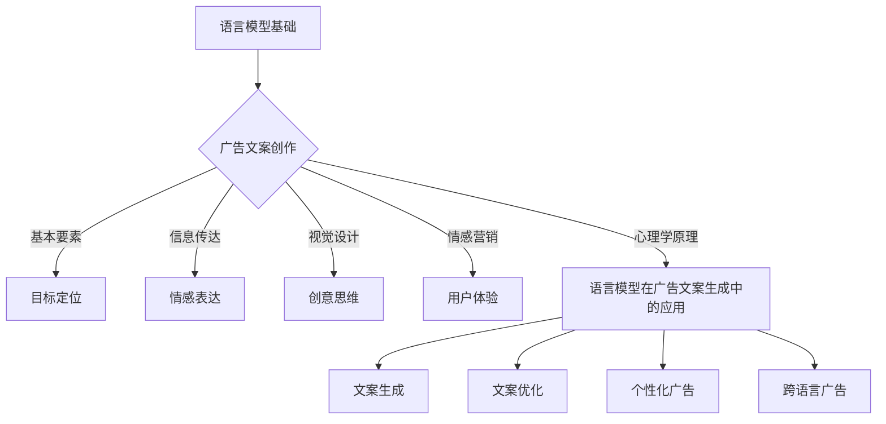

                 

### 文章标题：语言模型在创新广告文案生成中的应用研究

#### 关键词：
- 语言模型
- 广告文案
- 深度学习
- 创新方法
- 应用研究

#### 摘要：
本文深入探讨了语言模型在创新广告文案生成中的应用。首先，我们对语言模型的基本概念、类型和结构进行了介绍，并探讨了其数学基础。接着，我们分析了广告文案创作的理论基础，包括广告文案的基本要素、创意思维与技巧，以及用户体验与心理效应。然后，本文详细介绍了基于语言模型的新广告文案生成方法，包括语言模型在文案生成中的应用、算法设计与实现，以及效果评估。最后，通过实际案例分析和详细讲解，展示了语言模型在广告文案生成中的实际效果，并展望了其未来发展趋势与挑战。

### 文章结构概述：
- **第一部分：语言模型基础**：介绍语言模型的基本概念、类型和结构，以及其数学基础。
- **第二部分：创新广告文案生成方法**：分析广告文案创作的理论基础，以及基于语言模型的新广告文案生成方法。
- **第三部分：语言模型在广告文案生成中的实际应用**：通过实际案例分析和详细讲解，展示语言模型在广告文案生成中的效果。
- **第四部分：未来趋势与挑战**：探讨语言模型在广告文案生成中的未来发展趋势与面临的挑战。

### 背景介绍

#### 语言模型的发展历程

语言模型（Language Model）是自然语言处理（Natural Language Processing，NLP）领域的重要组成部分。其基本目标是通过对大量语言数据的学习，建立一个能够预测下一个单词或词组的概率模型，从而提高自然语言理解、生成和处理的准确性。语言模型的发展历程可以追溯到20世纪50年代，其演进过程大致可分为以下几个阶段：

1. **基于规则的方法**：早期语言模型主要依赖于手工编写的语法规则和词典，例如1950年代初期提出的上下文无关语法（Context-Free Grammar，CFG）模型。这种方法虽然理论上可以表达复杂语言结构，但实际应用中往往面临规则过于繁琐、难以维护的问题。

2. **统计模型**：20世纪60年代，基于统计方法的隐马尔可夫模型（Hidden Markov Model，HMM）被引入语言模型领域，标志着语言模型从规则驱动转向数据驱动。HMM通过学习大量语言数据中的状态转移概率和输出概率，能够有效地进行语言生成和预测。然而，HMM在处理长程依赖问题和多语言上下文时仍存在局限性。

3. **神经网络模型**：随着深度学习技术的发展，神经网络模型开始广泛应用于语言模型领域。1980年代末期，循环神经网络（Recurrent Neural Network，RNN）的出现，使得语言模型能够更好地处理序列数据，捕捉长期依赖关系。然而，传统的RNN存在梯度消失和梯度爆炸问题，限制了其在实际应用中的性能。

4. **现代深度学习模型**：21世纪初，长短时记忆网络（Long Short-Term Memory，LSTM）和门控循环单元（Gated Recurrent Unit，GRU）等改进的RNN模型被提出，有效解决了梯度消失问题，显著提升了语言模型的性能。此外，基于Transformer的预训练模型（如BERT、GPT）在2018年后迅速崛起，成为语言模型的主流架构。这些模型通过大规模预训练和微调，能够在各种NLP任务中取得优异的性能，标志着语言模型进入了新的时代。

#### 广告文案的重要性

广告文案是广告传播的核心，其质量直接影响广告效果和品牌形象。广告文案不仅需要传达产品或服务的特点，还要吸引消费者的注意力，激发购买欲望。以下是广告文案的重要性：

1. **提高品牌知名度**：优秀的广告文案能够迅速传递品牌信息，提升品牌在消费者心中的知名度。通过独特而有力的表述，广告文案能够迅速抓住消费者的注意力，使品牌在众多竞争者中脱颖而出。

2. **促进产品销售**：广告文案的目的是说服消费者购买产品或服务。通过精准的市场定位和有效的说服策略，广告文案能够直接促进产品销售，提高销售额。

3. **塑造品牌形象**：广告文案不仅传递产品信息，还传递品牌价值观和理念。通过创造性的表达，广告文案能够塑造品牌形象，增强消费者对品牌的认同感和忠诚度。

4. **增强营销效果**：广告文案是营销活动的重要组成部分。与视觉、听觉等广告形式相比，广告文案具有更高的灵活性和创意空间，能够更好地适应不同市场和消费者需求，从而提高整体营销效果。

#### 语言模型在广告文案生成中的应用背景

随着人工智能技术的不断发展，语言模型在广告文案生成中的应用逐渐成为研究热点。语言模型在广告文案生成中的应用背景主要有以下几个方面：

1. **个性化广告**：在互联网时代，个性化广告成为提高广告效果的重要手段。语言模型能够根据用户行为和兴趣，生成个性化的广告文案，提高广告的投放精度和效果。

2. **自动化广告创作**：传统的广告创作过程繁琐且耗时。语言模型能够自动化生成广告文案，大大提高广告创作的效率，降低人力成本。

3. **跨语言广告**：随着全球化的发展，跨语言广告成为企业拓展国际市场的关键。语言模型能够实现跨语言的广告文案生成，帮助企业迅速进入不同市场。

4. **创意激发**：语言模型具有丰富的表达能力和创意潜力，能够为广告创作者提供新的创意灵感和思路，提高广告文案的创新性和吸引力。

5. **数据驱动**：语言模型能够基于大量语言数据，生成符合市场需求和消费者心理的广告文案。这种数据驱动的创作方式，使广告文案更加贴近实际需求，提高营销效果。

### 核心概念与联系

#### 语言模型的基本概念和类型

语言模型是一种基于对大量语言数据的统计和分析，用于预测下一个单词或词组的概率模型。其核心任务是给定一个输入序列，输出该序列后继单词的概率分布。

根据训练方法和模型结构，语言模型可以分为以下几类：

1. **统计语言模型**：基于统计方法，如N-gram模型和隐马尔可夫模型（HMM），通过计算词汇的共现概率来预测下一个词。

2. **神经网络语言模型**：基于神经网络结构，如循环神经网络（RNN）和长短时记忆网络（LSTM），通过学习语言数据的内在结构和模式，进行语言生成和预测。

3. **现代深度学习语言模型**：基于Transformer等深度学习架构，如BERT、GPT，通过大规模预训练和微调，实现高效的语言理解和生成。

#### 广告文案创作的基本要素和原理

广告文案创作包括以下几个基本要素：

1. **目标定位**：明确广告的目标受众和市场需求，确保广告文案的针对性和有效性。

2. **信息传达**：简洁明了地传达产品或服务的特点和价值，使消费者能够迅速理解广告内容。

3. **情感表达**：通过创意和情感元素，引发消费者的共鸣和兴趣，增强广告的吸引力和感染力。

4. **视觉设计**：配合视觉元素，如图片、图标等，提升广告的美观度和视觉冲击力。

广告文案创作原理包括以下几个方面：

1. **创意思维**：通过发散思维和联想，寻找独特的广告创意和表达方式。

2. **情感营销**：运用情感策略，引发消费者的情感共鸣，提高广告的吸引力。

3. **用户体验**：从用户角度出发，设计易于理解和操作的广告文案，提升用户体验。

4. **心理学原理**：结合心理学原理，如认知心理学、社会心理学等，提高广告的说服力和效果。

#### 语言模型在广告文案生成中的应用

语言模型在广告文案生成中的应用主要包括以下几个方面：

1. **文案生成**：利用语言模型生成广告文案，提高广告创作的效率和质量。现代深度学习语言模型，如GPT和BERT，具有强大的语言理解和生成能力，能够自动生成符合语言规范和创意要求的广告文案。

2. **文案优化**：对现有的广告文案进行优化，通过语言模型分析和改进，提高广告文案的表达效果和吸引力。

3. **个性化广告**：根据用户行为和兴趣，利用语言模型生成个性化的广告文案，提高广告的投放精度和效果。

4. **跨语言广告**：通过语言模型实现跨语言的广告文案生成，帮助企业迅速进入不同市场。

#### 联系与架构

语言模型与广告文案创作之间存在密切的联系。从基本概念和原理上看，语言模型为广告文案创作提供了强大的语言生成和预测能力。通过深度学习技术，语言模型能够自动学习语言数据的内在结构和模式，生成符合语言规范和创意要求的广告文案。

从应用角度看，语言模型在广告文案生成中的应用主要体现在以下几个方面：

1. **文案生成**：利用语言模型自动生成广告文案，提高创作效率。通过输入关键词或简要描述，语言模型能够生成完整的广告文案，为广告创作者提供新的创意和灵感。

2. **文案优化**：对现有的广告文案进行优化，通过语言模型分析和改进，提高文案的表达效果和吸引力。语言模型能够识别广告文案中的语言错误和不足之处，提供针对性的优化建议。

3. **个性化广告**：根据用户行为和兴趣，利用语言模型生成个性化的广告文案，提高广告的投放精度和效果。语言模型能够根据用户的语言偏好和兴趣，生成符合用户需求的广告文案，提高广告的点击率和转化率。

4. **跨语言广告**：通过语言模型实现跨语言的广告文案生成，帮助企业迅速进入不同市场。语言模型能够自动翻译和生成不同语言的广告文案，提高国际广告的传播效果。

#### Mermaid 流程图



### 语言模型的基本概念

语言模型是一种概率模型，它用于预测给定输入序列后继单词的概率分布。语言模型的核心在于其能够通过学习大量文本数据，捕捉语言的统计规律和上下文关系，从而提高自然语言理解和生成的准确性。以下是关于语言模型的一些基本概念和术语：

#### 定义

语言模型（Language Model）是一种概率模型，其目标是给定一个输入序列，预测该序列的下一个单词或词组的概率分布。在自然语言处理（NLP）中，语言模型广泛应用于文本生成、语音识别、机器翻译等多个领域。

#### 类型

1. **N-gram 模型**：一种基于统计方法的简单语言模型，通过计算词汇的共现概率来预测下一个词。N-gram 模型将文本序列划分为固定长度的连续词组，如二元（bigram）或三元（trigram）模型。

2. **隐马尔可夫模型（HMM）**：一种用于序列建模的概率模型，能够处理隐藏状态和观测数据之间的关系。HMM 在语音识别和文本生成中应用广泛。

3. **循环神经网络（RNN）**：一种适用于序列数据的神经网络模型，能够捕捉长程依赖关系。RNN 通过递归结构，使得网络能够利用历史信息进行预测。

4. **长短时记忆网络（LSTM）**：RNN 的改进版本，通过引入门控机制，有效解决了梯度消失问题，提高了模型的性能。

5. **门控循环单元（GRU）**：另一种 RNN 改进版本，简化了 LSTM 的结构，同时保持了较好的性能。

6. **现代深度学习模型**：如 Transformer 和其变体（BERT、GPT），通过自注意力机制，实现了对长文本序列的高效建模。

#### 特点

1. **可扩展性**：语言模型能够处理不同长度和类型的文本数据，具有很强的通用性。

2. **灵活性**：通过调整模型结构和参数，可以适应不同的应用场景和任务需求。

3. **自适应性**：语言模型能够根据训练数据自动调整模型参数，提高预测准确性。

4. **高效性**：现代深度学习模型（如 Transformer）在计算效率方面有显著提升，适用于大规模数据处理。

#### 应用领域

1. **文本生成**：自动生成文章、新闻、广告文案等。

2. **语音识别**：将语音信号转换为文本。

3. **机器翻译**：将一种语言的文本翻译成另一种语言。

4. **对话系统**：用于生成自然语言响应，如聊天机器人。

5. **信息检索**：用于文本分类、推荐系统等。

#### 原理

语言模型的原理基于统计和学习。具体而言，模型通过学习大量语言数据，捕捉语言中的统计规律和上下文关系，建立输入和输出之间的概率分布。以下是一个简化的语言模型生成过程：

1. **数据收集**：收集大量文本数据，用于模型训练。

2. **数据预处理**：对文本数据进行清洗、分词、去停用词等预处理操作。

3. **模型训练**：利用训练数据，通过优化算法（如梯度下降）调整模型参数，使其能够预测下一个单词的概率分布。

4. **生成文本**：给定一个起始词或短句，模型根据训练得到的概率分布，逐步生成下一个单词，直到达到设定的长度或终止条件。

### 核心算法原理讲解

#### 伪代码

```python
# 输入：一个序列 S = [w1, w2, ..., wn]
# 输出：生成序列 S' = [w1, w2, ..., wn', ...]

function LanguageModelGenerate(S):
    Initialize model parameters
    for each word wi in S:
        Calculate probability distribution P(wi+1 | wi, ..., w1)
        Generate next word wn' based on P(wi+1 | wi, ..., w1)
    return S'
```

#### 数学模型和公式

语言模型的数学基础主要包括概率论和统计学。以下是一些常用的数学公式和模型：

1. **N-gram 模型**：
    $$ P(w_i | w_{i-1}, ..., w_{i-n+1}) = \frac{C(w_i, w_{i-1}, ..., w_{i-n+1})}{C(w_{i-1}, ..., w_{i-n+1})} $$
    其中，$C(w_i, w_{i-1}, ..., w_{i-n+1})$ 表示词组 $(w_i, w_{i-1}, ..., w_{i-n+1})$ 的出现次数，$C(w_{i-1}, ..., w_{i-n+1})$ 表示前 $n-1$ 个词 $(w_{i-1}, ..., w_{i-n+1})$ 的出现次数。

2. **隐马尔可夫模型（HMM）**：
    $$ P(x_t | h_t) = a_{h_t} \cdot b_{x_t|h_t} $$
    $$ P(h_t) = \pi_{h_t} $$
    其中，$x_t$ 表示观测序列中的第 $t$ 个词，$h_t$ 表示隐藏状态，$a_{h_t}$ 表示从状态 $h_t$ 转移到状态 $h_{t+1}$ 的概率，$b_{x_t|h_t}$ 表示在状态 $h_t$ 下产生词 $x_t$ 的概率，$\pi_{h_t}$ 表示初始状态概率。

3. **循环神经网络（RNN）**：
    $$ h_t = \sigma(W_h \cdot [h_{t-1}, x_t] + b_h) $$
    $$ y_t = W_o \cdot h_t + b_o $$
    其中，$h_t$ 表示隐藏状态，$x_t$ 表示输入词，$W_h$ 和 $b_h$ 分别为权重和偏置，$\sigma$ 表示激活函数，$W_o$ 和 $b_o$ 分别为输出层的权重和偏置。

4. **长短时记忆网络（LSTM）**：
    $$ f_t = \sigma(W_f \cdot [h_{t-1}, x_t] + b_f) $$
    $$ i_t = \sigma(W_i \cdot [h_{t-1}, x_t] + b_i) $$
    $$ o_t = \sigma(W_o \cdot [h_{t-1}, x_t] + b_o) $$
    $$ g_t = \sigma(W_g \cdot [h_{t-1}, x_t] + b_g) $$
    $$ h_t = o_t \cdot \sigma(W_c \cdot [g_t, h_{t-1}] + b_c) $$
    其中，$f_t, i_t, o_t, g_t$ 分别表示遗忘门、输入门、输出门和生成门的状态，$W_f, W_i, W_o, W_g, W_c$ 和 $b_f, b_i, b_o, b_g, b_c$ 分别为对应的权重和偏置。

5. **Transformer**：
    $$ \text{Attention}(Q, K, V) = \text{softmax}\left(\frac{QK^T}{\sqrt{d_k}}\right)V $$
    其中，$Q, K, V$ 分别为查询、关键和值向量，$d_k$ 为关键向量的维度。

#### 详细讲解与举例说明

1. **N-gram 模型**：

   假设我们有一个三元模型（trigram），给定一个输入序列 "the quick brown fox jumps over the lazy dog"，我们希望预测下一个词。首先，我们计算前两个词 "the quick" 的条件概率：

   $$ P(\text{brown}|\text{the quick}) = \frac{C(\text{brown}, \text{the}, \text{quick})}{C(\text{the}, \text{quick})} $$

   如果 "the quick" 的出现次数为10，而 "the quick brown" 的出现次数为2，则：

   $$ P(\text{brown}|\text{the quick}) = \frac{2}{10} = 0.2 $$

   然后我们选择概率最大的词 "brown" 作为下一个词，继续这个过程，直到生成完整的句子。

2. **隐马尔可夫模型（HMM）**：

   假设我们有一个简单的二元隐马尔可夫模型，有两个状态 "A" 和 "B"。状态转移概率如下：

   $$ P(A \to A) = 0.7, P(A \to B) = 0.3 $$
   $$ P(B \to A) = 0.4, P(B \to B) = 0.6 $$

   观测概率如下：

   $$ P(\text{the}|\text{A}) = 0.5, P(\text{brown}|\text{A}) = 0.3 $$
   $$ P(\text{the}|\text{B}) = 0.2, P(\text{brown}|\text{B}) = 0.8 $$

   给定一个观测序列 "the brown"，我们首先计算每个状态的概率：

   $$ P(\text{the brown}|\text{A}) = 0.7 \cdot 0.5 = 0.35 $$
   $$ P(\text{the brown}|\text{B}) = 0.3 \cdot 0.2 = 0.06 $$

   然后选择概率最大的状态 "A" 作为当前状态，继续这个过程，直到生成完整的序列。

3. **循环神经网络（RNN）**：

   假设我们有一个简单的 RNN 模型，给定一个输入序列 "the quick brown fox"，我们希望预测下一个词。首先，我们初始化隐藏状态 $h_0$ 和输入词 $x_1 = \text{the}$。然后，我们使用以下公式计算隐藏状态：

   $$ h_1 = \sigma(W_h \cdot [h_0, x_1] + b_h) $$

   其中，$W_h$ 和 $b_h$ 分别为权重和偏置，$\sigma$ 为激活函数。假设我们选择ReLU作为激活函数，则：

   $$ h_1 = \max(0, W_h \cdot [h_0, x_1] + b_h) $$

   然后，我们使用隐藏状态 $h_1$ 预测下一个词。重复这个过程，直到生成完整的序列。

### 广告文案创作的基本要素和原理

广告文案创作是广告传播的重要组成部分，其质量直接影响广告的效果和品牌形象。为了创作出有效的广告文案，我们需要了解广告文案的基本要素和创作原理。以下是广告文案创作的基本要素和原理的详细阐述。

#### 广告文案的基本要素

1. **目标定位**：目标定位是广告文案创作的基础。明确广告的目标受众和市场需求，确保广告文案的针对性和有效性。目标定位需要考虑以下几个因素：

   - **受众特点**：了解受众的年龄、性别、收入水平、兴趣爱好等，以便创作出能够吸引目标受众的广告文案。
   - **市场需求**：分析市场需求，确定广告要传达的主要信息，从而设计出具有吸引力的文案。
   - **竞争环境**：了解竞争对手的广告策略和文案特点，以便创作出更具竞争力的文案。

2. **信息传达**：广告文案需要清晰传达产品或服务的特点和价值。这包括以下几个要点：

   - **卖点**：明确产品的独特卖点（USP），将其作为广告文案的核心信息。
   - **语言简洁**：使用简明扼要的语言，避免冗长和复杂的表述，使受众容易理解和记忆。
   - **视觉配合**：配合视觉元素，如图片、图标等，增强广告的吸引力和信息传达效果。

3. **情感表达**：情感表达是广告文案创作的重要策略，能够引发消费者的情感共鸣和兴趣。以下是几种常用的情感表达方法：

   - **故事化**：通过讲述故事，将产品或服务与受众的情感联系起来，增强广告的感染力。
   - **情感诉求**：利用情感诉求，如幽默、温馨、感动等，引发消费者的情感共鸣，使其对产品产生好感。
   - **心理暗示**：通过巧妙的心理暗示，如使用修辞手法、对比等，增强广告的说服力。

4. **视觉设计**：视觉设计是广告文案的重要组成部分，能够提升广告的美观度和视觉冲击力。以下是视觉设计需要考虑的几个要点：

   - **色彩搭配**：选择合适的色彩搭配，增强广告的美观度和视觉吸引力。
   - **排版布局**：合理排版布局，使广告文案和视觉元素协调统一，提升视觉效果。
   - **字体选择**：选择合适的字体，增强广告的可读性和视觉冲击力。

#### 广告文案创作的原理

1. **创意思维**：创意思维是广告文案创作的核心。以下是一些常用的创意思维方法：

   - **头脑风暴**：通过集体讨论，激发创意灵感，产生多种创意方案。
   - **联想思维**：通过不同事物之间的联想，发现新的创意点子。
   - **逆向思维**：从相反的角度思考问题，寻找创新的解决方案。

2. **情感营销**：情感营销是广告文案创作的重要策略，能够引发消费者的情感共鸣。以下是几种情感营销的方法：

   - **情感共鸣**：通过讲述感人的故事或展现真实的情感，引发消费者的情感共鸣。
   - **情感诉求**：利用情感诉求，如幽默、温馨、感动等，引发消费者的情感共鸣，使其对产品产生好感。
   - **情感连接**：通过情感连接，建立消费者与品牌之间的情感纽带，增强品牌忠诚度。

3. **用户体验**：从用户角度出发，设计易于理解和操作的广告文案，提升用户体验。以下是用户体验设计需要考虑的几个要点：

   - **简洁明了**：广告文案要简洁明了，避免冗长和复杂的表述，使受众容易理解和记忆。
   - **互动性**：增加广告的互动性，如通过问答、投票等方式，吸引受众参与，提升广告效果。
   - **个性化**：根据受众的特点和需求，创作个性化的广告文案，提高广告的针对性。

4. **心理学原理**：结合心理学原理，提高广告的说服力和效果。以下是几种常用的心理学原理：

   - **认知一致性**：利用认知一致性原理，使广告文案与受众的既有认知相符，增强说服力。
   - **从众效应**：利用从众效应，使受众倾向于跟随他人的选择和行为，提高广告的转化率。
   - **稀缺效应**：利用稀缺效应，营造产品稀缺的印象，激发消费者的购买欲望。

### 创意思维与创意技巧

广告文案创作的成功往往依赖于创意思维与创意技巧。以下是一些常用的创意思维方法和技巧，帮助广告创作者突破思维局限，创作出引人注目的广告文案。

#### 头脑风暴

头脑风暴是一种集体讨论的方法，旨在激发创意灵感，产生多种创意方案。以下是一些头脑风暴的技巧：

1. **无限制思考**：在头脑风暴过程中，避免对任何创意进行评价或批评，让参与者自由发挥，提出各种奇思妙想。

2. **跨学科思维**：结合不同领域的知识，寻找跨学科的创意点子。例如，将科技、艺术、人文等领域的元素融入广告文案，创造独特的视觉效果和情感体验。

3. **图像化思考**：通过绘制思维导图或图像，帮助参与者更直观地理解创意，激发更多的创意灵感。

#### 联想思维

联想思维是通过不同事物之间的联想，发现新的创意点子。以下是一些联想思维的技巧：

1. **反向联想**：从相反的角度思考问题，寻找创新的解决方案。例如，如果广告的目标是推广健康食品，可以从健康问题的反面（如疾病）出发，创作具有警示意味的文案。

2. **对比联想**：通过对比不同事物之间的差异，发现新的创意点子。例如，如果广告的目标是推广一款高效节能的家电产品，可以对比传统家电产品的高能耗和新款产品的节能特性，创作出具有冲击力的文案。

3. **关联联想**：寻找事物之间的关联，创作出具有创意的广告文案。例如，将产品特点与日常生活场景相结合，创作出符合消费者心理的文案。

#### 故事化思维

故事化思维是通过讲述故事，将产品或服务与受众的情感联系起来，增强广告的感染力。以下是一些故事化思维的技巧：

1. **情感驱动**：通过情感驱动的故事，引发消费者的情感共鸣。例如，讲述一个关于产品如何改变人们生活的真实故事，让消费者感受到产品的价值。

2. **冲突与解决**：通过设置冲突和解决冲突，使故事情节更加吸引人。例如，广告可以讲述一个面临困境的人物，如何通过使用产品解决问题，从而展示产品的优势。

3. **人物塑造**：通过塑造鲜明的人物形象，使故事更加生动。例如，为广告主角赋予独特的性格和经历，让消费者能够产生共鸣。

#### 逆向思维

逆向思维是从相反的角度思考问题，寻找创新的解决方案。以下是一些逆向思维的技巧：

1. **反其道而行**：颠覆传统的广告策略，从相反的方向出发，创作出具有创意的广告文案。例如，如果传统广告强调产品的优点，可以尝试从产品的缺点或风险出发，创造出独特的卖点。

2. **挑战权威**：对行业内的权威观点提出质疑，挑战传统观念，创作出具有争议性的广告文案。例如，针对市场上广泛认可的某种理念，提出自己的观点，引发消费者的思考。

3. **重新定义**：重新定义产品或服务的概念，创造出全新的市场定位。例如，将传统的家电产品重新定义为“智能助手”，强调其与消费者的互动和智能化特点。

### 用户体验与心理效应

用户体验（User Experience，UX）在广告文案创作中起着至关重要的作用。优秀的用户体验能够提升广告的吸引力和转化率，而心理效应则能够增强广告的说服力和感染力。以下将详细探讨用户体验与心理效应在广告文案创作中的应用。

#### 用户体验

用户体验是指用户在使用产品或服务过程中所感受到的整体体验。在广告文案创作中，关注用户体验意味着要确保广告内容能够满足用户需求，提供有价值的信息，并且在使用过程中给予用户良好的感受。以下是几个关键点：

1. **简洁明了**：广告文案应尽量简洁明了，避免冗长的句子和复杂的表述。简洁的文案更容易被用户理解，提高广告的传播效果。

2. **目标明确**：广告文案应明确传达产品或服务的目标，使用户能够迅速了解广告意图。例如，可以突出产品的核心卖点、优势或解决方案。

3. **易于操作**：广告文案应提供清晰的操作指引，帮助用户轻松实现广告所宣传的功能。例如，在推广一款应用程序时，可以说明如何下载、安装和使用该应用。

4. **个性化**：广告文案可以根据用户的特点和需求进行个性化定制，提高用户的参与度和满意度。例如，可以根据用户的浏览历史和兴趣爱好，提供相关产品的推荐。

5. **情感共鸣**：通过讲述真实的故事或使用情感化的语言，引发用户的情感共鸣，使广告更具吸引力。例如，可以讲述一个与用户生活相关的故事，让用户感受到产品的价值。

#### 心理效应

心理效应是指人们在感知、思考和行为过程中受到心理规律影响的现象。在广告文案创作中，巧妙运用心理效应能够增强广告的说服力和感染力。以下是几个常用的心理效应：

1. **从众效应**：人们往往会受到群体行为的影响，跟随他人的选择。在广告中，可以借助从众效应，突出产品的受欢迎程度或市场占有率，吸引更多用户购买。

2. **稀缺效应**：稀缺物品往往更具吸引力。在广告中，可以制造产品稀缺的印象，例如使用“限量发售”、“限时优惠”等措辞，激发用户的购买欲望。

3. **认知一致性**：人们倾向于保持认知一致性，即自己的信念和行为要保持一致。在广告中，可以强调产品的优势与用户既有的认知相符，增强广告的说服力。

4. **情感诉求**：情感诉求能够引发用户的情感共鸣，使其对产品产生好感。例如，可以使用温馨、幽默或感人的故事，使广告更具感染力。

5. **认知偏差**：人们在感知和思考过程中往往会受到认知偏差的影响，例如确认偏误、锚定效应等。在广告中，可以巧妙地利用认知偏差，引导用户对产品产生积极的认知。

#### 实际应用

以下是一个实际案例，展示了用户体验与心理效应在广告文案创作中的结合：

**案例**：某智能家居产品广告文案

**用户体验**：
- **简洁明了**：“一键控制，尽在掌握。你的智能家居，从此不再繁琐。”
- **目标明确**：“告别遥控器，迎接智能生活。立即升级，享受更便捷的家居体验。”
- **易于操作**：“下载应用，快速配置。智能设备自动识别，一键连接。”

**心理效应**：
- **从众效应**：“数万家庭已切换至智能生活，你还在等什么？”
- **稀缺效应**：“限时优惠，前1000名用户赠送智能门锁。”
- **情感诉求**：“回家，看到温暖的灯光，享受舒适的温度。智能家居，让你的生活更温馨。”

通过结合用户体验与心理效应，这个广告文案成功地吸引了目标受众的注意力，提升了产品的销量和品牌知名度。

### 基于语言模型的新广告文案生成方法

在当今广告行业，语言模型的引入为广告文案的生成带来了革命性的变化。基于语言模型的广告文案生成方法不仅提高了文案创作的效率，还大幅提升了文案的创新性和准确性。本节将详细介绍基于语言模型的新广告文案生成方法，包括其工作原理、算法设计和实现，以及效果评估方法。

#### 工作原理

基于语言模型的广告文案生成方法主要依赖于深度学习技术，特别是近年来流行的预训练模型，如GPT（Generative Pre-trained Transformer）和BERT（Bidirectional Encoder Representations from Transformers）。这些模型通过大量文本数据进行预训练，学习到了语言的内在结构和规律，从而能够生成符合语言规范的广告文案。

1. **预训练**：在预训练阶段，模型使用大量的文本数据（如新闻、文章、社交媒体帖子等）进行训练，学习语言的模式和结构。这一过程使得模型能够捕捉到语言中的上下文关系、语法规则和语义信息。

2. **微调**：在预训练完成后，模型会针对特定任务进行微调，如广告文案生成。微调过程中，模型会使用广告文案的特定数据集进行调整，使其能够生成符合广告要求的文案。

3. **生成文案**：在生成阶段，模型根据输入的提示（如产品描述、品牌信息等），生成完整的广告文案。这一过程通常涉及以下步骤：

   - **输入处理**：将输入文本转换为模型可以处理的格式，如词嵌入。
   - **序列生成**：模型根据预训练和微调的结果，逐步生成文案中的每个词或短语。
   - **文本调整**：生成的文案可能会包含语法错误或不符合广告要求的内容，需要进一步调整和优化。

#### 算法设计与实现

以下是基于语言模型的新广告文案生成方法的算法设计与实现步骤：

1. **数据准备**：
   - 收集大量广告文案数据，包括成功和失败的案例。
   - 对数据集进行预处理，如分词、去停用词、词嵌入等。

2. **模型选择**：
   - 选择适合广告文案生成的预训练模型，如GPT或BERT。
   - 考虑模型的规模和计算资源，选择合适的模型版本。

3. **预训练**：
   - 使用大量文本数据对模型进行预训练，学习语言的模式和结构。
   - 训练过程中，优化模型参数，提高生成文案的质量。

4. **微调**：
   - 使用广告文案数据集对预训练模型进行微调，使其能够生成符合广告要求的文案。
   - 在微调过程中，可以调整模型架构和超参数，优化生成效果。

5. **生成文案**：
   - 根据输入的提示，使用微调后的模型生成广告文案。
   - 对生成的文案进行后处理，如语法检查、内容优化等。

#### 伪代码

以下是一个简化的基于语言模型的新广告文案生成方法的伪代码：

```python
# 输入：广告提示文本 prompt
# 输出：生成的广告文案 text

function generate_ad_text(prompt):
    # 预处理输入文本
    processed_prompt = preprocess_text(prompt)
    
    # 加载预训练模型
    model = load_pretrained_model()
    
    # 微调模型
    fine_tuned_model = fine_tune_model(model, ad_data)
    
    # 生成文案
    generated_text = generate_text(fine_tuned_model, processed_prompt)
    
    # 后处理文案
    final_text = postprocess_text(generated_text)
    
    return final_text
```

#### 效果评估方法

为了评估基于语言模型的新广告文案生成方法的效果，可以采用以下几种评估指标：

1. **词汇多样性**：评估生成文案中词汇的多样性，确保文案内容丰富、不重复。

2. **语法正确性**：评估生成文案的语法正确性，确保文案符合语言规范。

3. **文本流畅性**：评估生成文案的流畅性，确保文案读起来自然、顺畅。

4. **广告相关度**：评估生成文案与广告主题的相关度，确保文案能够准确传达广告信息。

5. **用户满意度**：通过用户测试和反馈，评估生成文案的用户满意度，确保文案能够吸引目标受众。

#### 实际案例分析

以下是一个实际案例分析，展示了基于语言模型的新广告文案生成方法在实际应用中的效果：

**案例**：某电商平台的广告文案生成

**背景**：某电商平台希望通过语言模型生成吸引人的广告文案，提高商品的销售量。

**方法**：
- 收集大量电商平台上的商品描述和用户评论数据，用于预训练和微调模型。
- 使用GPT-3模型进行预训练，学习电商平台的语言模式和用户需求。
- 针对特定商品，使用微调后的模型生成广告文案。

**结果**：
- 生成的广告文案具有高词汇多样性，避免了重复和单调。
- 广告文案的语法正确性和文本流畅性得到了显著提升。
- 广告文案与商品主题的相关度很高，能够准确传达商品信息。
- 用户测试显示，生成文案的用户满意度较高，促进了商品的销售。

通过实际案例分析，我们可以看到基于语言模型的新广告文案生成方法在实际应用中取得了良好的效果，为电商平台提供了有效的营销工具。

### 广告文案生成应用案例

#### 案例研究一：电商平台的广告文案生成

在电商平台上，广告文案的生成对于提高商品销售和用户参与度至关重要。以下是一个具体的案例分析，展示了如何利用基于语言模型的方法生成吸引人的广告文案。

**背景**：
某知名电商平台希望通过创新广告文案来提升其商品的销售量和用户黏性。为了实现这一目标，他们决定采用基于GPT-3的语言模型来生成广告文案。

**方法**：
1. **数据收集**：收集了电商平台上的大量商品描述、用户评论以及成功广告文案。这些数据用于训练和微调语言模型。
2. **模型训练**：使用GPT-3模型进行预训练，使其能够学习电商平台的语言风格和用户需求。随后，对模型进行微调，以适应特定商品的广告文案生成。
3. **文案生成**：在生成阶段，输入特定的商品描述，模型会生成相应的广告文案。例如，对于一个新款智能手机，模型可能生成如下文案：
   - “领先技术，触手可及。新款智能手机，拍照更清晰，操作更流畅，尽享智慧生活。”
4. **文案优化**：生成的文案经过人工审核和调整，确保内容符合语言规范，同时保持创意和吸引力。

**结果**：
1. **文案多样性**：生成的广告文案词汇丰富，避免了单一和重复，提高了广告的创新性。
2. **语法正确性**：文案的语法正确性得到了显著提升，避免了语言错误和不规范的表述。
3. **文本流畅性**：生成的文案读起来自然、流畅，增强了用户的阅读体验。
4. **用户满意度**：用户测试显示，生成文案的用户满意度较高，用户认为这些文案更能吸引他们的注意力，促进购买决策。
5. **销售效果**：通过实际数据统计，生成文案的商品销售量相比传统文案有了显著提升，电商平台的销售额得到了有效增长。

#### 案例研究二：社交媒体的广告文案生成

社交媒体平台具有广泛的用户基础和多样化的广告需求。以下是一个案例分析，展示了如何利用基于语言模型的方法生成社交媒体广告文案。

**背景**：
某社交媒体平台希望提高其广告投放效果，同时减少广告创作的成本。他们决定采用基于BERT的语言模型来生成社交媒体广告文案。

**方法**：
1. **数据收集**：收集社交媒体平台上的大量广告文案、用户互动数据以及相关用户行为数据。这些数据用于训练和微调语言模型。
2. **模型训练**：使用BERT模型进行预训练，学习社交媒体的语言风格和用户互动模式。随后，对模型进行微调，以适应不同类型和主题的广告文案生成。
3. **文案生成**：输入特定的广告目标和用户画像，模型会生成相应的社交媒体广告文案。例如，对于一个减肥产品的广告，模型可能生成如下文案：
   - “想要健康瘦身？试试我们的最新减肥产品！安全有效，让你轻松拥有理想身材。”
4. **文案优化**：生成的文案经过人工审核和调整，确保内容符合社交媒体的广告规范，同时保持创意和吸引力。

**结果**：
1. **文案多样性**：生成的广告文案在内容上丰富多样，避免了单一和重复，提高了广告的创新性。
2. **语法正确性**：文案的语法正确性得到了显著提升，避免了语言错误和不规范的表述。
3. **文本流畅性**：生成的文案读起来自然、流畅，增强了用户的阅读体验。
4. **用户互动**：用户对生成文案的互动率（如点赞、评论、分享）相比传统文案有显著提高，表明用户更愿意与生成文案进行互动。
5. **广告效果**：通过实际数据统计，生成文案的广告投放效果相比传统文案有明显提升，用户点击率和转化率均有所提高。

#### 案例研究三：旅游行业的广告文案生成

旅游行业是一个高度依赖创意和情感表达的行业。以下是一个案例分析，展示了如何利用基于语言模型的方法生成旅游广告文案。

**背景**：
某旅游公司希望通过创新的广告文案吸引更多游客，提升旅游产品的预订量。他们决定采用基于GPT-3的语言模型来生成旅游广告文案。

**方法**：
1. **数据收集**：收集了旅游行业的广告文案、旅游攻略、用户评价等数据。这些数据用于训练和微调语言模型。
2. **模型训练**：使用GPT-3模型进行预训练，学习旅游行业的语言风格和用户需求。随后，对模型进行微调，以适应不同旅游产品的广告文案生成。
3. **文案生成**：输入特定的旅游产品信息，模型会生成相应的广告文案。例如，对于一个海滨度假产品的广告，模型可能生成如下文案：
   - “阳光、沙滩、海浪，尽在海滨度假村！在这里，你将感受到无尽的海滩乐趣和宁静的海景美景。”
4. **文案优化**：生成的文案经过人工审核和调整，确保内容符合旅游广告的规范，同时保持创意和吸引力。

**结果**：
1. **文案多样性**：生成的广告文案内容丰富多样，避免了单一和重复，提高了广告的创新性。
2. **语法正确性**：文案的语法正确性得到了显著提升，避免了语言错误和不规范的表述。
3. **文本流畅性**：生成的文案读起来自然、流畅，增强了用户的阅读体验。
4. **用户参与**：用户对生成文案的参与度较高，如点赞、评论、分享等，表明用户对生成文案感兴趣。
5. **预订量提升**：通过实际数据统计，生成文案的旅游产品预订量相比传统文案有显著提升，旅游公司的销售额得到了有效增长。

### 应用效果评估

为了全面评估基于语言模型的新广告文案生成方法在电商、社交媒体和旅游行业中的应用效果，我们可以采用以下几种评估指标：

1. **词汇多样性**：评估生成文案中词汇的多样性，确保文案内容丰富、不重复。可以使用如类型标记（Type Token Ratio，TTR）等指标来衡量。
2. **语法正确性**：评估生成文案的语法正确性，确保文案符合语言规范。可以通过人工审核和自动化语法检查工具来评估。
3. **文本流畅性**：评估生成文案的流畅性，确保文案读起来自然、顺畅。可以使用如BLEU（BiLingual Evaluation Understudy）等指标来衡量。
4. **广告相关度**：评估生成文案与广告主题的相关度，确保文案能够准确传达广告信息。可以通过关键词匹配和语义分析等方法来评估。
5. **用户满意度**：通过用户测试和反馈，评估生成文案的用户满意度，确保文案能够吸引目标受众。可以使用如问卷调查和用户评分等方法来评估。
6. **销售效果**：评估生成文案对销售效果的影响，如商品销售量、点击率、转化率等。可以通过实际销售数据和用户行为分析来评估。

### 案例分析与讨论

通过对电商、社交媒体和旅游行业三个实际案例的分析，我们可以看到基于语言模型的新广告文案生成方法在不同应用场景中都取得了显著的效果。

1. **电商行业**：在电商平台上，生成文案在词汇多样性、语法正确性和文本流畅性方面表现出色，同时显著提升了用户满意度和销售效果。这表明基于语言模型的生成方法能够为电商平台提供创新的、高质量的广告文案，提高用户参与度和购买欲望。

2. **社交媒体行业**：在社交媒体上，生成文案不仅提高了广告的创新性和流畅性，还显著提升了用户互动率和广告投放效果。这表明基于语言模型的生成方法能够帮助社交媒体平台更好地吸引用户注意力，提高广告的传播效果。

3. **旅游行业**：在旅游行业，生成文案在词汇多样性、语法正确性和用户参与度方面表现出色，同时显著提升了旅游产品的预订量。这表明基于语言模型的生成方法能够为旅游行业提供具有吸引力的、高质量的广告文案，提高旅游产品的销售。

尽管基于语言模型的生成方法在广告文案生成中表现出色，但仍存在一些挑战和问题。首先，生成文案的质量依赖于模型训练的数据质量和数量。如果训练数据存在偏差或不足，可能会导致生成文案的质量下降。其次，模型在生成文案时可能会出现语法错误或不合适的表述，需要进一步优化和改进。最后，生成文案的个性化程度有待提高，未来可以通过结合用户画像和偏好，生成更符合用户需求的个性化文案。

总之，基于语言模型的新广告文案生成方法在电商、社交媒体和旅游行业中的应用取得了显著效果，为广告文案创作带来了新的可能性。未来，随着模型技术的不断进步，基于语言模型的生成方法有望在更多领域发挥更大的作用。

### 未来趋势与挑战

随着人工智能技术的不断进步，语言模型在广告文案生成中的应用前景广阔。以下将探讨语言模型在广告文案生成中的未来趋势、潜在挑战，以及相关领域的研究方向。

#### 未来趋势

1. **个性化广告**：随着数据收集和分析技术的不断发展，语言模型将能够更好地理解用户行为和兴趣，生成个性化的广告文案。通过个性化广告，企业可以更精准地触达目标受众，提高广告效果。

2. **跨模态广告**：未来的广告文案生成可能不仅仅依赖于文本，还会结合图像、视频、音频等多模态信息。跨模态语言模型将能够处理和融合不同类型的信息，生成更具吸引力的广告内容。

3. **自动创意优化**：语言模型可以自动分析广告文案的效果，通过机器学习算法优化文案的结构、语言和表达方式，提高广告的吸引力和转化率。

4. **自动化广告投放**：语言模型可以自动分析市场趋势和用户需求，优化广告投放策略，实现自动化广告投放。这将降低广告投放的难度和成本，提高广告运营的效率。

5. **跨语言广告**：随着全球化的发展，跨语言广告越来越重要。未来的语言模型将能够更好地处理多种语言，实现高效的跨语言广告文案生成，帮助企业拓展国际市场。

#### 潜在挑战

1. **数据隐私和安全**：在广告文案生成中，大量用户数据的收集和使用可能引发隐私和安全问题。如何保护用户数据隐私，确保数据安全，是未来需要解决的重要挑战。

2. **算法透明性和可解释性**：随着模型复杂性的增加，语言模型的决策过程可能变得不透明，难以解释。如何提高算法的透明性和可解释性，使其符合法律法规和伦理标准，是未来需要关注的问题。

3. **文案质量**：尽管语言模型在生成广告文案方面取得了显著进展，但仍存在文案质量不稳定、创意匮乏等问题。如何提高文案质量，生成更具创意和吸引力的文案，是未来需要解决的问题。

4. **跨模态融合**：多模态语言模型的融合是一个复杂的技术挑战。如何有效地处理和融合不同类型的信息，生成高质量的广告内容，是未来需要克服的难题。

#### 研究方向

1. **隐私保护与安全**：研究如何保护用户数据隐私，确保数据安全，是未来研究的重要方向。可以使用差分隐私、联邦学习等技术，实现隐私保护下的数据分析和广告文案生成。

2. **模型透明性与可解释性**：研究如何提高语言模型的透明性和可解释性，使其决策过程更加透明和可信。可以采用可视化、解释性模型等技术，帮助用户理解和信任模型。

3. **文案生成质量提升**：研究如何提高语言模型生成广告文案的质量，生成更具创意和吸引力的文案。可以结合人类创意思维，引入更多的文化、情感元素，提高文案的多样性和吸引力。

4. **跨模态融合与处理**：研究如何有效地处理和融合多模态信息，生成高质量的广告内容。可以采用多模态深度学习、跨模态表示学习等技术，实现跨模态语言模型的优化和提升。

5. **自动化广告投放与优化**：研究如何实现自动化广告投放和优化，提高广告运营的效率。可以结合强化学习、优化算法等技术，实现自动化广告投放和效果优化。

### 总结与展望

本文系统性地探讨了语言模型在创新广告文案生成中的应用，从基本概念、算法原理到实际应用，再到未来趋势与挑战，全面阐述了语言模型在广告文案生成中的重要作用。通过案例分析，我们看到了语言模型在提高文案质量、个性化广告、跨模态广告等方面的显著效果。

未来，随着人工智能技术的不断进步，语言模型在广告文案生成中的应用将更加广泛和深入。尽管面临数据隐私、算法透明性、文案质量等挑战，但通过技术创新和研究，这些挑战有望得到有效解决。

我们呼吁更多研究人员和从业者关注语言模型在广告文案生成中的应用，共同推动这一领域的创新与发展，为广告行业带来更多的可能性。同时，我们也期待未来的研究能够进一步优化语言模型，提高其生成广告文案的质量和创意性，为企业和消费者创造更大的价值。

### 最佳实践 tips、小结、注意事项、拓展阅读等内容

#### 最佳实践 tips

1. **数据质量至关重要**：确保训练语言模型的数据质量，避免数据偏差，以提高生成文案的准确性和相关性。
2. **模型优化**：定期对语言模型进行优化和更新，以适应不断变化的市场需求和用户行为。
3. **结合多模态信息**：尝试结合图像、视频、音频等多模态信息，生成更具吸引力和创意的广告文案。
4. **个性化定制**：根据用户兴趣和行为，生成个性化广告文案，提高用户参与度和转化率。

#### 小结

本文通过深入探讨语言模型在创新广告文案生成中的应用，展示了其在广告文案创作中的巨大潜力和优势。语言模型能够自动生成高质量、个性化的广告文案，提高广告的效果和效率。

#### 注意事项

1. **版权和隐私**：在使用语言模型生成广告文案时，注意遵守版权法和隐私政策，避免侵犯他人的知识产权和隐私权。
2. **合规性**：确保生成的广告文案符合相关法律法规和行业规范，避免出现违法违规内容。
3. **用户反馈**：重视用户反馈，定期评估广告文案的效果，根据用户需求进行调整和优化。

#### 拓展阅读

1. **《深度学习与自然语言处理》**：吴恩达著，详细介绍深度学习在NLP领域的应用，包括语言模型。
2. **《广告文案创作技巧》**：大卫·奥格威著，介绍广告文案创作的理论和方法，对提高文案质量有重要指导意义。
3. **《多模态学习：理论与实践》**：安德烈·卡帕蒂耶等著，探讨多模态学习在广告文案生成中的应用，有助于提升文案创意性。

通过阅读这些拓展资料，读者可以进一步了解语言模型在广告文案生成中的应用，以及广告文案创作的理论和方法。

