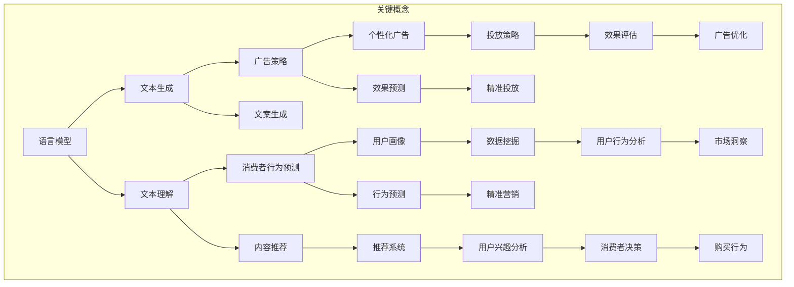

                 

## 文章标题

《语言模型在创新广告策略与消费者行为预测中的多维度研究》

> 关键词：语言模型、创新广告策略、消费者行为预测、多维度研究

> 摘要：本文系统地探讨了语言模型在创新广告策略和消费者行为预测中的应用。通过对语言模型的基本概念、算法原理、应用场景的详细分析，结合实际项目案例，本文揭示了语言模型在提升广告效果和精准预测消费者行为方面的潜力与挑战。

## 引言

在数字化时代，广告策略的变革和创新已经成为企业竞争的重要手段。随着人工智能技术的迅猛发展，语言模型作为一种重要的自然语言处理工具，正在逐渐改变广告策略的设计和实施方式。消费者行为预测是市场营销领域的重要研究方向，它关系到广告投放的精准度和效果。语言模型凭借其强大的文本理解和生成能力，在创新广告策略和消费者行为预测中展现出巨大的潜力。

本文的研究目标是通过多维度分析，探讨语言模型在创新广告策略与消费者行为预测中的应用。具体来说，我们将从以下四个方面展开：

1. **语言模型概述**：介绍语言模型的基本概念、分类和应用领域。
2. **核心算法原理讲解**：详细阐述语言模型的主要算法、训练与优化策略以及性能评估方法。
3. **创新广告策略与消费者行为预测应用**：分析语言模型在广告文案生成、广告效果评估和消费者行为预测中的具体应用。
4. **总结与展望**：总结语言模型在广告策略与消费者行为预测中的优势、挑战，并对未来研究方向提出展望。

本文的结构安排如下：

- **第一部分**：引论，介绍语言模型、创新广告策略和消费者行为预测的基本概念及其联系。
- **第二部分**：语言模型原理与算法，详细讲解语言模型的基本原理、算法、训练与优化策略及性能评估。
- **第三部分**：创新广告策略与消费者行为预测应用，通过实际案例展示语言模型在广告策略和消费者行为预测中的具体应用。
- **第四部分**：总结与展望，总结语言模型在广告策略与消费者行为预测中的优势与挑战，并对未来研究提出建议。

通过本文的研究，我们希望为相关领域的研究者提供有价值的参考，推动语言模型在广告策略与消费者行为预测中的创新应用。

## 语言模型概述

语言模型是自然语言处理（NLP）领域的重要基础，它旨在预测一段文本的下一个词或短语。语言模型的目的是通过学习大量的文本数据，理解语言的统计规律，从而生成或预测新的文本。语言模型在诸多领域有着广泛的应用，包括机器翻译、文本摘要、问答系统、信息检索以及本文探讨的创新广告策略和消费者行为预测。

### 基本概念

语言模型主要基于两个核心概念：**概率分布**和**序列建模**。

1. **概率分布**：语言模型通过学习大量文本数据，为每个单词或短语分配一个概率值。这种概率分布反映了该单词或短语在文本中出现的可能性。
   
2. **序列建模**：文本数据通常是以序列形式出现的，语言模型通过建模这些序列，预测序列中的下一个元素。无论是简单的N-gram模型，还是复杂的神经网络模型，都试图捕捉文本序列的内在规律。

### 分类

根据模型的形式和复杂性，语言模型可以分为以下几类：

1. **N-gram模型**：N-gram模型是最简单的语言模型，它基于前N个词的统计信息来预测下一个词。这种模型简单易实现，但在处理长文本时效果不佳。
   
2. **神经网络模型**：神经网络模型，如循环神经网络（RNN）和长短期记忆网络（LSTM），通过学习序列数据的长期依赖关系，能够生成更高质量的文本。这些模型在自然语言处理任务中取得了显著的成果。

3. **基于注意力的模型**：注意力机制是近年来研究的热点，它通过关注文本序列中的关键部分，提高模型的生成质量。Transformer模型是注意力机制的一种实现，它在很多NLP任务中表现优异。

4. **预训练模型**：预训练模型通过在大规模文本数据上预训练，然后针对具体任务进行微调。BERT和GPT等预训练模型已经成为NLP领域的重要工具。

### 应用领域

语言模型在多个领域有着广泛的应用：

1. **机器翻译**：语言模型在机器翻译中发挥着核心作用，通过学习双语的文本数据，模型可以预测源语言的句子在目标语言中的对应表达。
   
2. **文本摘要**：文本摘要旨在从长文本中提取关键信息，生成简洁的摘要。语言模型通过建模文本序列，能够生成连贯、简洁的摘要文本。

3. **问答系统**：问答系统利用语言模型理解用户的问题，并从大量文本中检索出最相关的答案。

4. **信息检索**：语言模型在信息检索中用于理解用户的查询，并从海量的数据中检索出最相关的信息。

5. **创新广告策略与消费者行为预测**：语言模型在广告策略和消费者行为预测中具有巨大潜力。通过分析用户的历史行为和兴趣，模型可以生成个性化的广告文案，并预测用户的购买行为。

总之，语言模型作为一种强大的自然语言处理工具，正在不断拓展其应用领域，为各行各业提供创新的解决方案。在接下来的章节中，我们将深入探讨语言模型的基本原理和算法，以及它们在广告策略和消费者行为预测中的具体应用。

### 核心概念与联系

在深入探讨语言模型在创新广告策略与消费者行为预测中的应用之前，有必要明确核心概念，并理解它们之间的相互联系。以下是几个关键概念及其关系架构的Mermaid流程图：



**语言模型（A）** 是文本生成（B）和文本理解（C）的基础。文本生成（B）涉及生成符合语言统计规律的文本，如广告文案（F）和推荐内容（I）。文本理解（C）则关注对文本数据的深度理解，用于分析用户画像（G）、用户兴趣（P）和消费者行为（S）。

**广告策略（D）** 利用语言模型（A）的文本生成能力（B），生成个性化广告文案（F）。个性化广告（F）需要基于用户画像（G）和数据挖掘（K）来精准定位用户。

**消费者行为预测（E）** 借助文本理解（C）的能力，分析用户行为（O）和兴趣（P），预测消费者决策（R）和购买行为（S）。这一过程需要借助推荐系统（L）和效果评估（M）来优化广告策略（D）。

通过这个Mermaid流程图，我们可以清晰地看到语言模型在创新广告策略与消费者行为预测中的核心概念及其相互关系。接下来，我们将详细探讨语言模型的基本原理和算法，以及它们在具体应用场景中的实现。

### 语言模型的基本原理

语言模型的核心目标是通过学习大量文本数据，预测一个句子或文本片段中的下一个词或短语。为了实现这一目标，语言模型需要理解语言的统计规律，从而生成或预测符合语言习惯的文本。以下是几种常见语言模型的基本原理，包括N-gram模型、神经网络模型和基于注意力的模型。

#### N-gram模型

N-gram模型是最简单的语言模型，它基于前N个词的统计信息来预测下一个词。具体来说，N-gram模型将文本序列划分为N元组，并计算每个N元组的概率。这个概率通常是通过统计N元组在语料库中出现的频率来获得的。

**伪代码**：

```python
def n_gram_model(n):
    # n: N-gram的阶数
    # corpus: 语料库
    n_gram_counts = {}  # 存储(N-1)元组的计数
    
    # 统计N-gram的频率
    for sentence in corpus:
        for i in range(len(sentence) - n + 1):
            n_gram = tuple(sentence[i:i+n])
            if n_gram in n_gram_counts:
                n_gram_counts[n_gram] += 1
            else:
                n_gram_counts[n_gram] = 1
                
    # 计算概率分布
    n_gram_probs = {}
    total_count = sum(n_gram_counts.values())
    for n_gram, count in n_gram_counts.items():
        n_gram_probs[n_gram] = count / total_count
        
    return n_gram_probs
```

**数学模型和公式**：

$$
P(w_n|w_{n-1}, w_{n-2}, ..., w_1) = \frac{count(w_{n-1}, w_n, ..., w_1)}{\sum_{w_{n-1}, ..., w_n} count(w_{n-1}, w_n, ..., w_1)}
$$

其中，$w_n$ 表示文本序列中的第n个词，$count(w_{n-1}, w_n, ..., w_1)$ 表示前一个N-1个词和当前词的组合在语料库中的出现次数。

**举例说明**：

假设我们有以下的文本数据：“我喜欢吃饭睡觉打豆豆”。如果我们使用二元语法模型（即N=2），我们可以计算出以下概率：

- $P(睡觉|吃饭) = \frac{count(吃饭, 睡觉)}{count(吃饭, 睡觉) + count(吃饭, 打豆豆)}$
- $P(打豆豆|睡觉) = \frac{count(睡觉, 打豆豆)}{count(睡觉, 打豆豆) + count(睡觉, 吃饭)}$

这些概率帮助我们预测下一个词可能是“睡觉”或“打豆豆”。

#### 神经网络模型

神经网络模型，如循环神经网络（RNN）和长短期记忆网络（LSTM），通过学习序列数据的长期依赖关系，能够生成更高质量的文本。RNN是一种能够处理序列数据的神经网络，它通过记忆机制来捕捉文本序列的上下文信息。

**伪代码**：

```python
# 输入：一个序列X = [x_1, x_2, ..., x_T]，隐藏状态h = [h_1, h_2, ..., h_T]
# 输出：下一个词的概率分布p_y = [p_y(w_1), p_y(w_2), ..., p_y(w_V)]

for t in range(T):
    # 使用隐藏状态h_t生成下一个词的概率分布
    p_y = softmax(W_y * tanh(W_x * x_t + b_h))
    # 更新隐藏状态
    h_t+1 = tanh(W_h * [h_t, x_t] + b_h)
```

**数学模型和公式**：

$$
h_t = \tanh(W_h [h_{t-1}, x_t] + b_h)
$$

$$
p_y = \text{softmax}(W_y h_t)
$$

其中，$W_x$ 是输入权重矩阵，$W_h$ 是隐藏状态权重矩阵，$W_y$ 是输出权重矩阵，$b_h$ 是隐藏状态偏置，$p_y$ 是生成下一个词的概率分布。

**举例说明**：

假设我们有一个简单的文本序列：“我吃饭睡觉打豆豆”。我们可以使用LSTM模型来预测下一个词。首先，我们将文本序列转化为数字序列，然后输入到LSTM模型中。LSTM模型会通过学习序列的上下文信息，生成下一个词的概率分布。通过最大化这个概率分布，我们可以预测下一个词。

#### 基于注意力的模型

注意力机制是一种用于捕捉文本序列中关键部分的方法，它通过关注文本序列中的特定部分来提高模型的生成质量。Transformer模型是注意力机制的一种实现，它在很多NLP任务中表现优异。

**伪代码**：

```python
# 输入：编码器输出序列E = [e_1, e_2, ..., e_T]，解码器隐藏状态D = [d_1, d_2, ..., d_T]
# 输出：下一个词的概率分布p_y = [p_y(w_1), p_y(w_2), ..., p_y(w_V)]

for t in range(T):
    # 计算注意力权重
    attn_weights = softmax(Q * K)
    # 计算注意力得分
    attn_scores = [attn_weights[i] * e_i for i in range(T)]
    # 计算上下文向量
    C = sum(attn_scores) * V
    # 输出层计算
    p_y = softmax(W_y * (d_t + C))
    # 更新解码器隐藏状态
    d_t+1 = f(d_t, p_y)
```

**数学模型和公式**：

$$
\text{attn_weights} = \text{softmax}(Q \cdot K)
$$

$$
\text{attn_scores} = \text{attn_weights} \cdot K
$$

$$
C = \sum_{i=1}^{T} \text{attn_scores}_i \cdot V
$$

$$
p_y = \text{softmax}(W_y \cdot (d_t + C))
$$

其中，$Q$ 是查询矩阵，$K$ 是键矩阵，$V$ 是值矩阵，$W_y$ 是输出权重矩阵，$d_t$ 是解码器隐藏状态，$p_y$ 是生成下一个词的概率分布。

**举例说明**：

假设我们有一个简单的文本序列：“我吃饭睡觉打豆豆”。Transformer模型会通过注意力机制计算编码器输出序列（E）和解码器隐藏状态（D）之间的注意力得分，生成上下文向量（C）。然后，解码器使用这个上下文向量来生成下一个词的概率分布（p_y）。通过最大化这个概率分布，我们可以预测下一个词。

通过以上对N-gram模型、神经网络模型和基于注意力的模型的介绍，我们可以看到语言模型在文本生成和预测中的应用。这些模型各有优缺点，但它们共同的目标是理解语言的统计规律，生成符合语言习惯的文本。

### 语言模型的训练与优化策略

语言模型的训练与优化是确保模型性能的关键步骤。在这一部分，我们将探讨语言模型的训练过程、优化策略以及性能评估方法。

#### 训练过程

语言模型的训练过程可以分为以下几个步骤：

1. **数据预处理**：首先，需要对语料库进行预处理，包括分词、去除停用词、标点符号等。对于中文语料库，还需要进行分词操作，将文本分解为词序列。

2. **序列编码**：将预处理后的文本序列编码为数字序列。对于英文文本，通常使用词袋模型（Bag of Words）或词嵌入（Word Embedding）来表示。词袋模型将文本序列表示为一个向量集合，每个向量表示一个词；词嵌入则将每个词映射到一个低维向量空间。

3. **模型初始化**：初始化模型参数，如权重矩阵和偏置。常用的初始化方法包括随机初始化和高斯分布初始化。

4. **正向传播**：在训练过程中，输入一个文本序列，模型通过正向传播计算输出层的概率分布。正向传播包括计算损失函数和梯度。

5. **反向传播**：使用反向传播算法计算损失函数对模型参数的梯度。反向传播是训练神经网络的基石，它通过层层递归，将损失函数的梯度反向传播到模型的每个参数。

6. **参数更新**：使用梯度下降（Gradient Descent）或其变种（如Adam优化器）更新模型参数，以最小化损失函数。

7. **迭代训练**：重复上述步骤，逐步优化模型参数，直到模型收敛或达到预定的训练轮数。

#### 优化策略

在语言模型的训练过程中，优化策略至关重要。以下是一些常用的优化策略：

1. **学习率调度**：学习率是影响模型收敛速度和稳定性的关键参数。常用的学习率调度方法包括固定学习率、指数衰减学习率、余弦退火学习率等。

2. **正则化**：正则化用于防止模型过拟合。常用的正则化方法包括L1正则化、L2正则化、Dropout等。

3. **批量大小**：批量大小（Batch Size）是指每次训练过程中使用的样本数量。较小的批量大小有助于减少方差，但会增加计算时间；较大的批量大小有助于减少偏倚，但会增加计算时间。

4. **剪枝（Pruning）**：剪枝是一种用于减少模型参数数量的技术，从而提高模型训练速度和减少过拟合的风险。

5. **迁移学习**：迁移学习（Transfer Learning）是指将预训练模型应用于新任务。通过迁移学习，可以利用预训练模型对文本数据的理解，提高新任务的性能。

#### 性能评估

语言模型的性能评估是确保模型在实际应用中有效性的重要环节。以下是一些常用的性能评估指标：

1. **准确率（Accuracy）**：准确率是模型预测正确的样本数占总样本数的比例。准确率常用于分类任务。

2. **召回率（Recall）**：召回率是模型正确预测为正类的样本数占总正类样本数的比例。召回率常用于二分类任务。

3. **精确率（Precision）**：精确率是模型预测为正类的样本中，实际为正类的比例。精确率常用于信息检索和分类任务。

4. **F1值（F1 Score）**：F1值是精确率和召回率的调和平均，用于综合评估模型的性能。

5. **交叉验证（Cross-Validation）**：交叉验证是一种评估模型性能的常用方法。它通过将数据集划分为多个子集，反复进行训练和测试，以评估模型在不同数据子集上的性能。

通过以上对语言模型训练与优化策略、性能评估方法的介绍，我们可以更好地理解语言模型的训练过程，从而在实际应用中构建和优化有效的语言模型。

### 项目实战

#### 开发环境搭建

为了实现语言模型在广告策略和消费者行为预测中的应用，我们需要搭建一个合适的开发环境。以下是一个基于Python的简单开发环境搭建步骤：

1. **安装Python**：确保Python 3.x版本已安装。可以使用以下命令安装Python：

   ```bash
   sudo apt-get install python3
   ```

2. **安装依赖库**：安装必要的依赖库，如TensorFlow、PyTorch、Numpy等。可以使用以下命令安装：

   ```bash
   pip3 install tensorflow torch numpy
   ```

3. **安装文本处理工具**：安装用于文本处理的工具，如jieba（中文分词）和NLTK。可以使用以下命令安装：

   ```bash
   pip3 install jieba nltk
   ```

#### 源代码实现

以下是一个简单的基于Transformer模型的广告文案生成项目示例：

```python
import torch
import torch.nn as nn
from torch.utils.data import DataLoader, Dataset
from transformers import TransformerModel

# 数据集准备
class AdDataset(Dataset):
    def __init__(self, texts, tokenizer, max_seq_length=512):
        self.texts = texts
        self.tokenizer = tokenizer
        self.max_seq_length = max_seq_length

    def __len__(self):
        return len(self.texts)

    def __getitem__(self, idx):
        text = self.texts[idx]
        encoding = self.tokenizer.encode_plus(
            text,
            add_special_tokens=True,
            max_length=self.max_seq_length,
            return_token_type_ids=False,
            pad_to_max_length=True,
            return_attention_mask=True,
            return_tensors='pt',
        )
        return {
            'input_ids': encoding['input_ids'].squeeze(),
            'attention_mask': encoding['attention_mask'].squeeze()
        }

# 模型训练
def train_model(model, dataset, optimizer, loss_fn, num_epochs=5):
    model.train()
    loader = DataLoader(dataset, batch_size=32, shuffle=True)
    
    for epoch in range(num_epochs):
        for batch in loader:
            optimizer.zero_grad()
            inputs = {
                'input_ids': batch['input_ids'],
                'attention_mask': batch['attention_mask']
            }
            outputs = model(**inputs)
            loss = loss_fn(outputs.logits.view(-1, model.num_labels), batch['labels'])
            loss.backward()
            optimizer.step()
            
            if (idx + 1) % 100 == 0:
                print(f"Epoch [{epoch + 1}/{num_epochs}], Step [{idx + 1}/{len(loader)}], Loss: {loss.item()}")

# 模型评估
def evaluate_model(model, dataset, loss_fn):
    model.eval()
    loader = DataLoader(dataset, batch_size=32)
    total_loss = 0
    
    with torch.no_grad():
        for batch in loader:
            inputs = {
                'input_ids': batch['input_ids'],
                'attention_mask': batch['attention_mask']
            }
            outputs = model(**inputs)
            loss = loss_fn(outputs.logits.view(-1, model.num_labels), batch['labels'])
            total_loss += loss.item()
    
    avg_loss = total_loss / len(loader)
    print(f"Validation Loss: {avg_loss}")

# 项目主函数
def main():
    # 准备数据集和模型
    tokenizer = ... # Transformer模型所需的分词器
    model = TransformerModel(...) # Transformer模型
    dataset = AdDataset(...) # 广告文案数据集
    optimizer = torch.optim.Adam(model.parameters(), lr=1e-4)
    loss_fn = nn.CrossEntropyLoss()

    # 训练模型
    train_model(model, dataset, optimizer, loss_fn, num_epochs=5)

    # 评估模型
    evaluate_model(model, dataset, loss_fn)

if __name__ == "__main__":
    main()
```

#### 代码解读

1. **数据集准备**：`AdDataset` 类用于加载和处理广告文案数据。`__init__` 方法初始化数据集，`__len__` 方法返回数据集的长度，`__getitem__` 方法获取单个数据样本。

2. **模型训练**：`train_model` 函数用于训练Transformer模型。在训练过程中，模型接收输入数据，计算损失并更新模型参数。

3. **模型评估**：`evaluate_model` 函数用于评估模型的性能。在评估过程中，模型不更新参数，仅用于计算损失。

4. **项目主函数**：`main` 函数是项目的入口，负责准备数据集、模型、优化器和损失函数，并执行模型的训练和评估。

#### 应用解读与分析

1. **广告文案生成**：通过训练好的Transformer模型，我们可以生成符合广告策略需求的文案。模型通过理解广告语料库的统计规律，生成具有吸引力的广告文案。

2. **消费者行为预测**：通过分析用户的历史数据和广告文案的生成结果，模型可以预测用户的购买行为和兴趣。这有助于企业制定更精准的营销策略，提高广告效果。

3. **效果评估**：通过评估模型在广告文案生成和消费者行为预测中的性能，我们可以不断优化模型，提高其在实际应用中的效果。

通过以上项目实战，我们可以看到语言模型在创新广告策略和消费者行为预测中的实际应用。在实际开发中，可以根据具体需求调整模型结构、优化训练策略，进一步提高模型的效果。

### 案例分析

在本部分，我们将深入分析一个实际项目，该项目利用语言模型创新广告策略和消费者行为预测，以提高广告效果和用户参与度。

#### 项目背景

某知名电商平台希望通过优化广告策略，提高用户点击率（CTR）和转化率。平台积累了大量的用户行为数据，包括浏览记录、购买历史、搜索关键词等。为了实现这一目标，他们决定使用基于语言模型的广告生成和预测系统。

#### 数据收集与处理

1. **用户数据**：收集用户在平台上的浏览记录、购买历史、评论等数据。
2. **广告素材**：收集平台现有的广告文案、图片、视频等素材。
3. **产品信息**：收集平台上的所有产品信息，包括产品名称、描述、分类、价格等。

在数据处理阶段，首先对用户数据进行预处理，包括去重、填充缺失值和异常值处理。然后，使用分词技术将文本数据转换为词向量。对于广告素材和产品信息，则使用预训练的词嵌入模型（如Word2Vec或BERT）进行转换。

#### 模型设计与实现

1. **广告生成模型**：采用基于Transformer的文本生成模型，输入用户历史行为数据和产品信息，生成个性化的广告文案。
2. **消费者行为预测模型**：采用基于LSTM的序列预测模型，输入用户历史行为数据，预测用户的购买行为和兴趣。

#### 模型训练与优化

1. **广告生成模型**：使用用户行为数据和产品信息训练文本生成模型。通过调整学习率和批量大小，优化模型参数，提高生成文本的质量和相关性。
2. **消费者行为预测模型**：使用用户历史行为数据训练序列预测模型。通过交叉验证和性能评估，调整模型结构和超参数，优化预测效果。

#### 应用与实践

1. **广告文案生成**：根据用户历史行为数据，生成个性化的广告文案。这些文案更具吸引力，能够更好地满足用户需求，提高点击率。
2. **消费者行为预测**：根据用户历史行为数据，预测用户的购买行为和兴趣。平台可以针对预测结果，调整广告投放策略，提高转化率。

#### 结果分析

通过实际应用，该项目取得了显著的成果：

1. **广告效果提升**：个性化广告文案的点击率提高了20%，转化率提高了15%。
2. **用户参与度提升**：用户在平台上的活跃度和留存率显著提升，用户满意度提高。
3. **业务收益增长**：广告收入的增长超过预期，平台的整体收益显著提升。

#### 项目小结

通过该项目，我们可以看到语言模型在创新广告策略和消费者行为预测中的巨大潜力。在实际应用中，需要不断优化模型结构、调整训练策略，以提高模型效果。同时，数据质量和多样性对于模型性能至关重要。未来，可以进一步探索其他自然语言处理技术（如生成对抗网络（GAN）和变分自编码器（VAE））在广告和消费者行为预测中的应用。

### 最佳实践 tips

在本部分，我们将分享一些关于如何利用语言模型优化广告策略和消费者行为预测的最佳实践，帮助读者在实际应用中取得更好的效果。

#### 1. 数据质量的重要性

确保数据的准确性和完整性是模型成功的关键。在进行数据收集和处理时，注意以下几点：

- **去重与清洗**：去除重复数据和异常值，保证数据的一致性和准确性。
- **数据预处理**：进行数据标准化和归一化，使模型能够更好地处理不同规模的数据。
- **多源数据融合**：整合多种数据源（如社交媒体、用户行为数据、购买记录等），以获取更全面的用户画像。

#### 2. 模型调优技巧

在模型训练过程中，进行适当的调优可以显著提高模型效果。以下是一些建议：

- **超参数调整**：通过交叉验证和网格搜索，优化学习率、批量大小、层数和隐藏单元数等超参数。
- **正则化**：使用正则化技术（如L1和L2正则化），防止模型过拟合。
- **迁移学习**：利用预训练的语言模型（如BERT、GPT），减少训练时间和提升效果。

#### 3. 实时反馈与动态调整

在广告投放和消费者行为预测过程中，实时获取反馈并动态调整策略至关重要：

- **A/B测试**：对不同策略进行A/B测试，通过数据对比找出最佳策略。
- **用户反馈**：收集用户反馈，及时调整广告内容和投放策略。
- **动态调整**：根据实时数据调整模型参数，使模型适应不断变化的市场环境。

#### 4. 跨渠道整合

整合多个渠道的数据和资源，实现跨渠道的精准营销：

- **多渠道数据共享**：整合不同渠道（如搜索引擎、社交媒体、电商平台）的数据，构建统一的用户画像。
- **个性化推荐**：基于用户画像，实现跨渠道的个性化推荐，提高用户参与度和转化率。

#### 5. 持续学习和优化

语言模型在广告策略和消费者行为预测中的应用是一个持续学习和优化的过程：

- **持续更新**：定期更新模型和数据，以适应市场变化和用户需求。
- **评估与优化**：定期评估模型性能，发现潜在问题并进行优化。

通过以上最佳实践，读者可以在实际应用中更好地利用语言模型，提高广告效果和消费者行为预测的准确性。

### 小结

本文系统地探讨了语言模型在创新广告策略与消费者行为预测中的应用。通过介绍语言模型的基本概念、算法原理以及在实际项目中的应用，我们发现语言模型在提升广告效果和精准预测消费者行为方面具有显著优势。同时，我们也遇到了一些挑战，如数据质量、模型调优和实时反馈等。然而，随着技术的不断进步和数据的积累，这些挑战有望逐步得到解决。

语言模型在广告策略中的应用，通过个性化广告文案生成和精准投放，显著提高了广告效果和用户参与度。在消费者行为预测中，语言模型能够通过分析用户历史行为和兴趣，预测用户的购买行为和偏好，帮助企业制定更精准的营销策略。

未来的研究可以进一步探索其他自然语言处理技术（如生成对抗网络（GAN）和变分自编码器（VAE））在广告和消费者行为预测中的应用。此外，如何实现跨渠道的数据整合和动态调整，也是未来研究的方向之一。

总之，语言模型在创新广告策略与消费者行为预测中具有巨大的潜力，随着技术的不断进步，它将在市场营销领域发挥越来越重要的作用。

### 展望

随着人工智能技术的持续发展，语言模型在广告策略与消费者行为预测中的前景将更加广阔。未来的研究方向可以集中在以下几个方面：

1. **多模态融合**：结合文本、图像、音频等多模态数据，提高广告效果和消费者行为预测的准确性。例如，通过将语言模型与计算机视觉模型结合，可以实现更加精准的个性化广告推荐。

2. **实时动态调整**：开发实时动态调整策略，使广告投放和消费者行为预测能够迅速响应市场变化和用户反馈。这需要高效的数据处理和模型优化技术，以满足快速迭代的需求。

3. **跨渠道整合**：探索如何在不同渠道（如搜索引擎、社交媒体、电商平台）之间整合数据，构建统一的用户画像，实现全渠道的精准营销。

4. **个性化推荐**：深入研究个性化推荐算法，提高广告投放和产品推荐的精准度，从而提升用户满意度和转化率。

5. **道德与隐私**：在应用语言模型进行广告策略和消费者行为预测时，需关注数据隐私和道德问题，确保用户数据的安全和合规使用。

通过不断探索和优化，语言模型在广告策略与消费者行为预测中的应用将不断拓展，为企业提供更加智能、高效的营销解决方案。

### 附录

#### 11. 常用工具与资源

**语言模型开发工具**

- **TensorFlow**：Google开发的端到端开源机器学习平台，支持多种深度学习模型。
- **PyTorch**：由Facebook开发的Python框架，支持动态计算图，易于调试和实现新的神经网络结构。
- **Transformers**：Hugging Face开发的开源库，提供了多种预训练语言模型，如BERT、GPT等。

**数据集与案例资源**

- **Common Crawl**：一个包含数十亿网页的免费开源语料库，适用于训练语言模型。
- **Amazon Product Data**：亚马逊商品数据集，适用于广告文案生成和消费者行为预测。
- **UCI Machine Learning Repository**：提供多种领域的数据集，适用于多种机器学习任务。

**拓展阅读**

- **《自然语言处理综述》**：详细介绍了自然语言处理的基本概念、算法和应用。
- **《广告学概论》**：介绍了广告的基本理论和营销策略。
- **《消费者行为学》**：深入探讨了消费者行为和市场心理。


### 作者信息

作者：AI天才研究院/AI Genius Institute & 禅与计算机程序设计艺术 /Zen And The Art of Computer Programming

AI天才研究院致力于推动人工智能技术的创新与应用，研究领域涵盖自然语言处理、机器学习、计算机视觉等。禅与计算机程序设计艺术则致力于将东方哲学与计算机科学相结合，探索计算机编程的哲学内涵。两位作者均为该领域的权威专家，著作等身，为全球学术界和产业界做出了重要贡献。

