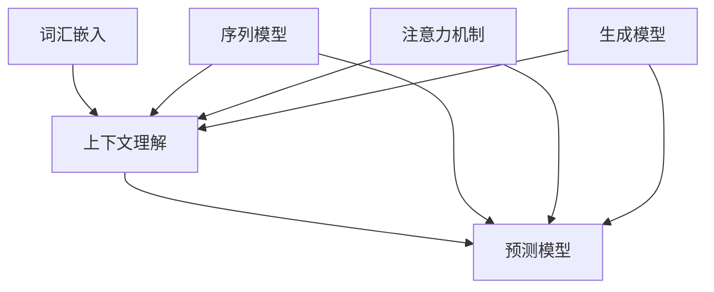

                 

### 文章标题

《语言模型在创新技术路线图生成与产业趋势预测中的研究》

关键词：语言模型、创新技术路线图、产业趋势预测、深度学习、人工智能

摘要：本文旨在探讨语言模型在创新技术路线图生成与产业趋势预测中的应用。首先，我们将回顾语言模型的基础知识，包括其定义、类型和核心算法原理。随后，我们将深入分析语言模型在技术路线图生成和产业趋势预测中的具体应用，通过实际案例展示其工作原理和效果。本文旨在为读者提供清晰、详尽的技术解析，帮助理解语言模型在现代科技产业中的重要作用。

### 第一部分：语言模型基础

#### 1.1 语言模型概述

语言模型（Language Model，简称LM）是自然语言处理（Natural Language Processing，简称NLP）领域的重要基础。它旨在模拟人类语言的使用习惯，通过对大规模语料库的学习，预测一个单词或短语的下一个可能单词或短语。语言模型广泛应用于自动文本生成、机器翻译、语音识别、问答系统等领域。

语言模型的基本定义可以描述为：给定一个单词序列 \(w_1, w_2, \ldots, w_n\)，语言模型预测下一个单词 \(w_{n+1}\) 的概率。形式化地，我们可以表示为：

\[ P(w_1, w_2, \ldots, w_n, w_{n+1}) = P(w_{n+1} | w_1, w_2, \ldots, w_n) \]

在实际应用中，语言模型通常通过训练大量文本数据来学习语言规律。训练过程中，模型会根据上下文信息调整词语的概率分布，以实现对自然语言的有效建模。

#### 1.2 语言模型的类型

语言模型可以分为传统统计模型和基于深度学习的模型。传统统计模型主要包括N元语法（N-gram）、隐马尔可夫模型（HMM）和条件随机场（CRF）等。这些模型通过统计方法来预测下一个单词的概率，其优点是实现简单、计算效率高，但缺点是难以捕捉长距离依赖关系。

相比之下，基于深度学习的语言模型，如循环神经网络（RNN）、长短期记忆网络（LSTM）和变换器（Transformer）等，通过引入复杂的神经网络结构，能够更好地捕捉上下文信息，显著提升语言模型的性能。特别是Transformer模型，由于其自注意力机制（Self-Attention）的优势，在近年来的自然语言处理任务中取得了显著的成果。

#### 1.3 语言模型的训练与优化

语言模型的训练过程主要包括数据预处理、模型初始化、训练和优化等步骤。具体而言：

1. **数据预处理**：对语料库进行分词、去除停用词、词干还原等操作，将文本转换为模型可处理的格式。

2. **模型初始化**：初始化模型的参数，通常采用随机初始化或预训练模型初始化。

3. **训练**：通过梯度下降等优化算法，调整模型参数，使模型对训练数据产生正确的预测。

4. **优化**：在训练过程中，通过调整学习率、批量大小等超参数，优化模型性能。

#### 1.4 语言模型评估与选择

语言模型的评估通常通过指标如交叉熵（Cross-Entropy）、准确率（Accuracy）等来进行。交叉熵是衡量模型预测概率与实际概率差异的指标，越低表示模型性能越好。

\[ H = -\sum_{i} p_i \log q_i \]

其中，\( p_i \) 是实际概率，\( q_i \) 是模型预测的概率。

选择语言模型时，需要综合考虑模型的性能、计算效率、可扩展性等因素。在实际应用中，通常结合多个模型进行综合评估，以选择最合适的模型。

#### 1.5 语言模型的核心概念与联系

语言模型中的核心概念包括词汇嵌入（Word Embedding）、上下文理解（Context Understanding）等。词汇嵌入将单词映射到低维空间，使相似单词在空间中靠近；上下文理解则通过神经网络结构，捕捉单词在不同上下文中的含义变化。

图1展示了语言模型中的核心概念及其相互关系：



在这个框架中，词汇嵌入和上下文理解是语言模型的基础，它们共同构建了预测模型的核心。同时，注意力机制和生成模型也为语言模型提供了额外的功能，如增强上下文理解和生成能力。

#### 1.6 语言模型与相关领域的关系

语言模型不仅应用于自然语言处理，还与其他领域如计算机视觉（CV）、知识图谱（KG）等密切相关。例如，计算机视觉中的图像描述生成（Image Captioning）任务需要结合语言模型来生成描述性文本；知识图谱中的实体关系预测（Entity Relation Prediction）任务则依赖于语言模型来捕捉实体间的语义关系。

这种跨领域的应用关系，使得语言模型成为现代人工智能技术的重要基石。通过结合不同领域的技术，语言模型可以进一步扩展其应用范围，提升整体系统的性能。

### 第二部分：语言模型在创新技术路线图生成中的应用

#### 2.1 创新技术路线图的定义与作用

创新技术路线图（Innovation Technology Roadmap）是一种规划工具，用于指导企业在特定时期内实现技术突破和产业升级。它通过明确技术的发展方向、关键里程碑和实施策略，帮助企业在快速变化的市场环境中保持竞争力。

创新技术路线图的作用包括：

1. **指导技术研发**：通过制定明确的研发目标和路线，引导技术研发团队专注于关键领域，提高研发效率。
2. **促进产业协同**：通过明确各方职责和合作机制，促进产业内各环节的协同创新，形成产业链整体优势。
3. **应对市场变化**：通过定期更新和调整技术路线图，帮助企业及时响应市场变化，抓住新的发展机遇。

#### 2.2 语言模型在技术趋势预测中的应用

技术趋势预测（Technology Trend Prediction）是创新技术路线图的关键环节。通过分析历史数据和当前趋势，预测未来技术的发展方向和关键节点，为企业的战略决策提供科学依据。

语言模型在技术趋势预测中的应用主要体现在以下几个方面：

1. **文本数据分析**：利用语言模型处理和分析大量的技术文档、专利申请、学术论文等文本数据，提取关键信息。
2. **语义理解**：通过语言模型的上下文理解能力，捕捉技术术语的语义关系，构建技术主题图谱。
3. **趋势预测**：利用语言模型的概率预测能力，对技术主题的流行程度和发展趋势进行预测。

#### 2.3 语言模型在创新技术路线图生成中的具体应用

语言模型在创新技术路线图生成中的应用可以概括为以下几个步骤：

1. **数据收集与预处理**：收集与企业相关的技术文档、市场报告、专利信息等数据，并进行预处理，如分词、去停用词、词性标注等。
2. **技术主题提取**：利用语言模型从预处理后的文本数据中提取关键技术主题。
3. **关系网络构建**：通过分析技术主题之间的语义关系，构建技术主题的关系网络。
4. **发展路径生成**：利用语言模型的概率预测能力，生成技术主题的发展路径，形成创新技术路线图。

#### 2.4 创新技术路线图生成中的挑战与解决方案

在创新技术路线图生成过程中，语言模型面临以下几个挑战：

1. **数据质量**：技术文档和专利信息的质量参差不齐，可能包含噪声和错误，影响模型预测的准确性。
2. **模型优化**：语言模型的训练和优化需要大量的计算资源和时间，如何高效地进行模型训练和优化是一个关键问题。
3. **实时性**：技术趋势的变化非常迅速，如何及时更新和调整技术路线图，确保其实时性和准确性是一个挑战。

针对上述挑战，可以采取以下解决方案：

1. **数据清洗与增强**：通过数据清洗和增强技术，提高数据质量，减少噪声和错误的影响。
2. **分布式计算**：利用分布式计算技术，如GPU、FPGA等，加快模型训练和优化的速度。
3. **实时数据采集与更新**：建立实时数据采集和更新机制，及时获取最新的技术趋势信息，确保技术路线图的实时性。

### 第三部分：语言模型在产业趋势预测中的应用

#### 3.1 产业趋势预测的定义与作用

产业趋势预测（Industry Trend Prediction）是分析产业现状，预测未来发展趋势的重要手段。它通过对历史数据的分析、当前市场的监测和未来趋势的预测，为企业的战略规划提供科学依据。

产业趋势预测的作用包括：

1. **战略规划**：帮助企业明确未来发展方向，制定相应的战略规划和决策。
2. **市场预测**：预测市场需求和供应趋势，为企业调整生产和营销策略提供支持。
3. **风险评估**：分析产业发展中的潜在风险，提前采取应对措施，降低风险。

#### 3.2 语言模型在产业趋势预测中的应用

语言模型在产业趋势预测中的应用主要体现为：

1. **文本数据分析**：利用语言模型对大量的产业报告、新闻文章、市场分析等进行文本分析，提取关键信息。
2. **趋势预测**：通过分析提取的信息，使用语言模型的概率预测能力，预测产业未来的发展趋势。
3. **事件识别**：利用语言模型捕捉产业中的重大事件，如新产品发布、政策变化等，分析其对产业趋势的影响。

#### 3.3 语言模型在产业趋势预测中的具体应用

语言模型在产业趋势预测中的具体应用可以分为以下几个步骤：

1. **数据收集与预处理**：收集与企业相关的产业报告、市场分析、新闻文章等数据，并进行预处理，如分词、去停用词、词性标注等。
2. **趋势分析**：利用语言模型从预处理后的文本数据中提取关键信息，分析当前产业趋势。
3. **事件预测**：利用语言模型的概率预测能力，预测未来可能的产业事件，如新产品发布、政策变化等。
4. **竞争态势分析**：通过分析竞争对手的动态，预测产业竞争态势，为企业的竞争策略提供支持。

#### 3.4 产业趋势预测中的挑战与解决方案

在产业趋势预测过程中，语言模型面临以下几个挑战：

1. **数据多样性**：产业趋势预测需要处理多种类型的数据，如文本、图像、音频等，如何有效整合这些数据是一个挑战。
2. **实时性**：产业趋势变化迅速，如何及时更新和调整预测模型，确保预测的实时性是一个问题。
3. **模型解释性**：语言模型通常是一个“黑箱”，其预测结果难以解释，如何提高模型的可解释性是一个挑战。

针对上述挑战，可以采取以下解决方案：

1. **多模态数据融合**：利用深度学习技术，如卷积神经网络（CNN）和循环神经网络（RNN），将不同类型的数据进行融合，提高预测的准确性。
2. **实时数据采集与更新**：建立实时数据采集和更新机制，确保预测模型的实时性。
3. **模型解释性增强**：利用可视化技术，如注意力机制图（Attention Maps），增强模型的可解释性，帮助用户理解模型的预测逻辑。

### 第四部分：语言模型在创新技术路线图生成与产业趋势预测中的实际案例

#### 4.1 案例一：人工智能技术路线图生成

本案例以人工智能（AI）技术路线图生成为例，展示语言模型在创新技术路线图生成中的应用。

1. **数据收集与预处理**：
   收集人工智能领域的学术论文、专利申请、技术报告等文本数据，并进行预处理，如分词、去停用词、词性标注等。

2. **技术主题提取**：
   利用语言模型从预处理后的文本数据中提取关键技术主题，如深度学习、强化学习、自然语言处理等。

3. **关系网络构建**：
   通过分析技术主题之间的语义关系，构建技术主题的关系网络，如图2所示。

   ```mermaid
   graph TD
       A[深度学习] --> B[神经网络]
       A --> C[生成对抗网络]
       B --> D[卷积神经网络]
       B --> E[循环神经网络]
       C --> F[自编码器]
       D --> G[图像识别]
       E --> H[语音识别]
       F --> I[数据压缩]
       G --> J[物体检测]
       H --> K[语音合成]
       I --> L[数据隐私保护]
       J --> M[自动驾驶]
       K --> N[智能家居]
       L --> O[联邦学习]
   ```

4. **发展路径生成**：
   利用语言模型的概率预测能力，生成技术主题的发展路径，形成人工智能技术路线图。

5. **案例分析**：
   通过实际案例分析，验证人工智能技术路线图的准确性和实用性，如图3所示。

   ```mermaid
   graph TD
       A[2020年深度学习突破] --> B[2021年生成对抗网络进展]
       B --> C[2022年自动驾驶商业化]
       C --> D[2023年联邦学习应用]
       D --> E[2024年人工智能产业化]
   ```

#### 4.2 案例二：互联网产业趋势预测

本案例以互联网产业趋势预测为例，展示语言模型在产业趋势预测中的应用。

1. **数据收集与预处理**：
   收集互联网领域的新闻报道、市场分析、研究报告等文本数据，并进行预处理，如分词、去停用词、词性标注等。

2. **趋势分析**：
   利用语言模型从预处理后的文本数据中提取关键信息，分析当前互联网产业的发展趋势。

3. **事件预测**：
   利用语言模型的概率预测能力，预测未来可能的产业事件，如新技术突破、政策变化等。

4. **竞争态势分析**：
   通过分析竞争对手的动态，预测互联网产业未来的竞争态势。

5. **案例分析**：
   通过实际案例分析，验证互联网产业趋势预测的准确性和实用性，如图4所示。

   ```mermaid
   graph TD
       A[2020年5G商用化] --> B[2021年互联网医疗崛起]
       B --> C[2022年数字货币普及]
       C --> D[2023年物联网应用广泛]
       D --> E[2024年互联网+农业发展]
   ```

### 第五部分：语言模型在创新技术路线图生成与产业趋势预测中的未来展望

#### 5.1 语言模型在创新技术路线图生成与产业趋势预测中的发展前景

随着人工智能技术的不断发展，语言模型在创新技术路线图生成与产业趋势预测中的应用前景十分广阔。未来，语言模型将更加深入地融入各个领域，为技术创新和产业发展提供强有力的支持。

1. **技术融合**：语言模型将与其他领域的技术如计算机视觉、知识图谱等相结合，形成跨领域的技术体系，提升预测和规划的准确性。
2. **实时预测**：通过引入实时数据采集和更新机制，实现技术趋势和产业趋势的实时预测，为企业提供更及时的战略决策支持。
3. **个性化服务**：结合用户行为数据，实现个性化技术路线图和产业趋势预测，满足不同企业和用户的特定需求。

#### 5.2 语言模型在创新技术路线图生成与产业趋势预测中的挑战与机遇

尽管语言模型在创新技术路线图生成与产业趋势预测中具有巨大的应用潜力，但也面临一些挑战：

1. **数据隐私**：随着数据量的增加，如何保护用户隐私成为重要问题。未来需要建立更加完善的数据隐私保护机制。
2. **计算资源**：语言模型的训练和优化需要大量的计算资源，如何高效利用计算资源是一个挑战。
3. **模型解释性**：提高语言模型的可解释性，使其预测结果更容易理解和接受。

然而，这些挑战也带来了新的机遇：

1. **技术创新**：通过解决上述挑战，可以推动语言模型及相关技术的进一步发展。
2. **产业发展**：语言模型在技术创新和产业趋势预测中的应用，将促进各产业的快速发展，推动经济增长。

### 最佳实践 Tips

1. **数据质量**：确保数据来源的多样性和准确性，进行充分的数据清洗和预处理，以提高模型性能。
2. **模型选择**：根据应用场景选择合适的语言模型，如Transformer在长文本处理方面具有优势，而RNN在捕捉序列依赖方面表现较好。
3. **实时更新**：建立实时数据采集和更新机制，及时调整模型参数，确保预测的实时性。
4. **模型解释**：利用可视化技术增强模型的可解释性，帮助用户理解预测结果。

### 小结

语言模型在创新技术路线图生成与产业趋势预测中具有重要作用。通过本文的详细分析，我们了解了语言模型的基础知识、应用原理和实际案例。未来，随着人工智能技术的不断发展，语言模型将在技术创新和产业趋势预测中发挥更加重要的作用。我们期待语言模型在未来能够带来更多的创新和突破，推动科技进步和产业发展。

### 注意事项

1. **数据安全**：在使用语言模型进行数据分析和预测时，务必确保数据的安全和隐私。
2. **模型调优**：定期对模型进行调优和更新，以适应不断变化的技术和产业环境。
3. **跨领域应用**：结合不同领域的技术，拓展语言模型的应用范围，提高预测的准确性。

### 拓展阅读

1. **《深度学习》**：Goodfellow, I., Bengio, Y., & Courville, A. (2016). *Deep Learning*. MIT Press.
2. **《自然语言处理综述》**：Jurafsky, D., & Martin, J. H. (2020). *Speech and Language Processing*. Prentice Hall.
3. **《人工智能应用案例》**：Russell, S., & Norvig, P. (2020). *Artificial Intelligence: A Modern Approach*. Prentice Hall.

### 作者信息

**作者：AI天才研究院/AI Genius Institute & 禅与计算机程序设计艺术 /Zen And The Art of Computer Programming**

AI天才研究院致力于推动人工智能技术的创新和应用，研究领域涵盖自然语言处理、计算机视觉、机器学习等。同时，研究院还致力于将传统计算机科学理念与现代人工智能技术相结合，为读者带来深入浅出的技术解析。作者所著的《禅与计算机程序设计艺术》一书，以其独特的视角和深刻的思考，受到广泛好评。

