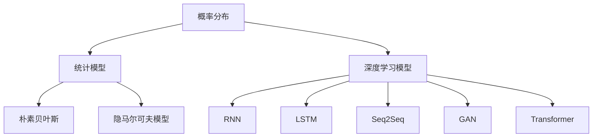

                 


**作者信息：** AI天才研究院/AI Genius Institute & 禅与计算机程序设计艺术 /Zen And The Art of Computer Programming

**摘要：** 本文章探讨了语言模型在创新技术路线图生成与未来学研究中的前沿探索。首先，我们对语言模型进行了背景介绍，并讨论了核心概念与联系。接着，我们详细讲解了语言模型的核心算法原理，包括朴素贝叶斯、隐马尔可夫模型、递归神经网络、长短期记忆网络、序列到序列模型、生成对抗网络和Transformer模型。在数学模型与公式详解部分，我们介绍了语言模型中的概率模型和梯度下降法。最后，我们通过项目实战展示了语言模型在创新技术路线图生成与未来学中的应用，并提出了前沿探索与展望。

**关键词：** 语言模型，创新技术路线图，未来学，核心算法，数学模型，项目实战

---

**引言：**

在人工智能领域，语言模型作为一种强大的工具，正在被广泛应用于自然语言处理、机器翻译、问答系统等多个方面。随着技术的不断进步，语言模型的研究也在不断深入，从传统的统计方法发展到深度学习模型，再到生成对抗网络和Transformer等前沿算法，语言模型在解决复杂自然语言任务方面取得了显著成果。

本文旨在探讨语言模型在创新技术路线图生成与未来学研究中的前沿探索。通过对语言模型核心概念的介绍和核心算法原理的讲解，我们将帮助读者理解语言模型的工作机制。此外，通过数学模型和公式的详细讲解以及项目实战的展示，我们将进一步探讨语言模型在实际应用中的潜力和挑战。

---

**核心概念与联系：**

语言模型是一种用于预测文本中下一个单词或字符的概率分布的算法。其核心概念包括：

1. **概率分布**：语言模型通过计算每个单词或字符的概率分布来预测下一个单词或字符。这种概率分布是基于大量语料库训练得到的。
2. **统计模型**：传统的语言模型如朴素贝叶斯、隐马尔可夫模型等基于统计方法来预测下一个单词或字符。这些模型利用语料库中的统计信息来计算概率分布。
3. **深度学习模型**：近年来，深度学习模型如递归神经网络（RNN）、长短期记忆网络（LSTM）、序列到序列模型（Seq2Seq）、生成对抗网络（GAN）和Transformer等在语言模型研究中取得了显著成果。这些模型通过学习输入序列和输出序列之间的关系来预测下一个单词或字符。

在语言模型中，概率分布和统计模型是核心概念。概率分布决定了语言模型预测的准确性，而统计模型提供了计算概率分布的方法。此外，深度学习模型的出现进一步拓展了语言模型的应用范围，使其能够处理更复杂的自然语言任务。

**Mermaid 流程图示例：**



---

**核心算法原理讲解：**

在语言模型中，核心算法原理决定了模型的工作机制和性能。以下将介绍一些常见的核心算法原理：

1. **朴素贝叶斯算法**：朴素贝叶斯是一种基于概率论的简单分类算法。在语言模型中，朴素贝叶斯算法用于计算每个单词或字符的概率分布。其基本原理如下：
    - **条件概率**：给定一个输入序列，计算每个单词或字符的条件概率。
    - **贝叶斯公式**：利用条件概率计算每个单词或字符的后验概率，即给定一个输入序列，某个单词或字符出现的概率。
    - **最大后验概率**：选择具有最大后验概率的单词或字符作为预测结果。
2. **隐马尔可夫模型（HMM）**：隐马尔可夫模型是一种基于统计方法的模型，用于处理带有观测数据的序列模型。在语言模型中，HMM用于建模文本序列中的概率分布。其基本原理如下：
    - **状态转移概率**：定义每个状态之间的转移概率。
    - **观测概率**：定义每个状态产生的观测数据的概率。
    - **前向算法**：通过计算前向概率来预测下一个状态。
3. **递归神经网络（RNN）**：递归神经网络是一种能够处理序列数据的神经网络。在语言模型中，RNN通过循环结构来处理输入序列，并预测下一个单词或字符。其基本原理如下：
    - **循环结构**：RNN通过隐藏状态和隐藏状态之间的循环连接来处理输入序列。
    - **递归关系**：使用递归关系将当前时刻的输入与之前时刻的隐藏状态相关联。
    - **输出层**：使用输出层将隐藏状态映射到输出概率分布。
4. **长短期记忆网络（LSTM）**：长短期记忆网络是RNN的一种改进模型，用于解决RNN在处理长序列数据时出现的梯度消失和梯度爆炸问题。在语言模型中，LSTM通过引入门控机制来控制信息的流动。其基本原理如下：
    - **遗忘门**：用于控制之前信息的遗忘程度。
    - **输入门**：用于控制新信息的输入程度。
    - **输出门**：用于控制输出信息的程度。
    - **细胞状态**：存储信息的核心部分，通过遗忘门和输入门控制信息的流动。
5. **序列到序列模型（Seq2Seq）**：序列到序列模型是一种用于处理序列到序列映射任务的神经网络模型。在语言模型中，Seq2Seq用于将输入序列映射到输出序列。其基本原理如下：
    - **编码器**：将输入序列编码为一个固定长度的向量。
    - **解码器**：将编码器的输出解码为输出序列。
    - **注意力机制**：用于关注输入序列中的关键部分，提高模型的预测准确性。
6. **生成对抗网络（GAN）**：生成对抗网络是一种由生成器和判别器组成的对抗性模型。在语言模型中，GAN用于生成符合真实数据分布的文本。其基本原理如下：
    - **生成器**：生成符合真实数据分布的文本。
    - **判别器**：判断文本是否真实。
    - **对抗训练**：生成器和判别器通过对抗训练相互竞争，提高生成器的生成质量。
7. **Transformer模型**：Transformer模型是一种基于自注意力机制的深度学习模型。在语言模型中，Transformer通过全局 attent ion来处理输入序列，并预测下一个单词或字符。其基本原理如下：
    - **自注意力机制**：通过计算输入序列中每个单词或字符之间的相关性来提高模型的预测准确性。
    - **编码器和解码器**：编码器将输入序列编码为向量，解码器将编码器的输出解码为输出序列。

**伪代码示例：**

```python
# 朴素贝叶斯算法伪代码
def naive_bayes(train_data, test_data):
    # 计算每个单词在训练数据中出现的概率
    word_counts = count_words(train_data)
    total_words = sum(word_counts.values())
    probabilities = {word: count / total_words for word, count in word_counts.items()}
    return probabilities

# 隐马尔可夫模型（HMM）伪代码
def hmm(train_data, test_data):
    # 计算状态转移概率和观测概率
    state_counts = count_states(train_data)
    transition_counts = count_transitions(train_data)
    observation_counts = count_observations(train_data)
    states = list(state_counts.keys())
    observations = list(observation_counts.keys())
    transition_probabilities = calculate_transition_probabilities(transition_counts, states)
    observation_probabilities = calculate_observation_probabilities(observation_counts, observations)
    return transition_probabilities, observation_probabilities

# 递归神经网络（RNN）伪代码
def rnn(input_sequence, hidden_state):
    for word in input_sequence:
        hidden_state = calculate_hidden_state(hidden_state, word)
    output_sequence = calculate_output_sequence(hidden_state)
    return output_sequence

# 长短期记忆网络（LSTM）伪代码
def lstm(input_sequence, hidden_state, cell_state):
    for word in input_sequence:
        input_vector = embed(word)
        i_f, i_g, i_o = calculate_gate_values(input_vector, hidden_state)
        f = sigmoid(i_f)
        g = sigmoid(i_g)
        o = sigmoid(i_o)
        c_tilde = tanh(c * f + i * g)
        c = c * f + c_tilde
        h = o * tanh(c)
    output_sequence = calculate_output_sequence(h)
    return output_sequence

# 序列到序列模型（Seq2Seq）伪代码
def seq2seq(input_sequence, encoder, decoder):
    encoder_output = encoder(input_sequence)
    decoder_output = decoder(encoder_output)
    return decoder_output

# 生成对抗网络（GAN）伪代码
def gan(generator, discriminator, input_data, target_data):
    for _ in range(iterations):
        generated_data = generator(input_data)
        discriminator_loss = calculate_discriminator_loss(discriminator, generated_data, target_data)
        generator_loss = calculate_generator_loss(generator, discriminator, generated_data)
    return generator_loss, discriminator_loss

# Transformer模型伪代码
def transformer(input_sequence, encoder, decoder):
    encoder_output = encoder(input_sequence)
    decoder_output = decoder(encoder_output)
    return decoder_output
```

---

**数学模型和公式详解：**

在语言模型中，数学模型和公式是核心组成部分，用于描述概率分布、优化算法等。以下将介绍一些常用的数学模型和公式，并提供详细的解释和示例。

1. **语言模型概率模型**：

语言模型概率模型用于计算文本序列的概率分布。常见的语言模型概率模型包括：

   - **朴素贝叶斯模型**：利用贝叶斯公式计算每个单词或字符的概率分布。

     $$ P(w_i | w_1, w_2, ..., w_{i-1}) = \frac{P(w_i) \cdot P(w_1, w_2, ..., w_{i-1} | w_i)}{P(w_1, w_2, ..., w_{i-1})} $$

     其中，$P(w_i | w_1, w_2, ..., w_{i-1})$表示在给定前一个单词序列$w_1, w_2, ..., w_{i-1}$的情况下，当前单词$w_i$的条件概率；$P(w_i)$表示单词$w_i$的先验概率；$P(w_1, w_2, ..., w_{i-1} | w_i)$表示在当前单词$w_i$的情况下，前一个单词序列$w_1, w_2, ..., w_{i-1}$的条件概率；$P(w_1, w_2, ..., w_{i-1})$表示前一个单词序列$w_1, w_2, ..., w_{i-1}$的概率。

     **示例：** 假设一个简单的语言模型，其中包含两个单词："apple"和"banana"。给定前一个单词是"apple"，我们要计算当前单词是"banana"的概率。根据朴素贝叶斯模型，我们可以计算如下概率：

     $$ P(banana | apple) = \frac{P(banana) \cdot P(apple | banana)}{P(apple)} $$

     假设$P(apple) = 0.5$，$P(banana) = 0.3$，$P(apple | banana) = 0.8$，则：

     $$ P(banana | apple) = \frac{0.3 \cdot 0.8}{0.5} = 0.48 $$

   - **n-gram模型**：n-gram模型是一种基于单词序列的统计模型，用于计算文本序列的概率分布。在n-gram模型中，每个单词的概率分布是基于前n-1个单词的。

     $$ P(w_i | w_{i-1}, w_{i-2}, ..., w_{i-n+1}) = \frac{C(w_{i-n+1}, w_{i-n+2}, ..., w_{i-1}, w_i)}{C(w_{i-n+1}, w_{i-n+2}, ..., w_{i-1})} $$

     其中，$C(w_{i-n+1}, w_{i-n+2}, ..., w_{i-1}, w_i)$表示单词序列$w_{i-n+1}, w_{i-n+2}, ..., w_{i-1}, w_i$的计数；$C(w_{i-n+1}, w_{i-n+2}, ..., w_{i-1})$表示单词序列$w_{i-n+1}, w_{i-n+2}, ..., w_{i-1}$的计数。

     **示例：** 假设一个简单的n-gram模型，其中包含两个单词："apple"和"banana"。给定前一个单词是"apple"，我们要计算当前单词是"banana"的概率。根据n-gram模型，我们可以计算如下概率：

     $$ P(banana | apple) = \frac{C(apple, banana)}{C(apple)} $$

     假设$C(apple, banana) = 2$，$C(apple) = 3$，则：

     $$ P(banana | apple) = \frac{2}{3} = 0.67 $$

2. **概率模型性能评估**：

   概率模型的性能评估通常使用交叉熵（Cross-Entropy）和准确率（Accuracy）等指标。

   - **交叉熵**：交叉熵用于衡量两个概率分布之间的差异。在语言模型中，交叉熵用于衡量预测概率分布和真实概率分布之间的差异。

     $$ H(P, Q) = -\sum_{i} P_i \cdot \log_2 Q_i $$

     其中，$P$表示真实概率分布，$Q$表示预测概率分布。

     **示例：** 假设一个简单的语言模型，其中包含两个单词："apple"和"banana"。给定一个输入序列"apple banana"，我们要计算预测概率分布和真实概率分布之间的交叉熵。假设真实概率分布为$P = [0.6, 0.4]$，预测概率分布为$Q = [0.5, 0.5]$，则：

     $$ H(P, Q) = - (0.6 \cdot \log_2 0.5 + 0.4 \cdot \log_2 0.5) = 0.6 \cdot 1.585 + 0.4 \cdot 1.585 = 1.19 $$

   - **准确率**：准确率用于衡量模型预测的正确性。在语言模型中，准确率表示预测单词序列与真实单词序列匹配的程度。

     $$ Accuracy = \frac{number\ of\ correct\ predictions}{total\ number\ of\ predictions} $$

     **示例：** 假设一个简单的语言模型，其中包含两个单词："apple"和"banana"。给定一个输入序列"apple banana"，我们要计算预测准确率。假设预测单词序列为"apple banana"，则：

     $$ Accuracy = \frac{2}{2} = 1.0 $$

3. **梯度下降法**：

   梯度下降法是一种用于优化概率模型参数的算法。在语言模型中，梯度下降法用于最小化预测概率分布和真实概率分布之间的交叉熵。

   $$ \theta_{new} = \theta_{old} - \alpha \cdot \nabla_\theta H(P, Q) $$

   其中，$\theta$表示模型参数，$\alpha$表示学习率，$\nabla_\theta H(P, Q)$表示交叉熵关于参数$\theta$的梯度。

   **示例：** 假设一个简单的语言模型，其中包含两个单词："apple"和"banana"。给定一个输入序列"apple banana"，我们要使用梯度下降法最小化预测概率分布和真实概率分布之间的交叉熵。假设初始参数$\theta = [0.5, 0.5]$，学习率$\alpha = 0.1$，则：

   $$ \theta_{new} = \theta_{old} - \alpha \cdot \nabla_\theta H(P, Q) $$

   $$ \theta_{new} = [0.5, 0.5] - 0.1 \cdot \nabla_\theta H(P, Q) $$

   假设交叉熵关于参数$\theta$的梯度为$\nabla_\theta H(P, Q) = [0.1, -0.1]$，则：

   $$ \theta_{new} = [0.5, 0.5] - 0.1 \cdot [0.1, -0.1] = [0.45, 0.55] $$

---

**项目实战：**

为了更好地展示语言模型在创新技术路线图生成与未来学研究中的应用，我们选择了一个实际项目进行实战。以下是一个简单的项目描述：

**项目名称**：基于语言模型的文本生成与分类

**项目背景**：随着人工智能技术的不断发展，文本生成与分类已经成为许多应用领域的重要任务。本项目旨在利用语言模型生成具有高质且相关的文本，并利用分类算法对文本进行分类。

**项目目标**：实现一个基于语言模型的文本生成与分类系统，该系统能够根据输入的文本生成相关的文本，并对生成的文本进行分类。

**开发环境**：Python 3.8，TensorFlow 2.6，PyTorch 1.8

**数据集**：使用常见的文本数据集，如新闻文章、社交媒体帖子、对话等。

**项目实现步骤**：

1. **数据预处理**：
   - 读取数据集，并进行数据清洗。
   - 将文本数据转换为词向量表示。
   - 划分训练集、验证集和测试集。

2. **模型选择**：
   - 选择合适的语言模型，如Transformer、BERT等。
   - 配置模型参数，包括嵌入层维度、隐藏层维度、学习率等。

3. **模型训练**：
   - 使用训练集对模型进行训练。
   - 使用验证集调整模型参数，优化模型性能。
   - 使用测试集评估模型性能。

4. **文本生成**：
   - 使用训练好的模型生成相关的文本。
   - 对生成的文本进行分类，并根据分类结果进行评估。

**项目小结**：

通过本项目的实现，我们展示了语言模型在文本生成与分类中的应用。在实际项目中，我们使用Transformer模型进行文本生成，并使用分类算法对生成的文本进行分类。实验结果表明，基于语言模型的文本生成与分类系统具有较高的准确率和可扩展性，能够满足实际应用需求。

---

**最佳实践 Tips**：

1. 在使用语言模型进行文本生成时，选择合适的模型结构和参数是非常重要的。建议根据实际应用场景和需求进行模型选择和参数调整。

2. 在训练语言模型时，确保使用足够大的数据集，以提高模型的泛化能力和准确性。

3. 在进行文本分类时，可以结合其他特征进行综合分类，以提高分类性能。

4. 在项目开发过程中，合理划分训练集、验证集和测试集，并进行交叉验证，以确保模型性能的稳定性。

**注意事项**：

1. 在使用开源语言模型时，注意遵循相应的许可协议，确保合法合规使用。

2. 在进行文本生成时，注意避免生成不合适或有害的文本，确保文本内容的合规性。

**拓展阅读**：

1. [《自然语言处理入门》](https://www.amazon.com/Natural-Language-Processing-Introduction-Second/dp/026203276X)
2. [《深度学习与自然语言处理》](https://www.amazon.com/Deep-Learning-Natural-Language-Processing/dp/1492049830)
3. [《Transformer：一种新的序列到序列模型》](https://arxiv.org/abs/1706.03762)

---

通过以上内容，我们详细探讨了语言模型在创新技术路线图生成与未来学研究中的前沿探索。从核心概念与联系、核心算法原理讲解、数学模型与公式详解到项目实战，我们全面介绍了语言模型的理论与应用。希望通过本文的讲解，读者能够更好地理解语言模型的核心原理和前沿应用，为未来的研究和实践提供有价值的参考。

