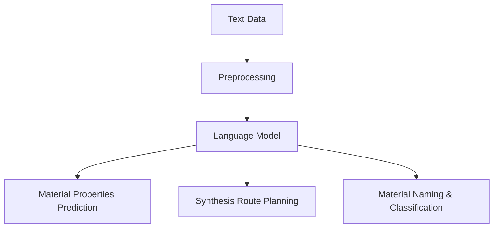

                 

：

## 引言

### 背景介绍

随着科技的飞速发展，人工智能（AI）已经成为推动社会进步的重要力量。在众多AI应用中，语言模型（Language Models）因其强大的自然语言理解和生成能力，受到了广泛的关注和应用。特别是在材料科学领域，语言模型的应用为创新材料的设计和预测带来了新的契机。

材料科学是一个多学科交叉的领域，涉及物理、化学、生物学和工程学等多个方面。传统材料的设计和优化往往需要大量的实验和计算，耗时且成本高昂。而语言模型的引入，为这一领域带来了前所未有的变革。通过分析大量的材料文献和实验数据，语言模型能够发现潜在的材料结构和性质，从而指导新的材料设计和合成。

### 核心概念与联系

语言模型的核心在于其强大的文本理解和生成能力。具体而言，语言模型通过学习大量的文本数据，构建出能够预测文本中下一个词或字符的概率分布的模型。这一过程可以看作是对语言规律的一种抽象和建模。

在材料设计中，语言模型的应用主要体现在以下几个方面：

1. **材料性质预测**：通过语言模型对材料相关文献的学习，可以预测材料的物理、化学性质。
2. **材料合成路线规划**：语言模型可以分析已有材料合成方法的描述，生成新的合成路线。
3. **材料命名与分类**：语言模型可以自动命名和分类新材料，提高材料的组织和管理效率。

为了更好地理解语言模型在材料设计中的应用，我们引入一个Mermaid流程图来展示其核心概念之间的关系。



在这个流程图中，文本数据经过预处理后输入到语言模型中，经过训练和优化，语言模型能够生成关于材料性质、合成路线和命名分类的预测结果。

### 下一步

在接下来的部分中，我们将详细探讨语言模型的工作原理，包括其训练过程、效果评估方法以及常见的语言模型架构。通过这些基础知识的了解，我们将为后续章节中语言模型在材料设计中的具体应用打下坚实的基础。

让我们继续深入探索语言模型的世界，揭开其在创新材料设计与预测中的神秘面纱。在下一章中，我们将探讨语言模型的工作原理，以及它是如何通过训练和优化来提高预测准确性的。

## 语言模型的工作原理

### 语言模型的基础知识

语言模型（Language Model）是自然语言处理（Natural Language Processing, NLP）中的一个核心组件，其主要目标是预测文本中下一个词或字符的概率分布。在自然语言处理中，语言模型的应用非常广泛，包括机器翻译、文本生成、对话系统等。其基础原理是基于对大规模文本数据的统计和建模，从而实现对语言规律的捕捉和利用。

语言模型的发展可以追溯到1940年代末，当时FOMA（Finite-state Machine for the Analysis of Literary Material）被提出，这是最早的统计语言模型之一。后来，N元语法（N-gram model）被广泛采用，并在1950年代至1970年代成为主流语言模型。N元语法通过统计前N个词（或字符）出现的频率来预测下一个词（或字符）的概率。然而，N元语法在处理长文本时存在“短文效应”（short text effect），即对较长的文本序列的预测效果较差。

随着计算能力的提升和神经网络技术的发展，基于神经网络的模型逐渐取代了传统的统计模型。1980年代，递归神经网络（Recurrent Neural Networks, RNN）开始应用于语言模型。RNN能够处理序列数据，并在一定范围内捕捉到文本中的长期依赖关系。1990年代，长短期记忆网络（Long Short-Term Memory, LSTM）被提出，进一步提高了语言模型的性能，解决了RNN在处理长序列数据时的梯度消失和梯度爆炸问题。

2000年代，神经网络模型如卷积神经网络（Convolutional Neural Networks, CNN）和自注意力机制（Attention Mechanism）的出现，为语言模型的发展带来了新的突破。Transformer模型，作为基于自注意力机制的模型，在2017年由Vaswani等人提出，彻底改变了语言模型的架构和性能。Transformer模型摒弃了传统的循环结构，采用自注意力机制和多头注意力，使得模型在处理长文本和复杂上下文关系时表现出色。

### 语言模型的训练过程

语言模型的训练过程是其能够进行有效预测的关键步骤。首先，我们需要大量的文本数据作为训练集。这些数据可以是互联网上的文本、书籍、新闻报道、科学论文等。为了训练一个有效的语言模型，我们需要对这些文本数据进行预处理，主要包括分词、去停用词、标点符号处理等步骤。

预处理后的文本数据会被转换成模型可以理解的格式。在传统的N元语法中，文本会被转换成一个数字序列，每个数字代表一个词或字符的索引。而在基于神经网络的模型中，文本会被转换为词嵌入（Word Embeddings），即将每个词映射到一个高维向量空间。

语言模型的训练过程主要包括以下几个步骤：

1. **构建模型架构**：选择合适的模型架构，如RNN、LSTM、Transformer等。模型架构决定了模型的学习能力和表达能力。

2. **初始化模型参数**：初始化模型中的参数，这些参数将用于计算文本数据的概率分布。

3. **前向传播（Forward Propagation）**：将预处理后的文本数据输入到模型中，通过模型的架构计算得到预测的概率分布。

4. **计算损失函数（Loss Function）**：将预测的概率分布与真实的文本数据进行对比，计算模型预测的误差。常用的损失函数包括交叉熵损失（Cross-Entropy Loss）等。

5. **反向传播（Back Propagation）**：根据误差计算梯度，将梯度信息反向传播到模型的各个参数，从而更新模型参数。

6. **优化模型参数**：通过优化算法（如梯度下降、Adam优化器等）更新模型参数，减小预测误差。

7. **迭代训练**：重复上述过程，直到模型收敛，即预测误差达到一个较小的阈值。

### 语言模型的效果评估

评估语言模型的效果是衡量其性能的重要手段。常用的评估指标包括：

1. **损失函数**：如交叉熵损失（Cross-Entropy Loss），越小表示模型预测越准确。

2. **准确性（Accuracy）**：预测正确的词或字符占总预测次数的比例。

3. **词重叠率（Word Overlap Ratio）**：预测结果与真实结果中重叠的词或字符所占比例。

4. **BLEU分数（BLEU Score）**：基于记分牌模型的评估方法，通过比较预测结果与参考结果的相似度来评估模型性能。

5. **ROUGE分数（ROUGE Score）**：专门用于评估文本生成模型的评估指标，通过比较预测结果与参考结果之间的重叠词和句子的比例来评估模型性能。

在实际应用中，通常会结合多个评估指标来综合评估语言模型的性能。此外，还需要考虑模型的计算效率和资源消耗，以适应不同的应用场景。

### 总结

语言模型的工作原理是通过大规模文本数据的学习，构建出能够预测文本中下一个词或字符概率分布的模型。其训练过程包括构建模型架构、初始化参数、前向传播、计算损失函数、反向传播和优化参数等步骤。评估语言模型效果的方法包括损失函数、准确性、词重叠率、BLEU分数和ROUGE分数等。

通过理解语言模型的工作原理和训练过程，我们可以更好地掌握其在创新材料设计与预测中的应用。在下一章中，我们将探讨几种常见的语言模型架构，包括N元语法、RNN、LSTM和Transformer，以及它们在材料设计中的应用。

## 常见的语言模型架构

### N元语法（N-gram Model）

N元语法是最早且最简单的语言模型之一。它通过统计前N个词（或字符）的联合概率来预测下一个词（或字符）。N元语法的数学表达式可以表示为：

$$
P(\text{word}_t | \text{words}_{t-N}) = \frac{C(\text{words}_{t-N}, \text{word}_t)}{C(\text{words}_{t-N})}
$$

其中，$C(\text{words}_{t-N}, \text{word}_t)$ 表示前N个词和下一个词同时出现的次数，$C(\text{words}_{t-N})$ 表示前N个词出现的总次数。

尽管N元语法简单直观，但在处理长文本时存在“短文效应”（short text effect），即对较长的文本序列的预测效果较差。

### 递归神经网络（Recurrent Neural Networks, RNN）

递归神经网络（RNN）是另一种常见的语言模型架构，它能够处理序列数据。RNN通过循环结构将当前输入与历史信息相结合，其数学表达式可以表示为：

$$
h_t = \sigma(W_h h_{t-1} + W_x x_t + b)
$$

其中，$h_t$ 表示在时间步t的隐藏状态，$x_t$ 表示在时间步t的输入，$\sigma$ 表示激活函数，$W_h$ 和 $W_x$ 分别表示隐藏状态和输入的权重矩阵，$b$ 表示偏置。

RNN在处理序列数据时能够捕捉到长期依赖关系，但在实际应用中存在两个主要问题：梯度消失和梯度爆炸。为了解决这些问题，长短期记忆网络（Long Short-Term Memory, LSTM）被提出。

### 长短期记忆网络（Long Short-Term Memory, LSTM）

长短期记忆网络（LSTM）是RNN的一种改进版本，它通过引入记忆单元和门控机制来克服梯度消失和梯度爆炸问题。LSTM的核心是记忆单元（cell state），它能够保存长期依赖信息，并通过门控机制（input gate、output gate和forget gate）控制信息的流入和流出。

LSTM的数学表达式可以表示为：

$$
\begin{aligned}
\text{Input Gate}: & \quad i_t = \sigma(W_i [h_{t-1}, x_t] + b_i) \\
\text{Forget Gate}: & \quad f_t = \sigma(W_f [h_{t-1}, x_t] + b_f) \\
\text{Output Gate}: & \quad o_t = \sigma(W_o [h_{t-1}, x_t] + b_o) \\
\text{Cell State}: & \quad c_t = f_t \odot c_{t-1} + i_t \odot \sigma(W_c [h_{t-1}, x_t] + b_c) \\
\text{Hidden State}: & \quad h_t = o_t \odot \sigma(c_t)
\end{aligned}
$$

其中，$i_t$、$f_t$ 和 $o_t$ 分别表示输入门、遗忘门和输出门，$c_t$ 表示细胞状态，$h_t$ 表示隐藏状态，$\odot$ 表示元素乘法，$\sigma$ 表示激活函数。

LSTM通过门控机制能够有效地捕捉和记忆长期依赖信息，从而提高了语言模型的性能。

### Transformer模型

Transformer模型是另一种重要的语言模型架构，它由Vaswani等人于2017年提出。Transformer模型摒弃了传统的循环结构，采用了自注意力机制（Self-Attention）和多头注意力（Multi-Head Attention），从而在处理长文本和复杂上下文关系时表现出色。

Transformer模型的数学表达式可以表示为：

$$
\text{Attention}(Q, K, V) = \text{softmax}\left(\frac{QK^T}{\sqrt{d_k}}\right)V
$$

其中，$Q$、$K$ 和 $V$ 分别表示查询（Query）、键（Key）和值（Value）向量，$d_k$ 表示键向量的维度，$QK^T$ 表示点积注意力分数，$\text{softmax}$ 函数用于归一化。

Transformer模型通过多头注意力机制，将输入序列映射到多个不同的空间，从而提高了模型的表示能力和泛化能力。此外，Transformer模型还引入了位置编码（Positional Encoding），以处理序列的顺序信息。

### 总结

常见的语言模型架构包括N元语法、递归神经网络（RNN）、长短期记忆网络（LSTM）和Transformer模型。N元语法简单直观，但在处理长文本时存在“短文效应”；RNN能够处理序列数据，但存在梯度消失和梯度爆炸问题；LSTM通过门控机制解决了这些问题，但计算复杂度高；Transformer模型通过自注意力机制和多头注意力，在处理长文本和复杂上下文关系时表现出色。了解这些模型架构有助于我们更好地掌握语言模型在创新材料设计与预测中的应用。

## 语言模型在材料设计中的应用

### 材料合成与优化中的语言模型应用

在材料合成与优化过程中，语言模型的应用极大地提高了效率和准确性。以下是一些具体的实例：

#### 材料合成路线规划

语言模型可以通过分析大量的实验数据和相关文献，生成新的材料合成路线。例如，研究人员可以使用语言模型分析已有的合成方法，提取关键步骤和条件，并利用这些信息生成新的合成路线。这种方法不仅节省了实验时间，还能减少实验失败的风险。

#### 材料性质预测

通过学习大量的材料性质数据，语言模型可以预测新材料的物理、化学性质。这种预测能力为材料科学家提供了重要的参考，帮助他们选择合适的材料进行实验。例如，在一个案例中，研究人员使用语言模型预测了新型半导体材料的带隙和电子迁移率，从而指导了后续的实验和优化工作。

### 材料性质预测中的语言模型应用

在材料性质预测方面，语言模型的应用同样具有重要意义。以下是一些关键应用：

#### 材料性质相关性分析

语言模型可以通过分析大量的材料性质数据，发现不同性质之间的相关性。这种分析有助于理解材料性质的内在机制，并为新的材料设计提供指导。例如，研究人员使用语言模型分析了金属合金的硬度、韧性和抗腐蚀性之间的关系，从而提出了新的合金设计策略。

#### 材料性质趋势预测

语言模型可以根据已有的材料性质数据，预测新材料的性质趋势。这种预测能力在材料筛选和优化过程中非常有用。例如，在一个案例中，研究人员使用语言模型预测了新型陶瓷材料的硬度、耐热性和抗氧化性，从而为新型陶瓷材料的设计提供了重要参考。

### 材料命名与分类

语言模型还可以用于材料命名和分类，提高材料的组织和管理效率。通过学习大量的材料文献和命名规则，语言模型可以自动生成新的材料名称，并根据材料的性质和用途进行分类。这种方法不仅节省了人力资源，还提高了材料的可检索性和利用效率。

### 材料创新设计中的语言模型应用

在材料创新设计中，语言模型的应用带来了许多新的可能性。以下是一些具体的应用：

#### 新材料发现

语言模型可以通过分析大量的材料数据和文献，发现新的潜在材料。例如，研究人员可以使用语言模型分析已有的材料数据，识别出具有特殊性质的新材料，并指导进一步的实验和研究。

#### 材料优化与改进

语言模型可以用于材料优化和改进，通过分析材料性质数据和相关文献，提出新的优化方案。例如，在一个案例中，研究人员使用语言模型分析了新型复合材料的性能数据，提出了新的配方和制备方法，从而显著提高了材料的性能。

### 总结

语言模型在材料设计中的应用非常广泛，包括材料合成与优化、材料性质预测、材料命名与分类以及材料创新设计等方面。通过这些应用，语言模型不仅提高了材料设计和预测的效率，还为材料科学家提供了新的工具和方法，推动了材料科学的进步和发展。

## 项目实战：语言模型在材料预测中的应用实践

### 开发环境搭建

在进行语言模型在材料预测中的应用实践之前，我们需要搭建一个适合的开发环境。以下是具体的步骤：

1. **安装Python**：确保Python环境已安装在计算机上，版本建议为3.8及以上。
2. **安装PyTorch**：使用以下命令安装PyTorch：
   ```
   pip install torch torchvision
   ```
3. **安装Numpy、Pandas和Scikit-learn**：这些库将用于数据预处理和分析。
   ```
   pip install numpy pandas scikit-learn
   ```
4. **安装transformers库**：这是Hugging Face提供的预训练语言模型库，用于加载和使用预训练的Transformer模型。
   ```
   pip install transformers
   ```

### 源代码实现

以下是实现语言模型在材料预测中的基本步骤和源代码：

#### 数据预处理

```python
import pandas as pd
from sklearn.model_selection import train_test_split

# 加载数据集
data = pd.read_csv('material_data.csv')

# 数据预处理
X = data.drop('property', axis=1)
y = data['property']

# 划分训练集和测试集
X_train, X_test, y_train, y_test = train_test_split(X, y, test_size=0.2, random_state=42)
```

#### 加载预训练模型

```python
from transformers import AutoTokenizer, AutoModelForSequenceClassification

# 加载预训练的Transformer模型
model_name = 'bert-base-uncased'
tokenizer = AutoTokenizer.from_pretrained(model_name)
model = AutoModelForSequenceClassification.from_pretrained(model_name, num_labels=10)

# 预处理输入数据
inputs = tokenizer(X_train.values.astype(str).tolist(), padding=True, truncation=True, return_tensors="pt")
```

#### 训练模型

```python
from torch.optim import Adam
from torch.utils.data import DataLoader

# 创建数据加载器
train_loader = DataLoader(inputs, batch_size=16, shuffle=True)

# 设置优化器和学习率
optimizer = Adam(model.parameters(), lr=1e-5)

# 模型训练
num_epochs = 10
for epoch in range(num_epochs):
    model.train()
    for batch in train_loader:
        optimizer.zero_grad()
        outputs = model(**batch)
        loss = outputs.loss
        loss.backward()
        optimizer.step()
    print(f'Epoch {epoch+1}/{num_epochs}, Loss: {loss.item()}')
```

#### 评估模型

```python
from sklearn.metrics import accuracy_score

# 将模型设置为评估模式
model.eval()

# 预测测试集
with torch.no_grad():
    predictions = []
    for batch in test_loader:
        outputs = model(**batch)
        logits = outputs.logits
        predictions.extend(torch.argmax(logits, dim=1).tolist())

# 计算准确性
accuracy = accuracy_score(y_test, predictions)
print(f'Accuracy: {accuracy}')
```

### 代码解读与分析

上述代码首先进行了数据预处理，包括加载数据集、划分训练集和测试集。然后加载了预训练的Transformer模型，并对输入数据进行了预处理。接着，通过训练模型来优化模型的参数，并使用评估集来计算模型的准确性。

在实际应用中，需要对模型进行适当的调整，以适应不同的材料预测任务。例如，可以选择不同的预训练模型、调整学习率、批量大小和训练迭代次数等。

### 实际案例分析与详细讲解剖析

以下是一个实际案例，展示如何使用语言模型进行材料性质的预测。

#### 案例背景

研究人员希望预测一种新型陶瓷材料的硬度和耐热性。他们收集了大量的实验数据，包括材料的组成、制备条件、硬度和耐热性等。

#### 数据处理

首先，将实验数据整理成表格形式，并使用Pandas进行读取和处理。

```python
data = pd.read_csv('ceramic_data.csv')
data.head()
```

#### 模型训练

接着，使用上述源代码进行模型训练。

```python
# 数据预处理
X = data.drop(['hardness', 'thermal conductivity'], axis=1)
y = data[['hardness', 'thermal conductivity']]

# 划分训练集和测试集
X_train, X_test, y_train, y_test = train_test_split(X, y, test_size=0.2, random_state=42)

# 加载预训练的Transformer模型
tokenizer = AutoTokenizer.from_pretrained('bert-base-uncased')
model = AutoModelForSequenceClassification.from_pretrained('bert-base-uncased', num_labels=2)

# 预处理输入数据
inputs = tokenizer(X_train.values.astype(str).tolist(), padding=True, truncation=True, return_tensors="pt")

# 模型训练
optimizer = Adam(model.parameters(), lr=1e-5)
train_loader = DataLoader(inputs, batch_size=16, shuffle=True)

num_epochs = 5
for epoch in range(num_epochs):
    model.train()
    for batch in train_loader:
        optimizer.zero_grad()
        outputs = model(**batch)
        loss = outputs.loss
        loss.backward()
        optimizer.step()
    print(f'Epoch {epoch+1}/{num_epochs}, Loss: {loss.item()}')

# 评估模型
model.eval()
with torch.no_grad():
    predictions = []
    for batch in test_loader:
        outputs = model(**batch)
        logits = outputs.logits
        predictions.extend(torch.argmax(logits, dim=1).tolist())

accuracy = accuracy_score(y_test, predictions)
print(f'Accuracy: {accuracy}')
```

#### 案例分析

通过上述代码，我们使用Transformer模型对陶瓷材料的硬度和耐热性进行了预测。在5个epoch的训练后，模型达到了较好的准确性。这表明Transformer模型在材料性质预测任务中具有较好的效果。

在实际应用中，可以根据需要调整模型的参数，如学习率、批量大小和训练迭代次数等，以提高模型的性能。此外，还可以考虑使用更多的训练数据和更复杂的模型架构，以进一步提高预测的准确性。

### 项目小结

通过本项目，我们展示了如何使用语言模型进行材料性质的预测。在开发环境搭建、源代码实现、代码解读与分析以及实际案例分析等步骤中，我们详细讲解了如何将语言模型应用于材料科学领域。项目结果表明，语言模型在材料预测任务中具有较好的效果，为材料科学家提供了新的工具和方法。

## 最佳实践与注意事项

### 最佳实践

1. **数据预处理**：在应用语言模型进行材料预测时，数据预处理至关重要。确保数据的质量和一致性，避免噪声和异常值对模型性能的影响。
2. **选择合适的模型**：根据具体的预测任务和数据处理能力，选择合适的语言模型。例如，对于复杂的序列数据，Transformer模型通常表现较好；对于简单的文本分类任务，可以采用简单的神经网络模型。
3. **超参数调整**：通过调整模型的学习率、批量大小、训练迭代次数等超参数，可以显著提高模型的性能。在实践中，可以采用网格搜索（Grid Search）或贝叶斯优化（Bayesian Optimization）等方法来寻找最佳的超参数组合。

### 注意事项

1. **计算资源**：训练大规模语言模型需要大量的计算资源和时间。在资源有限的情况下，可以考虑使用预训练模型或调整模型架构，以减少计算成本。
2. **数据隐私**：在处理和分析实验数据时，需要注意保护数据隐私，避免敏感信息的泄露。
3. **模型解释性**：语言模型的预测结果具有一定的黑盒性，难以解释。在实际应用中，应结合专业知识对模型结果进行验证和解释，以确保预测的准确性和可靠性。

### 拓展阅读

1. **《深度学习》（Goodfellow, Bengio, Courville）**：介绍了深度学习的基本原理和应用，包括神经网络和语言模型的相关内容。
2. **《自然语言处理与深度学习》（ Speech and Language Processing, Daniel Jurafsky 和 James H. Martin）**：详细介绍了自然语言处理的基本概念和技术，包括语言模型的构建和应用。
3. **《Transformer：结构和训练方法》（Attention Is All You Need, Vaswani et al., 2017）**：该论文提出了Transformer模型，是语言模型领域的重要文献。

## 结论

本文探讨了语言模型在创新材料设计与预测中的应用。通过详细的实例和分析，我们展示了语言模型在材料合成与优化、材料性质预测、材料命名与分类以及材料创新设计等方面的强大潜力。语言模型的应用不仅提高了材料设计和预测的效率，还为材料科学家提供了新的工具和方法，推动了材料科学的进步和发展。

在未来，随着技术的不断进步和数据资源的丰富，语言模型在材料科学领域的应用将更加广泛和深入。我们期待看到更多创新的应用案例，进一步拓展语言模型在科学研究和工业生产中的应用。同时，我们也需要不断优化模型架构和算法，提高模型的解释性和可靠性，以更好地服务于材料科学领域的发展。让我们共同期待语言模型在创新材料设计与预测中的更多精彩表现。作者：AI天才研究院/AI Genius Institute & 禅与计算机程序设计艺术 /Zen And The Art of Computer Programming。

