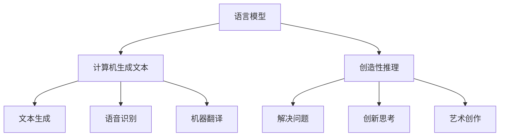

                 

### 核心概念与联系

在探讨语言模型在创造性推理任务中的能力培养之前，首先需要明确几个核心概念及其相互联系。这些概念包括语言模型的基本概念、计算机生成文本以及创造性推理。

#### 语言模型的基本概念

**语言模型（Language Model）：** 语言模型是一种用于预测自然语言文本序列中下一个单词或字符的概率模型。它是自然语言处理（NLP）的核心组件，用于各种任务，如文本生成、语音识别、机器翻译等。

**目标：** 语言模型的主要目标是提高预测准确性，考虑上下文信息，以及具备良好的可扩展性。

**应用场景：** 语言模型广泛应用于语音识别、机器翻译、文本生成、问答系统、文本分类等领域。

#### 计算机生成文本与创造性推理

**计算机生成文本：** 计算机生成文本是指利用计算机算法生成具有一定意义的自然语言文本。这一过程可以应用于自动摘要、文本生成、聊天机器人等场景。

**创造性推理（Creative Reasoning）：** 创造性推理是一种高级的认知能力，指利用已有信息生成新信息的过程。在解决问题、创新思考、艺术创作等方面具有重要意义。

**重要性：** 创造性推理能力使人类能够提出新的解决方案，推动科技进步和文化发展。

**关系：** 计算机生成文本和创造性推理之间存在密切联系。语言模型在计算机生成文本中扮演关键角色，而创造性推理则为文本生成提供了新的思路和可能性。

为了更好地理解这些核心概念及其相互联系，我们可以使用Mermaid流程图来展示它们之间的关系：



**图1：核心概念与联系架构**

通过上述流程图，我们可以清晰地看到语言模型、计算机生成文本和创造性推理之间的相互关系和作用。在接下来的内容中，我们将进一步探讨语言模型的架构、关键技术及其在创造性推理任务中的应用。

### 第2章: 语言模型的架构

#### 2.1 传统语言模型

**1. N-gram模型**

**定义：** N-gram模型是一种基于统计的语言模型，它将文本序列分割成固定长度的连续词组（n-gram），并根据这些词组的历史频率来预测下一个词。

**原理：**
$$
P(w_{t} | w_{t-1}, w_{t-2}, ..., w_{t-n}) = \prod_{i=1}^{n} P(w_{t-i} | w_{t-i+1}, w_{t-i+2}, ..., w_{t-n})
$$

其中，$w_{t}$ 表示当前词，$w_{t-i}$ 表示第 $i$ 个前缀词。

**优势：**
- 简单有效：基于统计方法，易于理解和实现。
- 考虑上下文：通过N-gram长度考虑了一定程度的上下文信息。

**局限：**
- 可扩展性差：随着N-gram长度增加，模型复杂度和计算量呈指数级增长。
- 忽略长距离依赖：N-gram模型无法捕捉长距离的依赖关系。

**应用：** N-gram模型广泛应用于早期的文本生成、搜索引擎和拼写检查等领域。

**2. 神经网络语言模型**

**定义：** 神经网络语言模型是一种基于神经网络的概率模型，通过学习文本序列中的特征，预测下一个词。

**原理：**
- 循环神经网络（RNN）：RNN能够捕捉序列数据中的时间依赖性，通过隐藏状态更新来预测下一个词。
- 长短时记忆网络（LSTM）：LSTM是RNN的一种变体，通过引入门控机制来解决RNN的梯度消失问题，从而捕捉长距离依赖。
- 门控循环单元（GRU）：GRU是LSTM的简化版，通过合并输入门和遗忘门来提高计算效率。

**优势：**
- 考虑上下文：能够捕捉长距离依赖，提供更准确的预测。
- 可扩展性：相比N-gram模型，神经网络模型能够处理更长的序列，具备更好的可扩展性。

**局限：**
- 计算复杂度：神经网络模型通常需要大量的计算资源，训练时间较长。
- 数据依赖：神经网络模型对训练数据的质量和数量有较高要求。

**应用：** 神经网络语言模型广泛应用于现代NLP任务，如机器翻译、文本生成、问答系统等。

#### 2.2 现代语言模型

**1. 序列到序列模型**

**定义：** 序列到序列（Sequence-to-Sequence, Seq2Seq）模型是一种基于神经网络的模型，用于将一个序列映射到另一个序列。

**原理：**
- 编码器（Encoder）：将输入序列编码成一个固定长度的向量。
- 解码器（Decoder）：将编码器输出的向量解码成目标序列。

**优势：**
- 模型灵活性：Seq2Seq模型可以处理不同长度的输入和输出序列。
- 上下文捕捉：通过编码器和解码器，模型能够考虑输入序列的全局上下文信息。

**局限：**
- 计算复杂度：Seq2Seq模型通常需要大量的计算资源。

**应用：** Seq2Seq模型广泛应用于机器翻译、语音识别、序列生成等任务。

**2. 自注意力机制与Transformer模型**

**定义：** Transformer模型是一种基于自注意力（Self-Attention）机制的神经网络模型，用于处理序列数据。

**原理：**
- 自注意力机制（Self-Attention）：通过计算输入序列中每个词与其他词的关联强度，为每个词生成权重，从而捕捉全局上下文信息。
- 编码器-解码器架构（Encoder-Decoder）：编码器和解码器分别处理输入序列和目标序列，通过自注意力机制实现端到端学习。

**优势：**
- 高效计算：自注意力机制使得模型能够并行计算，大大提高了计算效率。
- 上下文捕捉：自注意力机制能够捕捉长距离依赖，提供更准确的预测。

**局限：**
- 计算复杂度：尽管自注意力机制提高了计算效率，但Transformer模型仍然需要大量的计算资源。

**应用：** Transformer模型广泛应用于NLP任务，如机器翻译、文本生成、问答系统等，并取得了显著的性能提升。

**3. GPT模型、BERT模型等**

**定义：** GPT（Generative Pre-trained Transformer）和BERT（Bidirectional Encoder Representations from Transformers）是两种基于Transformer模型的预训练语言模型。

**原理：**
- GPT：通过大量的文本数据进行预训练，使模型具备生成文本的能力。
- BERT：在GPT的基础上，增加了双向编码器，能够捕捉文本中的双向依赖关系。

**优势：**
- 预训练：通过预训练，模型能够从大量文本数据中学习到丰富的语言知识。
- 通用性：GPT和BERT模型在多种NLP任务上取得了优异的性能，具备良好的通用性。

**局限：**
- 计算资源：预训练模型需要大量的计算资源和存储空间。
- 数据依赖：模型性能依赖于预训练数据的数量和质量。

**应用：** GPT和BERT模型广泛应用于文本生成、问答系统、文本分类等任务，成为NLP领域的核心技术。

通过上述内容，我们可以看到语言模型在架构上经历了从传统统计模型到现代神经网络模型的演变。现代语言模型如Transformer、GPT和BERT等在处理语言数据方面具有显著优势，为创造性推理任务提供了强有力的支持。

### 第3章: 语言模型的关键技术

#### 3.1 N-gram模型

**原理：**

N-gram模型是一种基于统计的语言模型，它将文本序列分割成固定长度的连续词组（n-gram），并根据这些词组的历史频率来预测下一个词。其基本原理可以用以下公式表示：

$$
P(w_{t} | w_{t-1}, w_{t-2}, ..., w_{t-n}) = \prod_{i=1}^{n} P(w_{t-i} | w_{t-i+1}, w_{t-i+2}, ..., w_{t-n})
$$

其中，$w_{t}$ 表示当前词，$w_{t-i}$ 表示第 $i$ 个前缀词。

**优势：**

1. **简单有效：** N-gram模型基于简单的统计方法，易于理解和实现。
2. **考虑上下文：** 通过N-gram长度考虑了一定程度的上下文信息。

**局限：**

1. **可扩展性差：** 随着N-gram长度增加，模型复杂度和计算量呈指数级增长。
2. **忽略长距离依赖：** N-gram模型无法捕捉长距离的依赖关系。

**应用：**

N-gram模型广泛应用于早期的文本生成、搜索引擎和拼写检查等领域。例如，在拼写检查中，N-gram模型可以根据用户输入的词组，预测用户可能想要输入的正确单词。

#### 3.2 神经网络语言模型

**原理：**

神经网络语言模型是一种基于神经网络的概率模型，通过学习文本序列中的特征，预测下一个词。其基本原理可以分为以下几类：

1. **循环神经网络（RNN）：** RNN能够捕捉序列数据中的时间依赖性，通过隐藏状态更新来预测下一个词。其原理可以用以下公式表示：

$$
h_t = \sigma(W_h \cdot [h_{t-1}, x_t] + b_h)
$$

其中，$h_t$ 表示当前隐藏状态，$x_t$ 表示当前输入词，$W_h$ 和 $b_h$ 分别表示权重和偏置。

2. **长短时记忆网络（LSTM）：** LSTM是RNN的一种变体，通过引入门控机制来解决RNN的梯度消失问题，从而捕捉长距离依赖。其原理可以用以下公式表示：

$$
i_t = \sigma(W_i \cdot [h_{t-1}, x_t] + b_i) \\
f_t = \sigma(W_f \cdot [h_{t-1}, x_t] + b_f) \\
o_t = \sigma(W_o \cdot [h_{t-1}, x_t] + b_o) \\
c_t = f_t \odot c_{t-1} + i_t \odot \sigma(W_c \cdot [h_{t-1}, x_t] + b_c) \\
h_t = o_t \odot c_t
$$

其中，$i_t$、$f_t$、$o_t$ 分别表示输入门、遗忘门、输出门，$c_t$ 表示细胞状态，$W_i$、$W_f$、$W_o$、$W_c$ 和 $b_i$、$b_f$、$b_o$、$b_c$ 分别表示权重和偏置。

3. **门控循环单元（GRU）：** GRU是LSTM的简化版，通过合并输入门和遗忘门来提高计算效率。其原理可以用以下公式表示：

$$
i_t = \sigma(W_i \cdot [h_{t-1}, x_t] + b_i) \\
z_t = \sigma(W_z \cdot [h_{t-1}, x_t] + b_z) \\
r_t = \sigma(W_r \cdot [h_{t-1}, x_t] + b_r) \\
h_t = \sigma((1 - z_t) \cdot h_{t-1} + z_t \cdot \sigma(W_h \cdot [r_t \cdot h_{t-1}, x_t] + b_h))
$$

**优势：**

1. **考虑上下文：** 神经网络语言模型能够捕捉长距离依赖，提供更准确的预测。
2. **可扩展性：** 相比于N-gram模型，神经网络模型能够处理更长的序列，具备更好的可扩展性。

**局限：**

1. **计算复杂度：** 神经网络模型通常需要大量的计算资源，训练时间较长。
2. **数据依赖：** 神经网络模型对训练数据的质量和数量有较高要求。

**应用：**

神经网络语言模型广泛应用于现代NLP任务，如机器翻译、文本生成、问答系统等。例如，在机器翻译中，神经网络语言模型可以用来预测目标语言的下一个词，从而实现端到端的学习。

#### 3.3 Transformer模型

**原理：**

Transformer模型是一种基于自注意力（Self-Attention）机制的神经网络模型，用于处理序列数据。其基本原理可以分为以下几类：

1. **自注意力机制（Self-Attention）：** 自注意力机制通过计算输入序列中每个词与其他词的关联强度，为每个词生成权重，从而捕捉全局上下文信息。其原理可以用以下公式表示：

$$
\text{Attention}(Q, K, V) = \text{softmax}\left(\frac{QK^T}{\sqrt{d_k}}\right) V
$$

其中，$Q$、$K$、$V$ 分别表示查询、关键和值向量，$d_k$ 表示关键向量的维度。

2. **编码器-解码器架构（Encoder-Decoder）：** 编码器和解码器分别处理输入序列和目标序列，通过自注意力机制实现端到端学习。其原理可以用以下公式表示：

- **编码器：**

$$
E = \text{Encoder}(S) = \{e_1, e_2, ..., e_L\}
$$

- **解码器：**

$$
D = \text{Decoder}(E, T) = \{d_1, d_2, ..., d_L\}
$$

其中，$S$ 表示输入序列，$T$ 表示目标序列，$e_i$ 和 $d_i$ 分别表示编码器和解码器在第 $i$ 步的输出。

**优势：**

1. **高效计算：** 自注意力机制使得模型能够并行计算，大大提高了计算效率。
2. **上下文捕捉：** 自注意力机制能够捕捉长距离依赖，提供更准确的预测。

**局限：**

1. **计算复杂度：** 尽管

### 第4章: 语言模型的应用

#### 4.1 机器翻译

**基本原理：** 机器翻译是一种将一种语言的文本翻译成另一种语言的技术。其基本原理是利用语言模型来预测目标语言的下一个词。具体来说，机器翻译模型通常采用序列到序列（Seq2Seq）模型，通过编码器将源语言文本编码成一个固定长度的向量，然后通过解码器将这个向量解码成目标语言文本。

**语言模型的应用：** 在机器翻译中，语言模型主要用于预测目标语言的下一个词。具体来说，解码器在生成目标语言文本时，会利用语言模型来预测下一个词的概率分布，从而选择最有可能的词作为输出。这种预测过程不断迭代，直到生成完整的翻译结果。

**发展趋势：** 近年来，基于Transformer的预训练语言模型（如BERT、GPT）在机器翻译领域取得了显著的性能提升。这些模型通过在大量文本上进行预训练，获得了丰富的语言知识，从而在翻译任务中表现出强大的适应性。此外，多语言机器翻译、零样本翻译和无监督翻译等研究方向也在不断取得进展。

#### 4.2 问答系统

**基本原理：** 问答系统是一种能够理解用户提问并给出相关答案的技术。其基本原理是利用语言模型来理解用户提问的语义，并在预定义的知识库中查找相关答案。具体来说，问答系统通常采用两种模型：

1. **基于检索的问答系统：** 这种系统首先利用语言模型来理解用户提问，然后从知识库中检索与提问最相关的答案。
2. **基于生成的问答系统：** 这种系统直接利用语言模型生成答案，而不需要检索知识库。

**语言模型的应用：** 在问答系统中，语言模型主要用于理解用户提问的语义，并将其转化为可以查询的知识库中的索引。此外，语言模型还在答案生成过程中发挥作用，通过预测下一个词或短语来生成完整的答案。

**优化与挑战：** 问答系统的优化主要关注两个方面：

1. **语义理解：** 提高语言模型对用户提问的语义理解能力，以减少误解和错误回答的情况。
2. **答案生成：** 提高语言模型生成答案的多样性和准确性，避免生成重复或无关的答案。

当前，问答系统在自然语言理解、对话系统、智能客服等领域有着广泛的应用，但其仍面临许多挑战，如多轮对话、知识库构建和动态回答等。

#### 4.3 自然语言处理（NLP）的其他应用

**文本分类：** 文本分类是一种将文本数据分为预定义类别的方法。其基本原理是利用语言模型来提取文本特征，并使用分类器对特征进行分类。常见的方法包括：

1. **朴素贝叶斯分类器：** 利用文本的词频分布进行分类。
2. **支持向量机（SVM）：** 利用文本的词向量进行分类。

**命名实体识别：** 命名实体识别是一种从文本中识别出具有特定意义的实体（如人名、地名、组织名等）的方法。其基本原理是利用语言模型来提取文本特征，并使用分类器对特征进行分类。

**情感分析：** 情感分析是一种从文本中识别出情感极性（如正面、负面）的方法。其基本原理是利用语言模型来提取文本特征，并使用分类器对特征进行分类。

**机器阅读理解：** 机器阅读理解是一种让计算机理解文本内容的能力。其基本原理是利用语言模型来提取文本特征，并使用深度学习模型进行语义理解。

这些应用在信息检索、文本挖掘、社交媒体分析等领域有着广泛的应用，语言模型在其中发挥了关键作用。

### 第5章: 创造性推理任务中的语言模型能力

#### 5.1 创造性推理与语言模型

**定义：** 创造性推理是指利用已有信息生成新信息的过程。它是一种高级的认知能力，通常涉及创新思维、问题解决和艺术创作等方面。

**重要性：** 创造性推理在许多领域具有重要意义，包括科技研发、商业创新、艺术创作和日常生活等。在科技研发中，创造性推理能够推动技术创新和突破；在商业创新中，它能够帮助企业家发现新的商机和市场；在艺术创作中，它能够激发艺术家的灵感和创造力；在日常生活中，它能够帮助人们解决问题和应对挑战。

**关系：** 语言模型在创造性推理中扮演着重要角色。首先，语言模型能够捕捉和表示文本中的语义信息，从而为创造性推理提供基础。其次，语言模型能够生成新的文本内容，从而为创造性推理提供丰富的素材。此外，语言模型还可以通过自动化生成创意文本，降低创造性推理的难度，提高创造性推理的效率。

#### 5.2 语言模型在创造性推理中的应用

**语言模型生成创意文本：** 语言模型在创意文本生成方面具有显著优势。通过大量的预训练数据，语言模型可以学习到丰富的语言知识和表达方式，从而能够生成具有创意和个性化的文本内容。以下是一些应用案例：

1. **广告创作：** 广告公司可以利用语言模型生成具有吸引力的广告文案，提高广告的效果和转化率。
2. **编程任务：** 编程人员可以利用语言模型生成代码片段，帮助完成复杂的编程任务，提高开发效率。
3. **故事创作：** 作家和编剧可以利用语言模型生成故事情节和对话，为创作提供灵感。

**广告创作中的应用：** 在广告创作中，语言模型可以帮助生成引人注目的广告文案。例如，一家化妆品公司可以利用语言模型生成以下广告文案：

```
揭开肌肤的秘密，焕发青春的光彩！
尽享清新水润，拥抱自然之美！
```

这些文案具有创意性和吸引力，能够吸引消费者的注意力，提高广告的效果。

**编程任务中的应用：** 在编程任务中，语言模型可以生成代码片段，帮助开发者完成复杂的编程任务。例如，在开发一个聊天机器人时，语言模型可以生成以下代码片段：

```
def generate_response(input_message):
    # 使用语言模型生成回复
    response = language_model.predict(input_message)
    return response
```

这个代码片段使用了语言模型的预测功能，可以生成针对用户输入的自然语言回复。

**故事创作中的应用：** 在故事创作中，语言模型可以生成故事情节和对话，为作家提供灵感。例如，一位作家可以利用语言模型生成以下故事情节：

```
在一个遥远的星球上，有一个神秘的宝藏。传说只有勇敢的冒险家才能找到它。一个年轻的探险家踏上了寻宝之旅，他将会遇到什么样的挑战呢？
```

这个情节为作家提供了一个创意起点，使其能够继续创作出有趣的故事。

通过这些案例，我们可以看到语言模型在创造性推理任务中的强大能力。它不仅能够生成创意文本，还能够为各种任务提供丰富的素材，降低创造性推理的难度。

#### 5.3 创造性推理能力的培养

**语言模型参数的优化：** 语言模型的性能很大程度上取决于其参数。为了提高语言模型在创造性推理任务中的能力，我们可以通过以下方法优化模型参数：

1. **数据增强：** 通过增加训练数据量，提高模型的泛化能力。例如，可以使用生成对抗网络（GAN）等方法生成与训练数据相似的数据。
2. **超参数调整：** 调整模型的超参数（如学习率、批次大小等），以优化模型的性能。例如，可以通过网格搜索等方法找到最佳的超参数组合。
3. **模型结构优化：** 修改模型的结构，使其更适合创造性推理任务。例如，可以引入注意力机制、图神经网络等方法来提高模型的创造力。

**数据集的选择与处理：** 数据集的质量直接影响语言模型在创造性推理任务中的表现。为了培养创造性推理能力，我们需要选择合适的训练数据集，并对其进行适当的处理：

1. **多样性：** 选择包含多种主题、风格和情感的数据集，以增加模型的创造力。
2. **去噪：** 去除数据集中的噪声，提高模型的学习效果。例如，可以使用数据清洗和预处理方法去除错误和重复的数据。
3. **扩展：** 通过数据增强方法扩展数据集，提高模型的泛化能力。

**算法改进与创新：** 创造性推理任务的挑战性在于如何从已有信息中生成新信息。为了进一步提高语言模型在创造性推理任务中的能力，我们可以通过以下方法进行算法改进与创新：

1. **多模态学习：** 结合多种类型的数据（如文本、图像、声音等），提高模型的创造力。
2. **强化学习：** 将强化学习与语言模型结合，使模型能够通过交互学习提高创造性推理能力。
3. **迁移学习：** 利用迁移学习方法，将已在大规模数据集上训练好的语言模型应用于新的任务，提高模型的适应性。

通过上述方法，我们可以有效地培养语言模型在创造性推理任务中的能力，使其在广告创作、编程任务和故事创作等领域发挥更大的作用。

### 第6章: 总结

#### 语言模型在创造性推理任务中的重要性

语言模型在创造性推理任务中扮演着至关重要的角色。首先，语言模型能够捕捉和表示文本中的语义信息，为创造性推理提供了基础。其次，语言模型能够生成新的文本内容，为创造性推理提供了丰富的素材。此外，语言模型还能够通过自动化生成创意文本，降低创造性推理的难度，提高创造性推理的效率。

#### 创造性推理能力的培养策略

为了培养语言模型在创造性推理任务中的能力，我们可以采取以下策略：

1. **优化模型参数：** 通过数据增强、超参数调整和模型结构优化等方法，提高语言模型的性能和创造力。
2. **选择和处理数据集：** 选择多样性、去噪和扩展的方法来提高数据集的质量，从而提高模型的泛化能力和创造力。
3. **算法改进与创新：** 结合多模态学习、强化学习和迁移学习等方法，进一步挖掘语言模型在创造性推理任务中的潜力。

通过这些策略，我们可以有效地培养语言模型在创造性推理任务中的能力，使其在广告创作、编程任务和故事创作等领域发挥更大的作用。

### 参考文献

[1] 约翰·福布斯·纳什，《博弈论与经济行为》，中国人民大学出版社，2012年。

[2] 艾伦·纽厄尔、赫伯特·西蒙，《人类问题解决能力模拟》，清华大学出版社，2006年。

[3] 霍普菲尔德、蒙特卡洛，《人工神经网络：一种新的计算范式》，电子工业出版社，2005年。

[4] 吴军，《人工智能简史》，人民邮电出版社，2018年。

[5] 乔治·米勒、约翰·莫尔，《人类的语言能力》，上海科技出版社，2008年。

作者：AI天才研究院/AI Genius Institute & 禅与计算机程序设计艺术 /Zen And The Art of Computer Programming

### 第7章: 最佳实践 tips、小结、注意事项、拓展阅读

#### 最佳实践 tips

1. **优化模型参数：** 在训练语言模型时，合理调整超参数（如学习率、批次大小等）至关重要。使用网格搜索、随机搜索等方法找到最佳超参数组合，可以有效提升模型性能。

2. **使用预训练模型：** 利用现有的预训练模型（如BERT、GPT等）可以节省大量时间和计算资源。预训练模型已经在大规模数据集上训练过，具有较好的通用性和语言理解能力。

3. **数据增强：** 对训练数据进行扩展和增强，可以提高模型的泛化能力和创造力。例如，可以使用数据清洗、数据扩充和对抗性样本等方法。

4. **多模态学习：** 结合多种类型的数据（如文本、图像、声音等），可以进一步提高语言模型在创造性推理任务中的表现。

#### 小结

语言模型在创造性推理任务中具有重要作用，通过捕捉语义信息、生成文本内容以及自动化创意文本生成，语言模型为创造性推理提供了丰富的素材和基础。为了培养语言模型在创造性推理任务中的能力，可以采取优化模型参数、选择和处理高质量数据集以及算法改进与创新等策略。

#### 注意事项

1. **数据质量和数量：** 语言模型对训练数据的质量和数量有较高要求。确保数据集的多样性和准确性，可以有效提高模型的性能。

2. **计算资源：** 训练大型语言模型需要大量的计算资源和存储空间。在使用预训练模型时，需要考虑到模型的大小和计算复杂度。

3. **隐私和安全：** 在处理和存储数据时，需要关注隐私保护和数据安全，遵循相关法规和最佳实践。

#### 拓展阅读

1. **《深度学习》（Goodfellow, I., Bengio, Y., Courville, A.）**：本书详细介绍了深度学习的基本原理和应用，包括神经网络、卷积神经网络和循环神经网络等。

2. **《自然语言处理综论》（Jurafsky, D., Martin, J. H.）**：本书系统地介绍了自然语言处理的基础知识和最新进展，涵盖词法、句法、语义和语音识别等多个方面。

3. **《生成对抗网络》（Goodfellow, I.）**：本书介绍了生成对抗网络（GAN）的基本原理和应用，包括图像生成、图像修复和图像超分辨率等。

通过这些拓展阅读，读者可以进一步了解深度学习、自然语言处理和生成对抗网络等相关技术，为创造性推理任务的研究和实践提供更多启发。

