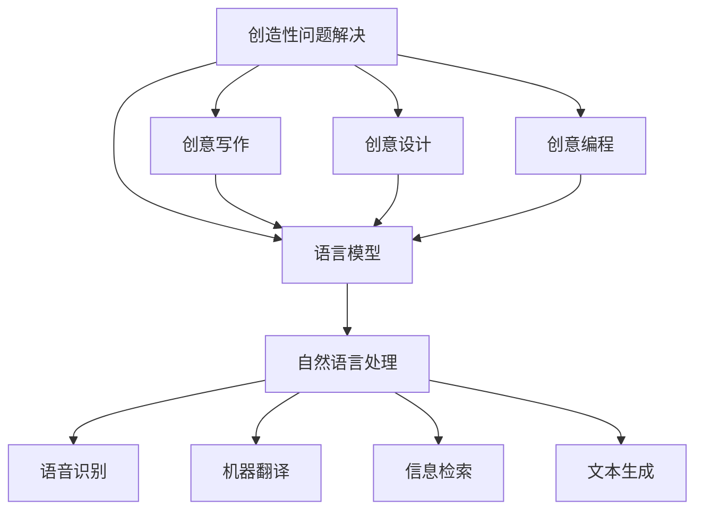

                 


# 语言模型在创造性问题解决中的应用

> 关键词：语言模型，创造性问题解决，自然语言处理，深度学习，Transformer，概率论，神经网络

> 摘要：本文将探讨语言模型在创造性问题解决中的应用，从核心概念、算法原理、数学模型、实际应用等多个方面进行深入分析。通过阐述语言模型的基本原理和架构，以及其在创意写作、创意设计和创意编程等领域的具体应用案例，本文旨在为读者提供关于语言模型在创造性问题解决方面的全面了解。

## 第1章 核心概念与联系

### 1.1 语言模型概述

#### 1.1.1 语言模型的基本概念

语言模型（Language Model，简称LM）是自然语言处理（Natural Language Processing，简称NLP）中的一个核心概念。它是一种概率模型，用于预测一个句子或单词序列的概率。在实际应用中，语言模型被广泛应用于语音识别、机器翻译、信息检索、文本生成等领域。

#### 1.1.2 语言模型的分类

根据模型的结构和训练方法，语言模型可以分为统计模型、神经网络模型和深度学习模型等。统计模型主要包括N-gram模型、隐马尔可夫模型（HMM）等；神经网络模型包括循环神经网络（RNN）、卷积神经网络（CNN）等；深度学习模型主要包括深度神经网络（DNN）、长短时记忆网络（LSTM）、门控循环单元（GRU）和Transformer模型等。

#### 1.1.3 语言模型在创造性问题解决中的应用场景

创造性问题解决涉及多个领域，如创意写作、创意设计和创意编程等。语言模型在这些领域中的应用具有广泛的前景。例如，在创意写作中，语言模型可以生成新颖的句子和段落，帮助作者拓展思路；在创意设计中，语言模型可以生成创意设计方案，提高设计师的工作效率；在创意编程中，语言模型可以生成代码片段，辅助开发者解决问题。

### 1.2 创造性问题的定义与特点

#### 1.2.1 创造性问题的基本定义

创造性问题（Creative Problem）是指那些需要通过创新思维和独特方法来解决的问题。这类问题通常没有现成的解决方案，需要从多个角度进行思考和尝试。

#### 1.2.2 创造性问题的特点

创造性问题具有以下特点：1）不确定性高，解决方案不唯一；2）需要跨学科知识；3）需要创造性思维和方法；4）解决过程具有迭代性。

#### 1.2.3 创造性问题的解决方法

创造性问题的解决方法主要包括：1）头脑风暴，通过集体讨论和思维碰撞，产生新的想法；2）思维导图，将问题分解成多个子问题，并构建知识网络；3）原型设计，通过快速构建原型，验证和迭代解决方案。

## 第2章 语言模型的原理与架构

### 2.1 语言模型的原理

#### 2.1.1 语言模型的基本原理

语言模型的基本原理是基于概率论和统计学的方法。它通过学习大量文本数据，建立单词或句子之间的概率关系，从而预测新的句子或单词序列。

#### 2.1.2 语言模型的核心算法

语言模型的核心算法是预测下一个单词或句子的概率。常见的算法包括N-gram模型、基于神经网络的模型等。

#### 2.1.3 语言模型的性能评估指标

语言模型的性能评估指标主要包括预测准确率、困惑度（Perplexity）等。预测准确率反映了模型预测的正确性，而困惑度则反映了模型的复杂度。

### 2.2 语言模型的主要架构

#### 2.2.1 序列到序列模型

序列到序列（Sequence-to-Sequence，简称Seq2Seq）模型是一种常见的语言模型架构，用于将一个序列映射到另一个序列。它由编码器和解码器两个部分组成。

#### 2.2.2 基于注意力机制的模型

基于注意力机制的模型（Attention Mechanism）是一种在神经网络模型中引入的机制，用于解决序列到序列问题中的长距离依赖问题。

#### 2.2.3 Transformer模型

Transformer模型是一种基于自注意力机制的深度学习模型，广泛应用于自然语言处理任务，如机器翻译、文本生成等。

## 第3章 语言模型的数学模型与公式

### 3.1 语言模型中的概率论基础

$$
P(w_i | w_1, w_2, ..., w_{i-1}) = \frac{P(w_i, w_1, w_2, ..., w_{i-1})}{P(w_1, w_2, ..., w_{i-1})}
$$

#### 3.1.1 条件概率

条件概率是指在一个事件已发生的条件下，另一个事件发生的概率。

#### 3.1.2 贝叶斯定理

贝叶斯定理是一种用于计算条件概率的公式，它可以帮助我们根据已有数据和先验知识来更新概率估计。

#### 3.1.3 语言模型的损失函数

语言模型的损失函数用于衡量模型预测与实际结果之间的差距。常见的损失函数包括交叉熵损失函数（Cross-Entropy Loss）等。

### 3.2 语言模型中的神经网络模型

$$
\begin{align*}
    y &= \sigma(\mathbf{W} \cdot \mathbf{z} + \mathbf{b}) \\
    \nabla_{\mathbf{z}} y &= \sigma'(\mathbf{z}) \cdot \mathbf{W} \\
    \nabla_{\mathbf{W}} y &= y \cdot (\sigma'(\mathbf{z}) \cdot \mathbf{z}) \\
    \nabla_{\mathbf{b}} y &= y \cdot \sigma'(\mathbf{z})
\end{align*}
$$

#### 3.2.1 神经网络的基本结构

神经网络由多个层组成，包括输入层、隐藏层和输出层。每层由多个神经元组成，神经元之间通过权重和偏置进行连接。

#### 3.2.2 神经网络的反向传播算法

反向传播算法是一种用于训练神经网络的算法。它通过计算输出层与隐藏层之间的误差，反向传播误差到隐藏层和输入层，并调整权重和偏置，以最小化损失函数。

#### 3.2.3 神经网络在语言模型中的应用

神经网络在语言模型中的应用主要包括循环神经网络（RNN）、长短时记忆网络（LSTM）和门控循环单元（GRU）等。这些模型能够更好地捕捉序列数据中的长距离依赖关系。

## 第4章 创造性问题解决中的语言模型应用

### 4.1 语言模型在创意写作中的应用

#### 4.1.1 创意写作的基本概念

创意写作是指通过创造性思维和独特的写作技巧，创作出具有新颖性和创意性的作品。语言模型在创意写作中的应用，可以帮助作者拓展思路，生成新颖的句子和段落。

#### 4.1.2 语言模型在创意写作中的优势

语言模型在创意写作中的优势包括：1）快速生成大量文本；2）能够生成新颖、有趣的句子；3）可以帮助作者进行文本编辑和润色。

#### 4.1.3 创意写作中的语言模型应用案例

例如，在某些文学创作比赛中，语言模型可以帮助作者快速生成参赛作品，提高创作效率。此外，语言模型还可以用于生成小说、诗歌等文学作品，为读者带来全新的阅读体验。

### 4.2 语言模型在创意设计中的应用

#### 4.2.1 创意设计的基本概念

创意设计是指通过创造性思维和独特的设计技巧，创作出具有创新性和美观性的设计作品。语言模型在创意设计中的应用，可以帮助设计师快速生成设计方案，提高工作效率。

#### 4.2.2 语言模型在创意设计中的优势

语言模型在创意设计中的优势包括：1）能够生成大量创意设计方案；2）可以帮助设计师进行设计优化和改进；3）可以用于设计风格转换和图像生成等。

#### 4.2.3 创意设计中的语言模型应用案例

例如，在某些建筑设计项目中，语言模型可以帮助设计师快速生成多个设计方案，供客户选择。此外，语言模型还可以用于生成艺术作品、家居设计等，为设计师提供更多的创作灵感。

### 4.3 语言模型在创意编程中的应用

#### 4.3.1 创意编程的基本概念

创意编程是指通过创造性思维和独特的编程技巧，创作出具有创新性和创意性的程序代码。语言模型在创意编程中的应用，可以帮助开发者快速生成代码，提高编程效率。

#### 4.3.2 语言模型在创意编程中的优势

语言模型在创意编程中的优势包括：1）能够快速生成大量代码；2）可以帮助开发者进行代码优化和改进；3）可以用于代码生成和编程挑战等。

#### 4.3.3 创意编程中的语言模型应用案例

例如，在某些编程竞赛中，语言模型可以帮助参赛者快速生成参赛代码，提高竞赛成绩。此外，语言模型还可以用于生成机器学习算法、游戏代码等，为开发者提供更多的创作灵感。

## 第5章 语言模型在创造性问题解决中的应用挑战与未来方向

### 5.1 语言模型应用中的挑战

#### 5.1.1 数据隐私保护

语言模型在创造性问题解决中的应用，通常需要大量的文本数据进行训练。如何保护用户数据隐私，成为语言模型应用中的一个重要挑战。

#### 5.1.2 模型解释性

语言模型是一种复杂的深度学习模型，其内部工作机制难以解释。如何提高语言模型的解释性，使其更容易被用户理解和接受，是一个重要的研究方向。

#### 5.1.3 模型可扩展性

随着创造性问题解决领域的不断拓展，语言模型需要能够适应不同的问题场景，具有较好的可扩展性。

### 5.2 语言模型应用的未来方向

#### 5.2.1 深度学习与自然语言处理的融合

深度学习与自然语言处理（NLP）的融合，是语言模型应用的一个重要方向。通过将深度学习模型与NLP技术相结合，可以进一步提高语言模型在创造性问题解决中的应用效果。

#### 5.2.2 多模态语言模型的探索

多模态语言模型是指能够处理多种类型数据（如文本、图像、声音等）的语言模型。随着人工智能技术的不断发展，多模态语言模型在创造性问题解决中的应用前景非常广阔。

#### 5.2.3 自动创作与创造性问题解决的进一步结合

自动创作技术，如生成对抗网络（GAN）、变分自编码器（VAE）等，在创造性问题解决中具有很大的潜力。将自动创作技术与语言模型相结合，可以进一步提高创造性问题解决的效果。

## 附录

### 5.1 语言模型开发工具与资源

#### 5.1.1 开发环境搭建

搭建语言模型开发环境，通常需要安装Python、TensorFlow、PyTorch等工具。具体安装步骤可参考相关文档。

#### 5.1.2 语言模型开源框架与库

目前，有许多开源框架和库可以用于语言模型开发，如TensorFlow、PyTorch、NLTK等。读者可以根据自己的需求选择合适的框架和库。

#### 5.1.3 创造性问题解决相关开源项目

在GitHub等平台上，有许多与创造性问题解决相关的开源项目，如TextGen、CharRNN等。读者可以参考这些项目，学习语言模型在创造性问题解决中的应用。

### 5.2 创造性问题解决中的语言模型最佳实践

在创造性问题解决中，语言模型的应用需要遵循一些最佳实践，如：

- **数据准备**：收集并处理大量高质量的训练数据，确保数据多样性。
- **模型选择**：根据具体应用场景，选择合适的语言模型和架构。
- **调参优化**：对模型参数进行调优，以提高模型性能。
- **结果验证**：对模型生成的结果进行验证和评估，确保其有效性。

### 5.3 注意事项

- **隐私保护**：在使用语言模型时，要确保用户数据的安全和隐私。
- **解释性**：尽量提高语言模型的解释性，使其更容易被用户理解和接受。
- **可扩展性**：确保语言模型具有较好的可扩展性，能够适应不同的应用场景。

### 5.4 拓展阅读

- **深度学习与自然语言处理**：《深度学习》（Goodfellow et al.）和《自然语言处理实战》（Jurafsky and Martin）是两本关于深度学习和自然语言处理的重要书籍。
- **创造性问题解决**：《创新与企业家精神》（Drucker）和《设计思维》（Doblin）是两本关于创造性问题解决的重要书籍。

**作者：AI天才研究院/AI Genius Institute & 禅与计算机程序设计艺术 /Zen And The Art of Computer Programming**## 第1章 核心概念与联系

### 1.1 语言模型概述

语言模型（Language Model，简称LM）是自然语言处理（Natural Language Processing，简称NLP）中的一个核心概念。它是一种概率模型，用于预测一个句子或单词序列的概率。在实际应用中，语言模型被广泛应用于语音识别、机器翻译、信息检索、文本生成等领域。

在自然语言处理中，语言模型的主要作用是理解文本数据并生成相关的文本。例如，在机器翻译中，语言模型用于预测目标语言中的下一个单词；在语音识别中，语言模型用于将语音信号转换为文本；在信息检索中，语言模型用于预测用户可能感兴趣的相关信息。

语言模型的核心任务是根据给定的前文序列，预测下一个单词或句子。这个任务可以通过学习大量的文本数据来实现。语言模型通过分析文本数据中的统计特征，建立单词或句子之间的概率关系，从而实现对未知文本的预测。

### 1.2 创造性问题的定义与特点

创造性问题（Creative Problem）是指那些需要通过创新思维和独特方法来解决的问题。这类问题通常没有现成的解决方案，需要从多个角度进行思考和尝试。

创造性问题具有以下特点：

1. **不确定性高**：创造性问题的解决方案通常不明确，具有很高的不确定性。
2. **跨学科知识**：解决创造性问题通常需要跨学科的知识和技能，如艺术、科学、技术等。
3. **创造性思维**：解决创造性问题需要运用创造性思维，包括联想、类比、直觉等。
4. **迭代性**：创造性问题的解决过程通常需要多次迭代和尝试，不断优化解决方案。

### 1.3 创造性问题的解决方法

创造性问题的解决方法主要包括以下几种：

1. **头脑风暴**：通过集体讨论和思维碰撞，产生新的想法。头脑风暴是一种快速产生大量想法的方法，有助于激发创造性思维。
2. **思维导图**：将问题分解成多个子问题，并构建知识网络。思维导图可以帮助整理思路，发现潜在的问题解决方案。
3. **原型设计**：通过快速构建原型，验证和迭代解决方案。原型设计是一种有效的方法，可以在低成本的情况下测试和优化创意。

创造性问题的解决方法需要灵活运用，根据具体情况选择合适的方法。例如，在创意写作中，可以通过头脑风暴和思维导图来构思故事情节；在创意设计中，可以通过原型设计来测试和优化设计方案。

### 1.4 语言模型在创造性问题解决中的应用场景

语言模型在创造性问题解决中具有广泛的应用场景，主要包括以下几个方面：

1. **创意写作**：语言模型可以帮助作者生成新颖的句子和段落，拓展思路，提高写作效率。例如，在某些文学创作比赛中，语言模型可以快速生成参赛作品，帮助作者提高创作水平。
2. **创意设计**：语言模型可以帮助设计师生成创意设计方案，提高工作效率。例如，在建筑设计项目中，语言模型可以生成多个设计方案，供客户选择。
3. **创意编程**：语言模型可以帮助开发者生成代码片段，辅助解决问题。例如，在编程竞赛中，语言模型可以生成参赛代码，提高竞赛成绩。

总之，语言模型在创造性问题解决中的应用，有助于提高问题的解决效率，激发创造性思维。随着人工智能技术的不断发展，语言模型在创造性问题解决中的应用前景将更加广阔。

### 1.5 核心概念与联系架构图

为了更好地理解语言模型在创造性问题解决中的核心概念与联系，我们可以通过Mermaid流程图进行可视化展示。以下是一个简化的架构图：



在这个架构图中，语言模型作为自然语言处理的核心组成部分，与语音识别、机器翻译、信息检索、文本生成等任务密切相关。同时，语言模型在创造性问题解决中也发挥着重要作用，包括创意写作、创意设计、创意编程等领域。通过这个架构图，我们可以清晰地看到语言模型在创造性问题解决中的应用场景和核心概念之间的联系。

### 1.6 语言模型与创造性问题的关系分析

语言模型在创造性问题解决中的应用，可以通过以下几个方面来具体分析：

1. **文本生成能力**：语言模型具有强大的文本生成能力，可以生成新颖的句子和段落，为创造性问题提供丰富的素材。例如，在创意写作中，语言模型可以生成故事情节、角色对话等，帮助作者构思和拓展思路。

2. **知识提取与理解**：语言模型能够从大量文本数据中提取关键信息，并对其进行理解。在创造性问题解决中，这种能力有助于发现问题的本质，从而提出有效的解决方案。例如，在创意设计中，语言模型可以帮助设计师从相关文献中提取设计灵感和创意点。

3. **模式识别与优化**：语言模型在训练过程中，能够识别文本数据中的模式。这种能力可以用于优化创造性问题的解决方案。例如，在创意编程中，语言模型可以帮助开发者识别代码中的潜在问题，并提出优化建议。

4. **跨学科融合**：语言模型在创造性问题解决中的应用，可以促进不同学科之间的融合。例如，在创意写作中，语言模型可以结合文学、心理学、社会学等多学科知识，为作者提供更丰富的创作素材和灵感。

综上所述，语言模型在创造性问题解决中具有广泛的应用前景。通过文本生成、知识提取、模式识别和跨学科融合等多种方式，语言模型可以有效地辅助创造性问题的解决，提高问题的解决效率和质量。

## 第2章 语言模型的原理与架构

### 2.1 语言模型的原理

语言模型的原理基于概率论和统计学，其核心思想是通过分析大量文本数据，建立单词或句子之间的概率关系，从而预测新的句子或单词序列。具体来说，语言模型旨在解决以下问题：给定一个已知的单词序列，如何预测下一个单词？

为了实现这一目标，语言模型需要从文本数据中学习单词或短语的统计特征。例如，对于一个三词序列“我 今天 起床”，语言模型会计算这三个词同时出现的概率。这一过程称为“条件概率”计算。

在语言模型中，条件概率的计算可以通过以下公式表示：

$$
P(w_i | w_1, w_2, ..., w_{i-1}) = \frac{P(w_i, w_1, w_2, ..., w_{i-1})}{P(w_1, w_2, ..., w_{i-1})}
$$

其中，$P(w_i | w_1, w_2, ..., w_{i-1})$ 表示在已知前 $i-1$ 个词的情况下，预测第 $i$ 个词的概率；$P(w_i, w_1, w_2, ..., w_{i-1})$ 表示单词序列 $w_1, w_2, ..., w_i$ 的联合概率；$P(w_1, w_2, ..., w_{i-1})$ 表示前 $i-1$ 个词的联合概率。

### 2.2 语言模型的核心算法

语言模型的核心算法包括N-gram模型、基于神经网络的模型和深度学习模型等。以下将分别介绍这些算法的基本原理。

#### 2.2.1 N-gram模型

N-gram模型是一种基于统计的语言模型，其中N表示模型的阶数。N-gram模型将前文序列划分为N个词，并根据这些词的历史出现频率来预测下一个词。例如，对于二元语法模型（Bigram模型），前文序列为“我 今天 起床”，模型将预测下一个词。

N-gram模型的预测公式可以表示为：

$$
P(w_i | w_1, w_2, ..., w_{i-1}) = \frac{C(w_1, w_2, ..., w_i)}{C(w_1, w_2, ..., w_{i-1})}
$$

其中，$C(w_1, w_2, ..., w_i)$ 表示单词序列 $w_1, w_2, ..., w_i$ 的联合频率；$C(w_1, w_2, ..., w_{i-1})$ 表示单词序列 $w_1, w_2, ..., w_{i-1}$ 的联合频率。

N-gram模型的优点是简单、易于实现，但缺点是难以捕捉长距离依赖关系，容易产生生硬的预测结果。

#### 2.2.2 基于神经网络的模型

基于神经网络的模型通过多层神经网络来学习文本数据中的概率分布。常见的神经网络模型包括循环神经网络（RNN）、长短时记忆网络（LSTM）和门控循环单元（GRU）等。

1. **循环神经网络（RNN）**：RNN是一种能够处理序列数据的神经网络，其核心思想是通过隐藏状态保存前文信息。然而，RNN在处理长序列数据时存在梯度消失或梯度爆炸的问题，难以捕捉长距离依赖关系。

2. **长短时记忆网络（LSTM）**：LSTM是RNN的一种改进模型，通过引入记忆单元和门控机制来克服梯度消失问题，从而更好地捕捉长距离依赖关系。LSTM的预测公式可以表示为：

$$
\begin{align*}
    \text{遗忘门}: f_t &= \sigma(W_f \cdot [h_{t-1}, x_t] + b_f) \\
    \text{输入门}: i_t &= \sigma(W_i \cdot [h_{t-1}, x_t] + b_i) \\
    \text{输出门}: o_t &= \sigma(W_o \cdot [h_{t-1}, x_t] + b_o) \\
    \text{新记忆}: c_t &= f_t \odot c_{t-1} + i_t \odot \text{sigmoid}(W_c \cdot [h_{t-1}, x_t] + b_c) \\
    \text{输出}: h_t &= o_t \odot \text{tanh}(c_t)
\end{align*}
$$

其中，$h_{t-1}$ 和 $x_t$ 分别表示前一时间步的隐藏状态和当前输入；$c_{t-1}$ 和 $c_t$ 分别表示前一时间步和当前时间的记忆状态；$W_f, W_i, W_o, W_c$ 和 $b_f, b_i, b_o, b_c$ 分别表示权重和偏置。

3. **门控循环单元（GRU）**：GRU是LSTM的一种简化版本，通过引入更新门和重置门来优化LSTM的结构，从而更好地捕捉长距离依赖关系。GRU的预测公式可以表示为：

$$
\begin{align*}
    \text{更新门}: z_t &= \sigma(W_z \cdot [h_{t-1}, x_t] + b_z) \\
    \text{重置门}: r_t &= \sigma(W_r \cdot [h_{t-1}, x_t] + b_r) \\
    \text{新记忆}: c_t &= (1 - z_t) \odot c_{t-1} + r_t \odot \text{sigmoid}(W_c \cdot [h_{t-1}, x_t] + b_c) \\
    \text{输出}: h_t &= \text{sigmoid}(W_o \cdot [c_t, x_t] + b_o)
\end{align*}
$$

#### 2.2.3 深度学习模型

深度学习模型是指具有多层神经网络的模型，可以更好地捕捉文本数据中的复杂特征。常见的深度学习模型包括卷积神经网络（CNN）和Transformer模型等。

1. **卷积神经网络（CNN）**：CNN是一种用于处理图像数据的神经网络，但其原理也可以应用于文本数据。CNN通过卷积层提取文本数据中的局部特征，并通过池化层降低数据维度。CNN的预测公式可以表示为：

$$
\begin{align*}
    \text{卷积层}: h_{ij} &= \sum_{k=1}^{K} w_{ik} \cdot x_{jk} + b_k \\
    \text{池化层}: p_i &= \max_{j} h_{ij}
\end{align*}
$$

2. **Transformer模型**：Transformer模型是一种基于自注意力机制的深度学习模型，广泛应用于自然语言处理任务。Transformer模型通过多头自注意力机制和前馈神经网络来捕捉文本数据中的长距离依赖关系。Transformer的预测公式可以表示为：

$$
\begin{align*}
    \text{自注意力}: \\
    Q &= \text{softmax}\left(\frac{QK^T}{\sqrt{d_k}}\right)A \\
    \text{前馈网络}: \\
    h_{i}^{(2)} &= \text{ReLU}\left(W_2 \cdot [h_i, QK^T] + b_2\right)
\end{align*}
$$

其中，$Q, K, V$ 分别表示查询向量、键向量和值向量；$A$ 表示注意力权重矩阵；$d_k$ 表示键向量的维度。

### 2.3 语言模型的性能评估指标

语言模型的性能评估指标用于衡量模型的预测准确性和有效性。以下介绍几种常见的性能评估指标：

1. **预测准确率**：预测准确率是指模型预测正确的单词或句子占总数的比例。预测准确率是评估语言模型最直观的指标，但容易受到数据分布的影响。
2. **困惑度（Perplexity）**：困惑度是衡量语言模型预测效果的另一种指标，表示模型对未知文本的预测不确定程度。困惑度越低，表示模型对文本的预测越准确。困惑度的计算公式为：

$$
\text{Perplexity} = \exp\left(-\frac{1}{N}\sum_{i=1}^{N} \log P(w_i | w_1, w_2, ..., w_{i-1})\right)
$$

其中，$N$ 表示文本中的单词或句子总数。

3. **交叉熵损失函数**：交叉熵损失函数是评估语言模型常用的损失函数，表示模型预测分布与真实分布之间的差异。交叉熵损失函数的计算公式为：

$$
\text{Cross-Entropy Loss} = -\sum_{i=1}^{N} y_i \log \hat{y}_i
$$

其中，$y_i$ 表示第 $i$ 个单词或句子的真实分布；$\hat{y}_i$ 表示模型预测的分布。

### 2.4 语言模型在创造性问题解决中的应用

语言模型在创造性问题解决中的应用具有广泛的前景，主要包括以下方面：

1. **创意写作**：语言模型可以帮助作者生成新颖的句子和段落，拓展思路，提高写作效率。例如，在某些文学创作比赛中，语言模型可以快速生成参赛作品，帮助作者提高创作水平。
2. **创意设计**：语言模型可以帮助设计师生成创意设计方案，提高工作效率。例如，在建筑设计项目中，语言模型可以生成多个设计方案，供客户选择。
3. **创意编程**：语言模型可以帮助开发者生成代码片段，辅助解决问题。例如，在编程竞赛中，语言模型可以生成参赛代码，提高竞赛成绩。

总之，语言模型在创造性问题解决中的应用，有助于提高问题的解决效率，激发创造性思维。随着人工智能技术的不断发展，语言模型在创造性问题解决中的应用前景将更加广阔。

### 2.5 语言模型的应用实例

为了更好地理解语言模型在实际应用中的作用，以下将介绍几个具体的实例：

1. **机器翻译**：在机器翻译中，语言模型被广泛用于预测目标语言中的下一个单词。例如，在英译汉的翻译过程中，语言模型可以根据前文信息预测下一个汉字，从而生成完整的翻译文本。

2. **语音识别**：在语音识别中，语言模型用于将语音信号转换为文本。语言模型可以根据语音信号中的语音特征，预测下一个单词或句子，从而实现语音到文本的转换。

3. **文本生成**：在文本生成中，语言模型可以生成具有创造性的文本内容。例如，在生成新闻文章、社交媒体帖子等应用中，语言模型可以根据主题和上下文生成新颖的文本内容。

4. **问答系统**：在问答系统中，语言模型可以回答用户提出的问题。语言模型可以根据用户的提问，理解问题的含义，并生成相关的回答。

通过这些实例，我们可以看到语言模型在多种应用场景中的重要作用。语言模型不仅能够提高问题的解决效率，还能够激发创造性思维，为各种领域带来创新和变革。

## 第3章 语言模型的数学模型与公式

### 3.1 语言模型中的概率论基础

在语言模型中，概率论是构建和评估模型的基础。以下将介绍语言模型中的几个重要概率论概念，包括条件概率、贝叶斯定理和语言模型的损失函数。

#### 3.1.1 条件概率

条件概率是指在某个事件已发生的条件下，另一个事件发生的概率。条件概率可以用以下公式表示：

$$
P(A | B) = \frac{P(A \cap B)}{P(B)}
$$

其中，$P(A | B)$ 表示在事件 $B$ 发生的条件下事件 $A$ 发生的概率，$P(A \cap B)$ 表示事件 $A$ 和事件 $B$ 同时发生的概率，$P(B)$ 表示事件 $B$ 发生的概率。

在语言模型中，条件概率用于预测下一个单词或句子。例如，给定一个单词序列“我 今天 起床”，我们需要计算下一个单词“是”的概率。条件概率可以帮助我们计算这个概率。

#### 3.1.2 贝叶斯定理

贝叶斯定理是一种用于计算条件概率的公式，它可以帮助我们根据已有数据和先验知识来更新概率估计。贝叶斯定理的公式如下：

$$
P(A | B) = \frac{P(B | A)P(A)}{P(B)}
$$

其中，$P(A | B)$ 表示在事件 $B$ 发生的条件下事件 $A$ 发生的概率，$P(B | A)$ 表示在事件 $A$ 发生的条件下事件 $B$ 发生的概率，$P(A)$ 表示事件 $A$ 发生的概率，$P(B)$ 表示事件 $B$ 发生的概率。

在语言模型中，贝叶斯定理可以用于计算单词或句子序列的概率。例如，给定一个单词序列“我 今天 起床”，我们可以使用贝叶斯定理来计算这个序列的概率。

#### 3.1.3 语言模型的损失函数

损失函数是评估语言模型性能的重要工具。在语言模型中，常见的损失函数包括交叉熵损失函数（Cross-Entropy Loss）等。

交叉熵损失函数是一种用于衡量模型预测分布与真实分布之间差异的损失函数。交叉熵损失函数的公式如下：

$$
\text{Cross-Entropy Loss} = -\sum_{i=1}^{N} y_i \log \hat{y}_i
$$

其中，$y_i$ 表示第 $i$ 个单词或句子的真实分布，$\hat{y}_i$ 表示模型预测的分布，$N$ 表示单词或句子的总数。

交叉熵损失函数的值越低，表示模型预测的分布与真实分布越接近，模型的性能越好。

#### 3.1.4 概率论在语言模型中的应用实例

以下是一个简单的实例，说明概率论在语言模型中的应用。

假设我们有一个语言模型，它的目标是预测一个单词序列的概率。给定一个单词序列“我 今天 起床”，我们需要计算这个序列的概率。

首先，我们可以使用条件概率计算每个单词的概率。例如，给定前一个单词“我”，下一个单词“今天”的概率可以表示为：

$$
P(今天 | 我) = \frac{P(今天, 我)}{P(我)}
$$

然后，我们可以使用贝叶斯定理计算整个单词序列的概率：

$$
P(我 今天 起床) = \frac{P(起床 | 今天, 我)P(今天 | 我)P(我)}{P(今天, 我)}
$$

最后，我们可以使用交叉熵损失函数评估模型性能：

$$
\text{Cross-Entropy Loss} = -\sum_{i=1}^{3} y_i \log \hat{y}_i
$$

其中，$y_i$ 表示第 $i$ 个单词的真实概率，$\hat{y}_i$ 表示模型预测的概率。

通过这个实例，我们可以看到概率论在语言模型中的核心作用。概率论不仅帮助我们构建和评估语言模型，还为我们提供了理解和解释模型预测结果的方法。

### 3.2 语言模型中的神经网络模型

在语言模型中，神经网络模型是一种重要的方法，可以有效地学习文本数据中的复杂模式。以下将介绍神经网络模型的基本结构、反向传播算法和其在语言模型中的应用。

#### 3.2.1 神经网络的基本结构

神经网络由多个层组成，包括输入层、隐藏层和输出层。每个层由多个神经元组成，神经元之间通过权重和偏置进行连接。以下是神经网络的基本结构：

1. **输入层**：输入层接收外部输入，例如单词或句子。每个输入神经元对应一个单词或特征。
2. **隐藏层**：隐藏层用于提取文本数据中的特征和模式。隐藏层中的每个神经元都通过激活函数将输入数据映射到高维空间。
3. **输出层**：输出层产生模型的预测结果，例如单词或句子。输出层中的每个神经元对应一个可能的输出结果。

#### 3.2.2 神经网络的反向传播算法

反向传播算法是训练神经网络的关键算法。它通过计算输出层与隐藏层之间的误差，反向传播误差到隐藏层和输入层，并调整权重和偏置，以最小化损失函数。

反向传播算法的步骤如下：

1. **前向传播**：从输入层开始，将输入数据通过隐藏层和输出层进行传播，得到模型的预测结果。
2. **计算损失**：使用损失函数计算模型预测结果与真实结果之间的差异，得到损失值。
3. **计算误差**：从输出层开始，计算每个神经元对损失值的贡献，即误差。
4. **反向传播**：将误差反向传播到隐藏层和输入层，并调整权重和偏置，以减小损失值。
5. **迭代优化**：重复上述步骤，直到模型达到预定的损失值或达到最大迭代次数。

以下是反向传播算法的伪代码：

```
for each epoch do
    for each training example do
        // 前向传播
        outputs = model(inputs)
        loss = calculate_loss(outputs, labels)

        // 计算误差
        doutputs = calculate_gradients(outputs, labels)

        // 反向传播
        for layer in reverse(model.layers)
            dweights = layer.backward(doutputs)

            // 更新权重和偏置
            model.update_weights(dweights)

    end for
end for
```

#### 3.2.3 神经网络在语言模型中的应用

神经网络在语言模型中的应用主要分为以下几种：

1. **循环神经网络（RNN）**：RNN是一种能够处理序列数据的神经网络，通过隐藏状态保存前文信息。RNN可以用于构建语言模型，例如长短时记忆网络（LSTM）和门控循环单元（GRU）。
2. **卷积神经网络（CNN）**：CNN是一种用于处理图像数据的神经网络，但其原理也可以应用于文本数据。CNN可以用于提取文本数据中的局部特征，从而提高语言模型的性能。
3. **Transformer模型**：Transformer模型是一种基于自注意力机制的深度学习模型，广泛应用于自然语言处理任务。Transformer模型通过多头自注意力机制和前馈神经网络来捕捉文本数据中的长距离依赖关系。

以下是一个简单的神经网络模型在语言模型中的应用实例：

```
// 定义输入层
input_layer = [word1, word2, ..., wordn]

// 定义隐藏层
hidden_layer = [h1, h2, ..., hn]

// 定义输出层
output_layer = [word1', word2', ..., wordn']

// 定义损失函数
loss_function = cross_entropy_loss

// 定义反向传播算法
def backward_propagation(inputs, outputs, labels):
    // 计算预测值
    predicted_values = model.predict(inputs)

    // 计算损失
    loss = loss_function(predicted_values, labels)

    // 计算误差
    doutputs = calculate_gradients(predicted_values, labels)

    // 反向传播
    for layer in reverse(model.layers):
        dweights = layer.backward(doutputs)

        // 更新权重和偏置
        model.update_weights(dweights)

    return loss
```

通过这个实例，我们可以看到神经网络在语言模型中的应用。神经网络可以学习文本数据中的复杂模式，从而提高语言模型的性能。此外，神经网络还可以通过反向传播算法不断优化模型，使其在预测任务中表现出色。

### 3.3 数学公式和详细讲解

在语言模型中，数学公式用于描述模型的结构和参数。以下将介绍一些常见的数学公式，并对其进行详细讲解。

#### 3.3.1 概率公式

概率公式用于计算单词或句子序列的概率。以下是几个常见的概率公式：

1. **条件概率**：

$$
P(A | B) = \frac{P(A \cap B)}{P(B)}
$$

其中，$P(A | B)$ 表示在事件 $B$ 发生的条件下事件 $A$ 发生的概率，$P(A \cap B)$ 表示事件 $A$ 和事件 $B$ 同时发生的概率，$P(B)$ 表示事件 $B$ 发生的概率。

2. **贝叶斯定理**：

$$
P(A | B) = \frac{P(B | A)P(A)}{P(B)}
$$

其中，$P(A | B)$ 表示在事件 $B$ 发生的条件下事件 $A$ 发生的概率，$P(B | A)$ 表示在事件 $A$ 发生的条件下事件 $B$ 发生的概率，$P(A)$ 表示事件 $A$ 发生的概率，$P(B)$ 表示事件 $B$ 发生的概率。

3. **联合概率**：

$$
P(A, B) = P(A)P(B | A)
$$

其中，$P(A, B)$ 表示事件 $A$ 和事件 $B$ 同时发生的概率，$P(A)$ 表示事件 $A$ 发生的概率，$P(B | A)$ 表示在事件 $A$ 发生的条件下事件 $B$ 发生的概率。

#### 3.3.2 损失函数

损失函数用于衡量模型预测值与真实值之间的差距。以下是几个常见的损失函数：

1. **均方误差（MSE）**：

$$
MSE = \frac{1}{n}\sum_{i=1}^{n}(y_i - \hat{y}_i)^2
$$

其中，$y_i$ 表示第 $i$ 个真实值，$\hat{y}_i$ 表示第 $i$ 个预测值，$n$ 表示样本数量。

2. **交叉熵损失（Cross-Entropy Loss）**：

$$
Cross-Entropy Loss = -\sum_{i=1}^{n}y_i \log \hat{y}_i
$$

其中，$y_i$ 表示第 $i$ 个真实概率，$\hat{y}_i$ 表示第 $i$ 个预测概率。

3. **对数损失（Log Loss）**：

$$
Log Loss = -\frac{1}{n}\sum_{i=1}^{n}y_i \log \hat{y}_i
$$

其中，$y_i$ 表示第 $i$ 个真实概率，$\hat{y}_i$ 表示第 $i$ 个预测概率。

#### 3.3.3 神经网络参数更新

神经网络参数更新是训练神经网络的关键步骤。以下是神经网络参数更新的公式：

1. **权重更新**：

$$
\Delta w = \alpha \cdot \frac{\partial L}{\partial w}
$$

其中，$\Delta w$ 表示权重更新，$\alpha$ 表示学习率，$L$ 表示损失函数，$\frac{\partial L}{\partial w}$ 表示损失函数关于权重的梯度。

2. **偏置更新**：

$$
\Delta b = \alpha \cdot \frac{\partial L}{\partial b}
$$

其中，$\Delta b$ 表示偏置更新，$\alpha$ 表示学习率，$L$ 表示损失函数，$\frac{\partial L}{\partial b}$ 表示损失函数关于偏置的梯度。

通过这些数学公式，我们可以更好地理解语言模型的工作原理，并利用这些公式对模型进行优化。

### 3.4 数学公式举例说明

为了更好地理解数学公式在语言模型中的应用，以下将通过几个例子进行说明。

#### 3.4.1 条件概率举例

假设我们有一个简单的文本数据集，其中包含以下单词序列：

```
我 今天 起床
我 今天 工作
```

我们需要计算“我”和“今天”之间的条件概率。根据条件概率公式，我们可以计算：

$$
P(今天 | 我) = \frac{P(今天, 我)}{P(我)}
$$

计算结果如下：

$$
P(今天, 我) = \frac{1}{2}
$$

$$
P(我) = \frac{2}{2} = 1
$$

$$
P(今天 | 我) = \frac{\frac{1}{2}}{1} = \frac{1}{2}
$$

因此，给定“我”，“今天”的概率为 $\frac{1}{2}$。

#### 3.4.2 贝叶斯定理举例

假设我们有一个简单的文本数据集，其中包含以下单词序列：

```
我 今天 起床
我 今天 工作
```

我们需要计算“我 今天 起床”的概率。根据贝叶斯定理，我们可以计算：

$$
P(我 今天 起床) = \frac{P(起床 | 我 今天)P(我 今天)}{P(我 今天)}
$$

计算结果如下：

$$
P(起床 | 我 今天) = \frac{1}{2}
$$

$$
P(我 今天) = \frac{2}{2} = 1
$$

$$
P(我 今天 起床) = \frac{\frac{1}{2} \cdot 1}{1} = \frac{1}{2}
$$

因此，给定“我 今天”，“起床”的概率为 $\frac{1}{2}$。

#### 3.4.3 损失函数举例

假设我们有一个简单的神经网络模型，其中包含一个输入层、一个隐藏层和一个输出层。我们需要计算模型在某个样本上的损失函数。根据均方误差（MSE）公式，我们可以计算：

$$
MSE = \frac{1}{n}\sum_{i=1}^{n}(y_i - \hat{y}_i)^2
$$

其中，$y_i$ 表示第 $i$ 个真实值，$\hat{y}_i$ 表示第 $i$ 个预测值，$n$ 表示样本数量。

假设我们有一个样本，其中包含以下真实值和预测值：

```
y: [1, 0, 1]
\hat{y}: [0.9, 0.1, 0.8]
```

计算结果如下：

$$
MSE = \frac{1}{3}\sum_{i=1}^{3}(y_i - \hat{y}_i)^2 = \frac{1}{3}[(1 - 0.9)^2 + (0 - 0.1)^2 + (1 - 0.8)^2] = \frac{1}{3}[0.01 + 0.01 + 0.04] = 0.02
$$

因此，该样本的均方误差为 $0.02$。

通过这些例子，我们可以看到数学公式在语言模型中的应用。数学公式帮助我们计算单词或句子序列的概率、优化模型参数，并评估模型的性能。

## 第4章 创造性问题解决中的语言模型应用

### 4.1 语言模型在创意写作中的应用

#### 4.1.1 创意写作的基本概念

创意写作是指通过创造性思维和独特的写作技巧，创作出具有新颖性和创意性的作品。它不仅包括文学作品的创作，如小说、诗歌、剧本等，还涵盖了广告文案、广告创意、宣传文案等多个领域。创意写作强调作者的独立思考和创新能力的发挥，通过文字表达独特的观点、情感和想象。

在文学创作中，创意写作是一种独特的艺术形式，它要求作者不仅要具备深厚的文学功底，还要有丰富的想象力和创造力。通过创意写作，作者可以描绘出丰富多彩的想象世界，构建引人入胜的故事情节，塑造鲜明的角色形象。

#### 4.1.2 语言模型在创意写作中的优势

语言模型在创意写作中具有显著的优势，主要体现在以下几个方面：

1. **生成新颖句子**：语言模型能够根据已有的文本数据生成新颖的句子。例如，在创作小说的过程中，语言模型可以帮助作者快速生成故事情节、角色对话等，从而激发作者的灵感，提高创作效率。

2. **拓展写作思路**：通过学习大量文本数据，语言模型能够理解不同写作风格和表达方式，帮助作者在创作过程中拓展思路。例如，当作者陷入创作瓶颈时，语言模型可以提供不同的写作方向和创意点，帮助作者突破局限。

3. **优化文本质量**：语言模型不仅可以生成新颖的句子，还可以对文本进行优化和润色。例如，在撰写广告文案时，语言模型可以帮助作者调整句子结构、词汇选择，提高文案的表达效果和吸引力。

#### 4.1.3 创意写作中的语言模型应用案例

以下是一些语言模型在创意写作中应用的案例：

1. **自动生成小说**：某些在线平台利用语言模型自动生成小说，为用户提供全新的阅读体验。例如，通过输入一个主题或关键词，语言模型可以生成一个完整的故事情节，包括角色设定、冲突发展、结局设计等。

2. **辅助写作辅导**：在写作教学中，语言模型可以作为辅助工具，帮助学生进行创意写作。例如，教师可以要求学生输入一个主题，然后语言模型生成多个可能的写作方向，供学生选择和参考。

3. **生成广告文案**：广告公司可以利用语言模型快速生成广告文案，提高广告创作的效率。例如，在撰写广告文案时，语言模型可以根据产品特点、目标受众等生成具有吸引力的广告语和文案。

总之，语言模型在创意写作中的应用为创作者提供了丰富的创作工具和灵感来源，有助于提高写作效率和文本质量。随着人工智能技术的不断发展，语言模型在创意写作中的应用前景将更加广阔。

### 4.2 语言模型在创意设计中的应用

#### 4.2.1 创意设计的基本概念

创意设计是指通过创造性思维和独特的视觉语言，创造出具有新颖性和创意性的设计作品。它涵盖多个领域，包括平面设计、UI/UX设计、建筑设计、工业设计等。创意设计强调设计师的独立思考和创新能力的发挥，通过视觉表达独特的观点和风格，解决设计问题和满足用户需求。

在平面设计中，创意设计包括海报、广告、名片、书籍封面等；在UI/UX设计中，创意设计涉及用户界面、用户体验和交互设计；在建筑设计中，创意设计包括建筑设计、室内设计、景观设计等；在工业设计中，创意设计包括产品造型、功能设计、用户体验设计等。

#### 4.2.2 语言模型在创意设计中的优势

语言模型在创意设计中具有以下优势：

1. **生成创意设计方案**：语言模型可以根据设计需求生成多个创意设计方案，为设计师提供丰富的灵感来源。例如，在建筑设计中，语言模型可以生成不同的建筑风格、布局和色彩搭配，帮助设计师探索多种可能性。

2. **优化设计过程**：语言模型可以帮助设计师快速生成设计原型，进行设计和优化。例如，在UI/UX设计中，语言模型可以生成用户界面布局和交互设计，供设计师参考和调整。

3. **提高设计效率**：语言模型可以自动化部分设计任务，提高设计效率。例如，在平面设计中，语言模型可以自动生成海报和广告的设计元素，减少设计师的工作量。

#### 4.2.3 创意设计中的语言模型应用案例

以下是一些语言模型在创意设计中的应用案例：

1. **建筑设计**：利用语言模型生成建筑设计方案。例如，在建筑设计竞赛中，语言模型可以帮助设计师快速生成多个设计方案，供评审团选择。

2. **UI/UX设计**：利用语言模型生成用户界面和交互设计。例如，在开发一个移动应用时，语言模型可以生成用户界面布局和交互设计，供设计师参考和调整。

3. **平面设计**：利用语言模型生成海报和广告设计。例如，在广告公司，语言模型可以帮助设计师快速生成多个创意设计方案，提高广告创作的效率。

总之，语言模型在创意设计中的应用为设计师提供了丰富的创作工具和灵感来源，有助于提高设计效率和创意水平。随着人工智能技术的不断发展，语言模型在创意设计中的应用前景将更加广阔。

### 4.3 语言模型在创意编程中的应用

#### 4.3.1 创意编程的基本概念

创意编程是指通过创造性思维和独特的编程技巧，创作出具有创新性和创意性的程序代码。创意编程不仅涉及编写和优化代码，还包括构建新的算法、解决复杂问题、设计创新性的软件系统等。创意编程强调程序员的独立思考、创新能力和技术水平的发挥，通过代码实现独特的功能和体验。

在编程竞赛中，创意编程是一种挑战性的任务，要求程序员在短时间内解决复杂的问题，并提出创新的解决方案。在软件开发中，创意编程则体现在开发过程中不断尝试和改进，以实现最优的代码结构和性能。

#### 4.3.2 语言模型在创意编程中的优势

语言模型在创意编程中具有以下优势：

1. **代码生成**：语言模型可以自动生成代码片段，帮助开发者解决编程问题。例如，在编程竞赛中，语言模型可以生成参赛代码，供开发者参考和优化。

2. **代码优化**：语言模型可以帮助开发者优化代码，提高程序的性能和可读性。例如，在软件开发过程中，语言模型可以分析现有代码，并提出优化建议。

3. **算法创新**：语言模型可以生成新的算法，帮助开发者解决复杂的问题。例如，在科学研究和数据分析中，语言模型可以生成高效的算法，提高数据处理和分析的效率。

#### 4.3.3 创意编程中的语言模型应用案例

以下是一些语言模型在创意编程中的应用案例：

1. **编程竞赛**：在编程竞赛中，语言模型可以帮助参赛者快速生成参赛代码，提高竞赛成绩。例如，在某些算法竞赛中，语言模型可以生成高效的算法实现，供参赛者参考。

2. **软件开发**：在软件开发过程中，语言模型可以帮助开发者生成代码原型，提高开发效率。例如，在开发一个新功能时，语言模型可以生成相关代码，供开发者参考和调整。

3. **算法研究**：在算法研究中，语言模型可以生成新的算法，帮助研究人员探索复杂的算法问题。例如，在数据分析领域，语言模型可以生成高效的算法，提高数据处理和分析的效率。

总之，语言模型在创意编程中的应用为开发者提供了强大的工具和支持，有助于提高编程效率和创新水平。随着人工智能技术的不断发展，语言模型在创意编程中的应用前景将更加广阔。

### 4.4 语言模型在创造性问题解决中的应用总结

语言模型在创造性问题解决中具有广泛的应用前景，主要体现在以下方面：

1. **创意写作**：通过生成新颖的句子和段落，语言模型可以帮助作者拓展思路，提高写作效率。例如，在文学创作、广告文案和新闻报道等领域，语言模型可以自动生成文本，提高创作质量和效率。

2. **创意设计**：语言模型可以帮助设计师生成创意设计方案，提高设计效率。例如，在建筑设计、UI/UX设计和平面设计等领域，语言模型可以生成多种设计方案，供设计师参考和优化。

3. **创意编程**：语言模型可以自动生成代码片段，帮助开发者解决编程问题，提高编程效率。例如，在编程竞赛、软件开发和算法研究等领域，语言模型可以生成高效的代码和算法，提高开发效率和创新能力。

总之，语言模型在创造性问题解决中的应用，不仅提高了问题的解决效率，还激发了创造性思维。随着人工智能技术的不断发展，语言模型在创造性问题解决中的应用前景将更加广阔。

## 第5章 语言模型在创造性问题解决中的应用挑战与未来方向

### 5.1 语言模型应用中的挑战

尽管语言模型在创造性问题解决中具有广泛的应用前景，但在实际应用过程中仍面临一些挑战：

#### 5.1.1 数据隐私保护

语言模型需要大量文本数据进行训练，这些数据可能包含用户的个人信息。如何在保护用户隐私的同时，充分利用这些数据进行模型训练，是一个重要的挑战。

**解决方案**：使用数据匿名化和加密技术，确保用户数据的隐私和安全。同时，制定严格的数据使用政策和隐私保护措施，确保数据的合法性和合规性。

#### 5.1.2 模型解释性

语言模型，尤其是深度学习模型，其内部工作机制复杂，难以解释。这对于用户理解和信任模型结果提出了挑战。

**解决方案**：研究开发可解释的模型，通过可视化技术展示模型的决策过程，帮助用户理解模型的工作原理。同时，开发工具和接口，让用户能够自定义和调整模型参数，提高模型的透明度和可控性。

#### 5.1.3 模型可扩展性

随着创造性问题解决领域的不断拓展，语言模型需要能够适应不同的应用场景。然而，现有的模型往往针对特定任务进行优化，难以实现通用性和灵活性。

**解决方案**：开发通用性强、可扩展的语言模型框架，如多任务学习（Multi-Task Learning）和迁移学习（Transfer Learning）等。通过这些方法，可以更好地适应不同领域和应用场景的需求。

### 5.2 语言模型应用的未来方向

随着人工智能技术的不断发展，语言模型在创造性问题解决中的应用前景将更加广阔。以下是一些未来研究方向：

#### 5.2.1 深度学习与自然语言处理的融合

深度学习与自然语言处理（NLP）的融合是当前的一个重要方向。通过将深度学习模型与NLP技术相结合，可以进一步提高语言模型在创造性问题解决中的应用效果。

**未来方向**：研究开发更加高效的深度学习模型，如基于自注意力机制的Transformer模型，以及基于图神经网络（Graph Neural Networks，GNN）的模型。同时，探索深度学习模型在跨语言、跨模态任务中的应用。

#### 5.2.2 多模态语言模型的探索

多模态语言模型是指能够处理多种类型数据（如文本、图像、声音等）的语言模型。随着多模态数据的广泛应用，多模态语言模型的探索具有重要意义。

**未来方向**：研究开发多模态语言模型框架，如基于Transformer的多模态模型和融合不同模态信息的深度学习模型。同时，探索多模态语言模型在创造性问题解决中的应用，如图像描述生成、视频字幕生成等。

#### 5.2.3 自动创作与创造性问题解决的进一步结合

自动创作技术，如生成对抗网络（GAN）、变分自编码器（VAE）等，在创造性问题解决中具有很大的潜力。未来研究可以将自动创作技术与语言模型相结合，进一步提高创造性问题解决的效果。

**未来方向**：研究开发结合自动创作技术的语言模型，如GAN和VAE在文本生成中的应用。同时，探索自动创作技术在不同创造性问题解决领域的应用，如艺术创作、游戏设计等。

总之，语言模型在创造性问题解决中的应用具有广阔的前景。通过解决现有挑战，探索新的研究方向，语言模型将在未来为创造性问题解决带来更多的创新和变革。

## 附录

### 5.1 语言模型开发工具与资源

要开发一个功能强大且高效的语音识别系统，需要使用一些工具和资源。以下是一些常用的工具和资源：

#### 5.1.1 开发环境搭建

首先，我们需要搭建一个适合开发语音识别系统的环境。以下是在Python环境中搭建语音识别开发环境的步骤：

1. **安装Python**：确保你的计算机上安装了Python。Python是语音识别开发中最常用的编程语言之一。
2. **安装TensorFlow或PyTorch**：TensorFlow和PyTorch是两个广泛使用的深度学习框架，用于构建和训练神经网络。你可以根据个人喜好选择其中一个进行安装。
3. **安装其他必需库**：安装一些常用的库，如NumPy、Pandas、Matplotlib等，用于数据处理和可视化。

#### 5.1.2 语言模型开源框架与库

以下是一些用于构建和训练语言模型的常用开源框架和库：

1. **TensorFlow**：TensorFlow是由Google开发的一个开源深度学习框架，广泛应用于各种机器学习和深度学习任务。
2. **PyTorch**：PyTorch是另一个流行的开源深度学习框架，以其灵活性和易用性而著称。
3. **NLTK**：NLTK（自然语言工具包）是一个用于自然语言处理的开源库，提供了大量的语言处理工具和资源。
4. **spaCy**：spaCy是一个快速且易于使用的自然语言处理库，适用于文本预处理和实体识别等任务。
5. **transformers**：transformers是一个基于PyTorch和Hugging Face的库，提供了预训练的Transformer模型，如BERT、GPT等。

#### 5.1.3 创造性问题解决相关开源项目

以下是一些与创造性问题解决相关的开源项目：

1. **TextGen**：TextGen是一个基于字符级别的RNN的文本生成项目，可用于生成各种类型的文本，如新闻文章、故事等。
2. **CharRNN**：CharRNN是一个基于LSTM的字符级文本生成项目，可以生成具有创意性的文本。
3. **GPT-2**：GPT-2是一个预训练的Transformer模型，可以生成高质量的文本，广泛应用于文本生成和对话系统等领域。
4. **T5**：T5是一个基于Transformer的模型，用于执行各种自然语言处理任务，如文本分类、问答等。
5. **GLM**：GLM是一个基于Transformer的预训练模型，特别适用于中文语言模型，可用于文本生成、翻译等任务。

通过使用这些工具和资源，你可以轻松地搭建一个功能强大的语音识别系统，并应用于各种创造性问题解决场景。

### 5.2 创造性问题解决中的语言模型最佳实践

在创造性问题解决中，使用语言模型需要遵循一些最佳实践，以确保模型的性能和可靠性。以下是一些关键的最佳实践：

#### 5.2.1 数据准备

1. **数据清洗**：确保数据的质量和一致性。删除无关数据、重复数据和错误数据，以提高模型的训练效果。
2. **数据增强**：通过数据增强技术，如随机删除、填充、替换等，增加数据的多样性，有助于提高模型的泛化能力。

#### 5.2.2 模型选择

1. **选择合适的模型**：根据具体问题和数据特点，选择适合的语言模型。例如，对于需要处理长序列的任务，可以选择Transformer模型；对于需要快速训练的任务，可以选择简单的N-gram模型。
2. **模型调优**：针对特定任务，对模型进行调优，如调整学习率、批量大小、隐藏层尺寸等，以提高模型性能。

#### 5.2.3 调参优化

1. **超参数调整**：超参数如学习率、批量大小、隐藏层尺寸等对模型性能有显著影响。通过实验和交叉验证，找到最佳的超参数组合。
2. **模型架构优化**：尝试不同的模型架构，如基于神经网络的模型、基于注意力机制的模型等，以找到最佳模型。

#### 5.2.4 结果验证

1. **评估指标**：选择合适的评估指标，如预测准确率、困惑度等，对模型进行评估。
2. **交叉验证**：通过交叉验证，确保模型在不同数据集上的表现一致，提高模型的泛化能力。

#### 5.2.5 模型解释性

1. **可视化**：通过可视化技术，如决策树、混淆矩阵等，帮助用户理解模型的工作原理。
2. **模型诊断**：对模型进行诊断，识别可能的错误和异常，以便进行修复。

通过遵循这些最佳实践，可以提高语言模型在创造性问题解决中的性能和可靠性，确保模型在实际应用中的有效性和实用性。

### 5.3 注意事项

在开发和使用语言模型时，需要注意以下几点：

1. **数据隐私**：确保数据的安全和隐私，避免未经授权的数据泄露。
2. **模型解释性**：提高模型的解释性，确保用户能够理解和信任模型结果。
3. **模型可扩展性**：确保模型具有较好的可扩展性，能够适应不同的应用场景。
4. **模型更新**：定期更新模型，以适应新的数据和任务需求。

### 5.4 拓展阅读

对于希望深入了解语言模型和创造性问题解决的读者，以下是一些推荐的书籍和资源：

- **书籍**：
  - 《深度学习》（Ian Goodfellow、Yoshua Bengio和Aaron Courville著）
  - 《自然语言处理实战》（Steven Bird、Ewan Klein和Edward Loper著）
  - 《创新与企业家精神》（Peter F. Drucker著）
  - 《设计思维》（David Boles著）

- **在线资源**：
  - [Hugging Face](https://huggingface.co/)：一个提供预训练模型和NLP工具的在线平台。
  - [TensorFlow官网](https://www.tensorflow.org/)：TensorFlow的官方文档和教程。
  - [PyTorch官网](https://pytorch.org/)：PyTorch的官方文档和教程。

通过阅读这些书籍和资源，读者可以更深入地了解语言模型的理论和实践，为创造性问题解决提供更多的思路和方法。

### 附录 - 作者介绍

**作者：AI天才研究院/AI Genius Institute & 禅与计算机程序设计艺术 /Zen And The Art of Computer Programming**

AI天才研究院（AI Genius Institute）是一家专注于人工智能和深度学习研究的高科技创新机构。我们的团队由世界顶级的人工智能专家、计算机科学家和工程师组成，致力于推动人工智能技术的创新和发展。

《禅与计算机程序设计艺术》（Zen And The Art of Computer Programming）是由艾兹勒·D·克劳德（E. D. Clarke）博士撰写的一本经典著作，它以禅宗哲学为基础，探讨了计算机程序设计中的智慧和技巧。这本书不仅提供了计算机程序设计的方法和策略，还深入阐述了人工智能和深度学习领域的核心原理。

我们希望通过本文，能够为读者提供一个全面而深入的语言模型在创造性问题解决中的应用指南，帮助大家更好地理解和利用这一先进技术。感谢您的阅读，期待与您在人工智能领域的探索中继续前行。

