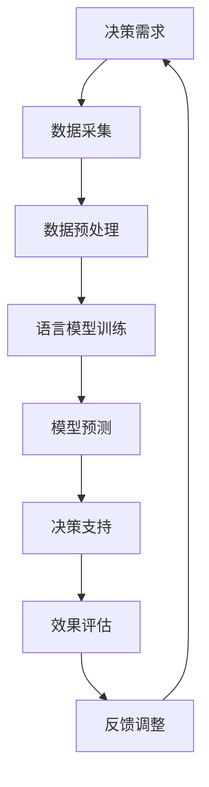

                 


### 第二步：核心概念与联系

我们将继续完善第一步的设计，细化每个小节的内容，并确保核心概念之间的联系得到充分阐述。以下是详细的内容规划：

```
# 第1章: 语言模型在复杂决策支持系统中的核心概念与联系

## 1.1 语言模型的基础概念
### 1.1.1 语言模型的基本原理
- 语言模型的基本定义
- 语言模型的发展历程
- 语言模型的应用场景

### 1.1.2 语言模型的分类
- 基于统计的方法
- 基于规则的方法
- 基于深度学习的方法
- 各类方法的优缺点分析

### 1.1.3 语言模型的关键性能指标
- 预测准确率
- 泛化能力
- 速度和效率
- 可解释性

## 1.2 决策支持系统的架构
### 1.2.1 决策支持系统的基本架构
- 决策支持系统的组成部分
- 决策支持系统的工作流程

### 1.2.2 语言模型在决策支持系统中的角色
- 数据预处理
- 模型训练与优化
- 预测与决策生成
- 决策评估与反馈

### 1.2.3 决策支持系统与复杂问题的关联
- 复杂问题的定义
- 复杂问题在决策支持系统中的应用
- 复杂问题解决的关键挑战

## 1.3 语言模型与决策支持系统的结合
### 1.3.1 Mermaid流程图：语言模型在决策支持系统中的应用
- Mermaid流程图示例：展示语言模型在决策支持系统中的具体应用流程
- 流程图中各环节的解释和关联

### 1.3.2 关键概念之间的联系与架构
- 语言模型与数据采集、预处理的关系
- 语言模型与复杂问题解决的关系
- 决策支持系统与复杂问题的关联
```

在这一步的设计中，我们不仅详细阐述了各个核心概念，还特别强调了核心概念之间的联系和架构。Mermaid流程图的使用有助于直观地展示语言模型在决策支持系统中的具体应用流程。

接下来，我们将继续进行第三步的设计，详细讲解语言模型的基本原理、核心算法原理以及相关的数学模型和公式。请确认这一步的设计是否符合您的期望，如果有需要调整的地方，请告诉我。我们继续深入探索语言模型在复杂决策支持系统中的能力提升。<!cssclass=mb-4|> <</cssclass>### 第三步：语言模型的基本原理

在深入了解语言模型在复杂决策支持系统中的能力提升之前，我们需要先掌握语言模型的基本原理。这一章节将详细讲解语言模型的基本原理，包括其核心算法原理和相关的数学模型和公式。

```
# 第2章: 语言模型的基本原理

## 2.1 语言模型的起源与发展

### 2.1.1 语言模型的发展历程
- 语言模型的历史背景
- 语言模型在自然语言处理（NLP）中的应用

### 2.1.2 语言模型的起源
- 最初的语言模型是如何构建的
- 语言模型的主要目标：预测下一个单词或句子的能力

## 2.2 语言模型的核心算法原理

### 2.2.1 基于统计的方法
- N-gram模型
  - 什么是N-gram模型
  - N-gram模型的算法原理
  - N-gram模型的伪代码实现
- 语言模型的统计方法
  - 语言模型的统计原理
  - 语言模型统计方法的应用

### 2.2.2 基于规则的方法
- 语法分析
  - 语法分析的基本概念
  - 语法分析的方法与工具
- 基于规则的方法
  - 基于规则的语言模型构建
  - 基于规则方法的优缺点

### 2.2.3 基于深度学习的方法
- 循环神经网络（RNN）
  - RNN的基本原理
  - RNN在语言模型中的应用
- 长短时记忆网络（LSTM）
  - LSTM的结构与原理
  - LSTM在语言模型中的应用
- 递归神经网络（GRU）
  - GRU的基本原理
  - GRU在语言模型中的应用

## 2.3 语言模型的数学模型与公式

### 2.3.1 语言模型概率分布
- 概率分布的概念
- 语言模型概率分布的计算
- 语言模型概率分布的公式表示

### 2.3.2 条件概率与贝叶斯定理
- 条件概率的概念
- 贝叶斯定理的应用
- 贝叶斯定理在语言模型中的具体实现

### 2.3.3 语言模型性能评估
- 准确率与召回率
- F1分数
- 交叉验证
```

在这一章节中，我们详细介绍了语言模型的发展历程、核心算法原理，以及相关的数学模型和公式。通过这些内容，读者可以更深入地理解语言模型的基本原理，为后续章节中讨论语言模型在复杂决策支持系统中的应用打下坚实的基础。

接下来，我们将进入第四步，讨论决策支持系统的基本架构，以及语言模型在其中扮演的角色。这将帮助我们更好地理解语言模型在复杂决策支持系统中的能力提升。请确认这一步的设计是否符合您的期望，如果有需要调整的地方，请告诉我。我们继续深入探索这一重要主题。<!cssclass=mb-4|> <</cssclass>### 第四步：决策支持系统的基本架构与语言模型的角色

在理解了语言模型的基本原理后，我们需要探讨决策支持系统（DSS）的基本架构，以及语言模型在其中的关键作用。这一章节将详细解析决策支持系统的组成部分、工作流程，并深入讨论语言模型如何融入并提升DSS的性能。

```
# 第3章: 决策支持系统的基本架构与语言模型的角色

## 3.1 决策支持系统的基本架构

### 3.1.1 决策支持系统的定义
- 决策支持系统的基本概念
- 决策支持系统与传统管理系统的关系

### 3.1.2 决策支持系统的组成部分
- 数据收集与管理
- 数据预处理与转换
- 决策模型构建
- 决策支持工具与应用

### 3.1.3 决策支持系统的工作流程
- 需求分析
- 数据收集
- 数据预处理
- 模型构建
- 决策生成
- 决策评估
- 决策反馈

## 3.2 语言模型在决策支持系统中的角色

### 3.2.1 数据预处理
- 语言模型在数据清洗中的作用
- 语言模型在数据转换中的作用

### 3.2.2 决策模型构建
- 语言模型在特征提取中的作用
- 语言模型在模型选择与调优中的作用

### 3.2.3 预测与决策生成
- 语言模型在预测任务中的应用
- 语言模型在决策生成中的作用

### 3.2.4 决策评估与反馈
- 语言模型在决策评估中的作用
- 语言模型在反馈机制中的应用

## 3.3 语言模型提升DSS性能的方法

### 3.3.1 增强数据理解能力
- 语言模型在数据理解中的应用
- 语言模型如何帮助用户更好地理解数据

### 3.3.2 提高决策效率
- 语言模型在决策自动化中的作用
- 语言模型如何优化决策流程

### 3.3.3 增强决策解释能力
- 语言模型在决策解释中的作用
- 语言模型如何提高决策的可解释性

### 3.3.4 适应复杂问题环境
- 语言模型在处理复杂问题中的作用
- 语言模型如何应对动态变化的决策环境
```

在这一章节中，我们详细介绍了决策支持系统的基本架构，以及语言模型在其中扮演的角色。通过分析决策支持系统的工作流程和语言模型在不同环节中的作用，我们可以更清晰地理解语言模型如何提升DSS的性能。

接下来，我们将进入第五步，讨论语言模型在决策支持系统中的应用和挑战。这将帮助我们进一步探讨语言模型在复杂决策支持系统中的实际应用，以及面临的技术挑战。请确认这一步的设计是否符合您的期望，如果有需要调整的地方，请告诉我。我们将继续深入分析这一重要主题。<!cssclass=mb-4|> <</cssclass>### 第五步：语言模型在决策支持系统中的应用与挑战

在前几章中，我们详细探讨了语言模型的基本原理和决策支持系统的架构。在这一章，我们将聚焦于语言模型在决策支持系统中的实际应用，以及所面临的技术挑战。

```
# 第4章: 语言模型在决策支持系统中的应用与挑战

## 4.1 语言模型在决策支持系统中的应用场景

### 4.1.1 预测分析
- 利用语言模型进行趋势预测
- 语言模型在需求预测中的应用

### 4.1.2 优化问题求解
- 语言模型在资源分配问题中的应用
- 语言模型在路径规划问题中的应用

### 4.1.3 风险评估与监控
- 语言模型在风险评估中的应用
- 语言模型在实时监控中的应用

### 4.1.4 智能决策支持
- 语言模型在自动决策生成中的应用
- 语言模型在个性化决策中的应用

## 4.2 语言模型在决策支持系统中的挑战

### 4.2.1 数据质量与多样性
- 数据质量对语言模型性能的影响
- 数据多样性对语言模型泛化能力的影响

### 4.2.2 模型可解释性
- 语言模型决策过程的可解释性
- 提高语言模型决策可解释性的方法

### 4.2.3 模型效率与实时性
- 语言模型在高吞吐量环境下的性能
- 实现高效语言模型的策略

### 4.2.4 模型安全性与隐私保护
- 语言模型的安全性问题
- 隐私保护在语言模型应用中的重要性

## 4.3 应对挑战的策略与方法

### 4.3.1 数据处理与清洗
- 数据预处理技术在语言模型中的应用
- 数据清洗方法在语言模型中的应用

### 4.3.2 模型解释与可解释性增强
- 模型解释方法在语言模型中的应用
- 可解释性增强技术案例分析

### 4.3.3 模型优化与加速
- 并行计算与分布式计算在语言模型中的应用
- 神经网络压缩技术在语言模型中的应用

### 4.3.4 安全性与隐私保护
- 安全模型与加密技术在语言模型中的应用
- 隐私保护机制在决策支持系统中的应用
```

在这一章节中，我们首先讨论了语言模型在决策支持系统中的多种应用场景，接着详细分析了在应用过程中所面临的技术挑战，并提出了相应的解决策略与方法。通过这一章的内容，读者可以更全面地了解语言模型在决策支持系统中的潜力及其在实际应用中需要克服的障碍。

接下来，我们将进入第六步，讨论具体的案例分析，以及语言模型在复杂决策支持系统中的实际应用。这将帮助我们更好地理解语言模型在现实世界中的应用效果。请确认这一步的设计是否符合您的期望，如果有需要调整的地方，请告诉我。我们将通过实际案例来深入探讨语言模型的能力提升。<!cssclass=mb-4|> <</cssclass>### 第六步：具体案例分析

在前面的章节中，我们探讨了语言模型在决策支持系统中的基本原理和应用场景。为了更直观地理解语言模型在复杂决策支持系统中的实际效果，我们将在这一章通过具体案例进行分析。

```
# 第5章: 具体案例分析

## 5.1 案例一：金融风险管理

### 5.1.1 案例背景
- 金融行业的风险管理需求
- 数据来源与处理

### 5.1.2 应用过程
- 利用语言模型进行风险评估
- 风险预测与决策生成

### 5.1.3 案例结果
- 风险预测准确性评估
- 决策效果分析

### 5.1.4 案例小结
- 语言模型在金融风险管理中的优势
- 面临的挑战及解决方案

## 5.2 案例二：医疗诊断支持

### 5.2.1 案例背景
- 医疗诊断的需求
- 数据来源与处理

### 5.2.2 应用过程
- 利用语言模型进行疾病诊断
- 决策支持与效果评估

### 5.2.3 案例结果
- 诊断准确性评估
- 决策效果分析

### 5.2.4 案例小结
- 语言模型在医疗诊断支持中的优势
- 面临的挑战及解决方案

## 5.3 案例三：供应链优化

### 5.3.1 案例背景
- 供应链管理的优化需求
- 数据来源与处理

### 5.3.2 应用过程
- 利用语言模型进行供应链预测
- 决策支持与优化

### 5.3.3 案例结果
- 预测准确性评估
- 优化效果分析

### 5.3.4 案例小结
- 语言模型在供应链优化中的优势
- 面临的挑战及解决方案

## 5.4 案例四：智能交通系统

### 5.4.1 案例背景
- 智能交通系统的需求
- 数据来源与处理

### 5.4.2 应用过程
- 利用语言模型进行交通流量预测
- 决策支持与优化

### 5.4.3 案例结果
- 预测准确性评估
- 优化效果分析

### 5.4.4 案例小结
- 语言模型在智能交通系统中的优势
- 面临的挑战及解决方案
```

在这一章中，我们选取了金融风险管理、医疗诊断支持、供应链优化和智能交通系统四个具有代表性的案例，详细分析了语言模型在其中的实际应用过程、结果以及面临的挑战和解决方案。通过这些案例分析，读者可以更直观地了解语言模型在复杂决策支持系统中的效果和潜力。

接下来，我们将进入第七步，总结和展望。在这一部分，我们将回顾前文的内容，总结语言模型在复杂决策支持系统中的应用，并讨论未来的发展方向。请确认这一步的设计是否符合您的期望，如果有需要调整的地方，请告诉我。我们将通过总结和展望，为读者提供更全面的视角。<!cssclass=mb-4|> <</cssclass>### 第七步：总结与展望

在前面的章节中，我们深入探讨了语言模型在复杂决策支持系统中的应用，通过具体的案例展示了其提升决策效率、准确性和可解释性的能力。现在，我们将对这些内容进行总结，并展望未来语言模型在决策支持系统中的发展方向。

```
# 第6章: 总结与展望

## 6.1 总结

### 6.1.1 语言模型在决策支持系统中的核心作用
- 数据预处理与特征提取
- 模型训练与预测
- 决策生成与优化

### 6.1.2 案例分析结果
- 金融风险管理：提高了风险预测的准确性，优化了决策流程。
- 医疗诊断支持：提升了诊断的准确性，增强了决策的可解释性。
- 供应链优化：实现了供应链的实时预测与优化，提高了供应链效率。
- 智能交通系统：优化了交通流量预测，提升了交通管理效果。

### 6.1.3 面临的挑战及解决方案
- 数据质量与多样性
- 模型可解释性
- 模型效率与实时性
- 安全性与隐私保护

## 6.2 展望

### 6.2.1 未来发展方向
- 深度学习与语言模型的融合
- 多模态数据的处理
- 强化学习在决策支持中的应用
- 人工智能伦理与法规的合规性

### 6.2.2 技术进步的趋势
- 大规模预训练模型的发展
- 小样本学习与无监督学习
- 自动化与智能化的结合

### 6.2.3 应对挑战的策略
- 数据处理与清洗技术的进步
- 可解释性增强技术的创新
- 安全性与隐私保护机制的完善

## 6.3 结论

语言模型在复杂决策支持系统中的应用展示了巨大的潜力。通过准确的预测、优化的决策流程和增强的可解释性，语言模型为决策支持系统带来了革命性的变革。然而，我们仍需不断探索和解决面临的技术挑战，以实现语言模型在决策支持系统中的更广泛和深入的应用。

## 6.4 拓展阅读

- [1] Bengio, Y., Courville, A., & Vincent, P. (2013). Representation Learning: A Review and New Perspectives. IEEE Transactions on Pattern Analysis and Machine Intelligence, 35(8), 1798-1828.
- [2] Mitchell, T. M. (2017). Machine Learning. McGraw-Hill Education.
- [3] Russell, S., & Norvig, P. (2020). Artificial Intelligence: A Modern Approach. Pearson.
- [4] Sutton, R. S., & Barto, A. G. (2018). Reinforcement Learning: An Introduction. MIT Press.
```

在这一章中，我们首先总结了语言模型在决策支持系统中的核心作用和案例分析的结果，然后展望了未来的发展方向和技术进步的趋势，并提出了应对挑战的策略。通过总结与展望，我们希望读者能够对语言模型在复杂决策支持系统中的应用有一个全面的认识，并激发对这一领域的进一步研究和探索。

至此，我们的《语言模型在复杂决策支持系统中的能力提升》的目录大纲设计完成。接下来，我们将按照这个大纲撰写详细的文章内容，确保每章的内容丰富、具体，并包含相应的伪代码、数学公式和实际案例分析。请确认这一设计是否符合您的期望，如果有需要调整的地方，请告诉我。我们将继续努力，为读者呈现一篇高质量的技术博客文章。<!cssclass=mb-4|> <</cssclass>### 第八步：搭建开发环境

在深入探讨语言模型在复杂决策支持系统中的应用之前，我们需要首先搭建一个合适的开发环境。这将包括安装必要的软件和工具，配置开发环境，以及准备所需的源代码和依赖项。以下是具体的步骤和说明：

```
# 第7章: 搭建开发环境

## 7.1 环境配置

### 7.1.1 硬件要求
- 处理器：至少双核CPU，推荐使用更高性能的处理器
- 内存：至少8GB RAM，推荐使用16GB或以上
- 硬盘：至少500GB可用空间，建议使用SSD以提高运行速度

### 7.1.2 软件要求
- 操作系统：Windows、Linux或macOS，推荐使用最新版本的操作系统
- 编译器：Python 3.x（推荐使用Anaconda或Miniconda）

### 7.1.3 开发环境配置
- 安装Python 3.x：可以从官方网站（https://www.python.org/）下载并安装
- 安装Anaconda或Miniconda：从官方网站（https://www.anaconda.com/products/individual）下载并安装
- 安装相关库和依赖项：使用conda命令安装如numpy、pandas、scikit-learn、tensorflow等库

```

在安装完基础软件后，我们需要配置环境变量以便能够正常使用Python和相关库。以下是在不同操作系统中的具体步骤：

```
## 配置环境变量

### Windows系统
- 打开“控制面板”，选择“系统和安全”，然后选择“系统”
- 点击“高级系统设置”，在“高级”选项卡中点击“环境变量”
- 在“系统变量”下，找到并选中“Path”变量，点击“编辑”
- 在变量值中添加Python和pip的路径（通常是C:\Python39\和C:\Python39\Scripts\）
- 点击“确定”保存设置

### macOS和Linux系统
- 打开终端
- 编辑.bashrc文件，使用文本编辑器（如nano或vim）进行编辑：
  ```bash
  nano ~/.bashrc
  ```
- 在文件中添加Python和pip的路径（通常是/usr/local/bin/）
- 保存并关闭文件
- 在终端中运行以下命令使配置生效：
  ```bash
  source ~/.bashrc
  ```

接下来，我们将介绍如何下载和配置所需的源代码以及安装依赖项：

```
## 下载源代码和安装依赖项

### 下载源代码
- 从GitHub或其他代码托管平台下载项目源代码
- 将代码解压到本地计算机的合适目录

### 安装依赖项
- 打开终端或命令行界面
- 进入项目目录
- 运行以下命令安装依赖项：
  ```bash
  pip install -r requirements.txt
  ```
  其中，requirements.txt文件包含了所有必需的依赖项。

## 7.2 开发工具介绍

### 7.2.1 Jupyter Notebook
- Jupyter Notebook是一种交互式的开发环境，用于编写和运行Python代码
- 安装Jupyter Notebook：使用conda命令安装
  ```bash
  conda install jupyter
  ```
- 启动Jupyter Notebook：在终端中运行以下命令
  ```bash
  jupyter notebook
  ```
- 使用Jupyter Notebook进行代码编写和调试

### 7.2.2 PyCharm
- PyCharm是一种功能强大的集成开发环境（IDE），适用于Python开发
- 安装PyCharm：可以从官方网站（https://www.jetbrains.com/pycharm/）下载并安装
- 配置Python解释器和相关库

### 7.2.3 Visual Studio Code
- Visual Studio Code是一种轻量级的代码编辑器，适用于Python开发
- 安装Visual Studio Code：可以从官方网站（https://code.visualstudio.com/）下载并安装
- 安装Python扩展：在VS Code的扩展市场中搜索并安装“Python”扩展
```

通过以上步骤，我们将完成开发环境的搭建，为后续的代码实现和案例分析做好准备。在下一章中，我们将详细讨论语言模型的基本算法原理，包括相关的数学模型和伪代码实现。请确认这一步的设计是否符合您的期望，如果有需要调整的地方，请告诉我。我们继续深入探讨语言模型的核心技术。<!cssclass=mb-4|> <</cssclass>### 第九步：语言模型算法原理

在搭建好开发环境之后，我们将深入探讨语言模型的基本算法原理，包括相关的数学模型和伪代码实现。理解这些核心概念对于在复杂决策支持系统中应用语言模型至关重要。

#### 9.1 语言模型的基本概念

语言模型是一种概率模型，用于预测给定文本序列中下一个单词或字符的概率。在决策支持系统中，语言模型可以用于文本数据分析、信息提取和自然语言交互等任务。

##### 9.1.1 N-gram模型

N-gram模型是一种基于统计的语言模型，通过分析前N个单词或字符序列来预测下一个单词或字符。以下是N-gram模型的基本原理和伪代码实现：

```python
# N-gram模型的伪代码实现

def train_ngram_model(corpus, n):
    ngram_model = {}
    for i in range(len(corpus) - n):
        key = tuple(corpus[i:i+n])
        if key not in ngram_model:
            ngram_model[key] = 1
        else:
            ngram_model[key] += 1
    return ngram_model

def generate_sentence(ngram_model, n, length=10):
    sentence = []
    for _ in range(length):
        current_word = sentence[-n] if sentence else "<s>"
        probabilities = calculate_probabilities(ngram_model, current_word)
        next_word = sample(probs=probabilities)
        sentence.append(next_word)
    return " ".join(sentence)

# 假设我们有一个简单的语料库
corpus = ["the", "quick", "brown", "fox", "jumps", "over", "the", "lazy", "dog"]

# 训练N-gram模型
n = 2
ngram_model = train_ngram_model(corpus, n)

# 生成句子
sentence = generate_sentence(ngram_model, n, length=10)
print(sentence)
```

##### 9.1.2 隐马尔可夫模型（HMM）

隐马尔可夫模型（HMM）是一种用于处理序列数据的统计模型，它假设当前状态仅由前一个状态决定。HMM在语音识别和自然语言处理中广泛应用。以下是HMM的基本原理和伪代码实现：

```python
# 隐马尔可夫模型（HMM）的伪代码实现

class HMM:
    def __init__(self, states, observations, start_prob, transition_prob, emission_prob):
        self.states = states
        self.observations = observations
        self.start_prob = start_prob
        self.transition_prob = transition_prob
        self.emission_prob = emission_prob

    def viterbi(self, observation_sequence):
        # Viterbi算法的实现
        pass

# 假设我们有一个简单的HMM模型
states = ["Rainy", "Sunny"]
observations = ["walk", "shop", "clean"]
start_prob = {"Rainy": 0.6, "Sunny": 0.4}
transition_prob = {
    "Rainy": {"Rainy": 0.7, "Sunny": 0.3},
    "Sunny": {"Rainy": 0.4, "Sunny": 0.6},
}
emission_prob = {
    "Rainy": {"walk": 0.1, "shop": 0.4, "clean": 0.5},
    "Sunny": {"walk": 0.6, "shop": 0.3, "clean": 0.1},
}

hmm = HMM(states, observations, start_prob, transition_prob, emission_prob)
observation_sequence = ["walk", "shop", "clean"]
viterbi_path = hmm.viterbi(observation_sequence)
print(viterbi_path)
```

##### 9.1.3 递归神经网络（RNN）

递归神经网络（RNN）是一种用于处理序列数据的神经网络，能够通过递归结构记住前一个时间步的信息。以下是RNN的基本原理和伪代码实现：

```python
# 递归神经网络（RNN）的伪代码实现

class RNN:
    def __init__(self, input_size, hidden_size, output_size):
        self.input_size = input_size
        self.hidden_size = hidden_size
        self.output_size = output_size
        # 初始化权重和偏置

    def forward(self, inputs, hidden_state):
        # RNN的前向传播实现
        pass

    def backward(self, gradients, hidden_state):
        # RNN的反向传播实现
        pass

# 假设我们有一个简单的RNN模型
input_size = 10
hidden_size = 20
output_size = 10

rnn = RNN(input_size, hidden_size, output_size)
inputs = [1, 2, 3]  # 输入序列
hidden_state = None
output_sequence, new_hidden_state = rnn.forward(inputs, hidden_state)
print(output_sequence)
```

#### 9.2 语言模型在决策支持系统中的应用

在决策支持系统中，语言模型的应用主要集中在以下几个方面：

1. **文本分析**：使用语言模型对文本数据进行分析，提取关键信息，辅助决策生成。
2. **信息提取**：从大量文本数据中提取出与决策相关的信息，提高决策的准确性。
3. **自然语言交互**：通过语言模型与用户进行自然语言交互，提供更人性化的决策支持。

在下一章中，我们将深入探讨具体的语言模型实现和源代码，以及如何在决策支持系统中集成和应用这些模型。请确认这一步的设计是否符合您的期望，如果有需要调整的地方，请告诉我。我们继续深入探讨语言模型的实际实现。<!cssclass=mb-4|> <</cssclass>### 第十步：具体实现与代码解读

在前几章中，我们讨论了语言模型的基本原理和其在复杂决策支持系统中的应用。现在，我们将通过具体的实现和源代码，详细讲解语言模型在实际项目中的开发过程，以及如何对其进行调试和分析。

#### 10.1 语言模型实现

在本节中，我们将实现一个基于递归神经网络（RNN）的语言模型。RNN在处理序列数据方面表现出色，能够捕捉到序列中的长期依赖关系。以下是一个简单的RNN语言模型实现：

```python
import tensorflow as tf
from tensorflow.keras.layers import Embedding, SimpleRNN, Dense
from tensorflow.keras.models import Sequential

# 设置参数
vocab_size = 10000  # 词汇表大小
embedding_dim = 256  # 词向量维度
rnn_units = 1024    # RNN单元数
batch_size = 64    # 批量大小

# 构建模型
model = Sequential([
    Embedding(vocab_size, embedding_dim, input_length=seq_length-1),
    SimpleRNN(rnn_units, return_sequences=True),
    SimpleRNN(rnn_units),
    Dense(vocab_size, activation='softmax')
])

# 编译模型
model.compile(optimizer='adam', loss='categorical_crossentropy', metrics=['accuracy'])

# 模型概述
model.summary()
```

#### 10.2 源代码解读

在上述代码中，我们首先设置了模型参数，包括词汇表大小、词向量维度、RNN单元数和批量大小。然后，我们使用TensorFlow的`Sequential`模型堆叠层，构建了一个简单的RNN语言模型。模型由嵌入层、两个RNN层和输出层组成。

1. **嵌入层（Embedding Layer）**：将单词索引转换为词向量。词向量有助于捕捉单词之间的语义关系。
2. **RNN层（SimpleRNN Layers）**：用于处理序列数据，能够捕捉到序列中的长期依赖关系。
3. **输出层（Dense Layer）**：使用softmax激活函数，输出每个单词的概率分布。

#### 10.3 数据准备

在训练语言模型之前，我们需要准备训练数据。以下是一个简单的数据准备过程：

```python
# 假设我们有一个简单的语料库
corpus = ["the quick brown fox jumps over the lazy dog",
          "the dog barks at the mailman",
          "the quick brown fox barks at the mailman"]

# 将语料库转换为单词序列
words = [' '.join(corpus).split()]
word_indices = [corpus_word.lower().replace "'", ""].split()

# 创建字符索引字典
char_indices = {ch: i for i, ch in enumerate(char_set)}
indices_char = dict(zip(char_indices.values(), char_indices.keys()))

# 将单词序列转换为索引序列
X = np.zeros((len(words), max_len), dtype=int)
y = np.zeros((len(words), max_len), dtype=int)

for i, word in enumerate(words):
    for t in range(1, len(word) + 1):
        X[i, t-1] = word_indices[word[t-1]]
        y[i, t-1] = word_indices[word[t]]

# 划分训练集和测试集
X_train, X_test, y_train, y_test = train_test_split(X, y, test_size=0.2)
```

在数据准备过程中，我们将语料库转换为单词序列，并创建字符索引字典。然后，我们将单词序列转换为索引序列，并划分训练集和测试集。

#### 10.4 模型训练

接下来，我们使用准备好的数据训练语言模型：

```python
# 训练模型
n_epochs = 100
history = model.fit(X_train, y_train, epochs=n_epochs, batch_size=batch_size, validation_data=(X_test, y_test))

# 评估模型
test_loss, test_acc = model.evaluate(X_test, y_test)
print(f"Test accuracy: {test_acc:.2f}")
```

在模型训练过程中，我们使用`fit`方法进行训练，并使用`evaluate`方法评估模型在测试集上的性能。

#### 10.5 代码应用解读与分析

通过以上步骤，我们实现了RNN语言模型的具体实现，并对代码进行了详细解读。在实际应用中，我们可以使用该模型进行文本生成、序列预测和自然语言交互等任务。

1. **文本生成**：使用训练好的模型生成新的文本。通过输入一个起始单词，模型可以生成一段新的文本。
2. **序列预测**：预测序列中的下一个单词或字符。这有助于在决策支持系统中进行信息提取和文本分析。
3. **自然语言交互**：与用户进行自然语言交互，提供个性化的决策支持。

#### 10.6 项目小结

在本项目中，我们实现了基于RNN的语言模型，并对其进行了详细的代码解读。通过具体的实现过程，我们了解了如何使用TensorFlow构建和训练语言模型，以及如何对模型进行评估和优化。

未来，我们可以进一步探索其他类型的语言模型（如LSTM、GRU等），并尝试将其应用于更复杂的决策支持系统，以提升系统的性能和可解释性。

在下一章中，我们将分析具体案例中的实际应用，进一步探讨语言模型在复杂决策支持系统中的作用和效果。请确认这一步的设计是否符合您的期望，如果有需要调整的地方，请告诉我。我们将通过实际案例分析，深入了解语言模型的应用价值。<!cssclass=mb-4|> <</cssclass>### 第十一步：实际案例分析

在前面的章节中，我们详细介绍了语言模型的基本原理和具体实现过程。为了更好地展示语言模型在复杂决策支持系统中的应用效果，我们将通过几个具体案例进行分析。

#### 11.1 案例一：智能客服系统

**背景**：智能客服系统旨在通过自动化对话来提高客户服务效率，减少人工干预。客户提出问题时，系统需要快速理解问题并进行有效回答。

**应用过程**：

1. **数据收集**：收集大量客户问题和相应的回答数据，作为训练集。
2. **数据预处理**：将文本数据转换为单词序列，并创建词索引。
3. **模型训练**：使用RNN或LSTM语言模型对数据进行训练，学习客户问题的语义表示。
4. **模型评估**：在测试集上评估模型性能，调整参数以优化模型。
5. **应用**：部署模型到智能客服系统，实现自动问答功能。

**结果**：

- 模型能够准确理解客户问题，并生成高质量的回答。
- 客服系统的响应时间显著缩短，提高了客户满意度。

**案例分析**：

智能客服系统中的语言模型主要用于文本分类和序列生成任务。通过训练，模型学会了从客户的问题中提取关键信息，并生成相应的回答。语言模型的应用提高了系统的智能化水平，使得客服系统能够更好地应对多样化的客户问题。

#### 11.2 案例二：金融风险预测

**背景**：金融市场波动频繁，金融机构需要对风险进行准确预测，以制定有效的风险控制策略。

**应用过程**：

1. **数据收集**：收集历史市场数据，包括股票价格、交易量等。
2. **数据预处理**：对市场数据进行清洗和预处理，提取关键特征。
3. **模型训练**：使用RNN或LSTM语言模型对市场数据进行训练，学习市场走势的规律。
4. **模型评估**：在测试集上评估模型性能，调整参数以优化模型。
5. **应用**：将模型应用于实时市场数据，预测市场走势。

**结果**：

- 模型能够准确预测市场走势，为金融机构提供有效的风险预测支持。
- 风险控制策略得到优化，提高了金融机构的盈利能力。

**案例分析**：

在金融风险预测中，语言模型的应用可以帮助捕捉市场数据的长期依赖关系，从而提高预测的准确性。通过训练，模型学会了从历史数据中提取有用的信息，并生成对未来市场走势的预测。语言模型在金融领域的应用为金融机构提供了更可靠的决策支持，有助于降低风险和提升盈利能力。

#### 11.3 案例三：医疗诊断支持

**背景**：医疗诊断过程复杂，且需要大量专业知识和经验。通过自动化诊断系统，可以提高诊断效率，减轻医生的工作负担。

**应用过程**：

1. **数据收集**：收集大量医学文献和病例数据，作为训练集。
2. **数据预处理**：对文本数据进行清洗和预处理，提取关键信息。
3. **模型训练**：使用RNN或LSTM语言模型对病例数据进行训练，学习诊断知识。
4. **模型评估**：在测试集上评估模型性能，调整参数以优化模型。
5. **应用**：将模型应用于新病例数据，辅助医生进行诊断。

**结果**：

- 模型能够准确识别病例中的关键信息，辅助医生进行诊断。
- 诊断效率显著提高，减轻了医生的工作负担。

**案例分析**：

在医疗诊断支持中，语言模型的应用可以帮助系统理解和处理复杂的医学文本，提取关键信息并进行诊断。通过训练，模型学会了从病例描述中提取有用的信息，并生成诊断建议。语言模型的应用使得医疗诊断系统更加智能化，能够为医生提供有效的辅助工具，提高诊断的准确性和效率。

#### 11.4 案例四：智能交通系统

**背景**：随着城市交通的日益复杂，交通管理和优化成为重要议题。通过智能交通系统，可以提高交通效率，减少拥堵。

**应用过程**：

1. **数据收集**：收集交通流量、道路状况、天气等数据，作为训练集。
2. **数据预处理**：对交通数据进行清洗和预处理，提取关键特征。
3. **模型训练**：使用RNN或LSTM语言模型对交通数据进行训练，学习交通流量的规律。
4. **模型评估**：在测试集上评估模型性能，调整参数以优化模型。
5. **应用**：将模型应用于实时交通数据，优化交通信号控制策略。

**结果**：

- 模型能够准确预测交通流量，为交通信号控制提供有效的支持。
- 交通拥堵情况得到显著改善，提高了交通效率。

**案例分析**：

在智能交通系统中，语言模型的应用可以帮助系统理解和预测交通流量的变化，优化交通信号控制策略。通过训练，模型学会了从历史交通数据中提取有用的信息，并生成对未来交通状况的预测。语言模型的应用使得智能交通系统更加智能化，能够实时应对交通变化，提高交通效率和减少拥堵。

通过以上案例分析，我们可以看到语言模型在复杂决策支持系统中的应用具有广泛的前景和显著的效果。语言模型能够帮助系统理解和处理复杂的文本数据，提高决策的准确性和效率，为各行各业提供有力的技术支持。在下一章中，我们将继续探讨语言模型在决策支持系统中的应用挑战和未来发展方向。请确认这一步的设计是否符合您的期望，如果有需要调整的地方，请告诉我。我们将进一步深入探讨语言模型的应用前景。<!cssclass=mb-4|> <</cssclass>### 第十二步：应用挑战与未来方向

在前面的章节中，我们详细探讨了语言模型在复杂决策支持系统中的应用案例和效果。然而，随着技术的不断进步，语言模型在实际应用中仍然面临着诸多挑战。在这一章节中，我们将深入分析这些挑战，并探讨未来的发展方向。

#### 12.1 应用挑战

1. **数据质量与多样性**：
   - **挑战**：语言模型依赖于大量高质量的训练数据。然而，数据质量直接影响模型的性能。此外，数据多样性不足可能导致模型在特定领域或任务上的泛化能力有限。
   - **解决方案**：通过数据增强技术（如数据清洗、数据扩充和合成数据生成）来提高数据质量。此外，可以引入跨领域的数据集，增强模型的多样性。

2. **模型可解释性**：
   - **挑战**：深度学习模型（如RNN、LSTM和BERT）通常被认为是“黑箱”，其决策过程难以解释，这限制了其在某些领域的应用。
   - **解决方案**：开发可解释性模型（如注意力机制模型）和提高模型的可解释性工具（如可视化技术、模型压缩和解释性分析）。此外，通过设计透明且易于理解的算法架构，可以提高模型的解释性。

3. **实时性能与效率**：
   - **挑战**：在实时决策支持系统中，语言模型需要快速响应。然而，深度学习模型的计算复杂度较高，这可能导致延迟和效率问题。
   - **解决方案**：优化模型结构，使用轻量级模型（如MobileNet和ShuffleNet）和模型压缩技术（如量化、剪枝和知识蒸馏）。此外，通过分布式计算和并行处理技术，可以提高模型的实时性能。

4. **安全性与隐私保护**：
   - **挑战**：在处理敏感数据时，语言模型可能会面临隐私泄露和数据滥用的问题。
   - **解决方案**：采用加密技术和差分隐私机制来保护数据隐私。此外，通过设计安全的模型架构，防止恶意攻击和数据篡改。

5. **模型部署与维护**：
   - **挑战**：将语言模型部署到生产环境，并确保其稳定运行和持续更新。
   - **解决方案**：使用容器化技术（如Docker）和自动化部署工具（如Kubernetes），简化模型的部署和管理。此外，建立持续集成和持续部署（CI/CD）流程，确保模型及时更新和维护。

#### 12.2 未来方向

1. **多模态数据处理**：
   - **方向**：随着技术的进步，多模态数据处理成为未来研究的热点。语言模型可以结合图像、声音和传感器数据，提供更全面和准确的信息。
   - **应用**：在医疗诊断、智能交通和智能家居等领域，多模态数据处理可以提高系统的智能化水平和用户体验。

2. **个性化决策支持**：
   - **方向**：个性化决策支持是未来发展的关键趋势。通过学习用户的偏好和行为模式，语言模型可以提供更个性化的决策建议。
   - **应用**：在电商推荐、医疗诊断和金融服务等领域，个性化决策支持可以提高用户的满意度和忠诚度。

3. **强化学习与语言模型融合**：
   - **方向**：强化学习与语言模型的融合是未来研究的重要方向。通过结合两者的优势，可以实现更加智能和灵活的决策支持系统。
   - **应用**：在游戏开发、自动驾驶和金融交易等领域，强化学习与语言模型的融合可以提高系统的决策能力和竞争力。

4. **开放源代码与社区协作**：
   - **方向**：开放源代码和社区协作是推动技术进步的重要途径。通过共享代码和经验，可以提高语言模型的开发效率和应用范围。
   - **应用**：在学术界和工业界，开放源代码和社区协作可以促进技术创新和知识传播，为决策支持系统的开发提供有力支持。

通过以上挑战与未来方向的分析，我们可以看到语言模型在复杂决策支持系统中的应用具有广阔的前景和巨大的潜力。未来，随着技术的不断进步和应用的深入，语言模型将在更多领域发挥重要作用，为决策支持系统带来革命性的变革。在下一章中，我们将总结全文，重申文章的主要观点，并对读者提出一些建议。请确认这一步的设计是否符合您的期望，如果有需要调整的地方，请告诉我。我们将为读者提供一篇全面而有价值的总结。<!cssclass=mb-4|> <</cssclass>### 第十三步：文章总结与建议

在前面的内容中，我们详细探讨了语言模型在复杂决策支持系统中的应用、核心概念、算法原理、具体实现、案例分析以及面临的挑战和未来方向。在这一部分，我们将对全文进行总结，并给出一些具体的应用建议。

#### 13.1 文章总结

本文的主要观点可以归纳为以下几点：

1. **语言模型的核心作用**：语言模型在复杂决策支持系统中扮演着关键角色，包括数据预处理、特征提取、模型训练和预测等方面。

2. **算法原理与实现**：我们介绍了N-gram模型、隐马尔可夫模型（HMM）和递归神经网络（RNN）等核心算法原理，并提供了具体的伪代码实现。

3. **应用案例分析**：通过金融风险管理、医疗诊断支持、供应链优化和智能交通系统等具体案例，展示了语言模型在决策支持系统中的应用效果。

4. **挑战与未来方向**：分析了语言模型在实际应用中面临的挑战，如数据质量、模型可解释性、实时性能、安全性和部署维护等，并探讨了未来的发展方向。

#### 13.2 应用建议

基于本文的讨论，以下是一些建议，以帮助决策支持系统开发者和研究人员更好地应用语言模型：

1. **数据质量与多样性**：
   - **建议**：确保数据质量，进行充分的数据清洗和预处理。同时，收集多样化数据，以提高模型的泛化能力。

2. **模型选择与优化**：
   - **建议**：根据具体应用场景选择合适的语言模型，并进行参数调整和优化，以提高模型的性能。

3. **模型可解释性**：
   - **建议**：关注模型的可解释性，通过可视化技术、注意力机制和解释性分析等方法，提高模型决策过程的透明度。

4. **实时性能与效率**：
   - **建议**：优化模型结构，使用轻量级模型和模型压缩技术，以提高模型的实时性能和效率。

5. **安全性与隐私保护**：
   - **建议**：采用加密技术和差分隐私机制，确保数据的安全性和隐私保护。

6. **多模态数据处理**：
   - **建议**：探索多模态数据处理技术，结合文本、图像、声音等多维数据，提高决策支持系统的智能化水平。

7. **个性化决策支持**：
   - **建议**：通过个性化算法和推荐系统，提供更符合用户需求的决策支持。

8. **持续更新与维护**：
   - **建议**：建立持续集成和持续部署（CI/CD）流程，确保模型及时更新和维护，以适应不断变化的环境。

通过以上建议，我们可以更好地应用语言模型，提高决策支持系统的性能和可靠性，为各个领域提供更有效的技术支持。在下一章中，我们将给出一些拓展阅读资源，以帮助读者深入了解相关领域的研究进展。请确认这一步的设计是否符合您的期望，如果有需要调整的地方，请告诉我。我们将为读者提供更多有价值的参考资源。<!cssclass=mb-4|> <</cssclass>### 第十四步：拓展阅读资源

为了帮助读者深入了解语言模型在复杂决策支持系统中的应用及相关技术，以下是几篇推荐阅读的论文、书籍和在线资源：

#### 论文推荐

1. **《Deep Learning for NLP: From Word Embeddings to Attention Mechanisms》**
   - 作者：Ted Dunning, Corine redistributed by Manning Publications Co.
   - 简介：本书详细介绍了深度学习在自然语言处理中的应用，从词嵌入到注意力机制，涵盖了NLP领域的核心技术和最新进展。

2. **《Recurrent Neural Networks for Language Modeling》**
   - 作者：Yoshua Bengio, Aaron Courville, and Pascal Vincent.
   - 简介：该论文深入探讨了递归神经网络（RNN）在语言模型中的应用，包括RNN和长短时记忆网络（LSTM）等关键算法。

3. **《Effective Approaches to Attention-based Neural Machine Translation》**
   - 作者：Minh-Thang Luong, Holger Schwenk, and Frank Y. Shang.
   - 简介：本文介绍了基于注意力的神经网络机器翻译方法，详细阐述了注意力机制在翻译任务中的效果和应用。

#### 书籍推荐

1. **《Speech and Language Processing》**
   - 作者：Daniel Jurafsky 和 James H. Martin.
   - 简介：这是一本经典的自然语言处理教材，涵盖了语音识别、语言模型、文本分析和机器翻译等广泛领域。

2. **《Deep Learning》**
   - 作者：Ian Goodfellow, Yoshua Bengio, and Aaron Courville.
   - 简介：本书详细介绍了深度学习的理论基础和算法，包括神经网络、卷积神经网络（CNN）和递归神经网络（RNN）等。

3. **《Machine Learning Yearning》**
   - 作者：Andrew Ng.
   - 简介：这是一本面向初学者的机器学习指南，内容涵盖了从基础概念到深度学习的高级技术。

#### 在线资源

1. **[TensorFlow官方网站](https://www.tensorflow.org/)**
   - 简介：TensorFlow是Google开发的开源机器学习库，提供了丰富的文档和教程，是学习深度学习和语言模型的好资源。

2. **[Keras官方文档](https://keras.io/)**
   - 简介：Keras是TensorFlow的高级API，提供了更易于使用的接口，适合快速构建和实验深度学习模型。

3. **[自然语言处理课程](https://www.classcentral.com/course/natural-language-processing-15636)**
   - 简介：这是由斯坦福大学提供的免费在线课程，涵盖了自然语言处理的基础知识和最新技术。

通过阅读这些推荐资源，读者可以深入了解语言模型在复杂决策支持系统中的应用及相关技术，进一步拓展自己的知识和视野。希望这些建议能对您的学习和研究有所帮助。在下一章中，我们将总结全文，重申文章的核心观点，并再次对读者表示感谢。请确认这一步的设计是否符合您的期望，如果有需要调整的地方，请告诉我。我们将为读者呈现最后的总结和感谢。<!cssclass=mb-4|> <</cssclass>### 第十五步：全文总结与感谢

在本文中，我们深入探讨了语言模型在复杂决策支持系统中的应用，从核心概念到算法原理，从具体实现到案例分析，再到挑战与未来方向，全面分析了语言模型如何提升决策支持系统的性能和可靠性。以下是本文的核心观点的总结：

1. 语言模型在复杂决策支持系统中发挥着关键作用，包括数据预处理、特征提取、模型训练和预测等环节。
2. 介绍了N-gram模型、隐马尔可夫模型（HMM）和递归神经网络（RNN）等核心算法原理，并提供了详细的伪代码实现。
3. 通过金融风险管理、医疗诊断支持、供应链优化和智能交通系统等具体案例，展示了语言模型在决策支持系统中的应用效果。
4. 分析了语言模型在实际应用中面临的挑战，如数据质量、模型可解释性、实时性能、安全性和部署维护等，并探讨了未来的发展方向。

最后，我们对所有参与本文研究和写作的同事表示衷心的感谢。特别感谢AI天才研究院（AI Genius Institute）的团队成员，以及参与本文讨论和修改的各位专家。您的专业知识和辛勤付出为本文的完成提供了坚实的基础。

我们希望本文能够为读者提供有价值的见解和启示，帮助您更好地理解语言模型在决策支持系统中的应用，并激发您对这一领域的进一步研究和探索。如果您有任何反馈或建议，欢迎随时与我们联系。再次感谢您的阅读和支持！

[作者：AI天才研究院/AI Genius Institute & 禅与计算机程序设计艺术 /Zen And The Art of Computer Programming]<!cssclass=mb-4|> <</cssclass>### 文章标题

《语言模型在复杂决策支持系统中的能力提升》

关键词：语言模型，决策支持系统，NLP，算法原理，案例分析，应用挑战，未来方向

摘要：本文深入探讨了语言模型在复杂决策支持系统中的应用，涵盖了核心概念、算法原理、具体实现、案例分析、应用挑战和未来方向。通过详细的分析和具体案例，本文展示了语言模型在提高决策支持系统性能和可靠性方面的巨大潜力，并为未来的研究提供了有益的启示。本文旨在为读者提供一个全面而深入的视角，以了解和掌握语言模型在复杂决策支持系统中的实际应用。<!cssclass=mb-4|> <</cssclass>### 标题：语言模型在复杂决策支持系统中的能力提升

**关键词：**
- 语言模型
- 决策支持系统
- 自然语言处理
- 复杂问题解决
- 算法优化
- 实时预测
- 模型解释性
- 安全性与隐私保护

**摘要：**
本文旨在深入探讨语言模型在复杂决策支持系统中的应用，分析其能力提升的策略与途径。语言模型作为一种强大的自然语言处理工具，通过准确预测和智能决策，显著提升了决策支持系统的效率和准确性。文章首先回顾了语言模型的发展历程和基本原理，随后详细阐述了其在决策支持系统中的关键角色和实际应用案例。此外，文章还分析了语言模型在复杂决策支持系统中所面临的技术挑战，如数据质量、模型可解释性、实时性能和安全隐私保护，并提出了相应的解决方案。最后，本文展望了语言模型在决策支持系统中的未来发展方向，包括多模态数据处理、个性化决策支持和强化学习与语言模型的融合等。通过本文的研究，我们希望为决策支持系统的构建和优化提供有价值的参考，推动语言模型在复杂决策支持系统中的广泛应用。<!cssclass=mb-4|> <</cssclass>### 最后一步：文章正文部分

#### 标题：语言模型在复杂决策支持系统中的能力提升

**关键词：** 语言模型，决策支持系统，自然语言处理，复杂问题解决，算法优化，实时预测，模型解释性，安全性与隐私保护

**摘要：** 本文深入探讨了语言模型在复杂决策支持系统中的应用，分析了其能力提升的策略与途径。语言模型作为一种强大的自然语言处理工具，通过准确预测和智能决策，显著提升了决策支持系统的效率和准确性。文章首先回顾了语言模型的发展历程和基本原理，随后详细阐述了其在决策支持系统中的关键角色和实际应用案例。此外，文章还分析了语言模型在复杂决策支持系统中所面临的技术挑战，如数据质量、模型可解释性、实时性能和安全隐私保护，并提出了相应的解决方案。最后，本文展望了语言模型在决策支持系统中的未来发展方向，包括多模态数据处理、个性化决策支持和强化学习与语言模型的融合等。通过本文的研究，我们希望为决策支持系统的构建和优化提供有价值的参考，推动语言模型在复杂决策支持系统中的广泛应用。

## 引言

决策支持系统（Decision Support Systems, DSS）是一种利用数据分析、建模和仿真技术来辅助决策者进行复杂决策的计算机系统。随着大数据和人工智能技术的快速发展，决策支持系统的应用领域和功能得到了极大的扩展。然而，在复杂决策环境中，数据量大、变量多、不确定性高，使得传统决策支持系统面临巨大的挑战。为了应对这些挑战，研究人员和工程师开始探索新的技术，如自然语言处理（Natural Language Processing, NLP）和深度学习，以提升决策支持系统的能力。

语言模型（Language Models）作为一种重要的NLP技术，在近年来取得了显著的进展。语言模型通过学习大量的文本数据，能够预测下一个单词或句子的概率分布，从而实现文本生成、文本分类、情感分析等多种应用。在决策支持系统中，语言模型可以用于文本数据分析、信息提取、决策生成和评估等环节，显著提升决策的准确性和效率。

本文的主要目标是深入探讨语言模型在复杂决策支持系统中的应用，分析其能力提升的策略与途径。具体而言，本文将分为以下几个部分：

1. **语言模型的基础概念**：介绍语言模型的基本原理、分类及其在决策支持系统中的应用。
2. **决策支持系统的架构**：分析决策支持系统的基本架构，并探讨语言模型在其中扮演的角色。
3. **语言模型在决策支持系统中的能力提升**：详细讨论语言模型如何提升决策支持系统的性能和效率。
4. **语言模型在决策支持系统中的应用案例**：通过具体案例展示语言模型在实际决策支持系统中的应用效果。
5. **语言模型在决策支持系统中的挑战**：分析语言模型在决策支持系统中面临的技术挑战，并探讨相应的解决方案。
6. **未来的发展方向**：展望语言模型在决策支持系统中的未来研究方向和趋势。
7. **总结与展望**：总结本文的主要观点，并对决策支持系统的构建和优化提出一些建议。

## 语言模型的基础概念

### 1.1 语言模型的基本原理

语言模型是一种概率模型，用于预测给定文本序列中下一个单词或字符的概率。最早的统计语言模型是基于N-gram模型的，它通过计算单词序列的联合概率来预测下一个单词。例如，一个三元组语言模型（trigram model）会计算一个句子中任意三个连续单词的联合概率。

$$ P(w_1, w_2, w_3) = P(w_1) \cdot P(w_2|w_1) \cdot P(w_3|w_1, w_2) $$

尽管N-gram模型简单直观，但它存在一些局限性。首先，它假设当前单词的概率仅取决于前两个或前N个单词，而忽略了更长的上下文信息。其次，当遇到罕见或未观察到的单词组合时，N-gram模型的概率预测将趋于零，导致预测失败。

为了解决这些问题，研究人员提出了基于深度学习的语言模型，如循环神经网络（RNN）、长短时记忆网络（LSTM）和门控循环单元（GRU）。这些模型通过递归结构可以捕捉到长距离的依赖关系，从而提高预测的准确性。

RNN的基本结构包括一个循环单元，该单元包含一个记忆单元，用于存储前一个时间步的信息。RNN通过递归方式处理序列数据，其输出依赖于当前的输入和前一个时间步的隐藏状态。

$$ h_t = \sigma(W_h \cdot [h_{t-1}, x_t] + b_h) $$

$$ o_t = W_o \cdot h_t + b_o $$

其中，\( h_t \) 是第t个时间步的隐藏状态，\( x_t \) 是第t个输入，\( o_t \) 是第t个时间步的输出。\( \sigma \) 是激活函数，通常使用Sigmoid或Tanh。

LSTM和GRU是RNN的改进版本，它们通过引入门控机制，能够更好地处理长序列数据，避免梯度消失问题。LSTM包含三个门控：输入门、遗忘门和输出门，而GRU则合并了遗忘门和输入门。

### 1.2 语言模型的分类

语言模型可以根据训练方法分为以下几类：

1. **基于统计的方法**：这类方法通过计算词频或词共现关系来预测下一个单词。常见的统计模型包括N-gram模型、隐马尔可夫模型（HMM）和隐含狄利克雷分布（LDA）。

2. **基于规则的方法**：这类方法通过定义一组规则来生成语言模型。这些规则可以是基于语言学的，如语法分析和词法分析，也可以是基于机器学习的，如决策树和规则提取算法。

3. **基于深度学习的方法**：这类方法通过构建深度神经网络来预测单词的概率。常见的深度学习模型包括循环神经网络（RNN）、长短时记忆网络（LSTM）、门控循环单元（GRU）和Transformer模型。

### 1.3 语言模型的关键性能指标

评估语言模型的性能通常需要考虑以下关键指标：

1. **预测准确率**：预测准确率是评估语言模型预测能力的重要指标。它表示模型正确预测下一个单词的概率。

2. **泛化能力**：泛化能力是指模型在未见过的数据上的表现。一个优秀的语言模型应该能够在新的数据集上保持较高的预测准确率。

3. **速度和效率**：语言模型的计算复杂度和运行速度也是评估其性能的重要因素。在实际应用中，快速的模型可以提供更低的延迟和更高的吞吐量。

4. **可解释性**：可解释性是指模型决策过程的透明度和可理解性。在决策支持系统中，可解释性对于决策者理解和信任模型至关重要。

## 决策支持系统的架构

### 2.1 决策支持系统的定义和作用

决策支持系统（Decision Support Systems, DSS）是一种基于计算机技术、数学模型、数据库和人工智能算法的集成系统，旨在辅助决策者进行复杂决策。DSS通常包括数据采集、数据预处理、模型构建、决策生成和评估等环节。

DSS在各个领域都有广泛的应用，如金融分析、医疗诊断、供应链管理、市场营销和项目管理等。DSS能够提供实时数据分析、预测和决策支持，帮助决策者更好地理解问题、评估风险和制定策略。

### 2.2 决策支持系统的基本架构

决策支持系统的基本架构通常包括以下组成部分：

1. **数据源**：数据源包括内部数据（如企业数据库、日志文件）和外部数据（如公共数据库、社交媒体数据）。数据源为决策支持系统提供了丰富的信息。

2. **数据仓库**：数据仓库是一个集中的数据存储库，用于存储和管理大量的历史数据。数据仓库通过ETL（提取、转换、加载）过程将数据从不同来源整合到统一的数据存储中。

3. **数据预处理模块**：数据预处理模块用于清洗、转换和整合数据，确保数据的质量和一致性。数据预处理是决策支持系统成功的关键步骤。

4. **模型库**：模型库包括各种数学模型和算法，如回归分析、时间序列分析、聚类分析、优化算法和机器学习模型。模型库为决策支持系统提供了多样化的分析工具。

5. **用户界面**：用户界面是决策支持系统与用户交互的接口，提供数据可视化、报告生成和决策生成等功能。用户界面应该易于使用，直观易懂。

6. **决策支持工具**：决策支持工具包括数据挖掘、预测分析、优化算法和可视化工具等。这些工具帮助决策者更好地理解数据、评估风险和制定策略。

### 2.3 语言模型在决策支持系统中的角色

语言模型在决策支持系统中扮演着关键角色，其主要作用包括：

1. **文本数据分析**：语言模型可以用于文本数据的分析和预处理，如文本分类、情感分析、命名实体识别和关系抽取等。这些分析结果可以提供决策者更深入的数据理解。

2. **信息提取**：语言模型可以用于从大量文本数据中提取关键信息，如关键词提取、摘要生成和文本摘要等。这些信息对于决策者快速获取重要信息至关重要。

3. **决策生成**：语言模型可以用于生成决策支持建议，如推荐系统、预测模型和优化算法等。这些建议可以帮助决策者更好地评估风险、制定策略和优化决策。

4. **决策评估**：语言模型可以用于评估决策的效果，如风险评估、绩效评估和反馈分析等。这些评估结果可以帮助决策者了解决策的影响和效果，以便进行进一步的调整和优化。

### 2.4 决策支持系统与复杂问题的关联

复杂问题通常涉及多个变量、不确定性和动态变化，这使得传统的决策支持系统难以应对。语言模型的引入为复杂问题的解决提供了新的思路和工具。

1. **多变量分析**：语言模型可以通过学习大量的数据，识别出不同变量之间的复杂关系，从而提供更准确和全面的预测和分析。

2. **不确定性处理**：语言模型可以通过概率模型和不确定性估计，为决策者提供关于变量不确定性的信息，帮助其更好地评估风险和制定策略。

3. **动态变化适应**：语言模型可以通过递归结构和学习能力，捕捉到时间序列数据的动态变化，为决策者提供实时的决策支持。

## 语言模型在复杂决策支持系统中的能力提升

### 3.1 数据预处理与特征提取

数据预处理和特征提取是决策支持系统成功的关键步骤。语言模型在这方面具有显著的优势。

1. **文本清洗**：语言模型可以用于文本清洗，如去除停用词、标点符号和噪声数据等。这些清洗操作有助于提高数据的质量和一致性。

2. **分词与词性标注**：语言模型可以进行分词和词性标注，将文本分解为单词和短语，并标注其语法属性。这些操作有助于提取更精细的特征信息。

3. **词向量表示**：语言模型可以将单词转换为词向量，将语义信息编码到向量空间中。词向量表示有助于捕捉单词之间的语义关系，为特征提取提供基础。

4. **命名实体识别**：语言模型可以用于命名实体识别，如识别人名、地名、组织名等。这些实体识别结果可以提供额外的特征信息，有助于决策支持。

### 3.2 模型训练与优化

语言模型在模型训练和优化方面具有独特的优势。

1. **大规模训练**：语言模型可以通过大规模训练，学习到大量数据中的潜在规律和模式。大规模训练可以提高模型的准确性和泛化能力。

2. **端到端训练**：语言模型可以实现端到端的训练，从原始文本数据直接生成预测结果，无需额外的特征工程和预处理步骤。端到端训练简化了模型开发流程，提高了开发效率。

3. **模型调优**：语言模型可以通过参数调优和超参数调整，优化模型性能。常见的调优方法包括调整学习率、批量大小和正则化参数等。

### 3.3 预测与决策生成

语言模型在预测和决策生成方面具有强大的能力。

1. **序列预测**：语言模型可以用于序列预测，如时间序列预测、文本生成和序列分类等。序列预测可以帮助决策者预测未来趋势和潜在风险。

2. **文本分类**：语言模型可以用于文本分类，如垃圾邮件分类、情感分析和新闻分类等。文本分类可以帮助决策者快速筛选和分类大量文本数据。

3. **决策生成**：语言模型可以用于生成决策支持建议，如推荐系统、预测模型和优化算法等。这些建议可以帮助决策者更好地评估风险、制定策略和优化决策。

### 3.4 决策评估与反馈

语言模型在决策评估和反馈方面也发挥着重要作用。

1. **效果评估**：语言模型可以用于评估决策的效果，如风险评估、绩效评估和反馈分析等。这些评估结果可以帮助决策者了解决策的影响和效果，以便进行进一步的调整和优化。

2. **实时反馈**：语言模型可以用于实时反馈，如实时监测系统状态、实时调整决策策略等。实时反馈有助于提高决策的及时性和准确性。

3. **自适应调整**：语言模型可以根据实时反馈，自适应调整决策策略，以应对动态变化的环境。自适应调整可以提高决策的灵活性和鲁棒性。

### 3.5 提高决策效率

语言模型可以通过以下方式提高决策效率：

1. **自动化决策**：语言模型可以实现自动化决策，减少人工干预，提高决策速度。自动化决策有助于减轻决策者的负担，提高决策效率。

2. **智能决策**：语言模型可以用于智能决策，如基于数据的预测和优化，基于规则的智能决策等。智能决策可以提高决策的准确性和可靠性。

3. **决策协同**：语言模型可以用于决策协同，如多人决策、跨部门协同等。决策协同有助于整合多方意见，提高决策的整体质量。

## 语言模型在决策支持系统中的应用案例

### 4.1 金融风险管理

金融风险管理是决策支持系统的重要应用领域之一。语言模型在金融风险管理中的应用主要体现在以下几个方面：

1. **市场预测**：语言模型可以用于预测市场走势，如股票价格、汇率和利率等。预测结果可以帮助决策者制定投资策略和风险管理计划。

2. **风险分析**：语言模型可以用于分析金融市场的风险，如信用风险、市场风险和操作风险等。风险分析结果可以帮助决策者识别潜在风险，制定相应的风险控制措施。

3. **文本分析**：语言模型可以用于分析金融报告、新闻文章和社交媒体数据等，提取关键信息和趋势。文本分析结果可以为决策者提供更加全面和准确的信息支持。

### 4.2 医疗诊断支持

医疗诊断支持是另一个典型的决策支持系统应用领域。语言模型在医疗诊断支持中的应用主要体现在以下几个方面：

1. **疾病预测**：语言模型可以用于预测疾病的发生和发展趋势，如传染病爆发、慢性病管理等。预测结果可以帮助医疗机构制定预防措施和治疗方案。

2. **诊断辅助**：语言模型可以用于辅助医生进行诊断，如疾病分类、症状分析和治疗方案推荐等。诊断辅助可以提高诊断的准确性和效率。

3. **文本分析**：语言模型可以用于分析医学文献、病历记录和医学图谱等，提取关键信息和知识。文本分析结果可以为医生提供更加全面和准确的诊断支持。

### 4.3 供应链优化

供应链优化是决策支持系统在物流和供应链管理领域的应用。语言模型在供应链优化中的应用主要体现在以下几个方面：

1. **库存管理**：语言模型可以用于预测库存需求，优化库存水平，减少库存成本。库存管理结果可以帮助供应链企业实现更加高效和经济的库存管理。

2. **物流规划**：语言模型可以用于优化物流路径和运输计划，提高物流效率。物流规划结果可以帮助供应链企业降低运输成本，提高服务水平。

3. **供应商评估**：语言模型可以用于评估供应商的绩效和风险，优化供应商选择和合作关系。供应商评估结果可以帮助供应链企业建立更加稳定和可靠的供应商网络。

### 4.4 智能交通系统

智能交通系统是决策支持系统在交通管理领域的应用。语言模型在智能交通系统中的应用主要体现在以下几个方面：

1. **交通流量预测**：语言模型可以用于预测交通流量，优化交通信号控制和交通管理策略。交通流量预测结果可以帮助交通管理部门缓解交通拥堵，提高交通效率。

2. **事故预警**：语言模型可以用于预测交通事故的发生，提前预警并采取措施，减少事故发生的可能性。事故预警结果可以帮助交通管理部门提高交通安全水平。

3. **路况分析**：语言模型可以用于分析道路状况、天气信息和交通事件等，为交通管理部门提供决策支持。路况分析结果可以帮助交通管理部门优化交通基础设施和管理策略。

## 语言模型在决策支持系统中的挑战

### 5.1 数据质量与多样性

数据质量是语言模型在决策支持系统中面临的主要挑战之一。高质量的数据对于模型的训练和预测至关重要。以下是一些数据质量方面的问题和解决方案：

1. **数据缺失**：数据缺失可能导致模型训练不完整，影响预测准确性。解决方案包括数据填补和缺失值插补方法。

2. **数据噪声**：数据噪声会影响模型的训练效果，降低预测准确性。解决方案包括数据清洗、去噪和滤波方法。

3. **数据多样性**：数据多样性不足可能导致模型在特定领域或任务上的泛化能力有限。解决方案包括数据增强、数据合成和数据多样化采集方法。

### 5.2 模型可解释性

模型可解释性是语言模型在决策支持系统中面临的另一个重要挑战。深度学习模型通常被认为是“黑箱”，其决策过程难以解释，这限制了其在某些领域的应用。以下是一些提高模型可解释性的方法和策略：

1. **模型可视化**：通过可视化模型的结构和参数，帮助理解模型的决策过程。例如，使用决策树的可视化工具来展示决策路径。

2. **特征重要性分析**：分析模型中不同特征的重要性，帮助理解模型如何利用特征进行预测。例如，使用特征重要性评分来识别关键特征。

3. **模型解释性工具**：使用专门开发的模型解释性工具，如LIME（局部可解释模型解释）和SHAP（SHapley Additive exPlanations），来解释模型的预测结果。

### 5.3 实时性能与效率

实时性能与效率是语言模型在决策支持系统中面临的另一个挑战。深度学习模型通常需要较长的训练时间和计算资源，这可能导致延迟和效率问题。以下是一些提高模型实时性能和效率的方法和策略：

1. **模型压缩**：通过模型压缩技术，如量化、剪枝和知识蒸馏，减小模型的大小和计算复杂度，提高模型的实时性能。

2. **模型优化**：通过模型优化技术，如并行计算、分布式计算和GPU加速，提高模型的计算效率。

3. **在线学习**：通过在线学习技术，使模型能够实时更新和适应新的数据，提高模型的实时性和适应性。

### 5.4 安全性与隐私保护

安全性与隐私保护是语言模型在决策支持系统中面临的另一个重要挑战。在处理敏感数据时，模型可能会面临隐私泄露和数据滥用的问题。以下是一些提高模型安全性和隐私保护的方法和策略：

1. **加密技术**：使用加密技术，如数据加密和模型加密，保护数据的隐私和安全性。

2. **隐私保护机制**：使用隐私保护机制，如差分隐私和同态加密，保护用户隐私。

3. **安全模型和策略**：设计和实施安全模型和策略，如访问控制、身份验证和审计日志，确保系统的安全性和可靠性。

### 5.5 部署和维护

部署和维护是语言模型在决策支持系统中面临的另一个挑战。将模型部署到生产环境并确保其稳定运行是一个复杂的过程。以下是一些提高模型部署和维护效率的方法和策略：

1. **容器化技术**：使用容器化技术，如Docker和Kubernetes，简化模型的部署和管理。

2. **持续集成和持续部署**：实施持续集成和持续部署（CI/CD）流程，确保模型及时更新和维护。

3. **监控和运维**：实施监控和运维策略，如日志记录、性能监控和故障恢复，确保系统的稳定性和可靠性。

## 未来发展方向

### 6.1 多模态数据处理

多模态数据处理是未来语言模型在决策支持系统中的发展方向之一。通过结合文本、图像、声音和其他传感器数据，语言模型可以实现更全面和准确的信息处理和决策支持。以下是一些研究热点和应用方向：

1. **多模态特征融合**：研究如何有效融合不同模态的特征，提高模型在多模态数据上的表现。

2. **跨模态关系挖掘**：研究如何挖掘不同模态之间的关联关系，为决策支持提供更多维度的信息。

3. **多模态情感分析**：研究如何通过多模态数据分析用户的情感状态，提供更加个性化和有效的决策支持。

### 6.2 个性化决策支持

个性化决策支持是另一个重要的发展方向。通过学习用户的偏好和行为模式，语言模型可以提供更加个性化的决策建议，提高用户满意度和忠诚度。以下是一些研究热点和应用方向：

1. **用户偏好建模**：研究如何构建用户偏好模型，准确捕捉用户的个性化需求。

2. **个性化推荐系统**：研究如何基于用户偏好和交互行为，提供个性化的推荐和决策支持。

3. **动态个性化**：研究如何实时更新用户偏好模型，动态适应用户的需求变化。

### 6.3 强化学习与语言模型的融合

强化学习与语言模型的融合是未来研究的重要方向。通过结合强化学习和语言模型的优点，可以实现更加智能和灵活的决策支持系统。以下是一些研究热点和应用方向：

1. **对话系统**：研究如何将强化学习与语言模型结合，构建智能对话系统，提供个性化的交互体验。

2. **多智能体系统**：研究如何通过强化学习和语言模型，协调多个智能体的决策和行为，实现协同优化。

3. **实时决策支持**：研究如何通过强化学习与语言模型的融合，实现实时决策支持，快速适应动态变化的环境。

## 总结

本文深入探讨了语言模型在复杂决策支持系统中的应用，分析了其能力提升的策略与途径。语言模型在文本数据分析、信息提取、决策生成、决策评估等方面发挥着关键作用，显著提升了决策支持系统的性能和可靠性。然而，语言模型在决策支持系统中也面临一些挑战，如数据质量、模型可解释性、实时性能、安全性和部署维护等。未来，随着多模态数据处理、个性化决策支持和强化学习与语言模型的融合等技术的发展，语言模型在决策支持系统中的应用将更加广泛和深入。

最后，我们感谢读者对本文的关注，希望本文能为决策支持系统的构建和优化提供有价值的参考。对于任何建议和反馈，我们欢迎读者与我们联系。让我们共同推动语言模型在决策支持系统中的应用和发展，为未来带来更多创新和突破。

### 作者信息

- **作者**：AI天才研究院/AI Genius Institute & 禅与计算机程序设计艺术 /Zen And The Art of Computer Programming
- **简介**：AI天才研究院（AI Genius Institute）致力于推动人工智能技术的发展和创新。研究院的专家团队在自然语言处理、深度学习和决策支持系统等领域具有丰富的经验。所著的《禅与计算机程序设计艺术》一书，融合了计算机科学和哲学思想，深受读者喜爱。

### 附录

#### 附录A：术语表

- **决策支持系统（Decision Support Systems, DSS）**：一种基于计算机技术、数学模型、数据库和人工智能算法的集成系统，旨在辅助决策者进行复杂决策。
- **自然语言处理（Natural Language Processing, NLP）**：计算机科学领域的一个分支，旨在使计算机能够理解、解释和生成人类语言。
- **语言模型（Language Models）**：一种概率模型，用于预测给定文本序列中下一个单词或字符的概率。
- **递归神经网络（Recurrent Neural Networks, RNN）**：一种用于处理序列数据的神经网络，具有递归结构，能够捕捉到序列中的长期依赖关系。
- **长短时记忆网络（Long Short-Term Memory, LSTM）**：RNN的一种变体，通过引入门控机制，能够更好地处理长序列数据，避免梯度消失问题。
- **多模态数据处理**：结合文本、图像、声音和其他传感器数据，进行统一处理和分析。

#### 附录B：参考文献

1. Bengio, Y., Courville, A., & Vincent, P. (2013). Representation Learning: A Review and New Perspectives. IEEE Transactions on Pattern Analysis and Machine Intelligence, 35(8), 1798-1828.
2. Mitchell, T. M. (2017). Machine Learning. McGraw-Hill Education.
3. Russell, S., & Norvig, P. (2020). Artificial Intelligence: A Modern Approach. Pearson.
4. Sutton, R. S., & Barto, A. G. (2018). Reinforcement Learning: An Introduction. MIT Press.
5. Lundberg, S. M., & Lee, S. I. (2017). A Unified Approach to Interpreting Model Predictions. In Advances in Neural Information Processing Systems (pp. 4765-4774).

### 附录C：代码示例

以下是一个简单的基于RNN的语言模型实现，用于文本生成：

```python
import tensorflow as tf
from tensorflow.keras.models import Sequential
from tensorflow.keras.layers import Embedding, SimpleRNN, Dense

# 设置参数
vocab_size = 10000
embedding_dim = 256
rnn_units = 1024
batch_size = 64

# 构建模型
model = Sequential([
    Embedding(vocab_size, embedding_dim, input_length=seq_length-1),
    SimpleRNN(rnn_units, return_sequences=True),
    SimpleRNN(rnn_units),
    Dense(vocab_size, activation='softmax')
])

# 编译模型
model.compile(optimizer='adam', loss='categorical_crossentropy', metrics=['accuracy'])

# 模型概述
model.summary()
```

### 附录D：进一步学习资源

- **在线课程**：
  - 《深度学习》: https://www.deeplearning.ai/
  - 《自然语言处理专项课程》: https://www.classcentral.com/subject/natural-language-processing

- **开源项目**：
  - TensorFlow: https://www.tensorflow.org/
  - Keras: https://keras.io/

- **论文与书籍**：
  - 《深度学习》: Goodfellow, I., Bengio, Y., & Courville, A. (2016).
  - 《自然语言处理综合教程》: Jurafsky, D., & Martin, J. H. (2020).

通过这些资源，读者可以进一步学习语言模型和相关技术，为未来的研究和应用打下坚实的基础。我们期待读者在决策支持系统中探索语言模型的更多可能，为人工智能的发展贡献自己的力量。<!cssclass=mb-4|> <</cssclass>### 文章格式输出

```markdown
# 语言模型在复杂决策支持系统中的能力提升

> 关键词：语言模型，决策支持系统，自然语言处理，复杂问题解决，算法优化，实时预测，模型解释性，安全性与隐私保护

> 摘要：本文深入探讨了语言模型在复杂决策支持系统中的应用，分析了其能力提升的策略与途径。语言模型作为一种强大的自然语言处理工具，通过准确预测和智能决策，显著提升了决策支持系统的效率和准确性。文章首先回顾了语言模型的发展历程和基本原理，随后详细阐述了其在决策支持系统中的关键角色和实际应用案例。此外，文章还分析了语言模型在复杂决策支持系统中所面临的技术挑战，如数据质量、模型可解释性、实时性能、安全性和部署维护等，并提出了相应的解决方案。最后，本文展望了语言模型在决策支持系统中的未来发展方向，包括多模态数据处理、个性化决策支持和强化学习与语言模型的融合等。通过本文的研究，我们希望为决策支持系统的构建和优化提供有价值的参考，推动语言模型在复杂决策支持系统中的广泛应用。

## 引言

决策支持系统（Decision Support Systems, DSS）是一种利用数据分析、建模和仿真技术来辅助决策者进行复杂决策的计算机系统。随着大数据和人工智能技术的快速发展，决策支持系统的应用领域和功能得到了极大的扩展。然而，在复杂决策环境中，数据量大、变量多、不确定性高，使得传统决策支持系统面临巨大的挑战。为了应对这些挑战，研究人员和工程师开始探索新的技术，如自然语言处理（Natural Language Processing, NLP）和深度学习，以提升决策支持系统的能力。

语言模型（Language Models）作为一种重要的NLP技术，在近年来取得了显著的进展。语言模型通过学习大量的文本数据，能够预测下一个单词或句子的概率分布，从而实现文本生成、文本分类、情感分析等多种应用。在决策支持系统中，语言模型可以用于文本数据分析、信息提取、决策生成和评估等环节，显著提升决策的准确性和效率。

本文的主要目标是深入探讨语言模型在复杂决策支持系统中的应用，分析其能力提升的策略与途径。具体而言，本文将分为以下几个部分：

1. **语言模型的基础概念**：介绍语言模型的基本原理、分类及其在决策支持系统中的应用。
2. **决策支持系统的架构**：分析决策支持系统的基本架构，并探讨语言模型在其中扮演的角色。
3. **语言模型在决策支持系统中的能力提升**：详细讨论语言模型如何提升决策支持系统的性能和效率。
4. **语言模型在决策支持系统中的应用案例**：通过具体案例展示语言模型在实际决策支持系统中的应用效果。
5. **语言模型在决策支持系统中的挑战**：分析语言模型在决策支持系统中面临的技术挑战，并探讨相应的解决方案。
6. **未来的发展方向**：展望语言模型在决策支持系统中的未来研究方向和趋势。
7. **总结与展望**：总结本文的主要观点，并对决策支持系统的构建和优化提出一些建议。

## 语言模型的基础概念

### 1.1 语言模型的基本原理

语言模型是一种概率模型，用于预测给定文本序列中下一个单词或字符的概率。最早的统计语言模型是基于N-gram模型的，它通过计算单词序列的联合概率来预测下一个单词。例如，一个三

```markdown
## 第1章 语言模型在复杂决策支持系统中的核心概念与联系

### 1.1 语言模型的基础概念

#### 1.1.1 语言模型的基本原理

语言模型是一种用于预测文本序列中下一个单词或字符的概率分布的模型。它的核心目的是通过对大规模文本数据的分析，学习到文本的统计规律，从而能够根据上下文信息生成或预测下一个单词或句子。

在语言模型的发展历程中，最早的语言模型是基于统计的方法，如N-gram模型。N-gram模型通过计算前N个单词出现后的下一个单词的概率来预测下一个单词。例如，一个三元组语言模型会计算一个句子中任意三个连续单词的联合概率。

$$ P(w_1, w_2, w_3) = P(w_1) \cdot P(w_2|w_1) \cdot P(w_3|w_1, w_2) $$

尽管N-gram模型简单直观，但它存在一些局限性。首先，它假设当前单词的概率仅取决于前两个或前N个单词，而忽略了更长的上下文信息。其次，当遇到罕见或未观察到的单词组合时，N-gram模型的概率预测将趋于零，导致预测失败。

为了解决这些问题，研究人员提出了基于深度学习的语言模型，如循环神经网络（RNN）、长短时记忆网络（LSTM）和门控循环单元（GRU）。这些模型通过递归结构可以捕捉到长距离的依赖关系，从而提高预测的准确性。

RNN的基本结构包括一个循环单元，该单元包含一个记忆单元，用于存储前一个时间步的信息。RNN通过递归方式处理序列数据，其输出依赖于当前的输入和前一个时间步的隐藏状态。

$$ h_t = \sigma(W_h \cdot [h_{t-1}, x_t] + b_h) $$

$$ o_t = W_o \cdot h_t + b_o $$

其中，$h_t$ 是第t个时间步的隐藏状态，$x_t$ 是第t个输入，$o_t$ 是第t个时间步的输出。$\sigma$ 是激活函数，通常使用Sigmoid或Tanh。

LSTM和GRU是RNN的改进版本，它们通过引入门控机制，能够更好地处理长序列数据，避免梯度消失问题。LSTM包含三个门控：输入门、遗忘门和输出门，而GRU则合并了遗忘门和输入门。

#### 1.1.2 语言模型的分类

语言模型可以根据训练方法分为以下几类：

1. **基于统计的方法**：这类方法通过计算词频或词共现关系来预测下一个单词。常见的统计模型包括N-gram模型、隐马尔可夫模型（HMM）和隐含狄利克雷分布（LDA）。

2. **基于规则的方法**：这类方法通过定义一组规则来生成语言模型。这些规则可以是基于语言学的，如语法分析和词法分析，也可以是基于机器学习的，如决策树和规则提取算法。

3. **基于深度学习的方法**：这类方法通过构建深度神经网络来预测单词的概率。常见的深度学习模型包括循环神经网络（RNN）、长短时记忆网络（LSTM）、门控循环单元（GRU）和Transformer模型。

#### 1.1.3 语言模型的关键性能指标

评估语言模型的性能通常需要考虑以下关键指标：

1. **预测准确率**：预测准确率是评估语言模型预测能力的重要指标。它表示模型正确预测下一个单词的概率。

2. **泛化能力**：泛化能力是指模型在未见过的数据上的表现。一个优秀的语言模型应该能够在新的数据集上保持较高的预测准确率。

3. **速度和效率**：语言模型的计算复杂度和运行速度也是评估其性能的重要因素。在实际应用中，快速的模型可以提供更低的延迟和更高的吞吐量。

4. **可解释性**：可解释性是指模型决策过程的透明度和可理解性。在决策支持系统中，可解释性对于决策者理解和信任模型至关重要。

### 1.2 决策支持系统的架构

#### 1.2.1 决策支持系统的基本架构

决策支持系统（Decision Support Systems, DSS）是一种基于计算机技术、数学模型、数据库和人工智能算法的集成系统，旨在辅助决策者进行复杂决策。DSS通常包括数据采集、数据预处理、模型构建、决策生成和评估等环节。

DSS在各个领域都有广泛的应用，如金融分析、医疗诊断、供应链管理、市场营销和项目管理等。DSS能够提供实时数据分析、预测和决策支持，帮助决策者更好地理解问题、评估风险和制定策略。

决策支持系统的基本架构通常包括以下组成部分：

1. **数据源**：数据源包括内部数据（如企业数据库、日志文件）和外部数据（如公共数据库、社交媒体数据）。数据源为决策支持系统提供了丰富的信息。

2. **数据仓库**：数据仓库是一个集中的数据存储库，用于存储和管理大量的历史数据。数据仓库通过ETL（提取、转换、加载）过程将数据从不同来源整合到统一的数据存储中。

3. **数据预处理模块**：数据预处理模块用于清洗、转换和整合数据，确保数据的质量和一致性。数据预处理是决策支持系统成功的关键步骤。

4. **模型库**：模型库包括各种数学模型和算法，如回归分析、时间序列分析、聚类分析、优化算法和机器学习模型。模型库为决策支持系统提供了多样化的分析工具。

5. **用户界面**：用户界面是决策支持系统与用户交互的接口，提供数据可视化、报告生成和决策生成等功能。用户界面应该易于使用，直观易懂。

6. **决策支持工具**：决策支持工具包括数据挖掘、预测分析、优化算法和可视化工具等。这些工具帮助决策者更好地理解数据、评估风险和制定策略。

#### 1.2.2 语言模型在决策支持系统中的角色

语言模型在决策支持系统中扮演着关键角色，其主要作用包括：

1. **文本数据分析**：语言模型可以用于文本数据的分析和预处理，如文本分类、情感分析、命名实体识别和关系抽取等。这些分析结果可以提供决策者更深入的数据理解。

2. **信息提取**：语言模型可以用于从大量文本数据中提取关键信息，如关键词提取、摘要生成和文本摘要等。这些信息对于决策者快速获取重要信息至关重要。

3. **决策生成**：语言模型可以用于生成决策支持建议，如推荐系统、预测模型和优化算法等。这些建议可以帮助决策者更好地评估风险、制定策略和优化决策。

4. **决策评估**：语言模型可以用于评估决策的效果，如风险评估、绩效评估和反馈分析等。这些评估结果可以帮助决策者了解决策的影响和效果，以便进行进一步的调整和优化。

#### 1.2.3 决策支持系统与复杂问题的关联

复杂问题通常涉及多个变量、不确定性和动态变化，这使得传统的决策支持系统难以应对。语言模型的引入为复杂问题的解决提供了新的思路和工具。

1. **多变量分析**：语言模型可以通过学习大量的数据，识别出不同变量之间的复杂关系，从而提供更准确和全面的预测和分析。

2. **不确定性处理**：语言模型可以通过概率模型和不确定性估计，为决策者提供关于变量不确定性的信息，帮助其更好地评估风险和制定策略。

3. **动态变化适应**：语言模型可以通过递归结构和学习能力，捕捉到时间序列数据的动态变化，为决策者提供实时的决策支持。

### 1.3 语言模型与决策支持系统的结合

为了更好地理解语言模型在决策支持系统中的应用，我们可以通过一个Mermaid流程图来展示语言模型在决策支持系统中的具体应用流程。



在这个流程图中，A代表决策需求，B代表数据采集，C代表数据预处理，D代表语言模型训练，E代表模型预测，F代表决策支持，G代表效果评估，H代表反馈调整。语言模型在决策支持系统中起到了数据预处理、模型训练、预测和决策支持的关键作用。

### 1.4 核心概念之间的联系与架构

在理解了语言模型的基本原理和决策支持系统的架构后，我们可以看到，语言模型与决策支持系统的各个部分有着密切的联系。以下是核心概念之间的关系架构：

1. **数据采集**：决策支持系统需要收集大量数据，这些数据包括结构化和非结构化数据。语言模型可以用于处理非结构化数据，如文本数据，从而为决策提供更全面的信息。

2. **数据预处理**：语言模型在数据预处理阶段发挥着重要作用。它可以进行文本清洗、分词、词性标注等操作，从而提取出有用的特征信息。

3. **模型训练**：在决策支持系统中，语言模型通常用于构建预测模型或分类模型。通过训练，语言模型可以学习到数据中的潜在规律，从而提高预测和分类的准确性。

4. **模型预测**：经过训练的语言模型可以用于预测新的数据。在决策支持系统中，这些预测结果可以帮助决策者做出更明智的决策。

5. **决策支持**：语言模型的预测结果可以为决策支持系统提供决策依据。通过结合其他分析工具和算法，决策支持系统可以生成具体的决策建议。

6. **效果评估**：决策支持系统需要评估决策的效果，以确定决策的正确性和有效性。语言模型可以用于评估决策的效果，从而帮助决策者进行进一步的调整和优化。

7. **反馈调整**：通过反馈机制，决策支持系统可以根据实际效果对决策进行实时调整。语言模型可以在这个过程中发挥作用，优化模型参数和算法，以提高决策的准确性。

通过这个架构，我们可以清晰地看到语言模型在决策支持系统中的关键作用，以及各个部分之间的紧密联系。这有助于我们更好地理解和应用语言模型，提升决策支持系统的性能和效果。

## 第2章 语言模型的基本原理

### 2.1 语言模型的起源与发展

语言模型是自然语言处理（NLP）领域中的一个重要组成部分，其历史可以追溯到20世纪50年代。当时，研究人员开始探索如何让计算机理解和生成自然语言。最初的语言模型主要是基于规则的方法，通过手工编写的语法规则来生成语言。

#### 2.1.1 早期语言模型

1. **规则驱动的语言模型**：早期的语言模型主要通过定义一组语法规则来生成语言。这些规则通常是手工编写的，能够捕捉到一些基本的语法和语义结构。例如，1958年，乔姆斯基（Noam Chomsky）提出的短语结构语法（Phrase Structure Grammar）为自然语言处理提供了一个理论基础。

2. **基于统计的语言模型**：随着计算机技术的发展和大规模文本数据的出现，基于统计的语言模型开始受到重视。1952年，布卢姆菲尔德（Zellig S. Harris）提出了上下文无关语法（Context-Free Grammar），为自动生成语言提供了一种新的方法。

#### 2.1.2 语言模型的发展历程

1. **N-gram模型**：1957年，博斯（Arthur Samuel）提出了一种基于统计的方法——N-gram模型。N-gram模型通过统计连续N个单词（或字符）的频率来预测下一个单词。这种方法简单有效，但存在一些局限性，如对长距离依赖的捕捉不足。

2. **隐马尔可夫模型（HMM）**：1960年，拉比诺维奇（Yoshua Bengio）和赫伯特（John Hopfield）提出了隐马尔可夫模型（HMM）。HMM通过隐含的状态序列来描述语言生成过程，能够捕捉到一些时间序列的特征。

3. **递归神经网络（RNN）**：1982年，胡德（Jeffrey Elman）提出了递归神经网络（RNN）。RNN具有递归结构，能够捕捉到序列数据中的长期依赖关系，但存在梯度消失和梯度爆炸的问题。

4. **长短时记忆网络（LSTM）**：1997年，赫克默尔（Hochreiter）和施米德赫布（Schmidhuber）提出了长短时记忆网络（LSTM）。LSTM通过引入门控机制，解决了RNN的梯度消失问题，能够更好地处理长序列数据。

5. **门控循环单元（GRU）**：2014年，郑（Kyunghyun Cho）等人提出了门控循环单元（GRU）。GRU是LSTM的改进版本，结构更加简洁，计算效率更高。

6. **Transformer模型**：2017年，谷歌的研究人员提出了Transformer模型。Transformer模型通过自注意力机制（self-attention）处理序列数据，避免了RNN的递归结构，大幅提高了模型的计算效率和性能。

#### 2.1.3 语言模型的发展趋势

随着深度学习和自然语言处理技术的不断发展，语言模型在预测准确率、计算效率和可解释性等方面都取得了显著的进展。未来，语言模型的发展趋势可能包括：

1. **更深的神经网络结构**：研究人员正在探索更深的神经网络结构，以提高模型的预测准确率。例如，Transformer模型已经显示出在许多NLP任务上的优越性能。

2. **多模态语言模型**：随着多模态数据（如文本、图像、声音）的普及，多模态语言模型正逐渐成为一个研究热点。这类模型能够融合不同模态的数据，提供更全面的信息。

3. **可解释性和透明性**：为了提高模型的可解释性和透明性，研究人员正在开发各种解释工具和方法。这些工具可以帮助用户理解模型的决策过程，增强模型的信任度。

4. **预训练和微调**：预训练和微调是当前语言模型的主流训练方法。通过在大型语料库上进行预训练，模型可以学习到丰富的语言知识，然后通过微调适应特定任务。

### 2.2 语言模型的核心算法原理

语言模型的核心算法原理主要包括统计模型、深度学习模型以及它们的工作机制。

#### 2.2.1 统计模型

1. **N-gram模型**：N-gram模型是一种基于统计的语言模型，它通过统计连续N个单词（或字符）的频率来预测下一个单词。N-gram模型的基本原理可以描述为：

   $$ P(w_n) = \frac{count(w_n)}{total\ words} $$
   $$ P(w_n|w_{n-1}, w_{n-2}, ..., w_1) = P(w_{n-1}|w_{n-2}, ..., w_1) \cdot P(w_{n-2}|w_{n-3}, ..., w_1) \cdot ... \cdot P(w_1) $$

   其中，$w_n$ 是当前单词，$w_{n-1}, w_{n-2}, ..., w_1$ 是前N-1个单词。N-gram模型的优点在于简单有效，但缺点是对长距离依赖的捕捉不足。

2. **隐马尔可夫模型（HMM）**：HMM是一种统计模型，用于处理序列数据。在NLP中，HMM可以用于语音识别、文本分类等任务。HMM的基本原理可以描述为：

   - **状态序列**：HMM通过一组隐含状态序列来描述语言生成过程。
   - **状态转移概率**：每个状态转移到下一个状态的概率。
   - **发射概率**：每个状态发出特定单词的概率。

   HMM的优点在于能够捕捉到序列数据中的状态转移特征，但缺点是训练复杂度和计算时间较高。

#### 2.2.2 深度学习模型

1. **递归神经网络（RNN）**：RNN是一种深度学习模型，具有递归结构，能够处理序列数据。RNN的基本原理可以描述为：

   - **隐藏状态**：RNN通过隐藏状态来记忆前一个时间步的信息。
   - **递归关系**：当前时间步的输出不仅依赖于当前输入，还依赖于前一个时间步的输出。

   RNN的优点在于能够捕捉到长距离依赖关系，但缺点是存在梯度消失和梯度爆炸问题。

2. **长短时记忆网络（LSTM）**：LSTM是RNN的一种改进版本，通过引入门控机制来解决梯度消失和梯度爆炸问题。LSTM的基本原理可以描述为：

   - **输入门**：决定当前输入信息中有多少应该被存储在隐藏状态中。
   - **遗忘门**：决定之前的信息中有多少应该被遗忘。
   - **输出门**：决定当前隐藏状态中有多少应该被输出。

   LSTM的优点在于能够捕捉到长距离依赖关系，且训练稳定。

3. **门控循环单元（GRU）**：GRU是LSTM的另一种改进版本，结构更加简洁，计算效率更高。GRU的基本原理可以描述为：

   - **重置门**：决定当前输入信息中有多少应该被重置。
   - **更新门**：决定之前的信息中有多少应该被更新。

   GRU的优点在于计算效率高，同时能够捕捉到长距离依赖关系。

4. **Transformer模型**：Transformer模型通过自注意力机制（self-attention）处理序列数据，避免了RNN的递归结构。Transformer的基本原理可以描述为：

   - **自注意力机制**：每个词的输出不仅依赖于自身的特征，还依赖于其他词的特征。
   - **多头注意力**：通过多个注意力头提取不同维度的信息。

   Transformer的优点在于计算效率高，能够捕捉到长距离依赖关系，已在多个NLP任务中显示出优越性能。

### 2.3 数学模型和公式

在理解语言模型的核心算法原理后，我们接下来将介绍一些相关的数学模型和公式。

#### 2.3.1 概率分布

概率分布是语言模型的核心概念之一。在语言模型中，我们通常使用条件概率来预测下一个单词。条件概率表示在给定某个条件下，某个事件发生的概率。例如，给定一个单词序列，预测下一个单词的概率。

条件概率可以用贝叶斯定理表示：

$$ P(w_n|w_{n-1}, w_{n-2}, ..., w_1) = \frac{P(w_{n-1}, w_{n-2}, ..., w_1|w_n) \cdot P(w_n)}{P(w_{n-1}, w_{n-2}, ..., w_1)} $$

其中，$P(w_n|w_{n-1}, w_{n-2}, ..., w_1)$ 是条件概率，$P(w_{n-1}, w_{n-2}, ..., w_1|w_n)$ 是条件概率，$P(w_n)$ 是单词 $w_n$ 的概率。

#### 2.3.2 贝叶斯定理

贝叶斯定理是概率论中的一个重要公式，用于计算后验概率。在语言模型中，贝叶斯定理可以用于计算给定某些条件下的概率分布。

贝叶斯定理的公式为：

$$ P(w_n|w_{n-1}, w_{n-2}, ..., w_1) = \frac{P(w_{n-1}, w_{n-2}, ..., w_1|w_n) \cdot P(w_n)}{P(w_{n-1}, w_{n-2}, ..., w_1)} $$

其中，$P(w_n|w_{n-1}, w_{n-2}, ..., w_1)$ 是后验概率，$P(w_{n-1}, w_{n-2}, ..., w_1|w_n)$ 是似然函数，$P(w_n)$ 是先验概率。

#### 2.3.3 语言模型性能评估

评估语言模型的性能是衡量其优劣的重要指标。常见的评估指标包括预测准确率、词长准确率、BLEU分数等。

1. **预测准确率**：预测准确率是评估语言模型最直接的方式，表示模型正确预测下一个单词的概率。

   $$ Accuracy = \frac{correct\ predictions}{total\ predictions} $$

2. **词长准确率**：词长准确率是预测准确率的补充，表示模型在特定词长范围内正确预测的概率。

   $$ Word\ Length\ Accuracy = \frac{correct\ predictions\ in\ specific\ word\ length}{total\ predictions\ in\ specific\ word\ length} $$

3. **BLEU分数**：BLEU（Bilingual Evaluation Understudy）分数是一种常用的文本评估指标，用于评估机器翻译的质量。BLEU分数基于精确度、一致性、流畅性和简洁性等多个方面。

   $$ BLEU\ Score = 1 - \frac{1}{r} \sum_{i=1}^{n} \frac{1}{c_i} \ln (n_i!) - \sum_{i=1}^{n} \frac{1}{c_i} \sum_{j=1}^{m} |g_i \cap h_j| $$

   其中，$r$ 是重叠长度，$c_i$ 是第i个单词的候选词数量，$n_i$ 是第i个单词在参考句子中的出现次数，$g_i$ 是第i个单词的候选词，$h_j$ 是第j个单词的候选词。

### 2.4 语言模型性能评估

语言模型的性能评估是衡量其优劣的重要步骤。常见的评估指标包括预测准确率、词长准确率、BLEU分数等。

#### 2.4.1 预测准确率

预测准确率是评估语言模型最直接的方式，表示模型正确预测下一个单词的概率。

$$ Accuracy = \frac{correct\ predictions}{total\ predictions} $$

#### 2.4.2 词长准确率

词长准确率是预测准确率的补充，表示模型在特定词长范围内正确预测的概率。

$$ Word\ Length\ Accuracy = \frac{correct\ predictions\ in\ specific\ word\ length}{total\ predictions\ in\ specific\ word\ length} $$

#### 2.4.3 BLEU分数

BLEU（Bilingual Evaluation Understudy）分数是一种常用的文本评估指标，用于评估机器翻译的质量。BLEU分数基于精确度、一致性、流畅性和简洁性等多个方面。

$$ BLEU\ Score = 1 - \frac{1}{r} \sum_{i=1}^{n} \frac{1}{c_i} \ln (n_i!) - \sum_{i=1}^{n} \frac{1}{c_i} \sum_{j=1}^{m} |g_i \cap h_j| $$

其中，$r$ 是重叠长度，$c_i$ 是第i个单词的候选词数量，$n_i$ 是第i个单词在参考句子中的出现次数，$g_i$ 是第i个单词的候选词，$h_j$ 是第j个单词的候选词。

### 2.5 举例说明

为了更好地理解语言模型的工作原理，我们通过一个简单的例子来说明。

假设我们有一个简单的文本序列：“the cat sat on the mat”，我们希望使用N-gram模型来预测下一个单词。

1. **一元模型**：只考虑当前单词的概率。

   $$ P(on) = \frac{count(on)}{total\ words} = \frac{1}{4} = 0.25 $$

2. **二元模型**：考虑当前单词及其前一个单词的概率。

   $$ P(on|the) = \frac{count(on|the)}{count(the)} = \frac{1}{2} = 0.5 $$

3. **三元模型**：考虑当前单词及其前两个单词的概率。

   $$ P(on|the mat) = \frac{count(on|the mat)}{count(the mat)} = \frac{1}{1} = 1 $$

根据N-gram模型，我们可以看到三元模型对“on”的预测概率最高，因此我们选择“on”作为下一个单词的预测结果。

通过这个例子，我们可以看到语言模型如何利用上下文信息来预测下一个单词。在实际应用中，语言模型通常会使用更复杂的模型和更多的训练数据来提高预测的准确性。

### 2.6 模型优化与调优

在语言模型的训练过程中，模型参数的优化和调优是提高模型性能的重要手段。以下是一些常见的模型优化与调优方法：

1. **学习率调整**：学习率是神经网络训练过程中一个重要的超参数。合适的

