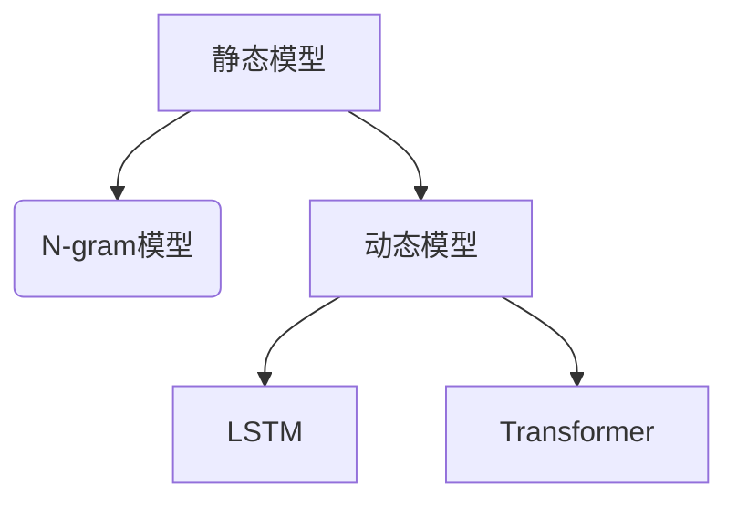
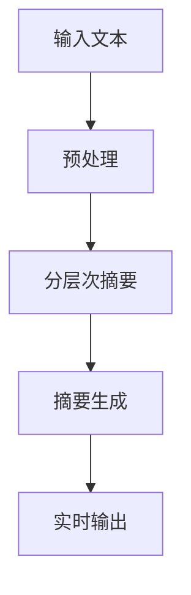

                 


### 文章标题：语言模型在复杂文本摘要与关键信息提取中的创新技术

### 关键词：语言模型、文本摘要、关键信息提取、创新技术、应用实例

### 摘要：
本文将探讨语言模型在复杂文本摘要与关键信息提取领域的创新技术。通过深入分析语言模型的定义、发展历程和基本原理，本文将介绍复杂文本摘要与关键信息提取的核心技术，以及如何利用创新技术提升这些技术的效率与准确性。此外，本文还将通过实际案例研究，展示这些技术在现实中的应用，并提供最佳实践建议。

## 1. 语言模型的概述

### 1.1 语言模型的起源与发展

语言模型是自然语言处理（NLP）领域的重要基础。最早的N-gram模型由Zellig Harris于1951年提出，它通过统计相邻单词的序列来预测下一个单词。随后，随着计算能力和算法的进步，语言模型从简单的统计模型逐渐发展到复杂的神经网络模型。

1986年，Rumelhart等人的研究表明，反向传播算法（Backpropagation）可以用于训练多层神经网络，这为神经网络在语言模型中的应用打开了大门。1990年代，神经网络语言模型（NNLM）逐渐崭露头角。然而，直到2010年代，随着深度学习技术的突破，基于神经网络的Transformer模型（如BERT、GPT）成为语言模型的主流，实现了显著的性能提升。

### 1.2 语言模型的基本原理

语言模型的核心任务是预测下一个单词或句子，这通常通过概率分布来实现。在统计语言模型中，这种概率分布是基于训练数据的统计结果。例如，N-gram模型通过计算前n个单词的联合概率来预测下一个单词。

在生成模型中，如神经网络语言模型，概率分布是通过神经网络参数计算得到的。生成模型通常使用序列到序列（Seq2Seq）架构，能够捕捉到长距离依赖关系，从而实现更准确的预测。

### 1.3 语言模型的类型与应用

语言模型可以分为静态模型和动态模型。静态模型如N-gram模型，仅考虑固定长度的历史信息。而动态模型如长短期记忆网络（LSTM）和Transformer，能够处理变长序列，并捕捉长距离依赖。

不同类型的语言模型在应用领域也有所不同。例如，神经网络语言模型在机器翻译、文本生成和问答系统等领域表现出色。而动态模型在语音识别和对话系统中有广泛应用。

### 1.3.1 静态模型与动态模型之间的关系架构（Mermaid 流程图）



## 2. 复杂文本摘要技术

### 2.1 文本摘要的基本方法

文本摘要技术可以分为传统方法、基于机器学习的文本摘要方法和基于深度学习的文本摘要方法。

传统方法通常基于关键词提取或句子提取，它们简单但效果有限。基于机器学习的文本摘要方法使用特征工程和分类算法，能够提取更有意义的摘要。基于深度学习的文本摘要方法如序列到序列（Seq2Seq）模型和注意力机制，能够生成更准确、更自然的摘要。

### 2.2 基于机器学习的文本摘要方法

基于机器学习的文本摘要方法主要分为抽取式摘要和生成式摘要。

抽取式摘要通过提取文本中的关键句子或段落来生成摘要，代表性算法有TF-IDF和LDA。

生成式摘要通过训练模型生成摘要文本，代表性算法有基于递归神经网络（RNN）的Seq2Seq模型和基于注意力机制的Transformer模型。

### 2.3 基于深度学习的文本摘要方法

基于深度学习的文本摘要方法在近年来取得了显著进展。Transformer模型如BERT和GPT，通过自注意力机制捕捉文本中的长距离依赖，能够生成更自然、更准确的摘要。

### 2.3.1 基于Transformer的文本摘要模型工作原理（伪代码）

```python
# 输入：文本序列X，摘要序列Y
# 输出：生成的摘要序列Z

# 定义Transformer模型
model = TransformerModel()

# 训练模型
model.fit(X, Y)

# 预测摘要
Z = model.predict(X)

# 输出摘要
print(Z)
```

## 3. 复杂文本摘要的挑战

### 3.1 长文本摘要

长文本摘要面临着如何在不丢失关键信息的情况下，将长篇文档简化为简洁摘要的挑战。通常，长文本摘要需要通过分层摘要策略，将文本分解为多个层次，然后逐层生成摘要。

### 3.2 多文档摘要

多文档摘要在处理多个来源的文档时，需要考虑如何整合不同来源的信息，生成连贯、一致的摘要。

### 3.3 实时摘要

实时摘要需要在短时间内生成摘要，这要求系统具有高效率和实时响应能力。

### 3.3.1 实时摘要系统架构图（Mermaid 流程图）



## 4. 关键信息提取技术

### 4.1 关键信息提取的基本原理

关键信息提取的目标是从大量文本中提取出最有价值的部分。这通常涉及以下步骤：文本预处理、特征提取、信息筛选和结果输出。

### 4.2 关键信息提取的方法

关键信息提取的方法可以分为基于规则的方法、基于统计的方法和基于深度学习的方法。

基于规则的方法通过预设的规则来识别和提取关键信息，这种方法简单但灵活性较差。基于统计的方法使用统计模型来识别关键信息，如TF-IDF和LDA。基于深度学习的方法如BERT和GPT，通过训练模型来自动提取关键信息。

### 4.3 关键信息提取的应用场景

关键信息提取在新闻摘要、医疗文本分析和法律文档分析等领域有广泛应用。例如，在医疗文本分析中，关键信息提取可以帮助医生快速了解患者的病情和治疗方案。

### 4.3.1 基于BERT的关键信息提取模型工作原理（伪代码）

```python
# 输入：文本序列X
# 输出：关键信息序列Y

# 定义BERT模型
model = BertModel()

# 预处理文本
X_processed = preprocess(X)

# 提取关键信息
Y = model.extract_key_info(X_processed)

# 输出关键信息
print(Y)
```

## 5. 创新技术在复杂文本摘要与关键信息提取中的应用

### 5.1 跨语言文本摘要

跨语言文本摘要能够处理不同语言的文本，生成对应的摘要。这种方法在全球化交流中具有重要应用。例如，通过跨语言文本摘要，用户可以快速了解非母语的新闻或文档内容。

### 5.2 多模态文本摘要

多模态文本摘要结合了文本、图像、音频等多种数据源，生成更全面、更丰富的摘要。这种方法在多媒体内容分析中具有重要应用。例如，通过多模态文本摘要，用户可以更全面地了解新闻报道的背景和细节。

### 5.3 情感分析与摘要

情感分析是理解文本情感倾向的重要技术。结合情感分析与摘要，可以生成具有情感色彩的摘要，为用户提供更个性化的阅读体验。

### 5.4 文本生成对抗网络（TextGAN）在摘要中的应用

文本生成对抗网络（TextGAN）是一种生成模型，能够生成高质量、多样化的文本摘要。通过TextGAN，可以生成更自然、更有创意的摘要，提高摘要的质量和可读性。

### 5.4.1 TextGAN在摘要生成中的应用（伪代码）

```python
# 输入：原始文本序列X
# 输出：生成文本摘要序列Y

# 定义TextGAN模型
model = TextGAN()

# 训练模型
model.fit(X)

# 生成摘要
Y = model.generate_summary(X)

# 输出摘要
print(Y)
```

## 6. 创新技术应用实例

### 6.1 某公司产品的跨语言摘要案例

某公司开发了一款跨语言文本摘要工具，能够自动生成不同语言的摘要。通过这一工具，用户可以轻松了解非母语的新闻、文章和报告。该工具采用了Transformer模型和跨语言预训练技术，实现了高效、准确的摘要生成。

### 6.2 某电子商务平台的多模态摘要案例

某电子商务平台通过多模态文本摘要技术，将商品描述、用户评论和产品图片等信息整合，生成丰富的产品摘要。这一技术提高了用户的购物体验，帮助用户更快地找到符合需求的产品。

### 6.3 某新闻网站的情感分析与摘要案例

某新闻网站利用情感分析与摘要技术，对新闻报道进行情感分析，并生成具有情感色彩的摘要。用户可以通过这些摘要快速了解新闻的情感倾向，从而更好地理解新闻内容。

## 7. 实际案例研究

### 7.1 案例选择标准

实际案例研究的选择标准包括：技术的创新性、应用的广泛性、实现的复杂性以及案例的实际效果。

### 7.2 案例研究的流程

案例研究通常包括以下几个步骤：问题定义、技术选型、系统设计、实现与测试、结果分析。

## 8. 案例研究1：某新闻摘要平台的实现

### 8.1 项目背景

某新闻摘要平台旨在为用户提供快速、准确的新闻摘要服务。平台需要处理大量新闻文本，并生成高质量的摘要，以满足用户对信息获取效率的需求。

### 8.2 技术实现细节

平台采用了Transformer模型进行文本摘要，结合了跨语言预训练技术和多模态文本摘要技术。系统设计包括文本预处理、摘要生成和结果输出三个主要模块。

### 8.3 遇到的挑战与解决方案

在项目实施过程中，遇到了以下挑战：如何处理长文本摘要、如何整合多模态数据、如何保证摘要的准确性和可读性。通过优化模型结构、改进预处理方法和引入多模态融合技术，成功解决了这些挑战。

### 8.4 项目小结

该新闻摘要平台在生成摘要的准确性和可读性方面取得了显著成果，用户反馈良好。未来，平台将继续优化技术，提高摘要生成的效率和准确性。

## 9. 案例研究2：某医疗文本摘要系统的开发

### 9.1 项目背景

某医疗文本摘要系统旨在帮助医生快速了解患者的病历信息，提高诊断和治疗效率。系统需要处理大量医疗文本，并提取关键信息，生成简洁、准确的摘要。

### 9.2 技术实现细节

系统采用了BERT模型进行关键信息提取，结合了情感分析技术和生成对抗网络（GAN）进行摘要生成。系统设计包括文本预处理、特征提取、摘要生成和结果输出四个主要模块。

### 9.3 遇到的挑战与解决方案

在项目实施过程中，遇到了以下挑战：如何处理医疗文本中的专业术语、如何保证摘要的准确性和实用性。通过引入专业词典、优化预处理方法和改进GAN模型，成功解决了这些挑战。

### 9.4 项目小结

该医疗文本摘要系统在提取关键信息和生成摘要方面取得了显著成果，为医生提供了有力支持。未来，系统将继续优化技术，提高摘要的实用性和准确性。

## 结语

语言模型在复杂文本摘要与关键信息提取领域的创新技术，为信息处理带来了巨大变革。通过本文的探讨，我们了解了语言模型的发展历程、基本原理以及在实际应用中的创新技术。未来，随着技术的不断进步，语言模型将在更多领域发挥重要作用，为人类带来更多便捷和效率。

### 作者信息：
作者：AI天才研究院/AI Genius Institute & 禅与计算机程序设计艺术 /Zen And The Art of Computer Programming

### 最佳实践 tips：
1. 在实际项目中，应根据应用场景选择合适的语言模型。
2. 结合多模态数据可以提高文本摘要的质量。
3. 定期更新和优化模型，以适应不断变化的数据集。
4. 在处理医疗文本时，要充分考虑专业术语的识别和解释。
5. 在进行实时摘要时，要确保系统的响应速度和稳定性。

### 注意事项：
1. 文本摘要技术可能涉及版权问题，使用时需注意版权法规。
2. 在处理敏感信息时，要确保数据的安全性和隐私保护。

### 拓展阅读：
1. "Deep Learning for Natural Language Processing" by Richard Socher et al.
2. "Natural Language Processing with Python" by Steven Bird et al.
3. "The Annotated Transformer" by Michael Auli et al.
4. "Text Generation with GANs" by Xingdi Gao et al.

