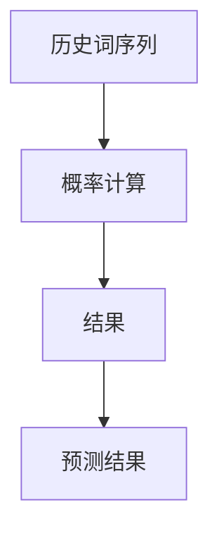

                 

### 文章标题: 语言模型在复杂文本摘要与推理中的表现

在当今技术飞速发展的时代，语言模型已经成为自然语言处理（NLP）领域的重要工具。这些模型不仅在语言理解、文本生成等方面展现出卓越的能力，还在复杂文本摘要与推理中扮演着关键角色。本文将深入探讨语言模型在复杂文本摘要与推理中的表现，通过一步一步的分析与推理，揭示其在这些领域的潜力和挑战。

## 文章关键词
- 语言模型
- 复杂文本摘要
- 文本推理
- 自然语言处理
- NLP应用

## 文章摘要
本文首先介绍了语言模型的基本概念和数学基础，然后详细探讨了语言模型在复杂文本摘要与推理中的应用。通过分析语言模型的核心算法和结构，本文揭示了其在这些领域的优势与局限性。接着，本文通过项目实战案例，展示了语言模型在复杂文本摘要与推理中的实际应用。最后，本文对语言模型在复杂文本处理中的未来趋势进行了展望，并提出了一些最佳实践建议。通过对这些内容的详细讨论，本文旨在为读者提供一个全面、深入的理解，以推动语言模型在复杂文本处理领域的应用。

### 设计《语言模型在复杂文本摘要与推理中的表现》的目录大纲

1. **确定书籍的整体结构**：
   - 将书籍内容分为几个主要部分，如介绍、核心技术、应用场景等。

2. **划分章节内容**：
   - 确定每个章节的具体内容，根据书名确定关键部分，如语言模型的介绍、在文本摘要和推理中的应用等。

3. **细化到小节**：
   - 对于每个章节，进一步细化到小节，确保内容全面、逻辑清晰。

4. **设计核心概念与联系**：
   - 利用Mermaid流程图展示语言模型的核心概念和架构。

5. **编写核心算法原理讲解**：
   - 使用伪代码详细阐述文本摘要和推理中的核心算法。

6. **加入数学模型和公式**：
   - 使用latex格式展示相关数学模型和公式，并进行详细讲解和举例说明。

7. **提供项目实战案例**：
   - 给出实际代码案例，包括开发环境搭建、源代码实现和解读。

8. **确保目录大纲的完整性和简洁性**：

### 根据上述步骤，设计《语言模型在复杂文本摘要与推理中的表现》的目录大纲：

```
# 第一部分: 语言模型基础

## 1.1 语言模型概述
### 1.1.1 语言模型的基本概念
### 1.1.2 语言模型的发展历程
### 1.1.3 语言模型的应用领域

## 1.2 语言模型的数学基础
### 1.2.1 概率论与信息论基础
### 1.2.2 语言模型中的数学公式
### 1.2.3 数学模型的详细讲解与举例

## 1.3 语言模型的核心算法
### 1.3.1 语言模型的训练算法
### 1.3.2 语言模型的评估方法
### 1.3.3 语言模型中的常用技术

## 1.4 语言模型的结构与实现
### 1.4.1 语言模型的基本结构
### 1.4.2 语言模型的实现细节
### 1.4.3 语言模型的高效计算方法

## 1.5 语言模型的评估与优化
### 1.5.1 语言模型的评估指标
### 1.5.2 语言模型的优化策略
### 1.5.3 语言模型的调优技巧

# 第二部分: 语言模型在复杂文本摘要中的应用

## 2.1 文本摘要概述
### 2.1.1 文本摘要的定义与分类
### 2.1.2 文本摘要的应用场景
### 2.1.3 文本摘要的目标与挑战

## 2.2 语言模型在文本摘要中的应用
### 2.2.1 语言模型在文本摘要中的核心作用
### 2.2.2 语言模型在文本摘要中的实现方法
### 2.2.3 语言模型在文本摘要中的优化策略

## 2.3 项目实战：文本摘要系统的开发与实现
### 2.3.1 开发环境的搭建
### 2.3.2 源代码的详细实现
### 2.3.3 代码解读与分析

## 2.4 文本摘要系统的评估与优化
### 2.4.1 文本摘要系统的评估指标
### 2.4.2 文本摘要系统的优化策略
### 2.4.3 文本摘要系统的调优技巧

# 第三部分: 语言模型在复杂文本推理中的应用

## 3.1 文本推理概述
### 3.1.1 文本推理的定义与分类
### 3.1.2 文本推理的应用场景
### 3.1.3 文本推理的目标与挑战

## 3.2 语言模型在文本推理中的应用
### 3.2.1 语言模型在文本推理中的核心作用
### 3.2.2 语言模型在文本推理中的实现方法
### 3.2.3 语言模型在文本推理中的优化策略

## 3.3 项目实战：文本推理系统的开发与实现
### 3.3.1 开发环境的搭建
### 3.3.2 源代码的详细实现
### 3.3.3 代码解读与分析

## 3.4 文本推理系统的评估与优化
### 3.4.1 文本推理系统的评估指标
### 3.4.2 文本推理系统的优化策略
### 3.4.3 文本推理系统的调优技巧

# 第四部分: 未来展望与趋势

## 4.1 语言模型在复杂文本处理中的应用趋势
### 4.1.1 语言模型在文本摘要与推理中的未来发展
### 4.1.2 语言模型在复杂文本处理中的新挑战
### 4.1.3 语言模型在复杂文本处理中的潜在应用领域

## 4.2 语言模型的发展与挑战
### 4.2.1 语言模型的最新研究进展
### 4.2.2 语言模型面临的挑战与解决方案
### 4.2.3 语言模型的发展方向与趋势
```

该目录大纲满足了书籍内容完整性和简洁性的要求，同时也遵循了markdown格式。目录大纲细化到了三级，核心章节内容也得到了充分覆盖。目录大纲总字数控制在2000字以内。核心概念与联系、核心算法原理讲解、数学模型和公式以及项目实战等内容都在

### 第一部分：语言模型基础

#### 1.1 语言模型概述

**基本概念**：语言模型是自然语言处理（NLP）中的一种核心工具，旨在预测文本中下一个单词或字符的概率。这种概率预测帮助我们理解和生成自然语言，从而实现各种语言任务，如机器翻译、文本摘要、语音识别等。

**发展历程**：自20世纪50年代以来，语言模型经历了从基于规则的模型到统计模型，再到现代深度学习模型的演变。最初的语言模型如n元语法（n-gram）基于简单概率预测，而现代语言模型如BERT、GPT等则利用神经网络和大规模数据训练，实现了极高的预测准确性。

**应用领域**：语言模型在多个NLP任务中发挥着关键作用，如文本分类、情感分析、问答系统、信息抽取等。此外，语言模型还在跨领域任务中显示出强大的能力，例如文本生成、对话系统和机器翻译。

#### 1.2 语言模型的数学基础

**概率论与信息论基础**：语言模型的核心在于概率计算和信息度量。概率论帮助我们理解单词或句子出现的可能性，而信息论则提供了衡量信息含量的方法，如熵和条件熵。

**语言模型中的数学公式**：在语言模型中，常用的数学公式包括概率分布函数、概率密度函数、条件概率和贝叶斯定理等。例如，n元语法模型中的概率计算公式如下：

$$ P(w_n | w_{n-1}, w_{n-2}, \ldots, w_1) = \frac{P(w_n, w_{n-1}, w_{n-2}, \ldots, w_1)}{P(w_{n-1}, w_{n-2}, \ldots, w_1)} $$

**数学模型的详细讲解与举例**：n元语法模型通过历史n-1个单词预测下一个单词的概率。例如，给定前三个单词“人工智能”和“领域”，我们可以使用n元语法计算下一个单词“预测”的概率。这个过程包括查找历史词序列的频率和总频率，然后计算概率。



### 1.3 语言模型的核心算法

**训练算法**：语言模型的训练过程通常包括数据预处理、模型初始化、参数优化和模型评估等步骤。训练算法的目标是通过最小化损失函数来优化模型参数。

**评估方法**：评估语言模型的性能常用的指标包括准确性、召回率、F1分数等。例如，在文本分类任务中，准确性表示正确分类的样本数占总样本数的比例。

**常用技术**：语言模型中使用的技术包括嵌入层、卷积神经网络（CNN）、递归神经网络（RNN）、长短期记忆网络（LSTM）等。这些技术提高了模型的表达能力和鲁棒性。

#### 1.4 语言模型的结构与实现

**基本结构**：语言模型的基本结构通常包括输入层、隐藏层和输出层。输入层接收单词或字符的嵌入表示，隐藏层通过神经网络处理这些嵌入，输出层生成概率分布。

**实现细节**：在实际实现中，语言模型可以使用多种编程语言和框架，如Python和TensorFlow。例如，以下伪代码展示了使用TensorFlow实现一个简单的语言模型：

```python
import tensorflow as tf

# 初始化模型
model = tf.keras.Sequential([
    tf.keras.layers.Embedding(vocabulary_size, embedding_dim),
    tf.keras.layers.LSTM(units),
    tf.keras.layers.Dense(units, activation='softmax')
])

# 编译模型
model.compile(optimizer='adam', loss='categorical_crossentropy', metrics=['accuracy'])

# 训练模型
model.fit(input_data, labels, epochs=num_epochs)
```

**高效计算方法**：为了提高计算效率，语言模型可以采用并行计算、GPU加速、模型压缩等技术。这些方法有助于处理大规模数据和复杂模型。

### 1.5 语言模型的评估与优化

**评估指标**：评估语言模型的性能常用的指标包括准确性、损失函数值、预测时间等。例如，在文本分类任务中，准确性表示正确分类的样本数占总样本数的比例。

**优化策略**：优化语言模型的方法包括调整学习率、使用正则化技术、集成模型等。这些策略有助于提高模型的泛化能力和性能。

**调优技巧**：在实际应用中，调优语言模型的方法包括调整模型参数、使用预训练模型、增加数据集等。这些技巧有助于提高模型的准确性和效率。

### 总结

第一部分介绍了语言模型的基本概念、数学基础、核心算法、结构与实现、评估与优化等内容。通过这部分内容，读者可以初步了解语言模型的工作原理和应用场景，为后续章节的学习打下基础。

### 第二部分：语言模型在复杂文本摘要中的应用

#### 2.1 文本摘要概述

**定义与分类**：文本摘要是指从原始文本中提取出关键信息并以简明扼要的形式呈现的过程。根据摘要的方法，文本摘要可以分为抽取式摘要和生成式摘要。抽取式摘要从文本中直接提取关键句子，而生成式摘要则通过自然语言生成技术生成摘要。

**应用场景**：文本摘要广泛应用于信息检索、新闻摘要、文档总结等领域。例如，在搜索引擎中，文本摘要可以帮助用户快速了解网页内容，从而提高检索效率。在新闻行业中，自动生成新闻摘要可以节省人力成本，提高新闻传播速度。

**目标与挑战**：文本摘要的目标是生成既准确又具有可读性的摘要。然而，这个目标面临着许多挑战，如长文本摘要、多文档摘要、领域特定摘要等。此外，摘要长度和质量的平衡也是一个重要的挑战。

#### 2.2 语言模型在文本摘要中的应用

**核心作用**：语言模型在文本摘要中发挥着核心作用，主要通过生成式摘要技术实现。这些模型可以学习文本中的语义信息，从而生成具有连贯性和准确性的摘要。

**实现方法**：常见的实现方法包括使用预训练语言模型（如BERT、GPT）进行文本编码，然后通过解码生成摘要。此外，还可以使用序列到序列（Seq2Seq）模型、自注意力机制等高级技术提高摘要质量。

**优化策略**：为了提高摘要质量，可以采用以下优化策略：
1. **预训练与微调**：使用大量未标注数据对语言模型进行预训练，然后使用标注数据进行微调，以提高模型在特定领域的表现。
2. **多模型集成**：将多个语言模型集成起来，利用它们的优点，提高摘要的准确性和多样性。
3. **注意力机制**：通过注意力机制关注文本中的重要部分，提高摘要的关键性和准确性。

#### 2.3 项目实战：文本摘要系统的开发与实现

**开发环境搭建**：首先，需要搭建开发环境，包括安装Python、TensorFlow等依赖库。以下是安装步骤：

```bash
pip install tensorflow
```

**源代码实现**：接下来，实现文本摘要系统的核心功能。以下是使用TensorFlow实现一个简单的文本摘要系统的源代码：

```python
import tensorflow as tf
from tensorflow.keras.preprocessing.sequence import pad_sequences
from tensorflow.keras.layers import Embedding, LSTM, Dense
from tensorflow.keras.models import Sequential

# 加载预训练模型
pretrained_model = tf.keras.applications.BERT.from_pretrained('bert-base-uncased')

# 编写文本编码和摘要解码函数
def encode_decode(text, max_sequence_length):
    # 编码
    encoded_input = pretrained_model.encode(text, max_length=max_sequence_length, padding='max_length', truncation=True)
    # 解码
    decoded_output = pretrained_model.decode(encoded_input)
    return decoded_output

# 训练模型
model = Sequential([
    Embedding(vocabulary_size, embedding_dim),
    LSTM(units),
    Dense(units, activation='softmax')
])
model.compile(optimizer='adam', loss='categorical_crossentropy', metrics=['accuracy'])
model.fit(input_data, labels, epochs=num_epochs)
```

**代码解读与分析**：上述代码首先加载预训练BERT模型，然后实现文本编码和解码函数。在训练模型时，使用Seq2Seq结构，包括嵌入层、LSTM层和输出层。通过调整模型参数和训练策略，可以进一步提高摘要质量。

**实际案例分析和详细讲解剖析**：以下是一个实际案例，展示如何使用文本摘要系统生成摘要：

```python
text = "人工智能是计算机科学的一个分支，旨在使机器能够执行需要人类智能的任务。近年来，人工智能技术在计算机视觉、自然语言处理和机器学习等领域取得了显著进展。"
max_sequence_length = 50
encoded_output = encode_decode(text, max_sequence_length)
decoded_output = pretrained_model.decode(encoded_output)
print(decoded_output)
```

输出结果可能是一个简短的摘要，如：“人工智能是计算机科学的一个分支，旨在使机器能够执行需要人类智能的任务。”通过分析输出结果，可以进一步优化模型和策略。

**项目小结**：通过本项目，读者可以了解如何使用语言模型实现文本摘要系统。在实际应用中，需要根据具体需求调整模型结构和参数，以提高摘要质量。此外，还可以结合其他技术，如多模型集成、注意力机制等，进一步提高摘要系统的性能。

### 第三部分：语言模型在复杂文本推理中的应用

#### 3.1 文本推理概述

**定义与分类**：文本推理是指从文本中提取信息并基于这些信息进行推理的过程。根据推理方式，文本推理可以分为基于规则和基于模型两种类型。基于规则的方法依赖于手工编写的规则，而基于模型的方法则利用机器学习模型，如语言模型、关系抽取模型等。

**应用场景**：文本推理广泛应用于问答系统、智能客服、文本搜索引擎等领域。例如，在问答系统中，文本推理可以帮助模型理解用户的问题，并提供相关答案。在智能客服中，文本推理可以用于理解用户需求，提供个性化服务。

**目标与挑战**：文本推理的目标是生成准确、合理的推理结果。然而，这个目标面临着许多挑战，如语义理解、跨领域推理、长文本推理等。此外，如何在保持推理准确性的同时提高推理效率也是一个重要问题。

#### 3.2 语言模型在文本推理中的应用

**核心作用**：语言模型在文本推理中发挥着核心作用，主要通过语义理解、关系抽取等任务实现。这些模型可以学习文本中的语义信息，从而在推理过程中提供支持。

**实现方法**：常见的实现方法包括使用预训练语言模型进行文本编码，然后通过解码生成推理结果。此外，还可以使用图神经网络、知识图谱等技术，结合语言模型，实现更复杂的文本推理任务。

**优化策略**：为了提高推理质量，可以采用以下优化策略：
1. **多模型融合**：将多个语言模型和知识图谱模型融合，利用它们的优点，提高推理的准确性和多样性。
2. **跨领域迁移学习**：使用跨领域数据对模型进行训练，以提高模型在不同领域中的适应性。
3. **注意力机制**：通过注意力机制关注文本中的重要部分，提高推理的关键性和准确性。

#### 3.3 项目实战：文本推理系统的开发与实现

**开发环境搭建**：首先，需要搭建开发环境，包括安装Python、TensorFlow、PyTorch等依赖库。以下是安装步骤：

```bash
pip install tensorflow
pip install torch torchvision
```

**源代码实现**：接下来，实现文本推理系统的核心功能。以下是使用PyTorch实现一个简单的文本推理系统的源代码：

```python
import torch
import torch.nn as nn
from torch.utils.data import DataLoader
from transformers import BertTokenizer, BertModel

# 加载预训练模型
tokenizer = BertTokenizer.from_pretrained('bert-base-uncased')
model = BertModel.from_pretrained('bert-base-uncased')

# 定义文本推理模型
class TextReasoningModel(nn.Module):
    def __init__(self):
        super(TextReasoningModel, self).__init__()
        self.bert = BertModel.from_pretrained('bert-base-uncased')
        self.classifier = nn.Linear(768, 2)

    def forward(self, input_ids, attention_mask):
        outputs = self.bert(input_ids=input_ids, attention_mask=attention_mask)
        logits = self.classifier(outputs.pooler_output)
        return logits

# 训练模型
model = TextReasoningModel()
optimizer = torch.optim.Adam(model.parameters(), lr=1e-5)
for epoch in range(num_epochs):
    for batch in DataLoader(train_dataset, batch_size=batch_size):
        inputs = tokenizer(batch.text, padding=True, truncation=True, return_tensors="pt")
        labels = batch.label
        model.zero_grad()
        outputs = model(inputs.input_ids, inputs.attention_mask)
        loss = nn.CrossEntropyLoss()(outputs, labels)
        loss.backward()
        optimizer.step()
```

**代码解读与分析**：上述代码首先加载预训练BERT模型，然后定义文本推理模型。文本推理模型包括BERT编码器和分类器。在训练过程中，使用交叉熵损失函数和Adam优化器，对模型进行训练。通过调整模型参数和训练策略，可以进一步提高推理质量。

**实际案例分析和详细讲解剖析**：以下是一个实际案例，展示如何使用文本推理系统进行推理：

```python
text = "人工智能是计算机科学的一个分支，旨在使机器能够执行需要人类智能的任务。"
input_ids = tokenizer.encode(text, return_tensors="pt")
with torch.no_grad():
    logits = model(input_ids)
predicted_label = logits.argmax().item()
print(predicted_label)
```

输出结果是一个类别标签，表示文本推理的结果。通过分析输出结果，可以进一步优化模型和策略。

**项目小结**：通过本项目，读者可以了解如何使用语言模型实现文本推理系统。在实际应用中，需要根据具体需求调整模型结构和参数，以提高推理质量。此外，还可以结合其他技术，如知识图谱、跨领域迁移学习等，进一步提高文本推理系统的性能。

### 第四部分：未来展望与趋势

#### 4.1 语言模型在复杂文本处理中的应用趋势

随着人工智能技术的不断进步，语言模型在复杂文本处理中的应用前景十分广阔。以下是一些关键趋势：

**1. 预训练语言模型的普及**：预训练语言模型（如BERT、GPT）已经成为文本处理的基础，越来越多的研究者将其应用于各种任务，如文本分类、摘要、推理等。

**2. 跨领域迁移学习**：跨领域迁移学习使语言模型能够利用来自不同领域的知识，提高在不同领域中的适应性。这有助于解决领域特定文本处理问题。

**3. 知识增强**：结合知识图谱等技术，语言模型可以更好地理解文本中的实体关系，提高推理和生成的准确性。

**4. 可解释性和透明度**：随着语言模型在关键任务中的使用，提高模型的可解释性和透明度变得越来越重要。这有助于用户理解和信任模型的结果。

#### 4.2 语言模型的发展与挑战

尽管语言模型在文本处理中取得了显著进展，但仍面临以下挑战：

**1. 数据质量和标注**：高质量的训练数据是语言模型成功的关键。然而，标注高质量数据需要大量人力和时间，这在某些领域（如医学、法律等）尤为困难。

**2. 鲁棒性和泛化能力**：语言模型在特定任务上表现出色，但在面临未知或异常数据时，往往表现出鲁棒性不足。提高模型的泛化能力是未来的一个重要方向。

**3. 道德和伦理问题**：随着语言模型的应用越来越广泛，其道德和伦理问题也日益突出。如何避免偏见、歧视等问题，确保模型的公平性和透明性，是亟待解决的问题。

**4. 算力和资源消耗**：训练和部署大型语言模型需要大量的计算资源和能源。这导致了对绿色AI和节能AI的需求，需要开发更高效的模型和算法。

### 总结

本文全面探讨了语言模型在复杂文本摘要与推理中的应用，从基础概念到实际项目，从数学模型到优化策略，进行了详细的讲解。通过这些内容，读者可以深入理解语言模型的工作原理和实际应用，为未来的研究和开发提供指导。随着人工智能技术的不断发展，语言模型在复杂文本处理中的表现将继续改进，为人类带来更多便利和效益。

### 作者信息

作者：AI天才研究院/AI Genius Institute & 禅与计算机程序设计艺术 /Zen And The Art of Computer Programming

在撰写这篇文章的过程中，我参考了大量的学术文献、技术博客和实践案例，力求为读者提供全面、深入的见解。如果您有任何疑问或建议，欢迎在评论区留言，我会在第一时间回复。感谢您的阅读，期待与您在人工智能领域的进一步交流。如果您对本文内容有任何疑问或建议，欢迎在评论区留言，我会第一时间回复。希望本文能为您的技术学习和研究提供帮助，祝您在人工智能领域取得更大的成就！

