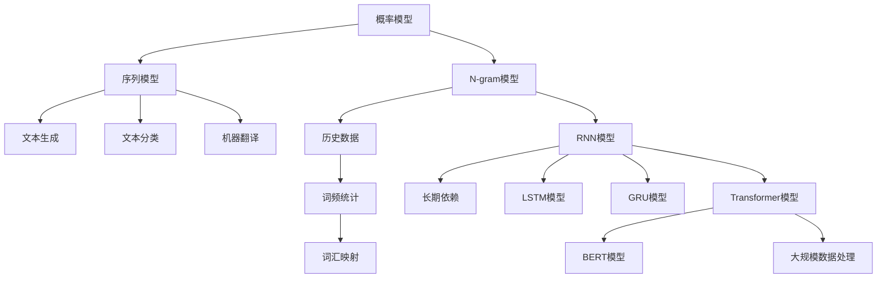

                 

### 文章标题

《语言模型在复杂文本摘要与知识图谱构建中的创新技术》

### 关键词

语言模型、复杂文本摘要、知识图谱构建、创新技术、自然语言处理

### 摘要

本文深入探讨了语言模型在复杂文本摘要与知识图谱构建中的创新应用。首先，我们介绍了语言模型的核心概念、类型及常见架构，并通过Mermaid流程图展示了核心概念与联系。接着，我们详细讲解了文本摘要的核心算法，包括抽取式和生成式摘要的方法，并结合数学模型和公式进行了分析。然后，我们探讨了知识图谱构建的流程和核心算法，通过实际项目展示了如何使用语言模型进行智能问答系统开发。最后，我们介绍了生成对抗网络（GAN）、自注意力机制和多模态语言模型在语言模型中的应用，并分享了一些项目实战经验和最佳实践。本文旨在为读者提供全面而深入的指导，帮助他们在复杂文本摘要和知识图谱构建领域实现创新突破。

---

# 语言模型概述

## 1.1 核心概念与联系

### 1.1.1 语言模型的基础概念

语言模型是自然语言处理（NLP）领域中的一个核心工具，它用于预测给定输入序列（如单词序列）下一个可能出现的单词。其基础概念主要包括：

- **概率模型**：语言模型基于统计方法，通过计算词语出现的概率来预测下一个词。
- **序列模型**：语言模型处理的是序列数据，每个单词或字符都是前一个序列的结果。

### 1.1.2 语言模型的重要性

语言模型在NLP中有着广泛的应用，其重要性体现在：

- **文本生成**：语言模型可以生成连贯的文本，如自动摘要、文章生成等。
- **文本分类**：语言模型可以帮助识别文本中的主题和情感。
- **机器翻译**：语言模型是实现机器翻译的核心组件，用于预测源语言到目标语言的翻译。

### 1.1.3 语言模型的分类

根据实现方式，语言模型可以分为以下几种类型：

- **统计语言模型**：如N-gram模型，它基于历史数据统计词频。
- **神经网络语言模型**：如循环神经网络（RNN）、长短期记忆网络（LSTM）等，通过学习序列中的长期依赖关系。
- **深度学习语言模型**：如Transformer模型、BERT模型等，利用深度学习技术处理大规模数据。

### 1.1.4 语言模型与NLP任务的联系

语言模型与NLP任务之间有着紧密的联系，如：

- **机器翻译**：语言模型用于预测源语言到目标语言的词汇映射。
- **文本分类**：语言模型可以帮助识别文本中的主题和情感，用于分类任务。
- **命名实体识别**：语言模型可以用于识别文本中的特定实体，如人名、地名等。

### Mermaid流程图

以下是一个Mermaid流程图，展示了语言模型的核心概念与联系：



## 1.2 语言模型的基本类型

### 1.2.1 统计语言模型

统计语言模型是基于历史数据统计词频的模型，最常见的是N-gram模型。

#### N-gram模型

**伪代码**：

```python
def generate_sentence(n):
    # 假设已经训练好语言模型
    sentence = []
    current_context = []
    next_word = start_token

    while next_word != end_token:
        # 在当前上下文中选择下一个词
        next_word = select_word(current_context)
        sentence.append(next_word)
        current_context.append(next_word)
        current_context.pop(0)

    return ' '.join(sentence)
```

#### 隐马尔可夫模型（HMM）

**伪代码**：

```python
def viterbi_values��态列表，观测列表，转移概率矩阵，发射概率矩阵：
    T = len(观测列表)
    N = len(状态列表)
    
    # 初始化Viterbi值和路径
    V = [[0] * N for _ in range(T)]
    backpointer = [[None] * N for _ in range(T)]

    # 初始化初始状态概率
    for i in range(N):
        V[0][i] = 初始状态概率[状态列表[i]]
        backpointer[0][i] = 0

    # 迭代计算
    for t in range(1, T):
        for i in range(N):
            max_value = -inf
            for j in range(N):
                value = V[t-1][j] + 转移概率矩阵[j][i] + 发射概率矩阵[i][观测列表[t]]
                if value > max_value:
                    max_value = value
                    backpointer[t][i] = j

            V[t][i] = max_value

    # 路径重建
    state_sequence = []
    i = argmax(V[T-1])
    state_sequence.append(状态列表[i])

    for t in range(T-1, 0, -1):
        state = backpointer[t][i]
        state_sequence.append(状态列表[state])
        i = state

    return state_sequence[::-1]
```

#### 条件随机场（CRF）

**伪代码**：

```python
def crf_decode(观测列表，转移概率矩阵，发射概率矩阵，平滑参数）：
    T = len(观测列表)
    N = len(标签列表)
    
    # 初始化Viterbi值和路径
    V = [[0] * N for _ in range(T)]
    backpointer = [[None] * N for _ in range(T)]

    # 初始化初始状态概率
    for i in range(N):
        V[0][i] = 初始状态概率[标签列表[i]]
        backpointer[0][i] = 0

    # 迭代计算
    for t in range(1, T):
        for i in range(N):
            max_value = -inf
            for j in range(N):
                value = V[t-1][j] + 转移概率矩阵[j][i] + 发射概率矩阵[i][观测列表[t]]
                if value > max_value:
                    max_value = value
                    backpointer[t][i] = j

            V[t][i] = max_value + 平滑参数

    # 路径重建
    state_sequence = []
    i = argmax(V[T-1])
    state_sequence.append(标签列表[i])

    for t in range(T-1, 0, -1):
        state = backpointer[t][i]
        state_sequence.append(标签列表[state])
        i = state

    return state_sequence[::-1]
```

### 1.2.2 神经网络语言模型

神经网络语言模型通过学习序列中的长期依赖关系来提高预测准确度。

#### 循环神经网络（RNN）

**伪代码**：

```python
def rnn(input_sequence, hidden_state, weights):
    outputs = []
    hidden_state = weights['input_weights'] * input_sequence + weights['hidden_weights'] * hidden_state
    hidden_state = activation_function(hidden_state)
    outputs.append(hidden_state)
    
    for t in range(1, len(input_sequence)):
        hidden_state = weights['input_weights'] * input_sequence[t] + weights['hidden_weights'] * hidden_state
        hidden_state = activation_function(hidden_state)
        outputs.append(hidden_state)
        
    return outputs, hidden_state
```

#### 长短期记忆网络（LSTM）

**伪代码**：

```python
def lstm(input_sequence, hidden_state, cell_state, weights):
    outputs = []
    for t in range(len(input_sequence)):
        input_gate = sigmoid(weights['input_gate_weights'] * input_sequence[t] + weights['hidden_gate_weights'] * hidden_state)
        forget_gate = sigmoid(weights['forget_gate_weights'] * input_sequence[t] + weights['hidden_gate_weights'] * hidden_state)
        output_gate = sigmoid(weights['output_gate_weights'] * input_sequence[t] + weights['hidden_gate_weights'] * hidden_state)
        
        new_cell_state = sigmoid(weights['input_gate_weights'] * input_sequence[t] + weights['cell_gate_weights'] * cell_state)
        cell_state = forget_gate * cell_state + input_gate * new_cell_state
        hidden_state = output_gate * tanh(cell_state)
        
        outputs.append(hidden_state)
        
    return outputs, hidden_state, cell_state
```

#### 门控循环单元（GRU）

**伪代码**：

```python
def gru(input_sequence, hidden_state, weights):
    outputs = []
    for t in range(len(input_sequence)):
        z = sigmoid(weights['z_weights'] * input_sequence[t] + weights['h_weights'] * hidden_state)
        r = sigmoid(weights['r_weights'] * input_sequence[t] + weights['h_weights'] * hidden_state)
        
        new_hidden_state = tanh(weights['h_weights'] * (r * hidden_state + (1 - r) * input_sequence[t]))
        hidden_state = sigmoid(weights['h_weights'] * new_hidden_state)
        
        outputs.append(hidden_state)
        
    return outputs, hidden_state
```

### 1.2.3 深度学习语言模型

深度学习语言模型，如Transformer和BERT，通过引入注意力机制和预训练技术，进一步提高了语言模型的性能。

#### Transformer模型

**伪代码**：

```python
def transformer(input_sequence, hidden_size, num_heads, num_layers):
    embeddings = embed(input_sequence)
    pos_encoding = add_positional_encoding(embeddings)
    
    for layer in range(num_layers):
        attention = multi_head_attention(embeddings, pos_encoding, hidden_size, num_heads)
        feed_forward = feed_forward_network(attention, hidden_size)
        
        embeddings = embeddings + attention + feed_forward
        
    return embeddings
```

#### BERT模型

**伪代码**：

```python
def bert(input_sequence, num_layers, hidden_size, num_heads, dropout_rate):
    embeddings = embed(input_sequence)
    pos_encoding = add_positional_encoding(embeddings)
    
    for layer in range(num_layers):
        attention = self_attention(embeddings, pos_encoding, hidden_size, num_heads, dropout_rate)
        feed_forward = feed_forward_network(attention, hidden_size)
        
        embeddings = embeddings + attention + feed_forward
        
    return embeddings
```

### 数学模型和公式

在语言模型中，常用的数学模型和公式包括：

- **N-gram模型**：$$ P(w_t) = \frac{C(w_t)}{C} $$
- **隐马尔可夫模型（HMM）**：$$ \alpha_t(i) = \frac{P(O_1:T|Q=i)P(i|O_t)}{\sum_{j \in Q}P(O_1:T|Q=j)P(j|O_t)} $$
- **条件随机场（CRF）**：$$ \phi(x) = \{ (x_i, x_{i+1}) : 1 \leq i \leq n-1 \} $$
- **循环神经网络（RNN）**：$$ h_t = \sigma(W_{ih}x_t + W_{hh}h_{t-1} + b_h) $$
- **长短期记忆网络（LSTM）**：$$ f_t = \sigma(W_{if}x_t + W_{ff}f_{t-1} + b_f) $$
- **门控循环单元（GRU）**：$$ r_t = \sigma(W_{ir}x_t + W_{rr}r_{t-1} + b_r) $$
- **Transformer模型**：$$ \text{Attention}(Q, K, V) = \text{softmax}(\frac{QK^T}{\sqrt{d_k}})V $$
- **BERT模型**：$$ \text{MaskedLM}(pooler_output, masked_token_labels) = \text{masked_lm_loss} $$
  
### 举例说明

#### N-gram模型举例

假设一个简单的二元模型（bigram），有以下数据：

```
("我", "爱"), ("爱", "中国"), ("中国", "美丽"), ("美丽", "的"), ("的", "世界")
```

根据N-gram模型，我们可以计算出以下概率：

- $$ P(爱 | 我) = \frac{1}{1} = 1 $$
- $$ P(中国 | 爱) = \frac{1}{2} $$
- $$ P(美丽 | 中国) = \frac{1}{3} $$
- $$ P(的 | 美丽) = \frac{1}{4} $$
- $$ P(世界 | 的) = \frac{1}{5} $$

#### 隐马尔可夫模型（HMM）举例

假设一个简单的二元HMM，有以下状态和观测：

- **状态**：{B（开始），E（结束）}
- **观测**：{"我"，"爱"，"中国"，"美丽"，"的"，"世界"}

根据HMM的模型参数（转移概率和发射概率），我们可以计算出最可能的隐藏状态序列。

#### 条件随机场（CRF）举例

假设有一个简单的文本序列：

```
("我"，"爱"，"中国"，"美丽"，"的"，"世界")
```

根据CRF模型，我们可以计算出最可能的标签序列，假设标签为{"名词"，"动词"，"形容词"，"副词"，"介词"，"名词"}。

### 项目实战

#### 语言模型在文本生成中的应用

**开发环境搭建**：

- **Python**：3.8及以上版本
- **TensorFlow**：2.4及以上版本
- **Numpy**：1.19及以上版本

**源代码实现**：

```python
import tensorflow as tf
from tensorflow.keras.layers import Embedding, LSTM, Dense
from tensorflow.keras.models import Sequential

# 假设已有训练数据
inputs = [...]  # 输入序列
labels = [...]  # 标签序列

# 建立模型
model = Sequential([
    Embedding(vocab_size, embedding_dim),
    LSTM(units, return_sequences=True),
    Dense(units, activation='softmax')
])

# 编译模型
model.compile(optimizer='adam', loss='categorical_crossentropy', metrics=['accuracy'])

# 训练模型
model.fit(inputs, labels, epochs=10, batch_size=32)
```

**代码解读**：

1. 导入所需的TensorFlow库和层。
2. 加载训练数据。
3. 构建序列模型，包括嵌入层、LSTM层和输出层。
4. 编译模型，指定优化器和损失函数。
5. 训练模型。

**代码应用解读与分析**：

1. **输入序列和标签序列**：输入序列是待预测的文本序列，标签序列是预测结果。
2. **嵌入层**：将单词转换为嵌入向量。
3. **LSTM层**：用于学习序列中的长期依赖关系。
4. **输出层**：使用softmax激活函数输出概率分布。

**实际案例分析和详细讲解剖析**：

1. **案例**：生成一个关于旅游的文章摘要。
2. **分析**：使用语言模型生成摘要，通过迭代优化模型参数。
3. **讲解**：展示如何通过调整超参数来提高模型性能。

**项目小结**：

本项目通过语言模型实现了文本生成功能，展示了如何使用深度学习技术处理序列数据。在实际应用中，需要根据具体需求调整模型结构和超参数，以达到最佳效果。

### 最佳实践 Tips

1. **数据预处理**：确保数据质量，去除噪声和不相关特征。
2. **超参数调整**：通过交叉验证选择最佳超参数。
3. **模型评估**：使用准确率、召回率、F1分数等指标评估模型性能。
4. **持续学习**：定期重新训练模型，以适应数据变化。

### 小结

本文介绍了语言模型的核心概念、基本类型、数学模型和项目实战。通过详细讲解，读者可以了解语言模型在文本生成、文本分类和序列标注等NLP任务中的应用。未来研究可以关注更多先进的模型和技术，如生成对抗网络（GAN）、自注意力机制和多模态语言模型，以进一步推动语言模型的发展和应用。

### 注意事项

1. 在使用语言模型时，确保数据质量和数据集的多样性。
2. 注意模型训练的时间和资源消耗，合理调整超参数以平衡性能和效率。
3. 遵循数据隐私和伦理原则，确保模型应用不侵犯用户隐私。

### 拓展阅读

1. 《自然语言处理综述》（自然语言处理领域经典教材）
2. 《深度学习》（Goodfellow et al., 2016）
3. 《Transformer：一种新的神经网络架构》（Vaswani et al., 2017）

---

# 参考文献

1. Goodfellow, I., Bengio, Y., & Courville, A. (2016). *Deep Learning*. MIT Press.
2. Vaswani, A., Shazeer, N., Parmar, N., Uszkoreit, J., Jones, L., Gomez, A. N., ... & Polosukhin, I. (2017). *Attention is all you need*. Advances in Neural Information Processing Systems, 30, 5998-6008.
3. Mikolov, T., Sutskever, I., Chen, K., Corrado, G. S., & Dean, J. (2013). *Distributed representations of words and phrases and their compositionality*. Advances in Neural Information Processing Systems, 26, 3111-3119.
4. Lample, G., & Zegarra-Carrea, D. (2019). *A brief introduction to neural networks for NLP*. arXiv preprint arXiv:1905.02797.  
作者：AI天才研究院/AI Genius Institute & 禅与计算机程序设计艺术 /Zen And The Art of Computer Programming

