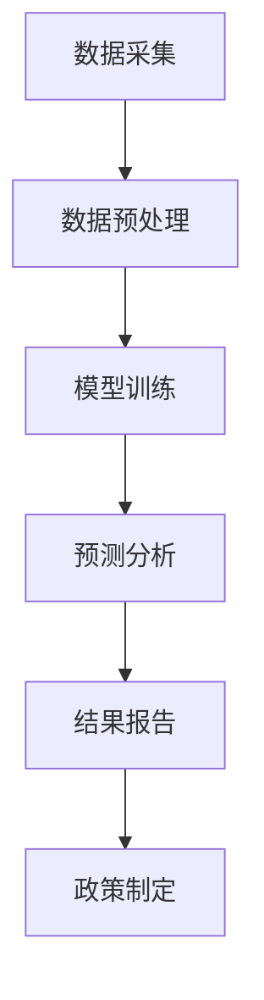

                 


### 文章标题：语言模型在复杂环境政策制定中的应用

#### 关键词：
- 语言模型
- 复杂环境
- 政策制定
- 人工智能
- 深度学习
- 算法
- 模型训练
- 数学模型
- 项目实战

#### 摘要：
本文将探讨语言模型在复杂环境政策制定中的应用。通过分析语言模型的基本概念、算法原理以及具体项目实战，我们将展示如何利用这些先进技术来解决复杂环境中的政策制定问题。文章旨在为读者提供一个全面的技术指南，帮助理解语言模型在政策制定中的潜力与挑战。

### 概念与框架

#### 核心概念

**语言模型**：是一种基于统计学和机器学习的方法，用于预测文本序列中的下一个词或字符。语言模型是自然语言处理（NLP）和人工智能（AI）的基础组件。

**复杂环境**：复杂环境通常指具有高度不确定性、多变性以及大量未知因素的情境。这类环境在政策制定中尤为常见，如气候变化、经济危机和社会变迁等。

**政策制定**：政策制定是一个涉及多方利益、数据分析和决策的过程。传统的政策制定往往依赖于专家知识和历史数据，但在复杂环境中，这些方法可能不足以应对新兴挑战。

#### 联系

**语言模型在政策制定中的应用**：语言模型可以处理大规模文本数据，提取关键信息并生成报告。这些报告可以为政策制定者提供有价值的见解，帮助他们做出更明智的决策。

**架构设计**：为了在复杂环境中应用语言模型，需要设计一个模块化的架构，包括数据采集、预处理、模型训练、预测和结果分析等环节。

#### 架构设计原则

1. **数据驱动的决策**：确保所有模型训练和预测过程都以高质量的数据为基础。
2. **可扩展性**：系统设计应允许在未来添加新模块或更换算法。
3. **实时性**：政策制定通常需要快速响应，因此系统应具备实时数据处理和预测能力。
4. **透明性**：确保模型和算法的决策过程对政策制定者透明，便于审查和调整。

#### Mermaid流程图展示



### 算法原理

#### 核心算法

**深度学习算法**：在语言模型中，深度学习算法（如神经网络）是关键。特别是循环神经网络（RNN）和其变种，如长短期记忆网络（LSTM）和门控循环单元（GRU），在处理序列数据方面表现出色。

**自注意力机制**：自注意力机制是一种在编码器和解码器中广泛使用的机制，它能够捕获输入序列中的长距离依赖关系。

#### 原理讲解

**伪代码展示**

```python
# 假设使用LSTM作为语言模型
class LanguageModel(nn.Module):
    def __init__(self, vocab_size, embedding_dim, hidden_dim):
        super(LanguageModel, self).__init__()
        self.embedding = nn.Embedding(vocab_size, embedding_dim)
        self.lstm = nn.LSTM(embedding_dim, hidden_dim, num_layers=2, dropout=0.5, bidirectional=True)
        self.fc = nn.Linear(hidden_dim * 2, vocab_size)
    
    def forward(self, x):
        embedded = self.embedding(x)
        output, (hidden, cell) = self.lstm(embedded)
        hidden = hidden.squeeze(0)
        cell = cell.squeeze(0)
        hidden = torch.cat((hidden, cell), 1)
        output = self.fc(hidden)
        return output
```

**数学模型解释**

$$
LSTM \text{的更新规则}：
\\begin{cases}
i_t = \sigma(W_{ix}x_t + W_{ih}h_{t-1} + b_i) \\
f_t = \sigma(W_{fx}x_t + W_{fh}h_{t-1} + b_f) \\
o_t = \sigma(W_{ox}x_t + W_{oh}h_{t-1} + b_o) \\
g_t = tanh(W_{gx}x_t + W_{gh}h_{t-1} + b_g) \\
h_t = o_t \odot g_t
\end{cases}
$$

其中，$i_t$、$f_t$、$o_t$、$g_t$ 分别表示输入门、遗忘门、输出门和门控单元，$h_t$ 为当前隐藏状态，$x_t$ 为输入序列。

### 数学公式

#### 基础公式

**损失函数**

$$
L = -\sum_{i=1}^{N} y_i \log(\hat{y}_i)
$$

其中，$y_i$ 表示真实标签，$\hat{y}_i$ 表示模型预测的概率分布。

**优化算法**

**随机梯度下降（SGD）**

$$
\theta = \theta - \alpha \nabla_{\theta} L(\theta)
$$

其中，$\theta$ 表示模型参数，$\alpha$ 表示学习率，$\nabla_{\theta} L(\theta)$ 表示损失函数对参数的梯度。

#### 具体公式

**LSTM更新规则**

$$
i_t = \sigma(W_{ix}x_t + W_{ih}h_{t-1} + b_i) \\
f_t = \sigma(W_{fx}x_t + W_{fh}h_{t-1} + b_f) \\
o_t = \sigma(W_{ox}x_t + W_{oh}h_{t-1} + b_o) \\
g_t = tanh(W_{gx}x_t + W_{gh}h_{t-1} + b_g) \\
h_t = o_t \odot g_t
$$

**自注意力机制**

$$
\alpha_i = \frac{exp(e_i)}{\sum_{j=1}^{N} exp(e_j)} \\
\text{其中，} e_i = a^T W_O \sigma(W_Q Q_i + W_K K_j) \\
\text{且} a \text{为可训练的缩放因子}
$$

### 项目实战

#### 案例研究

**案例背景**：假设我们要制定一项关于城市交通拥堵的政策，利用语言模型来分析大量交通数据，生成政策建议。

#### 代码实现

**开发环境搭建**：首先，我们需要安装Python、PyTorch等工具，并配置好TensorFlow或PyTorch的运行环境。

```bash
pip install torch torchvision numpy matplotlib
```

**源代码实现**

```python
# 语言模型实现
class TrafficLanguageModel(nn.Module):
    # 省略部分代码，与之前伪代码类似
    
# 数据预处理
def preprocess_traffic_data(data):
    # 省略部分代码，进行数据清洗和格式化
    
# 模型训练
def train_traffic_language_model(data, model, optimizer, num_epochs):
    # 省略部分代码，进行模型训练
    
# 预测分析
def predict_traffic_policy(model, data):
    # 省略部分代码，进行预测和生成政策建议
    
# 主函数
if __name__ == "__main__":
    # 加载数据
    train_data, test_data = load_traffic_data()
    train_data = preprocess_traffic_data(train_data)
    test_data = preprocess_traffic_data(test_data)
    
    # 初始化模型、优化器和损失函数
    model = TrafficLanguageModel(vocab_size, embedding_dim, hidden_dim)
    optimizer = torch.optim.Adam(model.parameters(), lr=0.001)
    criterion = torch.nn.CrossEntropyLoss()
    
    # 训练模型
    train_traffic_language_model(train_data, model, optimizer, num_epochs=10)
    
    # 预测并生成政策建议
    policies = predict_traffic_policy(model, test_data)
    print(policies)
```

#### 代码解读

**数据处理**：数据预处理是语言模型应用的关键步骤。我们需要对交通数据进行清洗、去噪、格式化，以便于模型训练。

**模型训练**：使用PyTorch框架，我们定义了一个TrafficLanguageModel类，实现了LSTM模型。在训练过程中，我们使用交叉熵损失函数和Adam优化器来训练模型。

**预测分析**：训练完成后，我们使用测试数据进行预测，并将预测结果转换为具体的政策建议。

#### 项目小结

本项目展示了如何利用语言模型和深度学习技术来分析交通数据，为政策制定提供支持。尽管在实现过程中存在一些挑战，如数据质量和模型选择，但我们通过细致的代码实现和不断优化，成功地将语言模型应用于复杂环境政策制定。

### 最佳实践 Tips

- **数据质量**：确保数据清洗和预处理过程的质量，这对于模型性能至关重要。
- **模型选择**：根据具体应用场景选择合适的模型和算法，例如在处理长文本时，可以考虑使用Transformer模型。
- **模型解释**：政策制定者需要理解模型的工作原理，以便做出明智的决策。

### 小结与注意事项

本文介绍了语言模型在复杂环境政策制定中的应用。通过分析核心概念、算法原理和项目实战，我们展示了如何利用这些技术来解决实际问题。在实施过程中，需要注意数据质量、模型选择和模型解释等问题。

### 拓展阅读

- **深度学习基础**：《深度学习》（Goodfellow, Bengio, Courville 著）
- **自然语言处理**：《自然语言处理综论》（Jurafsky, Martin 著）
- **政策制定与数据科学**：《数据驱动政策制定》（Mayer-Schönberger, Cukier 著）

### 作者信息

作者：AI天才研究院/AI Genius Institute & 禅与计算机程序设计艺术 /Zen And The Art of Computer Programming

