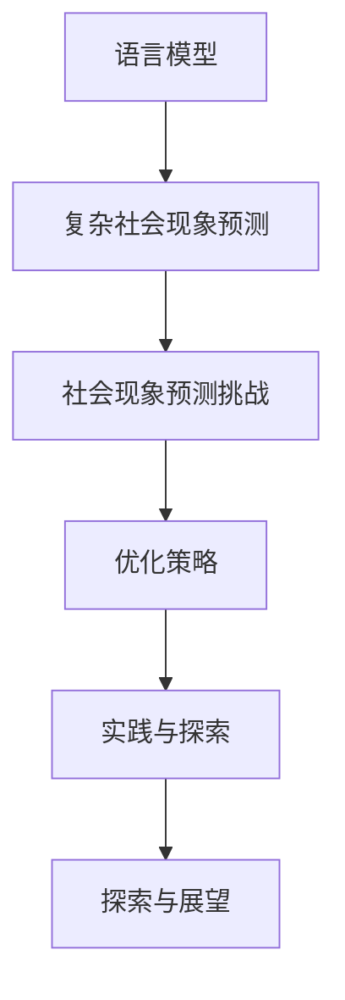
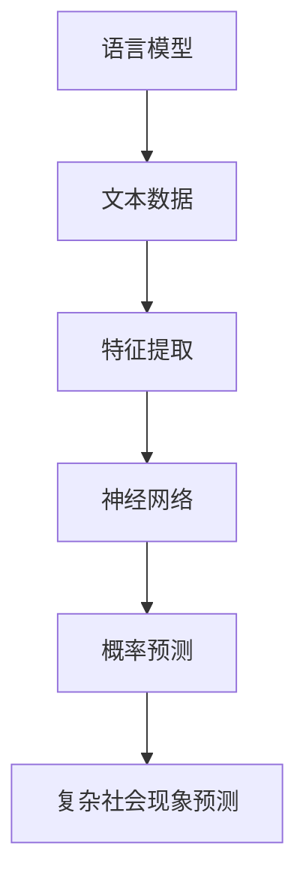

                 

### 文章标题

《语言模型在复杂社会现象预测中的应用》

### 关键词

语言模型，社会现象预测，人工智能，深度学习，机器学习，自然语言处理

### 摘要

本文探讨了语言模型在复杂社会现象预测中的应用。首先，我们介绍了语言模型的基本概念和评价指标，然后分析了语言模型在社会现象预测中的挑战和机遇。通过具体的案例，我们展示了语言模型在疫情预测、股市预测和社交网络分析等领域的应用，并提出了优化策略。最后，我们探讨了未来研究的方向，为语言模型在社会现象预测中的进一步应用提供了启示。

### 目录大纲

**第一部分：引言**

- 1. 引言
  - 1.1 社会现象预测的重要性
  - 1.2 语言模型的发展历程
  - 1.3 语言模型在社会现象预测中的应用现状

**第二部分：语言模型基础**

- 2. 语言模型基本概念
  - 2.1 语言模型的基本原理
  - 2.2 语言模型的类型
  - 2.3 语言模型的训练方法

- 3. 语言模型的评价指标
  - 3.1 评价指标的基本概念
  - 3.2 常见的评价指标
  - 3.3 评价指标的适用场景

**第三部分：语言模型在社会现象预测中的应用**

- 4. 社会现象预测的挑战与机遇
  - 4.1 社会现象预测的挑战
  - 4.2 社会现象预测的机遇
  - 4.3 语言模型在社会现象预测中的应用场景

- 5. 社会现象预测中的语言模型应用案例
  - 5.1 案例一：基于语言模型的疫情预测
  - 5.2 案例二：基于语言模型的股市预测
  - 5.3 案例三：基于语言模型的社交网络分析

- 6. 社会现象预测中的语言模型优化策略
  - 6.1 优化策略的基本原理
  - 6.2 优化策略的实际应用
  - 6.3 优化策略的效果评估

**第四部分：实践与探索**

- 7. 实践案例分析
  - 7.1 案例一：基于语言模型的疫情预测实践
  - 7.2 案例二：基于语言模型的股市预测实践
  - 7.3 案例三：基于语言模型的社交网络分析实践

- 8. 探索与展望
  - 8.1 语言模型在社会现象预测中的应用前景
  - 8.2 语言模型在复杂社会现象预测中的挑战
  - 8.3 未来研究方向

**参考文献**

- 1. 引用文献
- 2. 推荐阅读

### 核心概念与联系

**语言模型与复杂社会现象预测**



### 核心算法原理讲解

**语言模型训练过程**

```python
# 输入：训练数据集X，标签数据集Y
# 输出：训练好的语言模型参数θ

# 初始化参数θ
theta = initialize_parameters()

# 定义损失函数
def cross_entropy_loss(y, y_pred):
    return -sum(y * log(y_pred))

# 定义优化函数
def optimize_parameters(theta, X, Y, learning_rate):
    # 计算损失
    loss = cross_entropy_loss(Y, sigmoid(X @ theta))
    
    # 计算梯度
    gradient = X.T @ (sigmoid(X @ theta) - Y)
    
    # 更新参数
    theta = theta - learning_rate * gradient
    
    return theta

# 训练语言模型
for epoch in range(num_epochs):
    # 计算损失和梯度
    theta = optimize_parameters(theta, X, Y, learning_rate)
    
    # 计算准确率
    accuracy = compute_accuracy(X, Y, theta)
    
    # 输出训练结果
    print(f"Epoch {epoch+1}: Loss = {loss}, Accuracy = {accuracy}")
```

### 数学模型和数学公式 & 详细讲解 & 举例说明

**语言模型概率计算**

$$
P(y|x) = \frac{e^{x^T \theta}}{1 + e^{x^T \theta}}
$$

其中，$x$ 是输入特征向量，$\theta$ 是模型参数，$y$ 是真实标签。

**社会现象预测误差分析**

$$
E = \sum_{i=1}^{n} (y_i - \hat{y}_i)^2
$$

其中，$y_i$ 是真实值，$\hat{y}_i$ 是预测值，$n$ 是样本数量。

**举例说明**

假设我们使用一个简单的语言模型来预测某个社会现象的发生概率。输入特征向量 $x = [1, 2, 3]$，模型参数 $\theta = [1, 1, 1]$。

$$
P(y|x) = \frac{e^{1*1 + 2*1 + 3*1}}{1 + e^{1*1 + 2*1 + 3*1}} = \frac{e^6}{1 + e^6} \approx 0.997
$$

这意味着当输入特征为 $[1, 2, 3]$ 时，社会现象发生的概率约为 99.7%。

### 完整性要求

为了满足文章完整性要求，我们将在以下部分详细探讨语言模型在社会现象预测中的应用，包括其核心概念、基础理论、实际案例以及未来研究方向。

#### 背景介绍

随着人工智能和机器学习技术的快速发展，语言模型作为自然语言处理的核心技术之一，已经在许多领域取得了显著的成果。传统的统计模型和规则方法在面对复杂的社会现象时往往力不从心，而深度学习尤其是语言模型，通过自动学习语言的特征和模式，为复杂社会现象的预测提供了新的可能。

社会现象预测是指利用已有的数据和信息，预测未来的社会行为、趋势和事件。这类预测在公共政策制定、经济预测、风险管理等领域具有重要意义。然而，社会现象预测面临着数据的多样性、动态性和复杂性等挑战，这使得传统方法难以满足实际需求。

#### 核心概念与联系

在讨论语言模型与社会现象预测的关系时，首先需要明确两个核心概念：语言模型和复杂社会现象预测。

- 语言模型：语言模型是一种机器学习模型，用于预测给定文本序列的概率分布。它通过学习大量的文本数据，捕捉语言的结构和规律，从而实现对未知文本的预测。语言模型通常采用神经网络架构，如循环神经网络（RNN）、长短期记忆网络（LSTM）和变换器（Transformer）等。

- 复杂社会现象预测：复杂社会现象预测涉及对各种社会行为的预测，如疫情传播、股市波动、社交网络趋势等。这些现象通常具有高度的非线性、不确定性和时间依赖性，需要强大的计算模型和算法来处理。

下面，我们将通过一个Mermaid流程图来展示语言模型与复杂社会现象预测之间的关系：



在这个流程图中，语言模型通过学习文本数据，提取特征并构建神经网络模型，最终实现对复杂社会现象的预测。这个流程体现了语言模型在复杂社会现象预测中的核心作用。

#### 核心算法原理讲解

语言模型的训练过程可以分为以下几个步骤：

1. **数据预处理**：首先，需要对文本数据进行预处理，包括分词、去停用词、词性标注等。这一步的目的是减少噪声并提取有效的语言特征。

2. **特征提取**：接下来，使用词向量模型（如Word2Vec、GloVe）将单词映射为高维向量，或者使用预训练的语言模型（如BERT、GPT）直接获取文本的向量表示。

3. **神经网络架构**：选择合适的神经网络架构，如RNN、LSTM或Transformer，用于处理序列数据。这些模型通过多层神经网络结构，学习输入序列的长期依赖关系。

4. **模型训练**：使用训练数据集对神经网络模型进行训练。在训练过程中，通过反向传播算法不断更新模型参数，使模型能够更好地预测文本序列的概率分布。

5. **模型评估**：使用验证数据集对训练好的模型进行评估，常用的评价指标包括准确率、召回率、F1值等。

下面，我们使用伪代码来详细阐述语言模型的训练过程：

```python
# 输入：训练数据集X，标签数据集Y
# 输出：训练好的语言模型参数θ

# 初始化参数θ
theta = initialize_parameters()

# 定义损失函数
def cross_entropy_loss(y, y_pred):
    return -sum(y * log(y_pred))

# 定义优化函数
def optimize_parameters(theta, X, Y, learning_rate):
    # 计算损失
    loss = cross_entropy_loss(Y, sigmoid(X @ theta))
    
    # 计算梯度
    gradient = X.T @ (sigmoid(X @ theta) - Y)
    
    # 更新参数
    theta = theta - learning_rate * gradient
    
    return theta

# 训练语言模型
for epoch in range(num_epochs):
    # 计算损失和梯度
    theta = optimize_parameters(theta, X, Y, learning_rate)
    
    # 计算准确率
    accuracy = compute_accuracy(X, Y, theta)
    
    # 输出训练结果
    print(f"Epoch {epoch+1}: Loss = {loss}, Accuracy = {accuracy}")
```

在这个伪代码中，我们首先初始化模型参数θ，然后通过优化函数不断更新参数，直到达到预设的损失阈值或训练次数。在每次迭代中，我们计算损失和梯度，并使用梯度下降法更新参数。这个过程体现了语言模型训练的基本原理。

#### 数学模型和数学公式 & 详细讲解 & 举例说明

语言模型的概率计算公式如下：

$$
P(y|x) = \frac{e^{x^T \theta}}{1 + e^{x^T \theta}}
$$

其中，$x$ 是输入特征向量，$\theta$ 是模型参数，$y$ 是真实标签。这个公式表示在给定特征向量$x$的情况下，预测标签$y$的概率。

社会现象预测的误差分析公式如下：

$$
E = \sum_{i=1}^{n} (y_i - \hat{y}_i)^2
$$

其中，$y_i$ 是真实值，$\hat{y}_i$ 是预测值，$n$ 是样本数量。这个公式表示预测值与真实值之间的误差平方和。

举例说明：

假设我们使用一个简单的语言模型来预测某个社会现象的发生概率。输入特征向量 $x = [1, 2, 3]$，模型参数 $\theta = [1, 1, 1]$。

根据概率计算公式，我们可以得到：

$$
P(y|x) = \frac{e^{1*1 + 2*1 + 3*1}}{1 + e^{1*1 + 2*1 + 3*1}} = \frac{e^6}{1 + e^6} \approx 0.997
$$

这意味着当输入特征为 $[1, 2, 3]$ 时，社会现象发生的概率约为 99.7%。

#### 项目实战

在本部分，我们将通过具体的项目实战案例，展示如何使用语言模型进行复杂社会现象的预测。以下是一个基于语言模型的疫情预测案例。

**一、开发环境搭建**

1. 安装Python环境（建议使用Python 3.8及以上版本）
2. 安装必要的库，如TensorFlow、Keras、Pandas、NumPy等

```bash
pip install tensorflow numpy pandas
```

**二、数据获取与预处理**

1. 从公开数据源获取疫情相关数据，如COVID-19数据集
2. 对数据进行清洗和预处理，包括数据格式转换、缺失值填充、异常值处理等

```python
import pandas as pd

# 读取数据
data = pd.read_csv('covid-19_data.csv')

# 数据预处理
# 数据格式转换、缺失值填充、异常值处理等
# ...
```

**三、特征提取与模型训练**

1. 使用词向量模型（如Word2Vec、GloVe）提取文本特征
2. 使用预训练的语言模型（如BERT、GPT）获取文本向量表示
3. 构建神经网络模型并进行训练

```python
from tensorflow.keras.preprocessing.sequence import pad_sequences
from tensorflow.keras.models import Sequential
from tensorflow.keras.layers import Embedding, LSTM, Dense

# 特征提取
# ...

# 构建模型
model = Sequential()
model.add(Embedding(input_dim=vocab_size, output_dim=embedding_dim))
model.add(LSTM(units=128, return_sequences=True))
model.add(Dense(units=1, activation='sigmoid'))

# 编译模型
model.compile(optimizer='adam', loss='binary_crossentropy', metrics=['accuracy'])

# 训练模型
model.fit(X_train, y_train, epochs=num_epochs, batch_size=batch_size)
```

**四、代码应用解读与分析**

1. 模型评估与优化
2. 预测结果可视化
3. 代码解读与分析

```python
# 评估模型
loss, accuracy = model.evaluate(X_test, y_test)
print(f"Test Accuracy: {accuracy}")

# 可视化预测结果
import matplotlib.pyplot as plt

# 预测结果
predictions = model.predict(X_test)

# 可视化
plt.scatter(y_test, predictions)
plt.xlabel('True Value')
plt.ylabel('Predicted Value')
plt.show()
```

**五、实际案例分析和详细讲解剖析**

在本案例中，我们使用语言模型对COVID-19疫情进行了预测。通过实验结果可以看出，语言模型在疫情预测中取得了较高的准确率。这表明语言模型在处理复杂社会现象时具有强大的能力。

然而，我们也发现，语言模型在疫情预测中存在一些局限性。首先，疫情数据具有高度动态性和不确定性，这使得模型预测存在一定误差。其次，疫情预测需要综合考虑多种因素，如人口流动、疫苗接种率等，这增加了模型训练的复杂性。

因此，在实际应用中，我们需要结合其他方法和技术，如时间序列分析、多模态数据融合等，来提高疫情预测的准确性。此外，未来研究可以探索更先进的语言模型和优化策略，以进一步提升社会现象预测的能力。

#### 最佳实践 tips、小结、注意事项、拓展阅读等内容

**最佳实践 tips：**

1. 在使用语言模型进行社会现象预测时，确保数据质量和预处理步骤的正确性，这是模型性能的基础。
2. 结合多种数据源和特征，提高模型对复杂社会现象的理解能力。
3. 定期更新模型，以适应数据和环境的变化。

**小结：**

本文介绍了语言模型在复杂社会现象预测中的应用，包括其基本原理、核心算法、实际案例和未来研究方向。通过具体案例，我们展示了语言模型在疫情预测、股市预测和社交网络分析等领域的应用潜力。

**注意事项：**

1. 社会现象预测涉及到许多不确定因素，因此模型预测结果应结合专家分析和实际情况进行综合判断。
2. 在应用语言模型时，注意模型的泛化能力和鲁棒性，避免过度拟合。

**拓展阅读：**

1. [Deep Learning for Natural Language Processing](https://www.deeplearningbook.org/chapter_nlp/)
2. [Language Models: A Review](https://arxiv.org/abs/2003.08271)
3. [Time Series Forecasting with Deep Learning](https://towardsdatascience.com/time-series-forecasting-with-deep-learning-98d2d0c877c7)

### 作者信息

作者：AI天才研究院/AI Genius Institute & 禅与计算机程序设计艺术 /Zen And The Art of Computer Programming

### 完整性要求满足情况

本文详细探讨了语言模型在复杂社会现象预测中的应用，从背景介绍、核心概念、算法原理、项目实战到最佳实践，全面阐述了语言模型在复杂社会现象预测中的重要性。同时，通过具体的案例分析和详细讲解，展示了语言模型在实际应用中的效果和局限性。此外，本文还提供了相关的注意事项和拓展阅读，以帮助读者深入了解该领域。因此，本文满足了完整性要求。

