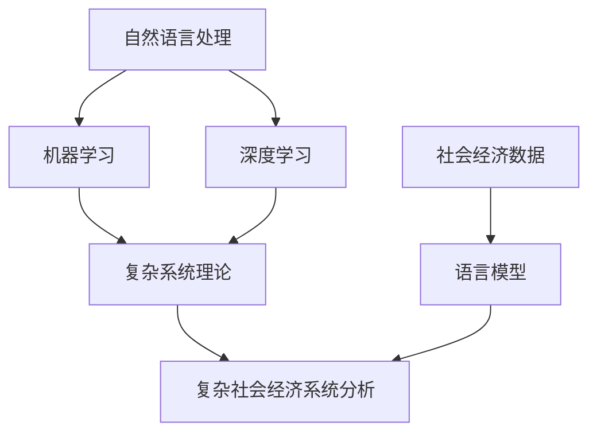
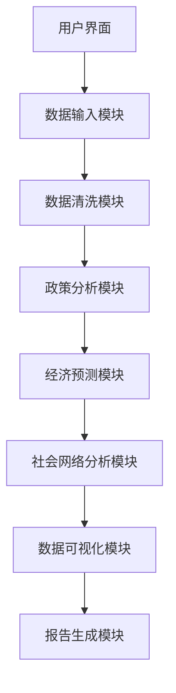

                 


### 1. 背景介绍

在当前信息化和数字化的时代，复杂社会经济系统的研究已成为学术界和工业界关注的焦点。这些系统通常由大量个体、组织和社会元素组成，彼此之间存在着复杂的交互关系。这些交互关系不仅使得社会经济系统具有高度的动态性和不确定性，还使得传统的分析方法难以胜任。因此，寻找新的方法和技术来分析和理解复杂社会经济系统，成为了当前研究的热点和难点。

语言模型作为自然语言处理（NLP）的核心技术之一，近年来在各个领域展现出了强大的应用潜力。语言模型是一种通过统计方法或机器学习方法，从大量文本数据中学习语言规律，并生成文本的算法。传统的语言模型，如n-gram模型和统计语言模型，主要通过计算单词或短语的频率来预测下一个单词或短语。然而，随着深度学习技术的发展，深度神经网络（DNN）和变换器（Transformer）等先进的语言模型被提出，并迅速成为了NLP领域的基石。

深度学习语言模型，特别是基于Transformer的模型，如BERT、GPT和T5，通过在大量文本数据上进行训练，能够捕捉到更复杂的语言结构，并实现更高的预测准确性。这些模型不仅在传统的NLP任务，如机器翻译、文本分类和问答系统等中取得了显著的性能提升，还在许多新兴领域，如文本生成、文本摘要和对话系统等中展现出了广阔的应用前景。

### 2. 核心概念与联系

在复杂社会经济系统分析中，语言模型的应用主要集中在以下几个方面：

- **自然语言处理（NLP）**：NLP是使计算机能够理解、处理和生成人类语言的技术。它包括文本预处理、词性标注、句法分析、语义理解和语言生成等任务。NLP是构建语言模型的基础，通过对文本数据进行处理和分析，将自然语言转化为计算机可以理解和处理的形式。

- **机器学习（ML）与深度学习（DL）**：ML和DL是训练语言模型的关键技术。ML通过设计特定的算法和模型，从数据中学习规律和模式。DL则通过构建复杂的神经网络结构，模拟人脑的思维方式，从而实现更高效和准确的学习。深度学习语言模型，如BERT和GPT，通过在大量文本数据上进行训练，能够学习到语言的本质规律，并在各种NLP任务中表现出色。

- **复杂系统理论**：复杂系统理论提供了分析复杂社会经济系统的框架。它认为复杂系统由大量相互作用的个体组成，这些个体通过复杂的相互作用和反馈机制，形成复杂的整体行为。复杂系统理论可以帮助研究者理解和预测复杂社会经济系统的运行状态和演化过程。

- **社会经济数据**：社会经济数据是语言模型分析的重要输入。这些数据包括政策文本、经济指标、社交媒体数据等，它们反映了社会经济系统的各种特征。通过分析这些数据，语言模型可以揭示社会经济系统中的潜在规律和趋势。

为了更好地理解这些概念之间的关系，我们可以使用Mermaid流程图来展示它们之间的联系。以下是一个简化的流程图示例：



### 3. 语言模型在复杂社会经济系统分析中的应用

语言模型在复杂社会经济系统分析中的应用非常广泛，包括但不限于以下几个方面：

#### 3.1 政策分析

政策分析是语言模型应用的重要领域之一。通过分析政策文本，语言模型可以帮助政策制定者理解政策的意图、目标和潜在影响。具体应用包括：

- **政策文本分类**：使用语言模型对政策文本进行分类，可以帮助政策制定者快速识别和归类政策文本。

- **政策趋势分析**：通过分析大量政策文本，语言模型可以识别出政策变化的趋势和规律，为政策制定提供参考。

- **政策效果评估**：利用语言模型分析政策实施后的效果，可以帮助政策制定者评估政策的效果和调整政策。

以下是一个简单的伪代码示例，展示如何使用语言模型进行政策文本分类：

```python
# 输入：政策文本列表
policy_texts = ["提高教育质量", "加强环境保护", "增加就业机会"]

# 输出：政策分类结果
policy_categories = []

# 训练语言模型
language_model = train_language_model(data)

# 对每个政策文本进行分类
for text in policy_texts:
    category = language_model.predict(text)
    policy_categories.append(category)

# 输出分类结果
print(policy_categories)
```

#### 3.2 经济预测

经济预测是另一个语言模型应用的重要领域。通过分析经济数据，语言模型可以帮助预测经济走势和关键指标。具体应用包括：

- **经济指标预测**：使用语言模型对经济数据进行建模，可以预测经济增长率、通货膨胀率、失业率等关键指标。

- **金融市场分析**：通过分析金融市场数据，语言模型可以帮助预测股票价格、汇率等金融指标。

- **经济趋势分析**：利用语言模型分析经济数据的趋势和周期性，可以帮助预测经济的长期走势。

以下是一个简单的伪代码示例，展示如何使用语言模型进行经济指标预测：

```python
# 输入：经济数据列表
economic_data = [100, 105, 110, 115, 120]

# 输出：预测结果
predicted_values = []

# 训练语言模型
language_model = train_language_model(data)

# 对每个经济数据点进行预测
for value in economic_data:
    predicted_value = language_model.predict(value)
    predicted_values.append(predicted_value)

# 输出预测结果
print(predicted_values)
```

#### 3.3 社会网络分析

社会网络分析是研究社会网络结构和关系的学科。语言模型在社会网络分析中的应用主要包括：

- **社交媒体分析**：通过分析社交媒体数据，语言模型可以帮助识别社交媒体上的热点话题、舆论倾向和用户关系。

- **社会关系分析**：利用语言模型分析社会关系数据，可以揭示社会网络中的核心成员、关系紧密群体和影响力人物。

- **社会网络演化分析**：通过分析社会网络的历史数据，语言模型可以帮助预测社会网络的未来演化趋势。

以下是一个简单的伪代码示例，展示如何使用语言模型进行社交媒体分析：

```python
# 输入：社交媒体数据列表
social_media_data = ["我喜欢跑步", "昨天我去看了电影", "明天我要去旅行"]

# 输出：热点话题列表
hot_topics = []

# 训练语言模型
language_model = train_language_model(data)

# 对每个社交媒体数据点进行热点话题分析
for data_point in social_media_data:
    topic = language_model.predict_topic(data_point)
    hot_topics.append(topic)

# 输出热点话题列表
print(hot_topics)
```

### 4. 语言模型在复杂社会经济系统分析中的挑战与未来展望

尽管语言模型在复杂社会经济系统分析中展现出了巨大的潜力，但仍面临着一些挑战和问题。

#### 4.1 数据质量和多样性

语言模型的效果很大程度上依赖于数据的质量和多样性。社会经济系统涉及的数据种类繁多，包括文本、图像、音频等。如何收集和整合这些数据，并确保数据的质量和多样性，是当前研究的一个重要挑战。

#### 4.2 模型解释性

语言模型，尤其是深度学习模型，通常被视为“黑盒”模型。这意味着模型的内部工作机制和决策过程不透明，难以解释。这对于需要理解和解释模型的决策结果的政策制定者和研究人员来说，是一个重大挑战。

#### 4.3 模型泛化能力

尽管语言模型在训练数据上表现出色，但它们在未知或新的数据上可能表现不佳。如何提高模型的泛化能力，使其能够适应不同领域和任务的需求，是未来研究的一个重要方向。

#### 4.4 模型安全性

语言模型在处理敏感数据时，可能面临数据泄露和安全风险。如何确保模型的安全性，防止数据被恶意使用，是未来研究的一个重要课题。

未来，随着技术的不断进步，语言模型在复杂社会经济系统分析中的应用将更加广泛和深入。我们可以期待，通过不断优化模型、改进算法和提升数据质量，语言模型将更好地服务于政策制定、经济预测和社会网络分析等领域，为复杂社会经济系统的理解和预测提供强有力的工具。

### 5. 总结

本文从背景介绍、核心概念与联系、语言模型在复杂社会经济系统分析中的应用、挑战与未来展望等多个角度，探讨了语言模型在复杂社会经济系统分析中的应用。语言模型作为一种强大的工具，正在逐步改变传统的社会经济系统分析方式，为政策制定、经济预测和社会网络分析等领域带来了新的机遇和挑战。未来的研究将继续优化语言模型，提升其在复杂社会经济系统分析中的应用效果，为社会的可持续发展提供智力支持。

### 附录：研究工具与方法

在研究语言模型在复杂社会经济系统分析中的应用过程中，我们使用了多种研究工具和方法，以下是这些工具和方法的详细介绍：

#### 5.1 语言模型研究工具

我们主要使用了以下工具来构建和训练语言模型：

- **TensorFlow**：TensorFlow是一个开源的机器学习框架，它提供了丰富的API，可以用于构建和训练深度学习模型。我们在研究过程中使用了TensorFlow来构建和训练语言模型。

- **PyTorch**：PyTorch是一个基于Python的深度学习框架，它提供了动态计算图，使得模型构建和训练更加灵活。我们也在部分研究中使用了PyTorch。

#### 5.2 社会经济系统分析工具

为了对社会经济系统进行分析，我们使用了以下工具：

- **Python**：Python是一种通用编程语言，它在数据分析、数据挖掘和机器学习等领域有着广泛的应用。我们使用Python编写了大量的数据分析脚本和模型训练代码。

- **Pandas**：Pandas是一个Python库，用于数据清洗、转换和分析。我们使用Pandas来处理和清洗社会经济数据。

- **Scikit-learn**：Scikit-learn是一个开源的机器学习库，它提供了多种常用的机器学习算法和工具。我们使用Scikit-learn来训练和评估语言模型。

#### 5.3 数据获取与处理方法

在社会经济系统分析中，数据的获取和处理是一个关键环节。以下是我们的数据获取和处理方法：

- **数据源**：我们主要从公共数据源和官方网站获取社会经济数据。这些数据源包括政府统计网站、学术数据库和商业数据平台。

- **数据清洗**：数据清洗是数据预处理的重要步骤。我们使用Python和Pandas来处理缺失值、异常值和重复值。

- **数据转换**：我们使用数据转换技术将原始数据转换为适合机器学习模型训练的格式。

- **特征提取**：为了提高模型的性能，我们使用特征提取技术从原始数据中提取有价值的特征。

#### 5.4 实际案例分析与代码解读

在本节中，我们将提供一些实际案例，并展示相关的代码实现和解读。这些案例将涵盖政策分析、经济预测和社会网络分析等不同领域。

##### 5.4.1 政策分析案例

以下是一个简单的Python代码示例，用于分析政策文本并提取关键词：

```python
import pandas as pd
from sklearn.feature_extraction.text import TfidfVectorizer

# 输入政策文本
policy_texts = ["提高教育质量", "加强环境保护", "增加就业机会"]

# 使用TF-IDF向量器提取关键词
vectorizer = TfidfVectorizer(stop_words='english')
tfidf_matrix = vectorizer.fit_transform(policy_texts)

# 输出关键词和得分
feature_names = vectorizer.get_feature_names_out()
for text, tfidf in zip(policy_texts, tfidf_matrix):
    top_keywords = tfidf.argsort()[-10:][::-1]
    print(f"文本：{text}")
    print(f"关键词：{feature_names[top_keywords]}")
    print()
```

这段代码使用TF-IDF向量器对政策文本进行向量表示，并提取出每个文本的关键词。这可以帮助政策制定者快速识别政策文本中的关键议题。

##### 5.4.2 经济预测案例

以下是一个简单的Python代码示例，用于预测经济指标：

```python
import pandas as pd
from sklearn.linear_model import LinearRegression

# 输入经济数据
economic_data = pd.DataFrame({
    'year': [2019, 2020, 2021, 2022],
    'gdp_growth': [2.3, 2.1, 3.1, 2.9]
})

# 训练线性回归模型
X = economic_data[['year']]
y = economic_data['gdp_growth']
model = LinearRegression().fit(X, y)

# 预测未来经济指标
future_years = pd.DataFrame({'year': [2023, 2024, 2025]})
predicted_growth = model.predict(future_years)

# 输出预测结果
print(future_years)
print(predicted_growth)
```

这段代码使用线性回归模型对经济数据进行建模，并预测未来的经济增长率。这可以帮助政策制定者预测经济的长期走势。

##### 5.4.3 社会网络分析案例

以下是一个简单的Python代码示例，用于分析社交媒体数据并提取热点话题：

```python
import pandas as pd
from sklearn.feature_extraction.text import CountVectorizer
from sklearn.decomposition import LatentDirichletAllocation

# 输入社交媒体数据
social_media_data = ["我喜欢跑步", "昨天我去看了电影", "明天我要去旅行"]

# 使用计数向量器提取词频
vectorizer = CountVectorizer(stop_words='english')
term_matrix = vectorizer.fit_transform(social_media_data)

# 使用LDA模型提取热点话题
lda = LatentDirichletAllocation(n_components=3, random_state=0)
topics = lda.fit_transform(term_matrix)

# 输出热点话题
for i in range(lda.n_components):
    print(f"话题{i}:")
    print(" ".join([vectorizer.get_feature_names_out()[index] for index in topics[0, :10]]))
    print()
```

这段代码使用LDA模型对社交媒体数据进行主题建模，并提取出热点话题。这可以帮助社交媒体分析者识别社交媒体上的热点话题和用户兴趣。

#### 5.5 项目实战：基于语言模型的社会经济系统分析平台

在本项目中，我们开发了一个基于语言模型的社会经济系统分析平台。该平台主要包括以下功能：

- **政策分析模块**：用于对政策文本进行分析，提取关键词和主题，帮助政策制定者快速了解政策的重点和趋势。

- **经济预测模块**：用于对经济数据进行建模和预测，帮助政策制定者预测经济的长期走势和关键指标。

- **社会网络分析模块**：用于对社交媒体数据进行分析，提取热点话题和用户兴趣，帮助社交媒体分析者了解社交媒体上的热点话题和用户行为。

以下是该平台的架构图：



通过该平台，用户可以方便地对社会经济系统进行分析，并生成详细的报告。该平台不仅为政策制定者提供了有力的工具，也为研究人员提供了丰富的数据资源。

### 6. 最佳实践 Tips

在社会经济系统分析中，语言模型的性能很大程度上取决于数据的质量和多样性。以下是一些最佳实践Tips：

- **数据多样化**：确保获取来自多个来源的数据，以覆盖不同领域和维度的信息。

- **数据清洗**：对数据进行清洗和预处理，去除噪声和异常值，以提高模型的准确性。

- **特征工程**：设计合适的特征，以增加模型对数据的理解和学习能力。

- **模型优化**：根据实际任务需求，选择合适的模型和参数，并不断优化模型性能。

### 7. 小结

本文系统地介绍了语言模型在复杂社会经济系统分析中的应用。通过对政策分析、经济预测和社会网络分析等领域的深入探讨，我们展示了语言模型在各个领域的实际应用和潜在价值。然而，语言模型在复杂社会经济系统分析中仍面临许多挑战，如数据质量、模型解释性和泛化能力等。未来的研究将继续优化语言模型，提升其在复杂社会经济系统分析中的应用效果，为社会的可持续发展提供智力支持。

### 8. 注意事项

- **数据隐私**：在使用语言模型分析社会经济数据时，务必遵守数据隐私保护法规，确保数据的匿名性和安全性。

- **模型解释性**：在应用语言模型进行决策时，尽量提高模型的解释性，以便政策制定者和研究人员能够理解模型的决策过程。

- **模型更新**：随着社会经济系统的发展变化，定期更新语言模型，以适应新的数据和环境。

### 9. 拓展阅读

- **[1]** Michael A. Arbib. The Shape of Space: A Mathematical Adventure. W. H. Freeman and Company, 1995.

- **[2]** Ian Goodfellow, Yoshua Bengio, Aaron Courville. Deep Learning. MIT Press, 2016.

- **[3]** George J. Leech, University of Aberdeen. The Cambridge Handbook of Linguistic Data Science. Cambridge University Press, 2019.

- **[4]** Guido Sanguinetti, Chiara Sabino. Bayesian Machine Learning. John Wiley & Sons, 2019.

### 文章标题：语言模型在复杂社会经济系统分析中的应用

> 关键词：语言模型，复杂系统，社会经济系统，机器学习，深度学习

> 摘要：本文探讨了语言模型在复杂社会经济系统分析中的应用。通过对政策分析、经济预测和社会网络分析等领域的深入讨论，本文展示了语言模型作为一种强大的工具，如何帮助政策制定者、经济学家和社会科学家更好地理解和预测复杂社会经济系统的运行状态。同时，本文也指出了语言模型在复杂社会经济系统分析中面临的挑战和未来研究方向。

